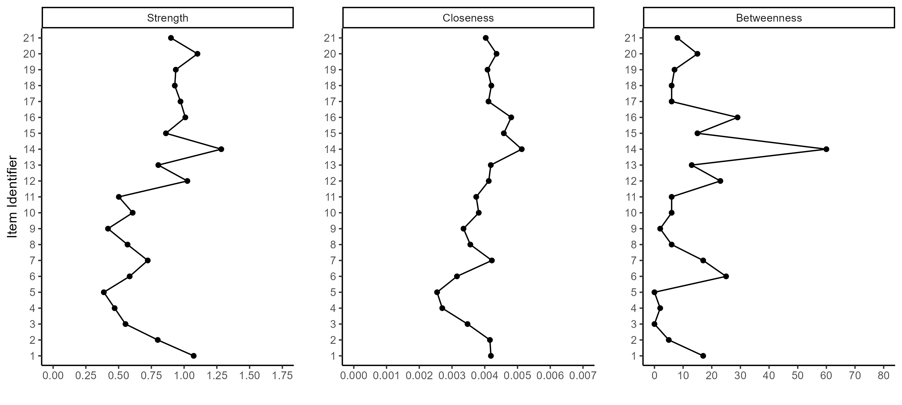

Balezina & Zakharova (2023) - Network Re-analysis
================

- <a href="#network-analysis-of-study-1"
  id="toc-network-analysis-of-study-1">Network Analysis of Study 1</a>
  - <a href="#training-network" id="toc-training-network">Training
    Network</a>
    - <a href="#fit-indices" id="toc-fit-indices">Fit Indices</a>
    - <a href="#parameter-estimates" id="toc-parameter-estimates">Parameter
      Estimates</a>
    - <a href="#network-figures" id="toc-network-figures">Network Figures</a>
  - <a href="#test-network" id="toc-test-network">Test Network</a>
    - <a href="#fit-indices-1" id="toc-fit-indices-1">Fit Indices</a>
    - <a href="#parameter-estimates-1"
      id="toc-parameter-estimates-1">Parameter Estimates</a>
    - <a href="#network-figures-1" id="toc-network-figures-1">Network
      Figures</a>
- <a href="#confirming-the-model-in-the-data-from-study-2"
  id="toc-confirming-the-model-in-the-data-from-study-2">Confirming the
  Model in the Data from Study 2</a>
  - <a href="#fit-indices-2" id="toc-fit-indices-2">Fit Indices</a>
  - <a href="#parameter-estimates-2"
    id="toc-parameter-estimates-2">Parameter Estimates</a>
  - <a href="#network-figures-2" id="toc-network-figures-2">Network
    Figures</a>
- <a href="#factor-models" id="toc-factor-models">Factor Models</a>
  - <a href="#study-1" id="toc-study-1">Study 1</a>
    - <a href="#training" id="toc-training">Training</a>
    - <a href="#test" id="toc-test">Test</a>
  - <a href="#study-2" id="toc-study-2">Study 2</a>
    - <a href="#fit-indices-5" id="toc-fit-indices-5">Fit Indices</a>
    - <a href="#parameter-estimates-5"
      id="toc-parameter-estimates-5">Parameter Estimates</a>
- <a href="#connectivity-hypothesis"
  id="toc-connectivity-hypothesis">Connectivity Hypothesis</a>
  - <a href="#low-asi-scores" id="toc-low-asi-scores">Low ASI Scores</a>
  - <a href="#moderate-asi-scores" id="toc-moderate-asi-scores">Moderate ASI
    Scores</a>
  - <a href="#high-asi-scores" id="toc-high-asi-scores">High ASI Scores</a>
- <a href="#simulated-persuasion" id="toc-simulated-persuasion">Simulated
  Persuasion</a>
  - <a href="#fitting-model-to-full-data-from-study-1"
    id="toc-fitting-model-to-full-data-from-study-1">Fitting Model to Full
    Data from Study 1</a>
    - <a href="#fit-indices-6" id="toc-fit-indices-6">Fit Indices</a>
    - <a href="#parameter-estimates-6"
      id="toc-parameter-estimates-6">Parameter Estimates</a>
    - <a href="#centrality-estimates" id="toc-centrality-estimates">Centrality
      Estimates</a>
    - <a href="#network-figures-3" id="toc-network-figures-3">Network
      Figures</a>
  - <a
    href="#creating-simulated-data-from-ising-models-based-on-the-estimated-network"
    id="toc-creating-simulated-data-from-ising-models-based-on-the-estimated-network">Creating
    Simulated Data from Ising Models Based on the Estimated Network</a>
    - <a href="#histograms-of-total-scores"
      id="toc-histograms-of-total-scores">Histograms of Total Scores</a>
    - <a href="#proportions-of-agreement-with-strongest-node"
      id="toc-proportions-of-agreement-with-strongest-node">Proportions of
      Agreement with Strongest Node</a>
    - <a
      href="#standardized-mean-difference-in-total-scores-between-baseline-and-persuasion-models"
      id="toc-standardized-mean-difference-in-total-scores-between-baseline-and-persuasion-models">Standardized
      Mean Difference in Total Scores Between Baseline and Persuasion
      Models</a>

# Network Analysis of Study 1

## Training Network

### Fit Indices

``` r
network_reduced_fit_ind_1 %>% 
  mutate(across(where(is.numeric), round, 6))
```

                                Measure         Value
    logl                           logl -17904.346296
    unrestricted.logl unrestricted.logl -17776.418990
    baseline.logl         baseline.logl -19311.983583
    nvar                           nvar     21.000000
    nobs                           nobs    252.000000
    npar                           npar     87.000000
    df                               df    165.000000
    objective                 objective     39.760583
    chisq                         chisq    255.854612
    pvalue                       pvalue      0.000007
    baseline.chisq       baseline.chisq   3071.129186
    baseline.df             baseline.df    210.000000
    baseline.pvalue     baseline.pvalue      0.000000
    nfi                             nfi      0.916690
    pnfi                           pnfi      0.720257
    tli                             tli      0.959585
    nnfi                           nnfi      0.959585
    rfi                             rfi      0.893970
    ifi                             ifi      0.968737
    rni                             rni      0.968245
    cfi                             cfi      0.968245
    rmsea                         rmsea      0.034712
    rmsea.ci.lower       rmsea.ci.lower      0.026126
    rmsea.ci.upper       rmsea.ci.upper      0.042809
    rmsea.pvalue           rmsea.pvalue      0.999365
    aic.ll                       aic.ll  35982.692592
    aic.ll2                     aic.ll2  36024.188527
    aic.x                         aic.x    -74.145388
    aic.x2                       aic.x2    429.854612
    bic                             bic  36341.540047
    bic2                           bic2  36065.429277
    ebic.25                     ebic.25  36606.413499
    ebic.5                       ebic.5  36871.286951
    ebic.75                     ebic.75  37083.185713
    ebic1                         ebic1  37401.033855

### Parameter Estimates

``` r
network_reduced_pars_1 %>% 
  mutate(across(where(is.numeric), round, 3))
```

        var1 var1_id  op var2 var2_id    est std    se     p se_boot p_boot matrix
    1   li_2       1  ~1 <NA>      NA  4.081  NA 0.084 0.000      NA     NA     mu
    2   li_3       2  ~1 <NA>      NA  3.254  NA 0.084 0.000      NA     NA     mu
    3   li_4       3  ~1 <NA>      NA  3.118  NA 0.085 0.000      NA     NA     mu
    4   fi_3       4  ~1 <NA>      NA  5.365  NA 0.084 0.000      NA     NA     mu
    5   fi_4       5  ~1 <NA>      NA  4.923  NA 0.095 0.000      NA     NA     mu
    6   fi_5       6  ~1 <NA>      NA  5.569  NA 0.089 0.000      NA     NA     mu
    7   de_1       7  ~1 <NA>      NA  3.328  NA 0.092 0.000      NA     NA     mu
    8   de_2       8  ~1 <NA>      NA  2.713  NA 0.089 0.000      NA     NA     mu
    9   de_5       9  ~1 <NA>      NA  4.291  NA 0.089 0.000      NA     NA     mu
    10  mt_2      10  ~1 <NA>      NA  3.254  NA 0.090 0.000      NA     NA     mu
    11  mt_3      11  ~1 <NA>      NA  2.722  NA 0.089 0.000      NA     NA     mu
    12  mt_4      12  ~1 <NA>      NA  3.751  NA 0.093 0.000      NA     NA     mu
    13  nr_3      13  ~1 <NA>      NA  1.814  NA 0.065 0.000      NA     NA     mu
    14  nr_4      14  ~1 <NA>      NA  2.422  NA 0.076 0.000      NA     NA     mu
    15  te_4      15  ~1 <NA>      NA  1.875  NA 0.064 0.000      NA     NA     mu
    16  sa_1      16  ~1 <NA>      NA  3.558  NA 0.095 0.000      NA     NA     mu
    17  sa_4      17  ~1 <NA>      NA  3.652  NA 0.096 0.000      NA     NA     mu
    18  sa_7      18  ~1 <NA>      NA  4.138  NA 0.096 0.000      NA     NA     mu
    19  wi_1      19  ~1 <NA>      NA  2.368  NA 0.077 0.000      NA     NA     mu
    20  wi_4      20  ~1 <NA>      NA  3.186  NA 0.077 0.000      NA     NA     mu
    21  wi_5      21  ~1 <NA>      NA  2.856  NA 0.080 0.000      NA     NA     mu
    22  li_3       2  -- li_2       1  0.270  NA 0.038 0.000      NA     NA  omega
    23  li_4       3  -- li_2       1  0.158  NA 0.041 0.000      NA     NA  omega
    24  fi_3       4  -- li_2       1  0.000  NA    NA    NA      NA     NA  omega
    25  fi_4       5  -- li_2       1  0.000  NA    NA    NA      NA     NA  omega
    26  fi_5       6  -- li_2       1  0.000  NA    NA    NA      NA     NA  omega
    27  de_1       7  -- li_2       1  0.000  NA    NA    NA      NA     NA  omega
    28  de_2       8  -- li_2       1  0.100  NA 0.036 0.006      NA     NA  omega
    29  de_5       9  -- li_2       1  0.128  NA 0.036 0.000      NA     NA  omega
    30  mt_2      10  -- li_2       1  0.000  NA    NA    NA      NA     NA  omega
    31  mt_3      11  -- li_2       1  0.000  NA    NA    NA      NA     NA  omega
    32  mt_4      12  -- li_2       1  0.000  NA    NA    NA      NA     NA  omega
    33  nr_3      13  -- li_2       1  0.000  NA    NA    NA      NA     NA  omega
    34  nr_4      14  -- li_2       1  0.000  NA    NA    NA      NA     NA  omega
    35  te_4      15  -- li_2       1  0.000  NA    NA    NA      NA     NA  omega
    36  sa_1      16  -- li_2       1  0.118  NA 0.035 0.001      NA     NA  omega
    37  sa_4      17  -- li_2       1  0.106  NA 0.036 0.003      NA     NA  omega
    38  sa_7      18  -- li_2       1  0.000  NA    NA    NA      NA     NA  omega
    39  wi_1      19  -- li_2       1  0.000  NA    NA    NA      NA     NA  omega
    40  wi_4      20  -- li_2       1  0.241  NA 0.034 0.000      NA     NA  omega
    41  wi_5      21  -- li_2       1  0.000  NA    NA    NA      NA     NA  omega
    42  li_4       3  -- li_3       2  0.144  NA 0.043 0.001      NA     NA  omega
    43  fi_3       4  -- li_3       2  0.000  NA    NA    NA      NA     NA  omega
    44  fi_4       5  -- li_3       2  0.000  NA    NA    NA      NA     NA  omega
    45  fi_5       6  -- li_3       2  0.000  NA    NA    NA      NA     NA  omega
    46  de_1       7  -- li_3       2  0.000  NA    NA    NA      NA     NA  omega
    47  de_2       8  -- li_3       2  0.000  NA    NA    NA      NA     NA  omega
    48  de_5       9  -- li_3       2  0.000  NA    NA    NA      NA     NA  omega
    49  mt_2      10  -- li_3       2  0.000  NA    NA    NA      NA     NA  omega
    50  mt_3      11  -- li_3       2  0.000  NA    NA    NA      NA     NA  omega
    51  mt_4      12  -- li_3       2  0.000  NA    NA    NA      NA     NA  omega
    52  nr_3      13  -- li_3       2  0.000  NA    NA    NA      NA     NA  omega
    53  nr_4      14  -- li_3       2  0.146  NA 0.034 0.000      NA     NA  omega
    54  te_4      15  -- li_3       2  0.000  NA    NA    NA      NA     NA  omega
    55  sa_1      16  -- li_3       2  0.000  NA    NA    NA      NA     NA  omega
    56  sa_4      17  -- li_3       2  0.000  NA    NA    NA      NA     NA  omega
    57  sa_7      18  -- li_3       2  0.000  NA    NA    NA      NA     NA  omega
    58  wi_1      19  -- li_3       2  0.209  NA 0.038 0.000      NA     NA  omega
    59  wi_4      20  -- li_3       2  0.000  NA    NA    NA      NA     NA  omega
    60  wi_5      21  -- li_3       2  0.000  NA    NA    NA      NA     NA  omega
    61  fi_3       4  -- li_4       3  0.000  NA    NA    NA      NA     NA  omega
    62  fi_4       5  -- li_4       3  0.000  NA    NA    NA      NA     NA  omega
    63  fi_5       6  -- li_4       3  0.000  NA    NA    NA      NA     NA  omega
    64  de_1       7  -- li_4       3  0.000  NA    NA    NA      NA     NA  omega
    65  de_2       8  -- li_4       3  0.000  NA    NA    NA      NA     NA  omega
    66  de_5       9  -- li_4       3  0.000  NA    NA    NA      NA     NA  omega
    67  mt_2      10  -- li_4       3  0.000  NA    NA    NA      NA     NA  omega
    68  mt_3      11  -- li_4       3  0.000  NA    NA    NA      NA     NA  omega
    69  mt_4      12  -- li_4       3  0.000  NA    NA    NA      NA     NA  omega
    70  nr_3      13  -- li_4       3  0.000  NA    NA    NA      NA     NA  omega
    71  nr_4      14  -- li_4       3  0.000  NA    NA    NA      NA     NA  omega
    72  te_4      15  -- li_4       3  0.123  NA 0.037 0.001      NA     NA  omega
    73  sa_1      16  -- li_4       3  0.000  NA    NA    NA      NA     NA  omega
    74  sa_4      17  -- li_4       3  0.000  NA    NA    NA      NA     NA  omega
    75  sa_7      18  -- li_4       3  0.000  NA    NA    NA      NA     NA  omega
    76  wi_1      19  -- li_4       3  0.000  NA    NA    NA      NA     NA  omega
    77  wi_4      20  -- li_4       3  0.000  NA    NA    NA      NA     NA  omega
    78  wi_5      21  -- li_4       3  0.160  NA 0.037 0.000      NA     NA  omega
    79  fi_4       5  -- fi_3       4  0.176  NA 0.045 0.000      NA     NA  omega
    80  fi_5       6  -- fi_3       4  0.225  NA 0.043 0.000      NA     NA  omega
    81  de_1       7  -- fi_3       4  0.000  NA    NA    NA      NA     NA  omega
    82  de_2       8  -- fi_3       4  0.000  NA    NA    NA      NA     NA  omega
    83  de_5       9  -- fi_3       4  0.000  NA    NA    NA      NA     NA  omega
    84  mt_2      10  -- fi_3       4  0.000  NA    NA    NA      NA     NA  omega
    85  mt_3      11  -- fi_3       4  0.000  NA    NA    NA      NA     NA  omega
    86  mt_4      12  -- fi_3       4  0.000  NA    NA    NA      NA     NA  omega
    87  nr_3      13  -- fi_3       4 -0.131  NA 0.037 0.000      NA     NA  omega
    88  nr_4      14  -- fi_3       4  0.000  NA    NA    NA      NA     NA  omega
    89  te_4      15  -- fi_3       4  0.000  NA    NA    NA      NA     NA  omega
    90  sa_1      16  -- fi_3       4  0.000  NA    NA    NA      NA     NA  omega
    91  sa_4      17  -- fi_3       4  0.000  NA    NA    NA      NA     NA  omega
    92  sa_7      18  -- fi_3       4  0.000  NA    NA    NA      NA     NA  omega
    93  wi_1      19  -- fi_3       4  0.000  NA    NA    NA      NA     NA  omega
    94  wi_4      20  -- fi_3       4  0.000  NA    NA    NA      NA     NA  omega
    95  wi_5      21  -- fi_3       4  0.000  NA    NA    NA      NA     NA  omega
    96  fi_5       6  -- fi_4       5  0.246  NA 0.043 0.000      NA     NA  omega
    97  de_1       7  -- fi_4       5  0.000  NA    NA    NA      NA     NA  omega
    98  de_2       8  -- fi_4       5  0.000  NA    NA    NA      NA     NA  omega
    99  de_5       9  -- fi_4       5  0.000  NA    NA    NA      NA     NA  omega
    100 mt_2      10  -- fi_4       5  0.000  NA    NA    NA      NA     NA  omega
    101 mt_3      11  -- fi_4       5  0.000  NA    NA    NA      NA     NA  omega
    102 mt_4      12  -- fi_4       5  0.000  NA    NA    NA      NA     NA  omega
    103 nr_3      13  -- fi_4       5  0.000  NA    NA    NA      NA     NA  omega
    104 nr_4      14  -- fi_4       5  0.000  NA    NA    NA      NA     NA  omega
    105 te_4      15  -- fi_4       5  0.000  NA    NA    NA      NA     NA  omega
    106 sa_1      16  -- fi_4       5  0.000  NA    NA    NA      NA     NA  omega
    107 sa_4      17  -- fi_4       5  0.000  NA    NA    NA      NA     NA  omega
    108 sa_7      18  -- fi_4       5  0.000  NA    NA    NA      NA     NA  omega
    109 wi_1      19  -- fi_4       5  0.000  NA    NA    NA      NA     NA  omega
    110 wi_4      20  -- fi_4       5  0.000  NA    NA    NA      NA     NA  omega
    111 wi_5      21  -- fi_4       5  0.000  NA    NA    NA      NA     NA  omega
    112 de_1       7  -- fi_5       6  0.000  NA    NA    NA      NA     NA  omega
    113 de_2       8  -- fi_5       6  0.000  NA    NA    NA      NA     NA  omega
    114 de_5       9  -- fi_5       6  0.000  NA    NA    NA      NA     NA  omega
    115 mt_2      10  -- fi_5       6  0.000  NA    NA    NA      NA     NA  omega
    116 mt_3      11  -- fi_5       6  0.000  NA    NA    NA      NA     NA  omega
    117 mt_4      12  -- fi_5       6  0.000  NA    NA    NA      NA     NA  omega
    118 nr_3      13  -- fi_5       6  0.000  NA    NA    NA      NA     NA  omega
    119 nr_4      14  -- fi_5       6 -0.130  NA 0.031 0.000      NA     NA  omega
    120 te_4      15  -- fi_5       6  0.000  NA    NA    NA      NA     NA  omega
    121 sa_1      16  -- fi_5       6  0.000  NA    NA    NA      NA     NA  omega
    122 sa_4      17  -- fi_5       6  0.000  NA    NA    NA      NA     NA  omega
    123 sa_7      18  -- fi_5       6  0.000  NA    NA    NA      NA     NA  omega
    124 wi_1      19  -- fi_5       6  0.000  NA    NA    NA      NA     NA  omega
    125 wi_4      20  -- fi_5       6  0.000  NA    NA    NA      NA     NA  omega
    126 wi_5      21  -- fi_5       6  0.000  NA    NA    NA      NA     NA  omega
    127 de_2       8  -- de_1       7  0.215  NA 0.041 0.000      NA     NA  omega
    128 de_5       9  -- de_1       7  0.173  NA 0.042 0.000      NA     NA  omega
    129 mt_2      10  -- de_1       7  0.000  NA    NA    NA      NA     NA  omega
    130 mt_3      11  -- de_1       7  0.000  NA    NA    NA      NA     NA  omega
    131 mt_4      12  -- de_1       7  0.000  NA    NA    NA      NA     NA  omega
    132 nr_3      13  -- de_1       7  0.000  NA    NA    NA      NA     NA  omega
    133 nr_4      14  -- de_1       7  0.202  NA 0.033 0.000      NA     NA  omega
    134 te_4      15  -- de_1       7  0.000  NA    NA    NA      NA     NA  omega
    135 sa_1      16  -- de_1       7  0.000  NA    NA    NA      NA     NA  omega
    136 sa_4      17  -- de_1       7  0.000  NA    NA    NA      NA     NA  omega
    137 sa_7      18  -- de_1       7  0.165  NA 0.034 0.000      NA     NA  omega
    138 wi_1      19  -- de_1       7  0.000  NA    NA    NA      NA     NA  omega
    139 wi_4      20  -- de_1       7  0.000  NA    NA    NA      NA     NA  omega
    140 wi_5      21  -- de_1       7  0.000  NA    NA    NA      NA     NA  omega
    141 de_5       9  -- de_2       8  0.150  NA 0.044 0.001      NA     NA  omega
    142 mt_2      10  -- de_2       8  0.000  NA    NA    NA      NA     NA  omega
    143 mt_3      11  -- de_2       8  0.000  NA    NA    NA      NA     NA  omega
    144 mt_4      12  -- de_2       8  0.180  NA 0.036 0.000      NA     NA  omega
    145 nr_3      13  -- de_2       8  0.000  NA    NA    NA      NA     NA  omega
    146 nr_4      14  -- de_2       8  0.000  NA    NA    NA      NA     NA  omega
    147 te_4      15  -- de_2       8  0.000  NA    NA    NA      NA     NA  omega
    148 sa_1      16  -- de_2       8  0.000  NA    NA    NA      NA     NA  omega
    149 sa_4      17  -- de_2       8  0.000  NA    NA    NA      NA     NA  omega
    150 sa_7      18  -- de_2       8  0.000  NA    NA    NA      NA     NA  omega
    151 wi_1      19  -- de_2       8  0.000  NA    NA    NA      NA     NA  omega
    152 wi_4      20  -- de_2       8  0.000  NA    NA    NA      NA     NA  omega
    153 wi_5      21  -- de_2       8  0.000  NA    NA    NA      NA     NA  omega
    154 mt_2      10  -- de_5       9  0.000  NA    NA    NA      NA     NA  omega
    155 mt_3      11  -- de_5       9  0.000  NA    NA    NA      NA     NA  omega
    156 mt_4      12  -- de_5       9  0.000  NA    NA    NA      NA     NA  omega
    157 nr_3      13  -- de_5       9  0.000  NA    NA    NA      NA     NA  omega
    158 nr_4      14  -- de_5       9  0.000  NA    NA    NA      NA     NA  omega
    159 te_4      15  -- de_5       9  0.000  NA    NA    NA      NA     NA  omega
    160 sa_1      16  -- de_5       9  0.000  NA    NA    NA      NA     NA  omega
    161 sa_4      17  -- de_5       9  0.000  NA    NA    NA      NA     NA  omega
    162 sa_7      18  -- de_5       9  0.000  NA    NA    NA      NA     NA  omega
    163 wi_1      19  -- de_5       9  0.000  NA    NA    NA      NA     NA  omega
    164 wi_4      20  -- de_5       9  0.000  NA    NA    NA      NA     NA  omega
    165 wi_5      21  -- de_5       9  0.000  NA    NA    NA      NA     NA  omega
    166 mt_3      11  -- mt_2      10  0.000  NA    NA    NA      NA     NA  omega
    167 mt_4      12  -- mt_2      10  0.359  NA 0.036 0.000      NA     NA  omega
    168 nr_3      13  -- mt_2      10  0.000  NA    NA    NA      NA     NA  omega
    169 nr_4      14  -- mt_2      10  0.000  NA    NA    NA      NA     NA  omega
    170 te_4      15  -- mt_2      10  0.000  NA    NA    NA      NA     NA  omega
    171 sa_1      16  -- mt_2      10  0.000  NA    NA    NA      NA     NA  omega
    172 sa_4      17  -- mt_2      10  0.100  NA 0.036 0.005      NA     NA  omega
    173 sa_7      18  -- mt_2      10  0.000  NA    NA    NA      NA     NA  omega
    174 wi_1      19  -- mt_2      10  0.000  NA    NA    NA      NA     NA  omega
    175 wi_4      20  -- mt_2      10  0.150  NA 0.032 0.000      NA     NA  omega
    176 wi_5      21  -- mt_2      10  0.000  NA    NA    NA      NA     NA  omega
    177 mt_4      12  -- mt_3      11  0.227  NA 0.036 0.000      NA     NA  omega
    178 nr_3      13  -- mt_3      11  0.114  NA 0.038 0.003      NA     NA  omega
    179 nr_4      14  -- mt_3      11  0.000  NA    NA    NA      NA     NA  omega
    180 te_4      15  -- mt_3      11  0.000  NA    NA    NA      NA     NA  omega
    181 sa_1      16  -- mt_3      11  0.000  NA    NA    NA      NA     NA  omega
    182 sa_4      17  -- mt_3      11  0.000  NA    NA    NA      NA     NA  omega
    183 sa_7      18  -- mt_3      11  0.000  NA    NA    NA      NA     NA  omega
    184 wi_1      19  -- mt_3      11  0.163  NA 0.036 0.000      NA     NA  omega
    185 wi_4      20  -- mt_3      11  0.000  NA    NA    NA      NA     NA  omega
    186 wi_5      21  -- mt_3      11  0.000  NA    NA    NA      NA     NA  omega
    187 nr_3      13  -- mt_4      12  0.000  NA    NA    NA      NA     NA  omega
    188 nr_4      14  -- mt_4      12  0.000  NA    NA    NA      NA     NA  omega
    189 te_4      15  -- mt_4      12  0.000  NA    NA    NA      NA     NA  omega
    190 sa_1      16  -- mt_4      12  0.173  NA 0.037 0.000      NA     NA  omega
    191 sa_4      17  -- mt_4      12  0.000  NA    NA    NA      NA     NA  omega
    192 sa_7      18  -- mt_4      12  0.151  NA 0.037 0.000      NA     NA  omega
    193 wi_1      19  -- mt_4      12  0.000  NA    NA    NA      NA     NA  omega
    194 wi_4      20  -- mt_4      12  0.000  NA    NA    NA      NA     NA  omega
    195 wi_5      21  -- mt_4      12  0.000  NA    NA    NA      NA     NA  omega
    196 nr_4      14  -- nr_3      13  0.190  NA 0.040 0.000      NA     NA  omega
    197 te_4      15  -- nr_3      13  0.271  NA 0.041 0.000      NA     NA  omega
    198 sa_1      16  -- nr_3      13  0.000  NA    NA    NA      NA     NA  omega
    199 sa_4      17  -- nr_3      13  0.107  NA 0.033 0.001      NA     NA  omega
    200 sa_7      18  -- nr_3      13  0.000  NA    NA    NA      NA     NA  omega
    201 wi_1      19  -- nr_3      13  0.000  NA    NA    NA      NA     NA  omega
    202 wi_4      20  -- nr_3      13  0.000  NA    NA    NA      NA     NA  omega
    203 wi_5      21  -- nr_3      13  0.000  NA    NA    NA      NA     NA  omega
    204 te_4      15  -- nr_4      14  0.352  NA 0.036 0.000      NA     NA  omega
    205 sa_1      16  -- nr_4      14  0.204  NA 0.032 0.000      NA     NA  omega
    206 sa_4      17  -- nr_4      14  0.000  NA    NA    NA      NA     NA  omega
    207 sa_7      18  -- nr_4      14  0.000  NA    NA    NA      NA     NA  omega
    208 wi_1      19  -- nr_4      14  0.095  NA 0.033 0.004      NA     NA  omega
    209 wi_4      20  -- nr_4      14  0.000  NA    NA    NA      NA     NA  omega
    210 wi_5      21  -- nr_4      14  0.000  NA    NA    NA      NA     NA  omega
    211 sa_1      16  -- te_4      15  0.000  NA    NA    NA      NA     NA  omega
    212 sa_4      17  -- te_4      15  0.000  NA    NA    NA      NA     NA  omega
    213 sa_7      18  -- te_4      15  0.000  NA    NA    NA      NA     NA  omega
    214 wi_1      19  -- te_4      15  0.000  NA    NA    NA      NA     NA  omega
    215 wi_4      20  -- te_4      15  0.112  NA 0.031 0.000      NA     NA  omega
    216 wi_5      21  -- te_4      15  0.000  NA    NA    NA      NA     NA  omega
    217 sa_4      17  -- sa_1      16  0.188  NA 0.041 0.000      NA     NA  omega
    218 sa_7      18  -- sa_1      16  0.275  NA 0.040 0.000      NA     NA  omega
    219 wi_1      19  -- sa_1      16  0.000  NA    NA    NA      NA     NA  omega
    220 wi_4      20  -- sa_1      16  0.000  NA    NA    NA      NA     NA  omega
    221 wi_5      21  -- sa_1      16  0.000  NA    NA    NA      NA     NA  omega
    222 sa_7      18  -- sa_4      17  0.357  NA 0.038 0.000      NA     NA  omega
    223 wi_1      19  -- sa_4      17  0.000  NA    NA    NA      NA     NA  omega
    224 wi_4      20  -- sa_4      17  0.000  NA    NA    NA      NA     NA  omega
    225 wi_5      21  -- sa_4      17  0.144  NA 0.032 0.000      NA     NA  omega
    226 wi_1      19  -- sa_7      18  0.000  NA    NA    NA      NA     NA  omega
    227 wi_4      20  -- sa_7      18  0.000  NA    NA    NA      NA     NA  omega
    228 wi_5      21  -- sa_7      18  0.000  NA    NA    NA      NA     NA  omega
    229 wi_4      20  -- wi_1      19  0.210  NA 0.040 0.000      NA     NA  omega
    230 wi_5      21  -- wi_1      19  0.240  NA 0.040 0.000      NA     NA  omega
    231 wi_5      21  -- wi_4      20  0.397  NA 0.036 0.000      NA     NA  omega
    232 li_2       1 ~/~ li_2       1  1.334  NA 0.042 0.000      NA     NA  delta
    233 li_3       2 ~/~ li_3       2  1.441  NA 0.047 0.000      NA     NA  delta
    234 li_4       3 ~/~ li_4       3  1.584  NA 0.052 0.000      NA     NA  delta
    235 fi_3       4 ~/~ fi_3       4  1.671  NA 0.055 0.000      NA     NA  delta
    236 fi_4       5 ~/~ fi_4       5  1.902  NA 0.063 0.000      NA     NA  delta
    237 fi_5       6 ~/~ fi_5       6  1.719  NA 0.057 0.000      NA     NA  delta
    238 de_1       7 ~/~ de_1       7  1.660  NA 0.054 0.000      NA     NA  delta
    239 de_2       8 ~/~ de_2       8  1.678  NA 0.055 0.000      NA     NA  delta
    240 de_5       9 ~/~ de_5       9  1.774  NA 0.059 0.000      NA     NA  delta
    241 mt_2      10 ~/~ mt_2      10  1.610  NA 0.053 0.000      NA     NA  delta
    242 mt_3      11 ~/~ mt_3      11  1.717  NA 0.057 0.000      NA     NA  delta
    243 mt_4      12 ~/~ mt_4      12  1.510  NA 0.048 0.000      NA     NA  delta
    244 nr_3      13 ~/~ nr_3      13  1.139  NA 0.037 0.000      NA     NA  delta
    245 nr_4      14 ~/~ nr_4      14  1.130  NA 0.035 0.000      NA     NA  delta
    246 te_4      15 ~/~ te_4      15  1.043  NA 0.034 0.000      NA     NA  delta
    247 sa_1      16 ~/~ sa_1      16  1.474  NA 0.048 0.000      NA     NA  delta
    248 sa_4      17 ~/~ sa_4      17  1.489  NA 0.048 0.000      NA     NA  delta
    249 sa_7      18 ~/~ sa_7      18  1.482  NA 0.048 0.000      NA     NA  delta
    250 wi_1      19 ~/~ wi_1      19  1.252  NA 0.040 0.000      NA     NA  delta
    251 wi_4      20 ~/~ wi_4      20  1.132  NA 0.036 0.000      NA     NA  delta
    252 wi_5      21 ~/~ wi_5      21  1.220  NA 0.040 0.000      NA     NA  delta
        row col par      group group_id fixed     mi   pmi    epc mi_free pmi_free
    1     1   1   1 fullsample        1 FALSE  0.000 1.000  0.000      NA       NA
    2     2   1   2 fullsample        1 FALSE  0.000 1.000  0.000      NA       NA
    3     3   1   3 fullsample        1 FALSE  0.000 1.000  0.000      NA       NA
    4     4   1   4 fullsample        1 FALSE  0.000 1.000  0.000      NA       NA
    5     5   1   5 fullsample        1 FALSE  0.000 1.000  0.000      NA       NA
    6     6   1   6 fullsample        1 FALSE  0.000 1.000  0.000      NA       NA
    7     7   1   7 fullsample        1 FALSE  0.000 1.000  0.000      NA       NA
    8     8   1   8 fullsample        1 FALSE  0.000 1.000  0.000      NA       NA
    9     9   1   9 fullsample        1 FALSE  0.000 1.000  0.000      NA       NA
    10   10   1  10 fullsample        1 FALSE  0.000 1.000  0.000      NA       NA
    11   11   1  11 fullsample        1 FALSE  0.000 1.000  0.000      NA       NA
    12   12   1  12 fullsample        1 FALSE  0.000 1.000  0.000      NA       NA
    13   13   1  13 fullsample        1 FALSE  0.000 1.000  0.000      NA       NA
    14   14   1  14 fullsample        1 FALSE  0.000 1.000  0.000      NA       NA
    15   15   1  15 fullsample        1 FALSE  0.000 1.000  0.000      NA       NA
    16   16   1  16 fullsample        1 FALSE  0.000 1.000  0.000      NA       NA
    17   17   1  17 fullsample        1 FALSE  0.000 1.000  0.000      NA       NA
    18   18   1  18 fullsample        1 FALSE  0.000 1.000  0.000      NA       NA
    19   19   1  19 fullsample        1 FALSE  0.000 1.000  0.000      NA       NA
    20   20   1  20 fullsample        1 FALSE  0.000 1.000  0.000      NA       NA
    21   21   1  21 fullsample        1 FALSE  0.000 1.000  0.000      NA       NA
    22    2   1  22 fullsample        1 FALSE  0.000 1.000  0.000      NA       NA
    23    3   1  23 fullsample        1 FALSE  0.000 1.000  0.000      NA       NA
    24    4   1   0 fullsample        1  TRUE  0.368 0.544 -0.020      NA       NA
    25    5   1   0 fullsample        1  TRUE  0.863 0.353 -0.031      NA       NA
    26    6   1   0 fullsample        1  TRUE  0.638 0.425 -0.027      NA       NA
    27    7   1   0 fullsample        1  TRUE  3.635 0.057  0.072      NA       NA
    28    8   1  24 fullsample        1 FALSE  0.000 1.000  0.000      NA       NA
    29    9   1  25 fullsample        1 FALSE  0.000 1.000  0.000      NA       NA
    30   10   1   0 fullsample        1  TRUE  0.002 0.968  0.002      NA       NA
    31   11   1   0 fullsample        1  TRUE  0.207 0.649 -0.017      NA       NA
    32   12   1   0 fullsample        1  TRUE  3.670 0.055  0.067      NA       NA
    33   13   1   0 fullsample        1  TRUE  0.292 0.589  0.019      NA       NA
    34   14   1   0 fullsample        1  TRUE  0.759 0.384  0.031      NA       NA
    35   15   1   0 fullsample        1  TRUE  0.617 0.432 -0.029      NA       NA
    36   16   1  26 fullsample        1 FALSE  0.000 1.000  0.000      NA       NA
    37   17   1  27 fullsample        1 FALSE  0.000 1.000  0.000      NA       NA
    38   18   1   0 fullsample        1  TRUE  2.376 0.123  0.059      NA       NA
    39   19   1   0 fullsample        1  TRUE  1.838 0.175 -0.055      NA       NA
    40   20   1  28 fullsample        1 FALSE  0.000 1.000  0.000      NA       NA
    41   21   1   0 fullsample        1  TRUE  0.903 0.342  0.039      NA       NA
    42    3   2  29 fullsample        1 FALSE  0.000 1.000  0.000      NA       NA
    43    4   2   0 fullsample        1  TRUE  3.357 0.067 -0.067      NA       NA
    44    5   2   0 fullsample        1  TRUE  2.289 0.130 -0.054      NA       NA
    45    6   2   0 fullsample        1  TRUE  0.067 0.795 -0.010      NA       NA
    46    7   2   0 fullsample        1  TRUE  1.449 0.229  0.046      NA       NA
    47    8   2   0 fullsample        1  TRUE  1.139 0.286 -0.043      NA       NA
    48    9   2   0 fullsample        1  TRUE  0.916 0.339 -0.040      NA       NA
    49   10   2   0 fullsample        1  TRUE  0.554 0.457 -0.027      NA       NA
    50   11   2   0 fullsample        1  TRUE  1.231 0.267 -0.045      NA       NA
    51   12   2   0 fullsample        1  TRUE  0.048 0.826  0.007      NA       NA
    52   13   2   0 fullsample        1  TRUE  0.019 0.890 -0.005      NA       NA
    53   14   2  30 fullsample        1 FALSE  0.000 1.000  0.000      NA       NA
    54   15   2   0 fullsample        1  TRUE  0.136 0.712  0.015      NA       NA
    55   16   2   0 fullsample        1  TRUE  3.750 0.053  0.073      NA       NA
    56   17   2   0 fullsample        1  TRUE  6.220 0.013  0.091      NA       NA
    57   18   2   0 fullsample        1  TRUE  1.692 0.193  0.043      NA       NA
    58   19   2  31 fullsample        1 FALSE  0.000 1.000  0.000      NA       NA
    59   20   2   0 fullsample        1  TRUE  0.027 0.871 -0.006      NA       NA
    60   21   2   0 fullsample        1  TRUE  0.058 0.809 -0.009      NA       NA
    61    4   3   0 fullsample        1  TRUE  0.127 0.721 -0.014      NA       NA
    62    5   3   0 fullsample        1  TRUE  0.501 0.479  0.027      NA       NA
    63    6   3   0 fullsample        1  TRUE  0.763 0.382  0.034      NA       NA
    64    7   3   0 fullsample        1  TRUE  4.495 0.034  0.082      NA       NA
    65    8   3   0 fullsample        1  TRUE  0.528 0.468  0.030      NA       NA
    66    9   3   0 fullsample        1  TRUE  1.499 0.221  0.052      NA       NA
    67   10   3   0 fullsample        1  TRUE  0.608 0.435  0.030      NA       NA
    68   11   3   0 fullsample        1  TRUE  5.364 0.021  0.094      NA       NA
    69   12   3   0 fullsample        1  TRUE  2.442 0.118  0.054      NA       NA
    70   13   3   0 fullsample        1  TRUE  0.057 0.811  0.010      NA       NA
    71   14   3   0 fullsample        1  TRUE  1.608 0.205  0.051      NA       NA
    72   15   3  32 fullsample        1 FALSE  0.000 1.000  0.000      NA       NA
    73   16   3   0 fullsample        1  TRUE  3.786 0.052  0.072      NA       NA
    74   17   3   0 fullsample        1  TRUE  0.240 0.624 -0.019      NA       NA
    75   18   3   0 fullsample        1  TRUE  0.581 0.446  0.026      NA       NA
    76   19   3   0 fullsample        1  TRUE  0.955 0.329  0.042      NA       NA
    77   20   3   0 fullsample        1  TRUE  0.169 0.681  0.018      NA       NA
    78   21   3  33 fullsample        1 FALSE  0.000 1.000  0.000      NA       NA
    79    5   4  34 fullsample        1 FALSE  0.000 1.000  0.000      NA       NA
    80    6   4  35 fullsample        1 FALSE  0.000 1.000  0.000      NA       NA
    81    7   4   0 fullsample        1  TRUE  0.244 0.622 -0.019      NA       NA
    82    8   4   0 fullsample        1  TRUE  1.914 0.167 -0.054      NA       NA
    83    9   4   0 fullsample        1  TRUE  0.005 0.946  0.003      NA       NA
    84   10   4   0 fullsample        1  TRUE  1.257 0.262  0.042      NA       NA
    85   11   4   0 fullsample        1  TRUE  1.414 0.234  0.049      NA       NA
    86   12   4   0 fullsample        1  TRUE  0.852 0.356  0.031      NA       NA
    87   13   4  36 fullsample        1 FALSE  0.000 1.000  0.000      NA       NA
    88   14   4   0 fullsample        1  TRUE  4.072 0.044 -0.073      NA       NA
    89   15   4   0 fullsample        1  TRUE  1.240 0.266 -0.043      NA       NA
    90   16   4   0 fullsample        1  TRUE  0.305 0.581  0.018      NA       NA
    91   17   4   0 fullsample        1  TRUE  0.922 0.337  0.033      NA       NA
    92   18   4   0 fullsample        1  TRUE  0.508 0.476  0.023      NA       NA
    93   19   4   0 fullsample        1  TRUE  0.532 0.466 -0.025      NA       NA
    94   20   4   0 fullsample        1  TRUE  0.158 0.691 -0.012      NA       NA
    95   21   4   0 fullsample        1  TRUE  0.328 0.567 -0.018      NA       NA
    96    6   5  37 fullsample        1 FALSE  0.000 1.000  0.000      NA       NA
    97    7   5   0 fullsample        1  TRUE  1.190 0.275  0.041      NA       NA
    98    8   5   0 fullsample        1  TRUE  0.532 0.466 -0.028      NA       NA
    99    9   5   0 fullsample        1  TRUE  2.872 0.090  0.069      NA       NA
    100  10   5   0 fullsample        1  TRUE  9.090 0.003  0.111      NA       NA
    101  11   5   0 fullsample        1  TRUE  0.874 0.350  0.037      NA       NA
    102  12   5   0 fullsample        1  TRUE 14.397 0.000  0.127      NA       NA
    103  13   5   0 fullsample        1  TRUE  0.109 0.741  0.013      NA       NA
    104  14   5   0 fullsample        1  TRUE  1.064 0.302  0.034      NA       NA
    105  15   5   0 fullsample        1  TRUE  0.101 0.750 -0.011      NA       NA
    106  16   5   0 fullsample        1  TRUE  0.567 0.451  0.024      NA       NA
    107  17   5   0 fullsample        1  TRUE  1.784 0.182  0.043      NA       NA
    108  18   5   0 fullsample        1  TRUE  6.301 0.012  0.080      NA       NA
    109  19   5   0 fullsample        1  TRUE  0.771 0.380 -0.030      NA       NA
    110  20   5   0 fullsample        1  TRUE  0.007 0.933 -0.003      NA       NA
    111  21   5   0 fullsample        1  TRUE  0.000 0.987 -0.001      NA       NA
    112   7   6   0 fullsample        1  TRUE  1.742 0.187  0.053      NA       NA
    113   8   6   0 fullsample        1  TRUE  0.159 0.690  0.015      NA       NA
    114   9   6   0 fullsample        1  TRUE  0.004 0.952  0.002      NA       NA
    115  10   6   0 fullsample        1  TRUE  0.641 0.423  0.029      NA       NA
    116  11   6   0 fullsample        1  TRUE  3.077 0.079  0.070      NA       NA
    117  12   6   0 fullsample        1  TRUE  4.574 0.032  0.073      NA       NA
    118  13   6   0 fullsample        1  TRUE  3.908 0.048 -0.083      NA       NA
    119  14   6  38 fullsample        1 FALSE  0.000 1.000  0.000      NA       NA
    120  15   6   0 fullsample        1  TRUE  1.607 0.205 -0.052      NA       NA
    121  16   6   0 fullsample        1  TRUE 10.685 0.001  0.116      NA       NA
    122  17   6   0 fullsample        1  TRUE  0.337 0.562  0.020      NA       NA
    123  18   6   0 fullsample        1  TRUE  6.003 0.014  0.081      NA       NA
    124  19   6   0 fullsample        1  TRUE  0.364 0.546 -0.022      NA       NA
    125  20   6   0 fullsample        1  TRUE  0.487 0.485  0.022      NA       NA
    126  21   6   0 fullsample        1  TRUE  0.015 0.901  0.004      NA       NA
    127   8   7  39 fullsample        1 FALSE  0.000 1.000  0.000      NA       NA
    128   9   7  40 fullsample        1 FALSE  0.000 1.000  0.000      NA       NA
    129  10   7   0 fullsample        1  TRUE  0.265 0.606  0.019      NA       NA
    130  11   7   0 fullsample        1  TRUE  6.429 0.011 -0.100      NA       NA
    131  12   7   0 fullsample        1  TRUE  4.844 0.028  0.085      NA       NA
    132  13   7   0 fullsample        1  TRUE  1.928 0.165 -0.056      NA       NA
    133  14   7  41 fullsample        1 FALSE  0.000 1.000  0.000      NA       NA
    134  15   7   0 fullsample        1  TRUE  0.164 0.686  0.016      NA       NA
    135  16   7   0 fullsample        1  TRUE  0.431 0.511 -0.027      NA       NA
    136  17   7   0 fullsample        1  TRUE  3.499 0.061  0.075      NA       NA
    137  18   7  42 fullsample        1 FALSE  0.000 1.000  0.000      NA       NA
    138  19   7   0 fullsample        1  TRUE  0.069 0.792 -0.009      NA       NA
    139  20   7   0 fullsample        1  TRUE  5.360 0.021  0.074      NA       NA
    140  21   7   0 fullsample        1  TRUE  5.243 0.022  0.075      NA       NA
    141   9   8  43 fullsample        1 FALSE  0.000 1.000  0.000      NA       NA
    142  10   8   0 fullsample        1  TRUE  1.591 0.207 -0.054      NA       NA
    143  11   8   0 fullsample        1  TRUE  0.369 0.543 -0.026      NA       NA
    144  12   8  44 fullsample        1 FALSE  0.000 1.000  0.000      NA       NA
    145  13   8   0 fullsample        1  TRUE  2.114 0.146  0.054      NA       NA
    146  14   8   0 fullsample        1  TRUE  1.505 0.220  0.044      NA       NA
    147  15   8   0 fullsample        1  TRUE  0.829 0.362  0.032      NA       NA
    148  16   8   0 fullsample        1  TRUE  0.902 0.342 -0.037      NA       NA
    149  17   8   0 fullsample        1  TRUE  0.014 0.906  0.004      NA       NA
    150  18   8   0 fullsample        1  TRUE  2.662 0.103 -0.063      NA       NA
    151  19   8   0 fullsample        1  TRUE  0.105 0.746  0.012      NA       NA
    152  20   8   0 fullsample        1  TRUE  0.158 0.691  0.014      NA       NA
    153  21   8   0 fullsample        1  TRUE  1.173 0.279  0.037      NA       NA
    154  10   9   0 fullsample        1  TRUE  4.511 0.034  0.083      NA       NA
    155  11   9   0 fullsample        1  TRUE  1.816 0.178  0.055      NA       NA
    156  12   9   0 fullsample        1  TRUE  6.765 0.009  0.098      NA       NA
    157  13   9   0 fullsample        1  TRUE  0.035 0.851 -0.007      NA       NA
    158  14   9   0 fullsample        1  TRUE  1.665 0.197 -0.046      NA       NA
    159  15   9   0 fullsample        1  TRUE  0.127 0.721 -0.013      NA       NA
    160  16   9   0 fullsample        1  TRUE  0.099 0.753  0.012      NA       NA
    161  17   9   0 fullsample        1  TRUE  0.039 0.843 -0.007      NA       NA
    162  18   9   0 fullsample        1  TRUE  0.218 0.640 -0.017      NA       NA
    163  19   9   0 fullsample        1  TRUE  2.781 0.095 -0.062      NA       NA
    164  20   9   0 fullsample        1  TRUE  0.245 0.621 -0.018      NA       NA
    165  21   9   0 fullsample        1  TRUE  4.330 0.037 -0.073      NA       NA
    166  11  10   0 fullsample        1  TRUE  1.362 0.243  0.052      NA       NA
    167  12  10  45 fullsample        1 FALSE  0.000 1.000  0.000      NA       NA
    168  13  10   0 fullsample        1  TRUE  0.163 0.686  0.015      NA       NA
    169  14  10   0 fullsample        1  TRUE  0.792 0.374  0.029      NA       NA
    170  15  10   0 fullsample        1  TRUE  2.630 0.105  0.057      NA       NA
    171  16  10   0 fullsample        1  TRUE  2.596 0.107  0.066      NA       NA
    172  17  10  46 fullsample        1 FALSE  0.000 1.000  0.000      NA       NA
    173  18  10   0 fullsample        1  TRUE  0.808 0.369  0.038      NA       NA
    174  19  10   0 fullsample        1  TRUE  0.027 0.870  0.006      NA       NA
    175  20  10  47 fullsample        1 FALSE  0.000 1.000  0.000      NA       NA
    176  21  10   0 fullsample        1  TRUE  2.633 0.105  0.065      NA       NA
    177  12  11  48 fullsample        1 FALSE  0.000 1.000  0.000      NA       NA
    178  13  11  49 fullsample        1 FALSE  0.000 1.000  0.000      NA       NA
    179  14  11   0 fullsample        1  TRUE  5.178 0.023 -0.085      NA       NA
    180  15  11   0 fullsample        1  TRUE  0.044 0.834  0.008      NA       NA
    181  16  11   0 fullsample        1  TRUE  0.140 0.709  0.014      NA       NA
    182  17  11   0 fullsample        1  TRUE  0.010 0.920  0.004      NA       NA
    183  18  11   0 fullsample        1  TRUE  0.489 0.484 -0.026      NA       NA
    184  19  11  50 fullsample        1 FALSE  0.000 1.000  0.000      NA       NA
    185  20  11   0 fullsample        1  TRUE  0.040 0.841  0.007      NA       NA
    186  21  11   0 fullsample        1  TRUE  0.000 0.993  0.000      NA       NA
    187  13  12   0 fullsample        1  TRUE  0.734 0.391 -0.030      NA       NA
    188  14  12   0 fullsample        1  TRUE  0.480 0.488  0.022      NA       NA
    189  15  12   0 fullsample        1  TRUE  0.021 0.884  0.005      NA       NA
    190  16  12  51 fullsample        1 FALSE  0.000 1.000  0.000      NA       NA
    191  17  12   0 fullsample        1  TRUE  1.871 0.171  0.057      NA       NA
    192  18  12  52 fullsample        1 FALSE  0.000 1.000  0.000      NA       NA
    193  19  12   0 fullsample        1  TRUE  0.472 0.492  0.023      NA       NA
    194  20  12   0 fullsample        1  TRUE  0.938 0.333  0.031      NA       NA
    195  21  12   0 fullsample        1  TRUE  0.330 0.566  0.018      NA       NA
    196  14  13  53 fullsample        1 FALSE  0.000 1.000  0.000      NA       NA
    197  15  13  54 fullsample        1 FALSE  0.000 1.000  0.000      NA       NA
    198  16  13   0 fullsample        1  TRUE  0.226 0.635 -0.019      NA       NA
    199  17  13  55 fullsample        1 FALSE  0.000 1.000  0.000      NA       NA
    200  18  13   0 fullsample        1  TRUE  3.474 0.062 -0.070      NA       NA
    201  19  13   0 fullsample        1  TRUE  0.162 0.687  0.015      NA       NA
    202  20  13   0 fullsample        1  TRUE  3.368 0.066  0.063      NA       NA
    203  21  13   0 fullsample        1  TRUE  0.062 0.803 -0.009      NA       NA
    204  15  14  56 fullsample        1 FALSE  0.000 1.000  0.000      NA       NA
    205  16  14  57 fullsample        1 FALSE  0.000 1.000  0.000      NA       NA
    206  17  14   0 fullsample        1  TRUE  2.983 0.084  0.062      NA       NA
    207  18  14   0 fullsample        1  TRUE  1.869 0.172  0.047      NA       NA
    208  19  14  58 fullsample        1 FALSE  0.000 1.000  0.000      NA       NA
    209  20  14   0 fullsample        1  TRUE  0.038 0.846  0.007      NA       NA
    210  21  14   0 fullsample        1  TRUE  0.065 0.799  0.008      NA       NA
    211  16  15   0 fullsample        1  TRUE  3.306 0.069  0.067      NA       NA
    212  17  15   0 fullsample        1  TRUE  0.122 0.726 -0.012      NA       NA
    213  18  15   0 fullsample        1  TRUE  0.366 0.545 -0.019      NA       NA
    214  19  15   0 fullsample        1  TRUE  1.476 0.224  0.049      NA       NA
    215  20  15  59 fullsample        1 FALSE  0.000 1.000  0.000      NA       NA
    216  21  15   0 fullsample        1  TRUE  0.011 0.918 -0.004      NA       NA
    217  17  16  60 fullsample        1 FALSE  0.000 1.000  0.000      NA       NA
    218  18  16  61 fullsample        1 FALSE  0.000 1.000  0.000      NA       NA
    219  19  16   0 fullsample        1  TRUE  2.168 0.141  0.051      NA       NA
    220  20  16   0 fullsample        1  TRUE  0.036 0.850  0.006      NA       NA
    221  21  16   0 fullsample        1  TRUE  1.622 0.203  0.043      NA       NA
    222  18  17  62 fullsample        1 FALSE  0.000 1.000  0.000      NA       NA
    223  19  17   0 fullsample        1  TRUE  1.598 0.206 -0.045      NA       NA
    224  20  17   0 fullsample        1  TRUE  0.800 0.371  0.033      NA       NA
    225  21  17  63 fullsample        1 FALSE  0.000 1.000  0.000      NA       NA
    226  19  18   0 fullsample        1  TRUE  0.000 0.993  0.000      NA       NA
    227  20  18   0 fullsample        1  TRUE  1.694 0.193  0.039      NA       NA
    228  21  18   0 fullsample        1  TRUE  1.396 0.237  0.040      NA       NA
    229  20  19  64 fullsample        1 FALSE  0.000 1.000  0.000      NA       NA
    230  21  19  65 fullsample        1 FALSE  0.000 1.000  0.000      NA       NA
    231  21  20  66 fullsample        1 FALSE  0.000 1.000  0.000      NA       NA
    232   1   1  67 fullsample        1 FALSE  0.000 1.000  0.000      NA       NA
    233   2   2  68 fullsample        1 FALSE  0.000 1.000  0.000      NA       NA
    234   3   3  69 fullsample        1 FALSE  0.000 1.000  0.000      NA       NA
    235   4   4  70 fullsample        1 FALSE  0.000 1.000  0.000      NA       NA
    236   5   5  71 fullsample        1 FALSE  0.000 1.000  0.000      NA       NA
    237   6   6  72 fullsample        1 FALSE  0.000 1.000  0.000      NA       NA
    238   7   7  73 fullsample        1 FALSE  0.000 1.000  0.000      NA       NA
    239   8   8  74 fullsample        1 FALSE  0.000 1.000  0.000      NA       NA
    240   9   9  75 fullsample        1 FALSE  0.000 1.000  0.000      NA       NA
    241  10  10  76 fullsample        1 FALSE  0.000 1.000  0.000      NA       NA
    242  11  11  77 fullsample        1 FALSE  0.000 1.000  0.000      NA       NA
    243  12  12  78 fullsample        1 FALSE  0.000 1.000  0.000      NA       NA
    244  13  13  79 fullsample        1 FALSE  0.000 1.000  0.000      NA       NA
    245  14  14  80 fullsample        1 FALSE  0.000 1.000  0.000      NA       NA
    246  15  15  81 fullsample        1 FALSE  0.000 1.000  0.000      NA       NA
    247  16  16  82 fullsample        1 FALSE  0.000 1.000  0.000      NA       NA
    248  17  17  83 fullsample        1 FALSE  0.000 1.000  0.000      NA       NA
    249  18  18  84 fullsample        1 FALSE  0.000 1.000  0.000      NA       NA
    250  19  19  85 fullsample        1 FALSE  0.000 1.000  0.000      NA       NA
    251  20  20  86 fullsample        1 FALSE  0.000 1.000  0.000      NA       NA
    252  21  21  87 fullsample        1 FALSE  0.000 1.000  0.000      NA       NA
        epc_free mi_equal pmi_equal epc_equal minimum maximum identified
    1         NA       NA        NA        NA    -Inf     Inf      FALSE
    2         NA       NA        NA        NA    -Inf     Inf      FALSE
    3         NA       NA        NA        NA    -Inf     Inf      FALSE
    4         NA       NA        NA        NA    -Inf     Inf      FALSE
    5         NA       NA        NA        NA    -Inf     Inf      FALSE
    6         NA       NA        NA        NA    -Inf     Inf      FALSE
    7         NA       NA        NA        NA    -Inf     Inf      FALSE
    8         NA       NA        NA        NA    -Inf     Inf      FALSE
    9         NA       NA        NA        NA    -Inf     Inf      FALSE
    10        NA       NA        NA        NA    -Inf     Inf      FALSE
    11        NA       NA        NA        NA    -Inf     Inf      FALSE
    12        NA       NA        NA        NA    -Inf     Inf      FALSE
    13        NA       NA        NA        NA    -Inf     Inf      FALSE
    14        NA       NA        NA        NA    -Inf     Inf      FALSE
    15        NA       NA        NA        NA    -Inf     Inf      FALSE
    16        NA       NA        NA        NA    -Inf     Inf      FALSE
    17        NA       NA        NA        NA    -Inf     Inf      FALSE
    18        NA       NA        NA        NA    -Inf     Inf      FALSE
    19        NA       NA        NA        NA    -Inf     Inf      FALSE
    20        NA       NA        NA        NA    -Inf     Inf      FALSE
    21        NA       NA        NA        NA    -Inf     Inf      FALSE
    22        NA       NA        NA        NA      -1       1      FALSE
    23        NA       NA        NA        NA      -1       1      FALSE
    24        NA       NA        NA        NA      -1       1      FALSE
    25        NA       NA        NA        NA      -1       1      FALSE
    26        NA       NA        NA        NA      -1       1      FALSE
    27        NA       NA        NA        NA      -1       1      FALSE
    28        NA       NA        NA        NA      -1       1      FALSE
    29        NA       NA        NA        NA      -1       1      FALSE
    30        NA       NA        NA        NA      -1       1      FALSE
    31        NA       NA        NA        NA      -1       1      FALSE
    32        NA       NA        NA        NA      -1       1      FALSE
    33        NA       NA        NA        NA      -1       1      FALSE
    34        NA       NA        NA        NA      -1       1      FALSE
    35        NA       NA        NA        NA      -1       1      FALSE
    36        NA       NA        NA        NA      -1       1      FALSE
    37        NA       NA        NA        NA      -1       1      FALSE
    38        NA       NA        NA        NA      -1       1      FALSE
    39        NA       NA        NA        NA      -1       1      FALSE
    40        NA       NA        NA        NA      -1       1      FALSE
    41        NA       NA        NA        NA      -1       1      FALSE
    42        NA       NA        NA        NA      -1       1      FALSE
    43        NA       NA        NA        NA      -1       1      FALSE
    44        NA       NA        NA        NA      -1       1      FALSE
    45        NA       NA        NA        NA      -1       1      FALSE
    46        NA       NA        NA        NA      -1       1      FALSE
    47        NA       NA        NA        NA      -1       1      FALSE
    48        NA       NA        NA        NA      -1       1      FALSE
    49        NA       NA        NA        NA      -1       1      FALSE
    50        NA       NA        NA        NA      -1       1      FALSE
    51        NA       NA        NA        NA      -1       1      FALSE
    52        NA       NA        NA        NA      -1       1      FALSE
    53        NA       NA        NA        NA      -1       1      FALSE
    54        NA       NA        NA        NA      -1       1      FALSE
    55        NA       NA        NA        NA      -1       1      FALSE
    56        NA       NA        NA        NA      -1       1      FALSE
    57        NA       NA        NA        NA      -1       1      FALSE
    58        NA       NA        NA        NA      -1       1      FALSE
    59        NA       NA        NA        NA      -1       1      FALSE
    60        NA       NA        NA        NA      -1       1      FALSE
    61        NA       NA        NA        NA      -1       1      FALSE
    62        NA       NA        NA        NA      -1       1      FALSE
    63        NA       NA        NA        NA      -1       1      FALSE
    64        NA       NA        NA        NA      -1       1      FALSE
    65        NA       NA        NA        NA      -1       1      FALSE
    66        NA       NA        NA        NA      -1       1      FALSE
    67        NA       NA        NA        NA      -1       1      FALSE
    68        NA       NA        NA        NA      -1       1      FALSE
    69        NA       NA        NA        NA      -1       1      FALSE
    70        NA       NA        NA        NA      -1       1      FALSE
    71        NA       NA        NA        NA      -1       1      FALSE
    72        NA       NA        NA        NA      -1       1      FALSE
    73        NA       NA        NA        NA      -1       1      FALSE
    74        NA       NA        NA        NA      -1       1      FALSE
    75        NA       NA        NA        NA      -1       1      FALSE
    76        NA       NA        NA        NA      -1       1      FALSE
    77        NA       NA        NA        NA      -1       1      FALSE
    78        NA       NA        NA        NA      -1       1      FALSE
    79        NA       NA        NA        NA      -1       1      FALSE
    80        NA       NA        NA        NA      -1       1      FALSE
    81        NA       NA        NA        NA      -1       1      FALSE
    82        NA       NA        NA        NA      -1       1      FALSE
    83        NA       NA        NA        NA      -1       1      FALSE
    84        NA       NA        NA        NA      -1       1      FALSE
    85        NA       NA        NA        NA      -1       1      FALSE
    86        NA       NA        NA        NA      -1       1      FALSE
    87        NA       NA        NA        NA      -1       1      FALSE
    88        NA       NA        NA        NA      -1       1      FALSE
    89        NA       NA        NA        NA      -1       1      FALSE
    90        NA       NA        NA        NA      -1       1      FALSE
    91        NA       NA        NA        NA      -1       1      FALSE
    92        NA       NA        NA        NA      -1       1      FALSE
    93        NA       NA        NA        NA      -1       1      FALSE
    94        NA       NA        NA        NA      -1       1      FALSE
    95        NA       NA        NA        NA      -1       1      FALSE
    96        NA       NA        NA        NA      -1       1      FALSE
    97        NA       NA        NA        NA      -1       1      FALSE
    98        NA       NA        NA        NA      -1       1      FALSE
    99        NA       NA        NA        NA      -1       1      FALSE
    100       NA       NA        NA        NA      -1       1      FALSE
    101       NA       NA        NA        NA      -1       1      FALSE
    102       NA       NA        NA        NA      -1       1      FALSE
    103       NA       NA        NA        NA      -1       1      FALSE
    104       NA       NA        NA        NA      -1       1      FALSE
    105       NA       NA        NA        NA      -1       1      FALSE
    106       NA       NA        NA        NA      -1       1      FALSE
    107       NA       NA        NA        NA      -1       1      FALSE
    108       NA       NA        NA        NA      -1       1      FALSE
    109       NA       NA        NA        NA      -1       1      FALSE
    110       NA       NA        NA        NA      -1       1      FALSE
    111       NA       NA        NA        NA      -1       1      FALSE
    112       NA       NA        NA        NA      -1       1      FALSE
    113       NA       NA        NA        NA      -1       1      FALSE
    114       NA       NA        NA        NA      -1       1      FALSE
    115       NA       NA        NA        NA      -1       1      FALSE
    116       NA       NA        NA        NA      -1       1      FALSE
    117       NA       NA        NA        NA      -1       1      FALSE
    118       NA       NA        NA        NA      -1       1      FALSE
    119       NA       NA        NA        NA      -1       1      FALSE
    120       NA       NA        NA        NA      -1       1      FALSE
    121       NA       NA        NA        NA      -1       1      FALSE
    122       NA       NA        NA        NA      -1       1      FALSE
    123       NA       NA        NA        NA      -1       1      FALSE
    124       NA       NA        NA        NA      -1       1      FALSE
    125       NA       NA        NA        NA      -1       1      FALSE
    126       NA       NA        NA        NA      -1       1      FALSE
    127       NA       NA        NA        NA      -1       1      FALSE
    128       NA       NA        NA        NA      -1       1      FALSE
    129       NA       NA        NA        NA      -1       1      FALSE
    130       NA       NA        NA        NA      -1       1      FALSE
    131       NA       NA        NA        NA      -1       1      FALSE
    132       NA       NA        NA        NA      -1       1      FALSE
    133       NA       NA        NA        NA      -1       1      FALSE
    134       NA       NA        NA        NA      -1       1      FALSE
    135       NA       NA        NA        NA      -1       1      FALSE
    136       NA       NA        NA        NA      -1       1      FALSE
    137       NA       NA        NA        NA      -1       1      FALSE
    138       NA       NA        NA        NA      -1       1      FALSE
    139       NA       NA        NA        NA      -1       1      FALSE
    140       NA       NA        NA        NA      -1       1      FALSE
    141       NA       NA        NA        NA      -1       1      FALSE
    142       NA       NA        NA        NA      -1       1      FALSE
    143       NA       NA        NA        NA      -1       1      FALSE
    144       NA       NA        NA        NA      -1       1      FALSE
    145       NA       NA        NA        NA      -1       1      FALSE
    146       NA       NA        NA        NA      -1       1      FALSE
    147       NA       NA        NA        NA      -1       1      FALSE
    148       NA       NA        NA        NA      -1       1      FALSE
    149       NA       NA        NA        NA      -1       1      FALSE
    150       NA       NA        NA        NA      -1       1      FALSE
    151       NA       NA        NA        NA      -1       1      FALSE
    152       NA       NA        NA        NA      -1       1      FALSE
    153       NA       NA        NA        NA      -1       1      FALSE
    154       NA       NA        NA        NA      -1       1      FALSE
    155       NA       NA        NA        NA      -1       1      FALSE
    156       NA       NA        NA        NA      -1       1      FALSE
    157       NA       NA        NA        NA      -1       1      FALSE
    158       NA       NA        NA        NA      -1       1      FALSE
    159       NA       NA        NA        NA      -1       1      FALSE
    160       NA       NA        NA        NA      -1       1      FALSE
    161       NA       NA        NA        NA      -1       1      FALSE
    162       NA       NA        NA        NA      -1       1      FALSE
    163       NA       NA        NA        NA      -1       1      FALSE
    164       NA       NA        NA        NA      -1       1      FALSE
    165       NA       NA        NA        NA      -1       1      FALSE
    166       NA       NA        NA        NA      -1       1      FALSE
    167       NA       NA        NA        NA      -1       1      FALSE
    168       NA       NA        NA        NA      -1       1      FALSE
    169       NA       NA        NA        NA      -1       1      FALSE
    170       NA       NA        NA        NA      -1       1      FALSE
    171       NA       NA        NA        NA      -1       1      FALSE
    172       NA       NA        NA        NA      -1       1      FALSE
    173       NA       NA        NA        NA      -1       1      FALSE
    174       NA       NA        NA        NA      -1       1      FALSE
    175       NA       NA        NA        NA      -1       1      FALSE
    176       NA       NA        NA        NA      -1       1      FALSE
    177       NA       NA        NA        NA      -1       1      FALSE
    178       NA       NA        NA        NA      -1       1      FALSE
    179       NA       NA        NA        NA      -1       1      FALSE
    180       NA       NA        NA        NA      -1       1      FALSE
    181       NA       NA        NA        NA      -1       1      FALSE
    182       NA       NA        NA        NA      -1       1      FALSE
    183       NA       NA        NA        NA      -1       1      FALSE
    184       NA       NA        NA        NA      -1       1      FALSE
    185       NA       NA        NA        NA      -1       1      FALSE
    186       NA       NA        NA        NA      -1       1      FALSE
    187       NA       NA        NA        NA      -1       1      FALSE
    188       NA       NA        NA        NA      -1       1      FALSE
    189       NA       NA        NA        NA      -1       1      FALSE
    190       NA       NA        NA        NA      -1       1      FALSE
    191       NA       NA        NA        NA      -1       1      FALSE
    192       NA       NA        NA        NA      -1       1      FALSE
    193       NA       NA        NA        NA      -1       1      FALSE
    194       NA       NA        NA        NA      -1       1      FALSE
    195       NA       NA        NA        NA      -1       1      FALSE
    196       NA       NA        NA        NA      -1       1      FALSE
    197       NA       NA        NA        NA      -1       1      FALSE
    198       NA       NA        NA        NA      -1       1      FALSE
    199       NA       NA        NA        NA      -1       1      FALSE
    200       NA       NA        NA        NA      -1       1      FALSE
    201       NA       NA        NA        NA      -1       1      FALSE
    202       NA       NA        NA        NA      -1       1      FALSE
    203       NA       NA        NA        NA      -1       1      FALSE
    204       NA       NA        NA        NA      -1       1      FALSE
    205       NA       NA        NA        NA      -1       1      FALSE
    206       NA       NA        NA        NA      -1       1      FALSE
    207       NA       NA        NA        NA      -1       1      FALSE
    208       NA       NA        NA        NA      -1       1      FALSE
    209       NA       NA        NA        NA      -1       1      FALSE
    210       NA       NA        NA        NA      -1       1      FALSE
    211       NA       NA        NA        NA      -1       1      FALSE
    212       NA       NA        NA        NA      -1       1      FALSE
    213       NA       NA        NA        NA      -1       1      FALSE
    214       NA       NA        NA        NA      -1       1      FALSE
    215       NA       NA        NA        NA      -1       1      FALSE
    216       NA       NA        NA        NA      -1       1      FALSE
    217       NA       NA        NA        NA      -1       1      FALSE
    218       NA       NA        NA        NA      -1       1      FALSE
    219       NA       NA        NA        NA      -1       1      FALSE
    220       NA       NA        NA        NA      -1       1      FALSE
    221       NA       NA        NA        NA      -1       1      FALSE
    222       NA       NA        NA        NA      -1       1      FALSE
    223       NA       NA        NA        NA      -1       1      FALSE
    224       NA       NA        NA        NA      -1       1      FALSE
    225       NA       NA        NA        NA      -1       1      FALSE
    226       NA       NA        NA        NA      -1       1      FALSE
    227       NA       NA        NA        NA      -1       1      FALSE
    228       NA       NA        NA        NA      -1       1      FALSE
    229       NA       NA        NA        NA      -1       1      FALSE
    230       NA       NA        NA        NA      -1       1      FALSE
    231       NA       NA        NA        NA      -1       1      FALSE
    232       NA       NA        NA        NA       0     Inf      FALSE
    233       NA       NA        NA        NA       0     Inf      FALSE
    234       NA       NA        NA        NA       0     Inf      FALSE
    235       NA       NA        NA        NA       0     Inf      FALSE
    236       NA       NA        NA        NA       0     Inf      FALSE
    237       NA       NA        NA        NA       0     Inf      FALSE
    238       NA       NA        NA        NA       0     Inf      FALSE
    239       NA       NA        NA        NA       0     Inf      FALSE
    240       NA       NA        NA        NA       0     Inf      FALSE
    241       NA       NA        NA        NA       0     Inf      FALSE
    242       NA       NA        NA        NA       0     Inf      FALSE
    243       NA       NA        NA        NA       0     Inf      FALSE
    244       NA       NA        NA        NA       0     Inf      FALSE
    245       NA       NA        NA        NA       0     Inf      FALSE
    246       NA       NA        NA        NA       0     Inf      FALSE
    247       NA       NA        NA        NA       0     Inf      FALSE
    248       NA       NA        NA        NA       0     Inf      FALSE
    249       NA       NA        NA        NA       0     Inf      FALSE
    250       NA       NA        NA        NA       0     Inf      FALSE
    251       NA       NA        NA        NA       0     Inf      FALSE
    252       NA       NA        NA        NA       0     Inf      FALSE

### Network Figures

``` r
knitr::include_graphics("./figures/balezina_irma-reduced-network_train.png")
```


``` r
knitr::include_graphics("./figures/balezina_irma-reduced-network_train_walktrap.png")
```


## Test Network

### Fit Indices

``` r
network_reduced_fit_ind_1_test %>% 
  mutate(across(where(is.numeric), round, 6))
```

                                Measure         Value
    logl                           logl -18073.153529
    unrestricted.logl unrestricted.logl -17906.006132
    baseline.logl         baseline.logl -19225.612732
    nvar                           nvar     21.000000
    nobs                           nobs    252.000000
    npar                           npar     87.000000
    df                               df    165.000000
    objective                 objective     40.499345
    chisq                         chisq    334.294794
    pvalue                       pvalue      0.000000
    baseline.chisq       baseline.chisq   2639.213199
    baseline.df             baseline.df    210.000000
    baseline.pvalue     baseline.pvalue      0.000000
    nfi                             nfi      0.873335
    pnfi                           pnfi      0.686192
    tli                             tli      0.911302
    nnfi                           nnfi      0.911302
    rfi                             rfi      0.838791
    ifi                             ifi      0.931576
    rni                             rni      0.930309
    cfi                             cfi      0.930309
    rmsea                         rmsea      0.047383
    rmsea.ci.lower       rmsea.ci.lower      0.040049
    rmsea.ci.upper       rmsea.ci.upper      0.054677
    rmsea.pvalue           rmsea.pvalue      0.714186
    aic.ll                       aic.ll  36320.307057
    aic.ll2                     aic.ll2  36361.802992
    aic.x                         aic.x      4.294794
    aic.x2                       aic.x2    508.294794
    bic                             bic  36679.154512
    bic2                           bic2  36403.043742
    ebic.25                     ebic.25  36944.027965
    ebic.5                       ebic.5  37208.901417
    ebic.75                     ebic.75  37420.800178
    ebic1                         ebic1  37738.648321

### Parameter Estimates

``` r
network_reduced_pars_1_test %>% 
  mutate(across(where(is.numeric), round, 3))
```

        var1 var1_id  op var2 var2_id    est std    se     p se_boot p_boot matrix
    1   li_2       1  ~1 <NA>      NA  3.792  NA 0.084 0.000      NA     NA     mu
    2   li_3       2  ~1 <NA>      NA  3.094  NA 0.082 0.000      NA     NA     mu
    3   li_4       3  ~1 <NA>      NA  2.967  NA 0.085 0.000      NA     NA     mu
    4   fi_3       4  ~1 <NA>      NA  5.383  NA 0.087 0.000      NA     NA     mu
    5   fi_4       5  ~1 <NA>      NA  4.974  NA 0.089 0.000      NA     NA     mu
    6   fi_5       6  ~1 <NA>      NA  5.724  NA 0.081 0.000      NA     NA     mu
    7   de_1       7  ~1 <NA>      NA  3.344  NA 0.088 0.000      NA     NA     mu
    8   de_2       8  ~1 <NA>      NA  2.737  NA 0.088 0.000      NA     NA     mu
    9   de_5       9  ~1 <NA>      NA  4.155  NA 0.091 0.000      NA     NA     mu
    10  mt_2      10  ~1 <NA>      NA  3.278  NA 0.090 0.000      NA     NA     mu
    11  mt_3      11  ~1 <NA>      NA  2.586  NA 0.086 0.000      NA     NA     mu
    12  mt_4      12  ~1 <NA>      NA  3.698  NA 0.094 0.000      NA     NA     mu
    13  nr_3      13  ~1 <NA>      NA  1.748  NA 0.063 0.000      NA     NA     mu
    14  nr_4      14  ~1 <NA>      NA  2.278  NA 0.075 0.000      NA     NA     mu
    15  te_4      15  ~1 <NA>      NA  1.845  NA 0.068 0.000      NA     NA     mu
    16  sa_1      16  ~1 <NA>      NA  3.488  NA 0.094 0.000      NA     NA     mu
    17  sa_4      17  ~1 <NA>      NA  3.685  NA 0.097 0.000      NA     NA     mu
    18  sa_7      18  ~1 <NA>      NA  3.985  NA 0.097 0.000      NA     NA     mu
    19  wi_1      19  ~1 <NA>      NA  2.271  NA 0.077 0.000      NA     NA     mu
    20  wi_4      20  ~1 <NA>      NA  3.149  NA 0.076 0.000      NA     NA     mu
    21  wi_5      21  ~1 <NA>      NA  2.875  NA 0.081 0.000      NA     NA     mu
    22  li_3       2  -- li_2       1  0.300  NA 0.037 0.000      NA     NA  omega
    23  li_4       3  -- li_2       1  0.081  NA 0.041 0.052      NA     NA  omega
    24  fi_3       4  -- li_2       1  0.000  NA    NA    NA      NA     NA  omega
    25  fi_4       5  -- li_2       1  0.000  NA    NA    NA      NA     NA  omega
    26  fi_5       6  -- li_2       1  0.000  NA    NA    NA      NA     NA  omega
    27  de_1       7  -- li_2       1  0.000  NA    NA    NA      NA     NA  omega
    28  de_2       8  -- li_2       1  0.021  NA 0.037 0.563      NA     NA  omega
    29  de_5       9  -- li_2       1  0.101  NA 0.037 0.006      NA     NA  omega
    30  mt_2      10  -- li_2       1  0.000  NA    NA    NA      NA     NA  omega
    31  mt_3      11  -- li_2       1  0.000  NA    NA    NA      NA     NA  omega
    32  mt_4      12  -- li_2       1  0.000  NA    NA    NA      NA     NA  omega
    33  nr_3      13  -- li_2       1  0.000  NA    NA    NA      NA     NA  omega
    34  nr_4      14  -- li_2       1  0.000  NA    NA    NA      NA     NA  omega
    35  te_4      15  -- li_2       1  0.000  NA    NA    NA      NA     NA  omega
    36  sa_1      16  -- li_2       1  0.228  NA 0.036 0.000      NA     NA  omega
    37  sa_4      17  -- li_2       1  0.100  NA 0.038 0.009      NA     NA  omega
    38  sa_7      18  -- li_2       1  0.000  NA    NA    NA      NA     NA  omega
    39  wi_1      19  -- li_2       1  0.000  NA    NA    NA      NA     NA  omega
    40  wi_4      20  -- li_2       1  0.181  NA 0.034 0.000      NA     NA  omega
    41  wi_5      21  -- li_2       1  0.000  NA    NA    NA      NA     NA  omega
    42  li_4       3  -- li_3       2  0.196  NA 0.043 0.000      NA     NA  omega
    43  fi_3       4  -- li_3       2  0.000  NA    NA    NA      NA     NA  omega
    44  fi_4       5  -- li_3       2  0.000  NA    NA    NA      NA     NA  omega
    45  fi_5       6  -- li_3       2  0.000  NA    NA    NA      NA     NA  omega
    46  de_1       7  -- li_3       2  0.000  NA    NA    NA      NA     NA  omega
    47  de_2       8  -- li_3       2  0.000  NA    NA    NA      NA     NA  omega
    48  de_5       9  -- li_3       2  0.000  NA    NA    NA      NA     NA  omega
    49  mt_2      10  -- li_3       2  0.000  NA    NA    NA      NA     NA  omega
    50  mt_3      11  -- li_3       2  0.000  NA    NA    NA      NA     NA  omega
    51  mt_4      12  -- li_3       2  0.000  NA    NA    NA      NA     NA  omega
    52  nr_3      13  -- li_3       2  0.000  NA    NA    NA      NA     NA  omega
    53  nr_4      14  -- li_3       2  0.096  NA 0.035 0.006      NA     NA  omega
    54  te_4      15  -- li_3       2  0.000  NA    NA    NA      NA     NA  omega
    55  sa_1      16  -- li_3       2  0.000  NA    NA    NA      NA     NA  omega
    56  sa_4      17  -- li_3       2  0.000  NA    NA    NA      NA     NA  omega
    57  sa_7      18  -- li_3       2  0.000  NA    NA    NA      NA     NA  omega
    58  wi_1      19  -- li_3       2  0.231  NA 0.036 0.000      NA     NA  omega
    59  wi_4      20  -- li_3       2  0.000  NA    NA    NA      NA     NA  omega
    60  wi_5      21  -- li_3       2  0.000  NA    NA    NA      NA     NA  omega
    61  fi_3       4  -- li_4       3  0.000  NA    NA    NA      NA     NA  omega
    62  fi_4       5  -- li_4       3  0.000  NA    NA    NA      NA     NA  omega
    63  fi_5       6  -- li_4       3  0.000  NA    NA    NA      NA     NA  omega
    64  de_1       7  -- li_4       3  0.000  NA    NA    NA      NA     NA  omega
    65  de_2       8  -- li_4       3  0.000  NA    NA    NA      NA     NA  omega
    66  de_5       9  -- li_4       3  0.000  NA    NA    NA      NA     NA  omega
    67  mt_2      10  -- li_4       3  0.000  NA    NA    NA      NA     NA  omega
    68  mt_3      11  -- li_4       3  0.000  NA    NA    NA      NA     NA  omega
    69  mt_4      12  -- li_4       3  0.000  NA    NA    NA      NA     NA  omega
    70  nr_3      13  -- li_4       3  0.000  NA    NA    NA      NA     NA  omega
    71  nr_4      14  -- li_4       3  0.000  NA    NA    NA      NA     NA  omega
    72  te_4      15  -- li_4       3  0.132  NA 0.037 0.000      NA     NA  omega
    73  sa_1      16  -- li_4       3  0.000  NA    NA    NA      NA     NA  omega
    74  sa_4      17  -- li_4       3  0.000  NA    NA    NA      NA     NA  omega
    75  sa_7      18  -- li_4       3  0.000  NA    NA    NA      NA     NA  omega
    76  wi_1      19  -- li_4       3  0.000  NA    NA    NA      NA     NA  omega
    77  wi_4      20  -- li_4       3  0.000  NA    NA    NA      NA     NA  omega
    78  wi_5      21  -- li_4       3  0.104  NA 0.038 0.006      NA     NA  omega
    79  fi_4       5  -- fi_3       4  0.116  NA 0.046 0.011      NA     NA  omega
    80  fi_5       6  -- fi_3       4  0.217  NA 0.044 0.000      NA     NA  omega
    81  de_1       7  -- fi_3       4  0.000  NA    NA    NA      NA     NA  omega
    82  de_2       8  -- fi_3       4  0.000  NA    NA    NA      NA     NA  omega
    83  de_5       9  -- fi_3       4  0.000  NA    NA    NA      NA     NA  omega
    84  mt_2      10  -- fi_3       4  0.000  NA    NA    NA      NA     NA  omega
    85  mt_3      11  -- fi_3       4  0.000  NA    NA    NA      NA     NA  omega
    86  mt_4      12  -- fi_3       4  0.000  NA    NA    NA      NA     NA  omega
    87  nr_3      13  -- fi_3       4 -0.072  NA 0.038 0.055      NA     NA  omega
    88  nr_4      14  -- fi_3       4  0.000  NA    NA    NA      NA     NA  omega
    89  te_4      15  -- fi_3       4  0.000  NA    NA    NA      NA     NA  omega
    90  sa_1      16  -- fi_3       4  0.000  NA    NA    NA      NA     NA  omega
    91  sa_4      17  -- fi_3       4  0.000  NA    NA    NA      NA     NA  omega
    92  sa_7      18  -- fi_3       4  0.000  NA    NA    NA      NA     NA  omega
    93  wi_1      19  -- fi_3       4  0.000  NA    NA    NA      NA     NA  omega
    94  wi_4      20  -- fi_3       4  0.000  NA    NA    NA      NA     NA  omega
    95  wi_5      21  -- fi_3       4  0.000  NA    NA    NA      NA     NA  omega
    96  fi_5       6  -- fi_4       5  0.230  NA 0.044 0.000      NA     NA  omega
    97  de_1       7  -- fi_4       5  0.000  NA    NA    NA      NA     NA  omega
    98  de_2       8  -- fi_4       5  0.000  NA    NA    NA      NA     NA  omega
    99  de_5       9  -- fi_4       5  0.000  NA    NA    NA      NA     NA  omega
    100 mt_2      10  -- fi_4       5  0.000  NA    NA    NA      NA     NA  omega
    101 mt_3      11  -- fi_4       5  0.000  NA    NA    NA      NA     NA  omega
    102 mt_4      12  -- fi_4       5  0.000  NA    NA    NA      NA     NA  omega
    103 nr_3      13  -- fi_4       5  0.000  NA    NA    NA      NA     NA  omega
    104 nr_4      14  -- fi_4       5  0.000  NA    NA    NA      NA     NA  omega
    105 te_4      15  -- fi_4       5  0.000  NA    NA    NA      NA     NA  omega
    106 sa_1      16  -- fi_4       5  0.000  NA    NA    NA      NA     NA  omega
    107 sa_4      17  -- fi_4       5  0.000  NA    NA    NA      NA     NA  omega
    108 sa_7      18  -- fi_4       5  0.000  NA    NA    NA      NA     NA  omega
    109 wi_1      19  -- fi_4       5  0.000  NA    NA    NA      NA     NA  omega
    110 wi_4      20  -- fi_4       5  0.000  NA    NA    NA      NA     NA  omega
    111 wi_5      21  -- fi_4       5  0.000  NA    NA    NA      NA     NA  omega
    112 de_1       7  -- fi_5       6  0.000  NA    NA    NA      NA     NA  omega
    113 de_2       8  -- fi_5       6  0.000  NA    NA    NA      NA     NA  omega
    114 de_5       9  -- fi_5       6  0.000  NA    NA    NA      NA     NA  omega
    115 mt_2      10  -- fi_5       6  0.000  NA    NA    NA      NA     NA  omega
    116 mt_3      11  -- fi_5       6  0.000  NA    NA    NA      NA     NA  omega
    117 mt_4      12  -- fi_5       6  0.000  NA    NA    NA      NA     NA  omega
    118 nr_3      13  -- fi_5       6  0.000  NA    NA    NA      NA     NA  omega
    119 nr_4      14  -- fi_5       6 -0.110  NA 0.032 0.001      NA     NA  omega
    120 te_4      15  -- fi_5       6  0.000  NA    NA    NA      NA     NA  omega
    121 sa_1      16  -- fi_5       6  0.000  NA    NA    NA      NA     NA  omega
    122 sa_4      17  -- fi_5       6  0.000  NA    NA    NA      NA     NA  omega
    123 sa_7      18  -- fi_5       6  0.000  NA    NA    NA      NA     NA  omega
    124 wi_1      19  -- fi_5       6  0.000  NA    NA    NA      NA     NA  omega
    125 wi_4      20  -- fi_5       6  0.000  NA    NA    NA      NA     NA  omega
    126 wi_5      21  -- fi_5       6  0.000  NA    NA    NA      NA     NA  omega
    127 de_2       8  -- de_1       7  0.175  NA 0.042 0.000      NA     NA  omega
    128 de_5       9  -- de_1       7  0.106  NA 0.043 0.013      NA     NA  omega
    129 mt_2      10  -- de_1       7  0.000  NA    NA    NA      NA     NA  omega
    130 mt_3      11  -- de_1       7  0.000  NA    NA    NA      NA     NA  omega
    131 mt_4      12  -- de_1       7  0.000  NA    NA    NA      NA     NA  omega
    132 nr_3      13  -- de_1       7  0.000  NA    NA    NA      NA     NA  omega
    133 nr_4      14  -- de_1       7  0.197  NA 0.034 0.000      NA     NA  omega
    134 te_4      15  -- de_1       7  0.000  NA    NA    NA      NA     NA  omega
    135 sa_1      16  -- de_1       7  0.000  NA    NA    NA      NA     NA  omega
    136 sa_4      17  -- de_1       7  0.000  NA    NA    NA      NA     NA  omega
    137 sa_7      18  -- de_1       7  0.202  NA 0.036 0.000      NA     NA  omega
    138 wi_1      19  -- de_1       7  0.000  NA    NA    NA      NA     NA  omega
    139 wi_4      20  -- de_1       7  0.000  NA    NA    NA      NA     NA  omega
    140 wi_5      21  -- de_1       7  0.000  NA    NA    NA      NA     NA  omega
    141 de_5       9  -- de_2       8  0.170  NA 0.045 0.000      NA     NA  omega
    142 mt_2      10  -- de_2       8  0.000  NA    NA    NA      NA     NA  omega
    143 mt_3      11  -- de_2       8  0.000  NA    NA    NA      NA     NA  omega
    144 mt_4      12  -- de_2       8  0.114  NA 0.038 0.003      NA     NA  omega
    145 nr_3      13  -- de_2       8  0.000  NA    NA    NA      NA     NA  omega
    146 nr_4      14  -- de_2       8  0.000  NA    NA    NA      NA     NA  omega
    147 te_4      15  -- de_2       8  0.000  NA    NA    NA      NA     NA  omega
    148 sa_1      16  -- de_2       8  0.000  NA    NA    NA      NA     NA  omega
    149 sa_4      17  -- de_2       8  0.000  NA    NA    NA      NA     NA  omega
    150 sa_7      18  -- de_2       8  0.000  NA    NA    NA      NA     NA  omega
    151 wi_1      19  -- de_2       8  0.000  NA    NA    NA      NA     NA  omega
    152 wi_4      20  -- de_2       8  0.000  NA    NA    NA      NA     NA  omega
    153 wi_5      21  -- de_2       8  0.000  NA    NA    NA      NA     NA  omega
    154 mt_2      10  -- de_5       9  0.000  NA    NA    NA      NA     NA  omega
    155 mt_3      11  -- de_5       9  0.000  NA    NA    NA      NA     NA  omega
    156 mt_4      12  -- de_5       9  0.000  NA    NA    NA      NA     NA  omega
    157 nr_3      13  -- de_5       9  0.000  NA    NA    NA      NA     NA  omega
    158 nr_4      14  -- de_5       9  0.000  NA    NA    NA      NA     NA  omega
    159 te_4      15  -- de_5       9  0.000  NA    NA    NA      NA     NA  omega
    160 sa_1      16  -- de_5       9  0.000  NA    NA    NA      NA     NA  omega
    161 sa_4      17  -- de_5       9  0.000  NA    NA    NA      NA     NA  omega
    162 sa_7      18  -- de_5       9  0.000  NA    NA    NA      NA     NA  omega
    163 wi_1      19  -- de_5       9  0.000  NA    NA    NA      NA     NA  omega
    164 wi_4      20  -- de_5       9  0.000  NA    NA    NA      NA     NA  omega
    165 wi_5      21  -- de_5       9  0.000  NA    NA    NA      NA     NA  omega
    166 mt_3      11  -- mt_2      10  0.000  NA    NA    NA      NA     NA  omega
    167 mt_4      12  -- mt_2      10  0.312  NA 0.037 0.000      NA     NA  omega
    168 nr_3      13  -- mt_2      10  0.000  NA    NA    NA      NA     NA  omega
    169 nr_4      14  -- mt_2      10  0.000  NA    NA    NA      NA     NA  omega
    170 te_4      15  -- mt_2      10  0.000  NA    NA    NA      NA     NA  omega
    171 sa_1      16  -- mt_2      10  0.000  NA    NA    NA      NA     NA  omega
    172 sa_4      17  -- mt_2      10  0.047  NA 0.035 0.184      NA     NA  omega
    173 sa_7      18  -- mt_2      10  0.000  NA    NA    NA      NA     NA  omega
    174 wi_1      19  -- mt_2      10  0.000  NA    NA    NA      NA     NA  omega
    175 wi_4      20  -- mt_2      10  0.244  NA 0.034 0.000      NA     NA  omega
    176 wi_5      21  -- mt_2      10  0.000  NA    NA    NA      NA     NA  omega
    177 mt_4      12  -- mt_3      11  0.288  NA 0.038 0.000      NA     NA  omega
    178 nr_3      13  -- mt_3      11  0.134  NA 0.038 0.000      NA     NA  omega
    179 nr_4      14  -- mt_3      11  0.000  NA    NA    NA      NA     NA  omega
    180 te_4      15  -- mt_3      11  0.000  NA    NA    NA      NA     NA  omega
    181 sa_1      16  -- mt_3      11  0.000  NA    NA    NA      NA     NA  omega
    182 sa_4      17  -- mt_3      11  0.000  NA    NA    NA      NA     NA  omega
    183 sa_7      18  -- mt_3      11  0.000  NA    NA    NA      NA     NA  omega
    184 wi_1      19  -- mt_3      11  0.074  NA 0.035 0.032      NA     NA  omega
    185 wi_4      20  -- mt_3      11  0.000  NA    NA    NA      NA     NA  omega
    186 wi_5      21  -- mt_3      11  0.000  NA    NA    NA      NA     NA  omega
    187 nr_3      13  -- mt_4      12  0.000  NA    NA    NA      NA     NA  omega
    188 nr_4      14  -- mt_4      12  0.000  NA    NA    NA      NA     NA  omega
    189 te_4      15  -- mt_4      12  0.000  NA    NA    NA      NA     NA  omega
    190 sa_1      16  -- mt_4      12  0.169  NA 0.037 0.000      NA     NA  omega
    191 sa_4      17  -- mt_4      12  0.000  NA    NA    NA      NA     NA  omega
    192 sa_7      18  -- mt_4      12  0.071  NA 0.038 0.063      NA     NA  omega
    193 wi_1      19  -- mt_4      12  0.000  NA    NA    NA      NA     NA  omega
    194 wi_4      20  -- mt_4      12  0.000  NA    NA    NA      NA     NA  omega
    195 wi_5      21  -- mt_4      12  0.000  NA    NA    NA      NA     NA  omega
    196 nr_4      14  -- nr_3      13  0.208  NA 0.040 0.000      NA     NA  omega
    197 te_4      15  -- nr_3      13  0.268  NA 0.041 0.000      NA     NA  omega
    198 sa_1      16  -- nr_3      13  0.000  NA    NA    NA      NA     NA  omega
    199 sa_4      17  -- nr_3      13  0.109  NA 0.034 0.001      NA     NA  omega
    200 sa_7      18  -- nr_3      13  0.000  NA    NA    NA      NA     NA  omega
    201 wi_1      19  -- nr_3      13  0.000  NA    NA    NA      NA     NA  omega
    202 wi_4      20  -- nr_3      13  0.000  NA    NA    NA      NA     NA  omega
    203 wi_5      21  -- nr_3      13  0.000  NA    NA    NA      NA     NA  omega
    204 te_4      15  -- nr_4      14  0.339  NA 0.037 0.000      NA     NA  omega
    205 sa_1      16  -- nr_4      14  0.164  NA 0.032 0.000      NA     NA  omega
    206 sa_4      17  -- nr_4      14  0.000  NA    NA    NA      NA     NA  omega
    207 sa_7      18  -- nr_4      14  0.000  NA    NA    NA      NA     NA  omega
    208 wi_1      19  -- nr_4      14  0.127  NA 0.034 0.000      NA     NA  omega
    209 wi_4      20  -- nr_4      14  0.000  NA    NA    NA      NA     NA  omega
    210 wi_5      21  -- nr_4      14  0.000  NA    NA    NA      NA     NA  omega
    211 sa_1      16  -- te_4      15  0.000  NA    NA    NA      NA     NA  omega
    212 sa_4      17  -- te_4      15  0.000  NA    NA    NA      NA     NA  omega
    213 sa_7      18  -- te_4      15  0.000  NA    NA    NA      NA     NA  omega
    214 wi_1      19  -- te_4      15  0.000  NA    NA    NA      NA     NA  omega
    215 wi_4      20  -- te_4      15  0.128  NA 0.032 0.000      NA     NA  omega
    216 wi_5      21  -- te_4      15  0.000  NA    NA    NA      NA     NA  omega
    217 sa_4      17  -- sa_1      16  0.207  NA 0.041 0.000      NA     NA  omega
    218 sa_7      18  -- sa_1      16  0.289  NA 0.039 0.000      NA     NA  omega
    219 wi_1      19  -- sa_1      16  0.000  NA    NA    NA      NA     NA  omega
    220 wi_4      20  -- sa_1      16  0.000  NA    NA    NA      NA     NA  omega
    221 wi_5      21  -- sa_1      16  0.000  NA    NA    NA      NA     NA  omega
    222 sa_7      18  -- sa_4      17  0.342  NA 0.039 0.000      NA     NA  omega
    223 wi_1      19  -- sa_4      17  0.000  NA    NA    NA      NA     NA  omega
    224 wi_4      20  -- sa_4      17  0.000  NA    NA    NA      NA     NA  omega
    225 wi_5      21  -- sa_4      17  0.137  NA 0.033 0.000      NA     NA  omega
    226 wi_1      19  -- sa_7      18  0.000  NA    NA    NA      NA     NA  omega
    227 wi_4      20  -- sa_7      18  0.000  NA    NA    NA      NA     NA  omega
    228 wi_5      21  -- sa_7      18  0.000  NA    NA    NA      NA     NA  omega
    229 wi_4      20  -- wi_1      19  0.225  NA 0.039 0.000      NA     NA  omega
    230 wi_5      21  -- wi_1      19  0.300  NA 0.040 0.000      NA     NA  omega
    231 wi_5      21  -- wi_4      20  0.314  NA 0.038 0.000      NA     NA  omega
    232 li_2       1 ~/~ li_2       1  1.394  NA 0.045 0.000      NA     NA  delta
    233 li_3       2 ~/~ li_3       2  1.415  NA 0.046 0.000      NA     NA  delta
    234 li_4       3 ~/~ li_4       3  1.642  NA 0.054 0.000      NA     NA  delta
    235 fi_3       4 ~/~ fi_3       4  1.768  NA 0.058 0.000      NA     NA  delta
    236 fi_4       5 ~/~ fi_4       5  1.826  NA 0.060 0.000      NA     NA  delta
    237 fi_5       6 ~/~ fi_5       6  1.599  NA 0.053 0.000      NA     NA  delta
    238 de_1       7 ~/~ de_1       7  1.667  NA 0.055 0.000      NA     NA  delta
    239 de_2       8 ~/~ de_2       8  1.775  NA 0.059 0.000      NA     NA  delta
    240 de_5       9 ~/~ de_5       9  1.871  NA 0.062 0.000      NA     NA  delta
    241 mt_2      10 ~/~ mt_2      10  1.655  NA 0.054 0.000      NA     NA  delta
    242 mt_3      11 ~/~ mt_3      11  1.678  NA 0.055 0.000      NA     NA  delta
    243 mt_4      12 ~/~ mt_4      12  1.649  NA 0.053 0.000      NA     NA  delta
    244 nr_3      13 ~/~ nr_3      13  1.115  NA 0.037 0.000      NA     NA  delta
    245 nr_4      14 ~/~ nr_4      14  1.175  NA 0.037 0.000      NA     NA  delta
    246 te_4      15 ~/~ te_4      15  1.131  NA 0.037 0.000      NA     NA  delta
    247 sa_1      16 ~/~ sa_1      16  1.455  NA 0.047 0.000      NA     NA  delta
    248 sa_4      17 ~/~ sa_4      17  1.568  NA 0.051 0.000      NA     NA  delta
    249 sa_7      18 ~/~ sa_7      18  1.564  NA 0.051 0.000      NA     NA  delta
    250 wi_1      19 ~/~ wi_1      19  1.240  NA 0.040 0.000      NA     NA  delta
    251 wi_4      20 ~/~ wi_4      20  1.180  NA 0.037 0.000      NA     NA  delta
    252 wi_5      21 ~/~ wi_5      21  1.334  NA 0.044 0.000      NA     NA  delta
        row col par      group group_id fixed     mi   pmi    epc mi_free pmi_free
    1     1   1   1 fullsample        1 FALSE  0.000 1.000  0.000      NA       NA
    2     2   1   2 fullsample        1 FALSE  0.000 1.000  0.000      NA       NA
    3     3   1   3 fullsample        1 FALSE  0.000 1.000  0.000      NA       NA
    4     4   1   4 fullsample        1 FALSE  0.000 1.000  0.000      NA       NA
    5     5   1   5 fullsample        1 FALSE  0.000 1.000  0.000      NA       NA
    6     6   1   6 fullsample        1 FALSE  0.000 1.000  0.000      NA       NA
    7     7   1   7 fullsample        1 FALSE  0.000 1.000  0.000      NA       NA
    8     8   1   8 fullsample        1 FALSE  0.000 1.000  0.000      NA       NA
    9     9   1   9 fullsample        1 FALSE  0.000 1.000  0.000      NA       NA
    10   10   1  10 fullsample        1 FALSE  0.000 1.000  0.000      NA       NA
    11   11   1  11 fullsample        1 FALSE  0.000 1.000  0.000      NA       NA
    12   12   1  12 fullsample        1 FALSE  0.000 1.000  0.000      NA       NA
    13   13   1  13 fullsample        1 FALSE  0.000 1.000  0.000      NA       NA
    14   14   1  14 fullsample        1 FALSE  0.000 1.000  0.000      NA       NA
    15   15   1  15 fullsample        1 FALSE  0.000 1.000  0.000      NA       NA
    16   16   1  16 fullsample        1 FALSE  0.000 1.000  0.000      NA       NA
    17   17   1  17 fullsample        1 FALSE  0.000 1.000  0.000      NA       NA
    18   18   1  18 fullsample        1 FALSE  0.000 1.000  0.000      NA       NA
    19   19   1  19 fullsample        1 FALSE  0.000 1.000  0.000      NA       NA
    20   20   1  20 fullsample        1 FALSE  0.000 1.000  0.000      NA       NA
    21   21   1  21 fullsample        1 FALSE  0.000 1.000  0.000      NA       NA
    22    2   1  22 fullsample        1 FALSE  0.000 1.000  0.000      NA       NA
    23    3   1  23 fullsample        1 FALSE  0.000 1.000  0.000      NA       NA
    24    4   1   0 fullsample        1  TRUE  0.590 0.443 -0.027      NA       NA
    25    5   1   0 fullsample        1  TRUE  0.352 0.553 -0.021      NA       NA
    26    6   1   0 fullsample        1  TRUE  0.073 0.786 -0.010      NA       NA
    27    7   1   0 fullsample        1  TRUE  2.846 0.092  0.064      NA       NA
    28    8   1  24 fullsample        1 FALSE  0.000 1.000  0.000      NA       NA
    29    9   1  25 fullsample        1 FALSE  0.000 1.000  0.000      NA       NA
    30   10   1   0 fullsample        1  TRUE  2.587 0.108  0.063      NA       NA
    31   11   1   0 fullsample        1  TRUE  1.995 0.158 -0.052      NA       NA
    32   12   1   0 fullsample        1  TRUE  0.082 0.775  0.011      NA       NA
    33   13   1   0 fullsample        1  TRUE  2.071 0.150  0.052      NA       NA
    34   14   1   0 fullsample        1  TRUE  3.050 0.081  0.065      NA       NA
    35   15   1   0 fullsample        1  TRUE  0.429 0.513  0.024      NA       NA
    36   16   1  26 fullsample        1 FALSE  0.000 1.000  0.000      NA       NA
    37   17   1  27 fullsample        1 FALSE  0.000 1.000  0.000      NA       NA
    38   18   1   0 fullsample        1  TRUE  4.036 0.045  0.081      NA       NA
    39   19   1   0 fullsample        1  TRUE  0.294 0.587  0.022      NA       NA
    40   20   1  28 fullsample        1 FALSE  0.000 1.000  0.000      NA       NA
    41   21   1   0 fullsample        1  TRUE  0.439 0.508 -0.026      NA       NA
    42    3   2  29 fullsample        1 FALSE  0.000 1.000  0.000      NA       NA
    43    4   2   0 fullsample        1  TRUE  2.490 0.115 -0.058      NA       NA
    44    5   2   0 fullsample        1  TRUE  3.512 0.061 -0.068      NA       NA
    45    6   2   0 fullsample        1  TRUE  2.039 0.153 -0.054      NA       NA
    46    7   2   0 fullsample        1  TRUE  5.042 0.025  0.086      NA       NA
    47    8   2   0 fullsample        1  TRUE  0.487 0.485  0.029      NA       NA
    48    9   2   0 fullsample        1  TRUE  0.009 0.923 -0.004      NA       NA
    49   10   2   0 fullsample        1  TRUE  8.630 0.003  0.108      NA       NA
    50   11   2   0 fullsample        1  TRUE  0.043 0.836  0.008      NA       NA
    51   12   2   0 fullsample        1  TRUE  5.280 0.022  0.079      NA       NA
    52   13   2   0 fullsample        1  TRUE  0.499 0.480  0.027      NA       NA
    53   14   2  30 fullsample        1 FALSE  0.000 1.000  0.000      NA       NA
    54   15   2   0 fullsample        1  TRUE  5.996 0.014  0.098      NA       NA
    55   16   2   0 fullsample        1  TRUE 13.205 0.000  0.136      NA       NA
    56   17   2   0 fullsample        1  TRUE  9.342 0.002  0.113      NA       NA
    57   18   2   0 fullsample        1  TRUE 13.655 0.000  0.123      NA       NA
    58   19   2  31 fullsample        1 FALSE  0.000 1.000  0.000      NA       NA
    59   20   2   0 fullsample        1  TRUE  5.714 0.017  0.096      NA       NA
    60   21   2   0 fullsample        1  TRUE  0.047 0.829 -0.009      NA       NA
    61    4   3   0 fullsample        1  TRUE  0.765 0.382 -0.036      NA       NA
    62    5   3   0 fullsample        1  TRUE  1.520 0.218 -0.050      NA       NA
    63    6   3   0 fullsample        1  TRUE  0.087 0.768 -0.012      NA       NA
    64    7   3   0 fullsample        1  TRUE  2.132 0.144  0.059      NA       NA
    65    8   3   0 fullsample        1  TRUE  4.207 0.040  0.087      NA       NA
    66    9   3   0 fullsample        1  TRUE  0.009 0.925  0.004      NA       NA
    67   10   3   0 fullsample        1  TRUE  5.711 0.017  0.095      NA       NA
    68   11   3   0 fullsample        1  TRUE  3.145 0.076  0.073      NA       NA
    69   12   3   0 fullsample        1  TRUE  9.374 0.002  0.114      NA       NA
    70   13   3   0 fullsample        1  TRUE  0.013 0.910  0.005      NA       NA
    71   14   3   0 fullsample        1  TRUE  3.495 0.062  0.078      NA       NA
    72   15   3  32 fullsample        1 FALSE  0.000 1.000  0.000      NA       NA
    73   16   3   0 fullsample        1  TRUE  4.112 0.043  0.076      NA       NA
    74   17   3   0 fullsample        1  TRUE  1.870 0.172  0.053      NA       NA
    75   18   3   0 fullsample        1  TRUE  3.832 0.050  0.070      NA       NA
    76   19   3   0 fullsample        1  TRUE  0.277 0.599  0.023      NA       NA
    77   20   3   0 fullsample        1  TRUE  4.323 0.038  0.088      NA       NA
    78   21   3  33 fullsample        1 FALSE  0.000 1.000  0.000      NA       NA
    79    5   4  34 fullsample        1 FALSE  0.000 1.000  0.000      NA       NA
    80    6   4  35 fullsample        1 FALSE  0.000 1.000  0.000      NA       NA
    81    7   4   0 fullsample        1  TRUE  1.832 0.176 -0.055      NA       NA
    82    8   4   0 fullsample        1  TRUE  0.665 0.415 -0.035      NA       NA
    83    9   4   0 fullsample        1  TRUE  2.717 0.099 -0.071      NA       NA
    84   10   4   0 fullsample        1  TRUE  0.519 0.471  0.028      NA       NA
    85   11   4   0 fullsample        1  TRUE  0.823 0.364 -0.038      NA       NA
    86   12   4   0 fullsample        1  TRUE  0.018 0.893 -0.005      NA       NA
    87   13   4  36 fullsample        1 FALSE  0.000 1.000  0.000      NA       NA
    88   14   4   0 fullsample        1  TRUE  7.912 0.005 -0.107      NA       NA
    89   15   4   0 fullsample        1  TRUE  0.559 0.455 -0.030      NA       NA
    90   16   4   0 fullsample        1  TRUE  0.515 0.473 -0.024      NA       NA
    91   17   4   0 fullsample        1  TRUE  0.204 0.652 -0.016      NA       NA
    92   18   4   0 fullsample        1  TRUE  0.008 0.928  0.003      NA       NA
    93   19   4   0 fullsample        1  TRUE  0.195 0.658  0.015      NA       NA
    94   20   4   0 fullsample        1  TRUE  0.335 0.563  0.019      NA       NA
    95   21   4   0 fullsample        1  TRUE  2.336 0.126  0.054      NA       NA
    96    6   5  37 fullsample        1 FALSE  0.000 1.000  0.000      NA       NA
    97    7   5   0 fullsample        1  TRUE  3.062 0.080 -0.070      NA       NA
    98    8   5   0 fullsample        1  TRUE  1.615 0.204 -0.054      NA       NA
    99    9   5   0 fullsample        1  TRUE  0.419 0.517 -0.028      NA       NA
    100  10   5   0 fullsample        1  TRUE  5.638 0.018  0.092      NA       NA
    101  11   5   0 fullsample        1  TRUE  1.483 0.223  0.050      NA       NA
    102  12   5   0 fullsample        1  TRUE  1.150 0.283  0.040      NA       NA
    103  13   5   0 fullsample        1  TRUE  0.080 0.777 -0.011      NA       NA
    104  14   5   0 fullsample        1  TRUE  2.061 0.151 -0.049      NA       NA
    105  15   5   0 fullsample        1  TRUE  0.757 0.384 -0.031      NA       NA
    106  16   5   0 fullsample        1  TRUE  0.004 0.952 -0.002      NA       NA
    107  17   5   0 fullsample        1  TRUE  0.075 0.785 -0.009      NA       NA
    108  18   5   0 fullsample        1  TRUE  0.127 0.721  0.012      NA       NA
    109  19   5   0 fullsample        1  TRUE  0.192 0.661 -0.015      NA       NA
    110  20   5   0 fullsample        1  TRUE  0.015 0.903  0.004      NA       NA
    111  21   5   0 fullsample        1  TRUE  0.003 0.958 -0.002      NA       NA
    112   7   6   0 fullsample        1  TRUE  0.299 0.584 -0.023      NA       NA
    113   8   6   0 fullsample        1  TRUE  6.057 0.014 -0.102      NA       NA
    114   9   6   0 fullsample        1  TRUE  1.438 0.230 -0.050      NA       NA
    115  10   6   0 fullsample        1  TRUE  0.333 0.564  0.022      NA       NA
    116  11   6   0 fullsample        1  TRUE  1.434 0.231  0.048      NA       NA
    117  12   6   0 fullsample        1  TRUE  1.367 0.242  0.043      NA       NA
    118  13   6   0 fullsample        1  TRUE 16.282 0.000 -0.171      NA       NA
    119  14   6  38 fullsample        1 FALSE  0.000 1.000  0.000      NA       NA
    120  15   6   0 fullsample        1  TRUE  5.518 0.019 -0.097      NA       NA
    121  16   6   0 fullsample        1  TRUE  1.567 0.211  0.044      NA       NA
    122  17   6   0 fullsample        1  TRUE  0.055 0.815 -0.008      NA       NA
    123  18   6   0 fullsample        1  TRUE  1.095 0.295  0.036      NA       NA
    124  19   6   0 fullsample        1  TRUE  1.797 0.180 -0.048      NA       NA
    125  20   6   0 fullsample        1  TRUE  1.439 0.230 -0.040      NA       NA
    126  21   6   0 fullsample        1  TRUE  0.827 0.363 -0.032      NA       NA
    127   8   7  39 fullsample        1 FALSE  0.000 1.000  0.000      NA       NA
    128   9   7  40 fullsample        1 FALSE  0.000 1.000  0.000      NA       NA
    129  10   7   0 fullsample        1  TRUE  4.792 0.029  0.084      NA       NA
    130  11   7   0 fullsample        1  TRUE  0.305 0.580  0.022      NA       NA
    131  12   7   0 fullsample        1  TRUE  6.528 0.011  0.101      NA       NA
    132  13   7   0 fullsample        1  TRUE  0.497 0.481  0.029      NA       NA
    133  14   7  41 fullsample        1 FALSE  0.000 1.000  0.000      NA       NA
    134  15   7   0 fullsample        1  TRUE  8.939 0.003  0.123      NA       NA
    135  16   7   0 fullsample        1  TRUE  5.305 0.021  0.094      NA       NA
    136  17   7   0 fullsample        1  TRUE 10.131 0.001  0.131      NA       NA
    137  18   7  42 fullsample        1 FALSE  0.000 1.000  0.000      NA       NA
    138  19   7   0 fullsample        1  TRUE  2.445 0.118  0.057      NA       NA
    139  20   7   0 fullsample        1  TRUE 12.450 0.000  0.119      NA       NA
    140  21   7   0 fullsample        1  TRUE  0.113 0.737  0.012      NA       NA
    141   9   8  43 fullsample        1 FALSE  0.000 1.000  0.000      NA       NA
    142  10   8   0 fullsample        1  TRUE  0.168 0.682  0.018      NA       NA
    143  11   8   0 fullsample        1  TRUE  0.054 0.817 -0.010      NA       NA
    144  12   8  44 fullsample        1 FALSE  0.000 1.000  0.000      NA       NA
    145  13   8   0 fullsample        1  TRUE 18.139 0.000  0.165      NA       NA
    146  14   8   0 fullsample        1  TRUE  4.939 0.026  0.082      NA       NA
    147  15   8   0 fullsample        1  TRUE 17.680 0.000  0.155      NA       NA
    148  16   8   0 fullsample        1  TRUE  4.761 0.029  0.086      NA       NA
    149  17   8   0 fullsample        1  TRUE  3.803 0.051  0.074      NA       NA
    150  18   8   0 fullsample        1  TRUE  2.095 0.148  0.057      NA       NA
    151  19   8   0 fullsample        1  TRUE  4.126 0.042  0.074      NA       NA
    152  20   8   0 fullsample        1  TRUE  1.620 0.203  0.046      NA       NA
    153  21   8   0 fullsample        1  TRUE  0.597 0.440  0.028      NA       NA
    154  10   9   0 fullsample        1  TRUE  6.472 0.011  0.102      NA       NA
    155  11   9   0 fullsample        1  TRUE  6.127 0.013  0.104      NA       NA
    156  12   9   0 fullsample        1  TRUE 11.038 0.001  0.131      NA       NA
    157  13   9   0 fullsample        1  TRUE  0.526 0.468  0.028      NA       NA
    158  14   9   0 fullsample        1  TRUE  1.104 0.293  0.039      NA       NA
    159  15   9   0 fullsample        1  TRUE  0.663 0.416  0.030      NA       NA
    160  16   9   0 fullsample        1  TRUE  1.021 0.312  0.039      NA       NA
    161  17   9   0 fullsample        1  TRUE  0.005 0.945  0.003      NA       NA
    162  18   9   0 fullsample        1  TRUE  0.051 0.822  0.009      NA       NA
    163  19   9   0 fullsample        1  TRUE  0.983 0.321  0.036      NA       NA
    164  20   9   0 fullsample        1  TRUE  0.928 0.335  0.035      NA       NA
    165  21   9   0 fullsample        1  TRUE  0.201 0.654 -0.016      NA       NA
    166  11  10   0 fullsample        1  TRUE  3.401 0.065  0.081      NA       NA
    167  12  10  45 fullsample        1 FALSE  0.000 1.000  0.000      NA       NA
    168  13  10   0 fullsample        1  TRUE  2.883 0.090  0.063      NA       NA
    169  14  10   0 fullsample        1  TRUE  3.302 0.069  0.062      NA       NA
    170  15  10   0 fullsample        1  TRUE  7.762 0.005  0.103      NA       NA
    171  16  10   0 fullsample        1  TRUE  3.249 0.071  0.071      NA       NA
    172  17  10  46 fullsample        1 FALSE  0.000 1.000  0.000      NA       NA
    173  18  10   0 fullsample        1  TRUE  1.074 0.300  0.042      NA       NA
    174  19  10   0 fullsample        1  TRUE  3.672 0.055  0.075      NA       NA
    175  20  10  47 fullsample        1 FALSE  0.000 1.000  0.000      NA       NA
    176  21  10   0 fullsample        1  TRUE  0.081 0.776 -0.012      NA       NA
    177  12  11  48 fullsample        1 FALSE  0.000 1.000  0.000      NA       NA
    178  13  11  49 fullsample        1 FALSE  0.000 1.000  0.000      NA       NA
    179  14  11   0 fullsample        1  TRUE  0.032 0.859 -0.007      NA       NA
    180  15  11   0 fullsample        1  TRUE  1.564 0.211  0.050      NA       NA
    181  16  11   0 fullsample        1  TRUE  2.693 0.101  0.061      NA       NA
    182  17  11   0 fullsample        1  TRUE  0.008 0.927  0.003      NA       NA
    183  18  11   0 fullsample        1  TRUE  3.215 0.073  0.067      NA       NA
    184  19  11  50 fullsample        1 FALSE  0.000 1.000  0.000      NA       NA
    185  20  11   0 fullsample        1  TRUE  8.917 0.003  0.115      NA       NA
    186  21  11   0 fullsample        1  TRUE  3.651 0.056  0.076      NA       NA
    187  13  12   0 fullsample        1  TRUE  1.899 0.168  0.052      NA       NA
    188  14  12   0 fullsample        1  TRUE  0.410 0.522  0.022      NA       NA
    189  15  12   0 fullsample        1  TRUE  0.846 0.358  0.031      NA       NA
    190  16  12  51 fullsample        1 FALSE  0.000 1.000  0.000      NA       NA
    191  17  12   0 fullsample        1  TRUE  0.772 0.380  0.037      NA       NA
    192  18  12  52 fullsample        1 FALSE  0.000 1.000  0.000      NA       NA
    193  19  12   0 fullsample        1  TRUE  0.214 0.644  0.016      NA       NA
    194  20  12   0 fullsample        1  TRUE  3.840 0.050  0.069      NA       NA
    195  21  12   0 fullsample        1  TRUE  0.279 0.597 -0.018      NA       NA
    196  14  13  53 fullsample        1 FALSE  0.000 1.000  0.000      NA       NA
    197  15  13  54 fullsample        1 FALSE  0.000 1.000  0.000      NA       NA
    198  16  13   0 fullsample        1  TRUE  0.416 0.519  0.025      NA       NA
    199  17  13  55 fullsample        1 FALSE  0.000 1.000  0.000      NA       NA
    200  18  13   0 fullsample        1  TRUE  0.688 0.407 -0.032      NA       NA
    201  19  13   0 fullsample        1  TRUE  2.119 0.145  0.054      NA       NA
    202  20  13   0 fullsample        1  TRUE  0.610 0.435  0.028      NA       NA
    203  21  13   0 fullsample        1  TRUE  0.349 0.555  0.021      NA       NA
    204  15  14  56 fullsample        1 FALSE  0.000 1.000  0.000      NA       NA
    205  16  14  57 fullsample        1 FALSE  0.000 1.000  0.000      NA       NA
    206  17  14   0 fullsample        1  TRUE  4.704 0.030  0.081      NA       NA
    207  18  14   0 fullsample        1  TRUE  7.420 0.006  0.098      NA       NA
    208  19  14  58 fullsample        1 FALSE  0.000 1.000  0.000      NA       NA
    209  20  14   0 fullsample        1  TRUE  0.542 0.462  0.027      NA       NA
    210  21  14   0 fullsample        1  TRUE  0.642 0.423  0.028      NA       NA
    211  16  15   0 fullsample        1  TRUE 13.090 0.000  0.130      NA       NA
    212  17  15   0 fullsample        1  TRUE  3.081 0.079  0.062      NA       NA
    213  18  15   0 fullsample        1  TRUE  4.007 0.045  0.065      NA       NA
    214  19  15   0 fullsample        1  TRUE  4.072 0.044  0.080      NA       NA
    215  20  15  59 fullsample        1 FALSE  0.000 1.000  0.000      NA       NA
    216  21  15   0 fullsample        1  TRUE  3.953 0.047  0.075      NA       NA
    217  17  16  60 fullsample        1 FALSE  0.000 1.000  0.000      NA       NA
    218  18  16  61 fullsample        1 FALSE  0.000 1.000  0.000      NA       NA
    219  19  16   0 fullsample        1  TRUE  8.475 0.004  0.096      NA       NA
    220  20  16   0 fullsample        1  TRUE 10.603 0.001  0.109      NA       NA
    221  21  16   0 fullsample        1  TRUE  0.532 0.466  0.025      NA       NA
    222  18  17  62 fullsample        1 FALSE  0.000 1.000  0.000      NA       NA
    223  19  17   0 fullsample        1  TRUE  0.242 0.623 -0.018      NA       NA
    224  20  17   0 fullsample        1  TRUE 12.220 0.000  0.131      NA       NA
    225  21  17  63 fullsample        1 FALSE  0.000 1.000  0.000      NA       NA
    226  19  18   0 fullsample        1  TRUE  4.228 0.040  0.065      NA       NA
    227  20  18   0 fullsample        1  TRUE 15.458 0.000  0.122      NA       NA
    228  21  18   0 fullsample        1  TRUE  1.892 0.169  0.048      NA       NA
    229  20  19  64 fullsample        1 FALSE  0.000 1.000  0.000      NA       NA
    230  21  19  65 fullsample        1 FALSE  0.000 1.000  0.000      NA       NA
    231  21  20  66 fullsample        1 FALSE  0.000 1.000  0.000      NA       NA
    232   1   1  67 fullsample        1 FALSE  0.000 1.000  0.000      NA       NA
    233   2   2  68 fullsample        1 FALSE  0.000 1.000  0.000      NA       NA
    234   3   3  69 fullsample        1 FALSE  0.000 1.000  0.000      NA       NA
    235   4   4  70 fullsample        1 FALSE  0.000 1.000  0.000      NA       NA
    236   5   5  71 fullsample        1 FALSE  0.000 1.000  0.000      NA       NA
    237   6   6  72 fullsample        1 FALSE  0.000 1.000  0.000      NA       NA
    238   7   7  73 fullsample        1 FALSE  0.000 1.000  0.000      NA       NA
    239   8   8  74 fullsample        1 FALSE  0.000 1.000  0.000      NA       NA
    240   9   9  75 fullsample        1 FALSE  0.000 1.000  0.000      NA       NA
    241  10  10  76 fullsample        1 FALSE  0.000 1.000  0.000      NA       NA
    242  11  11  77 fullsample        1 FALSE  0.000 1.000  0.000      NA       NA
    243  12  12  78 fullsample        1 FALSE  0.000 1.000  0.000      NA       NA
    244  13  13  79 fullsample        1 FALSE  0.000 1.000  0.000      NA       NA
    245  14  14  80 fullsample        1 FALSE  0.000 1.000  0.000      NA       NA
    246  15  15  81 fullsample        1 FALSE  0.000 1.000  0.000      NA       NA
    247  16  16  82 fullsample        1 FALSE  0.000 1.000  0.000      NA       NA
    248  17  17  83 fullsample        1 FALSE  0.000 1.000  0.000      NA       NA
    249  18  18  84 fullsample        1 FALSE  0.000 1.000  0.000      NA       NA
    250  19  19  85 fullsample        1 FALSE  0.000 1.000  0.000      NA       NA
    251  20  20  86 fullsample        1 FALSE  0.000 1.000  0.000      NA       NA
    252  21  21  87 fullsample        1 FALSE  0.000 1.000  0.000      NA       NA
        epc_free mi_equal pmi_equal epc_equal minimum maximum identified
    1         NA       NA        NA        NA    -Inf     Inf      FALSE
    2         NA       NA        NA        NA    -Inf     Inf      FALSE
    3         NA       NA        NA        NA    -Inf     Inf      FALSE
    4         NA       NA        NA        NA    -Inf     Inf      FALSE
    5         NA       NA        NA        NA    -Inf     Inf      FALSE
    6         NA       NA        NA        NA    -Inf     Inf      FALSE
    7         NA       NA        NA        NA    -Inf     Inf      FALSE
    8         NA       NA        NA        NA    -Inf     Inf      FALSE
    9         NA       NA        NA        NA    -Inf     Inf      FALSE
    10        NA       NA        NA        NA    -Inf     Inf      FALSE
    11        NA       NA        NA        NA    -Inf     Inf      FALSE
    12        NA       NA        NA        NA    -Inf     Inf      FALSE
    13        NA       NA        NA        NA    -Inf     Inf      FALSE
    14        NA       NA        NA        NA    -Inf     Inf      FALSE
    15        NA       NA        NA        NA    -Inf     Inf      FALSE
    16        NA       NA        NA        NA    -Inf     Inf      FALSE
    17        NA       NA        NA        NA    -Inf     Inf      FALSE
    18        NA       NA        NA        NA    -Inf     Inf      FALSE
    19        NA       NA        NA        NA    -Inf     Inf      FALSE
    20        NA       NA        NA        NA    -Inf     Inf      FALSE
    21        NA       NA        NA        NA    -Inf     Inf      FALSE
    22        NA       NA        NA        NA      -1       1      FALSE
    23        NA       NA        NA        NA      -1       1      FALSE
    24        NA       NA        NA        NA      -1       1      FALSE
    25        NA       NA        NA        NA      -1       1      FALSE
    26        NA       NA        NA        NA      -1       1      FALSE
    27        NA       NA        NA        NA      -1       1      FALSE
    28        NA       NA        NA        NA      -1       1      FALSE
    29        NA       NA        NA        NA      -1       1      FALSE
    30        NA       NA        NA        NA      -1       1      FALSE
    31        NA       NA        NA        NA      -1       1      FALSE
    32        NA       NA        NA        NA      -1       1      FALSE
    33        NA       NA        NA        NA      -1       1      FALSE
    34        NA       NA        NA        NA      -1       1      FALSE
    35        NA       NA        NA        NA      -1       1      FALSE
    36        NA       NA        NA        NA      -1       1      FALSE
    37        NA       NA        NA        NA      -1       1      FALSE
    38        NA       NA        NA        NA      -1       1      FALSE
    39        NA       NA        NA        NA      -1       1      FALSE
    40        NA       NA        NA        NA      -1       1      FALSE
    41        NA       NA        NA        NA      -1       1      FALSE
    42        NA       NA        NA        NA      -1       1      FALSE
    43        NA       NA        NA        NA      -1       1      FALSE
    44        NA       NA        NA        NA      -1       1      FALSE
    45        NA       NA        NA        NA      -1       1      FALSE
    46        NA       NA        NA        NA      -1       1      FALSE
    47        NA       NA        NA        NA      -1       1      FALSE
    48        NA       NA        NA        NA      -1       1      FALSE
    49        NA       NA        NA        NA      -1       1      FALSE
    50        NA       NA        NA        NA      -1       1      FALSE
    51        NA       NA        NA        NA      -1       1      FALSE
    52        NA       NA        NA        NA      -1       1      FALSE
    53        NA       NA        NA        NA      -1       1      FALSE
    54        NA       NA        NA        NA      -1       1      FALSE
    55        NA       NA        NA        NA      -1       1      FALSE
    56        NA       NA        NA        NA      -1       1      FALSE
    57        NA       NA        NA        NA      -1       1      FALSE
    58        NA       NA        NA        NA      -1       1      FALSE
    59        NA       NA        NA        NA      -1       1      FALSE
    60        NA       NA        NA        NA      -1       1      FALSE
    61        NA       NA        NA        NA      -1       1      FALSE
    62        NA       NA        NA        NA      -1       1      FALSE
    63        NA       NA        NA        NA      -1       1      FALSE
    64        NA       NA        NA        NA      -1       1      FALSE
    65        NA       NA        NA        NA      -1       1      FALSE
    66        NA       NA        NA        NA      -1       1      FALSE
    67        NA       NA        NA        NA      -1       1      FALSE
    68        NA       NA        NA        NA      -1       1      FALSE
    69        NA       NA        NA        NA      -1       1      FALSE
    70        NA       NA        NA        NA      -1       1      FALSE
    71        NA       NA        NA        NA      -1       1      FALSE
    72        NA       NA        NA        NA      -1       1      FALSE
    73        NA       NA        NA        NA      -1       1      FALSE
    74        NA       NA        NA        NA      -1       1      FALSE
    75        NA       NA        NA        NA      -1       1      FALSE
    76        NA       NA        NA        NA      -1       1      FALSE
    77        NA       NA        NA        NA      -1       1      FALSE
    78        NA       NA        NA        NA      -1       1      FALSE
    79        NA       NA        NA        NA      -1       1      FALSE
    80        NA       NA        NA        NA      -1       1      FALSE
    81        NA       NA        NA        NA      -1       1      FALSE
    82        NA       NA        NA        NA      -1       1      FALSE
    83        NA       NA        NA        NA      -1       1      FALSE
    84        NA       NA        NA        NA      -1       1      FALSE
    85        NA       NA        NA        NA      -1       1      FALSE
    86        NA       NA        NA        NA      -1       1      FALSE
    87        NA       NA        NA        NA      -1       1      FALSE
    88        NA       NA        NA        NA      -1       1      FALSE
    89        NA       NA        NA        NA      -1       1      FALSE
    90        NA       NA        NA        NA      -1       1      FALSE
    91        NA       NA        NA        NA      -1       1      FALSE
    92        NA       NA        NA        NA      -1       1      FALSE
    93        NA       NA        NA        NA      -1       1      FALSE
    94        NA       NA        NA        NA      -1       1      FALSE
    95        NA       NA        NA        NA      -1       1      FALSE
    96        NA       NA        NA        NA      -1       1      FALSE
    97        NA       NA        NA        NA      -1       1      FALSE
    98        NA       NA        NA        NA      -1       1      FALSE
    99        NA       NA        NA        NA      -1       1      FALSE
    100       NA       NA        NA        NA      -1       1      FALSE
    101       NA       NA        NA        NA      -1       1      FALSE
    102       NA       NA        NA        NA      -1       1      FALSE
    103       NA       NA        NA        NA      -1       1      FALSE
    104       NA       NA        NA        NA      -1       1      FALSE
    105       NA       NA        NA        NA      -1       1      FALSE
    106       NA       NA        NA        NA      -1       1      FALSE
    107       NA       NA        NA        NA      -1       1      FALSE
    108       NA       NA        NA        NA      -1       1      FALSE
    109       NA       NA        NA        NA      -1       1      FALSE
    110       NA       NA        NA        NA      -1       1      FALSE
    111       NA       NA        NA        NA      -1       1      FALSE
    112       NA       NA        NA        NA      -1       1      FALSE
    113       NA       NA        NA        NA      -1       1      FALSE
    114       NA       NA        NA        NA      -1       1      FALSE
    115       NA       NA        NA        NA      -1       1      FALSE
    116       NA       NA        NA        NA      -1       1      FALSE
    117       NA       NA        NA        NA      -1       1      FALSE
    118       NA       NA        NA        NA      -1       1      FALSE
    119       NA       NA        NA        NA      -1       1      FALSE
    120       NA       NA        NA        NA      -1       1      FALSE
    121       NA       NA        NA        NA      -1       1      FALSE
    122       NA       NA        NA        NA      -1       1      FALSE
    123       NA       NA        NA        NA      -1       1      FALSE
    124       NA       NA        NA        NA      -1       1      FALSE
    125       NA       NA        NA        NA      -1       1      FALSE
    126       NA       NA        NA        NA      -1       1      FALSE
    127       NA       NA        NA        NA      -1       1      FALSE
    128       NA       NA        NA        NA      -1       1      FALSE
    129       NA       NA        NA        NA      -1       1      FALSE
    130       NA       NA        NA        NA      -1       1      FALSE
    131       NA       NA        NA        NA      -1       1      FALSE
    132       NA       NA        NA        NA      -1       1      FALSE
    133       NA       NA        NA        NA      -1       1      FALSE
    134       NA       NA        NA        NA      -1       1      FALSE
    135       NA       NA        NA        NA      -1       1      FALSE
    136       NA       NA        NA        NA      -1       1      FALSE
    137       NA       NA        NA        NA      -1       1      FALSE
    138       NA       NA        NA        NA      -1       1      FALSE
    139       NA       NA        NA        NA      -1       1      FALSE
    140       NA       NA        NA        NA      -1       1      FALSE
    141       NA       NA        NA        NA      -1       1      FALSE
    142       NA       NA        NA        NA      -1       1      FALSE
    143       NA       NA        NA        NA      -1       1      FALSE
    144       NA       NA        NA        NA      -1       1      FALSE
    145       NA       NA        NA        NA      -1       1      FALSE
    146       NA       NA        NA        NA      -1       1      FALSE
    147       NA       NA        NA        NA      -1       1      FALSE
    148       NA       NA        NA        NA      -1       1      FALSE
    149       NA       NA        NA        NA      -1       1      FALSE
    150       NA       NA        NA        NA      -1       1      FALSE
    151       NA       NA        NA        NA      -1       1      FALSE
    152       NA       NA        NA        NA      -1       1      FALSE
    153       NA       NA        NA        NA      -1       1      FALSE
    154       NA       NA        NA        NA      -1       1      FALSE
    155       NA       NA        NA        NA      -1       1      FALSE
    156       NA       NA        NA        NA      -1       1      FALSE
    157       NA       NA        NA        NA      -1       1      FALSE
    158       NA       NA        NA        NA      -1       1      FALSE
    159       NA       NA        NA        NA      -1       1      FALSE
    160       NA       NA        NA        NA      -1       1      FALSE
    161       NA       NA        NA        NA      -1       1      FALSE
    162       NA       NA        NA        NA      -1       1      FALSE
    163       NA       NA        NA        NA      -1       1      FALSE
    164       NA       NA        NA        NA      -1       1      FALSE
    165       NA       NA        NA        NA      -1       1      FALSE
    166       NA       NA        NA        NA      -1       1      FALSE
    167       NA       NA        NA        NA      -1       1      FALSE
    168       NA       NA        NA        NA      -1       1      FALSE
    169       NA       NA        NA        NA      -1       1      FALSE
    170       NA       NA        NA        NA      -1       1      FALSE
    171       NA       NA        NA        NA      -1       1      FALSE
    172       NA       NA        NA        NA      -1       1      FALSE
    173       NA       NA        NA        NA      -1       1      FALSE
    174       NA       NA        NA        NA      -1       1      FALSE
    175       NA       NA        NA        NA      -1       1      FALSE
    176       NA       NA        NA        NA      -1       1      FALSE
    177       NA       NA        NA        NA      -1       1      FALSE
    178       NA       NA        NA        NA      -1       1      FALSE
    179       NA       NA        NA        NA      -1       1      FALSE
    180       NA       NA        NA        NA      -1       1      FALSE
    181       NA       NA        NA        NA      -1       1      FALSE
    182       NA       NA        NA        NA      -1       1      FALSE
    183       NA       NA        NA        NA      -1       1      FALSE
    184       NA       NA        NA        NA      -1       1      FALSE
    185       NA       NA        NA        NA      -1       1      FALSE
    186       NA       NA        NA        NA      -1       1      FALSE
    187       NA       NA        NA        NA      -1       1      FALSE
    188       NA       NA        NA        NA      -1       1      FALSE
    189       NA       NA        NA        NA      -1       1      FALSE
    190       NA       NA        NA        NA      -1       1      FALSE
    191       NA       NA        NA        NA      -1       1      FALSE
    192       NA       NA        NA        NA      -1       1      FALSE
    193       NA       NA        NA        NA      -1       1      FALSE
    194       NA       NA        NA        NA      -1       1      FALSE
    195       NA       NA        NA        NA      -1       1      FALSE
    196       NA       NA        NA        NA      -1       1      FALSE
    197       NA       NA        NA        NA      -1       1      FALSE
    198       NA       NA        NA        NA      -1       1      FALSE
    199       NA       NA        NA        NA      -1       1      FALSE
    200       NA       NA        NA        NA      -1       1      FALSE
    201       NA       NA        NA        NA      -1       1      FALSE
    202       NA       NA        NA        NA      -1       1      FALSE
    203       NA       NA        NA        NA      -1       1      FALSE
    204       NA       NA        NA        NA      -1       1      FALSE
    205       NA       NA        NA        NA      -1       1      FALSE
    206       NA       NA        NA        NA      -1       1      FALSE
    207       NA       NA        NA        NA      -1       1      FALSE
    208       NA       NA        NA        NA      -1       1      FALSE
    209       NA       NA        NA        NA      -1       1      FALSE
    210       NA       NA        NA        NA      -1       1      FALSE
    211       NA       NA        NA        NA      -1       1      FALSE
    212       NA       NA        NA        NA      -1       1      FALSE
    213       NA       NA        NA        NA      -1       1      FALSE
    214       NA       NA        NA        NA      -1       1      FALSE
    215       NA       NA        NA        NA      -1       1      FALSE
    216       NA       NA        NA        NA      -1       1      FALSE
    217       NA       NA        NA        NA      -1       1      FALSE
    218       NA       NA        NA        NA      -1       1      FALSE
    219       NA       NA        NA        NA      -1       1      FALSE
    220       NA       NA        NA        NA      -1       1      FALSE
    221       NA       NA        NA        NA      -1       1      FALSE
    222       NA       NA        NA        NA      -1       1      FALSE
    223       NA       NA        NA        NA      -1       1      FALSE
    224       NA       NA        NA        NA      -1       1      FALSE
    225       NA       NA        NA        NA      -1       1      FALSE
    226       NA       NA        NA        NA      -1       1      FALSE
    227       NA       NA        NA        NA      -1       1      FALSE
    228       NA       NA        NA        NA      -1       1      FALSE
    229       NA       NA        NA        NA      -1       1      FALSE
    230       NA       NA        NA        NA      -1       1      FALSE
    231       NA       NA        NA        NA      -1       1      FALSE
    232       NA       NA        NA        NA       0     Inf      FALSE
    233       NA       NA        NA        NA       0     Inf      FALSE
    234       NA       NA        NA        NA       0     Inf      FALSE
    235       NA       NA        NA        NA       0     Inf      FALSE
    236       NA       NA        NA        NA       0     Inf      FALSE
    237       NA       NA        NA        NA       0     Inf      FALSE
    238       NA       NA        NA        NA       0     Inf      FALSE
    239       NA       NA        NA        NA       0     Inf      FALSE
    240       NA       NA        NA        NA       0     Inf      FALSE
    241       NA       NA        NA        NA       0     Inf      FALSE
    242       NA       NA        NA        NA       0     Inf      FALSE
    243       NA       NA        NA        NA       0     Inf      FALSE
    244       NA       NA        NA        NA       0     Inf      FALSE
    245       NA       NA        NA        NA       0     Inf      FALSE
    246       NA       NA        NA        NA       0     Inf      FALSE
    247       NA       NA        NA        NA       0     Inf      FALSE
    248       NA       NA        NA        NA       0     Inf      FALSE
    249       NA       NA        NA        NA       0     Inf      FALSE
    250       NA       NA        NA        NA       0     Inf      FALSE
    251       NA       NA        NA        NA       0     Inf      FALSE
    252       NA       NA        NA        NA       0     Inf      FALSE

### Network Figures

``` r
knitr::include_graphics("./figures/balezina_irma-reduced-network_test.png")
```


``` r
knitr::include_graphics("./figures/balezina_irma-reduced-network_test_walktrap.png")
```


# Confirming the Model in the Data from Study 2

## Fit Indices

``` r
network_fit_ind_2 %>% 
  mutate(across(where(is.numeric), round, 6))
```

                                Measure         Value
    logl                           logl -20266.869060
    unrestricted.logl unrestricted.logl -20012.449841
    baseline.logl         baseline.logl -22354.177544
    nvar                           nvar     21.000000
    nobs                           nobs    252.000000
    npar                           npar     87.000000
    df                               df    165.000000
    objective                 objective     33.145711
    chisq                         chisq    508.838439
    pvalue                       pvalue      0.000000
    baseline.chisq       baseline.chisq   4683.455406
    baseline.df             baseline.df    210.000000
    baseline.pvalue     baseline.pvalue      0.000000
    nfi                             nfi      0.891354
    pnfi                           pnfi      0.700350
    tli                             tli      0.902176
    nnfi                           nnfi      0.902176
    rfi                             rfi      0.861723
    ifi                             ifi      0.923904
    rni                             rni      0.923138
    cfi                             cfi      0.923138
    rmsea                         rmsea      0.060731
    rmsea.ci.lower       rmsea.ci.lower      0.054774
    rmsea.ci.upper       rmsea.ci.upper      0.066770
    rmsea.pvalue           rmsea.pvalue      0.001723
    aic.ll                       aic.ll  40707.738120
    aic.ll2                     aic.ll2  40739.838749
    aic.x                         aic.x    178.838439
    aic.x2                       aic.x2    682.838439
    bic                             bic  41085.041958
    bic2                           bic2  40808.858696
    ebic.25                     ebic.25  41349.915410
    ebic.5                       ebic.5  41614.788862
    ebic.75                     ebic.75  41826.687624
    ebic1                         ebic1  42144.535767

## Parameter Estimates

``` r
network_pars_2 %>% 
  mutate(across(where(is.numeric), round, 3))
```

        var1 var1_id  op var2 var2_id    est std    se     p se_boot p_boot matrix
    1    li2       1  ~1 <NA>      NA  4.103  NA 0.067 0.000      NA     NA     mu
    2    li3       2  ~1 <NA>      NA  3.083  NA 0.066 0.000      NA     NA     mu
    3    li4       3  ~1 <NA>      NA  3.391  NA 0.060 0.000      NA     NA     mu
    4    fi3       4  ~1 <NA>      NA  5.876  NA 0.057 0.000      NA     NA     mu
    5    fi4       5  ~1 <NA>      NA  5.377  NA 0.065 0.000      NA     NA     mu
    6    fi5       6  ~1 <NA>      NA  6.283  NA 0.048 0.000      NA     NA     mu
    7    de1       7  ~1 <NA>      NA  2.968  NA 0.071 0.000      NA     NA     mu
    8    de2       8  ~1 <NA>      NA  2.508  NA 0.065 0.000      NA     NA     mu
    9    de5       9  ~1 <NA>      NA  4.340  NA 0.075 0.000      NA     NA     mu
    10   mt2      10  ~1 <NA>      NA  3.177  NA 0.076 0.000      NA     NA     mu
    11   mt3      11  ~1 <NA>      NA  2.726  NA 0.070 0.000      NA     NA     mu
    12   mt4      12  ~1 <NA>      NA  3.628  NA 0.079 0.000      NA     NA     mu
    13   nr3      13  ~1 <NA>      NA  1.768  NA 0.055 0.000      NA     NA     mu
    14   nr4      14  ~1 <NA>      NA  2.377  NA 0.066 0.000      NA     NA     mu
    15   te4      15  ~1 <NA>      NA  1.749  NA 0.053 0.000      NA     NA     mu
    16   sa1      16  ~1 <NA>      NA  3.427  NA 0.087 0.000      NA     NA     mu
    17   sa4      17  ~1 <NA>      NA  3.255  NA 0.085 0.000      NA     NA     mu
    18   sa7      18  ~1 <NA>      NA  3.765  NA 0.084 0.000      NA     NA     mu
    19   wi1      19  ~1 <NA>      NA  2.559  NA 0.066 0.000      NA     NA     mu
    20   wi4      20  ~1 <NA>      NA  3.165  NA 0.065 0.000      NA     NA     mu
    21   wi5      21  ~1 <NA>      NA  2.791  NA 0.065 0.000      NA     NA     mu
    22   li3       2  --  li2       1  0.253  NA 0.033 0.000      NA     NA  omega
    23   li4       3  --  li2       1  0.218  NA 0.036 0.000      NA     NA  omega
    24   fi3       4  --  li2       1  0.000  NA    NA    NA      NA     NA  omega
    25   fi4       5  --  li2       1  0.000  NA    NA    NA      NA     NA  omega
    26   fi5       6  --  li2       1  0.000  NA    NA    NA      NA     NA  omega
    27   de1       7  --  li2       1  0.000  NA    NA    NA      NA     NA  omega
    28   de2       8  --  li2       1  0.027  NA 0.031 0.381      NA     NA  omega
    29   de5       9  --  li2       1  0.222  NA 0.030 0.000      NA     NA  omega
    30   mt2      10  --  li2       1  0.000  NA    NA    NA      NA     NA  omega
    31   mt3      11  --  li2       1  0.000  NA    NA    NA      NA     NA  omega
    32   mt4      12  --  li2       1  0.000  NA    NA    NA      NA     NA  omega
    33   nr3      13  --  li2       1  0.000  NA    NA    NA      NA     NA  omega
    34   nr4      14  --  li2       1  0.000  NA    NA    NA      NA     NA  omega
    35   te4      15  --  li2       1  0.000  NA    NA    NA      NA     NA  omega
    36   sa1      16  --  li2       1  0.050  NA 0.029 0.082      NA     NA  omega
    37   sa4      17  --  li2       1  0.063  NA 0.030 0.032      NA     NA  omega
    38   sa7      18  --  li2       1  0.000  NA    NA    NA      NA     NA  omega
    39   wi1      19  --  li2       1  0.000  NA    NA    NA      NA     NA  omega
    40   wi4      20  --  li2       1  0.260  NA 0.027 0.000      NA     NA  omega
    41   wi5      21  --  li2       1  0.000  NA    NA    NA      NA     NA  omega
    42   li4       3  --  li3       2  0.197  NA 0.037 0.000      NA     NA  omega
    43   fi3       4  --  li3       2  0.000  NA    NA    NA      NA     NA  omega
    44   fi4       5  --  li3       2  0.000  NA    NA    NA      NA     NA  omega
    45   fi5       6  --  li3       2  0.000  NA    NA    NA      NA     NA  omega
    46   de1       7  --  li3       2  0.000  NA    NA    NA      NA     NA  omega
    47   de2       8  --  li3       2  0.000  NA    NA    NA      NA     NA  omega
    48   de5       9  --  li3       2  0.000  NA    NA    NA      NA     NA  omega
    49   mt2      10  --  li3       2  0.000  NA    NA    NA      NA     NA  omega
    50   mt3      11  --  li3       2  0.000  NA    NA    NA      NA     NA  omega
    51   mt4      12  --  li3       2  0.000  NA    NA    NA      NA     NA  omega
    52   nr3      13  --  li3       2  0.000  NA    NA    NA      NA     NA  omega
    53   nr4      14  --  li3       2  0.205  NA 0.030 0.000      NA     NA  omega
    54   te4      15  --  li3       2  0.000  NA    NA    NA      NA     NA  omega
    55   sa1      16  --  li3       2  0.000  NA    NA    NA      NA     NA  omega
    56   sa4      17  --  li3       2  0.000  NA    NA    NA      NA     NA  omega
    57   sa7      18  --  li3       2  0.000  NA    NA    NA      NA     NA  omega
    58   wi1      19  --  li3       2  0.297  NA 0.031 0.000      NA     NA  omega
    59   wi4      20  --  li3       2  0.000  NA    NA    NA      NA     NA  omega
    60   wi5      21  --  li3       2  0.000  NA    NA    NA      NA     NA  omega
    61   fi3       4  --  li4       3  0.000  NA    NA    NA      NA     NA  omega
    62   fi4       5  --  li4       3  0.000  NA    NA    NA      NA     NA  omega
    63   fi5       6  --  li4       3  0.000  NA    NA    NA      NA     NA  omega
    64   de1       7  --  li4       3  0.000  NA    NA    NA      NA     NA  omega
    65   de2       8  --  li4       3  0.000  NA    NA    NA      NA     NA  omega
    66   de5       9  --  li4       3  0.000  NA    NA    NA      NA     NA  omega
    67   mt2      10  --  li4       3  0.000  NA    NA    NA      NA     NA  omega
    68   mt3      11  --  li4       3  0.000  NA    NA    NA      NA     NA  omega
    69   mt4      12  --  li4       3  0.000  NA    NA    NA      NA     NA  omega
    70   nr3      13  --  li4       3  0.000  NA    NA    NA      NA     NA  omega
    71   nr4      14  --  li4       3  0.000  NA    NA    NA      NA     NA  omega
    72   te4      15  --  li4       3  0.036  NA 0.034 0.284      NA     NA  omega
    73   sa1      16  --  li4       3  0.000  NA    NA    NA      NA     NA  omega
    74   sa4      17  --  li4       3  0.000  NA    NA    NA      NA     NA  omega
    75   sa7      18  --  li4       3  0.000  NA    NA    NA      NA     NA  omega
    76   wi1      19  --  li4       3  0.000  NA    NA    NA      NA     NA  omega
    77   wi4      20  --  li4       3  0.000  NA    NA    NA      NA     NA  omega
    78   wi5      21  --  li4       3  0.041  NA 0.031 0.191      NA     NA  omega
    79   fi4       5  --  fi3       4  0.068  NA 0.041 0.096      NA     NA  omega
    80   fi5       6  --  fi3       4  0.273  NA 0.038 0.000      NA     NA  omega
    81   de1       7  --  fi3       4  0.000  NA    NA    NA      NA     NA  omega
    82   de2       8  --  fi3       4  0.000  NA    NA    NA      NA     NA  omega
    83   de5       9  --  fi3       4  0.000  NA    NA    NA      NA     NA  omega
    84   mt2      10  --  fi3       4  0.000  NA    NA    NA      NA     NA  omega
    85   mt3      11  --  fi3       4  0.000  NA    NA    NA      NA     NA  omega
    86   mt4      12  --  fi3       4  0.000  NA    NA    NA      NA     NA  omega
    87   nr3      13  --  fi3       4 -0.183  NA 0.031 0.000      NA     NA  omega
    88   nr4      14  --  fi3       4  0.000  NA    NA    NA      NA     NA  omega
    89   te4      15  --  fi3       4  0.000  NA    NA    NA      NA     NA  omega
    90   sa1      16  --  fi3       4  0.000  NA    NA    NA      NA     NA  omega
    91   sa4      17  --  fi3       4  0.000  NA    NA    NA      NA     NA  omega
    92   sa7      18  --  fi3       4  0.000  NA    NA    NA      NA     NA  omega
    93   wi1      19  --  fi3       4  0.000  NA    NA    NA      NA     NA  omega
    94   wi4      20  --  fi3       4  0.000  NA    NA    NA      NA     NA  omega
    95   wi5      21  --  fi3       4  0.000  NA    NA    NA      NA     NA  omega
    96   fi5       6  --  fi4       5  0.157  NA 0.040 0.000      NA     NA  omega
    97   de1       7  --  fi4       5  0.000  NA    NA    NA      NA     NA  omega
    98   de2       8  --  fi4       5  0.000  NA    NA    NA      NA     NA  omega
    99   de5       9  --  fi4       5  0.000  NA    NA    NA      NA     NA  omega
    100  mt2      10  --  fi4       5  0.000  NA    NA    NA      NA     NA  omega
    101  mt3      11  --  fi4       5  0.000  NA    NA    NA      NA     NA  omega
    102  mt4      12  --  fi4       5  0.000  NA    NA    NA      NA     NA  omega
    103  nr3      13  --  fi4       5  0.000  NA    NA    NA      NA     NA  omega
    104  nr4      14  --  fi4       5  0.000  NA    NA    NA      NA     NA  omega
    105  te4      15  --  fi4       5  0.000  NA    NA    NA      NA     NA  omega
    106  sa1      16  --  fi4       5  0.000  NA    NA    NA      NA     NA  omega
    107  sa4      17  --  fi4       5  0.000  NA    NA    NA      NA     NA  omega
    108  sa7      18  --  fi4       5  0.000  NA    NA    NA      NA     NA  omega
    109  wi1      19  --  fi4       5  0.000  NA    NA    NA      NA     NA  omega
    110  wi4      20  --  fi4       5  0.000  NA    NA    NA      NA     NA  omega
    111  wi5      21  --  fi4       5  0.000  NA    NA    NA      NA     NA  omega
    112  de1       7  --  fi5       6  0.000  NA    NA    NA      NA     NA  omega
    113  de2       8  --  fi5       6  0.000  NA    NA    NA      NA     NA  omega
    114  de5       9  --  fi5       6  0.000  NA    NA    NA      NA     NA  omega
    115  mt2      10  --  fi5       6  0.000  NA    NA    NA      NA     NA  omega
    116  mt3      11  --  fi5       6  0.000  NA    NA    NA      NA     NA  omega
    117  mt4      12  --  fi5       6  0.000  NA    NA    NA      NA     NA  omega
    118  nr3      13  --  fi5       6  0.000  NA    NA    NA      NA     NA  omega
    119  nr4      14  --  fi5       6 -0.159  NA 0.028 0.000      NA     NA  omega
    120  te4      15  --  fi5       6  0.000  NA    NA    NA      NA     NA  omega
    121  sa1      16  --  fi5       6  0.000  NA    NA    NA      NA     NA  omega
    122  sa4      17  --  fi5       6  0.000  NA    NA    NA      NA     NA  omega
    123  sa7      18  --  fi5       6  0.000  NA    NA    NA      NA     NA  omega
    124  wi1      19  --  fi5       6  0.000  NA    NA    NA      NA     NA  omega
    125  wi4      20  --  fi5       6  0.000  NA    NA    NA      NA     NA  omega
    126  wi5      21  --  fi5       6  0.000  NA    NA    NA      NA     NA  omega
    127  de2       8  --  de1       7  0.233  NA 0.036 0.000      NA     NA  omega
    128  de5       9  --  de1       7  0.068  NA 0.036 0.063      NA     NA  omega
    129  mt2      10  --  de1       7  0.000  NA    NA    NA      NA     NA  omega
    130  mt3      11  --  de1       7  0.000  NA    NA    NA      NA     NA  omega
    131  mt4      12  --  de1       7  0.000  NA    NA    NA      NA     NA  omega
    132  nr3      13  --  de1       7  0.000  NA    NA    NA      NA     NA  omega
    133  nr4      14  --  de1       7  0.233  NA 0.030 0.000      NA     NA  omega
    134  te4      15  --  de1       7  0.000  NA    NA    NA      NA     NA  omega
    135  sa1      16  --  de1       7  0.000  NA    NA    NA      NA     NA  omega
    136  sa4      17  --  de1       7  0.000  NA    NA    NA      NA     NA  omega
    137  sa7      18  --  de1       7  0.205  NA 0.030 0.000      NA     NA  omega
    138  wi1      19  --  de1       7  0.000  NA    NA    NA      NA     NA  omega
    139  wi4      20  --  de1       7  0.000  NA    NA    NA      NA     NA  omega
    140  wi5      21  --  de1       7  0.000  NA    NA    NA      NA     NA  omega
    141  de5       9  --  de2       8  0.262  NA 0.039 0.000      NA     NA  omega
    142  mt2      10  --  de2       8  0.000  NA    NA    NA      NA     NA  omega
    143  mt3      11  --  de2       8  0.000  NA    NA    NA      NA     NA  omega
    144  mt4      12  --  de2       8  0.067  NA 0.031 0.030      NA     NA  omega
    145  nr3      13  --  de2       8  0.000  NA    NA    NA      NA     NA  omega
    146  nr4      14  --  de2       8  0.000  NA    NA    NA      NA     NA  omega
    147  te4      15  --  de2       8  0.000  NA    NA    NA      NA     NA  omega
    148  sa1      16  --  de2       8  0.000  NA    NA    NA      NA     NA  omega
    149  sa4      17  --  de2       8  0.000  NA    NA    NA      NA     NA  omega
    150  sa7      18  --  de2       8  0.000  NA    NA    NA      NA     NA  omega
    151  wi1      19  --  de2       8  0.000  NA    NA    NA      NA     NA  omega
    152  wi4      20  --  de2       8  0.000  NA    NA    NA      NA     NA  omega
    153  wi5      21  --  de2       8  0.000  NA    NA    NA      NA     NA  omega
    154  mt2      10  --  de5       9  0.000  NA    NA    NA      NA     NA  omega
    155  mt3      11  --  de5       9  0.000  NA    NA    NA      NA     NA  omega
    156  mt4      12  --  de5       9  0.000  NA    NA    NA      NA     NA  omega
    157  nr3      13  --  de5       9  0.000  NA    NA    NA      NA     NA  omega
    158  nr4      14  --  de5       9  0.000  NA    NA    NA      NA     NA  omega
    159  te4      15  --  de5       9  0.000  NA    NA    NA      NA     NA  omega
    160  sa1      16  --  de5       9  0.000  NA    NA    NA      NA     NA  omega
    161  sa4      17  --  de5       9  0.000  NA    NA    NA      NA     NA  omega
    162  sa7      18  --  de5       9  0.000  NA    NA    NA      NA     NA  omega
    163  wi1      19  --  de5       9  0.000  NA    NA    NA      NA     NA  omega
    164  wi4      20  --  de5       9  0.000  NA    NA    NA      NA     NA  omega
    165  wi5      21  --  de5       9  0.000  NA    NA    NA      NA     NA  omega
    166  mt3      11  --  mt2      10  0.000  NA    NA    NA      NA     NA  omega
    167  mt4      12  --  mt2      10  0.387  NA 0.032 0.000      NA     NA  omega
    168  nr3      13  --  mt2      10  0.000  NA    NA    NA      NA     NA  omega
    169  nr4      14  --  mt2      10  0.000  NA    NA    NA      NA     NA  omega
    170  te4      15  --  mt2      10  0.000  NA    NA    NA      NA     NA  omega
    171  sa1      16  --  mt2      10  0.000  NA    NA    NA      NA     NA  omega
    172  sa4      17  --  mt2      10  0.129  NA 0.030 0.000      NA     NA  omega
    173  sa7      18  --  mt2      10  0.000  NA    NA    NA      NA     NA  omega
    174  wi1      19  --  mt2      10  0.000  NA    NA    NA      NA     NA  omega
    175  wi4      20  --  mt2      10  0.096  NA 0.023 0.000      NA     NA  omega
    176  wi5      21  --  mt2      10  0.000  NA    NA    NA      NA     NA  omega
    177  mt4      12  --  mt3      11  0.369  NA 0.032 0.000      NA     NA  omega
    178  nr3      13  --  mt3      11  0.100  NA 0.031 0.001      NA     NA  omega
    179  nr4      14  --  mt3      11  0.000  NA    NA    NA      NA     NA  omega
    180  te4      15  --  mt3      11  0.000  NA    NA    NA      NA     NA  omega
    181  sa1      16  --  mt3      11  0.000  NA    NA    NA      NA     NA  omega
    182  sa4      17  --  mt3      11  0.000  NA    NA    NA      NA     NA  omega
    183  sa7      18  --  mt3      11  0.000  NA    NA    NA      NA     NA  omega
    184  wi1      19  --  mt3      11  0.015  NA 0.026 0.561      NA     NA  omega
    185  wi4      20  --  mt3      11  0.000  NA    NA    NA      NA     NA  omega
    186  wi5      21  --  mt3      11  0.000  NA    NA    NA      NA     NA  omega
    187  nr3      13  --  mt4      12  0.000  NA    NA    NA      NA     NA  omega
    188  nr4      14  --  mt4      12  0.000  NA    NA    NA      NA     NA  omega
    189  te4      15  --  mt4      12  0.000  NA    NA    NA      NA     NA  omega
    190  sa1      16  --  mt4      12  0.136  NA 0.032 0.000      NA     NA  omega
    191  sa4      17  --  mt4      12  0.000  NA    NA    NA      NA     NA  omega
    192  sa7      18  --  mt4      12  0.044  NA 0.032 0.160      NA     NA  omega
    193  wi1      19  --  mt4      12  0.000  NA    NA    NA      NA     NA  omega
    194  wi4      20  --  mt4      12  0.000  NA    NA    NA      NA     NA  omega
    195  wi5      21  --  mt4      12  0.000  NA    NA    NA      NA     NA  omega
    196  nr4      14  --  nr3      13  0.237  NA 0.033 0.000      NA     NA  omega
    197  te4      15  --  nr3      13  0.370  NA 0.034 0.000      NA     NA  omega
    198  sa1      16  --  nr3      13  0.000  NA    NA    NA      NA     NA  omega
    199  sa4      17  --  nr3      13  0.152  NA 0.028 0.000      NA     NA  omega
    200  sa7      18  --  nr3      13  0.000  NA    NA    NA      NA     NA  omega
    201  wi1      19  --  nr3      13  0.000  NA    NA    NA      NA     NA  omega
    202  wi4      20  --  nr3      13  0.000  NA    NA    NA      NA     NA  omega
    203  wi5      21  --  nr3      13  0.000  NA    NA    NA      NA     NA  omega
    204  te4      15  --  nr4      14  0.142  NA 0.035 0.000      NA     NA  omega
    205  sa1      16  --  nr4      14  0.236  NA 0.029 0.000      NA     NA  omega
    206  sa4      17  --  nr4      14  0.000  NA    NA    NA      NA     NA  omega
    207  sa7      18  --  nr4      14  0.000  NA    NA    NA      NA     NA  omega
    208  wi1      19  --  nr4      14  0.055  NA 0.028 0.050      NA     NA  omega
    209  wi4      20  --  nr4      14  0.000  NA    NA    NA      NA     NA  omega
    210  wi5      21  --  nr4      14  0.000  NA    NA    NA      NA     NA  omega
    211  sa1      16  --  te4      15  0.000  NA    NA    NA      NA     NA  omega
    212  sa4      17  --  te4      15  0.000  NA    NA    NA      NA     NA  omega
    213  sa7      18  --  te4      15  0.000  NA    NA    NA      NA     NA  omega
    214  wi1      19  --  te4      15  0.000  NA    NA    NA      NA     NA  omega
    215  wi4      20  --  te4      15  0.104  NA 0.024 0.000      NA     NA  omega
    216  wi5      21  --  te4      15  0.000  NA    NA    NA      NA     NA  omega
    217  sa4      17  --  sa1      16  0.217  NA 0.036 0.000      NA     NA  omega
    218  sa7      18  --  sa1      16  0.321  NA 0.035 0.000      NA     NA  omega
    219  wi1      19  --  sa1      16  0.000  NA    NA    NA      NA     NA  omega
    220  wi4      20  --  sa1      16  0.000  NA    NA    NA      NA     NA  omega
    221  wi5      21  --  sa1      16  0.000  NA    NA    NA      NA     NA  omega
    222  sa7      18  --  sa4      17  0.390  NA 0.033 0.000      NA     NA  omega
    223  wi1      19  --  sa4      17  0.000  NA    NA    NA      NA     NA  omega
    224  wi4      20  --  sa4      17  0.000  NA    NA    NA      NA     NA  omega
    225  wi5      21  --  sa4      17  0.112  NA 0.025 0.000      NA     NA  omega
    226  wi1      19  --  sa7      18  0.000  NA    NA    NA      NA     NA  omega
    227  wi4      20  --  sa7      18  0.000  NA    NA    NA      NA     NA  omega
    228  wi5      21  --  sa7      18  0.000  NA    NA    NA      NA     NA  omega
    229  wi4      20  --  wi1      19  0.359  NA 0.032 0.000      NA     NA  omega
    230  wi5      21  --  wi1      19  0.168  NA 0.038 0.000      NA     NA  omega
    231  wi5      21  --  wi4      20  0.480  NA 0.030 0.000      NA     NA  omega
    232  li2       1 ~/~  li2       1  1.103  NA 0.031 0.000      NA     NA  delta
    233  li3       2 ~/~  li3       2  1.100  NA 0.032 0.000      NA     NA  delta
    234  li4       3 ~/~  li4       3  1.225  NA 0.036 0.000      NA     NA  delta
    235  fi3       4 ~/~  fi3       4  1.230  NA 0.036 0.000      NA     NA  delta
    236  fi4       5 ~/~  fi4       5  1.507  NA 0.045 0.000      NA     NA  delta
    237  fi5       6 ~/~  fi5       6  1.040  NA 0.031 0.000      NA     NA  delta
    238  de1       7 ~/~  de1       7  1.392  NA 0.041 0.000      NA     NA  delta
    239  de2       8 ~/~  de2       8  1.393  NA 0.041 0.000      NA     NA  delta
    240  de5       9 ~/~  de5       9  1.583  NA 0.047 0.000      NA     NA  delta
    241  mt2      10 ~/~  mt2      10  1.498  NA 0.044 0.000      NA     NA  delta
    242  mt3      11 ~/~  mt3      11  1.471  NA 0.044 0.000      NA     NA  delta
    243  mt4      12 ~/~  mt4      12  1.439  NA 0.041 0.000      NA     NA  delta
    244  nr3      13 ~/~  nr3      13  0.968  NA 0.028 0.000      NA     NA  delta
    245  nr4      14 ~/~  nr4      14  1.084  NA 0.030 0.000      NA     NA  delta
    246  te4      15 ~/~  te4      15  1.019  NA 0.030 0.000      NA     NA  delta
    247  sa1      16 ~/~  sa1      16  1.424  NA 0.041 0.000      NA     NA  delta
    248  sa4      17 ~/~  sa4      17  1.362  NA 0.039 0.000      NA     NA  delta
    249  sa7      18 ~/~  sa7      18  1.356  NA 0.040 0.000      NA     NA  delta
    250  wi1      19 ~/~  wi1      19  1.018  NA 0.029 0.000      NA     NA  delta
    251  wi4      20 ~/~  wi4      20  0.860  NA 0.024 0.000      NA     NA  delta
    252  wi5      21 ~/~  wi5      21  1.011  NA 0.030 0.000      NA     NA  delta
        row col par      group group_id fixed     mi   pmi    epc mi_free pmi_free
    1     1   1   1 fullsample        1 FALSE  0.000 1.000  0.000      NA       NA
    2     2   1   2 fullsample        1 FALSE  0.000 1.000  0.000      NA       NA
    3     3   1   3 fullsample        1 FALSE  0.000 1.000  0.000      NA       NA
    4     4   1   4 fullsample        1 FALSE  0.000 1.000  0.000      NA       NA
    5     5   1   5 fullsample        1 FALSE  0.000 1.000  0.000      NA       NA
    6     6   1   6 fullsample        1 FALSE  0.000 1.000  0.000      NA       NA
    7     7   1   7 fullsample        1 FALSE  0.000 1.000  0.000      NA       NA
    8     8   1   8 fullsample        1 FALSE  0.000 1.000  0.000      NA       NA
    9     9   1   9 fullsample        1 FALSE  0.000 1.000  0.000      NA       NA
    10   10   1  10 fullsample        1 FALSE  0.000 1.000  0.000      NA       NA
    11   11   1  11 fullsample        1 FALSE  0.000 1.000  0.000      NA       NA
    12   12   1  12 fullsample        1 FALSE  0.000 1.000  0.000      NA       NA
    13   13   1  13 fullsample        1 FALSE  0.000 1.000  0.000      NA       NA
    14   14   1  14 fullsample        1 FALSE  0.000 1.000  0.000      NA       NA
    15   15   1  15 fullsample        1 FALSE  0.000 1.000  0.000      NA       NA
    16   16   1  16 fullsample        1 FALSE  0.000 1.000  0.000      NA       NA
    17   17   1  17 fullsample        1 FALSE  0.000 1.000  0.000      NA       NA
    18   18   1  18 fullsample        1 FALSE  0.000 1.000  0.000      NA       NA
    19   19   1  19 fullsample        1 FALSE  0.000 1.000  0.000      NA       NA
    20   20   1  20 fullsample        1 FALSE  0.000 1.000  0.000      NA       NA
    21   21   1  21 fullsample        1 FALSE  0.000 1.000  0.000      NA       NA
    22    2   1  22 fullsample        1 FALSE  0.000 1.000  0.000      NA       NA
    23    3   1  23 fullsample        1 FALSE  0.000 1.000  0.000      NA       NA
    24    4   1   0 fullsample        1  TRUE  0.339 0.561 -0.017      NA       NA
    25    5   1   0 fullsample        1  TRUE  0.052 0.819 -0.007      NA       NA
    26    6   1   0 fullsample        1  TRUE  3.397 0.065 -0.054      NA       NA
    27    7   1   0 fullsample        1  TRUE 12.054 0.001  0.110      NA       NA
    28    8   1  24 fullsample        1 FALSE  0.000 1.000  0.000      NA       NA
    29    9   1  25 fullsample        1 FALSE  0.000 1.000  0.000      NA       NA
    30   10   1   0 fullsample        1  TRUE  0.703 0.402  0.028      NA       NA
    31   11   1   0 fullsample        1  TRUE  9.939 0.002 -0.099      NA       NA
    32   12   1   0 fullsample        1  TRUE  0.814 0.367  0.025      NA       NA
    33   13   1   0 fullsample        1  TRUE  0.027 0.870  0.005      NA       NA
    34   14   1   0 fullsample        1  TRUE  3.227 0.072  0.058      NA       NA
    35   15   1   0 fullsample        1  TRUE  5.985 0.014 -0.084      NA       NA
    36   16   1  26 fullsample        1 FALSE  0.000 1.000  0.000      NA       NA
    37   17   1  27 fullsample        1 FALSE  0.000 1.000  0.000      NA       NA
    38   18   1   0 fullsample        1  TRUE  7.007 0.008  0.083      NA       NA
    39   19   1   0 fullsample        1  TRUE  0.160 0.689 -0.015      NA       NA
    40   20   1  28 fullsample        1 FALSE  0.000 1.000  0.000      NA       NA
    41   21   1   0 fullsample        1  TRUE  2.310 0.129 -0.057      NA       NA
    42    3   2  29 fullsample        1 FALSE  0.000 1.000  0.000      NA       NA
    43    4   2   0 fullsample        1  TRUE  2.003 0.157 -0.041      NA       NA
    44    5   2   0 fullsample        1  TRUE  9.306 0.002 -0.090      NA       NA
    45    6   2   0 fullsample        1  TRUE 15.885 0.000 -0.127      NA       NA
    46    7   2   0 fullsample        1  TRUE 11.412 0.001  0.108      NA       NA
    47    8   2   0 fullsample        1  TRUE  6.413 0.011  0.085      NA       NA
    48    9   2   0 fullsample        1  TRUE  0.330 0.566  0.020      NA       NA
    49   10   2   0 fullsample        1  TRUE  1.329 0.249  0.035      NA       NA
    50   11   2   0 fullsample        1  TRUE  0.306 0.580 -0.019      NA       NA
    51   12   2   0 fullsample        1  TRUE  0.686 0.407  0.022      NA       NA
    52   13   2   0 fullsample        1  TRUE  6.053 0.014  0.075      NA       NA
    53   14   2  30 fullsample        1 FALSE  0.000 1.000  0.000      NA       NA
    54   15   2   0 fullsample        1  TRUE  8.955 0.003  0.104      NA       NA
    55   16   2   0 fullsample        1  TRUE 20.577 0.000  0.141      NA       NA
    56   17   2   0 fullsample        1  TRUE 19.804 0.000  0.131      NA       NA
    57   18   2   0 fullsample        1  TRUE 16.334 0.000  0.105      NA       NA
    58   19   2  31 fullsample        1 FALSE  0.000 1.000  0.000      NA       NA
    59   20   2   0 fullsample        1  TRUE  4.964 0.026  0.073      NA       NA
    60   21   2   0 fullsample        1  TRUE  2.633 0.105  0.054      NA       NA
    61    4   3   0 fullsample        1  TRUE  0.103 0.748 -0.011      NA       NA
    62    5   3   0 fullsample        1  TRUE  0.599 0.439  0.028      NA       NA
    63    6   3   0 fullsample        1  TRUE  5.368 0.021 -0.081      NA       NA
    64    7   3   0 fullsample        1  TRUE  0.878 0.349  0.032      NA       NA
    65    8   3   0 fullsample        1  TRUE  4.401 0.036  0.079      NA       NA
    66    9   3   0 fullsample        1  TRUE  0.157 0.692 -0.015      NA       NA
    67   10   3   0 fullsample        1  TRUE  4.469 0.035  0.072      NA       NA
    68   11   3   0 fullsample        1  TRUE  4.998 0.025  0.078      NA       NA
    69   12   3   0 fullsample        1  TRUE  1.019 0.313  0.031      NA       NA
    70   13   3   0 fullsample        1  TRUE  0.098 0.754  0.011      NA       NA
    71   14   3   0 fullsample        1  TRUE  1.454 0.228  0.041      NA       NA
    72   15   3  32 fullsample        1 FALSE  0.000 1.000  0.000      NA       NA
    73   16   3   0 fullsample        1  TRUE  0.551 0.458  0.023      NA       NA
    74   17   3   0 fullsample        1  TRUE  0.103 0.748  0.010      NA       NA
    75   18   3   0 fullsample        1  TRUE  0.812 0.367  0.026      NA       NA
    76   19   3   0 fullsample        1  TRUE  0.074 0.786  0.010      NA       NA
    77   20   3   0 fullsample        1  TRUE  0.437 0.508  0.025      NA       NA
    78   21   3  33 fullsample        1 FALSE  0.000 1.000  0.000      NA       NA
    79    5   4  34 fullsample        1 FALSE  0.000 1.000  0.000      NA       NA
    80    6   4  35 fullsample        1 FALSE  0.000 1.000  0.000      NA       NA
    81    7   4   0 fullsample        1  TRUE  3.432 0.064 -0.063      NA       NA
    82    8   4   0 fullsample        1  TRUE 19.321 0.000 -0.155      NA       NA
    83    9   4   0 fullsample        1  TRUE  1.202 0.273  0.038      NA       NA
    84   10   4   0 fullsample        1  TRUE  0.494 0.482  0.023      NA       NA
    85   11   4   0 fullsample        1  TRUE  0.012 0.913 -0.004      NA       NA
    86   12   4   0 fullsample        1  TRUE  2.092 0.148  0.045      NA       NA
    87   13   4  36 fullsample        1 FALSE  0.000 1.000  0.000      NA       NA
    88   14   4   0 fullsample        1  TRUE  0.227 0.634 -0.016      NA       NA
    89   15   4   0 fullsample        1  TRUE  6.508 0.011 -0.099      NA       NA
    90   16   4   0 fullsample        1  TRUE  1.653 0.199 -0.038      NA       NA
    91   17   4   0 fullsample        1  TRUE  0.001 0.978 -0.001      NA       NA
    92   18   4   0 fullsample        1  TRUE  0.120 0.729  0.010      NA       NA
    93   19   4   0 fullsample        1  TRUE  5.544 0.019 -0.063      NA       NA
    94   20   4   0 fullsample        1  TRUE  3.978 0.046 -0.046      NA       NA
    95   21   4   0 fullsample        1  TRUE  7.292 0.007 -0.072      NA       NA
    96    6   5  37 fullsample        1 FALSE  0.000 1.000  0.000      NA       NA
    97    7   5   0 fullsample        1  TRUE  0.387 0.534 -0.022      NA       NA
    98    8   5   0 fullsample        1  TRUE  1.362 0.243 -0.043      NA       NA
    99    9   5   0 fullsample        1  TRUE  6.242 0.012  0.092      NA       NA
    100  10   5   0 fullsample        1  TRUE  4.767 0.029  0.075      NA       NA
    101  11   5   0 fullsample        1  TRUE 12.737 0.000  0.130      NA       NA
    102  12   5   0 fullsample        1  TRUE 12.220 0.000  0.112      NA       NA
    103  13   5   0 fullsample        1  TRUE  0.095 0.758 -0.010      NA       NA
    104  14   5   0 fullsample        1  TRUE  0.660 0.417 -0.024      NA       NA
    105  15   5   0 fullsample        1  TRUE  1.356 0.244 -0.040      NA       NA
    106  16   5   0 fullsample        1  TRUE  1.834 0.176  0.039      NA       NA
    107  17   5   0 fullsample        1  TRUE  0.818 0.366 -0.026      NA       NA
    108  18   5   0 fullsample        1  TRUE  1.722 0.189  0.037      NA       NA
    109  19   5   0 fullsample        1  TRUE  0.000 0.999  0.000      NA       NA
    110  20   5   0 fullsample        1  TRUE  0.010 0.922  0.002      NA       NA
    111  21   5   0 fullsample        1  TRUE  0.422 0.516 -0.018      NA       NA
    112   7   6   0 fullsample        1  TRUE  1.164 0.281 -0.040      NA       NA
    113   8   6   0 fullsample        1  TRUE 10.236 0.001 -0.113      NA       NA
    114   9   6   0 fullsample        1  TRUE  2.104 0.147 -0.051      NA       NA
    115  10   6   0 fullsample        1  TRUE  0.495 0.482 -0.023      NA       NA
    116  11   6   0 fullsample        1  TRUE  0.164 0.686  0.014      NA       NA
    117  12   6   0 fullsample        1  TRUE  0.759 0.384  0.027      NA       NA
    118  13   6   0 fullsample        1  TRUE 13.512 0.000 -0.134      NA       NA
    119  14   6  38 fullsample        1 FALSE  0.000 1.000  0.000      NA       NA
    120  15   6   0 fullsample        1  TRUE 20.589 0.000 -0.164      NA       NA
    121  16   6   0 fullsample        1  TRUE  4.172 0.041 -0.066      NA       NA
    122  17   6   0 fullsample        1  TRUE  1.364 0.243 -0.035      NA       NA
    123  18   6   0 fullsample        1  TRUE  2.228 0.136 -0.044      NA       NA
    124  19   6   0 fullsample        1  TRUE 18.287 0.000 -0.121      NA       NA
    125  20   6   0 fullsample        1  TRUE 10.875 0.001 -0.079      NA       NA
    126  21   6   0 fullsample        1  TRUE 22.971 0.000 -0.131      NA       NA
    127   8   7  39 fullsample        1 FALSE  0.000 1.000  0.000      NA       NA
    128   9   7  40 fullsample        1 FALSE  0.000 1.000  0.000      NA       NA
    129  10   7   0 fullsample        1  TRUE  0.440 0.507  0.022      NA       NA
    130  11   7   0 fullsample        1  TRUE  0.194 0.659 -0.015      NA       NA
    131  12   7   0 fullsample        1  TRUE  1.745 0.187  0.044      NA       NA
    132  13   7   0 fullsample        1  TRUE  3.482 0.062  0.065      NA       NA
    133  14   7  41 fullsample        1 FALSE  0.000 1.000  0.000      NA       NA
    134  15   7   0 fullsample        1  TRUE 10.802 0.001  0.116      NA       NA
    135  16   7   0 fullsample        1  TRUE 10.562 0.001  0.122      NA       NA
    136  17   7   0 fullsample        1  TRUE 10.531 0.001  0.116      NA       NA
    137  18   7  42 fullsample        1 FALSE  0.000 1.000  0.000      NA       NA
    138  19   7   0 fullsample        1  TRUE 12.299 0.000  0.099      NA       NA
    139  20   7   0 fullsample        1  TRUE 15.234 0.000  0.093      NA       NA
    140  21   7   0 fullsample        1  TRUE 12.791 0.000  0.097      NA       NA
    141   9   8  43 fullsample        1 FALSE  0.000 1.000  0.000      NA       NA
    142  10   8   0 fullsample        1  TRUE  3.717 0.054  0.073      NA       NA
    143  11   8   0 fullsample        1  TRUE  8.520 0.004  0.112      NA       NA
    144  12   8  44 fullsample        1 FALSE  0.000 1.000  0.000      NA       NA
    145  13   8   0 fullsample        1  TRUE 23.713 0.000  0.152      NA       NA
    146  14   8   0 fullsample        1  TRUE  2.270 0.132  0.049      NA       NA
    147  15   8   0 fullsample        1  TRUE  8.773 0.003  0.098      NA       NA
    148  16   8   0 fullsample        1  TRUE  2.328 0.127  0.048      NA       NA
    149  17   8   0 fullsample        1  TRUE  4.839 0.028  0.067      NA       NA
    150  18   8   0 fullsample        1  TRUE  0.076 0.783  0.009      NA       NA
    151  19   8   0 fullsample        1  TRUE  3.634 0.057  0.056      NA       NA
    152  20   8   0 fullsample        1  TRUE  1.197 0.274  0.030      NA       NA
    153  21   8   0 fullsample        1  TRUE 10.951 0.001  0.097      NA       NA
    154  10   9   0 fullsample        1  TRUE  4.265 0.039  0.070      NA       NA
    155  11   9   0 fullsample        1  TRUE  2.858 0.091  0.059      NA       NA
    156  12   9   0 fullsample        1  TRUE 26.810 0.000  0.167      NA       NA
    157  13   9   0 fullsample        1  TRUE  0.010 0.920 -0.003      NA       NA
    158  14   9   0 fullsample        1  TRUE  0.252 0.616 -0.016      NA       NA
    159  15   9   0 fullsample        1  TRUE  0.300 0.584 -0.018      NA       NA
    160  16   9   0 fullsample        1  TRUE  1.653 0.199  0.040      NA       NA
    161  17   9   0 fullsample        1  TRUE  0.199 0.656  0.014      NA       NA
    162  18   9   0 fullsample        1  TRUE  2.802 0.094  0.051      NA       NA
    163  19   9   0 fullsample        1  TRUE  0.348 0.555  0.018      NA       NA
    164  20   9   0 fullsample        1  TRUE  0.004 0.948  0.002      NA       NA
    165  21   9   0 fullsample        1  TRUE  3.029 0.082  0.051      NA       NA
    166  11  10   0 fullsample        1  TRUE 11.809 0.001  0.140      NA       NA
    167  12  10  45 fullsample        1 FALSE  0.000 1.000  0.000      NA       NA
    168  13  10   0 fullsample        1  TRUE  5.460 0.019  0.074      NA       NA
    169  14  10   0 fullsample        1  TRUE  0.607 0.436  0.023      NA       NA
    170  15  10   0 fullsample        1  TRUE 12.144 0.000  0.114      NA       NA
    171  16  10   0 fullsample        1  TRUE  1.576 0.209  0.045      NA       NA
    172  17  10  46 fullsample        1 FALSE  0.000 1.000  0.000      NA       NA
    173  18  10   0 fullsample        1  TRUE  1.450 0.229  0.044      NA       NA
    174  19  10   0 fullsample        1  TRUE  2.366 0.124  0.053      NA       NA
    175  20  10  47 fullsample        1 FALSE  0.000 1.000  0.000      NA       NA
    176  21  10   0 fullsample        1  TRUE  1.006 0.316  0.037      NA       NA
    177  12  11  48 fullsample        1 FALSE  0.000 1.000  0.000      NA       NA
    178  13  11  49 fullsample        1 FALSE  0.000 1.000  0.000      NA       NA
    179  14  11   0 fullsample        1  TRUE  5.035 0.025 -0.074      NA       NA
    180  15  11   0 fullsample        1  TRUE  2.798 0.094  0.062      NA       NA
    181  16  11   0 fullsample        1  TRUE  0.340 0.560 -0.019      NA       NA
    182  17  11   0 fullsample        1  TRUE  0.009 0.923 -0.003      NA       NA
    183  18  11   0 fullsample        1  TRUE  0.268 0.605 -0.016      NA       NA
    184  19  11  50 fullsample        1 FALSE  0.000 1.000  0.000      NA       NA
    185  20  11   0 fullsample        1  TRUE  6.848 0.009 -0.080      NA       NA
    186  21  11   0 fullsample        1  TRUE  0.395 0.530 -0.020      NA       NA
    187  13  12   0 fullsample        1  TRUE  0.201 0.654  0.014      NA       NA
    188  14  12   0 fullsample        1  TRUE  0.440 0.507 -0.019      NA       NA
    189  15  12   0 fullsample        1  TRUE  3.942 0.047  0.059      NA       NA
    190  16  12  51 fullsample        1 FALSE  0.000 1.000  0.000      NA       NA
    191  17  12   0 fullsample        1  TRUE  2.678 0.102 -0.058      NA       NA
    192  18  12  52 fullsample        1 FALSE  0.000 1.000  0.000      NA       NA
    193  19  12   0 fullsample        1  TRUE  1.381 0.240  0.032      NA       NA
    194  20  12   0 fullsample        1  TRUE  0.083 0.773 -0.007      NA       NA
    195  21  12   0 fullsample        1  TRUE  0.114 0.736  0.009      NA       NA
    196  14  13  53 fullsample        1 FALSE  0.000 1.000  0.000      NA       NA
    197  15  13  54 fullsample        1 FALSE  0.000 1.000  0.000      NA       NA
    198  16  13   0 fullsample        1  TRUE  1.641 0.200 -0.044      NA       NA
    199  17  13  55 fullsample        1 FALSE  0.000 1.000  0.000      NA       NA
    200  18  13   0 fullsample        1  TRUE  0.050 0.823 -0.007      NA       NA
    201  19  13   0 fullsample        1  TRUE 16.059 0.000  0.112      NA       NA
    202  20  13   0 fullsample        1  TRUE  2.989 0.084  0.043      NA       NA
    203  21  13   0 fullsample        1  TRUE  6.781 0.009  0.071      NA       NA
    204  15  14  56 fullsample        1 FALSE  0.000 1.000  0.000      NA       NA
    205  16  14  57 fullsample        1 FALSE  0.000 1.000  0.000      NA       NA
    206  17  14   0 fullsample        1  TRUE 12.174 0.000  0.115      NA       NA
    207  18  14   0 fullsample        1  TRUE 21.562 0.000  0.150      NA       NA
    208  19  14  58 fullsample        1 FALSE  0.000 1.000  0.000      NA       NA
    209  20  14   0 fullsample        1  TRUE  0.026 0.873 -0.004      NA       NA
    210  21  14   0 fullsample        1  TRUE  0.382 0.537  0.018      NA       NA
    211  16  15   0 fullsample        1  TRUE 10.996 0.001  0.106      NA       NA
    212  17  15   0 fullsample        1  TRUE  1.341 0.247  0.038      NA       NA
    213  18  15   0 fullsample        1  TRUE  1.072 0.301  0.030      NA       NA
    214  19  15   0 fullsample        1  TRUE  6.526 0.011  0.090      NA       NA
    215  20  15  59 fullsample        1 FALSE  0.000 1.000  0.000      NA       NA
    216  21  15   0 fullsample        1  TRUE 11.495 0.001  0.122      NA       NA
    217  17  16  60 fullsample        1 FALSE  0.000 1.000  0.000      NA       NA
    218  18  16  61 fullsample        1 FALSE  0.000 1.000  0.000      NA       NA
    219  19  16   0 fullsample        1  TRUE 14.037 0.000  0.103      NA       NA
    220  20  16   0 fullsample        1  TRUE  6.043 0.014  0.061      NA       NA
    221  21  16   0 fullsample        1  TRUE  2.847 0.092  0.049      NA       NA
    222  18  17  62 fullsample        1 FALSE  0.000 1.000  0.000      NA       NA
    223  19  17   0 fullsample        1  TRUE  1.849 0.174  0.039      NA       NA
    224  20  17   0 fullsample        1  TRUE  0.321 0.571  0.017      NA       NA
    225  21  17  63 fullsample        1 FALSE  0.000 1.000  0.000      NA       NA
    226  19  18   0 fullsample        1  TRUE  8.202 0.004  0.069      NA       NA
    227  20  18   0 fullsample        1  TRUE 11.942 0.001  0.075      NA       NA
    228  21  18   0 fullsample        1  TRUE  6.055 0.014  0.068      NA       NA
    229  20  19  64 fullsample        1 FALSE  0.000 1.000  0.000      NA       NA
    230  21  19  65 fullsample        1 FALSE  0.000 1.000  0.000      NA       NA
    231  21  20  66 fullsample        1 FALSE  0.000 1.000  0.000      NA       NA
    232   1   1  67 fullsample        1 FALSE  0.000 1.000  0.000      NA       NA
    233   2   2  68 fullsample        1 FALSE  0.000 1.000  0.000      NA       NA
    234   3   3  69 fullsample        1 FALSE  0.000 1.000  0.000      NA       NA
    235   4   4  70 fullsample        1 FALSE  0.000 1.000  0.000      NA       NA
    236   5   5  71 fullsample        1 FALSE  0.000 1.000  0.000      NA       NA
    237   6   6  72 fullsample        1 FALSE  0.000 1.000  0.000      NA       NA
    238   7   7  73 fullsample        1 FALSE  0.000 1.000  0.000      NA       NA
    239   8   8  74 fullsample        1 FALSE  0.000 1.000  0.000      NA       NA
    240   9   9  75 fullsample        1 FALSE  0.000 1.000  0.000      NA       NA
    241  10  10  76 fullsample        1 FALSE  0.000 1.000  0.000      NA       NA
    242  11  11  77 fullsample        1 FALSE  0.000 1.000  0.000      NA       NA
    243  12  12  78 fullsample        1 FALSE  0.000 1.000  0.000      NA       NA
    244  13  13  79 fullsample        1 FALSE  0.000 1.000  0.000      NA       NA
    245  14  14  80 fullsample        1 FALSE  0.000 1.000  0.000      NA       NA
    246  15  15  81 fullsample        1 FALSE  0.000 1.000  0.000      NA       NA
    247  16  16  82 fullsample        1 FALSE  0.000 1.000  0.000      NA       NA
    248  17  17  83 fullsample        1 FALSE  0.000 1.000  0.000      NA       NA
    249  18  18  84 fullsample        1 FALSE  0.000 1.000  0.000      NA       NA
    250  19  19  85 fullsample        1 FALSE  0.000 1.000  0.000      NA       NA
    251  20  20  86 fullsample        1 FALSE  0.000 1.000  0.000      NA       NA
    252  21  21  87 fullsample        1 FALSE  0.000 1.000  0.000      NA       NA
        epc_free mi_equal pmi_equal epc_equal minimum maximum identified
    1         NA       NA        NA        NA    -Inf     Inf      FALSE
    2         NA       NA        NA        NA    -Inf     Inf      FALSE
    3         NA       NA        NA        NA    -Inf     Inf      FALSE
    4         NA       NA        NA        NA    -Inf     Inf      FALSE
    5         NA       NA        NA        NA    -Inf     Inf      FALSE
    6         NA       NA        NA        NA    -Inf     Inf      FALSE
    7         NA       NA        NA        NA    -Inf     Inf      FALSE
    8         NA       NA        NA        NA    -Inf     Inf      FALSE
    9         NA       NA        NA        NA    -Inf     Inf      FALSE
    10        NA       NA        NA        NA    -Inf     Inf      FALSE
    11        NA       NA        NA        NA    -Inf     Inf      FALSE
    12        NA       NA        NA        NA    -Inf     Inf      FALSE
    13        NA       NA        NA        NA    -Inf     Inf      FALSE
    14        NA       NA        NA        NA    -Inf     Inf      FALSE
    15        NA       NA        NA        NA    -Inf     Inf      FALSE
    16        NA       NA        NA        NA    -Inf     Inf      FALSE
    17        NA       NA        NA        NA    -Inf     Inf      FALSE
    18        NA       NA        NA        NA    -Inf     Inf      FALSE
    19        NA       NA        NA        NA    -Inf     Inf      FALSE
    20        NA       NA        NA        NA    -Inf     Inf      FALSE
    21        NA       NA        NA        NA    -Inf     Inf      FALSE
    22        NA       NA        NA        NA      -1       1      FALSE
    23        NA       NA        NA        NA      -1       1      FALSE
    24        NA       NA        NA        NA      -1       1      FALSE
    25        NA       NA        NA        NA      -1       1      FALSE
    26        NA       NA        NA        NA      -1       1      FALSE
    27        NA       NA        NA        NA      -1       1      FALSE
    28        NA       NA        NA        NA      -1       1      FALSE
    29        NA       NA        NA        NA      -1       1      FALSE
    30        NA       NA        NA        NA      -1       1      FALSE
    31        NA       NA        NA        NA      -1       1      FALSE
    32        NA       NA        NA        NA      -1       1      FALSE
    33        NA       NA        NA        NA      -1       1      FALSE
    34        NA       NA        NA        NA      -1       1      FALSE
    35        NA       NA        NA        NA      -1       1      FALSE
    36        NA       NA        NA        NA      -1       1      FALSE
    37        NA       NA        NA        NA      -1       1      FALSE
    38        NA       NA        NA        NA      -1       1      FALSE
    39        NA       NA        NA        NA      -1       1      FALSE
    40        NA       NA        NA        NA      -1       1      FALSE
    41        NA       NA        NA        NA      -1       1      FALSE
    42        NA       NA        NA        NA      -1       1      FALSE
    43        NA       NA        NA        NA      -1       1      FALSE
    44        NA       NA        NA        NA      -1       1      FALSE
    45        NA       NA        NA        NA      -1       1      FALSE
    46        NA       NA        NA        NA      -1       1      FALSE
    47        NA       NA        NA        NA      -1       1      FALSE
    48        NA       NA        NA        NA      -1       1      FALSE
    49        NA       NA        NA        NA      -1       1      FALSE
    50        NA       NA        NA        NA      -1       1      FALSE
    51        NA       NA        NA        NA      -1       1      FALSE
    52        NA       NA        NA        NA      -1       1      FALSE
    53        NA       NA        NA        NA      -1       1      FALSE
    54        NA       NA        NA        NA      -1       1      FALSE
    55        NA       NA        NA        NA      -1       1      FALSE
    56        NA       NA        NA        NA      -1       1      FALSE
    57        NA       NA        NA        NA      -1       1      FALSE
    58        NA       NA        NA        NA      -1       1      FALSE
    59        NA       NA        NA        NA      -1       1      FALSE
    60        NA       NA        NA        NA      -1       1      FALSE
    61        NA       NA        NA        NA      -1       1      FALSE
    62        NA       NA        NA        NA      -1       1      FALSE
    63        NA       NA        NA        NA      -1       1      FALSE
    64        NA       NA        NA        NA      -1       1      FALSE
    65        NA       NA        NA        NA      -1       1      FALSE
    66        NA       NA        NA        NA      -1       1      FALSE
    67        NA       NA        NA        NA      -1       1      FALSE
    68        NA       NA        NA        NA      -1       1      FALSE
    69        NA       NA        NA        NA      -1       1      FALSE
    70        NA       NA        NA        NA      -1       1      FALSE
    71        NA       NA        NA        NA      -1       1      FALSE
    72        NA       NA        NA        NA      -1       1      FALSE
    73        NA       NA        NA        NA      -1       1      FALSE
    74        NA       NA        NA        NA      -1       1      FALSE
    75        NA       NA        NA        NA      -1       1      FALSE
    76        NA       NA        NA        NA      -1       1      FALSE
    77        NA       NA        NA        NA      -1       1      FALSE
    78        NA       NA        NA        NA      -1       1      FALSE
    79        NA       NA        NA        NA      -1       1      FALSE
    80        NA       NA        NA        NA      -1       1      FALSE
    81        NA       NA        NA        NA      -1       1      FALSE
    82        NA       NA        NA        NA      -1       1      FALSE
    83        NA       NA        NA        NA      -1       1      FALSE
    84        NA       NA        NA        NA      -1       1      FALSE
    85        NA       NA        NA        NA      -1       1      FALSE
    86        NA       NA        NA        NA      -1       1      FALSE
    87        NA       NA        NA        NA      -1       1      FALSE
    88        NA       NA        NA        NA      -1       1      FALSE
    89        NA       NA        NA        NA      -1       1      FALSE
    90        NA       NA        NA        NA      -1       1      FALSE
    91        NA       NA        NA        NA      -1       1      FALSE
    92        NA       NA        NA        NA      -1       1      FALSE
    93        NA       NA        NA        NA      -1       1      FALSE
    94        NA       NA        NA        NA      -1       1      FALSE
    95        NA       NA        NA        NA      -1       1      FALSE
    96        NA       NA        NA        NA      -1       1      FALSE
    97        NA       NA        NA        NA      -1       1      FALSE
    98        NA       NA        NA        NA      -1       1      FALSE
    99        NA       NA        NA        NA      -1       1      FALSE
    100       NA       NA        NA        NA      -1       1      FALSE
    101       NA       NA        NA        NA      -1       1      FALSE
    102       NA       NA        NA        NA      -1       1      FALSE
    103       NA       NA        NA        NA      -1       1      FALSE
    104       NA       NA        NA        NA      -1       1      FALSE
    105       NA       NA        NA        NA      -1       1      FALSE
    106       NA       NA        NA        NA      -1       1      FALSE
    107       NA       NA        NA        NA      -1       1      FALSE
    108       NA       NA        NA        NA      -1       1      FALSE
    109       NA       NA        NA        NA      -1       1      FALSE
    110       NA       NA        NA        NA      -1       1      FALSE
    111       NA       NA        NA        NA      -1       1      FALSE
    112       NA       NA        NA        NA      -1       1      FALSE
    113       NA       NA        NA        NA      -1       1      FALSE
    114       NA       NA        NA        NA      -1       1      FALSE
    115       NA       NA        NA        NA      -1       1      FALSE
    116       NA       NA        NA        NA      -1       1      FALSE
    117       NA       NA        NA        NA      -1       1      FALSE
    118       NA       NA        NA        NA      -1       1      FALSE
    119       NA       NA        NA        NA      -1       1      FALSE
    120       NA       NA        NA        NA      -1       1      FALSE
    121       NA       NA        NA        NA      -1       1      FALSE
    122       NA       NA        NA        NA      -1       1      FALSE
    123       NA       NA        NA        NA      -1       1      FALSE
    124       NA       NA        NA        NA      -1       1      FALSE
    125       NA       NA        NA        NA      -1       1      FALSE
    126       NA       NA        NA        NA      -1       1      FALSE
    127       NA       NA        NA        NA      -1       1      FALSE
    128       NA       NA        NA        NA      -1       1      FALSE
    129       NA       NA        NA        NA      -1       1      FALSE
    130       NA       NA        NA        NA      -1       1      FALSE
    131       NA       NA        NA        NA      -1       1      FALSE
    132       NA       NA        NA        NA      -1       1      FALSE
    133       NA       NA        NA        NA      -1       1      FALSE
    134       NA       NA        NA        NA      -1       1      FALSE
    135       NA       NA        NA        NA      -1       1      FALSE
    136       NA       NA        NA        NA      -1       1      FALSE
    137       NA       NA        NA        NA      -1       1      FALSE
    138       NA       NA        NA        NA      -1       1      FALSE
    139       NA       NA        NA        NA      -1       1      FALSE
    140       NA       NA        NA        NA      -1       1      FALSE
    141       NA       NA        NA        NA      -1       1      FALSE
    142       NA       NA        NA        NA      -1       1      FALSE
    143       NA       NA        NA        NA      -1       1      FALSE
    144       NA       NA        NA        NA      -1       1      FALSE
    145       NA       NA        NA        NA      -1       1      FALSE
    146       NA       NA        NA        NA      -1       1      FALSE
    147       NA       NA        NA        NA      -1       1      FALSE
    148       NA       NA        NA        NA      -1       1      FALSE
    149       NA       NA        NA        NA      -1       1      FALSE
    150       NA       NA        NA        NA      -1       1      FALSE
    151       NA       NA        NA        NA      -1       1      FALSE
    152       NA       NA        NA        NA      -1       1      FALSE
    153       NA       NA        NA        NA      -1       1      FALSE
    154       NA       NA        NA        NA      -1       1      FALSE
    155       NA       NA        NA        NA      -1       1      FALSE
    156       NA       NA        NA        NA      -1       1      FALSE
    157       NA       NA        NA        NA      -1       1      FALSE
    158       NA       NA        NA        NA      -1       1      FALSE
    159       NA       NA        NA        NA      -1       1      FALSE
    160       NA       NA        NA        NA      -1       1      FALSE
    161       NA       NA        NA        NA      -1       1      FALSE
    162       NA       NA        NA        NA      -1       1      FALSE
    163       NA       NA        NA        NA      -1       1      FALSE
    164       NA       NA        NA        NA      -1       1      FALSE
    165       NA       NA        NA        NA      -1       1      FALSE
    166       NA       NA        NA        NA      -1       1      FALSE
    167       NA       NA        NA        NA      -1       1      FALSE
    168       NA       NA        NA        NA      -1       1      FALSE
    169       NA       NA        NA        NA      -1       1      FALSE
    170       NA       NA        NA        NA      -1       1      FALSE
    171       NA       NA        NA        NA      -1       1      FALSE
    172       NA       NA        NA        NA      -1       1      FALSE
    173       NA       NA        NA        NA      -1       1      FALSE
    174       NA       NA        NA        NA      -1       1      FALSE
    175       NA       NA        NA        NA      -1       1      FALSE
    176       NA       NA        NA        NA      -1       1      FALSE
    177       NA       NA        NA        NA      -1       1      FALSE
    178       NA       NA        NA        NA      -1       1      FALSE
    179       NA       NA        NA        NA      -1       1      FALSE
    180       NA       NA        NA        NA      -1       1      FALSE
    181       NA       NA        NA        NA      -1       1      FALSE
    182       NA       NA        NA        NA      -1       1      FALSE
    183       NA       NA        NA        NA      -1       1      FALSE
    184       NA       NA        NA        NA      -1       1      FALSE
    185       NA       NA        NA        NA      -1       1      FALSE
    186       NA       NA        NA        NA      -1       1      FALSE
    187       NA       NA        NA        NA      -1       1      FALSE
    188       NA       NA        NA        NA      -1       1      FALSE
    189       NA       NA        NA        NA      -1       1      FALSE
    190       NA       NA        NA        NA      -1       1      FALSE
    191       NA       NA        NA        NA      -1       1      FALSE
    192       NA       NA        NA        NA      -1       1      FALSE
    193       NA       NA        NA        NA      -1       1      FALSE
    194       NA       NA        NA        NA      -1       1      FALSE
    195       NA       NA        NA        NA      -1       1      FALSE
    196       NA       NA        NA        NA      -1       1      FALSE
    197       NA       NA        NA        NA      -1       1      FALSE
    198       NA       NA        NA        NA      -1       1      FALSE
    199       NA       NA        NA        NA      -1       1      FALSE
    200       NA       NA        NA        NA      -1       1      FALSE
    201       NA       NA        NA        NA      -1       1      FALSE
    202       NA       NA        NA        NA      -1       1      FALSE
    203       NA       NA        NA        NA      -1       1      FALSE
    204       NA       NA        NA        NA      -1       1      FALSE
    205       NA       NA        NA        NA      -1       1      FALSE
    206       NA       NA        NA        NA      -1       1      FALSE
    207       NA       NA        NA        NA      -1       1      FALSE
    208       NA       NA        NA        NA      -1       1      FALSE
    209       NA       NA        NA        NA      -1       1      FALSE
    210       NA       NA        NA        NA      -1       1      FALSE
    211       NA       NA        NA        NA      -1       1      FALSE
    212       NA       NA        NA        NA      -1       1      FALSE
    213       NA       NA        NA        NA      -1       1      FALSE
    214       NA       NA        NA        NA      -1       1      FALSE
    215       NA       NA        NA        NA      -1       1      FALSE
    216       NA       NA        NA        NA      -1       1      FALSE
    217       NA       NA        NA        NA      -1       1      FALSE
    218       NA       NA        NA        NA      -1       1      FALSE
    219       NA       NA        NA        NA      -1       1      FALSE
    220       NA       NA        NA        NA      -1       1      FALSE
    221       NA       NA        NA        NA      -1       1      FALSE
    222       NA       NA        NA        NA      -1       1      FALSE
    223       NA       NA        NA        NA      -1       1      FALSE
    224       NA       NA        NA        NA      -1       1      FALSE
    225       NA       NA        NA        NA      -1       1      FALSE
    226       NA       NA        NA        NA      -1       1      FALSE
    227       NA       NA        NA        NA      -1       1      FALSE
    228       NA       NA        NA        NA      -1       1      FALSE
    229       NA       NA        NA        NA      -1       1      FALSE
    230       NA       NA        NA        NA      -1       1      FALSE
    231       NA       NA        NA        NA      -1       1      FALSE
    232       NA       NA        NA        NA       0     Inf      FALSE
    233       NA       NA        NA        NA       0     Inf      FALSE
    234       NA       NA        NA        NA       0     Inf      FALSE
    235       NA       NA        NA        NA       0     Inf      FALSE
    236       NA       NA        NA        NA       0     Inf      FALSE
    237       NA       NA        NA        NA       0     Inf      FALSE
    238       NA       NA        NA        NA       0     Inf      FALSE
    239       NA       NA        NA        NA       0     Inf      FALSE
    240       NA       NA        NA        NA       0     Inf      FALSE
    241       NA       NA        NA        NA       0     Inf      FALSE
    242       NA       NA        NA        NA       0     Inf      FALSE
    243       NA       NA        NA        NA       0     Inf      FALSE
    244       NA       NA        NA        NA       0     Inf      FALSE
    245       NA       NA        NA        NA       0     Inf      FALSE
    246       NA       NA        NA        NA       0     Inf      FALSE
    247       NA       NA        NA        NA       0     Inf      FALSE
    248       NA       NA        NA        NA       0     Inf      FALSE
    249       NA       NA        NA        NA       0     Inf      FALSE
    250       NA       NA        NA        NA       0     Inf      FALSE
    251       NA       NA        NA        NA       0     Inf      FALSE
    252       NA       NA        NA        NA       0     Inf      FALSE

## Network Figures

``` r
knitr::include_graphics("./figures/balezina_irma-reduced-network_study-2.png")
```


``` r
knitr::include_graphics("./figures/balezina_irma-reduced-network_study-2_walktrap.png")
```


# Factor Models

## Study 1

### Training

#### Fit Indices

``` r
balezina_1_train_seven_factor_ind
```

                   npar                fmin               chisq                  df 
                 63.000               0.383             349.641             168.000 
                 pvalue      baseline.chisq         baseline.df     baseline.pvalue 
                  0.000            3071.129             210.000               0.000 
                    cfi                 tli                nnfi                 rfi 
                  0.937               0.921               0.921               0.858 
                    nfi                pnfi                 ifi                 rni 
                  0.886               0.709               0.937               0.937 
                   logl   unrestricted.logl                 aic                 bic 
             -17951.239          -17776.419           36028.479           36288.334 
                 ntotal                bic2               rmsea      rmsea.ci.lower 
                457.000           36088.392               0.049               0.041 
         rmsea.ci.upper        rmsea.pvalue                 rmr          rmr_nomean 
                  0.056               0.612               0.143               0.143 
                   srmr        srmr_bentler srmr_bentler_nomean                crmr 
                  0.043               0.043               0.043               0.045 
            crmr_nomean          srmr_mplus   srmr_mplus_nomean               cn_05 
                  0.045               0.043               0.043             261.423 
                  cn_01                 gfi                agfi                pgfi 
                280.133               0.932               0.906               0.678 
                    mfi                ecvi 
                  0.820               1.041 

#### Parameter Estimates

``` r
balezina_1_train_seven_factor_par
```

        lhs op  rhs est.std    se      z pvalue ci.lower ci.upper
    1    f1 =~ li_2   0.749 0.030 24.715  0.000    0.690    0.809
    2    f1 =~ li_3   0.641 0.035 18.539  0.000    0.573    0.709
    3    f1 =~ li_4   0.536 0.039 13.572  0.000    0.458    0.613
    4    f2 =~ fi_3   0.513 0.054  9.427  0.000    0.406    0.619
    5    f2 =~ fi_4   0.473 0.054  8.678  0.000    0.366    0.579
    6    f2 =~ fi_5   0.628 0.056 11.236  0.000    0.518    0.737
    7    f3 =~ de_1   0.664 0.045 14.789  0.000    0.576    0.752
    8    f3 =~ de_2   0.538 0.046 11.595  0.000    0.447    0.629
    9    f3 =~ de_5   0.436 0.049  8.844  0.000    0.339    0.533
    10   f4 =~ mt_2   0.613 0.038 16.280  0.000    0.539    0.686
    11   f4 =~ mt_3   0.411 0.045  9.032  0.000    0.322    0.500
    12   f4 =~ mt_4   0.811 0.033 24.412  0.000    0.746    0.876
    13   f5 =~ nr_3   0.605 0.035 17.079  0.000    0.535    0.674
    14   f5 =~ nr_4   0.824 0.026 32.110  0.000    0.773    0.874
    15   f5 =~ te_4   0.709 0.030 23.465  0.000    0.650    0.768
    16   f6 =~ sa_1   0.761 0.026 29.105  0.000    0.710    0.812
    17   f6 =~ sa_4   0.745 0.027 27.637  0.000    0.692    0.798
    18   f6 =~ sa_7   0.749 0.027 27.940  0.000    0.696    0.801
    19   f7 =~ wi_1   0.680 0.031 22.219  0.000    0.620    0.740
    20   f7 =~ wi_4   0.812 0.024 33.948  0.000    0.765    0.859
    21   f7 =~ wi_5   0.766 0.026 29.422  0.000    0.715    0.817
    22 li_2 ~~ li_2   0.439 0.045  9.659  0.000    0.350    0.528
    23 li_3 ~~ li_3   0.589 0.044 13.291  0.000    0.502    0.676
    24 li_4 ~~ li_4   0.713 0.042 16.845  0.000    0.630    0.796
    25 fi_3 ~~ fi_3   0.737 0.056 13.226  0.000    0.628    0.847
    26 fi_4 ~~ fi_4   0.777 0.051 15.084  0.000    0.676    0.878
    27 fi_5 ~~ fi_5   0.606 0.070  8.635  0.000    0.468    0.743
    28 de_1 ~~ de_1   0.559 0.060  9.388  0.000    0.443    0.676
    29 de_2 ~~ de_2   0.711 0.050 14.260  0.000    0.613    0.809
    30 de_5 ~~ de_5   0.810 0.043 18.848  0.000    0.726    0.894
    31 mt_2 ~~ mt_2   0.625 0.046 13.542  0.000    0.534    0.715
    32 mt_3 ~~ mt_3   0.831 0.037 22.236  0.000    0.758    0.904
    33 mt_4 ~~ mt_4   0.342 0.054  6.337  0.000    0.236    0.447
    34 nr_3 ~~ nr_3   0.634 0.043 14.799  0.000    0.550    0.718
    35 nr_4 ~~ nr_4   0.322 0.042  7.610  0.000    0.239    0.404
    36 te_4 ~~ te_4   0.497 0.043 11.596  0.000    0.413    0.581
    37 sa_1 ~~ sa_1   0.421 0.040 10.583  0.000    0.343    0.499
    38 sa_4 ~~ sa_4   0.445 0.040 11.058  0.000    0.366    0.523
    39 sa_7 ~~ sa_7   0.440 0.040 10.960  0.000    0.361    0.518
    40 wi_1 ~~ wi_1   0.537 0.042 12.906  0.000    0.456    0.619
    41 wi_4 ~~ wi_4   0.340 0.039  8.749  0.000    0.264    0.416
    42 wi_5 ~~ wi_5   0.413 0.040 10.334  0.000    0.334    0.491
    43   f1 ~~   f1   1.000 0.000     NA     NA    1.000    1.000
    44   f2 ~~   f2   1.000 0.000     NA     NA    1.000    1.000
    45   f3 ~~   f3   1.000 0.000     NA     NA    1.000    1.000
    46   f4 ~~   f4   1.000 0.000     NA     NA    1.000    1.000
    47   f5 ~~   f5   1.000 0.000     NA     NA    1.000    1.000
    48   f6 ~~   f6   1.000 0.000     NA     NA    1.000    1.000
    49   f7 ~~   f7   1.000 0.000     NA     NA    1.000    1.000
    50   f1 ~~   f2  -0.235 0.072 -3.253  0.001   -0.376   -0.093
    51   f1 ~~   f3   0.610 0.060 10.241  0.000    0.494    0.727
    52   f1 ~~   f4   0.524 0.055  9.616  0.000    0.418    0.631
    53   f1 ~~   f5   0.645 0.046 14.115  0.000    0.556    0.735
    54   f1 ~~   f6   0.685 0.043 15.920  0.000    0.601    0.769
    55   f1 ~~   f7   0.778 0.037 20.798  0.000    0.705    0.851
    56   f2 ~~   f3  -0.105 0.081 -1.299  0.194   -0.263    0.053
    57   f2 ~~   f4   0.101 0.072  1.397  0.162   -0.041    0.243
    58   f2 ~~   f5  -0.392 0.065 -6.067  0.000   -0.518   -0.265
    59   f2 ~~   f6  -0.007 0.070 -0.107  0.915   -0.144    0.129
    60   f2 ~~   f7  -0.160 0.068 -2.341  0.019   -0.294   -0.026
    61   f3 ~~   f4   0.592 0.059  9.957  0.000    0.476    0.709
    62   f3 ~~   f5   0.553 0.057  9.622  0.000    0.441    0.666
    63   f3 ~~   f6   0.566 0.056 10.026  0.000    0.455    0.677
    64   f3 ~~   f7   0.466 0.060  7.821  0.000    0.349    0.583
    65   f4 ~~   f5   0.456 0.053  8.569  0.000    0.352    0.561
    66   f4 ~~   f6   0.703 0.042 16.742  0.000    0.621    0.786
    67   f4 ~~   f7   0.531 0.049 10.748  0.000    0.434    0.628
    68   f5 ~~   f6   0.635 0.042 15.250  0.000    0.553    0.716
    69   f5 ~~   f7   0.583 0.044 13.307  0.000    0.497    0.669
    70   f6 ~~   f7   0.591 0.043 13.777  0.000    0.507    0.675

### Test

#### Fit Indices

``` r
balezina_1_test_seven_factor_ind
```

                   npar                fmin               chisq                  df 
                 63.000               0.292             266.725             168.000 
                 pvalue      baseline.chisq         baseline.df     baseline.pvalue 
                  0.000            2639.213             210.000               0.000 
                    cfi                 tli                nnfi                 rfi 
                  0.959               0.949               0.949               0.874 
                    nfi                pnfi                 ifi                 rni 
                  0.899               0.719               0.960               0.959 
                   logl   unrestricted.logl                 aic                 bic 
             -18039.369          -17906.006           36204.737           36464.592 
                 ntotal                bic2               rmsea      rmsea.ci.lower 
                457.000           36264.650               0.036               0.028 
         rmsea.ci.upper        rmsea.pvalue                 rmr          rmr_nomean 
                  0.044               0.999               0.123               0.123 
                   srmr        srmr_bentler srmr_bentler_nomean                crmr 
                  0.038               0.038               0.038               0.039 
            crmr_nomean          srmr_mplus   srmr_mplus_nomean               cn_05 
                  0.039               0.038               0.038             342.380 
                  cn_01                 gfi                agfi                pgfi 
                366.906               0.948               0.929               0.690 
                    mfi                ecvi 
                  0.898               0.859 

#### Parameter Estimates

``` r
balezina_1_test_seven_factor_par
```

        lhs op  rhs est.std    se      z pvalue ci.lower ci.upper
    1    f1 =~ li_2   0.676 0.034 19.734  0.000    0.609    0.743
    2    f1 =~ li_3   0.697 0.034 20.784  0.000    0.631    0.763
    3    f1 =~ li_4   0.468 0.043 10.874  0.000    0.384    0.552
    4    f2 =~ fi_3   0.413 0.059  7.028  0.000    0.298    0.529
    5    f2 =~ fi_4   0.424 0.059  7.204  0.000    0.309    0.539
    6    f2 =~ fi_5   0.635 0.065  9.760  0.000    0.507    0.763
    7    f3 =~ de_1   0.607 0.052 11.736  0.000    0.505    0.708
    8    f3 =~ de_2   0.430 0.051  8.441  0.000    0.330    0.529
    9    f3 =~ de_5   0.323 0.053  6.074  0.000    0.219    0.427
    10   f4 =~ mt_2   0.612 0.042 14.545  0.000    0.530    0.694
    11   f4 =~ mt_3   0.469 0.047 10.057  0.000    0.378    0.561
    12   f4 =~ mt_4   0.681 0.041 16.682  0.000    0.601    0.761
    13   f5 =~ nr_3   0.609 0.036 16.953  0.000    0.538    0.679
    14   f5 =~ nr_4   0.763 0.029 26.529  0.000    0.707    0.819
    15   f5 =~ te_4   0.726 0.030 23.957  0.000    0.666    0.785
    16   f6 =~ sa_1   0.771 0.026 29.334  0.000    0.719    0.822
    17   f6 =~ sa_4   0.710 0.029 24.147  0.000    0.652    0.767
    18   f6 =~ sa_7   0.722 0.029 25.146  0.000    0.666    0.778
    19   f7 =~ wi_1   0.713 0.030 23.736  0.000    0.654    0.772
    20   f7 =~ wi_4   0.780 0.027 28.974  0.000    0.728    0.833
    21   f7 =~ wi_5   0.690 0.031 22.111  0.000    0.629    0.751
    22 li_2 ~~ li_2   0.543 0.046 11.729  0.000    0.452    0.634
    23 li_3 ~~ li_3   0.514 0.047 11.001  0.000    0.423    0.606
    24 li_4 ~~ li_4   0.781 0.040 19.374  0.000    0.702    0.860
    25 fi_3 ~~ fi_3   0.829 0.049 17.041  0.000    0.734    0.924
    26 fi_4 ~~ fi_4   0.820 0.050 16.430  0.000    0.722    0.918
    27 fi_5 ~~ fi_5   0.597 0.083  7.223  0.000    0.435    0.759
    28 de_1 ~~ de_1   0.632 0.063 10.067  0.000    0.509    0.755
    29 de_2 ~~ de_2   0.815 0.044 18.641  0.000    0.730    0.901
    30 de_5 ~~ de_5   0.896 0.034 26.059  0.000    0.828    0.963
    31 mt_2 ~~ mt_2   0.625 0.051 12.146  0.000    0.525    0.726
    32 mt_3 ~~ mt_3   0.780 0.044 17.811  0.000    0.694    0.866
    33 mt_4 ~~ mt_4   0.537 0.056  9.662  0.000    0.428    0.646
    34 nr_3 ~~ nr_3   0.629 0.044 14.394  0.000    0.544    0.715
    35 nr_4 ~~ nr_4   0.418 0.044  9.523  0.000    0.332    0.504
    36 te_4 ~~ te_4   0.473 0.044 10.770  0.000    0.387    0.560
    37 sa_1 ~~ sa_1   0.406 0.040 10.027  0.000    0.327    0.485
    38 sa_4 ~~ sa_4   0.497 0.042 11.907  0.000    0.415    0.578
    39 sa_7 ~~ sa_7   0.479 0.041 11.538  0.000    0.397    0.560
    40 wi_1 ~~ wi_1   0.492 0.043 11.492  0.000    0.408    0.576
    41 wi_4 ~~ wi_4   0.391 0.042  9.302  0.000    0.309    0.473
    42 wi_5 ~~ wi_5   0.524 0.043 12.187  0.000    0.440    0.609
    43   f1 ~~   f1   1.000 0.000     NA     NA    1.000    1.000
    44   f2 ~~   f2   1.000 0.000     NA     NA    1.000    1.000
    45   f3 ~~   f3   1.000 0.000     NA     NA    1.000    1.000
    46   f4 ~~   f4   1.000 0.000     NA     NA    1.000    1.000
    47   f5 ~~   f5   1.000 0.000     NA     NA    1.000    1.000
    48   f6 ~~   f6   1.000 0.000     NA     NA    1.000    1.000
    49   f7 ~~   f7   1.000 0.000     NA     NA    1.000    1.000
    50   f1 ~~   f2  -0.240 0.077 -3.114  0.002   -0.391   -0.089
    51   f1 ~~   f3   0.542 0.075  7.267  0.000    0.396    0.689
    52   f1 ~~   f4   0.563 0.060  9.463  0.000    0.447    0.680
    53   f1 ~~   f5   0.654 0.048 13.545  0.000    0.560    0.749
    54   f1 ~~   f6   0.765 0.041 18.575  0.000    0.684    0.846
    55   f1 ~~   f7   0.755 0.042 18.014  0.000    0.673    0.838
    56   f2 ~~   f3  -0.325 0.091 -3.564  0.000   -0.504   -0.146
    57   f2 ~~   f4   0.047 0.081  0.581  0.561   -0.112    0.206
    58   f2 ~~   f5  -0.405 0.070 -5.827  0.000   -0.542   -0.269
    59   f2 ~~   f6  -0.082 0.073 -1.124  0.261   -0.225    0.061
    60   f2 ~~   f7  -0.153 0.073 -2.102  0.036   -0.295   -0.010
    61   f3 ~~   f4   0.595 0.076  7.828  0.000    0.446    0.744
    62   f3 ~~   f5   0.687 0.066 10.407  0.000    0.558    0.816
    63   f3 ~~   f6   0.693 0.065 10.744  0.000    0.567    0.820
    64   f3 ~~   f7   0.495 0.070  7.088  0.000    0.358    0.632
    65   f4 ~~   f5   0.511 0.057  8.953  0.000    0.399    0.623
    66   f4 ~~   f6   0.603 0.052 11.598  0.000    0.501    0.705
    67   f4 ~~   f7   0.582 0.053 10.971  0.000    0.478    0.686
    68   f5 ~~   f6   0.653 0.043 15.317  0.000    0.569    0.736
    69   f5 ~~   f7   0.613 0.045 13.676  0.000    0.525    0.701
    70   f6 ~~   f7   0.648 0.042 15.496  0.000    0.566    0.730

## Study 2

### Fit Indices

``` r
balezina_2_seven_factor_ind
```

                   npar                fmin               chisq                  df 
                 63.000               0.474             535.885             168.000 
                 pvalue      baseline.chisq         baseline.df     baseline.pvalue 
                  0.000            4683.455             210.000               0.000 
                    cfi                 tli                nnfi                 rfi 
                  0.918               0.897               0.897               0.857 
                    nfi                pnfi                 ifi                 rni 
                  0.886               0.708               0.919               0.918 
                   logl   unrestricted.logl                 aic                 bic 
             -20280.392          -20012.450           40686.785           40960.005 
                 ntotal                bic2               rmsea      rmsea.ci.lower 
                565.000           40760.010               0.062               0.056 
         rmsea.ci.upper        rmsea.pvalue                 rmr          rmr_nomean 
                  0.068               0.000               0.134               0.134 
                   srmr        srmr_bentler srmr_bentler_nomean                crmr 
                  0.050               0.050               0.050               0.053 
            crmr_nomean          srmr_mplus   srmr_mplus_nomean               cn_05 
                  0.053               0.050               0.050             211.069 
                  cn_01                 gfi                agfi                pgfi 
                226.161               0.914               0.882               0.665 
                    mfi                ecvi 
                  0.722               1.171 

### Parameter Estimates

``` r
balezina_2_seven_factor_par
```

       lhs op rhs est.std    se       z pvalue ci.lower ci.upper
    1   f1 =~ li2   0.747 0.024  31.036  0.000    0.700    0.794
    2   f1 =~ li3   0.796 0.022  36.116  0.000    0.753    0.839
    3   f1 =~ li4   0.530 0.034  15.420  0.000    0.462    0.597
    4   f2 =~ fi3   0.518 0.046  11.199  0.000    0.428    0.609
    5   f2 =~ fi4   0.269 0.051   5.323  0.000    0.170    0.368
    6   f2 =~ fi5   0.648 0.048  13.461  0.000    0.554    0.743
    7   f3 =~ de1   0.679 0.037  18.345  0.000    0.606    0.751
    8   f3 =~ de2   0.506 0.040  12.634  0.000    0.427    0.584
    9   f3 =~ de5   0.431 0.042  10.199  0.000    0.348    0.514
    10  f4 =~ mt2   0.670 0.034  19.774  0.000    0.604    0.737
    11  f4 =~ mt3   0.543 0.038  14.459  0.000    0.470    0.617
    12  f4 =~ mt4   0.773 0.032  24.004  0.000    0.710    0.836
    13  f5 =~ nr3   0.707 0.027  26.574  0.000    0.655    0.759
    14  f5 =~ nr4   0.760 0.024  31.305  0.000    0.712    0.808
    15  f5 =~ te4   0.649 0.029  22.114  0.000    0.592    0.707
    16  f6 =~ sa1   0.777 0.021  36.278  0.000    0.735    0.819
    17  f6 =~ sa4   0.794 0.021  38.736  0.000    0.754    0.834
    18  f6 =~ sa7   0.797 0.020  39.070  0.000    0.757    0.837
    19  f7 =~ wi1   0.794 0.019  42.191  0.000    0.757    0.831
    20  f7 =~ wi4   0.898 0.014  66.463  0.000    0.872    0.925
    21  f7 =~ wi5   0.798 0.019  42.995  0.000    0.762    0.835
    22 li2 ~~ li2   0.442 0.036  12.294  0.000    0.372    0.513
    23 li3 ~~ li3   0.366 0.035  10.424  0.000    0.297    0.435
    24 li4 ~~ li4   0.720 0.036  19.788  0.000    0.648    0.791
    25 fi3 ~~ fi3   0.731 0.048  15.252  0.000    0.637    0.825
    26 fi4 ~~ fi4   0.928 0.027  34.159  0.000    0.874    0.981
    27 fi5 ~~ fi5   0.580 0.062   9.279  0.000    0.457    0.702
    28 de1 ~~ de1   0.539 0.050  10.734  0.000    0.441    0.638
    29 de2 ~~ de2   0.744 0.041  18.368  0.000    0.665    0.823
    30 de5 ~~ de5   0.814 0.036  22.309  0.000    0.742    0.885
    31 mt2 ~~ mt2   0.551 0.045  12.114  0.000    0.462    0.640
    32 mt3 ~~ mt3   0.705 0.041  17.265  0.000    0.625    0.785
    33 mt4 ~~ mt4   0.403 0.050   8.104  0.000    0.306    0.501
    34 nr3 ~~ nr3   0.500 0.038  13.285  0.000    0.426    0.574
    35 nr4 ~~ nr4   0.422 0.037  11.448  0.000    0.350    0.495
    36 te4 ~~ te4   0.578 0.038  15.166  0.000    0.504    0.653
    37 sa1 ~~ sa1   0.397 0.033  11.938  0.000    0.332    0.462
    38 sa4 ~~ sa4   0.369 0.033  11.332  0.000    0.305    0.433
    39 sa7 ~~ sa7   0.365 0.032  11.249  0.000    0.302    0.429
    40 wi1 ~~ wi1   0.370 0.030  12.369  0.000    0.311    0.428
    41 wi4 ~~ wi4   0.193 0.024   7.946  0.000    0.145    0.241
    42 wi5 ~~ wi5   0.363 0.030  12.230  0.000    0.304    0.421
    43  f1 ~~  f1   1.000 0.000      NA     NA    1.000    1.000
    44  f2 ~~  f2   1.000 0.000      NA     NA    1.000    1.000
    45  f3 ~~  f3   1.000 0.000      NA     NA    1.000    1.000
    46  f4 ~~  f4   1.000 0.000      NA     NA    1.000    1.000
    47  f5 ~~  f5   1.000 0.000      NA     NA    1.000    1.000
    48  f6 ~~  f6   1.000 0.000      NA     NA    1.000    1.000
    49  f7 ~~  f7   1.000 0.000      NA     NA    1.000    1.000
    50  f1 ~~  f2  -0.429 0.060  -7.160  0.000   -0.546   -0.312
    51  f1 ~~  f3   0.682 0.048  14.251  0.000    0.588    0.775
    52  f1 ~~  f4   0.389 0.050   7.745  0.000    0.291    0.487
    53  f1 ~~  f5   0.682 0.037  18.288  0.000    0.609    0.755
    54  f1 ~~  f6   0.658 0.035  18.547  0.000    0.588    0.727
    55  f1 ~~  f7   0.818 0.025  32.659  0.000    0.769    0.867
    56  f2 ~~  f3  -0.427 0.070  -6.089  0.000   -0.565   -0.290
    57  f2 ~~  f4  -0.068 0.067  -1.018  0.309   -0.199    0.063
    58  f2 ~~  f5  -0.632 0.055 -11.461  0.000   -0.740   -0.524
    59  f2 ~~  f6  -0.335 0.059  -5.644  0.000   -0.452   -0.219
    60  f2 ~~  f7  -0.436 0.055  -7.880  0.000   -0.545   -0.328
    61  f3 ~~  f4   0.495 0.056   8.788  0.000    0.384    0.605
    62  f3 ~~  f5   0.711 0.047  15.015  0.000    0.618    0.804
    63  f3 ~~  f6   0.707 0.044  15.980  0.000    0.620    0.793
    64  f3 ~~  f7   0.592 0.047  12.687  0.000    0.501    0.684
    65  f4 ~~  f5   0.473 0.048   9.819  0.000    0.378    0.567
    66  f4 ~~  f6   0.532 0.043  12.383  0.000    0.448    0.617
    67  f4 ~~  f7   0.375 0.047   8.024  0.000    0.284    0.467
    68  f5 ~~  f6   0.753 0.031  24.236  0.000    0.692    0.813
    69  f5 ~~  f7   0.624 0.036  17.353  0.000    0.554    0.695
    70  f6 ~~  f7   0.593 0.035  17.097  0.000    0.525    0.661

# Connectivity Hypothesis

## Low ASI Scores

``` r
low_summary
```

    # A tibble: 1 × 3
       mean    sd     n
      <dbl> <dbl> <int>
    1  60.4  14.5   207

``` r
aspl_low
```

    [1] 11.731

## Moderate ASI Scores

``` r
mod_summary
```

    # A tibble: 1 × 3
       mean    sd     n
      <dbl> <dbl> <int>
    1  75.3  14.0   187

``` r
aspl_mod
```

    [1] 12.299

## High ASI Scores

``` r
high_summary
```

    # A tibble: 1 × 3
       mean    sd     n
      <dbl> <dbl> <int>
    1  83.4  15.3   171

``` r
aspl_high
```

    [1] 13.83

# Simulated Persuasion

## Fitting Model to Full Data from Study 1

### Fit Indices

``` r
network_fit_ind_full %>% 
  mutate(across(where(is.numeric), round, 6))
```

                                Measure         Value
    logl                           logl -36016.928811
    unrestricted.logl unrestricted.logl -35798.015644
    baseline.logl         baseline.logl -38552.183245
    nvar                           nvar     21.000000
    nobs                           nobs    252.000000
    npar                           npar     87.000000
    df                               df    165.000000
    objective                 objective     40.216242
    chisq                         chisq    437.826333
    pvalue                       pvalue      0.000000
    baseline.chisq       baseline.chisq   5508.335200
    baseline.df             baseline.df    210.000000
    baseline.pvalue     baseline.pvalue      0.000000
    nfi                             nfi      0.920516
    pnfi                           pnfi      0.723262
    tli                             tli      0.934464
    nnfi                           nnfi      0.934464
    rfi                             rfi      0.898838
    ifi                             ifi      0.948941
    rni                             rni      0.948507
    cfi                             cfi      0.948507
    rmsea                         rmsea      0.042533
    rmsea.ci.lower       rmsea.ci.lower      0.037724
    rmsea.ci.upper       rmsea.ci.upper      0.047391
    rmsea.pvalue           rmsea.pvalue      0.994649
    aic.ll                       aic.ll  72207.857622
    aic.ll2                     aic.ll2  72226.395152
    aic.x                         aic.x    107.826333
    aic.x2                       aic.x2    611.826333
    bic                             bic  72627.008882
    bic2                           bic2  72350.708362
    ebic.25                     ebic.25  72891.882334
    ebic.5                       ebic.5  73156.755786
    ebic.75                     ebic.75  73368.654547
    ebic1                         ebic1  73686.502690

### Parameter Estimates

``` r
network_pars_full %>% 
  mutate(across(where(is.numeric), round, 3))
```

        var1 var1_id  op var2 var2_id    est std    se     p se_boot p_boot matrix
    1   li_2       1  ~1 <NA>      NA  3.937  NA 0.060 0.000      NA     NA     mu
    2   li_3       2  ~1 <NA>      NA  3.174  NA 0.059 0.000      NA     NA     mu
    3   li_4       3  ~1 <NA>      NA  3.043  NA 0.060 0.000      NA     NA     mu
    4   fi_3       4  ~1 <NA>      NA  5.374  NA 0.060 0.000      NA     NA     mu
    5   fi_4       5  ~1 <NA>      NA  4.949  NA 0.065 0.000      NA     NA     mu
    6   fi_5       6  ~1 <NA>      NA  5.647  NA 0.060 0.000      NA     NA     mu
    7   de_1       7  ~1 <NA>      NA  3.336  NA 0.064 0.000      NA     NA     mu
    8   de_2       8  ~1 <NA>      NA  2.725  NA 0.062 0.000      NA     NA     mu
    9   de_5       9  ~1 <NA>      NA  4.223  NA 0.064 0.000      NA     NA     mu
    10  mt_2      10  ~1 <NA>      NA  3.266  NA 0.063 0.000      NA     NA     mu
    11  mt_3      11  ~1 <NA>      NA  2.654  NA 0.062 0.000      NA     NA     mu
    12  mt_4      12  ~1 <NA>      NA  3.724  NA 0.066 0.000      NA     NA     mu
    13  nr_3      13  ~1 <NA>      NA  1.781  NA 0.045 0.000      NA     NA     mu
    14  nr_4      14  ~1 <NA>      NA  2.350  NA 0.054 0.000      NA     NA     mu
    15  te_4      15  ~1 <NA>      NA  1.860  NA 0.047 0.000      NA     NA     mu
    16  sa_1      16  ~1 <NA>      NA  3.523  NA 0.067 0.000      NA     NA     mu
    17  sa_4      17  ~1 <NA>      NA  3.668  NA 0.068 0.000      NA     NA     mu
    18  sa_7      18  ~1 <NA>      NA  4.061  NA 0.068 0.000      NA     NA     mu
    19  wi_1      19  ~1 <NA>      NA  2.319  NA 0.054 0.000      NA     NA     mu
    20  wi_4      20  ~1 <NA>      NA  3.167  NA 0.054 0.000      NA     NA     mu
    21  wi_5      21  ~1 <NA>      NA  2.865  NA 0.057 0.000      NA     NA     mu
    22  li_3       2  -- li_2       1  0.286  NA 0.027 0.000      NA     NA  omega
    23  li_4       3  -- li_2       1  0.122  NA 0.029 0.000      NA     NA  omega
    24  fi_3       4  -- li_2       1  0.000  NA    NA    NA      NA     NA  omega
    25  fi_4       5  -- li_2       1  0.000  NA    NA    NA      NA     NA  omega
    26  fi_5       6  -- li_2       1  0.000  NA    NA    NA      NA     NA  omega
    27  de_1       7  -- li_2       1  0.000  NA    NA    NA      NA     NA  omega
    28  de_2       8  -- li_2       1  0.059  NA 0.026 0.022      NA     NA  omega
    29  de_5       9  -- li_2       1  0.117  NA 0.026 0.000      NA     NA  omega
    30  mt_2      10  -- li_2       1  0.000  NA    NA    NA      NA     NA  omega
    31  mt_3      11  -- li_2       1  0.000  NA    NA    NA      NA     NA  omega
    32  mt_4      12  -- li_2       1  0.000  NA    NA    NA      NA     NA  omega
    33  nr_3      13  -- li_2       1  0.000  NA    NA    NA      NA     NA  omega
    34  nr_4      14  -- li_2       1  0.000  NA    NA    NA      NA     NA  omega
    35  te_4      15  -- li_2       1  0.000  NA    NA    NA      NA     NA  omega
    36  sa_1      16  -- li_2       1  0.174  NA 0.026 0.000      NA     NA  omega
    37  sa_4      17  -- li_2       1  0.103  NA 0.026 0.000      NA     NA  omega
    38  sa_7      18  -- li_2       1  0.000  NA    NA    NA      NA     NA  omega
    39  wi_1      19  -- li_2       1  0.000  NA    NA    NA      NA     NA  omega
    40  wi_4      20  -- li_2       1  0.211  NA 0.024 0.000      NA     NA  omega
    41  wi_5      21  -- li_2       1  0.000  NA    NA    NA      NA     NA  omega
    42  li_4       3  -- li_3       2  0.170  NA 0.030 0.000      NA     NA  omega
    43  fi_3       4  -- li_3       2  0.000  NA    NA    NA      NA     NA  omega
    44  fi_4       5  -- li_3       2  0.000  NA    NA    NA      NA     NA  omega
    45  fi_5       6  -- li_3       2  0.000  NA    NA    NA      NA     NA  omega
    46  de_1       7  -- li_3       2  0.000  NA    NA    NA      NA     NA  omega
    47  de_2       8  -- li_3       2  0.000  NA    NA    NA      NA     NA  omega
    48  de_5       9  -- li_3       2  0.000  NA    NA    NA      NA     NA  omega
    49  mt_2      10  -- li_3       2  0.000  NA    NA    NA      NA     NA  omega
    50  mt_3      11  -- li_3       2  0.000  NA    NA    NA      NA     NA  omega
    51  mt_4      12  -- li_3       2  0.000  NA    NA    NA      NA     NA  omega
    52  nr_3      13  -- li_3       2  0.000  NA    NA    NA      NA     NA  omega
    53  nr_4      14  -- li_3       2  0.122  NA 0.025 0.000      NA     NA  omega
    54  te_4      15  -- li_3       2  0.000  NA    NA    NA      NA     NA  omega
    55  sa_1      16  -- li_3       2  0.000  NA    NA    NA      NA     NA  omega
    56  sa_4      17  -- li_3       2  0.000  NA    NA    NA      NA     NA  omega
    57  sa_7      18  -- li_3       2  0.000  NA    NA    NA      NA     NA  omega
    58  wi_1      19  -- li_3       2  0.220  NA 0.026 0.000      NA     NA  omega
    59  wi_4      20  -- li_3       2  0.000  NA    NA    NA      NA     NA  omega
    60  wi_5      21  -- li_3       2  0.000  NA    NA    NA      NA     NA  omega
    61  fi_3       4  -- li_4       3  0.000  NA    NA    NA      NA     NA  omega
    62  fi_4       5  -- li_4       3  0.000  NA    NA    NA      NA     NA  omega
    63  fi_5       6  -- li_4       3  0.000  NA    NA    NA      NA     NA  omega
    64  de_1       7  -- li_4       3  0.000  NA    NA    NA      NA     NA  omega
    65  de_2       8  -- li_4       3  0.000  NA    NA    NA      NA     NA  omega
    66  de_5       9  -- li_4       3  0.000  NA    NA    NA      NA     NA  omega
    67  mt_2      10  -- li_4       3  0.000  NA    NA    NA      NA     NA  omega
    68  mt_3      11  -- li_4       3  0.000  NA    NA    NA      NA     NA  omega
    69  mt_4      12  -- li_4       3  0.000  NA    NA    NA      NA     NA  omega
    70  nr_3      13  -- li_4       3  0.000  NA    NA    NA      NA     NA  omega
    71  nr_4      14  -- li_4       3  0.000  NA    NA    NA      NA     NA  omega
    72  te_4      15  -- li_4       3  0.127  NA 0.026 0.000      NA     NA  omega
    73  sa_1      16  -- li_4       3  0.000  NA    NA    NA      NA     NA  omega
    74  sa_4      17  -- li_4       3  0.000  NA    NA    NA      NA     NA  omega
    75  sa_7      18  -- li_4       3  0.000  NA    NA    NA      NA     NA  omega
    76  wi_1      19  -- li_4       3  0.000  NA    NA    NA      NA     NA  omega
    77  wi_4      20  -- li_4       3  0.000  NA    NA    NA      NA     NA  omega
    78  wi_5      21  -- li_4       3  0.133  NA 0.026 0.000      NA     NA  omega
    79  fi_4       5  -- fi_3       4  0.147  NA 0.032 0.000      NA     NA  omega
    80  fi_5       6  -- fi_3       4  0.221  NA 0.031 0.000      NA     NA  omega
    81  de_1       7  -- fi_3       4  0.000  NA    NA    NA      NA     NA  omega
    82  de_2       8  -- fi_3       4  0.000  NA    NA    NA      NA     NA  omega
    83  de_5       9  -- fi_3       4  0.000  NA    NA    NA      NA     NA  omega
    84  mt_2      10  -- fi_3       4  0.000  NA    NA    NA      NA     NA  omega
    85  mt_3      11  -- fi_3       4  0.000  NA    NA    NA      NA     NA  omega
    86  mt_4      12  -- fi_3       4  0.000  NA    NA    NA      NA     NA  omega
    87  nr_3      13  -- fi_3       4 -0.102  NA 0.026 0.000      NA     NA  omega
    88  nr_4      14  -- fi_3       4  0.000  NA    NA    NA      NA     NA  omega
    89  te_4      15  -- fi_3       4  0.000  NA    NA    NA      NA     NA  omega
    90  sa_1      16  -- fi_3       4  0.000  NA    NA    NA      NA     NA  omega
    91  sa_4      17  -- fi_3       4  0.000  NA    NA    NA      NA     NA  omega
    92  sa_7      18  -- fi_3       4  0.000  NA    NA    NA      NA     NA  omega
    93  wi_1      19  -- fi_3       4  0.000  NA    NA    NA      NA     NA  omega
    94  wi_4      20  -- fi_3       4  0.000  NA    NA    NA      NA     NA  omega
    95  wi_5      21  -- fi_3       4  0.000  NA    NA    NA      NA     NA  omega
    96  fi_5       6  -- fi_4       5  0.241  NA 0.031 0.000      NA     NA  omega
    97  de_1       7  -- fi_4       5  0.000  NA    NA    NA      NA     NA  omega
    98  de_2       8  -- fi_4       5  0.000  NA    NA    NA      NA     NA  omega
    99  de_5       9  -- fi_4       5  0.000  NA    NA    NA      NA     NA  omega
    100 mt_2      10  -- fi_4       5  0.000  NA    NA    NA      NA     NA  omega
    101 mt_3      11  -- fi_4       5  0.000  NA    NA    NA      NA     NA  omega
    102 mt_4      12  -- fi_4       5  0.000  NA    NA    NA      NA     NA  omega
    103 nr_3      13  -- fi_4       5  0.000  NA    NA    NA      NA     NA  omega
    104 nr_4      14  -- fi_4       5  0.000  NA    NA    NA      NA     NA  omega
    105 te_4      15  -- fi_4       5  0.000  NA    NA    NA      NA     NA  omega
    106 sa_1      16  -- fi_4       5  0.000  NA    NA    NA      NA     NA  omega
    107 sa_4      17  -- fi_4       5  0.000  NA    NA    NA      NA     NA  omega
    108 sa_7      18  -- fi_4       5  0.000  NA    NA    NA      NA     NA  omega
    109 wi_1      19  -- fi_4       5  0.000  NA    NA    NA      NA     NA  omega
    110 wi_4      20  -- fi_4       5  0.000  NA    NA    NA      NA     NA  omega
    111 wi_5      21  -- fi_4       5  0.000  NA    NA    NA      NA     NA  omega
    112 de_1       7  -- fi_5       6  0.000  NA    NA    NA      NA     NA  omega
    113 de_2       8  -- fi_5       6  0.000  NA    NA    NA      NA     NA  omega
    114 de_5       9  -- fi_5       6  0.000  NA    NA    NA      NA     NA  omega
    115 mt_2      10  -- fi_5       6  0.000  NA    NA    NA      NA     NA  omega
    116 mt_3      11  -- fi_5       6  0.000  NA    NA    NA      NA     NA  omega
    117 mt_4      12  -- fi_5       6  0.000  NA    NA    NA      NA     NA  omega
    118 nr_3      13  -- fi_5       6  0.000  NA    NA    NA      NA     NA  omega
    119 nr_4      14  -- fi_5       6 -0.123  NA 0.022 0.000      NA     NA  omega
    120 te_4      15  -- fi_5       6  0.000  NA    NA    NA      NA     NA  omega
    121 sa_1      16  -- fi_5       6  0.000  NA    NA    NA      NA     NA  omega
    122 sa_4      17  -- fi_5       6  0.000  NA    NA    NA      NA     NA  omega
    123 sa_7      18  -- fi_5       6  0.000  NA    NA    NA      NA     NA  omega
    124 wi_1      19  -- fi_5       6  0.000  NA    NA    NA      NA     NA  omega
    125 wi_4      20  -- fi_5       6  0.000  NA    NA    NA      NA     NA  omega
    126 wi_5      21  -- fi_5       6  0.000  NA    NA    NA      NA     NA  omega
    127 de_2       8  -- de_1       7  0.197  NA 0.029 0.000      NA     NA  omega
    128 de_5       9  -- de_1       7  0.139  NA 0.030 0.000      NA     NA  omega
    129 mt_2      10  -- de_1       7  0.000  NA    NA    NA      NA     NA  omega
    130 mt_3      11  -- de_1       7  0.000  NA    NA    NA      NA     NA  omega
    131 mt_4      12  -- de_1       7  0.000  NA    NA    NA      NA     NA  omega
    132 nr_3      13  -- de_1       7  0.000  NA    NA    NA      NA     NA  omega
    133 nr_4      14  -- de_1       7  0.201  NA 0.024 0.000      NA     NA  omega
    134 te_4      15  -- de_1       7  0.000  NA    NA    NA      NA     NA  omega
    135 sa_1      16  -- de_1       7  0.000  NA    NA    NA      NA     NA  omega
    136 sa_4      17  -- de_1       7  0.000  NA    NA    NA      NA     NA  omega
    137 sa_7      18  -- de_1       7  0.185  NA 0.025 0.000      NA     NA  omega
    138 wi_1      19  -- de_1       7  0.000  NA    NA    NA      NA     NA  omega
    139 wi_4      20  -- de_1       7  0.000  NA    NA    NA      NA     NA  omega
    140 wi_5      21  -- de_1       7  0.000  NA    NA    NA      NA     NA  omega
    141 de_5       9  -- de_2       8  0.163  NA 0.032 0.000      NA     NA  omega
    142 mt_2      10  -- de_2       8  0.000  NA    NA    NA      NA     NA  omega
    143 mt_3      11  -- de_2       8  0.000  NA    NA    NA      NA     NA  omega
    144 mt_4      12  -- de_2       8  0.149  NA 0.026 0.000      NA     NA  omega
    145 nr_3      13  -- de_2       8  0.000  NA    NA    NA      NA     NA  omega
    146 nr_4      14  -- de_2       8  0.000  NA    NA    NA      NA     NA  omega
    147 te_4      15  -- de_2       8  0.000  NA    NA    NA      NA     NA  omega
    148 sa_1      16  -- de_2       8  0.000  NA    NA    NA      NA     NA  omega
    149 sa_4      17  -- de_2       8  0.000  NA    NA    NA      NA     NA  omega
    150 sa_7      18  -- de_2       8  0.000  NA    NA    NA      NA     NA  omega
    151 wi_1      19  -- de_2       8  0.000  NA    NA    NA      NA     NA  omega
    152 wi_4      20  -- de_2       8  0.000  NA    NA    NA      NA     NA  omega
    153 wi_5      21  -- de_2       8  0.000  NA    NA    NA      NA     NA  omega
    154 mt_2      10  -- de_5       9  0.000  NA    NA    NA      NA     NA  omega
    155 mt_3      11  -- de_5       9  0.000  NA    NA    NA      NA     NA  omega
    156 mt_4      12  -- de_5       9  0.000  NA    NA    NA      NA     NA  omega
    157 nr_3      13  -- de_5       9  0.000  NA    NA    NA      NA     NA  omega
    158 nr_4      14  -- de_5       9  0.000  NA    NA    NA      NA     NA  omega
    159 te_4      15  -- de_5       9  0.000  NA    NA    NA      NA     NA  omega
    160 sa_1      16  -- de_5       9  0.000  NA    NA    NA      NA     NA  omega
    161 sa_4      17  -- de_5       9  0.000  NA    NA    NA      NA     NA  omega
    162 sa_7      18  -- de_5       9  0.000  NA    NA    NA      NA     NA  omega
    163 wi_1      19  -- de_5       9  0.000  NA    NA    NA      NA     NA  omega
    164 wi_4      20  -- de_5       9  0.000  NA    NA    NA      NA     NA  omega
    165 wi_5      21  -- de_5       9  0.000  NA    NA    NA      NA     NA  omega
    166 mt_3      11  -- mt_2      10  0.000  NA    NA    NA      NA     NA  omega
    167 mt_4      12  -- mt_2      10  0.337  NA 0.026 0.000      NA     NA  omega
    168 nr_3      13  -- mt_2      10  0.000  NA    NA    NA      NA     NA  omega
    169 nr_4      14  -- mt_2      10  0.000  NA    NA    NA      NA     NA  omega
    170 te_4      15  -- mt_2      10  0.000  NA    NA    NA      NA     NA  omega
    171 sa_1      16  -- mt_2      10  0.000  NA    NA    NA      NA     NA  omega
    172 sa_4      17  -- mt_2      10  0.073  NA 0.025 0.004      NA     NA  omega
    173 sa_7      18  -- mt_2      10  0.000  NA    NA    NA      NA     NA  omega
    174 wi_1      19  -- mt_2      10  0.000  NA    NA    NA      NA     NA  omega
    175 wi_4      20  -- mt_2      10  0.197  NA 0.024 0.000      NA     NA  omega
    176 wi_5      21  -- mt_2      10  0.000  NA    NA    NA      NA     NA  omega
    177 mt_4      12  -- mt_3      11  0.258  NA 0.026 0.000      NA     NA  omega
    178 nr_3      13  -- mt_3      11  0.125  NA 0.027 0.000      NA     NA  omega
    179 nr_4      14  -- mt_3      11  0.000  NA    NA    NA      NA     NA  omega
    180 te_4      15  -- mt_3      11  0.000  NA    NA    NA      NA     NA  omega
    181 sa_1      16  -- mt_3      11  0.000  NA    NA    NA      NA     NA  omega
    182 sa_4      17  -- mt_3      11  0.000  NA    NA    NA      NA     NA  omega
    183 sa_7      18  -- mt_3      11  0.000  NA    NA    NA      NA     NA  omega
    184 wi_1      19  -- mt_3      11  0.118  NA 0.025 0.000      NA     NA  omega
    185 wi_4      20  -- mt_3      11  0.000  NA    NA    NA      NA     NA  omega
    186 wi_5      21  -- mt_3      11  0.000  NA    NA    NA      NA     NA  omega
    187 nr_3      13  -- mt_4      12  0.000  NA    NA    NA      NA     NA  omega
    188 nr_4      14  -- mt_4      12  0.000  NA    NA    NA      NA     NA  omega
    189 te_4      15  -- mt_4      12  0.000  NA    NA    NA      NA     NA  omega
    190 sa_1      16  -- mt_4      12  0.171  NA 0.026 0.000      NA     NA  omega
    191 sa_4      17  -- mt_4      12  0.000  NA    NA    NA      NA     NA  omega
    192 sa_7      18  -- mt_4      12  0.110  NA 0.027 0.000      NA     NA  omega
    193 wi_1      19  -- mt_4      12  0.000  NA    NA    NA      NA     NA  omega
    194 wi_4      20  -- mt_4      12  0.000  NA    NA    NA      NA     NA  omega
    195 wi_5      21  -- mt_4      12  0.000  NA    NA    NA      NA     NA  omega
    196 nr_4      14  -- nr_3      13  0.200  NA 0.028 0.000      NA     NA  omega
    197 te_4      15  -- nr_3      13  0.269  NA 0.029 0.000      NA     NA  omega
    198 sa_1      16  -- nr_3      13  0.000  NA    NA    NA      NA     NA  omega
    199 sa_4      17  -- nr_3      13  0.108  NA 0.024 0.000      NA     NA  omega
    200 sa_7      18  -- nr_3      13  0.000  NA    NA    NA      NA     NA  omega
    201 wi_1      19  -- nr_3      13  0.000  NA    NA    NA      NA     NA  omega
    202 wi_4      20  -- nr_3      13  0.000  NA    NA    NA      NA     NA  omega
    203 wi_5      21  -- nr_3      13  0.000  NA    NA    NA      NA     NA  omega
    204 te_4      15  -- nr_4      14  0.344  NA 0.026 0.000      NA     NA  omega
    205 sa_1      16  -- nr_4      14  0.183  NA 0.022 0.000      NA     NA  omega
    206 sa_4      17  -- nr_4      14  0.000  NA    NA    NA      NA     NA  omega
    207 sa_7      18  -- nr_4      14  0.000  NA    NA    NA      NA     NA  omega
    208 wi_1      19  -- nr_4      14  0.111  NA 0.024 0.000      NA     NA  omega
    209 wi_4      20  -- nr_4      14  0.000  NA    NA    NA      NA     NA  omega
    210 wi_5      21  -- nr_4      14  0.000  NA    NA    NA      NA     NA  omega
    211 sa_1      16  -- te_4      15  0.000  NA    NA    NA      NA     NA  omega
    212 sa_4      17  -- te_4      15  0.000  NA    NA    NA      NA     NA  omega
    213 sa_7      18  -- te_4      15  0.000  NA    NA    NA      NA     NA  omega
    214 wi_1      19  -- te_4      15  0.000  NA    NA    NA      NA     NA  omega
    215 wi_4      20  -- te_4      15  0.120  NA 0.022 0.000      NA     NA  omega
    216 wi_5      21  -- te_4      15  0.000  NA    NA    NA      NA     NA  omega
    217 sa_4      17  -- sa_1      16  0.198  NA 0.029 0.000      NA     NA  omega
    218 sa_7      18  -- sa_1      16  0.284  NA 0.028 0.000      NA     NA  omega
    219 wi_1      19  -- sa_1      16  0.000  NA    NA    NA      NA     NA  omega
    220 wi_4      20  -- sa_1      16  0.000  NA    NA    NA      NA     NA  omega
    221 wi_5      21  -- sa_1      16  0.000  NA    NA    NA      NA     NA  omega
    222 sa_7      18  -- sa_4      17  0.350  NA 0.027 0.000      NA     NA  omega
    223 wi_1      19  -- sa_4      17  0.000  NA    NA    NA      NA     NA  omega
    224 wi_4      20  -- sa_4      17  0.000  NA    NA    NA      NA     NA  omega
    225 wi_5      21  -- sa_4      17  0.141  NA 0.023 0.000      NA     NA  omega
    226 wi_1      19  -- sa_7      18  0.000  NA    NA    NA      NA     NA  omega
    227 wi_4      20  -- sa_7      18  0.000  NA    NA    NA      NA     NA  omega
    228 wi_5      21  -- sa_7      18  0.000  NA    NA    NA      NA     NA  omega
    229 wi_4      20  -- wi_1      19  0.217  NA 0.028 0.000      NA     NA  omega
    230 wi_5      21  -- wi_1      19  0.270  NA 0.028 0.000      NA     NA  omega
    231 wi_5      21  -- wi_4      20  0.356  NA 0.026 0.000      NA     NA  omega
    232 li_2       1 ~/~ li_2       1  1.375  NA 0.031 0.000      NA     NA  delta
    233 li_3       2 ~/~ li_3       2  1.429  NA 0.033 0.000      NA     NA  delta
    234 li_4       3 ~/~ li_4       3  1.618  NA 0.038 0.000      NA     NA  delta
    235 fi_3       4 ~/~ fi_3       4  1.721  NA 0.040 0.000      NA     NA  delta
    236 fi_4       5 ~/~ fi_4       5  1.866  NA 0.044 0.000      NA     NA  delta
    237 fi_5       6 ~/~ fi_5       6  1.662  NA 0.039 0.000      NA     NA  delta
    238 de_1       7 ~/~ de_1       7  1.666  NA 0.039 0.000      NA     NA  delta
    239 de_2       8 ~/~ de_2       8  1.733  NA 0.040 0.000      NA     NA  delta
    240 de_5       9 ~/~ de_5       9  1.825  NA 0.043 0.000      NA     NA  delta
    241 mt_2      10 ~/~ mt_2      10  1.637  NA 0.038 0.000      NA     NA  delta
    242 mt_3      11 ~/~ mt_3      11  1.701  NA 0.040 0.000      NA     NA  delta
    243 mt_4      12 ~/~ mt_4      12  1.586  NA 0.036 0.000      NA     NA  delta
    244 nr_3      13 ~/~ nr_3      13  1.128  NA 0.026 0.000      NA     NA  delta
    245 nr_4      14 ~/~ nr_4      14  1.154  NA 0.025 0.000      NA     NA  delta
    246 te_4      15 ~/~ te_4      15  1.088  NA 0.025 0.000      NA     NA  delta
    247 sa_1      16 ~/~ sa_1      16  1.467  NA 0.033 0.000      NA     NA  delta
    248 sa_4      17 ~/~ sa_4      17  1.531  NA 0.035 0.000      NA     NA  delta
    249 sa_7      18 ~/~ sa_7      18  1.527  NA 0.035 0.000      NA     NA  delta
    250 wi_1      19 ~/~ wi_1      19  1.248  NA 0.029 0.000      NA     NA  delta
    251 wi_4      20 ~/~ wi_4      20  1.161  NA 0.026 0.000      NA     NA  delta
    252 wi_5      21 ~/~ wi_5      21  1.281  NA 0.030 0.000      NA     NA  delta
        row col par      group group_id fixed     mi   pmi    epc mi_free pmi_free
    1     1   1   1 fullsample        1 FALSE  0.000 1.000  0.000      NA       NA
    2     2   1   2 fullsample        1 FALSE  0.000 1.000  0.000      NA       NA
    3     3   1   3 fullsample        1 FALSE  0.000 1.000  0.000      NA       NA
    4     4   1   4 fullsample        1 FALSE  0.000 1.000  0.000      NA       NA
    5     5   1   5 fullsample        1 FALSE  0.000 1.000  0.000      NA       NA
    6     6   1   6 fullsample        1 FALSE  0.000 1.000  0.000      NA       NA
    7     7   1   7 fullsample        1 FALSE  0.000 1.000  0.000      NA       NA
    8     8   1   8 fullsample        1 FALSE  0.000 1.000  0.000      NA       NA
    9     9   1   9 fullsample        1 FALSE  0.000 1.000  0.000      NA       NA
    10   10   1  10 fullsample        1 FALSE  0.000 1.000  0.000      NA       NA
    11   11   1  11 fullsample        1 FALSE  0.000 1.000  0.000      NA       NA
    12   12   1  12 fullsample        1 FALSE  0.000 1.000  0.000      NA       NA
    13   13   1  13 fullsample        1 FALSE  0.000 1.000  0.000      NA       NA
    14   14   1  14 fullsample        1 FALSE  0.000 1.000  0.000      NA       NA
    15   15   1  15 fullsample        1 FALSE  0.000 1.000  0.000      NA       NA
    16   16   1  16 fullsample        1 FALSE  0.000 1.000  0.000      NA       NA
    17   17   1  17 fullsample        1 FALSE  0.000 1.000  0.000      NA       NA
    18   18   1  18 fullsample        1 FALSE  0.000 1.000  0.000      NA       NA
    19   19   1  19 fullsample        1 FALSE  0.000 1.000  0.000      NA       NA
    20   20   1  20 fullsample        1 FALSE  0.000 1.000  0.000      NA       NA
    21   21   1  21 fullsample        1 FALSE  0.000 1.000  0.000      NA       NA
    22    2   1  22 fullsample        1 FALSE  0.000 1.000  0.000      NA       NA
    23    3   1  23 fullsample        1 FALSE  0.000 1.000  0.000      NA       NA
    24    4   1   0 fullsample        1  TRUE  0.970 0.325 -0.024      NA       NA
    25    5   1   0 fullsample        1  TRUE  1.259 0.262 -0.027      NA       NA
    26    6   1   0 fullsample        1  TRUE  0.749 0.387 -0.021      NA       NA
    27    7   1   0 fullsample        1  TRUE  6.586 0.010  0.068      NA       NA
    28    8   1  24 fullsample        1 FALSE  0.000 1.000  0.000      NA       NA
    29    9   1  25 fullsample        1 FALSE  0.000 1.000  0.000      NA       NA
    30   10   1   0 fullsample        1  TRUE  1.214 0.271  0.030      NA       NA
    31   11   1   0 fullsample        1  TRUE  1.524 0.217 -0.032      NA       NA
    32   12   1   0 fullsample        1  TRUE  2.365 0.124  0.039      NA       NA
    33   13   1   0 fullsample        1  TRUE  2.040 0.153  0.036      NA       NA
    34   14   1   0 fullsample        1  TRUE  3.560 0.059  0.049      NA       NA
    35   15   1   0 fullsample        1  TRUE  0.006 0.937 -0.002      NA       NA
    36   16   1  26 fullsample        1 FALSE  0.000 1.000  0.000      NA       NA
    37   17   1  27 fullsample        1 FALSE  0.000 1.000  0.000      NA       NA
    38   18   1   0 fullsample        1  TRUE  6.999 0.008  0.074      NA       NA
    39   19   1   0 fullsample        1  TRUE  0.257 0.612 -0.015      NA       NA
    40   20   1  28 fullsample        1 FALSE  0.000 1.000  0.000      NA       NA
    41   21   1   0 fullsample        1  TRUE  0.011 0.916  0.003      NA       NA
    42    3   2  29 fullsample        1 FALSE  0.000 1.000  0.000      NA       NA
    43    4   2   0 fullsample        1  TRUE  5.863 0.015 -0.063      NA       NA
    44    5   2   0 fullsample        1  TRUE  5.845 0.016 -0.062      NA       NA
    45    6   2   0 fullsample        1  TRUE  1.500 0.221 -0.033      NA       NA
    46    7   2   0 fullsample        1  TRUE  6.041 0.014  0.067      NA       NA
    47    8   2   0 fullsample        1  TRUE  0.048 0.826 -0.006      NA       NA
    48    9   2   0 fullsample        1  TRUE  0.502 0.479 -0.021      NA       NA
    49   10   2   0 fullsample        1  TRUE  2.363 0.124  0.040      NA       NA
    50   11   2   0 fullsample        1  TRUE  0.385 0.535 -0.018      NA       NA
    51   12   2   0 fullsample        1  TRUE  3.305 0.069  0.044      NA       NA
    52   13   2   0 fullsample        1  TRUE  0.164 0.685  0.011      NA       NA
    53   14   2  30 fullsample        1 FALSE  0.000 1.000  0.000      NA       NA
    54   15   2   0 fullsample        1  TRUE  4.066 0.044  0.058      NA       NA
    55   16   2   0 fullsample        1  TRUE 15.399 0.000  0.104      NA       NA
    56   17   2   0 fullsample        1  TRUE 15.260 0.000  0.102      NA       NA
    57   18   2   0 fullsample        1  TRUE 12.940 0.000  0.084      NA       NA
    58   19   2  31 fullsample        1 FALSE  0.000 1.000  0.000      NA       NA
    59   20   2   0 fullsample        1  TRUE  2.461 0.117  0.044      NA       NA
    60   21   2   0 fullsample        1  TRUE  0.122 0.727 -0.010      NA       NA
    61    4   3   0 fullsample        1  TRUE  0.806 0.369 -0.025      NA       NA
    62    5   3   0 fullsample        1  TRUE  0.131 0.717 -0.010      NA       NA
    63    6   3   0 fullsample        1  TRUE  0.139 0.709  0.011      NA       NA
    64    7   3   0 fullsample        1  TRUE  6.640 0.010  0.072      NA       NA
    65    8   3   0 fullsample        1  TRUE  4.433 0.035  0.062      NA       NA
    66    9   3   0 fullsample        1  TRUE  0.954 0.329  0.030      NA       NA
    67   10   3   0 fullsample        1  TRUE  5.064 0.024  0.062      NA       NA
    68   11   3   0 fullsample        1  TRUE  8.710 0.003  0.085      NA       NA
    69   12   3   0 fullsample        1  TRUE 11.150 0.001  0.085      NA       NA
    70   13   3   0 fullsample        1  TRUE  0.084 0.772  0.009      NA       NA
    71   14   3   0 fullsample        1  TRUE  5.108 0.024  0.065      NA       NA
    72   15   3  32 fullsample        1 FALSE  0.000 1.000  0.000      NA       NA
    73   16   3   0 fullsample        1  TRUE  7.490 0.006  0.072      NA       NA
    74   17   3   0 fullsample        1  TRUE  0.433 0.511  0.018      NA       NA
    75   18   3   0 fullsample        1  TRUE  3.934 0.047  0.049      NA       NA
    76   19   3   0 fullsample        1  TRUE  1.166 0.280  0.033      NA       NA
    77   20   3   0 fullsample        1  TRUE  3.685 0.055  0.058      NA       NA
    78   21   3  33 fullsample        1 FALSE  0.000 1.000  0.000      NA       NA
    79    5   4  34 fullsample        1 FALSE  0.000 1.000  0.000      NA       NA
    80    6   4  35 fullsample        1 FALSE  0.000 1.000  0.000      NA       NA
    81    7   4   0 fullsample        1  TRUE  1.752 0.186 -0.037      NA       NA
    82    8   4   0 fullsample        1  TRUE  2.538 0.111 -0.046      NA       NA
    83    9   4   0 fullsample        1  TRUE  1.385 0.239 -0.035      NA       NA
    84   10   4   0 fullsample        1  TRUE  1.637 0.201  0.035      NA       NA
    85   11   4   0 fullsample        1  TRUE  0.034 0.853  0.005      NA       NA
    86   12   4   0 fullsample        1  TRUE  0.263 0.608  0.013      NA       NA
    87   13   4  36 fullsample        1 FALSE  0.000 1.000  0.000      NA       NA
    88   14   4   0 fullsample        1  TRUE 11.604 0.001 -0.090      NA       NA
    89   15   4   0 fullsample        1  TRUE  1.630 0.202 -0.036      NA       NA
    90   16   4   0 fullsample        1  TRUE  0.020 0.887 -0.003      NA       NA
    91   17   4   0 fullsample        1  TRUE  0.104 0.747  0.008      NA       NA
    92   18   4   0 fullsample        1  TRUE  0.292 0.589  0.013      NA       NA
    93   19   4   0 fullsample        1  TRUE  0.034 0.853 -0.005      NA       NA
    94   20   4   0 fullsample        1  TRUE  0.015 0.904  0.003      NA       NA
    95   21   4   0 fullsample        1  TRUE  0.508 0.476  0.017      NA       NA
    96    6   5  37 fullsample        1 FALSE  0.000 1.000  0.000      NA       NA
    97    7   5   0 fullsample        1  TRUE  0.155 0.694 -0.011      NA       NA
    98    8   5   0 fullsample        1  TRUE  2.050 0.152 -0.041      NA       NA
    99    9   5   0 fullsample        1  TRUE  0.545 0.460  0.022      NA       NA
    100  10   5   0 fullsample        1  TRUE 14.472 0.000  0.102      NA       NA
    101  11   5   0 fullsample        1  TRUE  2.192 0.139  0.042      NA       NA
    102  12   5   0 fullsample        1  TRUE 11.912 0.001  0.086      NA       NA
    103  13   5   0 fullsample        1  TRUE  0.000 0.985 -0.001      NA       NA
    104  14   5   0 fullsample        1  TRUE  0.073 0.787 -0.006      NA       NA
    105  15   5   0 fullsample        1  TRUE  0.736 0.391 -0.021      NA       NA
    106  16   5   0 fullsample        1  TRUE  0.230 0.631  0.011      NA       NA
    107  17   5   0 fullsample        1  TRUE  0.573 0.449  0.018      NA       NA
    108  18   5   0 fullsample        1  TRUE  4.100 0.043  0.047      NA       NA
    109  19   5   0 fullsample        1  TRUE  0.917 0.338 -0.023      NA       NA
    110  20   5   0 fullsample        1  TRUE  0.000 0.997  0.000      NA       NA
    111  21   5   0 fullsample        1  TRUE  0.004 0.949 -0.001      NA       NA
    112   7   6   0 fullsample        1  TRUE  0.363 0.547  0.017      NA       NA
    113   8   6   0 fullsample        1  TRUE  2.007 0.157 -0.040      NA       NA
    114   9   6   0 fullsample        1  TRUE  0.716 0.397 -0.025      NA       NA
    115  10   6   0 fullsample        1  TRUE  0.933 0.334  0.026      NA       NA
    116  11   6   0 fullsample        1  TRUE  4.185 0.041  0.058      NA       NA
    117  12   6   0 fullsample        1  TRUE  5.294 0.021  0.058      NA       NA
    118  13   6   0 fullsample        1  TRUE 17.819 0.000 -0.126      NA       NA
    119  14   6  38 fullsample        1 FALSE  0.000 1.000  0.000      NA       NA
    120  15   6   0 fullsample        1  TRUE  6.387 0.011 -0.073      NA       NA
    121  16   6   0 fullsample        1  TRUE 10.254 0.001  0.080      NA       NA
    122  17   6   0 fullsample        1  TRUE  0.069 0.793  0.006      NA       NA
    123  18   6   0 fullsample        1  TRUE  5.927 0.015  0.058      NA       NA
    124  19   6   0 fullsample        1  TRUE  1.871 0.171 -0.035      NA       NA
    125  20   6   0 fullsample        1  TRUE  0.098 0.754 -0.007      NA       NA
    126  21   6   0 fullsample        1  TRUE  0.283 0.595 -0.013      NA       NA
    127   8   7  39 fullsample        1 FALSE  0.000 1.000  0.000      NA       NA
    128   9   7  40 fullsample        1 FALSE  0.000 1.000  0.000      NA       NA
    129  10   7   0 fullsample        1  TRUE  3.872 0.049  0.053      NA       NA
    130  11   7   0 fullsample        1  TRUE  2.068 0.150 -0.040      NA       NA
    131  12   7   0 fullsample        1  TRUE 11.501 0.001  0.093      NA       NA
    132  13   7   0 fullsample        1  TRUE  0.247 0.619 -0.014      NA       NA
    133  14   7  41 fullsample        1 FALSE  0.000 1.000  0.000      NA       NA
    134  15   7   0 fullsample        1  TRUE  6.088 0.014  0.071      NA       NA
    135  16   7   0 fullsample        1  TRUE  1.358 0.244  0.034      NA       NA
    136  17   7   0 fullsample        1  TRUE 13.145 0.000  0.104      NA       NA
    137  18   7  42 fullsample        1 FALSE  0.000 1.000  0.000      NA       NA
    138  19   7   0 fullsample        1  TRUE  0.857 0.355  0.024      NA       NA
    139  20   7   0 fullsample        1  TRUE 17.472 0.000  0.097      NA       NA
    140  21   7   0 fullsample        1  TRUE  3.583 0.058  0.045      NA       NA
    141   9   8  43 fullsample        1 FALSE  0.000 1.000  0.000      NA       NA
    142  10   8   0 fullsample        1  TRUE  0.220 0.639 -0.014      NA       NA
    143  11   8   0 fullsample        1  TRUE  0.336 0.562 -0.018      NA       NA
    144  12   8  44 fullsample        1 FALSE  0.000 1.000  0.000      NA       NA
    145  13   8   0 fullsample        1  TRUE 16.539 0.000  0.109      NA       NA
    146  14   8   0 fullsample        1  TRUE  6.209 0.013  0.064      NA       NA
    147  15   8   0 fullsample        1  TRUE 14.010 0.000  0.096      NA       NA
    148  16   8   0 fullsample        1  TRUE  0.745 0.388  0.024      NA       NA
    149  17   8   0 fullsample        1  TRUE  2.500 0.114  0.042      NA       NA
    150  18   8   0 fullsample        1  TRUE  0.000 0.988  0.000      NA       NA
    151  19   8   0 fullsample        1  TRUE  2.942 0.086  0.044      NA       NA
    152  20   8   0 fullsample        1  TRUE  1.734 0.188  0.033      NA       NA
    153  21   8   0 fullsample        1  TRUE  1.969 0.161  0.035      NA       NA
    154  10   9   0 fullsample        1  TRUE 10.945 0.001  0.093      NA       NA
    155  11   9   0 fullsample        1  TRUE  7.569 0.006  0.081      NA       NA
    156  12   9   0 fullsample        1  TRUE 17.861 0.000  0.116      NA       NA
    157  13   9   0 fullsample        1  TRUE  0.173 0.678  0.011      NA       NA
    158  14   9   0 fullsample        1  TRUE  0.005 0.942 -0.002      NA       NA
    159  15   9   0 fullsample        1  TRUE  0.134 0.714  0.010      NA       NA
    160  16   9   0 fullsample        1  TRUE  0.805 0.370  0.024      NA       NA
    161  17   9   0 fullsample        1  TRUE  0.010 0.920 -0.003      NA       NA
    162  18   9   0 fullsample        1  TRUE  0.019 0.889 -0.004      NA       NA
    163  19   9   0 fullsample        1  TRUE  0.169 0.681 -0.011      NA       NA
    164  20   9   0 fullsample        1  TRUE  0.168 0.682  0.011      NA       NA
    165  21   9   0 fullsample        1  TRUE  2.915 0.088 -0.043      NA       NA
    166  11  10   0 fullsample        1  TRUE  4.264 0.039  0.065      NA       NA
    167  12  10  45 fullsample        1 FALSE  0.000 1.000  0.000      NA       NA
    168  13  10   0 fullsample        1  TRUE  2.241 0.134  0.039      NA       NA
    169  14  10   0 fullsample        1  TRUE  3.774 0.052  0.046      NA       NA
    170  15  10   0 fullsample        1  TRUE  9.968 0.002  0.081      NA       NA
    171  16  10   0 fullsample        1  TRUE  5.807 0.016  0.069      NA       NA
    172  17  10  46 fullsample        1 FALSE  0.000 1.000  0.000      NA       NA
    173  18  10   0 fullsample        1  TRUE  1.965 0.161  0.041      NA       NA
    174  19  10   0 fullsample        1  TRUE  2.104 0.147  0.040      NA       NA
    175  20  10  47 fullsample        1 FALSE  0.000 1.000  0.000      NA       NA
    176  21  10   0 fullsample        1  TRUE  0.718 0.397  0.024      NA       NA
    177  12  11  48 fullsample        1 FALSE  0.000 1.000  0.000      NA       NA
    178  13  11  49 fullsample        1 FALSE  0.000 1.000  0.000      NA       NA
    179  14  11   0 fullsample        1  TRUE  2.966 0.085 -0.046      NA       NA
    180  15  11   0 fullsample        1  TRUE  1.052 0.305  0.029      NA       NA
    181  16  11   0 fullsample        1  TRUE  1.913 0.167  0.037      NA       NA
    182  17  11   0 fullsample        1  TRUE  0.010 0.920  0.003      NA       NA
    183  18  11   0 fullsample        1  TRUE  0.632 0.427  0.021      NA       NA
    184  19  11  50 fullsample        1 FALSE  0.000 1.000  0.000      NA       NA
    185  20  11   0 fullsample        1  TRUE  5.021 0.025  0.060      NA       NA
    186  21  11   0 fullsample        1  TRUE  1.714 0.190  0.036      NA       NA
    187  13  12   0 fullsample        1  TRUE  0.176 0.675  0.011      NA       NA
    188  14  12   0 fullsample        1  TRUE  0.971 0.324  0.023      NA       NA
    189  15  12   0 fullsample        1  TRUE  0.630 0.427  0.018      NA       NA
    190  16  12  51 fullsample        1 FALSE  0.000 1.000  0.000      NA       NA
    191  17  12   0 fullsample        1  TRUE  2.526 0.112  0.047      NA       NA
    192  18  12  52 fullsample        1 FALSE  0.000 1.000  0.000      NA       NA
    193  19  12   0 fullsample        1  TRUE  0.572 0.449  0.018      NA       NA
    194  20  12   0 fullsample        1  TRUE  4.298 0.038  0.050      NA       NA
    195  21  12   0 fullsample        1  TRUE  0.000 0.983  0.000      NA       NA
    196  14  13  53 fullsample        1 FALSE  0.000 1.000  0.000      NA       NA
    197  15  13  54 fullsample        1 FALSE  0.000 1.000  0.000      NA       NA
    198  16  13   0 fullsample        1  TRUE  0.013 0.908  0.003      NA       NA
    199  17  13  55 fullsample        1 FALSE  0.000 1.000  0.000      NA       NA
    200  18  13   0 fullsample        1  TRUE  3.471 0.062 -0.050      NA       NA
    201  19  13   0 fullsample        1  TRUE  1.670 0.196  0.034      NA       NA
    202  20  13   0 fullsample        1  TRUE  3.488 0.062  0.047      NA       NA
    203  21  13   0 fullsample        1  TRUE  0.060 0.806  0.006      NA       NA
    204  15  14  56 fullsample        1 FALSE  0.000 1.000  0.000      NA       NA
    205  16  14  57 fullsample        1 FALSE  0.000 1.000  0.000      NA       NA
    206  17  14   0 fullsample        1  TRUE  7.462 0.006  0.070      NA       NA
    207  18  14   0 fullsample        1  TRUE  8.750 0.003  0.074      NA       NA
    208  19  14  58 fullsample        1 FALSE  0.000 1.000  0.000      NA       NA
    209  20  14   0 fullsample        1  TRUE  0.452 0.501  0.017      NA       NA
    210  21  14   0 fullsample        1  TRUE  0.564 0.453  0.018      NA       NA
    211  16  15   0 fullsample        1  TRUE 14.979 0.000  0.100      NA       NA
    212  17  15   0 fullsample        1  TRUE  1.126 0.289  0.027      NA       NA
    213  18  15   0 fullsample        1  TRUE  1.166 0.280  0.024      NA       NA
    214  19  15   0 fullsample        1  TRUE  5.236 0.022  0.065      NA       NA
    215  20  15  59 fullsample        1 FALSE  0.000 1.000  0.000      NA       NA
    216  21  15   0 fullsample        1  TRUE  2.067 0.151  0.038      NA       NA
    217  17  16  60 fullsample        1 FALSE  0.000 1.000  0.000      NA       NA
    218  18  16  61 fullsample        1 FALSE  0.000 1.000  0.000      NA       NA
    219  19  16   0 fullsample        1  TRUE  9.332 0.002  0.073      NA       NA
    220  20  16   0 fullsample        1  TRUE  5.459 0.019  0.055      NA       NA
    221  21  16   0 fullsample        1  TRUE  1.790 0.181  0.033      NA       NA
    222  18  17  62 fullsample        1 FALSE  0.000 1.000  0.000      NA       NA
    223  19  17   0 fullsample        1  TRUE  1.602 0.206 -0.032      NA       NA
    224  20  17   0 fullsample        1  TRUE  9.772 0.002  0.083      NA       NA
    225  21  17  63 fullsample        1 FALSE  0.000 1.000  0.000      NA       NA
    226  19  18   0 fullsample        1  TRUE  2.232 0.135  0.033      NA       NA
    227  20  18   0 fullsample        1  TRUE 13.804 0.000  0.080      NA       NA
    228  21  18   0 fullsample        1  TRUE  3.227 0.072  0.044      NA       NA
    229  20  19  64 fullsample        1 FALSE  0.000 1.000  0.000      NA       NA
    230  21  19  65 fullsample        1 FALSE  0.000 1.000  0.000      NA       NA
    231  21  20  66 fullsample        1 FALSE  0.000 1.000  0.000      NA       NA
    232   1   1  67 fullsample        1 FALSE  0.000 1.000  0.000      NA       NA
    233   2   2  68 fullsample        1 FALSE  0.000 1.000  0.000      NA       NA
    234   3   3  69 fullsample        1 FALSE  0.000 1.000  0.000      NA       NA
    235   4   4  70 fullsample        1 FALSE  0.000 1.000  0.000      NA       NA
    236   5   5  71 fullsample        1 FALSE  0.000 1.000  0.000      NA       NA
    237   6   6  72 fullsample        1 FALSE  0.000 1.000  0.000      NA       NA
    238   7   7  73 fullsample        1 FALSE  0.000 1.000  0.000      NA       NA
    239   8   8  74 fullsample        1 FALSE  0.000 1.000  0.000      NA       NA
    240   9   9  75 fullsample        1 FALSE  0.000 1.000  0.000      NA       NA
    241  10  10  76 fullsample        1 FALSE  0.000 1.000  0.000      NA       NA
    242  11  11  77 fullsample        1 FALSE  0.000 1.000  0.000      NA       NA
    243  12  12  78 fullsample        1 FALSE  0.000 1.000  0.000      NA       NA
    244  13  13  79 fullsample        1 FALSE  0.000 1.000  0.000      NA       NA
    245  14  14  80 fullsample        1 FALSE  0.000 1.000  0.000      NA       NA
    246  15  15  81 fullsample        1 FALSE  0.000 1.000  0.000      NA       NA
    247  16  16  82 fullsample        1 FALSE  0.000 1.000  0.000      NA       NA
    248  17  17  83 fullsample        1 FALSE  0.000 1.000  0.000      NA       NA
    249  18  18  84 fullsample        1 FALSE  0.000 1.000  0.000      NA       NA
    250  19  19  85 fullsample        1 FALSE  0.000 1.000  0.000      NA       NA
    251  20  20  86 fullsample        1 FALSE  0.000 1.000  0.000      NA       NA
    252  21  21  87 fullsample        1 FALSE  0.000 1.000  0.000      NA       NA
        epc_free mi_equal pmi_equal epc_equal minimum maximum identified
    1         NA       NA        NA        NA    -Inf     Inf      FALSE
    2         NA       NA        NA        NA    -Inf     Inf      FALSE
    3         NA       NA        NA        NA    -Inf     Inf      FALSE
    4         NA       NA        NA        NA    -Inf     Inf      FALSE
    5         NA       NA        NA        NA    -Inf     Inf      FALSE
    6         NA       NA        NA        NA    -Inf     Inf      FALSE
    7         NA       NA        NA        NA    -Inf     Inf      FALSE
    8         NA       NA        NA        NA    -Inf     Inf      FALSE
    9         NA       NA        NA        NA    -Inf     Inf      FALSE
    10        NA       NA        NA        NA    -Inf     Inf      FALSE
    11        NA       NA        NA        NA    -Inf     Inf      FALSE
    12        NA       NA        NA        NA    -Inf     Inf      FALSE
    13        NA       NA        NA        NA    -Inf     Inf      FALSE
    14        NA       NA        NA        NA    -Inf     Inf      FALSE
    15        NA       NA        NA        NA    -Inf     Inf      FALSE
    16        NA       NA        NA        NA    -Inf     Inf      FALSE
    17        NA       NA        NA        NA    -Inf     Inf      FALSE
    18        NA       NA        NA        NA    -Inf     Inf      FALSE
    19        NA       NA        NA        NA    -Inf     Inf      FALSE
    20        NA       NA        NA        NA    -Inf     Inf      FALSE
    21        NA       NA        NA        NA    -Inf     Inf      FALSE
    22        NA       NA        NA        NA      -1       1      FALSE
    23        NA       NA        NA        NA      -1       1      FALSE
    24        NA       NA        NA        NA      -1       1      FALSE
    25        NA       NA        NA        NA      -1       1      FALSE
    26        NA       NA        NA        NA      -1       1      FALSE
    27        NA       NA        NA        NA      -1       1      FALSE
    28        NA       NA        NA        NA      -1       1      FALSE
    29        NA       NA        NA        NA      -1       1      FALSE
    30        NA       NA        NA        NA      -1       1      FALSE
    31        NA       NA        NA        NA      -1       1      FALSE
    32        NA       NA        NA        NA      -1       1      FALSE
    33        NA       NA        NA        NA      -1       1      FALSE
    34        NA       NA        NA        NA      -1       1      FALSE
    35        NA       NA        NA        NA      -1       1      FALSE
    36        NA       NA        NA        NA      -1       1      FALSE
    37        NA       NA        NA        NA      -1       1      FALSE
    38        NA       NA        NA        NA      -1       1      FALSE
    39        NA       NA        NA        NA      -1       1      FALSE
    40        NA       NA        NA        NA      -1       1      FALSE
    41        NA       NA        NA        NA      -1       1      FALSE
    42        NA       NA        NA        NA      -1       1      FALSE
    43        NA       NA        NA        NA      -1       1      FALSE
    44        NA       NA        NA        NA      -1       1      FALSE
    45        NA       NA        NA        NA      -1       1      FALSE
    46        NA       NA        NA        NA      -1       1      FALSE
    47        NA       NA        NA        NA      -1       1      FALSE
    48        NA       NA        NA        NA      -1       1      FALSE
    49        NA       NA        NA        NA      -1       1      FALSE
    50        NA       NA        NA        NA      -1       1      FALSE
    51        NA       NA        NA        NA      -1       1      FALSE
    52        NA       NA        NA        NA      -1       1      FALSE
    53        NA       NA        NA        NA      -1       1      FALSE
    54        NA       NA        NA        NA      -1       1      FALSE
    55        NA       NA        NA        NA      -1       1      FALSE
    56        NA       NA        NA        NA      -1       1      FALSE
    57        NA       NA        NA        NA      -1       1      FALSE
    58        NA       NA        NA        NA      -1       1      FALSE
    59        NA       NA        NA        NA      -1       1      FALSE
    60        NA       NA        NA        NA      -1       1      FALSE
    61        NA       NA        NA        NA      -1       1      FALSE
    62        NA       NA        NA        NA      -1       1      FALSE
    63        NA       NA        NA        NA      -1       1      FALSE
    64        NA       NA        NA        NA      -1       1      FALSE
    65        NA       NA        NA        NA      -1       1      FALSE
    66        NA       NA        NA        NA      -1       1      FALSE
    67        NA       NA        NA        NA      -1       1      FALSE
    68        NA       NA        NA        NA      -1       1      FALSE
    69        NA       NA        NA        NA      -1       1      FALSE
    70        NA       NA        NA        NA      -1       1      FALSE
    71        NA       NA        NA        NA      -1       1      FALSE
    72        NA       NA        NA        NA      -1       1      FALSE
    73        NA       NA        NA        NA      -1       1      FALSE
    74        NA       NA        NA        NA      -1       1      FALSE
    75        NA       NA        NA        NA      -1       1      FALSE
    76        NA       NA        NA        NA      -1       1      FALSE
    77        NA       NA        NA        NA      -1       1      FALSE
    78        NA       NA        NA        NA      -1       1      FALSE
    79        NA       NA        NA        NA      -1       1      FALSE
    80        NA       NA        NA        NA      -1       1      FALSE
    81        NA       NA        NA        NA      -1       1      FALSE
    82        NA       NA        NA        NA      -1       1      FALSE
    83        NA       NA        NA        NA      -1       1      FALSE
    84        NA       NA        NA        NA      -1       1      FALSE
    85        NA       NA        NA        NA      -1       1      FALSE
    86        NA       NA        NA        NA      -1       1      FALSE
    87        NA       NA        NA        NA      -1       1      FALSE
    88        NA       NA        NA        NA      -1       1      FALSE
    89        NA       NA        NA        NA      -1       1      FALSE
    90        NA       NA        NA        NA      -1       1      FALSE
    91        NA       NA        NA        NA      -1       1      FALSE
    92        NA       NA        NA        NA      -1       1      FALSE
    93        NA       NA        NA        NA      -1       1      FALSE
    94        NA       NA        NA        NA      -1       1      FALSE
    95        NA       NA        NA        NA      -1       1      FALSE
    96        NA       NA        NA        NA      -1       1      FALSE
    97        NA       NA        NA        NA      -1       1      FALSE
    98        NA       NA        NA        NA      -1       1      FALSE
    99        NA       NA        NA        NA      -1       1      FALSE
    100       NA       NA        NA        NA      -1       1      FALSE
    101       NA       NA        NA        NA      -1       1      FALSE
    102       NA       NA        NA        NA      -1       1      FALSE
    103       NA       NA        NA        NA      -1       1      FALSE
    104       NA       NA        NA        NA      -1       1      FALSE
    105       NA       NA        NA        NA      -1       1      FALSE
    106       NA       NA        NA        NA      -1       1      FALSE
    107       NA       NA        NA        NA      -1       1      FALSE
    108       NA       NA        NA        NA      -1       1      FALSE
    109       NA       NA        NA        NA      -1       1      FALSE
    110       NA       NA        NA        NA      -1       1      FALSE
    111       NA       NA        NA        NA      -1       1      FALSE
    112       NA       NA        NA        NA      -1       1      FALSE
    113       NA       NA        NA        NA      -1       1      FALSE
    114       NA       NA        NA        NA      -1       1      FALSE
    115       NA       NA        NA        NA      -1       1      FALSE
    116       NA       NA        NA        NA      -1       1      FALSE
    117       NA       NA        NA        NA      -1       1      FALSE
    118       NA       NA        NA        NA      -1       1      FALSE
    119       NA       NA        NA        NA      -1       1      FALSE
    120       NA       NA        NA        NA      -1       1      FALSE
    121       NA       NA        NA        NA      -1       1      FALSE
    122       NA       NA        NA        NA      -1       1      FALSE
    123       NA       NA        NA        NA      -1       1      FALSE
    124       NA       NA        NA        NA      -1       1      FALSE
    125       NA       NA        NA        NA      -1       1      FALSE
    126       NA       NA        NA        NA      -1       1      FALSE
    127       NA       NA        NA        NA      -1       1      FALSE
    128       NA       NA        NA        NA      -1       1      FALSE
    129       NA       NA        NA        NA      -1       1      FALSE
    130       NA       NA        NA        NA      -1       1      FALSE
    131       NA       NA        NA        NA      -1       1      FALSE
    132       NA       NA        NA        NA      -1       1      FALSE
    133       NA       NA        NA        NA      -1       1      FALSE
    134       NA       NA        NA        NA      -1       1      FALSE
    135       NA       NA        NA        NA      -1       1      FALSE
    136       NA       NA        NA        NA      -1       1      FALSE
    137       NA       NA        NA        NA      -1       1      FALSE
    138       NA       NA        NA        NA      -1       1      FALSE
    139       NA       NA        NA        NA      -1       1      FALSE
    140       NA       NA        NA        NA      -1       1      FALSE
    141       NA       NA        NA        NA      -1       1      FALSE
    142       NA       NA        NA        NA      -1       1      FALSE
    143       NA       NA        NA        NA      -1       1      FALSE
    144       NA       NA        NA        NA      -1       1      FALSE
    145       NA       NA        NA        NA      -1       1      FALSE
    146       NA       NA        NA        NA      -1       1      FALSE
    147       NA       NA        NA        NA      -1       1      FALSE
    148       NA       NA        NA        NA      -1       1      FALSE
    149       NA       NA        NA        NA      -1       1      FALSE
    150       NA       NA        NA        NA      -1       1      FALSE
    151       NA       NA        NA        NA      -1       1      FALSE
    152       NA       NA        NA        NA      -1       1      FALSE
    153       NA       NA        NA        NA      -1       1      FALSE
    154       NA       NA        NA        NA      -1       1      FALSE
    155       NA       NA        NA        NA      -1       1      FALSE
    156       NA       NA        NA        NA      -1       1      FALSE
    157       NA       NA        NA        NA      -1       1      FALSE
    158       NA       NA        NA        NA      -1       1      FALSE
    159       NA       NA        NA        NA      -1       1      FALSE
    160       NA       NA        NA        NA      -1       1      FALSE
    161       NA       NA        NA        NA      -1       1      FALSE
    162       NA       NA        NA        NA      -1       1      FALSE
    163       NA       NA        NA        NA      -1       1      FALSE
    164       NA       NA        NA        NA      -1       1      FALSE
    165       NA       NA        NA        NA      -1       1      FALSE
    166       NA       NA        NA        NA      -1       1      FALSE
    167       NA       NA        NA        NA      -1       1      FALSE
    168       NA       NA        NA        NA      -1       1      FALSE
    169       NA       NA        NA        NA      -1       1      FALSE
    170       NA       NA        NA        NA      -1       1      FALSE
    171       NA       NA        NA        NA      -1       1      FALSE
    172       NA       NA        NA        NA      -1       1      FALSE
    173       NA       NA        NA        NA      -1       1      FALSE
    174       NA       NA        NA        NA      -1       1      FALSE
    175       NA       NA        NA        NA      -1       1      FALSE
    176       NA       NA        NA        NA      -1       1      FALSE
    177       NA       NA        NA        NA      -1       1      FALSE
    178       NA       NA        NA        NA      -1       1      FALSE
    179       NA       NA        NA        NA      -1       1      FALSE
    180       NA       NA        NA        NA      -1       1      FALSE
    181       NA       NA        NA        NA      -1       1      FALSE
    182       NA       NA        NA        NA      -1       1      FALSE
    183       NA       NA        NA        NA      -1       1      FALSE
    184       NA       NA        NA        NA      -1       1      FALSE
    185       NA       NA        NA        NA      -1       1      FALSE
    186       NA       NA        NA        NA      -1       1      FALSE
    187       NA       NA        NA        NA      -1       1      FALSE
    188       NA       NA        NA        NA      -1       1      FALSE
    189       NA       NA        NA        NA      -1       1      FALSE
    190       NA       NA        NA        NA      -1       1      FALSE
    191       NA       NA        NA        NA      -1       1      FALSE
    192       NA       NA        NA        NA      -1       1      FALSE
    193       NA       NA        NA        NA      -1       1      FALSE
    194       NA       NA        NA        NA      -1       1      FALSE
    195       NA       NA        NA        NA      -1       1      FALSE
    196       NA       NA        NA        NA      -1       1      FALSE
    197       NA       NA        NA        NA      -1       1      FALSE
    198       NA       NA        NA        NA      -1       1      FALSE
    199       NA       NA        NA        NA      -1       1      FALSE
    200       NA       NA        NA        NA      -1       1      FALSE
    201       NA       NA        NA        NA      -1       1      FALSE
    202       NA       NA        NA        NA      -1       1      FALSE
    203       NA       NA        NA        NA      -1       1      FALSE
    204       NA       NA        NA        NA      -1       1      FALSE
    205       NA       NA        NA        NA      -1       1      FALSE
    206       NA       NA        NA        NA      -1       1      FALSE
    207       NA       NA        NA        NA      -1       1      FALSE
    208       NA       NA        NA        NA      -1       1      FALSE
    209       NA       NA        NA        NA      -1       1      FALSE
    210       NA       NA        NA        NA      -1       1      FALSE
    211       NA       NA        NA        NA      -1       1      FALSE
    212       NA       NA        NA        NA      -1       1      FALSE
    213       NA       NA        NA        NA      -1       1      FALSE
    214       NA       NA        NA        NA      -1       1      FALSE
    215       NA       NA        NA        NA      -1       1      FALSE
    216       NA       NA        NA        NA      -1       1      FALSE
    217       NA       NA        NA        NA      -1       1      FALSE
    218       NA       NA        NA        NA      -1       1      FALSE
    219       NA       NA        NA        NA      -1       1      FALSE
    220       NA       NA        NA        NA      -1       1      FALSE
    221       NA       NA        NA        NA      -1       1      FALSE
    222       NA       NA        NA        NA      -1       1      FALSE
    223       NA       NA        NA        NA      -1       1      FALSE
    224       NA       NA        NA        NA      -1       1      FALSE
    225       NA       NA        NA        NA      -1       1      FALSE
    226       NA       NA        NA        NA      -1       1      FALSE
    227       NA       NA        NA        NA      -1       1      FALSE
    228       NA       NA        NA        NA      -1       1      FALSE
    229       NA       NA        NA        NA      -1       1      FALSE
    230       NA       NA        NA        NA      -1       1      FALSE
    231       NA       NA        NA        NA      -1       1      FALSE
    232       NA       NA        NA        NA       0     Inf      FALSE
    233       NA       NA        NA        NA       0     Inf      FALSE
    234       NA       NA        NA        NA       0     Inf      FALSE
    235       NA       NA        NA        NA       0     Inf      FALSE
    236       NA       NA        NA        NA       0     Inf      FALSE
    237       NA       NA        NA        NA       0     Inf      FALSE
    238       NA       NA        NA        NA       0     Inf      FALSE
    239       NA       NA        NA        NA       0     Inf      FALSE
    240       NA       NA        NA        NA       0     Inf      FALSE
    241       NA       NA        NA        NA       0     Inf      FALSE
    242       NA       NA        NA        NA       0     Inf      FALSE
    243       NA       NA        NA        NA       0     Inf      FALSE
    244       NA       NA        NA        NA       0     Inf      FALSE
    245       NA       NA        NA        NA       0     Inf      FALSE
    246       NA       NA        NA        NA       0     Inf      FALSE
    247       NA       NA        NA        NA       0     Inf      FALSE
    248       NA       NA        NA        NA       0     Inf      FALSE
    249       NA       NA        NA        NA       0     Inf      FALSE
    250       NA       NA        NA        NA       0     Inf      FALSE
    251       NA       NA        NA        NA       0     Inf      FALSE
    252       NA       NA        NA        NA       0     Inf      FALSE

### Centrality Estimates

``` r

```


``` r
balezina_1_mean_strength
```

    [1] 0.78598

``` r
balezina_1_mean_closeness
```

    [1] 0.0039289

### Network Figures

``` r
knitr::include_graphics("./figures/balezina_irma-reduced-network_fulldata.png")
```


``` r
knitr::include_graphics("./figures/balezina_irma-reduced-network_fulldata_walktrap.png")
```


## Creating Simulated Data from Ising Models Based on the Estimated Network

### Histograms of Total Scores

``` r
as.numeric(strongest_node)
```

    [1] 14

#### No Persuasion, Unweighted Sum

``` r
knitr::include_graphics("./figures/balezina_ising_base_unweighted_hist.png")
```


#### No Persuasion, Weighted by Closeness

``` r
knitr::include_graphics("./figures/balezina_ising_base_weighted_hist.png")
```


#### Persuasion, Unweighted Sum

``` r
knitr::include_graphics("./figures/balezina_ising_pers_unweighted_hist.png")
```


#### Persuasion, Weighted by Closeness

``` r
knitr::include_graphics("./figures/balezina_ising_pers_weighted_hist.png")
```


### Proportions of Agreement with Strongest Node

``` r
balezina_1_base_prop
```

    [1] 0.62685

``` r
balezina_1_pers_prop
```

    [1] 0.52961

### Standardized Mean Difference in Total Scores Between Baseline and Persuasion Models

``` r
balezina_1_unweighted_d
```

    [1] 0.053119

``` r
balezina_1_weighted_d
```

    [1] 0.065675
