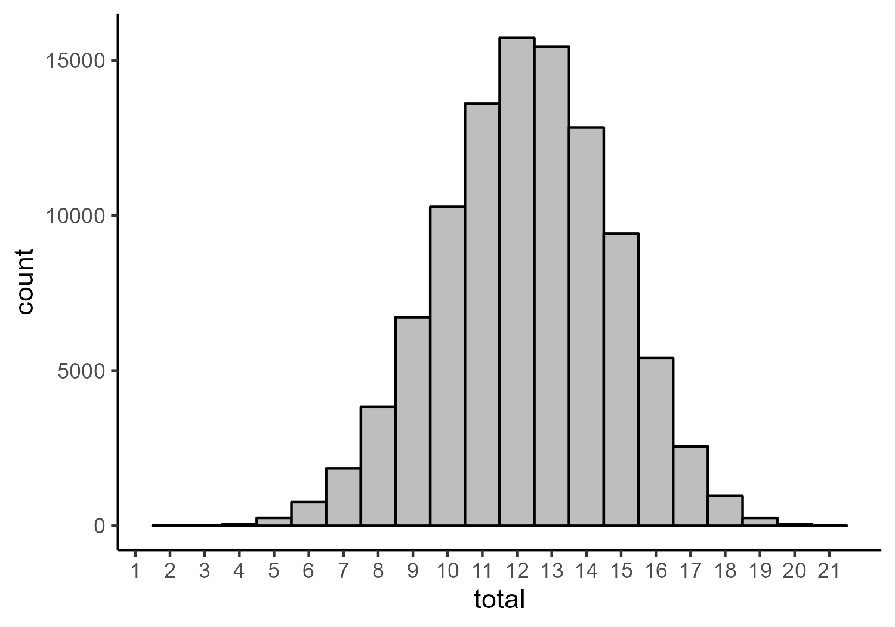
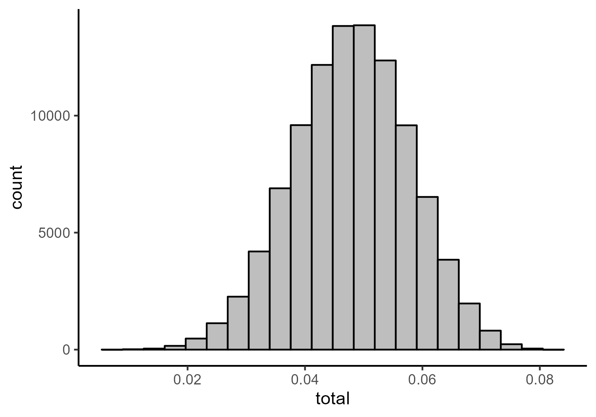

Balezina (2023) - Network Re-analysis
================

- <a href="#network-analysis-of-study-1"
  id="toc-network-analysis-of-study-1">Network Analysis of Study 1</a>
  - <a href="#training-network" id="toc-training-network">Training
    Network</a>
    - <a href="#fit-indices" id="toc-fit-indices">Fit Indices</a>
    - <a href="#parameter-estimates" id="toc-parameter-estimates">Parameter
      Estimates</a>
    - <a href="#network-figures" id="toc-network-figures">Network Figures</a>
  - <a href="#test-network" id="toc-test-network">Test Network</a>
    - <a href="#fit-indices-1" id="toc-fit-indices-1">Fit Indices</a>
    - <a href="#parameter-estimates-1"
      id="toc-parameter-estimates-1">Parameter Estimates</a>
    - <a href="#network-figures-1" id="toc-network-figures-1">Network
      Figures</a>
- <a href="#confirming-the-model-in-the-data-from-study-2"
  id="toc-confirming-the-model-in-the-data-from-study-2">Confirming the
  Model in the Data from Study 2</a>
  - <a href="#fit-indices-2" id="toc-fit-indices-2">Fit Indices</a>
  - <a href="#parameter-estimates-2"
    id="toc-parameter-estimates-2">Parameter Estimates</a>
  - <a href="#network-figures-2" id="toc-network-figures-2">Network
    Figures</a>
- <a href="#simulated-persuasion" id="toc-simulated-persuasion">Simulated
  Persuasion</a>
  - <a href="#fitting-model-to-full-data-from-study-1"
    id="toc-fitting-model-to-full-data-from-study-1">Fitting Model to Full
    Data from Study 1</a>
    - <a href="#fit-indices-3" id="toc-fit-indices-3">Fit Indices</a>
    - <a href="#parameter-estimates-3"
      id="toc-parameter-estimates-3">Parameter Estimates</a>
    - <a href="#centrality-estimates" id="toc-centrality-estimates">Centrality
      Estimates</a>
    - <a href="#network-figures-3" id="toc-network-figures-3">Network
      Figures</a>
  - <a
    href="#creating-simulated-data-from-ising-models-based-on-the-estimated-network"
    id="toc-creating-simulated-data-from-ising-models-based-on-the-estimated-network">Creating
    Simulated Data from Ising Models Based on the Estimated Network</a>
    - <a href="#histograms-of-total-scores"
      id="toc-histograms-of-total-scores">Histograms of Total Scores</a>
    - <a href="#proportions-of-agreement-with-strongest-node"
      id="toc-proportions-of-agreement-with-strongest-node">Proportions of
      Agreement with Strongest Node</a>
    - <a
      href="#standardized-mean-difference-in-total-scores-between-baseline-and-persuasion-models"
      id="toc-standardized-mean-difference-in-total-scores-between-baseline-and-persuasion-models">Standardized
      Mean Difference in Total Scores Between Baseline and Persuasion
      Models</a>

# Network Analysis of Study 1

## Training Network

### Fit Indices

``` r
network_reduced_fit_ind_1
```

                                Measure             Value
    logl                           logl -17904.3462960583
    unrestricted.logl unrestricted.logl -17776.4189900123
    baseline.logl         baseline.logl -19311.9835831309
    nvar                           nvar     21.0000000000
    nobs                           nobs    252.0000000000
    npar                           npar     87.0000000000
    df                               df    165.0000000000
    objective                 objective     39.7605829011
    chisq                         chisq    255.8546120920
    pvalue                       pvalue      0.0000073371
    baseline.chisq       baseline.chisq   3071.1291862372
    baseline.df             baseline.df    210.0000000000
    baseline.pvalue     baseline.pvalue      0.0000000000
    nfi                             nfi      0.9166903778
    pnfi                           pnfi      0.7202567255
    tli                             tli      0.9595847880
    nnfi                           nnfi      0.9595847880
    rfi                             rfi      0.8939695718
    ifi                             ifi      0.9687368984
    rni                             rni      0.9682451906
    cfi                             cfi      0.9682451906
    rmsea                         rmsea      0.0347115029
    rmsea.ci.lower       rmsea.ci.lower      0.0261262050
    rmsea.ci.upper       rmsea.ci.upper      0.0428089472
    rmsea.pvalue           rmsea.pvalue      0.9993651946
    aic.ll                       aic.ll  35982.6925921165
    aic.ll2                     aic.ll2  36024.1885270759
    aic.x                         aic.x    -74.1453879080
    aic.x2                       aic.x2    429.8546120920
    bic                             bic  36341.5400471243
    bic2                           bic2  36065.4292771515
    ebic.25                     ebic.25  36606.4134992062
    ebic.5                       ebic.5  36871.2869512882
    ebic.75                     ebic.75  37083.1857129537
    ebic1                         ebic1  37401.0338554521

### Parameter Estimates

``` r
network_reduced_pars_1
```

        var1 var1_id  op var2 var2_id       est std       se
    1   li_2       1  ~1 <NA>      NA  4.080963  NA 0.083953
    2   li_3       2  ~1 <NA>      NA  3.253829  NA 0.083741
    3   li_4       3  ~1 <NA>      NA  3.118162  NA 0.085019
    4   fi_3       4  ~1 <NA>      NA  5.365427  NA 0.084408
    5   fi_4       5  ~1 <NA>      NA  4.923414  NA 0.095037
    6   fi_5       6  ~1 <NA>      NA  5.568928  NA 0.088671
    7   de_1       7  ~1 <NA>      NA  3.328228  NA 0.091558
    8   de_2       8  ~1 <NA>      NA  2.713348  NA 0.088600
    9   de_5       9  ~1 <NA>      NA  4.291028  NA 0.089269
    10  mt_2      10  ~1 <NA>      NA  3.253829  NA 0.089757
    11  mt_3      11  ~1 <NA>      NA  2.722101  NA 0.088715
    12  mt_4      12  ~1 <NA>      NA  3.750547  NA 0.093083
    13  nr_3      13  ~1 <NA>      NA  1.814004  NA 0.065177
    14  nr_4      14  ~1 <NA>      NA  2.422319  NA 0.076351
    15  te_4      15  ~1 <NA>      NA  1.875274  NA 0.064241
    16  sa_1      16  ~1 <NA>      NA  3.557987  NA 0.095248
    17  sa_4      17  ~1 <NA>      NA  3.652079  NA 0.095773
    18  sa_7      18  ~1 <NA>      NA  4.137856  NA 0.095989
    19  wi_1      19  ~1 <NA>      NA  2.367615  NA 0.077123
    20  wi_4      20  ~1 <NA>      NA  3.185996  NA 0.077401
    21  wi_5      21  ~1 <NA>      NA  2.855580  NA 0.079635
    22  li_3       2  -- li_2       1  0.269809  NA 0.037979
    23  li_4       3  -- li_2       1  0.158055  NA 0.040661
    24  fi_3       4  -- li_2       1  0.000000  NA       NA
    25  fi_4       5  -- li_2       1  0.000000  NA       NA
    26  fi_5       6  -- li_2       1  0.000000  NA       NA
    27  de_1       7  -- li_2       1  0.000000  NA       NA
    28  de_2       8  -- li_2       1  0.099760  NA 0.035959
    29  de_5       9  -- li_2       1  0.128193  NA 0.036097
    30  mt_2      10  -- li_2       1  0.000000  NA       NA
    31  mt_3      11  -- li_2       1  0.000000  NA       NA
    32  mt_4      12  -- li_2       1  0.000000  NA       NA
    33  nr_3      13  -- li_2       1  0.000000  NA       NA
    34  nr_4      14  -- li_2       1  0.000000  NA       NA
    35  te_4      15  -- li_2       1  0.000000  NA       NA
    36  sa_1      16  -- li_2       1  0.117621  NA 0.035438
    37  sa_4      17  -- li_2       1  0.105947  NA 0.036219
    38  sa_7      18  -- li_2       1  0.000000  NA       NA
    39  wi_1      19  -- li_2       1  0.000000  NA       NA
    40  wi_4      20  -- li_2       1  0.241017  NA 0.033614
    41  wi_5      21  -- li_2       1  0.000000  NA       NA
    42  li_4       3  -- li_3       2  0.143856  NA 0.042786
    43  fi_3       4  -- li_3       2  0.000000  NA       NA
    44  fi_4       5  -- li_3       2  0.000000  NA       NA
    45  fi_5       6  -- li_3       2  0.000000  NA       NA
    46  de_1       7  -- li_3       2  0.000000  NA       NA
    47  de_2       8  -- li_3       2  0.000000  NA       NA
    48  de_5       9  -- li_3       2  0.000000  NA       NA
    49  mt_2      10  -- li_3       2  0.000000  NA       NA
    50  mt_3      11  -- li_3       2  0.000000  NA       NA
    51  mt_4      12  -- li_3       2  0.000000  NA       NA
    52  nr_3      13  -- li_3       2  0.000000  NA       NA
    53  nr_4      14  -- li_3       2  0.146082  NA 0.034341
    54  te_4      15  -- li_3       2  0.000000  NA       NA
    55  sa_1      16  -- li_3       2  0.000000  NA       NA
    56  sa_4      17  -- li_3       2  0.000000  NA       NA
    57  sa_7      18  -- li_3       2  0.000000  NA       NA
    58  wi_1      19  -- li_3       2  0.208974  NA 0.037792
    59  wi_4      20  -- li_3       2  0.000000  NA       NA
    60  wi_5      21  -- li_3       2  0.000000  NA       NA
    61  fi_3       4  -- li_4       3  0.000000  NA       NA
    62  fi_4       5  -- li_4       3  0.000000  NA       NA
    63  fi_5       6  -- li_4       3  0.000000  NA       NA
    64  de_1       7  -- li_4       3  0.000000  NA       NA
    65  de_2       8  -- li_4       3  0.000000  NA       NA
    66  de_5       9  -- li_4       3  0.000000  NA       NA
    67  mt_2      10  -- li_4       3  0.000000  NA       NA
    68  mt_3      11  -- li_4       3  0.000000  NA       NA
    69  mt_4      12  -- li_4       3  0.000000  NA       NA
    70  nr_3      13  -- li_4       3  0.000000  NA       NA
    71  nr_4      14  -- li_4       3  0.000000  NA       NA
    72  te_4      15  -- li_4       3  0.123089  NA 0.036801
    73  sa_1      16  -- li_4       3  0.000000  NA       NA
    74  sa_4      17  -- li_4       3  0.000000  NA       NA
    75  sa_7      18  -- li_4       3  0.000000  NA       NA
    76  wi_1      19  -- li_4       3  0.000000  NA       NA
    77  wi_4      20  -- li_4       3  0.000000  NA       NA
    78  wi_5      21  -- li_4       3  0.160311  NA 0.036550
    79  fi_4       5  -- fi_3       4  0.176131  NA 0.044768
    80  fi_5       6  -- fi_3       4  0.224679  NA 0.043441
    81  de_1       7  -- fi_3       4  0.000000  NA       NA
    82  de_2       8  -- fi_3       4  0.000000  NA       NA
    83  de_5       9  -- fi_3       4  0.000000  NA       NA
    84  mt_2      10  -- fi_3       4  0.000000  NA       NA
    85  mt_3      11  -- fi_3       4  0.000000  NA       NA
    86  mt_4      12  -- fi_3       4  0.000000  NA       NA
    87  nr_3      13  -- fi_3       4 -0.130711  NA 0.036733
    88  nr_4      14  -- fi_3       4  0.000000  NA       NA
    89  te_4      15  -- fi_3       4  0.000000  NA       NA
    90  sa_1      16  -- fi_3       4  0.000000  NA       NA
    91  sa_4      17  -- fi_3       4  0.000000  NA       NA
    92  sa_7      18  -- fi_3       4  0.000000  NA       NA
    93  wi_1      19  -- fi_3       4  0.000000  NA       NA
    94  wi_4      20  -- fi_3       4  0.000000  NA       NA
    95  wi_5      21  -- fi_3       4  0.000000  NA       NA
    96  fi_5       6  -- fi_4       5  0.246421  NA 0.043192
    97  de_1       7  -- fi_4       5  0.000000  NA       NA
    98  de_2       8  -- fi_4       5  0.000000  NA       NA
    99  de_5       9  -- fi_4       5  0.000000  NA       NA
    100 mt_2      10  -- fi_4       5  0.000000  NA       NA
    101 mt_3      11  -- fi_4       5  0.000000  NA       NA
    102 mt_4      12  -- fi_4       5  0.000000  NA       NA
    103 nr_3      13  -- fi_4       5  0.000000  NA       NA
    104 nr_4      14  -- fi_4       5  0.000000  NA       NA
    105 te_4      15  -- fi_4       5  0.000000  NA       NA
    106 sa_1      16  -- fi_4       5  0.000000  NA       NA
    107 sa_4      17  -- fi_4       5  0.000000  NA       NA
    108 sa_7      18  -- fi_4       5  0.000000  NA       NA
    109 wi_1      19  -- fi_4       5  0.000000  NA       NA
    110 wi_4      20  -- fi_4       5  0.000000  NA       NA
    111 wi_5      21  -- fi_4       5  0.000000  NA       NA
    112 de_1       7  -- fi_5       6  0.000000  NA       NA
    113 de_2       8  -- fi_5       6  0.000000  NA       NA
    114 de_5       9  -- fi_5       6  0.000000  NA       NA
    115 mt_2      10  -- fi_5       6  0.000000  NA       NA
    116 mt_3      11  -- fi_5       6  0.000000  NA       NA
    117 mt_4      12  -- fi_5       6  0.000000  NA       NA
    118 nr_3      13  -- fi_5       6  0.000000  NA       NA
    119 nr_4      14  -- fi_5       6 -0.130264  NA 0.030806
    120 te_4      15  -- fi_5       6  0.000000  NA       NA
    121 sa_1      16  -- fi_5       6  0.000000  NA       NA
    122 sa_4      17  -- fi_5       6  0.000000  NA       NA
    123 sa_7      18  -- fi_5       6  0.000000  NA       NA
    124 wi_1      19  -- fi_5       6  0.000000  NA       NA
    125 wi_4      20  -- fi_5       6  0.000000  NA       NA
    126 wi_5      21  -- fi_5       6  0.000000  NA       NA
    127 de_2       8  -- de_1       7  0.215148  NA 0.040901
    128 de_5       9  -- de_1       7  0.173493  NA 0.042009
    129 mt_2      10  -- de_1       7  0.000000  NA       NA
    130 mt_3      11  -- de_1       7  0.000000  NA       NA
    131 mt_4      12  -- de_1       7  0.000000  NA       NA
    132 nr_3      13  -- de_1       7  0.000000  NA       NA
    133 nr_4      14  -- de_1       7  0.202426  NA 0.033070
    134 te_4      15  -- de_1       7  0.000000  NA       NA
    135 sa_1      16  -- de_1       7  0.000000  NA       NA
    136 sa_4      17  -- de_1       7  0.000000  NA       NA
    137 sa_7      18  -- de_1       7  0.165244  NA 0.034430
    138 wi_1      19  -- de_1       7  0.000000  NA       NA
    139 wi_4      20  -- de_1       7  0.000000  NA       NA
    140 wi_5      21  -- de_1       7  0.000000  NA       NA
    141 de_5       9  -- de_2       8  0.150024  NA 0.044478
    142 mt_2      10  -- de_2       8  0.000000  NA       NA
    143 mt_3      11  -- de_2       8  0.000000  NA       NA
    144 mt_4      12  -- de_2       8  0.180257  NA 0.035767
    145 nr_3      13  -- de_2       8  0.000000  NA       NA
    146 nr_4      14  -- de_2       8  0.000000  NA       NA
    147 te_4      15  -- de_2       8  0.000000  NA       NA
    148 sa_1      16  -- de_2       8  0.000000  NA       NA
    149 sa_4      17  -- de_2       8  0.000000  NA       NA
    150 sa_7      18  -- de_2       8  0.000000  NA       NA
    151 wi_1      19  -- de_2       8  0.000000  NA       NA
    152 wi_4      20  -- de_2       8  0.000000  NA       NA
    153 wi_5      21  -- de_2       8  0.000000  NA       NA
    154 mt_2      10  -- de_5       9  0.000000  NA       NA
    155 mt_3      11  -- de_5       9  0.000000  NA       NA
    156 mt_4      12  -- de_5       9  0.000000  NA       NA
    157 nr_3      13  -- de_5       9  0.000000  NA       NA
    158 nr_4      14  -- de_5       9  0.000000  NA       NA
    159 te_4      15  -- de_5       9  0.000000  NA       NA
    160 sa_1      16  -- de_5       9  0.000000  NA       NA
    161 sa_4      17  -- de_5       9  0.000000  NA       NA
    162 sa_7      18  -- de_5       9  0.000000  NA       NA
    163 wi_1      19  -- de_5       9  0.000000  NA       NA
    164 wi_4      20  -- de_5       9  0.000000  NA       NA
    165 wi_5      21  -- de_5       9  0.000000  NA       NA
    166 mt_3      11  -- mt_2      10  0.000000  NA       NA
    167 mt_4      12  -- mt_2      10  0.359360  NA 0.036191
    168 nr_3      13  -- mt_2      10  0.000000  NA       NA
    169 nr_4      14  -- mt_2      10  0.000000  NA       NA
    170 te_4      15  -- mt_2      10  0.000000  NA       NA
    171 sa_1      16  -- mt_2      10  0.000000  NA       NA
    172 sa_4      17  -- mt_2      10  0.099698  NA 0.035799
    173 sa_7      18  -- mt_2      10  0.000000  NA       NA
    174 wi_1      19  -- mt_2      10  0.000000  NA       NA
    175 wi_4      20  -- mt_2      10  0.149556  NA 0.032107
    176 wi_5      21  -- mt_2      10  0.000000  NA       NA
    177 mt_4      12  -- mt_3      11  0.227280  NA 0.035917
    178 nr_3      13  -- mt_3      11  0.114200  NA 0.038007
    179 nr_4      14  -- mt_3      11  0.000000  NA       NA
    180 te_4      15  -- mt_3      11  0.000000  NA       NA
    181 sa_1      16  -- mt_3      11  0.000000  NA       NA
    182 sa_4      17  -- mt_3      11  0.000000  NA       NA
    183 sa_7      18  -- mt_3      11  0.000000  NA       NA
    184 wi_1      19  -- mt_3      11  0.163146  NA 0.036006
    185 wi_4      20  -- mt_3      11  0.000000  NA       NA
    186 wi_5      21  -- mt_3      11  0.000000  NA       NA
    187 nr_3      13  -- mt_4      12  0.000000  NA       NA
    188 nr_4      14  -- mt_4      12  0.000000  NA       NA
    189 te_4      15  -- mt_4      12  0.000000  NA       NA
    190 sa_1      16  -- mt_4      12  0.172601  NA 0.037037
    191 sa_4      17  -- mt_4      12  0.000000  NA       NA
    192 sa_7      18  -- mt_4      12  0.151371  NA 0.036955
    193 wi_1      19  -- mt_4      12  0.000000  NA       NA
    194 wi_4      20  -- mt_4      12  0.000000  NA       NA
    195 wi_5      21  -- mt_4      12  0.000000  NA       NA
    196 nr_4      14  -- nr_3      13  0.189512  NA 0.039600
    197 te_4      15  -- nr_3      13  0.270933  NA 0.041225
    198 sa_1      16  -- nr_3      13  0.000000  NA       NA
    199 sa_4      17  -- nr_3      13  0.107004  NA 0.033450
    200 sa_7      18  -- nr_3      13  0.000000  NA       NA
    201 wi_1      19  -- nr_3      13  0.000000  NA       NA
    202 wi_4      20  -- nr_3      13  0.000000  NA       NA
    203 wi_5      21  -- nr_3      13  0.000000  NA       NA
    204 te_4      15  -- nr_4      14  0.352310  NA 0.035975
    205 sa_1      16  -- nr_4      14  0.203575  NA 0.031710
    206 sa_4      17  -- nr_4      14  0.000000  NA       NA
    207 sa_7      18  -- nr_4      14  0.000000  NA       NA
    208 wi_1      19  -- nr_4      14  0.095056  NA 0.032974
    209 wi_4      20  -- nr_4      14  0.000000  NA       NA
    210 wi_5      21  -- nr_4      14  0.000000  NA       NA
    211 sa_1      16  -- te_4      15  0.000000  NA       NA
    212 sa_4      17  -- te_4      15  0.000000  NA       NA
    213 sa_7      18  -- te_4      15  0.000000  NA       NA
    214 wi_1      19  -- te_4      15  0.000000  NA       NA
    215 wi_4      20  -- te_4      15  0.111894  NA 0.030863
    216 wi_5      21  -- te_4      15  0.000000  NA       NA
    217 sa_4      17  -- sa_1      16  0.187830  NA 0.040983
    218 sa_7      18  -- sa_1      16  0.275382  NA 0.039892
    219 wi_1      19  -- sa_1      16  0.000000  NA       NA
    220 wi_4      20  -- sa_1      16  0.000000  NA       NA
    221 wi_5      21  -- sa_1      16  0.000000  NA       NA
    222 sa_7      18  -- sa_4      17  0.356663  NA 0.037696
    223 wi_1      19  -- sa_4      17  0.000000  NA       NA
    224 wi_4      20  -- sa_4      17  0.000000  NA       NA
    225 wi_5      21  -- sa_4      17  0.144498  NA 0.031514
    226 wi_1      19  -- sa_7      18  0.000000  NA       NA
    227 wi_4      20  -- sa_7      18  0.000000  NA       NA
    228 wi_5      21  -- sa_7      18  0.000000  NA       NA
    229 wi_4      20  -- wi_1      19  0.209988  NA 0.039829
    230 wi_5      21  -- wi_1      19  0.239546  NA 0.040381
    231 wi_5      21  -- wi_4      20  0.397432  NA 0.035901
    232 li_2       1 ~/~ li_2       1  1.334251  NA 0.042499
    233 li_3       2 ~/~ li_3       2  1.440503  NA 0.047131
    234 li_4       3 ~/~ li_4       3  1.584236  NA 0.052167
    235 fi_3       4 ~/~ fi_3       4  1.670743  NA 0.055137
    236 fi_4       5 ~/~ fi_4       5  1.901596  NA 0.062899
    237 fi_5       6 ~/~ fi_5       6  1.718738  NA 0.056620
    238 de_1       7 ~/~ de_1       7  1.660105  NA 0.054123
    239 de_2       8 ~/~ de_2       8  1.678056  NA 0.055179
    240 de_5       9 ~/~ de_5       9  1.773778  NA 0.058626
    241 mt_2      10 ~/~ mt_2      10  1.610327  NA 0.052751
    242 mt_3      11 ~/~ mt_3      11  1.717055  NA 0.056510
    243 mt_4      12 ~/~ mt_4      12  1.509934  NA 0.047821
    244 nr_3      13 ~/~ nr_3      13  1.138715  NA 0.037195
    245 nr_4      14 ~/~ nr_4      14  1.130289  NA 0.035016
    246 te_4      15 ~/~ te_4      15  1.042515  NA 0.034047
    247 sa_1      16 ~/~ sa_1      16  1.473987  NA 0.047578
    248 sa_4      17 ~/~ sa_4      17  1.488661  NA 0.048000
    249 sa_7      18 ~/~ sa_7      18  1.482121  NA 0.048256
    250 wi_1      19 ~/~ wi_1      19  1.251992  NA 0.040415
    251 wi_4      20 ~/~ wi_4      20  1.132323  NA 0.035893
    252 wi_5      21 ~/~ wi_5      21  1.219638  NA 0.039574
                                                                                                                                                                                                                                                                                                                             p
    1   0.00000000000000000000000000000000000000000000000000000000000000000000000000000000000000000000000000000000000000000000000000000000000000000000000000000000000000000000000000000000000000000000000000000000000000000000000000000000000000000000000000000000000000000000000000000000000000000000000000000000000000000000
    2   0.00000000000000000000000000000000000000000000000000000000000000000000000000000000000000000000000000000000000000000000000000000000000000000000000000000000000000000000000000000000000000000000000000000000000000000000000000000000000000000000000000000000000000000000000000000000000000000000000000000000000000000000
    3   0.00000000000000000000000000000000000000000000000000000000000000000000000000000000000000000000000000000000000000000000000000000000000000000000000000000000000000000000000000000000000000000000000000000000000000000000000000000000000000000000000000000000000000000000000000000000000000000000000000000176721246385138
    4   0.00000000000000000000000000000000000000000000000000000000000000000000000000000000000000000000000000000000000000000000000000000000000000000000000000000000000000000000000000000000000000000000000000000000000000000000000000000000000000000000000000000000000000000000000000000000000000000000000000000000000000000000
    5   0.00000000000000000000000000000000000000000000000000000000000000000000000000000000000000000000000000000000000000000000000000000000000000000000000000000000000000000000000000000000000000000000000000000000000000000000000000000000000000000000000000000000000000000000000000000000000000000000000000000000000000000000
    6   0.00000000000000000000000000000000000000000000000000000000000000000000000000000000000000000000000000000000000000000000000000000000000000000000000000000000000000000000000000000000000000000000000000000000000000000000000000000000000000000000000000000000000000000000000000000000000000000000000000000000000000000000
    7   0.00000000000000000000000000000000000000000000000000000000000000000000000000000000000000000000000000000000000000000000000000000000000000000000000000000000000000000000000000000000000000000000000000000000000000000000000000000000000000000000000000000000000000000000000000000000000000000000000025428445301007081738
    8   0.00000000000000000000000000000000000000000000000000000000000000000000000000000000000000000000000000000000000000000000000000000000000000000000000000000000000000000000000000000000000000000000000000000000000005729897641547277539926519285273798232083208858966827392578125000000000000000000000000000000000000000000
    9   0.00000000000000000000000000000000000000000000000000000000000000000000000000000000000000000000000000000000000000000000000000000000000000000000000000000000000000000000000000000000000000000000000000000000000000000000000000000000000000000000000000000000000000000000000000000000000000000000000000000000000000000000
    10  0.00000000000000000000000000000000000000000000000000000000000000000000000000000000000000000000000000000000000000000000000000000000000000000000000000000000000000000000000000000000000000000000000000000000000000000000000000000000000000000000000000000000000000000000000000000000000000000000000940392391481480801815
    11  0.00000000000000000000000000000000000000000000000000000000000000000000000000000000000000000000000000000000000000000000000000000000000000000000000000000000000000000000000000000000000000000000000000000000000000938140583085573476380958357623285337467677891254425048828125000000000000000000000000000000000000000000
    12  0.00000000000000000000000000000000000000000000000000000000000000000000000000000000000000000000000000000000000000000000000000000000000000000000000000000000000000000000000000000000000000000000000000000000000000000000000000000000000000000000000000000000000000000000000000000000000000000000000000000000000000000000
    13  0.00000000000000000000000000000000000000000000000000000000000000000000000000000000000000000000000000000000000000000000000000000000000000000000000000000000000000000000000001773669076030425210141819314380029481981182470917701721191406250000000000000000000000000000000000000000000000000000000000000000000000000000
    14  0.00000000000000000000000000000000000000000000000000000000000000000000000000000000000000000000000000000000000000000000000000000000000000000000000000000000000000000000000000000000000000000000000000000000000000000000000000006819001811207007243513522620759204073692671954631805419921875000000000000000000000000000
    15  0.00000000000000000000000000000000000000000000000000000000000000000000000000000000000000000000000000000000000000000000000000000000000000000000000000000000000000000000000000000000000000000024943214595098722916825112472238856753392610698938369750976562500000000000000000000000000000000000000000000000000000000000
    16  0.00000000000000000000000000000000000000000000000000000000000000000000000000000000000000000000000000000000000000000000000000000000000000000000000000000000000000000000000000000000000000000000000000000000000000000000000000000000000000000000000000000000000000000000000000000000000000000000000000000000000000002103
    17  0.00000000000000000000000000000000000000000000000000000000000000000000000000000000000000000000000000000000000000000000000000000000000000000000000000000000000000000000000000000000000000000000000000000000000000000000000000000000000000000000000000000000000000000000000000000000000000000000000000000000000000000000
    18  0.00000000000000000000000000000000000000000000000000000000000000000000000000000000000000000000000000000000000000000000000000000000000000000000000000000000000000000000000000000000000000000000000000000000000000000000000000000000000000000000000000000000000000000000000000000000000000000000000000000000000000000000
    19  0.00000000000000000000000000000000000000000000000000000000000000000000000000000000000000000000000000000000000000000000000000000000000000000000000000000000000000000000000000000000000000000000000000000000000000586725598421963569217840728242663317359983921051025390625000000000000000000000000000000000000000000000
    20  0.00000000000000000000000000000000000000000000000000000000000000000000000000000000000000000000000000000000000000000000000000000000000000000000000000000000000000000000000000000000000000000000000000000000000000000000000000000000000000000000000000000000000000000000000000000000000000000000000000000000000000000000
    21  0.00000000000000000000000000000000000000000000000000000000000000000000000000000000000000000000000000000000000000000000000000000000000000000000000000000000000000000000000000000000000000000000000000000000000000000000000000000000000000000000000000000000000000000000000000000000000000001365319532444087961267284448
    22  0.00000000000120969897684218817286282837697442005264747422188520431518554687500000000000000000000000000000000000000000000000000000000000000000000000000000000000000000000000000000000000000000000000000000000000000000000000000000000000000000000000000000000000000000000000000000000000000000000000000000000000000000
    23  0.00010145142927882203152251117117543799395207315683364868164062500000000000000000000000000000000000000000000000000000000000000000000000000000000000000000000000000000000000000000000000000000000000000000000000000000000000000000000000000000000000000000000000000000000000000000000000000000000000000000000000000000
    24                                                                                                                                                                                                                                                                                                                      NA
    25                                                                                                                                                                                                                                                                                                                      NA
    26                                                                                                                                                                                                                                                                                                                      NA
    27                                                                                                                                                                                                                                                                                                                      NA
    28  0.00553326152818676021000188214316040102858096361160278320312500000000000000000000000000000000000000000000000000000000000000000000000000000000000000000000000000000000000000000000000000000000000000000000000000000000000000000000000000000000000000000000000000000000000000000000000000000000000000000000000000000000
    29  0.00038329517069118917852246775090918617934221401810646057128906250000000000000000000000000000000000000000000000000000000000000000000000000000000000000000000000000000000000000000000000000000000000000000000000000000000000000000000000000000000000000000000000000000000000000000000000000000000000000000000000000000
    30                                                                                                                                                                                                                                                                                                                      NA
    31                                                                                                                                                                                                                                                                                                                      NA
    32                                                                                                                                                                                                                                                                                                                      NA
    33                                                                                                                                                                                                                                                                                                                      NA
    34                                                                                                                                                                                                                                                                                                                      NA
    35                                                                                                                                                                                                                                                                                                                      NA
    36  0.00090321879253233425862562588903870164358522742986679077148437500000000000000000000000000000000000000000000000000000000000000000000000000000000000000000000000000000000000000000000000000000000000000000000000000000000000000000000000000000000000000000000000000000000000000000000000000000000000000000000000000000
    37  0.00344236967466781968588707130152215540874749422073364257812500000000000000000000000000000000000000000000000000000000000000000000000000000000000000000000000000000000000000000000000000000000000000000000000000000000000000000000000000000000000000000000000000000000000000000000000000000000000000000000000000000000
    38                                                                                                                                                                                                                                                                                                                      NA
    39                                                                                                                                                                                                                                                                                                                      NA
    40  0.00000000000074914337302117849845539687692053121281787753105163574218750000000000000000000000000000000000000000000000000000000000000000000000000000000000000000000000000000000000000000000000000000000000000000000000000000000000000000000000000000000000000000000000000000000000000000000000000000000000000000000000
    41                                                                                                                                                                                                                                                                                                                      NA
    42  0.00077327142900209585446580362599888758268207311630249023437500000000000000000000000000000000000000000000000000000000000000000000000000000000000000000000000000000000000000000000000000000000000000000000000000000000000000000000000000000000000000000000000000000000000000000000000000000000000000000000000000000000
    43                                                                                                                                                                                                                                                                                                                      NA
    44                                                                                                                                                                                                                                                                                                                      NA
    45                                                                                                                                                                                                                                                                                                                      NA
    46                                                                                                                                                                                                                                                                                                                      NA
    47                                                                                                                                                                                                                                                                                                                      NA
    48                                                                                                                                                                                                                                                                                                                      NA
    49                                                                                                                                                                                                                                                                                                                      NA
    50                                                                                                                                                                                                                                                                                                                      NA
    51                                                                                                                                                                                                                                                                                                                      NA
    52                                                                                                                                                                                                                                                                                                                      NA
    53  0.00002101545467762343702422533908702462213113903999328613281250000000000000000000000000000000000000000000000000000000000000000000000000000000000000000000000000000000000000000000000000000000000000000000000000000000000000000000000000000000000000000000000000000000000000000000000000000000000000000000000000000000
    54                                                                                                                                                                                                                                                                                                                      NA
    55                                                                                                                                                                                                                                                                                                                      NA
    56                                                                                                                                                                                                                                                                                                                      NA
    57                                                                                                                                                                                                                                                                                                                      NA
    58  0.00000003209473449801682482050019240560345679114107042551040649414062500000000000000000000000000000000000000000000000000000000000000000000000000000000000000000000000000000000000000000000000000000000000000000000000000000000000000000000000000000000000000000000000000000000000000000000000000000000000000000000000
    59                                                                                                                                                                                                                                                                                                                      NA
    60                                                                                                                                                                                                                                                                                                                      NA
    61                                                                                                                                                                                                                                                                                                                      NA
    62                                                                                                                                                                                                                                                                                                                      NA
    63                                                                                                                                                                                                                                                                                                                      NA
    64                                                                                                                                                                                                                                                                                                                      NA
    65                                                                                                                                                                                                                                                                                                                      NA
    66                                                                                                                                                                                                                                                                                                                      NA
    67                                                                                                                                                                                                                                                                                                                      NA
    68                                                                                                                                                                                                                                                                                                                      NA
    69                                                                                                                                                                                                                                                                                                                      NA
    70                                                                                                                                                                                                                                                                                                                      NA
    71                                                                                                                                                                                                                                                                                                                      NA
    72  0.00082355553242086587065889924375028385838959366083145141601562500000000000000000000000000000000000000000000000000000000000000000000000000000000000000000000000000000000000000000000000000000000000000000000000000000000000000000000000000000000000000000000000000000000000000000000000000000000000000000000000000000
    73                                                                                                                                                                                                                                                                                                                      NA
    74                                                                                                                                                                                                                                                                                                                      NA
    75                                                                                                                                                                                                                                                                                                                      NA
    76                                                                                                                                                                                                                                                                                                                      NA
    77                                                                                                                                                                                                                                                                                                                      NA
    78  0.00001154016845494092420067178128562090932973660528659820556640625000000000000000000000000000000000000000000000000000000000000000000000000000000000000000000000000000000000000000000000000000000000000000000000000000000000000000000000000000000000000000000000000000000000000000000000000000000000000000000000000000
    79  0.00008344788280116208992881476902425674779806286096572875976562500000000000000000000000000000000000000000000000000000000000000000000000000000000000000000000000000000000000000000000000000000000000000000000000000000000000000000000000000000000000000000000000000000000000000000000000000000000000000000000000000000
    80  0.00000023149377551282003004189113948285694277728907763957977294921875000000000000000000000000000000000000000000000000000000000000000000000000000000000000000000000000000000000000000000000000000000000000000000000000000000000000000000000000000000000000000000000000000000000000000000000000000000000000000000000000
    81                                                                                                                                                                                                                                                                                                                      NA
    82                                                                                                                                                                                                                                                                                                                      NA
    83                                                                                                                                                                                                                                                                                                                      NA
    84                                                                                                                                                                                                                                                                                                                      NA
    85                                                                                                                                                                                                                                                                                                                      NA
    86                                                                                                                                                                                                                                                                                                                      NA
    87  0.00037304672231089721669283765237423722282983362674713134765625000000000000000000000000000000000000000000000000000000000000000000000000000000000000000000000000000000000000000000000000000000000000000000000000000000000000000000000000000000000000000000000000000000000000000000000000000000000000000000000000000000
    88                                                                                                                                                                                                                                                                                                                      NA
    89                                                                                                                                                                                                                                                                                                                      NA
    90                                                                                                                                                                                                                                                                                                                      NA
    91                                                                                                                                                                                                                                                                                                                      NA
    92                                                                                                                                                                                                                                                                                                                      NA
    93                                                                                                                                                                                                                                                                                                                      NA
    94                                                                                                                                                                                                                                                                                                                      NA
    95                                                                                                                                                                                                                                                                                                                      NA
    96  0.00000001161772367438665819845342030980361869296757504343986511230468750000000000000000000000000000000000000000000000000000000000000000000000000000000000000000000000000000000000000000000000000000000000000000000000000000000000000000000000000000000000000000000000000000000000000000000000000000000000000000000000
    97                                                                                                                                                                                                                                                                                                                      NA
    98                                                                                                                                                                                                                                                                                                                      NA
    99                                                                                                                                                                                                                                                                                                                      NA
    100                                                                                                                                                                                                                                                                                                                     NA
    101                                                                                                                                                                                                                                                                                                                     NA
    102                                                                                                                                                                                                                                                                                                                     NA
    103                                                                                                                                                                                                                                                                                                                     NA
    104                                                                                                                                                                                                                                                                                                                     NA
    105                                                                                                                                                                                                                                                                                                                     NA
    106                                                                                                                                                                                                                                                                                                                     NA
    107                                                                                                                                                                                                                                                                                                                     NA
    108                                                                                                                                                                                                                                                                                                                     NA
    109                                                                                                                                                                                                                                                                                                                     NA
    110                                                                                                                                                                                                                                                                                                                     NA
    111                                                                                                                                                                                                                                                                                                                     NA
    112                                                                                                                                                                                                                                                                                                                     NA
    113                                                                                                                                                                                                                                                                                                                     NA
    114                                                                                                                                                                                                                                                                                                                     NA
    115                                                                                                                                                                                                                                                                                                                     NA
    116                                                                                                                                                                                                                                                                                                                     NA
    117                                                                                                                                                                                                                                                                                                                     NA
    118                                                                                                                                                                                                                                                                                                                     NA
    119 0.00002352354600053866399847826706981379629723960533738136291503906250000000000000000000000000000000000000000000000000000000000000000000000000000000000000000000000000000000000000000000000000000000000000000000000000000000000000000000000000000000000000000000000000000000000000000000000000000000000000000000000000
    120                                                                                                                                                                                                                                                                                                                     NA
    121                                                                                                                                                                                                                                                                                                                     NA
    122                                                                                                                                                                                                                                                                                                                     NA
    123                                                                                                                                                                                                                                                                                                                     NA
    124                                                                                                                                                                                                                                                                                                                     NA
    125                                                                                                                                                                                                                                                                                                                     NA
    126                                                                                                                                                                                                                                                                                                                     NA
    127 0.00000014393624700455107682985772532546775437367614358663558959960937500000000000000000000000000000000000000000000000000000000000000000000000000000000000000000000000000000000000000000000000000000000000000000000000000000000000000000000000000000000000000000000000000000000000000000000000000000000000000000000000
    128 0.00003629238272015442766599627177903641950251767411828041076660156250000000000000000000000000000000000000000000000000000000000000000000000000000000000000000000000000000000000000000000000000000000000000000000000000000000000000000000000000000000000000000000000000000000000000000000000000000000000000000000000000
    129                                                                                                                                                                                                                                                                                                                     NA
    130                                                                                                                                                                                                                                                                                                                     NA
    131                                                                                                                                                                                                                                                                                                                     NA
    132                                                                                                                                                                                                                                                                                                                     NA
    133 0.00000000092910472836675349608479002050387407507514581084251403808593750000000000000000000000000000000000000000000000000000000000000000000000000000000000000000000000000000000000000000000000000000000000000000000000000000000000000000000000000000000000000000000000000000000000000000000000000000000000000000000000
    134                                                                                                                                                                                                                                                                                                                     NA
    135                                                                                                                                                                                                                                                                                                                     NA
    136                                                                                                                                                                                                                                                                                                                     NA
    137 0.00000159123626517850081558969055350871713017113506793975830078125000000000000000000000000000000000000000000000000000000000000000000000000000000000000000000000000000000000000000000000000000000000000000000000000000000000000000000000000000000000000000000000000000000000000000000000000000000000000000000000000000
    138                                                                                                                                                                                                                                                                                                                     NA
    139                                                                                                                                                                                                                                                                                                                     NA
    140                                                                                                                                                                                                                                                                                                                     NA
    141 0.00074357689405891123912706319742937921546399593353271484375000000000000000000000000000000000000000000000000000000000000000000000000000000000000000000000000000000000000000000000000000000000000000000000000000000000000000000000000000000000000000000000000000000000000000000000000000000000000000000000000000000000
    142                                                                                                                                                                                                                                                                                                                     NA
    143                                                                                                                                                                                                                                                                                                                     NA
    144 0.00000046623066060342942002608923601769674860406666994094848632812500000000000000000000000000000000000000000000000000000000000000000000000000000000000000000000000000000000000000000000000000000000000000000000000000000000000000000000000000000000000000000000000000000000000000000000000000000000000000000000000000
    145                                                                                                                                                                                                                                                                                                                     NA
    146                                                                                                                                                                                                                                                                                                                     NA
    147                                                                                                                                                                                                                                                                                                                     NA
    148                                                                                                                                                                                                                                                                                                                     NA
    149                                                                                                                                                                                                                                                                                                                     NA
    150                                                                                                                                                                                                                                                                                                                     NA
    151                                                                                                                                                                                                                                                                                                                     NA
    152                                                                                                                                                                                                                                                                                                                     NA
    153                                                                                                                                                                                                                                                                                                                     NA
    154                                                                                                                                                                                                                                                                                                                     NA
    155                                                                                                                                                                                                                                                                                                                     NA
    156                                                                                                                                                                                                                                                                                                                     NA
    157                                                                                                                                                                                                                                                                                                                     NA
    158                                                                                                                                                                                                                                                                                                                     NA
    159                                                                                                                                                                                                                                                                                                                     NA
    160                                                                                                                                                                                                                                                                                                                     NA
    161                                                                                                                                                                                                                                                                                                                     NA
    162                                                                                                                                                                                                                                                                                                                     NA
    163                                                                                                                                                                                                                                                                                                                     NA
    164                                                                                                                                                                                                                                                                                                                     NA
    165                                                                                                                                                                                                                                                                                                                     NA
    166                                                                                                                                                                                                                                                                                                                     NA
    167 0.00000000000000000000003093701331383772174313251390742607327410951256752014160156250000000000000000000000000000000000000000000000000000000000000000000000000000000000000000000000000000000000000000000000000000000000000000000000000000000000000000000000000000000000000000000000000000000000000000000000000000000000
    168                                                                                                                                                                                                                                                                                                                     NA
    169                                                                                                                                                                                                                                                                                                                     NA
    170                                                                                                                                                                                                                                                                                                                     NA
    171                                                                                                                                                                                                                                                                                                                     NA
    172 0.00535335952996937938785926291984651470556855201721191406250000000000000000000000000000000000000000000000000000000000000000000000000000000000000000000000000000000000000000000000000000000000000000000000000000000000000000000000000000000000000000000000000000000000000000000000000000000000000000000000000000000000
    173                                                                                                                                                                                                                                                                                                                     NA
    174                                                                                                                                                                                                                                                                                                                     NA
    175 0.00000319134086294444178043272497546922750188969075679779052734375000000000000000000000000000000000000000000000000000000000000000000000000000000000000000000000000000000000000000000000000000000000000000000000000000000000000000000000000000000000000000000000000000000000000000000000000000000000000000000000000000
    176                                                                                                                                                                                                                                                                                                                     NA
    177 0.00000000024843082280826202076686598507748726660793181508779525756835937500000000000000000000000000000000000000000000000000000000000000000000000000000000000000000000000000000000000000000000000000000000000000000000000000000000000000000000000000000000000000000000000000000000000000000000000000000000000000000000
    178 0.00265802172531876901642733379560468165436759591102600097656250000000000000000000000000000000000000000000000000000000000000000000000000000000000000000000000000000000000000000000000000000000000000000000000000000000000000000000000000000000000000000000000000000000000000000000000000000000000000000000000000000000
    179                                                                                                                                                                                                                                                                                                                     NA
    180                                                                                                                                                                                                                                                                                                                     NA
    181                                                                                                                                                                                                                                                                                                                     NA
    182                                                                                                                                                                                                                                                                                                                     NA
    183                                                                                                                                                                                                                                                                                                                     NA
    184 0.00000586766232975008133641511842704119317204458639025688171386718750000000000000000000000000000000000000000000000000000000000000000000000000000000000000000000000000000000000000000000000000000000000000000000000000000000000000000000000000000000000000000000000000000000000000000000000000000000000000000000000000
    185                                                                                                                                                                                                                                                                                                                     NA
    186                                                                                                                                                                                                                                                                                                                     NA
    187                                                                                                                                                                                                                                                                                                                     NA
    188                                                                                                                                                                                                                                                                                                                     NA
    189                                                                                                                                                                                                                                                                                                                     NA
    190 0.00000315758381743016325825766654755710760582587681710720062255859375000000000000000000000000000000000000000000000000000000000000000000000000000000000000000000000000000000000000000000000000000000000000000000000000000000000000000000000000000000000000000000000000000000000000000000000000000000000000000000000000
    191                                                                                                                                                                                                                                                                                                                     NA
    192 0.00004202607672654999322950364337714290741132572293281555175781250000000000000000000000000000000000000000000000000000000000000000000000000000000000000000000000000000000000000000000000000000000000000000000000000000000000000000000000000000000000000000000000000000000000000000000000000000000000000000000000000000
    193                                                                                                                                                                                                                                                                                                                     NA
    194                                                                                                                                                                                                                                                                                                                     NA
    195                                                                                                                                                                                                                                                                                                                     NA
    196 0.00000170456736841244528100208777132706927659455686807632446289062500000000000000000000000000000000000000000000000000000000000000000000000000000000000000000000000000000000000000000000000000000000000000000000000000000000000000000000000000000000000000000000000000000000000000000000000000000000000000000000000000
    197 0.00000000004963799414690990181430602090628667610872071236371994018554687500000000000000000000000000000000000000000000000000000000000000000000000000000000000000000000000000000000000000000000000000000000000000000000000000000000000000000000000000000000000000000000000000000000000000000000000000000000000000000000
    198                                                                                                                                                                                                                                                                                                                     NA
    199 0.00137940183949418243743167966641749444534070789813995361328125000000000000000000000000000000000000000000000000000000000000000000000000000000000000000000000000000000000000000000000000000000000000000000000000000000000000000000000000000000000000000000000000000000000000000000000000000000000000000000000000000000
    200                                                                                                                                                                                                                                                                                                                     NA
    201                                                                                                                                                                                                                                                                                                                     NA
    202                                                                                                                                                                                                                                                                                                                     NA
    203                                                                                                                                                                                                                                                                                                                     NA
    204 0.00000000000000000000012054697125832586196685775048464961400895845144987106323242187500000000000000000000000000000000000000000000000000000000000000000000000000000000000000000000000000000000000000000000000000000000000000000000000000000000000000000000000000000000000000000000000000000000000000000000000000000000
    205 0.00000000013634419014219981095697997730553652218077331781387329101562500000000000000000000000000000000000000000000000000000000000000000000000000000000000000000000000000000000000000000000000000000000000000000000000000000000000000000000000000000000000000000000000000000000000000000000000000000000000000000000000
    206                                                                                                                                                                                                                                                                                                                     NA
    207                                                                                                                                                                                                                                                                                                                     NA
    208 0.00394185148967844244810576626036890957038849592208862304687500000000000000000000000000000000000000000000000000000000000000000000000000000000000000000000000000000000000000000000000000000000000000000000000000000000000000000000000000000000000000000000000000000000000000000000000000000000000000000000000000000000
    209                                                                                                                                                                                                                                                                                                                     NA
    210                                                                                                                                                                                                                                                                                                                     NA
    211                                                                                                                                                                                                                                                                                                                     NA
    212                                                                                                                                                                                                                                                                                                                     NA
    213                                                                                                                                                                                                                                                                                                                     NA
    214                                                                                                                                                                                                                                                                                                                     NA
    215 0.00028839060445827902501997330730887370009440928697586059570312500000000000000000000000000000000000000000000000000000000000000000000000000000000000000000000000000000000000000000000000000000000000000000000000000000000000000000000000000000000000000000000000000000000000000000000000000000000000000000000000000000
    216                                                                                                                                                                                                                                                                                                                     NA
    217 0.00000458105751255437554153235324427839714189758524298667907714843750000000000000000000000000000000000000000000000000000000000000000000000000000000000000000000000000000000000000000000000000000000000000000000000000000000000000000000000000000000000000000000000000000000000000000000000000000000000000000000000000
    218 0.00000000000508675853190846301733057943650351262476760894060134887695312500000000000000000000000000000000000000000000000000000000000000000000000000000000000000000000000000000000000000000000000000000000000000000000000000000000000000000000000000000000000000000000000000000000000000000000000000000000000000000000
    219                                                                                                                                                                                                                                                                                                                     NA
    220                                                                                                                                                                                                                                                                                                                     NA
    221                                                                                                                                                                                                                                                                                                                     NA
    222 0.00000000000000000000303289170956372285516480791223159485525684431195259094238281250000000000000000000000000000000000000000000000000000000000000000000000000000000000000000000000000000000000000000000000000000000000000000000000000000000000000000000000000000000000000000000000000000000000000000000000000000000000
    223                                                                                                                                                                                                                                                                                                                     NA
    224                                                                                                                                                                                                                                                                                                                     NA
    225 0.00000453517282865481439688148945776902110083028674125671386718750000000000000000000000000000000000000000000000000000000000000000000000000000000000000000000000000000000000000000000000000000000000000000000000000000000000000000000000000000000000000000000000000000000000000000000000000000000000000000000000000000
    226                                                                                                                                                                                                                                                                                                                     NA
    227                                                                                                                                                                                                                                                                                                                     NA
    228                                                                                                                                                                                                                                                                                                                     NA
    229 0.00000013477783695444864124060244114922113567445194348692893981933593750000000000000000000000000000000000000000000000000000000000000000000000000000000000000000000000000000000000000000000000000000000000000000000000000000000000000000000000000000000000000000000000000000000000000000000000000000000000000000000000
    230 0.00000000299014233420167468936387566991186304221628233790397644042968750000000000000000000000000000000000000000000000000000000000000000000000000000000000000000000000000000000000000000000000000000000000000000000000000000000000000000000000000000000000000000000000000000000000000000000000000000000000000000000000
    231 0.00000000000000000000000000017473693011374942310465208095138223143294453620910644531250000000000000000000000000000000000000000000000000000000000000000000000000000000000000000000000000000000000000000000000000000000000000000000000000000000000000000000000000000000000000000000000000000000000000000000000000000000
    232 0.00000000000000000000000000000000000000000000000000000000000000000000000000000000000000000000000000000000000000000000000000000000000000000000000000000000000000000000000000000000000000000000000000000000000000000000000237801776838603618011852569580355520884040743112564086914062500000000000000000000000000000000
    233 0.00000000000000000000000000000000000000000000000000000000000000000000000000000000000000000000000000000000000000000000000000000000000000000000000000000000000000000000000000000000000000000000000000000000000037166368249598074478996789782314635885995812714099884033203125000000000000000000000000000000000000000000
    234 0.00000000000000000000000000000000000000000000000000000000000000000000000000000000000000000000000000000000000000000000000000000000000000000000000000000000000000000000000000000000000000000000000000000000014362726624324058985037594338152189266111236065626144409179687500000000000000000000000000000000000000000000
    235 0.00000000000000000000000000000000000000000000000000000000000000000000000000000000000000000000000000000000000000000000000000000000000000000000000000000000000000000000000000000000000000000000000000000000109311235331666473861826627267390676934155635535717010498046875000000000000000000000000000000000000000000000
    236 0.00000000000000000000000000000000000000000000000000000000000000000000000000000000000000000000000000000000000000000000000000000000000000000000000000000000000000000000000000000000000000000000000000000000888003890415269655708718765652065485483035445213317871093750000000000000000000000000000000000000000000000000
    237 0.00000000000000000000000000000000000000000000000000000000000000000000000000000000000000000000000000000000000000000000000000000000000000000000000000000000000000000000000000000000000000000000000000000000021082866251223117658175620903193703270517289638519287109375000000000000000000000000000000000000000000000000
    238 0.00000000000000000000000000000000000000000000000000000000000000000000000000000000000000000000000000000000000000000000000000000000000000000000000000000000000000000000000000000000000000000000000000000000000001303360220034331123538026697694647282332880422472953796386718750000000000000000000000000000000000000000
    239 0.00000000000000000000000000000000000000000000000000000000000000000000000000000000000000000000000000000000000000000000000000000000000000000000000000000000000000000000000000000000000000000000000000000000003924019476805625598545002041817042481852695345878601074218750000000000000000000000000000000000000000000000
    240 0.00000000000000000000000000000000000000000000000000000000000000000000000000000000000000000000000000000000000000000000000000000000000000000000000000000000000000000000000000000000000000000000000000000000438787737233746496763944766605902714218245819211006164550781250000000000000000000000000000000000000000000000
    241 0.00000000000000000000000000000000000000000000000000000000000000000000000000000000000000000000000000000000000000000000000000000000000000000000000000000000000000000000000000000000000000000000000000000000000114829607419723529857132071629877145824139006435871124267578125000000000000000000000000000000000000000000
    242 0.00000000000000000000000000000000000000000000000000000000000000000000000000000000000000000000000000000000000000000000000000000000000000000000000000000000000000000000000000000000000000000000000000000000008612780775779992642297855365285386142204515635967254638671875000000000000000000000000000000000000000000000
    243 0.00000000000000000000000000000000000000000000000000000000000000000000000000000000000000000000000000000000000000000000000000000000000000000000000000000000000000000000000000000000000000000000000000000000000000000000000000827876531363174932715010001516020565759390592575073242187500000000000000000000000000000000
    244 0.00000000000000000000000000000000000000000000000000000000000000000000000000000000000000000000000000000000000000000000000000000000000000000000000000000000000000000000000000000000000000000000000000000000000007869144013450830302779104297172807491733692586421966552734375000000000000000000000000000000000000000000
    245 0.00000000000000000000000000000000000000000000000000000000000000000000000000000000000000000000000000000000000000000000000000000000000000000000000000000000000000000000000000000000000000000000000000000000000000000000000000000000000138871108021684209652205077567543867189669981598854064941406250000000000000000000
    246 0.00000000000000000000000000000000000000000000000000000000000000000000000000000000000000000000000000000000000000000000000000000000000000000000000000000000000000000000000000000000000000000000000000000000000006696594813374237317987053286216792002960573881864547729492187500000000000000000000000000000000000000000
    247 0.00000000000000000000000000000000000000000000000000000000000000000000000000000000000000000000000000000000000000000000000000000000000000000000000000000000000000000000000000000000000000000000000000000000000000000099307564508562711927744381945615259610349312424659729003906250000000000000000000000000000000000000
    248 0.00000000000000000000000000000000000000000000000000000000000000000000000000000000000000000000000000000000000000000000000000000000000000000000000000000000000000000000000000000000000000000000000000000000000000000034905778513854918405998756236741087377595249563455581665039062500000000000000000000000000000000000
    249 0.00000000000000000000000000000000000000000000000000000000000000000000000000000000000000000000000000000000000000000000000000000000000000000000000000000000000000000000000000000000000000000000000000000000000000375318283534325635017112055002996839903062209486961364746093750000000000000000000000000000000000000000
    250 0.00000000000000000000000000000000000000000000000000000000000000000000000000000000000000000000000000000000000000000000000000000000000000000000000000000000000000000000000000000000000000000000000000000000000000000106074122287373599662733958393090460958774201571941375732421875000000000000000000000000000000000000
    251 0.00000000000000000000000000000000000000000000000000000000000000000000000000000000000000000000000000000000000000000000000000000000000000000000000000000000000000000000000000000000000000000000000000000000000000000000000001944125863532133920326405718270734723773784935474395751953125000000000000000000000000000000
    252 0.00000000000000000000000000000000000000000000000000000000000000000000000000000000000000000000000000000000000000000000000000000000000000000000000000000000000000000000000000000000000000000000000000000000000000014430146479283064951670834119568098685704171657562255859375000000000000000000000000000000000000000000
        se_boot p_boot matrix row col par      group group_id fixed           mi
    1        NA     NA     mu   1   1   1 fullsample        1 FALSE  0.000000000
    2        NA     NA     mu   2   1   2 fullsample        1 FALSE  0.000000000
    3        NA     NA     mu   3   1   3 fullsample        1 FALSE  0.000000000
    4        NA     NA     mu   4   1   4 fullsample        1 FALSE  0.000000000
    5        NA     NA     mu   5   1   5 fullsample        1 FALSE  0.000000000
    6        NA     NA     mu   6   1   6 fullsample        1 FALSE  0.000000000
    7        NA     NA     mu   7   1   7 fullsample        1 FALSE  0.000000000
    8        NA     NA     mu   8   1   8 fullsample        1 FALSE  0.000000000
    9        NA     NA     mu   9   1   9 fullsample        1 FALSE  0.000000000
    10       NA     NA     mu  10   1  10 fullsample        1 FALSE  0.000000000
    11       NA     NA     mu  11   1  11 fullsample        1 FALSE  0.000000000
    12       NA     NA     mu  12   1  12 fullsample        1 FALSE  0.000000000
    13       NA     NA     mu  13   1  13 fullsample        1 FALSE  0.000000000
    14       NA     NA     mu  14   1  14 fullsample        1 FALSE  0.000000000
    15       NA     NA     mu  15   1  15 fullsample        1 FALSE  0.000000000
    16       NA     NA     mu  16   1  16 fullsample        1 FALSE  0.000000000
    17       NA     NA     mu  17   1  17 fullsample        1 FALSE  0.000000000
    18       NA     NA     mu  18   1  18 fullsample        1 FALSE  0.000000000
    19       NA     NA     mu  19   1  19 fullsample        1 FALSE  0.000000000
    20       NA     NA     mu  20   1  20 fullsample        1 FALSE  0.000000000
    21       NA     NA     mu  21   1  21 fullsample        1 FALSE  0.000000000
    22       NA     NA  omega   2   1  22 fullsample        1 FALSE  0.000000000
    23       NA     NA  omega   3   1  23 fullsample        1 FALSE  0.000000000
    24       NA     NA  omega   4   1   0 fullsample        1  TRUE  0.367593732
    25       NA     NA  omega   5   1   0 fullsample        1  TRUE  0.862806150
    26       NA     NA  omega   6   1   0 fullsample        1  TRUE  0.637545208
    27       NA     NA  omega   7   1   0 fullsample        1  TRUE  3.635339300
    28       NA     NA  omega   8   1  24 fullsample        1 FALSE  0.000000000
    29       NA     NA  omega   9   1  25 fullsample        1 FALSE  0.000000000
    30       NA     NA  omega  10   1   0 fullsample        1  TRUE  0.001606373
    31       NA     NA  omega  11   1   0 fullsample        1  TRUE  0.206823084
    32       NA     NA  omega  12   1   0 fullsample        1  TRUE  3.670123053
    33       NA     NA  omega  13   1   0 fullsample        1  TRUE  0.292039968
    34       NA     NA  omega  14   1   0 fullsample        1  TRUE  0.758946661
    35       NA     NA  omega  15   1   0 fullsample        1  TRUE  0.617102100
    36       NA     NA  omega  16   1  26 fullsample        1 FALSE  0.000000000
    37       NA     NA  omega  17   1  27 fullsample        1 FALSE  0.000000000
    38       NA     NA  omega  18   1   0 fullsample        1  TRUE  2.376496717
    39       NA     NA  omega  19   1   0 fullsample        1  TRUE  1.838129381
    40       NA     NA  omega  20   1  28 fullsample        1 FALSE  0.000000000
    41       NA     NA  omega  21   1   0 fullsample        1  TRUE  0.902538184
    42       NA     NA  omega   3   2  29 fullsample        1 FALSE  0.000000000
    43       NA     NA  omega   4   2   0 fullsample        1  TRUE  3.356655150
    44       NA     NA  omega   5   2   0 fullsample        1  TRUE  2.288856834
    45       NA     NA  omega   6   2   0 fullsample        1  TRUE  0.067290333
    46       NA     NA  omega   7   2   0 fullsample        1  TRUE  1.448760978
    47       NA     NA  omega   8   2   0 fullsample        1  TRUE  1.139094074
    48       NA     NA  omega   9   2   0 fullsample        1  TRUE  0.915620659
    49       NA     NA  omega  10   2   0 fullsample        1  TRUE  0.554221971
    50       NA     NA  omega  11   2   0 fullsample        1  TRUE  1.230804962
    51       NA     NA  omega  12   2   0 fullsample        1  TRUE  0.048350406
    52       NA     NA  omega  13   2   0 fullsample        1  TRUE  0.019235858
    53       NA     NA  omega  14   2  30 fullsample        1 FALSE  0.000000000
    54       NA     NA  omega  15   2   0 fullsample        1  TRUE  0.136270637
    55       NA     NA  omega  16   2   0 fullsample        1  TRUE  3.749667002
    56       NA     NA  omega  17   2   0 fullsample        1  TRUE  6.219738779
    57       NA     NA  omega  18   2   0 fullsample        1  TRUE  1.691962894
    58       NA     NA  omega  19   2  31 fullsample        1 FALSE  0.000000000
    59       NA     NA  omega  20   2   0 fullsample        1  TRUE  0.026545127
    60       NA     NA  omega  21   2   0 fullsample        1  TRUE  0.058384073
    61       NA     NA  omega   4   3   0 fullsample        1  TRUE  0.127481253
    62       NA     NA  omega   5   3   0 fullsample        1  TRUE  0.500851486
    63       NA     NA  omega   6   3   0 fullsample        1  TRUE  0.763228303
    64       NA     NA  omega   7   3   0 fullsample        1  TRUE  4.494697287
    65       NA     NA  omega   8   3   0 fullsample        1  TRUE  0.527572183
    66       NA     NA  omega   9   3   0 fullsample        1  TRUE  1.498782028
    67       NA     NA  omega  10   3   0 fullsample        1  TRUE  0.608346294
    68       NA     NA  omega  11   3   0 fullsample        1  TRUE  5.363528213
    69       NA     NA  omega  12   3   0 fullsample        1  TRUE  2.442386220
    70       NA     NA  omega  13   3   0 fullsample        1  TRUE  0.056968877
    71       NA     NA  omega  14   3   0 fullsample        1  TRUE  1.608410297
    72       NA     NA  omega  15   3  32 fullsample        1 FALSE  0.000000000
    73       NA     NA  omega  16   3   0 fullsample        1  TRUE  3.785790908
    74       NA     NA  omega  17   3   0 fullsample        1  TRUE  0.240274634
    75       NA     NA  omega  18   3   0 fullsample        1  TRUE  0.580804969
    76       NA     NA  omega  19   3   0 fullsample        1  TRUE  0.954645315
    77       NA     NA  omega  20   3   0 fullsample        1  TRUE  0.169178631
    78       NA     NA  omega  21   3  33 fullsample        1 FALSE  0.000000000
    79       NA     NA  omega   5   4  34 fullsample        1 FALSE  0.000000000
    80       NA     NA  omega   6   4  35 fullsample        1 FALSE  0.000000000
    81       NA     NA  omega   7   4   0 fullsample        1  TRUE  0.243642815
    82       NA     NA  omega   8   4   0 fullsample        1  TRUE  1.914077258
    83       NA     NA  omega   9   4   0 fullsample        1  TRUE  0.004625148
    84       NA     NA  omega  10   4   0 fullsample        1  TRUE  1.256626755
    85       NA     NA  omega  11   4   0 fullsample        1  TRUE  1.414012434
    86       NA     NA  omega  12   4   0 fullsample        1  TRUE  0.851565687
    87       NA     NA  omega  13   4  36 fullsample        1 FALSE  0.000000000
    88       NA     NA  omega  14   4   0 fullsample        1  TRUE  4.072318854
    89       NA     NA  omega  15   4   0 fullsample        1  TRUE  1.239667899
    90       NA     NA  omega  16   4   0 fullsample        1  TRUE  0.305225246
    91       NA     NA  omega  17   4   0 fullsample        1  TRUE  0.921878742
    92       NA     NA  omega  18   4   0 fullsample        1  TRUE  0.507590412
    93       NA     NA  omega  19   4   0 fullsample        1  TRUE  0.531862244
    94       NA     NA  omega  20   4   0 fullsample        1  TRUE  0.157509285
    95       NA     NA  omega  21   4   0 fullsample        1  TRUE  0.327953358
    96       NA     NA  omega   6   5  37 fullsample        1 FALSE  0.000000000
    97       NA     NA  omega   7   5   0 fullsample        1  TRUE  1.189989250
    98       NA     NA  omega   8   5   0 fullsample        1  TRUE  0.532146081
    99       NA     NA  omega   9   5   0 fullsample        1  TRUE  2.871973485
    100      NA     NA  omega  10   5   0 fullsample        1  TRUE  9.090495136
    101      NA     NA  omega  11   5   0 fullsample        1  TRUE  0.873859641
    102      NA     NA  omega  12   5   0 fullsample        1  TRUE 14.397077639
    103      NA     NA  omega  13   5   0 fullsample        1  TRUE  0.108926233
    104      NA     NA  omega  14   5   0 fullsample        1  TRUE  1.064057718
    105      NA     NA  omega  15   5   0 fullsample        1  TRUE  0.101233328
    106      NA     NA  omega  16   5   0 fullsample        1  TRUE  0.567075527
    107      NA     NA  omega  17   5   0 fullsample        1  TRUE  1.784386841
    108      NA     NA  omega  18   5   0 fullsample        1  TRUE  6.301164308
    109      NA     NA  omega  19   5   0 fullsample        1  TRUE  0.771330761
    110      NA     NA  omega  20   5   0 fullsample        1  TRUE  0.007121508
    111      NA     NA  omega  21   5   0 fullsample        1  TRUE  0.000284179
    112      NA     NA  omega   7   6   0 fullsample        1  TRUE  1.742472182
    113      NA     NA  omega   8   6   0 fullsample        1  TRUE  0.159143812
    114      NA     NA  omega   9   6   0 fullsample        1  TRUE  0.003689112
    115      NA     NA  omega  10   6   0 fullsample        1  TRUE  0.641357477
    116      NA     NA  omega  11   6   0 fullsample        1  TRUE  3.076583808
    117      NA     NA  omega  12   6   0 fullsample        1  TRUE  4.574386951
    118      NA     NA  omega  13   6   0 fullsample        1  TRUE  3.907599585
    119      NA     NA  omega  14   6  38 fullsample        1 FALSE  0.000000000
    120      NA     NA  omega  15   6   0 fullsample        1  TRUE  1.606614653
    121      NA     NA  omega  16   6   0 fullsample        1  TRUE 10.684789807
    122      NA     NA  omega  17   6   0 fullsample        1  TRUE  0.336894070
    123      NA     NA  omega  18   6   0 fullsample        1  TRUE  6.002864964
    124      NA     NA  omega  19   6   0 fullsample        1  TRUE  0.364159406
    125      NA     NA  omega  20   6   0 fullsample        1  TRUE  0.486706476
    126      NA     NA  omega  21   6   0 fullsample        1  TRUE  0.015417011
    127      NA     NA  omega   8   7  39 fullsample        1 FALSE  0.000000000
    128      NA     NA  omega   9   7  40 fullsample        1 FALSE  0.000000000
    129      NA     NA  omega  10   7   0 fullsample        1  TRUE  0.265332575
    130      NA     NA  omega  11   7   0 fullsample        1  TRUE  6.429045098
    131      NA     NA  omega  12   7   0 fullsample        1  TRUE  4.844221378
    132      NA     NA  omega  13   7   0 fullsample        1  TRUE  1.928118976
    133      NA     NA  omega  14   7  41 fullsample        1 FALSE  0.000000000
    134      NA     NA  omega  15   7   0 fullsample        1  TRUE  0.163804908
    135      NA     NA  omega  16   7   0 fullsample        1  TRUE  0.431027076
    136      NA     NA  omega  17   7   0 fullsample        1  TRUE  3.498791095
    137      NA     NA  omega  18   7  42 fullsample        1 FALSE  0.000000000
    138      NA     NA  omega  19   7   0 fullsample        1  TRUE  0.069449303
    139      NA     NA  omega  20   7   0 fullsample        1  TRUE  5.359789041
    140      NA     NA  omega  21   7   0 fullsample        1  TRUE  5.242624751
    141      NA     NA  omega   9   8  43 fullsample        1 FALSE  0.000000000
    142      NA     NA  omega  10   8   0 fullsample        1  TRUE  1.591267970
    143      NA     NA  omega  11   8   0 fullsample        1  TRUE  0.369195585
    144      NA     NA  omega  12   8  44 fullsample        1 FALSE  0.000000000
    145      NA     NA  omega  13   8   0 fullsample        1  TRUE  2.114403752
    146      NA     NA  omega  14   8   0 fullsample        1  TRUE  1.505013065
    147      NA     NA  omega  15   8   0 fullsample        1  TRUE  0.829439302
    148      NA     NA  omega  16   8   0 fullsample        1  TRUE  0.902050894
    149      NA     NA  omega  17   8   0 fullsample        1  TRUE  0.013906485
    150      NA     NA  omega  18   8   0 fullsample        1  TRUE  2.661652925
    151      NA     NA  omega  19   8   0 fullsample        1  TRUE  0.104913641
    152      NA     NA  omega  20   8   0 fullsample        1  TRUE  0.157580887
    153      NA     NA  omega  21   8   0 fullsample        1  TRUE  1.172603165
    154      NA     NA  omega  10   9   0 fullsample        1  TRUE  4.510930572
    155      NA     NA  omega  11   9   0 fullsample        1  TRUE  1.816151162
    156      NA     NA  omega  12   9   0 fullsample        1  TRUE  6.765027243
    157      NA     NA  omega  13   9   0 fullsample        1  TRUE  0.035082052
    158      NA     NA  omega  14   9   0 fullsample        1  TRUE  1.664825892
    159      NA     NA  omega  15   9   0 fullsample        1  TRUE  0.127488660
    160      NA     NA  omega  16   9   0 fullsample        1  TRUE  0.099361112
    161      NA     NA  omega  17   9   0 fullsample        1  TRUE  0.039044178
    162      NA     NA  omega  18   9   0 fullsample        1  TRUE  0.218114246
    163      NA     NA  omega  19   9   0 fullsample        1  TRUE  2.781188684
    164      NA     NA  omega  20   9   0 fullsample        1  TRUE  0.244706414
    165      NA     NA  omega  21   9   0 fullsample        1  TRUE  4.330247679
    166      NA     NA  omega  11  10   0 fullsample        1  TRUE  1.362479337
    167      NA     NA  omega  12  10  45 fullsample        1 FALSE  0.000000000
    168      NA     NA  omega  13  10   0 fullsample        1  TRUE  0.162905035
    169      NA     NA  omega  14  10   0 fullsample        1  TRUE  0.791790321
    170      NA     NA  omega  15  10   0 fullsample        1  TRUE  2.630112108
    171      NA     NA  omega  16  10   0 fullsample        1  TRUE  2.596244512
    172      NA     NA  omega  17  10  46 fullsample        1 FALSE  0.000000000
    173      NA     NA  omega  18  10   0 fullsample        1  TRUE  0.808201927
    174      NA     NA  omega  19  10   0 fullsample        1  TRUE  0.026982038
    175      NA     NA  omega  20  10  47 fullsample        1 FALSE  0.000000000
    176      NA     NA  omega  21  10   0 fullsample        1  TRUE  2.633101126
    177      NA     NA  omega  12  11  48 fullsample        1 FALSE  0.000000000
    178      NA     NA  omega  13  11  49 fullsample        1 FALSE  0.000000000
    179      NA     NA  omega  14  11   0 fullsample        1  TRUE  5.178003826
    180      NA     NA  omega  15  11   0 fullsample        1  TRUE  0.043734181
    181      NA     NA  omega  16  11   0 fullsample        1  TRUE  0.139582474
    182      NA     NA  omega  17  11   0 fullsample        1  TRUE  0.010055809
    183      NA     NA  omega  18  11   0 fullsample        1  TRUE  0.489299796
    184      NA     NA  omega  19  11  50 fullsample        1 FALSE  0.000000000
    185      NA     NA  omega  20  11   0 fullsample        1  TRUE  0.040224037
    186      NA     NA  omega  21  11   0 fullsample        1  TRUE  0.000076217
    187      NA     NA  omega  13  12   0 fullsample        1  TRUE  0.734301172
    188      NA     NA  omega  14  12   0 fullsample        1  TRUE  0.480013514
    189      NA     NA  omega  15  12   0 fullsample        1  TRUE  0.021122902
    190      NA     NA  omega  16  12  51 fullsample        1 FALSE  0.000000000
    191      NA     NA  omega  17  12   0 fullsample        1  TRUE  1.871006855
    192      NA     NA  omega  18  12  52 fullsample        1 FALSE  0.000000000
    193      NA     NA  omega  19  12   0 fullsample        1  TRUE  0.472259070
    194      NA     NA  omega  20  12   0 fullsample        1  TRUE  0.938022933
    195      NA     NA  omega  21  12   0 fullsample        1  TRUE  0.329713953
    196      NA     NA  omega  14  13  53 fullsample        1 FALSE  0.000000000
    197      NA     NA  omega  15  13  54 fullsample        1 FALSE  0.000000000
    198      NA     NA  omega  16  13   0 fullsample        1  TRUE  0.225677771
    199      NA     NA  omega  17  13  55 fullsample        1 FALSE  0.000000000
    200      NA     NA  omega  18  13   0 fullsample        1  TRUE  3.474133917
    201      NA     NA  omega  19  13   0 fullsample        1  TRUE  0.161858798
    202      NA     NA  omega  20  13   0 fullsample        1  TRUE  3.368046074
    203      NA     NA  omega  21  13   0 fullsample        1  TRUE  0.062491612
    204      NA     NA  omega  15  14  56 fullsample        1 FALSE  0.000000000
    205      NA     NA  omega  16  14  57 fullsample        1 FALSE  0.000000000
    206      NA     NA  omega  17  14   0 fullsample        1  TRUE  2.982631230
    207      NA     NA  omega  18  14   0 fullsample        1  TRUE  1.869233794
    208      NA     NA  omega  19  14  58 fullsample        1 FALSE  0.000000000
    209      NA     NA  omega  20  14   0 fullsample        1  TRUE  0.037770389
    210      NA     NA  omega  21  14   0 fullsample        1  TRUE  0.064966993
    211      NA     NA  omega  16  15   0 fullsample        1  TRUE  3.305936292
    212      NA     NA  omega  17  15   0 fullsample        1  TRUE  0.122429314
    213      NA     NA  omega  18  15   0 fullsample        1  TRUE  0.365796358
    214      NA     NA  omega  19  15   0 fullsample        1  TRUE  1.476355265
    215      NA     NA  omega  20  15  59 fullsample        1 FALSE  0.000000000
    216      NA     NA  omega  21  15   0 fullsample        1  TRUE  0.010530163
    217      NA     NA  omega  17  16  60 fullsample        1 FALSE  0.000000000
    218      NA     NA  omega  18  16  61 fullsample        1 FALSE  0.000000000
    219      NA     NA  omega  19  16   0 fullsample        1  TRUE  2.167876905
    220      NA     NA  omega  20  16   0 fullsample        1  TRUE  0.035826525
    221      NA     NA  omega  21  16   0 fullsample        1  TRUE  1.622259065
    222      NA     NA  omega  18  17  62 fullsample        1 FALSE  0.000000000
    223      NA     NA  omega  19  17   0 fullsample        1  TRUE  1.598380966
    224      NA     NA  omega  20  17   0 fullsample        1  TRUE  0.799514612
    225      NA     NA  omega  21  17  63 fullsample        1 FALSE  0.000000000
    226      NA     NA  omega  19  18   0 fullsample        1  TRUE  0.000070059
    227      NA     NA  omega  20  18   0 fullsample        1  TRUE  1.693627885
    228      NA     NA  omega  21  18   0 fullsample        1  TRUE  1.396192974
    229      NA     NA  omega  20  19  64 fullsample        1 FALSE  0.000000000
    230      NA     NA  omega  21  19  65 fullsample        1 FALSE  0.000000000
    231      NA     NA  omega  21  20  66 fullsample        1 FALSE  0.000000000
    232      NA     NA  delta   1   1  67 fullsample        1 FALSE  0.000000000
    233      NA     NA  delta   2   2  68 fullsample        1 FALSE  0.000000000
    234      NA     NA  delta   3   3  69 fullsample        1 FALSE  0.000000000
    235      NA     NA  delta   4   4  70 fullsample        1 FALSE  0.000000000
    236      NA     NA  delta   5   5  71 fullsample        1 FALSE  0.000000000
    237      NA     NA  delta   6   6  72 fullsample        1 FALSE  0.000000000
    238      NA     NA  delta   7   7  73 fullsample        1 FALSE  0.000000000
    239      NA     NA  delta   8   8  74 fullsample        1 FALSE  0.000000000
    240      NA     NA  delta   9   9  75 fullsample        1 FALSE  0.000000000
    241      NA     NA  delta  10  10  76 fullsample        1 FALSE  0.000000000
    242      NA     NA  delta  11  11  77 fullsample        1 FALSE  0.000000000
    243      NA     NA  delta  12  12  78 fullsample        1 FALSE  0.000000000
    244      NA     NA  delta  13  13  79 fullsample        1 FALSE  0.000000000
    245      NA     NA  delta  14  14  80 fullsample        1 FALSE  0.000000000
    246      NA     NA  delta  15  15  81 fullsample        1 FALSE  0.000000000
    247      NA     NA  delta  16  16  82 fullsample        1 FALSE  0.000000000
    248      NA     NA  delta  17  17  83 fullsample        1 FALSE  0.000000000
    249      NA     NA  delta  18  18  84 fullsample        1 FALSE  0.000000000
    250      NA     NA  delta  19  19  85 fullsample        1 FALSE  0.000000000
    251      NA     NA  delta  20  20  86 fullsample        1 FALSE  0.000000000
    252      NA     NA  delta  21  21  87 fullsample        1 FALSE  0.000000000
               pmi           epc mi_free pmi_free epc_free mi_equal pmi_equal
    1   1.00000000  0.0000000000      NA       NA       NA       NA        NA
    2   1.00000000  0.0000000000      NA       NA       NA       NA        NA
    3   1.00000000  0.0000000000      NA       NA       NA       NA        NA
    4   1.00000000  0.0000000000      NA       NA       NA       NA        NA
    5   1.00000000  0.0000000000      NA       NA       NA       NA        NA
    6   1.00000000  0.0000000000      NA       NA       NA       NA        NA
    7   1.00000000  0.0000000000      NA       NA       NA       NA        NA
    8   1.00000000  0.0000000000      NA       NA       NA       NA        NA
    9   1.00000000  0.0000000000      NA       NA       NA       NA        NA
    10  1.00000000  0.0000000000      NA       NA       NA       NA        NA
    11  1.00000000  0.0000000000      NA       NA       NA       NA        NA
    12  1.00000000  0.0000000000      NA       NA       NA       NA        NA
    13  1.00000000  0.0000000000      NA       NA       NA       NA        NA
    14  1.00000000  0.0000000000      NA       NA       NA       NA        NA
    15  1.00000000  0.0000000000      NA       NA       NA       NA        NA
    16  1.00000000  0.0000000000      NA       NA       NA       NA        NA
    17  1.00000000  0.0000000000      NA       NA       NA       NA        NA
    18  1.00000000  0.0000000000      NA       NA       NA       NA        NA
    19  1.00000000  0.0000000000      NA       NA       NA       NA        NA
    20  1.00000000  0.0000000000      NA       NA       NA       NA        NA
    21  1.00000000  0.0000000000      NA       NA       NA       NA        NA
    22  0.99999953 -0.0000000149      NA       NA       NA       NA        NA
    23  0.99999930  0.0000000248      NA       NA       NA       NA        NA
    24  0.54431882 -0.0203585967      NA       NA       NA       NA        NA
    25  0.35295460 -0.0306161221      NA       NA       NA       NA        NA
    26  0.42460111 -0.0273152679      NA       NA       NA       NA        NA
    27  0.05656507  0.0715192046      NA       NA       NA       NA        NA
    28  0.99999970  0.0000000111      NA       NA       NA       NA        NA
    29  0.99999946 -0.0000000212      NA       NA       NA       NA        NA
    30  0.96802968  0.0015545353      NA       NA       NA       NA        NA
    31  0.64926892 -0.0167558958      NA       NA       NA       NA        NA
    32  0.05539609  0.0671678004      NA       NA       NA       NA        NA
    33  0.58891623  0.0191870366      NA       NA       NA       NA        NA
    34  0.38365836  0.0309724071      NA       NA       NA       NA        NA
    35  0.43212621 -0.0287142246      NA       NA       NA       NA        NA
    36  0.99999906 -0.0000000275      NA       NA       NA       NA        NA
    37  0.99999953  0.0000000139      NA       NA       NA       NA        NA
    38  0.12317349  0.0590415807      NA       NA       NA       NA        NA
    39  0.17517035 -0.0551350587      NA       NA       NA       NA        NA
    40  0.99999882  0.0000000314      NA       NA       NA       NA        NA
    41  0.34210204  0.0386878154      NA       NA       NA       NA        NA
    42  0.99999910 -0.0000000350      NA       NA       NA       NA        NA
    43  0.06693389 -0.0666653444      NA       NA       NA       NA        NA
    44  0.13030587 -0.0541207889      NA       NA       NA       NA        NA
    45  0.79532370 -0.0098737200      NA       NA       NA       NA        NA
    46  0.22872687  0.0464296995      NA       NA       NA       NA        NA
    47  0.28584384 -0.0430413324      NA       NA       NA       NA        NA
    48  0.33862748 -0.0399544403      NA       NA       NA       NA        NA
    49  0.45659771 -0.0272259660      NA       NA       NA       NA        NA
    50  0.26725055 -0.0449245694      NA       NA       NA       NA        NA
    51  0.82595896  0.0073030256      NA       NA       NA       NA        NA
    52  0.88969244 -0.0054096897      NA       NA       NA       NA        NA
    53  0.99999939 -0.0000000186      NA       NA       NA       NA        NA
    54  0.71201702  0.0150516807      NA       NA       NA       NA        NA
    55  0.05281803  0.0730432368      NA       NA       NA       NA        NA
    56  0.01263338  0.0909778992      NA       NA       NA       NA        NA
    57  0.19334242  0.0427269037      NA       NA       NA       NA        NA
    58  0.99999992 -0.0000000026      NA       NA       NA       NA        NA
    59  0.87057611 -0.0064460430      NA       NA       NA       NA        NA
    60  0.80906845 -0.0094177027      NA       NA       NA       NA        NA
    61  0.72105799 -0.0138857656      NA       NA       NA       NA        NA
    62  0.47912623  0.0272322251      NA       NA       NA       NA        NA
    63  0.38232012  0.0339952121      NA       NA       NA       NA        NA
    64  0.03400013  0.0815752950      NA       NA       NA       NA        NA
    65  0.46762936  0.0297488621      NA       NA       NA       NA        NA
    66  0.22085886  0.0520743590      NA       NA       NA       NA        NA
    67  0.43541114  0.0301240620      NA       NA       NA       NA        NA
    68  0.02056213  0.0936624188      NA       NA       NA       NA        NA
    69  0.11809645  0.0540654585      NA       NA       NA       NA        NA
    70  0.81135253  0.0098328890      NA       NA       NA       NA        NA
    71  0.20471541  0.0506180689      NA       NA       NA       NA        NA
    72  0.99999987 -0.0000000049      NA       NA       NA       NA        NA
    73  0.05168948  0.0716029500      NA       NA       NA       NA        NA
    74  0.62400783 -0.0186202321      NA       NA       NA       NA        NA
    75  0.44599697  0.0259577779      NA       NA       NA       NA        NA
    76  0.32853968  0.0420622220      NA       NA       NA       NA        NA
    77  0.68084282  0.0178342012      NA       NA       NA       NA        NA
    78  0.99999940 -0.0000000207      NA       NA       NA       NA        NA
    79  0.99999962  0.0000000185      NA       NA       NA       NA        NA
    80  0.99999955  0.0000000213      NA       NA       NA       NA        NA
    81  0.62158737 -0.0188324232      NA       NA       NA       NA        NA
    82  0.16651105 -0.0538879661      NA       NA       NA       NA        NA
    83  0.94577891  0.0027637374      NA       NA       NA       NA        NA
    84  0.26229057  0.0416164391      NA       NA       NA       NA        NA
    85  0.23439145  0.0488912850      NA       NA       NA       NA        NA
    86  0.35610979  0.0313191327      NA       NA       NA       NA        NA
    87  0.99999952 -0.0000000211      NA       NA       NA       NA        NA
    88  0.04359139 -0.0733437431      NA       NA       NA       NA        NA
    89  0.26553507 -0.0431659373      NA       NA       NA       NA        NA
    90  0.58062505  0.0184581165      NA       NA       NA       NA        NA
    91  0.33698216  0.0325700407      NA       NA       NA       NA        NA
    92  0.47618381  0.0233291584      NA       NA       NA       NA        NA
    93  0.46582498 -0.0251268839      NA       NA       NA       NA        NA
    94  0.69146009 -0.0123364329      NA       NA       NA       NA        NA
    95  0.56686672 -0.0184686192      NA       NA       NA       NA        NA
    96  0.99999970  0.0000000142      NA       NA       NA       NA        NA
    97  0.27533172  0.0410993412      NA       NA       NA       NA        NA
    98  0.46570600 -0.0284337069      NA       NA       NA       NA        NA
    99  0.09013428  0.0691837270      NA       NA       NA       NA        NA
    100 0.00256941  0.1113989924      NA       NA       NA       NA        NA
    101 0.34988901  0.0373435159      NA       NA       NA       NA        NA
    102 0.00014803  0.1271487161      NA       NA       NA       NA        NA
    103 0.74136993  0.0125799668      NA       NA       NA       NA        NA
    104 0.30229153  0.0338997784      NA       NA       NA       NA        NA
    105 0.75035458 -0.0109558070      NA       NA       NA       NA        NA
    106 0.45142337  0.0243651788      NA       NA       NA       NA        NA
    107 0.18161157  0.0431857956      NA       NA       NA       NA        NA
    108 0.01206587  0.0803841083      NA       NA       NA       NA        NA
    109 0.37980569 -0.0296324554      NA       NA       NA       NA        NA
    110 0.93274713 -0.0025618747      NA       NA       NA       NA        NA
    111 0.98655022 -0.0005344319      NA       NA       NA       NA        NA
    112 0.18682589  0.0527639448      NA       NA       NA       NA        NA
    113 0.68994601  0.0154670142      NA       NA       NA       NA        NA
    114 0.95156782  0.0024445013      NA       NA       NA       NA        NA
    115 0.42321966  0.0294560842      NA       NA       NA       NA        NA
    116 0.07942720  0.0698297398      NA       NA       NA       NA        NA
    117 0.03245336  0.0725460272      NA       NA       NA       NA        NA
    118 0.04806821 -0.0830957418      NA       NA       NA       NA        NA
    119 0.99999959 -0.0000000149      NA       NA       NA       NA        NA
    120 0.20496833 -0.0515230164      NA       NA       NA       NA        NA
    121 0.00108020  0.1162947874      NA       NA       NA       NA        NA
    122 0.56162753  0.0195263708      NA       NA       NA       NA        NA
    123 0.01428267  0.0812451624      NA       NA       NA       NA        NA
    124 0.54620523 -0.0215032609      NA       NA       NA       NA        NA
    125 0.48540016  0.0220018822      NA       NA       NA       NA        NA
    126 0.90118443  0.0040318155      NA       NA       NA       NA        NA
    127 0.99999795  0.0000000854      NA       NA       NA       NA        NA
    128 0.99999880 -0.0000000535      NA       NA       NA       NA        NA
    129 0.60648005  0.0193886931      NA       NA       NA       NA        NA
    130 0.01122689 -0.0996806372      NA       NA       NA       NA        NA
    131 0.02773891  0.0848374707      NA       NA       NA       NA        NA
    132 0.16496439 -0.0563078101      NA       NA       NA       NA        NA
    133 0.99999953  0.0000000151      NA       NA       NA       NA        NA
    134 0.68567732  0.0163211658      NA       NA       NA       NA        NA
    135 0.51148541 -0.0271130026      NA       NA       NA       NA        NA
    136 0.06141364  0.0746632201      NA       NA       NA       NA        NA
    137 0.99999975  0.0000000083      NA       NA       NA       NA        NA
    138 0.79214029 -0.0094855304      NA       NA       NA       NA        NA
    139 0.02060627  0.0740464450      NA       NA       NA       NA        NA
    140 0.02204000  0.0750221801      NA       NA       NA       NA        NA
    141 0.99999870 -0.0000000609      NA       NA       NA       NA        NA
    142 0.20714507 -0.0540652930      NA       NA       NA       NA        NA
    143 0.54344307 -0.0258955802      NA       NA       NA       NA        NA
    144 0.99999966  0.0000000126      NA       NA       NA       NA        NA
    145 0.14591888  0.0541331158      NA       NA       NA       NA        NA
    146 0.21990163  0.0435303328      NA       NA       NA       NA        NA
    147 0.36243471  0.0321595656      NA       NA       NA       NA        NA
    148 0.34223239 -0.0366576641      NA       NA       NA       NA        NA
    149 0.90612648  0.0043560430      NA       NA       NA       NA        NA
    150 0.10279386 -0.0627724866      NA       NA       NA       NA        NA
    151 0.74601090  0.0116757601      NA       NA       NA       NA        NA
    152 0.69139357  0.0139766468      NA       NA       NA       NA        NA
    153 0.27886701  0.0370938406      NA       NA       NA       NA        NA
    154 0.03367891  0.0831287079      NA       NA       NA       NA        NA
    155 0.17777210  0.0553524659      NA       NA       NA       NA        NA
    156 0.00929615  0.0978409521      NA       NA       NA       NA        NA
    157 0.85142383 -0.0071242034      NA       NA       NA       NA        NA
    158 0.19695300 -0.0462158387      NA       NA       NA       NA        NA
    159 0.72105023 -0.0129394827      NA       NA       NA       NA        NA
    160 0.75259768  0.0116560705      NA       NA       NA       NA        NA
    161 0.84336117 -0.0072625690      NA       NA       NA       NA        NA
    162 0.64048054 -0.0171549949      NA       NA       NA       NA        NA
    163 0.09537736 -0.0615054308      NA       NA       NA       NA        NA
    164 0.62082737 -0.0178159446      NA       NA       NA       NA        NA
    165 0.03744080 -0.0730756672      NA       NA       NA       NA        NA
    166 0.24310825  0.0516587313      NA       NA       NA       NA        NA
    167 0.99999895 -0.0000000351      NA       NA       NA       NA        NA
    168 0.68649588  0.0149794923      NA       NA       NA       NA        NA
    169 0.37355932  0.0292229299      NA       NA       NA       NA        NA
    170 0.10485431  0.0569853912      NA       NA       NA       NA        NA
    171 0.10711727  0.0660922230      NA       NA       NA       NA        NA
    172 0.99999872 -0.0000000434      NA       NA       NA       NA        NA
    173 0.36865239  0.0376137175      NA       NA       NA       NA        NA
    174 0.86952481  0.0063258585      NA       NA       NA       NA        NA
    175 0.99999989  0.0000000033      NA       NA       NA       NA        NA
    176 0.10465712  0.0653745564      NA       NA       NA       NA        NA
    177 0.99999946  0.0000000204      NA       NA       NA       NA        NA
    178 0.99999890  0.0000000467      NA       NA       NA       NA        NA
    179 0.02287459 -0.0853827663      NA       NA       NA       NA        NA
    180 0.83434895  0.0082767737      NA       NA       NA       NA        NA
    181 0.70869644  0.0142867979      NA       NA       NA       NA        NA
    182 0.92012310  0.0037146205      NA       NA       NA       NA        NA
    183 0.48423982 -0.0260521062      NA       NA       NA       NA        NA
    184 0.99999818  0.0000000703      NA       NA       NA       NA        NA
    185 0.84104318  0.0074648195      NA       NA       NA       NA        NA
    186 0.99303435  0.0003343845      NA       NA       NA       NA        NA
    187 0.39149255 -0.0302974469      NA       NA       NA       NA        NA
    188 0.48841620  0.0224637685      NA       NA       NA       NA        NA
    189 0.88444464  0.0046074765      NA       NA       NA       NA        NA
    190 0.99999948  0.0000000154      NA       NA       NA       NA        NA
    191 0.17135981  0.0565659576      NA       NA       NA       NA        NA
    192 0.99999961  0.0000000115      NA       NA       NA       NA        NA
    193 0.49194972  0.0229143536      NA       NA       NA       NA        NA
    194 0.33278681  0.0312653314      NA       NA       NA       NA        NA
    195 0.56582757  0.0179605140      NA       NA       NA       NA        NA
    196 0.99999985 -0.0000000045      NA       NA       NA       NA        NA
    197 0.99999943 -0.0000000187      NA       NA       NA       NA        NA
    198 0.63474738 -0.0188041435      NA       NA       NA       NA        NA
    199 0.99999883 -0.0000000389      NA       NA       NA       NA        NA
    200 0.06233535 -0.0702304238      NA       NA       NA       NA        NA
    201 0.68745090  0.0151642217      NA       NA       NA       NA        NA
    202 0.06647255  0.0632477138      NA       NA       NA       NA        NA
    203 0.80260032 -0.0085052980      NA       NA       NA       NA        NA
    204 0.99999980  0.0000000054      NA       NA       NA       NA        NA
    205 0.99999958 -0.0000000113      NA       NA       NA       NA        NA
    206 0.08416235  0.0616490542      NA       NA       NA       NA        NA
    207 0.17156286  0.0474812715      NA       NA       NA       NA        NA
    208 0.99999857  0.0000000414      NA       NA       NA       NA        NA
    209 0.84590493  0.0066916090      NA       NA       NA       NA        NA
    210 0.79881097  0.0083235759      NA       NA       NA       NA        NA
    211 0.06903000  0.0670721258      NA       NA       NA       NA        NA
    212 0.72641449 -0.0122613006      NA       NA       NA       NA        NA
    213 0.54530458 -0.0191248702      NA       NA       NA       NA        NA
    214 0.22434565  0.0487127097      NA       NA       NA       NA        NA
    215 0.99999923  0.0000000220      NA       NA       NA       NA        NA
    216 0.91826728 -0.0038502607      NA       NA       NA       NA        NA
    217 0.99999950  0.0000000135      NA       NA       NA       NA        NA
    218 0.99999935 -0.0000000174      NA       NA       NA       NA        NA
    219 0.14092067  0.0505570799      NA       NA       NA       NA        NA
    220 0.84987418  0.0061913633      NA       NA       NA       NA        NA
    221 0.20277708  0.0433269711      NA       NA       NA       NA        NA
    222 0.99999907  0.0000000245      NA       NA       NA       NA        NA
    223 0.20613280 -0.0452887102      NA       NA       NA       NA        NA
    224 0.37123853  0.0333059680      NA       NA       NA       NA        NA
    225 0.99999980 -0.0000000057      NA       NA       NA       NA        NA
    226 0.99332170 -0.0002629884      NA       NA       NA       NA        NA
    227 0.19312342  0.0386628446      NA       NA       NA       NA        NA
    228 0.23736203  0.0397436336      NA       NA       NA       NA        NA
    229 0.99999997  0.0000000007      NA       NA       NA       NA        NA
    230 0.99999933 -0.0000000188      NA       NA       NA       NA        NA
    231 0.99999912 -0.0000000214      NA       NA       NA       NA        NA
    232 0.99999977  0.0000000109      NA       NA       NA       NA        NA
    233 0.99999839 -0.0000000850      NA       NA       NA       NA        NA
    234 0.99999992 -0.0000000048      NA       NA       NA       NA        NA
    235 0.99999979  0.0000000140      NA       NA       NA       NA        NA
    236 0.99999994  0.0000000046      NA       NA       NA       NA        NA
    237 0.99999992  0.0000000054      NA       NA       NA       NA        NA
    238 0.99999936  0.0000000401      NA       NA       NA       NA        NA
    239 0.99999988 -0.0000000077      NA       NA       NA       NA        NA
    240 0.99999997 -0.0000000018      NA       NA       NA       NA        NA
    241 0.99999976 -0.0000000144      NA       NA       NA       NA        NA
    242 0.99999934  0.0000000445      NA       NA       NA       NA        NA
    243 0.99999924  0.0000000409      NA       NA       NA       NA        NA
    244 0.99999995 -0.0000000022      NA       NA       NA       NA        NA
    245 0.99999882  0.0000000445      NA       NA       NA       NA        NA
    246 0.99999917 -0.0000000307      NA       NA       NA       NA        NA
    247 0.99999954 -0.0000000235      NA       NA       NA       NA        NA
    248 0.99999746  0.0000001301      NA       NA       NA       NA        NA
    249 0.99999955 -0.0000000227      NA       NA       NA       NA        NA
    250 0.99999983  0.0000000078      NA       NA       NA       NA        NA
    251 0.99999969 -0.0000000115      NA       NA       NA       NA        NA
    252 0.99999884 -0.0000000484      NA       NA       NA       NA        NA
        epc_equal minimum maximum identified
    1          NA    -Inf     Inf      FALSE
    2          NA    -Inf     Inf      FALSE
    3          NA    -Inf     Inf      FALSE
    4          NA    -Inf     Inf      FALSE
    5          NA    -Inf     Inf      FALSE
    6          NA    -Inf     Inf      FALSE
    7          NA    -Inf     Inf      FALSE
    8          NA    -Inf     Inf      FALSE
    9          NA    -Inf     Inf      FALSE
    10         NA    -Inf     Inf      FALSE
    11         NA    -Inf     Inf      FALSE
    12         NA    -Inf     Inf      FALSE
    13         NA    -Inf     Inf      FALSE
    14         NA    -Inf     Inf      FALSE
    15         NA    -Inf     Inf      FALSE
    16         NA    -Inf     Inf      FALSE
    17         NA    -Inf     Inf      FALSE
    18         NA    -Inf     Inf      FALSE
    19         NA    -Inf     Inf      FALSE
    20         NA    -Inf     Inf      FALSE
    21         NA    -Inf     Inf      FALSE
    22         NA      -1       1      FALSE
    23         NA      -1       1      FALSE
    24         NA      -1       1      FALSE
    25         NA      -1       1      FALSE
    26         NA      -1       1      FALSE
    27         NA      -1       1      FALSE
    28         NA      -1       1      FALSE
    29         NA      -1       1      FALSE
    30         NA      -1       1      FALSE
    31         NA      -1       1      FALSE
    32         NA      -1       1      FALSE
    33         NA      -1       1      FALSE
    34         NA      -1       1      FALSE
    35         NA      -1       1      FALSE
    36         NA      -1       1      FALSE
    37         NA      -1       1      FALSE
    38         NA      -1       1      FALSE
    39         NA      -1       1      FALSE
    40         NA      -1       1      FALSE
    41         NA      -1       1      FALSE
    42         NA      -1       1      FALSE
    43         NA      -1       1      FALSE
    44         NA      -1       1      FALSE
    45         NA      -1       1      FALSE
    46         NA      -1       1      FALSE
    47         NA      -1       1      FALSE
    48         NA      -1       1      FALSE
    49         NA      -1       1      FALSE
    50         NA      -1       1      FALSE
    51         NA      -1       1      FALSE
    52         NA      -1       1      FALSE
    53         NA      -1       1      FALSE
    54         NA      -1       1      FALSE
    55         NA      -1       1      FALSE
    56         NA      -1       1      FALSE
    57         NA      -1       1      FALSE
    58         NA      -1       1      FALSE
    59         NA      -1       1      FALSE
    60         NA      -1       1      FALSE
    61         NA      -1       1      FALSE
    62         NA      -1       1      FALSE
    63         NA      -1       1      FALSE
    64         NA      -1       1      FALSE
    65         NA      -1       1      FALSE
    66         NA      -1       1      FALSE
    67         NA      -1       1      FALSE
    68         NA      -1       1      FALSE
    69         NA      -1       1      FALSE
    70         NA      -1       1      FALSE
    71         NA      -1       1      FALSE
    72         NA      -1       1      FALSE
    73         NA      -1       1      FALSE
    74         NA      -1       1      FALSE
    75         NA      -1       1      FALSE
    76         NA      -1       1      FALSE
    77         NA      -1       1      FALSE
    78         NA      -1       1      FALSE
    79         NA      -1       1      FALSE
    80         NA      -1       1      FALSE
    81         NA      -1       1      FALSE
    82         NA      -1       1      FALSE
    83         NA      -1       1      FALSE
    84         NA      -1       1      FALSE
    85         NA      -1       1      FALSE
    86         NA      -1       1      FALSE
    87         NA      -1       1      FALSE
    88         NA      -1       1      FALSE
    89         NA      -1       1      FALSE
    90         NA      -1       1      FALSE
    91         NA      -1       1      FALSE
    92         NA      -1       1      FALSE
    93         NA      -1       1      FALSE
    94         NA      -1       1      FALSE
    95         NA      -1       1      FALSE
    96         NA      -1       1      FALSE
    97         NA      -1       1      FALSE
    98         NA      -1       1      FALSE
    99         NA      -1       1      FALSE
    100        NA      -1       1      FALSE
    101        NA      -1       1      FALSE
    102        NA      -1       1      FALSE
    103        NA      -1       1      FALSE
    104        NA      -1       1      FALSE
    105        NA      -1       1      FALSE
    106        NA      -1       1      FALSE
    107        NA      -1       1      FALSE
    108        NA      -1       1      FALSE
    109        NA      -1       1      FALSE
    110        NA      -1       1      FALSE
    111        NA      -1       1      FALSE
    112        NA      -1       1      FALSE
    113        NA      -1       1      FALSE
    114        NA      -1       1      FALSE
    115        NA      -1       1      FALSE
    116        NA      -1       1      FALSE
    117        NA      -1       1      FALSE
    118        NA      -1       1      FALSE
    119        NA      -1       1      FALSE
    120        NA      -1       1      FALSE
    121        NA      -1       1      FALSE
    122        NA      -1       1      FALSE
    123        NA      -1       1      FALSE
    124        NA      -1       1      FALSE
    125        NA      -1       1      FALSE
    126        NA      -1       1      FALSE
    127        NA      -1       1      FALSE
    128        NA      -1       1      FALSE
    129        NA      -1       1      FALSE
    130        NA      -1       1      FALSE
    131        NA      -1       1      FALSE
    132        NA      -1       1      FALSE
    133        NA      -1       1      FALSE
    134        NA      -1       1      FALSE
    135        NA      -1       1      FALSE
    136        NA      -1       1      FALSE
    137        NA      -1       1      FALSE
    138        NA      -1       1      FALSE
    139        NA      -1       1      FALSE
    140        NA      -1       1      FALSE
    141        NA      -1       1      FALSE
    142        NA      -1       1      FALSE
    143        NA      -1       1      FALSE
    144        NA      -1       1      FALSE
    145        NA      -1       1      FALSE
    146        NA      -1       1      FALSE
    147        NA      -1       1      FALSE
    148        NA      -1       1      FALSE
    149        NA      -1       1      FALSE
    150        NA      -1       1      FALSE
    151        NA      -1       1      FALSE
    152        NA      -1       1      FALSE
    153        NA      -1       1      FALSE
    154        NA      -1       1      FALSE
    155        NA      -1       1      FALSE
    156        NA      -1       1      FALSE
    157        NA      -1       1      FALSE
    158        NA      -1       1      FALSE
    159        NA      -1       1      FALSE
    160        NA      -1       1      FALSE
    161        NA      -1       1      FALSE
    162        NA      -1       1      FALSE
    163        NA      -1       1      FALSE
    164        NA      -1       1      FALSE
    165        NA      -1       1      FALSE
    166        NA      -1       1      FALSE
    167        NA      -1       1      FALSE
    168        NA      -1       1      FALSE
    169        NA      -1       1      FALSE
    170        NA      -1       1      FALSE
    171        NA      -1       1      FALSE
    172        NA      -1       1      FALSE
    173        NA      -1       1      FALSE
    174        NA      -1       1      FALSE
    175        NA      -1       1      FALSE
    176        NA      -1       1      FALSE
    177        NA      -1       1      FALSE
    178        NA      -1       1      FALSE
    179        NA      -1       1      FALSE
    180        NA      -1       1      FALSE
    181        NA      -1       1      FALSE
    182        NA      -1       1      FALSE
    183        NA      -1       1      FALSE
    184        NA      -1       1      FALSE
    185        NA      -1       1      FALSE
    186        NA      -1       1      FALSE
    187        NA      -1       1      FALSE
    188        NA      -1       1      FALSE
    189        NA      -1       1      FALSE
    190        NA      -1       1      FALSE
    191        NA      -1       1      FALSE
    192        NA      -1       1      FALSE
    193        NA      -1       1      FALSE
    194        NA      -1       1      FALSE
    195        NA      -1       1      FALSE
    196        NA      -1       1      FALSE
    197        NA      -1       1      FALSE
    198        NA      -1       1      FALSE
    199        NA      -1       1      FALSE
    200        NA      -1       1      FALSE
    201        NA      -1       1      FALSE
    202        NA      -1       1      FALSE
    203        NA      -1       1      FALSE
    204        NA      -1       1      FALSE
    205        NA      -1       1      FALSE
    206        NA      -1       1      FALSE
    207        NA      -1       1      FALSE
    208        NA      -1       1      FALSE
    209        NA      -1       1      FALSE
    210        NA      -1       1      FALSE
    211        NA      -1       1      FALSE
    212        NA      -1       1      FALSE
    213        NA      -1       1      FALSE
    214        NA      -1       1      FALSE
    215        NA      -1       1      FALSE
    216        NA      -1       1      FALSE
    217        NA      -1       1      FALSE
    218        NA      -1       1      FALSE
    219        NA      -1       1      FALSE
    220        NA      -1       1      FALSE
    221        NA      -1       1      FALSE
    222        NA      -1       1      FALSE
    223        NA      -1       1      FALSE
    224        NA      -1       1      FALSE
    225        NA      -1       1      FALSE
    226        NA      -1       1      FALSE
    227        NA      -1       1      FALSE
    228        NA      -1       1      FALSE
    229        NA      -1       1      FALSE
    230        NA      -1       1      FALSE
    231        NA      -1       1      FALSE
    232        NA       0     Inf      FALSE
    233        NA       0     Inf      FALSE
    234        NA       0     Inf      FALSE
    235        NA       0     Inf      FALSE
    236        NA       0     Inf      FALSE
    237        NA       0     Inf      FALSE
    238        NA       0     Inf      FALSE
    239        NA       0     Inf      FALSE
    240        NA       0     Inf      FALSE
    241        NA       0     Inf      FALSE
    242        NA       0     Inf      FALSE
    243        NA       0     Inf      FALSE
    244        NA       0     Inf      FALSE
    245        NA       0     Inf      FALSE
    246        NA       0     Inf      FALSE
    247        NA       0     Inf      FALSE
    248        NA       0     Inf      FALSE
    249        NA       0     Inf      FALSE
    250        NA       0     Inf      FALSE
    251        NA       0     Inf      FALSE
    252        NA       0     Inf      FALSE

### Network Figures

``` r
knitr::include_graphics("./figures/balezina_irma-reduced-network_train.png")
```


``` r
knitr::include_graphics("./figures/balezina_irma-reduced-network_train_walktrap.png")
```


## Test Network

### Fit Indices

``` r
network_reduced_fit_ind_1_test
```

                                Measure                   Value
    logl                           logl -18073.1535287313490699
    unrestricted.logl unrestricted.logl -17906.0061319772757997
    baseline.logl         baseline.logl -19225.6127315106605238
    nvar                           nvar     21.0000000000000000
    nobs                           nobs    252.0000000000000000
    npar                           npar     87.0000000000000000
    df                               df    165.0000000000000000
    objective                 objective     40.4993454072914787
    chisq                         chisq    334.2947935081465403
    pvalue                       pvalue      0.0000000000001438
    baseline.chisq       baseline.chisq   2639.2131990667694481
    baseline.df             baseline.df    210.0000000000000000
    baseline.pvalue     baseline.pvalue      0.0000000000000000
    nfi                             nfi      0.8733354343535590
    pnfi                           pnfi      0.6861921269920820
    tli                             tli      0.9113021035324006
    nnfi                           nnfi      0.9113021035324006
    rfi                             rfi      0.8387905528136205
    ifi                             ifi      0.9315763113817348
    rni                             rni      0.9303087956326005
    cfi                             cfi      0.9303087956326005
    rmsea                         rmsea      0.0473829099633648
    rmsea.ci.lower       rmsea.ci.lower      0.0400487304834716
    rmsea.ci.upper       rmsea.ci.upper      0.0546769731243792
    rmsea.pvalue           rmsea.pvalue      0.7141862430485222
    aic.ll                       aic.ll  36320.3070574626981397
    aic.ll2                     aic.ll2  36361.8029924220463727
    aic.x                         aic.x      4.2947935081465403
    aic.x2                       aic.x2    508.2947935081465403
    bic                             bic  36679.1545124704935006
    bic2                           bic2  36403.0437424976917100
    ebic.25                     ebic.25  36944.0279645524278749
    ebic.5                       ebic.5  37208.9014166343695251
    ebic.75                     ebic.75  37420.8001782999199349
    ebic1                         ebic1  37738.6483207982455497

### Parameter Estimates

``` r
network_reduced_pars_1_test
```

        var1 var1_id  op var2 var2_id       est std       se
    1   li_2       1  ~1 <NA>      NA  3.792123  NA 0.084445
    2   li_3       2  ~1 <NA>      NA  3.094092  NA 0.082253
    3   li_4       3  ~1 <NA>      NA  2.967177  NA 0.084593
    4   fi_3       4  ~1 <NA>      NA  5.382932  NA 0.086592
    5   fi_4       5  ~1 <NA>      NA  4.973742  NA 0.089252
    6   fi_5       6  ~1 <NA>      NA  5.724289  NA 0.080615
    7   de_1       7  ~1 <NA>      NA  3.343545  NA 0.088265
    8   de_2       8  ~1 <NA>      NA  2.737418  NA 0.087923
    9   de_5       9  ~1 <NA>      NA  4.155361  NA 0.091223
    10  mt_2      10  ~1 <NA>      NA  3.277899  NA 0.089788
    11  mt_3      11  ~1 <NA>      NA  2.586433  NA 0.085950
    12  mt_4      12  ~1 <NA>      NA  3.698031  NA 0.093922
    13  nr_3      13  ~1 <NA>      NA  1.748359  NA 0.062739
    14  nr_4      14  ~1 <NA>      NA  2.277899  NA 0.075348
    15  te_4      15  ~1 <NA>      NA  1.844639  NA 0.067797
    16  sa_1      16  ~1 <NA>      NA  3.487965  NA 0.093919
    17  sa_4      17  ~1 <NA>      NA  3.684902  NA 0.096693
    18  sa_7      18  ~1 <NA>      NA  3.984683  NA 0.096947
    19  wi_1      19  ~1 <NA>      NA  2.271335  NA 0.076941
    20  wi_4      20  ~1 <NA>      NA  3.148796  NA 0.075671
    21  wi_5      21  ~1 <NA>      NA  2.875274  NA 0.081461
    22  li_3       2  -- li_2       1  0.299763  NA 0.037497
    23  li_4       3  -- li_2       1  0.080680  NA 0.041487
    24  fi_3       4  -- li_2       1  0.000000  NA       NA
    25  fi_4       5  -- li_2       1  0.000000  NA       NA
    26  fi_5       6  -- li_2       1  0.000000  NA       NA
    27  de_1       7  -- li_2       1  0.000000  NA       NA
    28  de_2       8  -- li_2       1  0.021410  NA 0.036972
    29  de_5       9  -- li_2       1  0.101355  NA 0.036648
    30  mt_2      10  -- li_2       1  0.000000  NA       NA
    31  mt_3      11  -- li_2       1  0.000000  NA       NA
    32  mt_4      12  -- li_2       1  0.000000  NA       NA
    33  nr_3      13  -- li_2       1  0.000000  NA       NA
    34  nr_4      14  -- li_2       1  0.000000  NA       NA
    35  te_4      15  -- li_2       1  0.000000  NA       NA
    36  sa_1      16  -- li_2       1  0.228120  NA 0.036260
    37  sa_4      17  -- li_2       1  0.100255  NA 0.038168
    38  sa_7      18  -- li_2       1  0.000000  NA       NA
    39  wi_1      19  -- li_2       1  0.000000  NA       NA
    40  wi_4      20  -- li_2       1  0.181349  NA 0.033795
    41  wi_5      21  -- li_2       1  0.000000  NA       NA
    42  li_4       3  -- li_3       2  0.195901  NA 0.042573
    43  fi_3       4  -- li_3       2  0.000000  NA       NA
    44  fi_4       5  -- li_3       2  0.000000  NA       NA
    45  fi_5       6  -- li_3       2  0.000000  NA       NA
    46  de_1       7  -- li_3       2  0.000000  NA       NA
    47  de_2       8  -- li_3       2  0.000000  NA       NA
    48  de_5       9  -- li_3       2  0.000000  NA       NA
    49  mt_2      10  -- li_3       2  0.000000  NA       NA
    50  mt_3      11  -- li_3       2  0.000000  NA       NA
    51  mt_4      12  -- li_3       2  0.000000  NA       NA
    52  nr_3      13  -- li_3       2  0.000000  NA       NA
    53  nr_4      14  -- li_3       2  0.096132  NA 0.035225
    54  te_4      15  -- li_3       2  0.000000  NA       NA
    55  sa_1      16  -- li_3       2  0.000000  NA       NA
    56  sa_4      17  -- li_3       2  0.000000  NA       NA
    57  sa_7      18  -- li_3       2  0.000000  NA       NA
    58  wi_1      19  -- li_3       2  0.231285  NA 0.036474
    59  wi_4      20  -- li_3       2  0.000000  NA       NA
    60  wi_5      21  -- li_3       2  0.000000  NA       NA
    61  fi_3       4  -- li_4       3  0.000000  NA       NA
    62  fi_4       5  -- li_4       3  0.000000  NA       NA
    63  fi_5       6  -- li_4       3  0.000000  NA       NA
    64  de_1       7  -- li_4       3  0.000000  NA       NA
    65  de_2       8  -- li_4       3  0.000000  NA       NA
    66  de_5       9  -- li_4       3  0.000000  NA       NA
    67  mt_2      10  -- li_4       3  0.000000  NA       NA
    68  mt_3      11  -- li_4       3  0.000000  NA       NA
    69  mt_4      12  -- li_4       3  0.000000  NA       NA
    70  nr_3      13  -- li_4       3  0.000000  NA       NA
    71  nr_4      14  -- li_4       3  0.000000  NA       NA
    72  te_4      15  -- li_4       3  0.131878  NA 0.037412
    73  sa_1      16  -- li_4       3  0.000000  NA       NA
    74  sa_4      17  -- li_4       3  0.000000  NA       NA
    75  sa_7      18  -- li_4       3  0.000000  NA       NA
    76  wi_1      19  -- li_4       3  0.000000  NA       NA
    77  wi_4      20  -- li_4       3  0.000000  NA       NA
    78  wi_5      21  -- li_4       3  0.104465  NA 0.037661
    79  fi_4       5  -- fi_3       4  0.116301  NA 0.045972
    80  fi_5       6  -- fi_3       4  0.216987  NA 0.044075
    81  de_1       7  -- fi_3       4  0.000000  NA       NA
    82  de_2       8  -- fi_3       4  0.000000  NA       NA
    83  de_5       9  -- fi_3       4  0.000000  NA       NA
    84  mt_2      10  -- fi_3       4  0.000000  NA       NA
    85  mt_3      11  -- fi_3       4  0.000000  NA       NA
    86  mt_4      12  -- fi_3       4  0.000000  NA       NA
    87  nr_3      13  -- fi_3       4 -0.072469  NA 0.037773
    88  nr_4      14  -- fi_3       4  0.000000  NA       NA
    89  te_4      15  -- fi_3       4  0.000000  NA       NA
    90  sa_1      16  -- fi_3       4  0.000000  NA       NA
    91  sa_4      17  -- fi_3       4  0.000000  NA       NA
    92  sa_7      18  -- fi_3       4  0.000000  NA       NA
    93  wi_1      19  -- fi_3       4  0.000000  NA       NA
    94  wi_4      20  -- fi_3       4  0.000000  NA       NA
    95  wi_5      21  -- fi_3       4  0.000000  NA       NA
    96  fi_5       6  -- fi_4       5  0.230294  NA 0.043806
    97  de_1       7  -- fi_4       5  0.000000  NA       NA
    98  de_2       8  -- fi_4       5  0.000000  NA       NA
    99  de_5       9  -- fi_4       5  0.000000  NA       NA
    100 mt_2      10  -- fi_4       5  0.000000  NA       NA
    101 mt_3      11  -- fi_4       5  0.000000  NA       NA
    102 mt_4      12  -- fi_4       5  0.000000  NA       NA
    103 nr_3      13  -- fi_4       5  0.000000  NA       NA
    104 nr_4      14  -- fi_4       5  0.000000  NA       NA
    105 te_4      15  -- fi_4       5  0.000000  NA       NA
    106 sa_1      16  -- fi_4       5  0.000000  NA       NA
    107 sa_4      17  -- fi_4       5  0.000000  NA       NA
    108 sa_7      18  -- fi_4       5  0.000000  NA       NA
    109 wi_1      19  -- fi_4       5  0.000000  NA       NA
    110 wi_4      20  -- fi_4       5  0.000000  NA       NA
    111 wi_5      21  -- fi_4       5  0.000000  NA       NA
    112 de_1       7  -- fi_5       6  0.000000  NA       NA
    113 de_2       8  -- fi_5       6  0.000000  NA       NA
    114 de_5       9  -- fi_5       6  0.000000  NA       NA
    115 mt_2      10  -- fi_5       6  0.000000  NA       NA
    116 mt_3      11  -- fi_5       6  0.000000  NA       NA
    117 mt_4      12  -- fi_5       6  0.000000  NA       NA
    118 nr_3      13  -- fi_5       6  0.000000  NA       NA
    119 nr_4      14  -- fi_5       6 -0.109846  NA 0.032484
    120 te_4      15  -- fi_5       6  0.000000  NA       NA
    121 sa_1      16  -- fi_5       6  0.000000  NA       NA
    122 sa_4      17  -- fi_5       6  0.000000  NA       NA
    123 sa_7      18  -- fi_5       6  0.000000  NA       NA
    124 wi_1      19  -- fi_5       6  0.000000  NA       NA
    125 wi_4      20  -- fi_5       6  0.000000  NA       NA
    126 wi_5      21  -- fi_5       6  0.000000  NA       NA
    127 de_2       8  -- de_1       7  0.175151  NA 0.042003
    128 de_5       9  -- de_1       7  0.106216  NA 0.042749
    129 mt_2      10  -- de_1       7  0.000000  NA       NA
    130 mt_3      11  -- de_1       7  0.000000  NA       NA
    131 mt_4      12  -- de_1       7  0.000000  NA       NA
    132 nr_3      13  -- de_1       7  0.000000  NA       NA
    133 nr_4      14  -- de_1       7  0.197498  NA 0.034338
    134 te_4      15  -- de_1       7  0.000000  NA       NA
    135 sa_1      16  -- de_1       7  0.000000  NA       NA
    136 sa_4      17  -- de_1       7  0.000000  NA       NA
    137 sa_7      18  -- de_1       7  0.202488  NA 0.035530
    138 wi_1      19  -- de_1       7  0.000000  NA       NA
    139 wi_4      20  -- de_1       7  0.000000  NA       NA
    140 wi_5      21  -- de_1       7  0.000000  NA       NA
    141 de_5       9  -- de_2       8  0.169716  NA 0.044999
    142 mt_2      10  -- de_2       8  0.000000  NA       NA
    143 mt_3      11  -- de_2       8  0.000000  NA       NA
    144 mt_4      12  -- de_2       8  0.114217  NA 0.038248
    145 nr_3      13  -- de_2       8  0.000000  NA       NA
    146 nr_4      14  -- de_2       8  0.000000  NA       NA
    147 te_4      15  -- de_2       8  0.000000  NA       NA
    148 sa_1      16  -- de_2       8  0.000000  NA       NA
    149 sa_4      17  -- de_2       8  0.000000  NA       NA
    150 sa_7      18  -- de_2       8  0.000000  NA       NA
    151 wi_1      19  -- de_2       8  0.000000  NA       NA
    152 wi_4      20  -- de_2       8  0.000000  NA       NA
    153 wi_5      21  -- de_2       8  0.000000  NA       NA
    154 mt_2      10  -- de_5       9  0.000000  NA       NA
    155 mt_3      11  -- de_5       9  0.000000  NA       NA
    156 mt_4      12  -- de_5       9  0.000000  NA       NA
    157 nr_3      13  -- de_5       9  0.000000  NA       NA
    158 nr_4      14  -- de_5       9  0.000000  NA       NA
    159 te_4      15  -- de_5       9  0.000000  NA       NA
    160 sa_1      16  -- de_5       9  0.000000  NA       NA
    161 sa_4      17  -- de_5       9  0.000000  NA       NA
    162 sa_7      18  -- de_5       9  0.000000  NA       NA
    163 wi_1      19  -- de_5       9  0.000000  NA       NA
    164 wi_4      20  -- de_5       9  0.000000  NA       NA
    165 wi_5      21  -- de_5       9  0.000000  NA       NA
    166 mt_3      11  -- mt_2      10  0.000000  NA       NA
    167 mt_4      12  -- mt_2      10  0.312095  NA 0.037249
    168 nr_3      13  -- mt_2      10  0.000000  NA       NA
    169 nr_4      14  -- mt_2      10  0.000000  NA       NA
    170 te_4      15  -- mt_2      10  0.000000  NA       NA
    171 sa_1      16  -- mt_2      10  0.000000  NA       NA
    172 sa_4      17  -- mt_2      10  0.046936  NA 0.035323
    173 sa_7      18  -- mt_2      10  0.000000  NA       NA
    174 wi_1      19  -- mt_2      10  0.000000  NA       NA
    175 wi_4      20  -- mt_2      10  0.243551  NA 0.034015
    176 wi_5      21  -- mt_2      10  0.000000  NA       NA
    177 mt_4      12  -- mt_3      11  0.287876  NA 0.037877
    178 nr_3      13  -- mt_3      11  0.134140  NA 0.038104
    179 nr_4      14  -- mt_3      11  0.000000  NA       NA
    180 te_4      15  -- mt_3      11  0.000000  NA       NA
    181 sa_1      16  -- mt_3      11  0.000000  NA       NA
    182 sa_4      17  -- mt_3      11  0.000000  NA       NA
    183 sa_7      18  -- mt_3      11  0.000000  NA       NA
    184 wi_1      19  -- mt_3      11  0.074457  NA 0.034698
    185 wi_4      20  -- mt_3      11  0.000000  NA       NA
    186 wi_5      21  -- mt_3      11  0.000000  NA       NA
    187 nr_3      13  -- mt_4      12  0.000000  NA       NA
    188 nr_4      14  -- mt_4      12  0.000000  NA       NA
    189 te_4      15  -- mt_4      12  0.000000  NA       NA
    190 sa_1      16  -- mt_4      12  0.169194  NA 0.036731
    191 sa_4      17  -- mt_4      12  0.000000  NA       NA
    192 sa_7      18  -- mt_4      12  0.070580  NA 0.037921
    193 wi_1      19  -- mt_4      12  0.000000  NA       NA
    194 wi_4      20  -- mt_4      12  0.000000  NA       NA
    195 wi_5      21  -- mt_4      12  0.000000  NA       NA
    196 nr_4      14  -- nr_3      13  0.207856  NA 0.040255
    197 te_4      15  -- nr_3      13  0.267995  NA 0.041375
    198 sa_1      16  -- nr_3      13  0.000000  NA       NA
    199 sa_4      17  -- nr_3      13  0.108503  NA 0.034115
    200 sa_7      18  -- nr_3      13  0.000000  NA       NA
    201 wi_1      19  -- nr_3      13  0.000000  NA       NA
    202 wi_4      20  -- nr_3      13  0.000000  NA       NA
    203 wi_5      21  -- nr_3      13  0.000000  NA       NA
    204 te_4      15  -- nr_4      14  0.338871  NA 0.037157
    205 sa_1      16  -- nr_4      14  0.163997  NA 0.031698
    206 sa_4      17  -- nr_4      14  0.000000  NA       NA
    207 sa_7      18  -- nr_4      14  0.000000  NA       NA
    208 wi_1      19  -- nr_4      14  0.126637  NA 0.033507
    209 wi_4      20  -- nr_4      14  0.000000  NA       NA
    210 wi_5      21  -- nr_4      14  0.000000  NA       NA
    211 sa_1      16  -- te_4      15  0.000000  NA       NA
    212 sa_4      17  -- te_4      15  0.000000  NA       NA
    213 sa_7      18  -- te_4      15  0.000000  NA       NA
    214 wi_1      19  -- te_4      15  0.000000  NA       NA
    215 wi_4      20  -- te_4      15  0.128201  NA 0.032132
    216 wi_5      21  -- te_4      15  0.000000  NA       NA
    217 sa_4      17  -- sa_1      16  0.207498  NA 0.041259
    218 sa_7      18  -- sa_1      16  0.289090  NA 0.038996
    219 wi_1      19  -- sa_1      16  0.000000  NA       NA
    220 wi_4      20  -- sa_1      16  0.000000  NA       NA
    221 wi_5      21  -- sa_1      16  0.000000  NA       NA
    222 sa_7      18  -- sa_4      17  0.342106  NA 0.038733
    223 wi_1      19  -- sa_4      17  0.000000  NA       NA
    224 wi_4      20  -- sa_4      17  0.000000  NA       NA
    225 wi_5      21  -- sa_4      17  0.136536  NA 0.032616
    226 wi_1      19  -- sa_7      18  0.000000  NA       NA
    227 wi_4      20  -- sa_7      18  0.000000  NA       NA
    228 wi_5      21  -- sa_7      18  0.000000  NA       NA
    229 wi_4      20  -- wi_1      19  0.224536  NA 0.039406
    230 wi_5      21  -- wi_1      19  0.300044  NA 0.039519
    231 wi_5      21  -- wi_4      20  0.314182  NA 0.038409
    232 li_2       1 ~/~ li_2       1  1.394365  NA 0.044636
    233 li_3       2 ~/~ li_3       2  1.415112  NA 0.046205
    234 li_4       3 ~/~ li_4       3  1.641892  NA 0.054159
    235 fi_3       4 ~/~ fi_3       4  1.767508  NA 0.058436
    236 fi_4       5 ~/~ fi_4       5  1.825641  NA 0.060387
    237 fi_5       6 ~/~ fi_5       6  1.599445  NA 0.052786
    238 de_1       7 ~/~ de_1       7  1.667287  NA 0.054615
    239 de_2       8 ~/~ de_2       8  1.775194  NA 0.058643
    240 de_5       9 ~/~ de_5       9  1.871443  NA 0.061891
    241 mt_2      10 ~/~ mt_2      10  1.655263  NA 0.054121
    242 mt_3      11 ~/~ mt_3      11  1.678142  NA 0.055297
    243 mt_4      12 ~/~ mt_4      12  1.649210  NA 0.053067
    244 nr_3      13 ~/~ nr_3      13  1.114924  NA 0.036518
    245 nr_4      14 ~/~ nr_4      14  1.174940  NA 0.036987
    246 te_4      15 ~/~ te_4      15  1.130531  NA 0.036911
    247 sa_1      16 ~/~ sa_1      16  1.455098  NA 0.046883
    248 sa_4      17 ~/~ sa_4      17  1.568134  NA 0.050932
    249 sa_7      18 ~/~ sa_7      18  1.563569  NA 0.050910
    250 wi_1      19 ~/~ wi_1      19  1.239544  NA 0.040027
    251 wi_4      20 ~/~ wi_4      20  1.180413  NA 0.037424
    252 wi_5      21 ~/~ wi_5      21  1.333784  NA 0.043626
                                                                                                                                                                                                                                                                                                                           p
    1   0.000000000000000000000000000000000000000000000000000000000000000000000000000000000000000000000000000000000000000000000000000000000000000000000000000000000000000000000000000000000000000000000000000000000000000000000000000000000000000000000000000000000000000000000000000000000000000000000000000000000000000000
    2   0.000000000000000000000000000000000000000000000000000000000000000000000000000000000000000000000000000000000000000000000000000000000000000000000000000000000000000000000000000000000000000000000000000000000000000000000000000000000000000000000000000000000000000000000000000000000000000000000000000000000000000000
    3   0.000000000000000000000000000000000000000000000000000000000000000000000000000000000000000000000000000000000000000000000000000000000000000000000000000000000000000000000000000000000000000000000000000000000000000000000000000000000000000000000000000000000000000000000000000015663893623762714405953100360591179196
    4   0.000000000000000000000000000000000000000000000000000000000000000000000000000000000000000000000000000000000000000000000000000000000000000000000000000000000000000000000000000000000000000000000000000000000000000000000000000000000000000000000000000000000000000000000000000000000000000000000000000000000000000000
    5   0.000000000000000000000000000000000000000000000000000000000000000000000000000000000000000000000000000000000000000000000000000000000000000000000000000000000000000000000000000000000000000000000000000000000000000000000000000000000000000000000000000000000000000000000000000000000000000000000000000000000000000000
    6   0.000000000000000000000000000000000000000000000000000000000000000000000000000000000000000000000000000000000000000000000000000000000000000000000000000000000000000000000000000000000000000000000000000000000000000000000000000000000000000000000000000000000000000000000000000000000000000000000000000000000000000000
    7   0.000000000000000000000000000000000000000000000000000000000000000000000000000000000000000000000000000000000000000000000000000000000000000000000000000000000000000000000000000000000000000000000000000000000000000000000000000000000000000000000000000000000000000000000000000000000000000000000000000000000000000000
    8   0.000000000000000000000000000000000000000000000000000000000000000000000000000000000000000000000000000000000000000000000000000000000000000000000000000000000000000000000000000000000000000000000000000000000000000000008267225445407712050571724660130712436512112617492675781250000000000000000000000000000000000000
    9   0.000000000000000000000000000000000000000000000000000000000000000000000000000000000000000000000000000000000000000000000000000000000000000000000000000000000000000000000000000000000000000000000000000000000000000000000000000000000000000000000000000000000000000000000000000000000000000000000000000000000000000000
    10  0.000000000000000000000000000000000000000000000000000000000000000000000000000000000000000000000000000000000000000000000000000000000000000000000000000000000000000000000000000000000000000000000000000000000000000000000000000000000000000000000000000000000000000000000000000000000000000000000000000855469105840840
    11  0.000000000000000000000000000000000000000000000000000000000000000000000000000000000000000000000000000000000000000000000000000000000000000000000000000000000000000000000000000000000000000000000000000000608658381735727408790373460512057590676704421639442443847656250000000000000000000000000000000000000000000000
    12  0.000000000000000000000000000000000000000000000000000000000000000000000000000000000000000000000000000000000000000000000000000000000000000000000000000000000000000000000000000000000000000000000000000000000000000000000000000000000000000000000000000000000000000000000000000000000000000000000000000000000000000000
    13  0.000000000000000000000000000000000000000000000000000000000000000000000000000000000000000000000000000000000000000000000000000000000000000000000000000000000000000000000000006667990112276473614865562877795923668600153177976608276367187500000000000000000000000000000000000000000000000000000000000000000000000000
    14  0.000000000000000000000000000000000000000000000000000000000000000000000000000000000000000000000000000000000000000000000000000000000000000000000000000000000000000000000000000000000000000000000000000000009126451187370864515796542448811123904306441545486450195312500000000000000000000000000000000000000000000000
    15  0.000000000000000000000000000000000000000000000000000000000000000000000000000000000000000000000000000000000000000000000000000000000000000000000000000000000000000000521139747088598629179423404877979919547215104103088378906250000000000000000000000000000000000000000000000000000000000000000000000000000000000000
    16  0.000000000000000000000000000000000000000000000000000000000000000000000000000000000000000000000000000000000000000000000000000000000000000000000000000000000000000000000000000000000000000000000000000000000000000000000000000000000000000000000000000000000000000000000000000000000000000000000000000000000000068367
    17  0.000000000000000000000000000000000000000000000000000000000000000000000000000000000000000000000000000000000000000000000000000000000000000000000000000000000000000000000000000000000000000000000000000000000000000000000000000000000000000000000000000000000000000000000000000000000000000000000000000000000000000000
    18  0.000000000000000000000000000000000000000000000000000000000000000000000000000000000000000000000000000000000000000000000000000000000000000000000000000000000000000000000000000000000000000000000000000000000000000000000000000000000000000000000000000000000000000000000000000000000000000000000000000000000000000000
    19  0.000000000000000000000000000000000000000000000000000000000000000000000000000000000000000000000000000000000000000000000000000000000000000000000000000000000000000000000000000000000000000000000015706842154153686662212269231631012189609464257955551147460937500000000000000000000000000000000000000000000000000000
    20  0.000000000000000000000000000000000000000000000000000000000000000000000000000000000000000000000000000000000000000000000000000000000000000000000000000000000000000000000000000000000000000000000000000000000000000000000000000000000000000000000000000000000000000000000000000000000000000000000000000000000000000000
    21  0.000000000000000000000000000000000000000000000000000000000000000000000000000000000000000000000000000000000000000000000000000000000000000000000000000000000000000000000000000000000000000000000000000000000000000000000000000000000000000000000000000000000000000000000000000000006685402253334496197600955724738014
    22  0.000000000000001303213219553983508560215942573279335192637518048286437988281250000000000000000000000000000000000000000000000000000000000000000000000000000000000000000000000000000000000000000000000000000000000000000000000000000000000000000000000000000000000000000000000000000000000000000000000000000000000000
    23  0.051810936467424267837245110968069639056921005249023437500000000000000000000000000000000000000000000000000000000000000000000000000000000000000000000000000000000000000000000000000000000000000000000000000000000000000000000000000000000000000000000000000000000000000000000000000000000000000000000000000000000000
    24                                                                                                                                                                                                                                                                                                                    NA
    25                                                                                                                                                                                                                                                                                                                    NA
    26                                                                                                                                                                                                                                                                                                                    NA
    27                                                                                                                                                                                                                                                                                                                    NA
    28  0.562537753587502131757958068192237988114356994628906250000000000000000000000000000000000000000000000000000000000000000000000000000000000000000000000000000000000000000000000000000000000000000000000000000000000000000000000000000000000000000000000000000000000000000000000000000000000000000000000000000000000000
    29  0.005680477493025594057374227929813059745356440544128417968750000000000000000000000000000000000000000000000000000000000000000000000000000000000000000000000000000000000000000000000000000000000000000000000000000000000000000000000000000000000000000000000000000000000000000000000000000000000000000000000000000000
    30                                                                                                                                                                                                                                                                                                                    NA
    31                                                                                                                                                                                                                                                                                                                    NA
    32                                                                                                                                                                                                                                                                                                                    NA
    33                                                                                                                                                                                                                                                                                                                    NA
    34                                                                                                                                                                                                                                                                                                                    NA
    35                                                                                                                                                                                                                                                                                                                    NA
    36  0.000000000314905677698284579973941887942601169925183057785034179687500000000000000000000000000000000000000000000000000000000000000000000000000000000000000000000000000000000000000000000000000000000000000000000000000000000000000000000000000000000000000000000000000000000000000000000000000000000000000000000000
    37  0.008622587058959360964416340777916047954931855201721191406250000000000000000000000000000000000000000000000000000000000000000000000000000000000000000000000000000000000000000000000000000000000000000000000000000000000000000000000000000000000000000000000000000000000000000000000000000000000000000000000000000000
    38                                                                                                                                                                                                                                                                                                                    NA
    39                                                                                                                                                                                                                                                                                                                    NA
    40  0.000000080424231392071722336958861099276418826775625348091125488281250000000000000000000000000000000000000000000000000000000000000000000000000000000000000000000000000000000000000000000000000000000000000000000000000000000000000000000000000000000000000000000000000000000000000000000000000000000000000000000000
    41                                                                                                                                                                                                                                                                                                                    NA
    42  0.000004193709896002632237215629329440957917540799826383590698242187500000000000000000000000000000000000000000000000000000000000000000000000000000000000000000000000000000000000000000000000000000000000000000000000000000000000000000000000000000000000000000000000000000000000000000000000000000000000000000000000
    43                                                                                                                                                                                                                                                                                                                    NA
    44                                                                                                                                                                                                                                                                                                                    NA
    45                                                                                                                                                                                                                                                                                                                    NA
    46                                                                                                                                                                                                                                                                                                                    NA
    47                                                                                                                                                                                                                                                                                                                    NA
    48                                                                                                                                                                                                                                                                                                                    NA
    49                                                                                                                                                                                                                                                                                                                    NA
    50                                                                                                                                                                                                                                                                                                                    NA
    51                                                                                                                                                                                                                                                                                                                    NA
    52                                                                                                                                                                                                                                                                                                                    NA
    53  0.006350825274735777577206352617622542311437427997589111328125000000000000000000000000000000000000000000000000000000000000000000000000000000000000000000000000000000000000000000000000000000000000000000000000000000000000000000000000000000000000000000000000000000000000000000000000000000000000000000000000000000
    54                                                                                                                                                                                                                                                                                                                    NA
    55                                                                                                                                                                                                                                                                                                                    NA
    56                                                                                                                                                                                                                                                                                                                    NA
    57                                                                                                                                                                                                                                                                                                                    NA
    58  0.000000000228024708216416771133089325118703527550678700208663940429687500000000000000000000000000000000000000000000000000000000000000000000000000000000000000000000000000000000000000000000000000000000000000000000000000000000000000000000000000000000000000000000000000000000000000000000000000000000000000000000
    59                                                                                                                                                                                                                                                                                                                    NA
    60                                                                                                                                                                                                                                                                                                                    NA
    61                                                                                                                                                                                                                                                                                                                    NA
    62                                                                                                                                                                                                                                                                                                                    NA
    63                                                                                                                                                                                                                                                                                                                    NA
    64                                                                                                                                                                                                                                                                                                                    NA
    65                                                                                                                                                                                                                                                                                                                    NA
    66                                                                                                                                                                                                                                                                                                                    NA
    67                                                                                                                                                                                                                                                                                                                    NA
    68                                                                                                                                                                                                                                                                                                                    NA
    69                                                                                                                                                                                                                                                                                                                    NA
    70                                                                                                                                                                                                                                                                                                                    NA
    71                                                                                                                                                                                                                                                                                                                    NA
    72  0.000423477459374691888715352972027972100477200001478195190429687500000000000000000000000000000000000000000000000000000000000000000000000000000000000000000000000000000000000000000000000000000000000000000000000000000000000000000000000000000000000000000000000000000000000000000000000000000000000000000000000000
    73                                                                                                                                                                                                                                                                                                                    NA
    74                                                                                                                                                                                                                                                                                                                    NA
    75                                                                                                                                                                                                                                                                                                                    NA
    76                                                                                                                                                                                                                                                                                                                    NA
    77                                                                                                                                                                                                                                                                                                                    NA
    78  0.005540816585442569913722010710444010328501462936401367187500000000000000000000000000000000000000000000000000000000000000000000000000000000000000000000000000000000000000000000000000000000000000000000000000000000000000000000000000000000000000000000000000000000000000000000000000000000000000000000000000000000
    79  0.011412667142995800567684128168366441968828439712524414062500000000000000000000000000000000000000000000000000000000000000000000000000000000000000000000000000000000000000000000000000000000000000000000000000000000000000000000000000000000000000000000000000000000000000000000000000000000000000000000000000000000
    80  0.000000851541235187418103606826758067427363130263984203338623046875000000000000000000000000000000000000000000000000000000000000000000000000000000000000000000000000000000000000000000000000000000000000000000000000000000000000000000000000000000000000000000000000000000000000000000000000000000000000000000000000
    81                                                                                                                                                                                                                                                                                                                    NA
    82                                                                                                                                                                                                                                                                                                                    NA
    83                                                                                                                                                                                                                                                                                                                    NA
    84                                                                                                                                                                                                                                                                                                                    NA
    85                                                                                                                                                                                                                                                                                                                    NA
    86                                                                                                                                                                                                                                                                                                                    NA
    87  0.055044480229752952571420365757148829288780689239501953125000000000000000000000000000000000000000000000000000000000000000000000000000000000000000000000000000000000000000000000000000000000000000000000000000000000000000000000000000000000000000000000000000000000000000000000000000000000000000000000000000000000
    88                                                                                                                                                                                                                                                                                                                    NA
    89                                                                                                                                                                                                                                                                                                                    NA
    90                                                                                                                                                                                                                                                                                                                    NA
    91                                                                                                                                                                                                                                                                                                                    NA
    92                                                                                                                                                                                                                                                                                                                    NA
    93                                                                                                                                                                                                                                                                                                                    NA
    94                                                                                                                                                                                                                                                                                                                    NA
    95                                                                                                                                                                                                                                                                                                                    NA
    96  0.000000146275736123852787883350967668150133249582722783088684082031250000000000000000000000000000000000000000000000000000000000000000000000000000000000000000000000000000000000000000000000000000000000000000000000000000000000000000000000000000000000000000000000000000000000000000000000000000000000000000000000
    97                                                                                                                                                                                                                                                                                                                    NA
    98                                                                                                                                                                                                                                                                                                                    NA
    99                                                                                                                                                                                                                                                                                                                    NA
    100                                                                                                                                                                                                                                                                                                                   NA
    101                                                                                                                                                                                                                                                                                                                   NA
    102                                                                                                                                                                                                                                                                                                                   NA
    103                                                                                                                                                                                                                                                                                                                   NA
    104                                                                                                                                                                                                                                                                                                                   NA
    105                                                                                                                                                                                                                                                                                                                   NA
    106                                                                                                                                                                                                                                                                                                                   NA
    107                                                                                                                                                                                                                                                                                                                   NA
    108                                                                                                                                                                                                                                                                                                                   NA
    109                                                                                                                                                                                                                                                                                                                   NA
    110                                                                                                                                                                                                                                                                                                                   NA
    111                                                                                                                                                                                                                                                                                                                   NA
    112                                                                                                                                                                                                                                                                                                                   NA
    113                                                                                                                                                                                                                                                                                                                   NA
    114                                                                                                                                                                                                                                                                                                                   NA
    115                                                                                                                                                                                                                                                                                                                   NA
    116                                                                                                                                                                                                                                                                                                                   NA
    117                                                                                                                                                                                                                                                                                                                   NA
    118                                                                                                                                                                                                                                                                                                                   NA
    119 0.000720816373978777191061650952974559913855046033859252929687500000000000000000000000000000000000000000000000000000000000000000000000000000000000000000000000000000000000000000000000000000000000000000000000000000000000000000000000000000000000000000000000000000000000000000000000000000000000000000000000000000
    120                                                                                                                                                                                                                                                                                                                   NA
    121                                                                                                                                                                                                                                                                                                                   NA
    122                                                                                                                                                                                                                                                                                                                   NA
    123                                                                                                                                                                                                                                                                                                                   NA
    124                                                                                                                                                                                                                                                                                                                   NA
    125                                                                                                                                                                                                                                                                                                                   NA
    126                                                                                                                                                                                                                                                                                                                   NA
    127 0.000030467731727250448271401839228644803370116278529167175292968750000000000000000000000000000000000000000000000000000000000000000000000000000000000000000000000000000000000000000000000000000000000000000000000000000000000000000000000000000000000000000000000000000000000000000000000000000000000000000000000000
    128 0.012968872728179472661458326854244660353288054466247558593750000000000000000000000000000000000000000000000000000000000000000000000000000000000000000000000000000000000000000000000000000000000000000000000000000000000000000000000000000000000000000000000000000000000000000000000000000000000000000000000000000000
    129                                                                                                                                                                                                                                                                                                                   NA
    130                                                                                                                                                                                                                                                                                                                   NA
    131                                                                                                                                                                                                                                                                                                                   NA
    132                                                                                                                                                                                                                                                                                                                   NA
    133 0.000000008839158875587059552292323871824919478967785835266113281250000000000000000000000000000000000000000000000000000000000000000000000000000000000000000000000000000000000000000000000000000000000000000000000000000000000000000000000000000000000000000000000000000000000000000000000000000000000000000000000000
    134                                                                                                                                                                                                                                                                                                                   NA
    135                                                                                                                                                                                                                                                                                                                   NA
    136                                                                                                                                                                                                                                                                                                                   NA
    137 0.000000012043823398616069067024528238540881375229218974709510803222656250000000000000000000000000000000000000000000000000000000000000000000000000000000000000000000000000000000000000000000000000000000000000000000000000000000000000000000000000000000000000000000000000000000000000000000000000000000000000000000
    138                                                                                                                                                                                                                                                                                                                   NA
    139                                                                                                                                                                                                                                                                                                                   NA
    140                                                                                                                                                                                                                                                                                                                   NA
    141 0.000162235518902004963344432031391306736622937023639678955078125000000000000000000000000000000000000000000000000000000000000000000000000000000000000000000000000000000000000000000000000000000000000000000000000000000000000000000000000000000000000000000000000000000000000000000000000000000000000000000000000000
    142                                                                                                                                                                                                                                                                                                                   NA
    143                                                                                                                                                                                                                                                                                                                   NA
    144 0.002824312732178564568780165799921633151825517416000366210937500000000000000000000000000000000000000000000000000000000000000000000000000000000000000000000000000000000000000000000000000000000000000000000000000000000000000000000000000000000000000000000000000000000000000000000000000000000000000000000000000000
    145                                                                                                                                                                                                                                                                                                                   NA
    146                                                                                                                                                                                                                                                                                                                   NA
    147                                                                                                                                                                                                                                                                                                                   NA
    148                                                                                                                                                                                                                                                                                                                   NA
    149                                                                                                                                                                                                                                                                                                                   NA
    150                                                                                                                                                                                                                                                                                                                   NA
    151                                                                                                                                                                                                                                                                                                                   NA
    152                                                                                                                                                                                                                                                                                                                   NA
    153                                                                                                                                                                                                                                                                                                                   NA
    154                                                                                                                                                                                                                                                                                                                   NA
    155                                                                                                                                                                                                                                                                                                                   NA
    156                                                                                                                                                                                                                                                                                                                   NA
    157                                                                                                                                                                                                                                                                                                                   NA
    158                                                                                                                                                                                                                                                                                                                   NA
    159                                                                                                                                                                                                                                                                                                                   NA
    160                                                                                                                                                                                                                                                                                                                   NA
    161                                                                                                                                                                                                                                                                                                                   NA
    162                                                                                                                                                                                                                                                                                                                   NA
    163                                                                                                                                                                                                                                                                                                                   NA
    164                                                                                                                                                                                                                                                                                                                   NA
    165                                                                                                                                                                                                                                                                                                                   NA
    166                                                                                                                                                                                                                                                                                                                   NA
    167 0.000000000000000053571184092218877268766485943984889672719873487949371337890625000000000000000000000000000000000000000000000000000000000000000000000000000000000000000000000000000000000000000000000000000000000000000000000000000000000000000000000000000000000000000000000000000000000000000000000000000000000000
    168                                                                                                                                                                                                                                                                                                                   NA
    169                                                                                                                                                                                                                                                                                                                   NA
    170                                                                                                                                                                                                                                                                                                                   NA
    171                                                                                                                                                                                                                                                                                                                   NA
    172 0.183925652338235295912838296317204367369413375854492187500000000000000000000000000000000000000000000000000000000000000000000000000000000000000000000000000000000000000000000000000000000000000000000000000000000000000000000000000000000000000000000000000000000000000000000000000000000000000000000000000000000000
    173                                                                                                                                                                                                                                                                                                                   NA
    174                                                                                                                                                                                                                                                                                                                   NA
    175 0.000000000000805853425850846240285907384759411797858774662017822265625000000000000000000000000000000000000000000000000000000000000000000000000000000000000000000000000000000000000000000000000000000000000000000000000000000000000000000000000000000000000000000000000000000000000000000000000000000000000000000000
    176                                                                                                                                                                                                                                                                                                                   NA
    177 0.000000000000029535522188906070369454615054394253093050792813301086425781250000000000000000000000000000000000000000000000000000000000000000000000000000000000000000000000000000000000000000000000000000000000000000000000000000000000000000000000000000000000000000000000000000000000000000000000000000000000000000
    178 0.000430893109892789756033837367255046046921052038669586181640625000000000000000000000000000000000000000000000000000000000000000000000000000000000000000000000000000000000000000000000000000000000000000000000000000000000000000000000000000000000000000000000000000000000000000000000000000000000000000000000000000
    179                                                                                                                                                                                                                                                                                                                   NA
    180                                                                                                                                                                                                                                                                                                                   NA
    181                                                                                                                                                                                                                                                                                                                   NA
    182                                                                                                                                                                                                                                                                                                                   NA
    183                                                                                                                                                                                                                                                                                                                   NA
    184 0.031881539767686449537986703717251657508313655853271484375000000000000000000000000000000000000000000000000000000000000000000000000000000000000000000000000000000000000000000000000000000000000000000000000000000000000000000000000000000000000000000000000000000000000000000000000000000000000000000000000000000000
    185                                                                                                                                                                                                                                                                                                                   NA
    186                                                                                                                                                                                                                                                                                                                   NA
    187                                                                                                                                                                                                                                                                                                                   NA
    188                                                                                                                                                                                                                                                                                                                   NA
    189                                                                                                                                                                                                                                                                                                                   NA
    190 0.000004097996563049518294920281480386847761110402643680572509765625000000000000000000000000000000000000000000000000000000000000000000000000000000000000000000000000000000000000000000000000000000000000000000000000000000000000000000000000000000000000000000000000000000000000000000000000000000000000000000000000
    191                                                                                                                                                                                                                                                                                                                   NA
    192 0.062709418751838871819437315480172401294112205505371093750000000000000000000000000000000000000000000000000000000000000000000000000000000000000000000000000000000000000000000000000000000000000000000000000000000000000000000000000000000000000000000000000000000000000000000000000000000000000000000000000000000000
    193                                                                                                                                                                                                                                                                                                                   NA
    194                                                                                                                                                                                                                                                                                                                   NA
    195                                                                                                                                                                                                                                                                                                                   NA
    196 0.000000242376145337973368087264303127881248656194657087326049804687500000000000000000000000000000000000000000000000000000000000000000000000000000000000000000000000000000000000000000000000000000000000000000000000000000000000000000000000000000000000000000000000000000000000000000000000000000000000000000000000
    197 0.000000000093465134950088908224671846447506595723098143935203552246093750000000000000000000000000000000000000000000000000000000000000000000000000000000000000000000000000000000000000000000000000000000000000000000000000000000000000000000000000000000000000000000000000000000000000000000000000000000000000000000
    198                                                                                                                                                                                                                                                                                                                   NA
    199 0.001470259238913011788987827976882272196235135197639465332031250000000000000000000000000000000000000000000000000000000000000000000000000000000000000000000000000000000000000000000000000000000000000000000000000000000000000000000000000000000000000000000000000000000000000000000000000000000000000000000000000000
    200                                                                                                                                                                                                                                                                                                                   NA
    201                                                                                                                                                                                                                                                                                                                   NA
    202                                                                                                                                                                                                                                                                                                                   NA
    203                                                                                                                                                                                                                                                                                                                   NA
    204 0.000000000000000000075204131564893376641484090683320573589298874139785766601562500000000000000000000000000000000000000000000000000000000000000000000000000000000000000000000000000000000000000000000000000000000000000000000000000000000000000000000000000000000000000000000000000000000000000000000000000000000000
    205 0.000000229409398939161016019866456971953994070645421743392944335937500000000000000000000000000000000000000000000000000000000000000000000000000000000000000000000000000000000000000000000000000000000000000000000000000000000000000000000000000000000000000000000000000000000000000000000000000000000000000000000000
    206                                                                                                                                                                                                                                                                                                                   NA
    207                                                                                                                                                                                                                                                                                                                   NA
    208 0.000157217799832061553427786648740038799587637186050415039062500000000000000000000000000000000000000000000000000000000000000000000000000000000000000000000000000000000000000000000000000000000000000000000000000000000000000000000000000000000000000000000000000000000000000000000000000000000000000000000000000000
    209                                                                                                                                                                                                                                                                                                                   NA
    210                                                                                                                                                                                                                                                                                                                   NA
    211                                                                                                                                                                                                                                                                                                                   NA
    212                                                                                                                                                                                                                                                                                                                   NA
    213                                                                                                                                                                                                                                                                                                                   NA
    214                                                                                                                                                                                                                                                                                                                   NA
    215 0.000066118848999176035451282029686836949622374959290027618408203125000000000000000000000000000000000000000000000000000000000000000000000000000000000000000000000000000000000000000000000000000000000000000000000000000000000000000000000000000000000000000000000000000000000000000000000000000000000000000000000000
    216                                                                                                                                                                                                                                                                                                                   NA
    217 0.000000492557741270496341314324983962080750643508508801460266113281250000000000000000000000000000000000000000000000000000000000000000000000000000000000000000000000000000000000000000000000000000000000000000000000000000000000000000000000000000000000000000000000000000000000000000000000000000000000000000000000
    218 0.000000000000123166320130240001824023510224037636362481862306594848632812500000000000000000000000000000000000000000000000000000000000000000000000000000000000000000000000000000000000000000000000000000000000000000000000000000000000000000000000000000000000000000000000000000000000000000000000000000000000000000
    219                                                                                                                                                                                                                                                                                                                   NA
    220                                                                                                                                                                                                                                                                                                                   NA
    221                                                                                                                                                                                                                                                                                                                   NA
    222 0.000000000000000001024191288665400533203046762320553852987359277904033660888671875000000000000000000000000000000000000000000000000000000000000000000000000000000000000000000000000000000000000000000000000000000000000000000000000000000000000000000000000000000000000000000000000000000000000000000000000000000000
    223                                                                                                                                                                                                                                                                                                                   NA
    224                                                                                                                                                                                                                                                                                                                   NA
    225 0.000028376285629254935707899143437771272147074341773986816406250000000000000000000000000000000000000000000000000000000000000000000000000000000000000000000000000000000000000000000000000000000000000000000000000000000000000000000000000000000000000000000000000000000000000000000000000000000000000000000000000000
    226                                                                                                                                                                                                                                                                                                                   NA
    227                                                                                                                                                                                                                                                                                                                   NA
    228                                                                                                                                                                                                                                                                                                                   NA
    229 0.000000012126130995516650565736044287135086960915941745042800903320312500000000000000000000000000000000000000000000000000000000000000000000000000000000000000000000000000000000000000000000000000000000000000000000000000000000000000000000000000000000000000000000000000000000000000000000000000000000000000000000
    230 0.000000000000031417661174561095931059145902608520373178180307149887084960937500000000000000000000000000000000000000000000000000000000000000000000000000000000000000000000000000000000000000000000000000000000000000000000000000000000000000000000000000000000000000000000000000000000000000000000000000000000000000
    231 0.000000000000000284071562849151033631339702267837310500908643007278442382812500000000000000000000000000000000000000000000000000000000000000000000000000000000000000000000000000000000000000000000000000000000000000000000000000000000000000000000000000000000000000000000000000000000000000000000000000000000000000
    232 0.000000000000000000000000000000000000000000000000000000000000000000000000000000000000000000000000000000000000000000000000000000000000000000000000000000000000000000000000000000000000000000000000000000000000000000000320551169975682065556299438213727626134641468524932861328125000000000000000000000000000000000
    233 0.000000000000000000000000000000000000000000000000000000000000000000000000000000000000000000000000000000000000000000000000000000000000000000000000000000000000000000000000000000000000000000000000000000000000053534698050955245602483545397376474284101277589797973632812500000000000000000000000000000000000000000
    234 0.000000000000000000000000000000000000000000000000000000000000000000000000000000000000000000000000000000000000000000000000000000000000000000000000000000000000000000000000000000000000000000000000000000000706307684323657223235057300847472561144968494772911071777343750000000000000000000000000000000000000000000
    235 0.000000000000000000000000000000000000000000000000000000000000000000000000000000000000000000000000000000000000000000000000000000000000000000000000000000000000000000000000000000000000000000000000000000005709145155767275337140020941006923749228008091449737548828125000000000000000000000000000000000000000000000
    236 0.000000000000000000000000000000000000000000000000000000000000000000000000000000000000000000000000000000000000000000000000000000000000000000000000000000000000000000000000000000000000000000000000000000008880038904153650922146390200850873952731490135192871093750000000000000000000000000000000000000000000000000
    237 0.000000000000000000000000000000000000000000000000000000000000000000000000000000000000000000000000000000000000000000000000000000000000000000000000000000000000000000000000000000000000000000000000000000001128689751244881911526780904342359690417652018368244171142578125000000000000000000000000000000000000000000
    238 0.000000000000000000000000000000000000000000000000000000000000000000000000000000000000000000000000000000000000000000000000000000000000000000000000000000000000000000000000000000000000000000000000000000000001102801765294723445871676037466357911398517899215221405029296875000000000000000000000000000000000000000
    239 0.000000000000000000000000000000000000000000000000000000000000000000000000000000000000000000000000000000000000000000000000000000000000000000000000000000000000000000000000000000000000000000000000000000002734787208963965182261651731820961686025839298963546752929687500000000000000000000000000000000000000000000
    240 0.000000000000000000000000000000000000000000000000000000000000000000000000000000000000000000000000000000000000000000000000000000000000000000000000000000000000000000000000000000000000000000000000000000007544588104031271823170928803037327270430978387594223022460937500000000000000000000000000000000000000000000
    241 0.000000000000000000000000000000000000000000000000000000000000000000000000000000000000000000000000000000000000000000000000000000000000000000000000000000000000000000000000000000000000000000000000000000000000195698334064095883153000521303965797415003180503845214843750000000000000000000000000000000000000000000
    242 0.000000000000000000000000000000000000000000000000000000000000000000000000000000000000000000000000000000000000000000000000000000000000000000000000000000000000000000000000000000000000000000000000000000000270624136546611690490315993429248919710516929626464843750000000000000000000000000000000000000000000000000
    243 0.000000000000000000000000000000000000000000000000000000000000000000000000000000000000000000000000000000000000000000000000000000000000000000000000000000000000000000000000000000000000000000000000000000000000000000047978507634613137642493052581471602024976164102554321289062500000000000000000000000000000000000
    244 0.000000000000000000000000000000000000000000000000000000000000000000000000000000000000000000000000000000000000000000000000000000000000000000000000000000000000000000000000000000000000000000000000000000000001026940041057920328655510278093032638935255818068981170654296875000000000000000000000000000000000000000
    245 0.000000000000000000000000000000000000000000000000000000000000000000000000000000000000000000000000000000000000000000000000000000000000000000000000000000000000000000000000000000000000000000000000000000000000000000000000000018757249159892703778765299382769171643303707242012023925781250000000000000000000000000
    246 0.000000000000000000000000000000000000000000000000000000000000000000000000000000000000000000000000000000000000000000000000000000000000000000000000000000000000000000000000000000000000000000000000000000000000050898015968245606775732792215194422169588506221771240234375000000000000000000000000000000000000000000
    247 0.000000000000000000000000000000000000000000000000000000000000000000000000000000000000000000000000000000000000000000000000000000000000000000000000000000000000000000000000000000000000000000000000000000000000000000171818958288612691452656999757664380013011395931243896484375000000000000000000000000000000000000
    248 0.000000000000000000000000000000000000000000000000000000000000000000000000000000000000000000000000000000000000000000000000000000000000000000000000000000000000000000000000000000000000000000000000000000000000000368472485652747023133352088919423295010346919298171997070312500000000000000000000000000000000000000
    249 0.000000000000000000000000000000000000000000000000000000000000000000000000000000000000000000000000000000000000000000000000000000000000000000000000000000000000000000000000000000000000000000000000000000000000003872553347705857918967242703445208462653681635856628417968750000000000000000000000000000000000000000
    250 0.000000000000000000000000000000000000000000000000000000000000000000000000000000000000000000000000000000000000000000000000000000000000000000000000000000000000000000000000000000000000000000000000000000000000000001459990735332898674752460932424469319812487810850143432617187500000000000000000000000000000000000
    251 0.000000000000000000000000000000000000000000000000000000000000000000000000000000000000000000000000000000000000000000000000000000000000000000000000000000000000000000000000000000000000000000000000000000000000000000000000023602235853699980144392717162915573680948000401258468627929687500000000000000000000000000
    252 0.000000000000000000000000000000000000000000000000000000000000000000000000000000000000000000000000000000000000000000000000000000000000000000000000000000000000000000000000000000000000000000000000000000000000279538078048514948862821039021753222186816856265068054199218750000000000000000000000000000000000000000
        se_boot p_boot matrix row col par      group group_id fixed            mi
    1        NA     NA     mu   1   1   1 fullsample        1 FALSE  0.0000000000
    2        NA     NA     mu   2   1   2 fullsample        1 FALSE  0.0000000000
    3        NA     NA     mu   3   1   3 fullsample        1 FALSE  0.0000000000
    4        NA     NA     mu   4   1   4 fullsample        1 FALSE  0.0000000000
    5        NA     NA     mu   5   1   5 fullsample        1 FALSE  0.0000000000
    6        NA     NA     mu   6   1   6 fullsample        1 FALSE  0.0000000000
    7        NA     NA     mu   7   1   7 fullsample        1 FALSE  0.0000000000
    8        NA     NA     mu   8   1   8 fullsample        1 FALSE  0.0000000000
    9        NA     NA     mu   9   1   9 fullsample        1 FALSE  0.0000000000
    10       NA     NA     mu  10   1  10 fullsample        1 FALSE  0.0000000000
    11       NA     NA     mu  11   1  11 fullsample        1 FALSE  0.0000000000
    12       NA     NA     mu  12   1  12 fullsample        1 FALSE  0.0000000000
    13       NA     NA     mu  13   1  13 fullsample        1 FALSE  0.0000000000
    14       NA     NA     mu  14   1  14 fullsample        1 FALSE  0.0000000000
    15       NA     NA     mu  15   1  15 fullsample        1 FALSE  0.0000000000
    16       NA     NA     mu  16   1  16 fullsample        1 FALSE  0.0000000000
    17       NA     NA     mu  17   1  17 fullsample        1 FALSE  0.0000000000
    18       NA     NA     mu  18   1  18 fullsample        1 FALSE  0.0000000000
    19       NA     NA     mu  19   1  19 fullsample        1 FALSE  0.0000000000
    20       NA     NA     mu  20   1  20 fullsample        1 FALSE  0.0000000000
    21       NA     NA     mu  21   1  21 fullsample        1 FALSE  0.0000000000
    22       NA     NA  omega   2   1  22 fullsample        1 FALSE  0.0000001222
    23       NA     NA  omega   3   1  23 fullsample        1 FALSE  0.0000000598
    24       NA     NA  omega   4   1   0 fullsample        1  TRUE  0.5896545914
    25       NA     NA  omega   5   1   0 fullsample        1  TRUE  0.3517468402
    26       NA     NA  omega   6   1   0 fullsample        1  TRUE  0.0734915224
    27       NA     NA  omega   7   1   0 fullsample        1  TRUE  2.8463330080
    28       NA     NA  omega   8   1  24 fullsample        1 FALSE  0.0000000127
    29       NA     NA  omega   9   1  25 fullsample        1 FALSE  0.0000000150
    30       NA     NA  omega  10   1   0 fullsample        1  TRUE  2.5865845847
    31       NA     NA  omega  11   1   0 fullsample        1  TRUE  1.9948548652
    32       NA     NA  omega  12   1   0 fullsample        1  TRUE  0.0816266211
    33       NA     NA  omega  13   1   0 fullsample        1  TRUE  2.0710949913
    34       NA     NA  omega  14   1   0 fullsample        1  TRUE  3.0503692360
    35       NA     NA  omega  15   1   0 fullsample        1  TRUE  0.4285980659
    36       NA     NA  omega  16   1  26 fullsample        1 FALSE  0.0000001590
    37       NA     NA  omega  17   1  27 fullsample        1 FALSE  0.0000001125
    38       NA     NA  omega  18   1   0 fullsample        1  TRUE  4.0357079003
    39       NA     NA  omega  19   1   0 fullsample        1  TRUE  0.2943406166
    40       NA     NA  omega  20   1  28 fullsample        1 FALSE  0.0000001495
    41       NA     NA  omega  21   1   0 fullsample        1  TRUE  0.4391144172
    42       NA     NA  omega   3   2  29 fullsample        1 FALSE  0.0000000126
    43       NA     NA  omega   4   2   0 fullsample        1  TRUE  2.4902695832
    44       NA     NA  omega   5   2   0 fullsample        1  TRUE  3.5121529628
    45       NA     NA  omega   6   2   0 fullsample        1  TRUE  2.0389106166
    46       NA     NA  omega   7   2   0 fullsample        1  TRUE  5.0419164486
    47       NA     NA  omega   8   2   0 fullsample        1  TRUE  0.4874995968
    48       NA     NA  omega   9   2   0 fullsample        1  TRUE  0.0094424045
    49       NA     NA  omega  10   2   0 fullsample        1  TRUE  8.6299414788
    50       NA     NA  omega  11   2   0 fullsample        1  TRUE  0.0427281055
    51       NA     NA  omega  12   2   0 fullsample        1  TRUE  5.2802067650
    52       NA     NA  omega  13   2   0 fullsample        1  TRUE  0.4989312984
    53       NA     NA  omega  14   2  30 fullsample        1 FALSE  0.0000000395
    54       NA     NA  omega  15   2   0 fullsample        1  TRUE  5.9955689299
    55       NA     NA  omega  16   2   0 fullsample        1  TRUE 13.2052144357
    56       NA     NA  omega  17   2   0 fullsample        1  TRUE  9.3417076479
    57       NA     NA  omega  18   2   0 fullsample        1  TRUE 13.6545131310
    58       NA     NA  omega  19   2  31 fullsample        1 FALSE  0.0000000265
    59       NA     NA  omega  20   2   0 fullsample        1  TRUE  5.7136091993
    60       NA     NA  omega  21   2   0 fullsample        1  TRUE  0.0466375349
    61       NA     NA  omega   4   3   0 fullsample        1  TRUE  0.7649632211
    62       NA     NA  omega   5   3   0 fullsample        1  TRUE  1.5197525853
    63       NA     NA  omega   6   3   0 fullsample        1  TRUE  0.0871151425
    64       NA     NA  omega   7   3   0 fullsample        1  TRUE  2.1321620052
    65       NA     NA  omega   8   3   0 fullsample        1  TRUE  4.2069828969
    66       NA     NA  omega   9   3   0 fullsample        1  TRUE  0.0088249885
    67       NA     NA  omega  10   3   0 fullsample        1  TRUE  5.7113571841
    68       NA     NA  omega  11   3   0 fullsample        1  TRUE  3.1447780145
    69       NA     NA  omega  12   3   0 fullsample        1  TRUE  9.3740325349
    70       NA     NA  omega  13   3   0 fullsample        1  TRUE  0.0129187623
    71       NA     NA  omega  14   3   0 fullsample        1  TRUE  3.4949424921
    72       NA     NA  omega  15   3  32 fullsample        1 FALSE  0.0000000061
    73       NA     NA  omega  16   3   0 fullsample        1  TRUE  4.1118531466
    74       NA     NA  omega  17   3   0 fullsample        1  TRUE  1.8695469177
    75       NA     NA  omega  18   3   0 fullsample        1  TRUE  3.8321566058
    76       NA     NA  omega  19   3   0 fullsample        1  TRUE  0.2767757917
    77       NA     NA  omega  20   3   0 fullsample        1  TRUE  4.3228364814
    78       NA     NA  omega  21   3  33 fullsample        1 FALSE  0.0000000078
    79       NA     NA  omega   5   4  34 fullsample        1 FALSE  0.0000000000
    80       NA     NA  omega   6   4  35 fullsample        1 FALSE  0.0000000002
    81       NA     NA  omega   7   4   0 fullsample        1  TRUE  1.8319104474
    82       NA     NA  omega   8   4   0 fullsample        1  TRUE  0.6654166597
    83       NA     NA  omega   9   4   0 fullsample        1  TRUE  2.7168581603
    84       NA     NA  omega  10   4   0 fullsample        1  TRUE  0.5190816163
    85       NA     NA  omega  11   4   0 fullsample        1  TRUE  0.8233969585
    86       NA     NA  omega  12   4   0 fullsample        1  TRUE  0.0180535795
    87       NA     NA  omega  13   4  36 fullsample        1 FALSE  0.0000000014
    88       NA     NA  omega  14   4   0 fullsample        1  TRUE  7.9124328247
    89       NA     NA  omega  15   4   0 fullsample        1  TRUE  0.5593083836
    90       NA     NA  omega  16   4   0 fullsample        1  TRUE  0.5151141978
    91       NA     NA  omega  17   4   0 fullsample        1  TRUE  0.2036929265
    92       NA     NA  omega  18   4   0 fullsample        1  TRUE  0.0081987553
    93       NA     NA  omega  19   4   0 fullsample        1  TRUE  0.1954006972
    94       NA     NA  omega  20   4   0 fullsample        1  TRUE  0.3346014078
    95       NA     NA  omega  21   4   0 fullsample        1  TRUE  2.3357019158
    96       NA     NA  omega   6   5  37 fullsample        1 FALSE  0.0000000001
    97       NA     NA  omega   7   5   0 fullsample        1  TRUE  3.0624479795
    98       NA     NA  omega   8   5   0 fullsample        1  TRUE  1.6145011243
    99       NA     NA  omega   9   5   0 fullsample        1  TRUE  0.4193811148
    100      NA     NA  omega  10   5   0 fullsample        1  TRUE  5.6384520988
    101      NA     NA  omega  11   5   0 fullsample        1  TRUE  1.4833172462
    102      NA     NA  omega  12   5   0 fullsample        1  TRUE  1.1502878757
    103      NA     NA  omega  13   5   0 fullsample        1  TRUE  0.0802998100
    104      NA     NA  omega  14   5   0 fullsample        1  TRUE  2.0610650813
    105      NA     NA  omega  15   5   0 fullsample        1  TRUE  0.7573304409
    106      NA     NA  omega  16   5   0 fullsample        1  TRUE  0.0035917870
    107      NA     NA  omega  17   5   0 fullsample        1  TRUE  0.0745472336
    108      NA     NA  omega  18   5   0 fullsample        1  TRUE  0.1272522917
    109      NA     NA  omega  19   5   0 fullsample        1  TRUE  0.1919498682
    110      NA     NA  omega  20   5   0 fullsample        1  TRUE  0.0148163608
    111      NA     NA  omega  21   5   0 fullsample        1  TRUE  0.0027362451
    112      NA     NA  omega   7   6   0 fullsample        1  TRUE  0.2991268616
    113      NA     NA  omega   8   6   0 fullsample        1  TRUE  6.0574228868
    114      NA     NA  omega   9   6   0 fullsample        1  TRUE  1.4380624450
    115      NA     NA  omega  10   6   0 fullsample        1  TRUE  0.3333889090
    116      NA     NA  omega  11   6   0 fullsample        1  TRUE  1.4344735347
    117      NA     NA  omega  12   6   0 fullsample        1  TRUE  1.3672399961
    118      NA     NA  omega  13   6   0 fullsample        1  TRUE 16.2824037773
    119      NA     NA  omega  14   6  38 fullsample        1 FALSE  0.0000000084
    120      NA     NA  omega  15   6   0 fullsample        1  TRUE  5.5177837762
    121      NA     NA  omega  16   6   0 fullsample        1  TRUE  1.5672542082
    122      NA     NA  omega  17   6   0 fullsample        1  TRUE  0.0547052316
    123      NA     NA  omega  18   6   0 fullsample        1  TRUE  1.0946719933
    124      NA     NA  omega  19   6   0 fullsample        1  TRUE  1.7969157419
    125      NA     NA  omega  20   6   0 fullsample        1  TRUE  1.4387003146
    126      NA     NA  omega  21   6   0 fullsample        1  TRUE  0.8269609719
    127      NA     NA  omega   8   7  39 fullsample        1 FALSE  0.0000000013
    128      NA     NA  omega   9   7  40 fullsample        1 FALSE  0.0000000014
    129      NA     NA  omega  10   7   0 fullsample        1  TRUE  4.7918539389
    130      NA     NA  omega  11   7   0 fullsample        1  TRUE  0.3054734149
    131      NA     NA  omega  12   7   0 fullsample        1  TRUE  6.5275596154
    132      NA     NA  omega  13   7   0 fullsample        1  TRUE  0.4968454494
    133      NA     NA  omega  14   7  41 fullsample        1 FALSE  0.0000000081
    134      NA     NA  omega  15   7   0 fullsample        1  TRUE  8.9392130264
    135      NA     NA  omega  16   7   0 fullsample        1  TRUE  5.3052008725
    136      NA     NA  omega  17   7   0 fullsample        1  TRUE 10.1311788380
    137      NA     NA  omega  18   7  42 fullsample        1 FALSE  0.0000000068
    138      NA     NA  omega  19   7   0 fullsample        1  TRUE  2.4448596798
    139      NA     NA  omega  20   7   0 fullsample        1  TRUE 12.4495498996
    140      NA     NA  omega  21   7   0 fullsample        1  TRUE  0.1131114033
    141      NA     NA  omega   9   8  43 fullsample        1 FALSE  0.0000000002
    142      NA     NA  omega  10   8   0 fullsample        1  TRUE  0.1681536001
    143      NA     NA  omega  11   8   0 fullsample        1  TRUE  0.0537665543
    144      NA     NA  omega  12   8  44 fullsample        1 FALSE  0.0000000001
    145      NA     NA  omega  13   8   0 fullsample        1  TRUE 18.1394028197
    146      NA     NA  omega  14   8   0 fullsample        1  TRUE  4.9386406071
    147      NA     NA  omega  15   8   0 fullsample        1  TRUE 17.6797974617
    148      NA     NA  omega  16   8   0 fullsample        1  TRUE  4.7612340306
    149      NA     NA  omega  17   8   0 fullsample        1  TRUE  3.8026287390
    150      NA     NA  omega  18   8   0 fullsample        1  TRUE  2.0949318779
    151      NA     NA  omega  19   8   0 fullsample        1  TRUE  4.1261791100
    152      NA     NA  omega  20   8   0 fullsample        1  TRUE  1.6195771903
    153      NA     NA  omega  21   8   0 fullsample        1  TRUE  0.5971790406
    154      NA     NA  omega  10   9   0 fullsample        1  TRUE  6.4724573907
    155      NA     NA  omega  11   9   0 fullsample        1  TRUE  6.1269923425
    156      NA     NA  omega  12   9   0 fullsample        1  TRUE 11.0380016846
    157      NA     NA  omega  13   9   0 fullsample        1  TRUE  0.5259808251
    158      NA     NA  omega  14   9   0 fullsample        1  TRUE  1.1035671877
    159      NA     NA  omega  15   9   0 fullsample        1  TRUE  0.6629937927
    160      NA     NA  omega  16   9   0 fullsample        1  TRUE  1.0207218370
    161      NA     NA  omega  17   9   0 fullsample        1  TRUE  0.0046890720
    162      NA     NA  omega  18   9   0 fullsample        1  TRUE  0.0508425944
    163      NA     NA  omega  19   9   0 fullsample        1  TRUE  0.9831853346
    164      NA     NA  omega  20   9   0 fullsample        1  TRUE  0.9276741453
    165      NA     NA  omega  21   9   0 fullsample        1  TRUE  0.2005452275
    166      NA     NA  omega  11  10   0 fullsample        1  TRUE  3.4006728501
    167      NA     NA  omega  12  10  45 fullsample        1 FALSE  0.0000000101
    168      NA     NA  omega  13  10   0 fullsample        1  TRUE  2.8831425386
    169      NA     NA  omega  14  10   0 fullsample        1  TRUE  3.3019404416
    170      NA     NA  omega  15  10   0 fullsample        1  TRUE  7.7620429289
    171      NA     NA  omega  16  10   0 fullsample        1  TRUE  3.2485469336
    172      NA     NA  omega  17  10  46 fullsample        1 FALSE  0.0000000220
    173      NA     NA  omega  18  10   0 fullsample        1  TRUE  1.0739811657
    174      NA     NA  omega  19  10   0 fullsample        1  TRUE  3.6721318972
    175      NA     NA  omega  20  10  47 fullsample        1 FALSE  0.0000000212
    176      NA     NA  omega  21  10   0 fullsample        1  TRUE  0.0810075163
    177      NA     NA  omega  12  11  48 fullsample        1 FALSE  0.0000000025
    178      NA     NA  omega  13  11  49 fullsample        1 FALSE  0.0000000036
    179      NA     NA  omega  14  11   0 fullsample        1  TRUE  0.0315683999
    180      NA     NA  omega  15  11   0 fullsample        1  TRUE  1.5636494029
    181      NA     NA  omega  16  11   0 fullsample        1  TRUE  2.6930076194
    182      NA     NA  omega  17  11   0 fullsample        1  TRUE  0.0083781343
    183      NA     NA  omega  18  11   0 fullsample        1  TRUE  3.2146598704
    184      NA     NA  omega  19  11  50 fullsample        1 FALSE  0.0000000059
    185      NA     NA  omega  20  11   0 fullsample        1  TRUE  8.9173805429
    186      NA     NA  omega  21  11   0 fullsample        1  TRUE  3.6511709182
    187      NA     NA  omega  13  12   0 fullsample        1  TRUE  1.8985095703
    188      NA     NA  omega  14  12   0 fullsample        1  TRUE  0.4104382283
    189      NA     NA  omega  15  12   0 fullsample        1  TRUE  0.8461193259
    190      NA     NA  omega  16  12  51 fullsample        1 FALSE  0.0000000135
    191      NA     NA  omega  17  12   0 fullsample        1  TRUE  0.7718437888
    192      NA     NA  omega  18  12  52 fullsample        1 FALSE  0.0000000094
    193      NA     NA  omega  19  12   0 fullsample        1  TRUE  0.2137536880
    194      NA     NA  omega  20  12   0 fullsample        1  TRUE  3.8396166227
    195      NA     NA  omega  21  12   0 fullsample        1  TRUE  0.2792633308
    196      NA     NA  omega  14  13  53 fullsample        1 FALSE  0.0000000244
    197      NA     NA  omega  15  13  54 fullsample        1 FALSE  0.0000000132
    198      NA     NA  omega  16  13   0 fullsample        1  TRUE  0.4160077569
    199      NA     NA  omega  17  13  55 fullsample        1 FALSE  0.0000000272
    200      NA     NA  omega  18  13   0 fullsample        1  TRUE  0.6877240699
    201      NA     NA  omega  19  13   0 fullsample        1  TRUE  2.1190441027
    202      NA     NA  omega  20  13   0 fullsample        1  TRUE  0.6104066099
    203      NA     NA  omega  21  13   0 fullsample        1  TRUE  0.3490062018
    204      NA     NA  omega  15  14  56 fullsample        1 FALSE  0.0000000144
    205      NA     NA  omega  16  14  57 fullsample        1 FALSE  0.0000000417
    206      NA     NA  omega  17  14   0 fullsample        1  TRUE  4.7043016960
    207      NA     NA  omega  18  14   0 fullsample        1  TRUE  7.4195455642
    208      NA     NA  omega  19  14  58 fullsample        1 FALSE  0.0000000260
    209      NA     NA  omega  20  14   0 fullsample        1  TRUE  0.5422212170
    210      NA     NA  omega  21  14   0 fullsample        1  TRUE  0.6424031664
    211      NA     NA  omega  16  15   0 fullsample        1  TRUE 13.0898115750
    212      NA     NA  omega  17  15   0 fullsample        1  TRUE  3.0813803906
    213      NA     NA  omega  18  15   0 fullsample        1  TRUE  4.0065038012
    214      NA     NA  omega  19  15   0 fullsample        1  TRUE  4.0719786940
    215      NA     NA  omega  20  15  59 fullsample        1 FALSE  0.0000000128
    216      NA     NA  omega  21  15   0 fullsample        1  TRUE  3.9527166145
    217      NA     NA  omega  17  16  60 fullsample        1 FALSE  0.0000000385
    218      NA     NA  omega  18  16  61 fullsample        1 FALSE  0.0000000322
    219      NA     NA  omega  19  16   0 fullsample        1  TRUE  8.4749822865
    220      NA     NA  omega  20  16   0 fullsample        1  TRUE 10.6029001752
    221      NA     NA  omega  21  16   0 fullsample        1  TRUE  0.5315878622
    222      NA     NA  omega  18  17  62 fullsample        1 FALSE  0.0000000173
    223      NA     NA  omega  19  17   0 fullsample        1  TRUE  0.2415349530
    224      NA     NA  omega  20  17   0 fullsample        1  TRUE 12.2198939355
    225      NA     NA  omega  21  17  63 fullsample        1 FALSE  0.0000000142
    226      NA     NA  omega  19  18   0 fullsample        1  TRUE  4.2279676708
    227      NA     NA  omega  20  18   0 fullsample        1  TRUE 15.4582312347
    228      NA     NA  omega  21  18   0 fullsample        1  TRUE  1.8921901878
    229      NA     NA  omega  20  19  64 fullsample        1 FALSE  0.0000000314
    230      NA     NA  omega  21  19  65 fullsample        1 FALSE  0.0000000216
    231      NA     NA  omega  21  20  66 fullsample        1 FALSE  0.0000000229
    232      NA     NA  delta   1   1  67 fullsample        1 FALSE  0.0000001016
    233      NA     NA  delta   2   2  68 fullsample        1 FALSE  0.0000000007
    234      NA     NA  delta   3   3  69 fullsample        1 FALSE  0.0000000000
    235      NA     NA  delta   4   4  70 fullsample        1 FALSE  0.0000000000
    236      NA     NA  delta   5   5  71 fullsample        1 FALSE  0.0000000000
    237      NA     NA  delta   6   6  72 fullsample        1 FALSE  0.0000000000
    238      NA     NA  delta   7   7  73 fullsample        1 FALSE  0.0000000000
    239      NA     NA  delta   8   8  74 fullsample        1 FALSE  0.0000000000
    240      NA     NA  delta   9   9  75 fullsample        1 FALSE  0.0000000000
    241      NA     NA  delta  10  10  76 fullsample        1 FALSE  0.0000000007
    242      NA     NA  delta  11  11  77 fullsample        1 FALSE  0.0000000000
    243      NA     NA  delta  12  12  78 fullsample        1 FALSE  0.0000000000
    244      NA     NA  delta  13  13  79 fullsample        1 FALSE  0.0000000012
    245      NA     NA  delta  14  14  80 fullsample        1 FALSE  0.0000000005
    246      NA     NA  delta  15  15  81 fullsample        1 FALSE  0.0000000002
    247      NA     NA  delta  16  16  82 fullsample        1 FALSE  0.0000000008
    248      NA     NA  delta  17  17  83 fullsample        1 FALSE  0.0000000005
    249      NA     NA  delta  18  18  84 fullsample        1 FALSE  0.0000000001
    250      NA     NA  delta  19  19  85 fullsample        1 FALSE  0.0000000015
    251      NA     NA  delta  20  20  86 fullsample        1 FALSE  0.0000000000
    252      NA     NA  delta  21  21  87 fullsample        1 FALSE  0.0000000000
                pmi           epc mi_free pmi_free epc_free mi_equal pmi_equal
    1   1.000000000  0.0000000000      NA       NA       NA       NA        NA
    2   1.000000000  0.0000000000      NA       NA       NA       NA        NA
    3   1.000000000  0.0000000000      NA       NA       NA       NA        NA
    4   1.000000000  0.0000000000      NA       NA       NA       NA        NA
    5   1.000000000  0.0000000000      NA       NA       NA       NA        NA
    6   1.000000000  0.0000000000      NA       NA       NA       NA        NA
    7   1.000000000  0.0000000000      NA       NA       NA       NA        NA
    8   1.000000000  0.0000000000      NA       NA       NA       NA        NA
    9   1.000000000  0.0000000000      NA       NA       NA       NA        NA
    10  1.000000000  0.0000000000      NA       NA       NA       NA        NA
    11  1.000000000  0.0000000000      NA       NA       NA       NA        NA
    12  1.000000000  0.0000000000      NA       NA       NA       NA        NA
    13  1.000000000  0.0000000000      NA       NA       NA       NA        NA
    14  1.000000000  0.0000000000      NA       NA       NA       NA        NA
    15  1.000000000  0.0000000000      NA       NA       NA       NA        NA
    16  1.000000000  0.0000000000      NA       NA       NA       NA        NA
    17  1.000000000  0.0000000000      NA       NA       NA       NA        NA
    18  1.000000000  0.0000000000      NA       NA       NA       NA        NA
    19  1.000000000  0.0000000000      NA       NA       NA       NA        NA
    20  1.000000000  0.0000000000      NA       NA       NA       NA        NA
    21  1.000000000  0.0000000000      NA       NA       NA       NA        NA
    22  0.999721135 -0.0000091655      NA       NA       NA       NA        NA
    23  0.999804880 -0.0000077263      NA       NA       NA       NA        NA
    24  0.442552717 -0.0272260840      NA       NA       NA       NA        NA
    25  0.553125948 -0.0206276372      NA       NA       NA       NA        NA
    26  0.786319352 -0.0096406523      NA       NA       NA       NA        NA
    27  0.091582610  0.0636717172      NA       NA       NA       NA        NA
    28  0.999910061 -0.0000038201      NA       NA       NA       NA        NA
    29  0.999902254 -0.0000041893      NA       NA       NA       NA        NA
    30  0.107772506  0.0631219693      NA       NA       NA       NA        NA
    31  0.157834185 -0.0523969871      NA       NA       NA       NA        NA
    32  0.775105048  0.0106232316      NA       NA       NA       NA        NA
    33  0.150113710  0.0520680195      NA       NA       NA       NA        NA
    34  0.080718790  0.0651275867      NA       NA       NA       NA        NA
    35  0.512677659  0.0235849591      NA       NA       NA       NA        NA
    36  0.999681844 -0.0000094829      NA       NA       NA       NA        NA
    37  0.999732359 -0.0000085964      NA       NA       NA       NA        NA
    38  0.044546982  0.0812809542      NA       NA       NA       NA        NA
    39  0.587452294  0.0217153363      NA       NA       NA       NA        NA
    40  0.999691535 -0.0000094111      NA       NA       NA       NA        NA
    41  0.507550198 -0.0263237068      NA       NA       NA       NA        NA
    42  0.999910523 -0.0000036250      NA       NA       NA       NA        NA
    43  0.114552102 -0.0582429782      NA       NA       NA       NA        NA
    44  0.060920241 -0.0679883905      NA       NA       NA       NA        NA
    45  0.153319413 -0.0537091048      NA       NA       NA       NA        NA
    46  0.024741104  0.0856990022      NA       NA       NA       NA        NA
    47  0.485044802  0.0287057704      NA       NA       NA       NA        NA
    48  0.922589775 -0.0040729488      NA       NA       NA       NA        NA
    49  0.003306822  0.1077007541      NA       NA       NA       NA        NA
    50  0.836238083  0.0081784759      NA       NA       NA       NA        NA
    51  0.021569186  0.0792118058      NA       NA       NA       NA        NA
    52  0.479970077  0.0270391477      NA       NA       NA       NA        NA
    53  0.999841406 -0.0000051762      NA       NA       NA       NA        NA
    54  0.014341855  0.0978594938      NA       NA       NA       NA        NA
    55  0.000279171  0.1356972855      NA       NA       NA       NA        NA
    56  0.002239967  0.1129627799      NA       NA       NA       NA        NA
    57  0.000219713  0.1231090088      NA       NA       NA       NA        NA
    58  0.999870208 -0.0000042315      NA       NA       NA       NA        NA
    59  0.016833895  0.0957541589      NA       NA       NA       NA        NA
    60  0.829021069 -0.0087379044      NA       NA       NA       NA        NA
    61  0.381779745 -0.0360589344      NA       NA       NA       NA        NA
    62  0.217656938 -0.0502666311      NA       NA       NA       NA        NA
    63  0.767877199 -0.0120101764      NA       NA       NA       NA        NA
    64  0.144237188  0.0585340505      NA       NA       NA       NA        NA
    65  0.040257881  0.0866416889      NA       NA       NA       NA        NA
    66  0.925155699  0.0040526456      NA       NA       NA       NA        NA
    67  0.016855503  0.0947976041      NA       NA       NA       NA        NA
    68  0.076170365  0.0728715404      NA       NA       NA       NA        NA
    69  0.002200808  0.1139144815      NA       NA       NA       NA        NA
    70  0.909506741  0.0047945188      NA       NA       NA       NA        NA
    71  0.061556546  0.0775294882      NA       NA       NA       NA        NA
    72  0.999937598 -0.0000025039      NA       NA       NA       NA        NA
    73  0.042583678  0.0759877926      NA       NA       NA       NA        NA
    74  0.171526981  0.0525097451      NA       NA       NA       NA        NA
    75  0.050278202  0.0695836906      NA       NA       NA       NA        NA
    76  0.598822306  0.0229601404      NA       NA       NA       NA        NA
    77  0.037604190  0.0881144658      NA       NA       NA       NA        NA
    78  0.999929658 -0.0000027746      NA       NA       NA       NA        NA
    79  0.999996460 -0.0000001866      NA       NA       NA       NA        NA
    80  0.999989410 -0.0000005322      NA       NA       NA       NA        NA
    81  0.175902060 -0.0546457237      NA       NA       NA       NA        NA
    82  0.414654147 -0.0345473046      NA       NA       NA       NA        NA
    83  0.099293285 -0.0708563171      NA       NA       NA       NA        NA
    84  0.471233701  0.0280777101      NA       NA       NA       NA        NA
    85  0.364188843 -0.0382109717      NA       NA       NA       NA        NA
    86  0.893115056 -0.0050184956      NA       NA       NA       NA        NA
    87  0.999970386  0.0000013700      NA       NA       NA       NA        NA
    88  0.004909620 -0.1073520412      NA       NA       NA       NA        NA
    89  0.454539040 -0.0298284206      NA       NA       NA       NA        NA
    90  0.472933300 -0.0242674562      NA       NA       NA       NA        NA
    91  0.651756390 -0.0160727394      NA       NA       NA       NA        NA
    92  0.927852564  0.0031408770      NA       NA       NA       NA        NA
    93  0.658459168  0.0153904135      NA       NA       NA       NA        NA
    94  0.562962092  0.0194685456      NA       NA       NA       NA        NA
    95  0.126437987  0.0535553585      NA       NA       NA       NA        NA
    96  0.999993983 -0.0000003026      NA       NA       NA       NA        NA
    97  0.080120879 -0.0697062880      NA       NA       NA       NA        NA
    98  0.203860235 -0.0537687575      NA       NA       NA       NA        NA
    99  0.517246018 -0.0278381236      NA       NA       NA       NA        NA
    100 0.017570713  0.0918515107      NA       NA       NA       NA        NA
    101 0.223256229  0.0499338268      NA       NA       NA       NA        NA
    102 0.283488895  0.0395489216      NA       NA       NA       NA        NA
    103 0.776891528 -0.0108662365      NA       NA       NA       NA        NA
    104 0.151104522 -0.0494543594      NA       NA       NA       NA        NA
    105 0.384165248 -0.0309720165      NA       NA       NA       NA        NA
    106 0.952210177 -0.0019639476      NA       NA       NA       NA        NA
    107 0.784827547 -0.0093349151      NA       NA       NA       NA        NA
    108 0.721298143  0.0121148430      NA       NA       NA       NA        NA
    109 0.661298690 -0.0149049438      NA       NA       NA       NA        NA
    110 0.903118814  0.0040012391      NA       NA       NA       NA        NA
    111 0.958282378 -0.0018021784      NA       NA       NA       NA        NA
    112 0.584430319 -0.0226267607      NA       NA       NA       NA        NA
    113 0.013847962 -0.1019459370      NA       NA       NA       NA        NA
    114 0.230453136 -0.0503575141      NA       NA       NA       NA        NA
    115 0.563670357  0.0220466295      NA       NA       NA       NA        NA
    116 0.231035741  0.0484956694      NA       NA       NA       NA        NA
    117 0.242286657  0.0428358174      NA       NA       NA       NA        NA
    118 0.000054568 -0.1707891583      NA       NA       NA       NA        NA
    119 0.999926857  0.0000028630      NA       NA       NA       NA        NA
    120 0.018824092 -0.0965799971      NA       NA       NA       NA        NA
    121 0.210606218  0.0437644335      NA       NA       NA       NA        NA
    122 0.815069216 -0.0081816733      NA       NA       NA       NA        NA
    123 0.295438360  0.0361871156      NA       NA       NA       NA        NA
    124 0.180085814 -0.0479220921      NA       NA       NA       NA        NA
    125 0.230349774 -0.0404298442      NA       NA       NA       NA        NA
    126 0.363152770 -0.0317152221      NA       NA       NA       NA        NA
    127 0.999971771 -0.0000013422      NA       NA       NA       NA        NA
    128 0.999970348 -0.0000014507      NA       NA       NA       NA        NA
    129 0.028594633  0.0837954307      NA       NA       NA       NA        NA
    130 0.580471254  0.0220849701      NA       NA       NA       NA        NA
    131 0.010621558  0.1005262220      NA       NA       NA       NA        NA
    132 0.480889493  0.0293177063      NA       NA       NA       NA        NA
    133 0.999928312 -0.0000025652      NA       NA       NA       NA        NA
    134 0.002791130  0.1228508962      NA       NA       NA       NA        NA
    135 0.021261848  0.0942306274      NA       NA       NA       NA        NA
    136 0.001457821  0.1310699308      NA       NA       NA       NA        NA
    137 0.999934072 -0.0000024396      NA       NA       NA       NA        NA
    138 0.117910429  0.0565047581      NA       NA       NA       NA        NA
    139 0.000418093  0.1192054220      NA       NA       NA       NA        NA
    140 0.736629277  0.0117773719      NA       NA       NA       NA        NA
    141 0.999988099 -0.0000006182      NA       NA       NA       NA        NA
    142 0.681758002  0.0176186397      NA       NA       NA       NA        NA
    143 0.816634200 -0.0102423188      NA       NA       NA       NA        NA
    144 0.999990758 -0.0000004137      NA       NA       NA       NA        NA
    145 0.000020531  0.1651016041      NA       NA       NA       NA        NA
    146 0.026262684  0.0822193439      NA       NA       NA       NA        NA
    147 0.000026139  0.1547036826      NA       NA       NA       NA        NA
    148 0.029107672  0.0856434191      NA       NA       NA       NA        NA
    149 0.051172185  0.0742274535      NA       NA       NA       NA        NA
    150 0.147788299  0.0565389351      NA       NA       NA       NA        NA
    151 0.042224586  0.0737842768      NA       NA       NA       NA        NA
    152 0.203150752  0.0463929609      NA       NA       NA       NA        NA
    153 0.439656379  0.0281398550      NA       NA       NA       NA        NA
    154 0.010955894  0.1023025552      NA       NA       NA       NA        NA
    155 0.013313317  0.1036071546      NA       NA       NA       NA        NA
    156 0.000892630  0.1314692659      NA       NA       NA       NA        NA
    157 0.468301523  0.0282551244      NA       NA       NA       NA        NA
    158 0.293484586  0.0387532007      NA       NA       NA       NA        NA
    159 0.415505007  0.0301987857      NA       NA       NA       NA        NA
    160 0.312347849  0.0385384512      NA       NA       NA       NA        NA
    161 0.945406088  0.0026082163      NA       NA       NA       NA        NA
    162 0.821603530  0.0086157391      NA       NA       NA       NA        NA
    163 0.321413662  0.0363050632      NA       NA       NA       NA        NA
    164 0.335468027  0.0353857079      NA       NA       NA       NA        NA
    165 0.654281114 -0.0164653465      NA       NA       NA       NA        NA
    166 0.065169831  0.0812817821      NA       NA       NA       NA        NA
    167 0.999919818 -0.0000030808      NA       NA       NA       NA        NA
    168 0.089511178  0.0634620967      NA       NA       NA       NA        NA
    169 0.069198095  0.0619074129      NA       NA       NA       NA        NA
    170 0.005335558  0.1026952005      NA       NA       NA       NA        NA
    171 0.071486806  0.0712448554      NA       NA       NA       NA        NA
    172 0.999881712 -0.0000044268      NA       NA       NA       NA        NA
    173 0.300047923  0.0420360511      NA       NA       NA       NA        NA
    174 0.055329370  0.0750423870      NA       NA       NA       NA        NA
    175 0.999883732 -0.0000040070      NA       NA       NA       NA        NA
    176 0.775936671 -0.0116878831      NA       NA       NA       NA        NA
    177 0.999960501 -0.0000016330      NA       NA       NA       NA        NA
    178 0.999952026 -0.0000020841      NA       NA       NA       NA        NA
    179 0.858978233 -0.0068315208      NA       NA       NA       NA        NA
    180 0.211131677  0.0499043928      NA       NA       NA       NA        NA
    181 0.100789407  0.0611419242      NA       NA       NA       NA        NA
    182 0.927069762  0.0034006337      NA       NA       NA       NA        NA
    183 0.072981358  0.0666255608      NA       NA       NA       NA        NA
    184 0.999938615 -0.0000024355      NA       NA       NA       NA        NA
    185 0.002824694  0.1147209410      NA       NA       NA       NA        NA
    186 0.056029807  0.0764822885      NA       NA       NA       NA        NA
    187 0.168245240  0.0516124627      NA       NA       NA       NA        NA
    188 0.521747162  0.0217855665      NA       NA       NA       NA        NA
    189 0.357652485  0.0309346141      NA       NA       NA       NA        NA
    190 0.999907430 -0.0000030376      NA       NA       NA       NA        NA
    191 0.379647265  0.0368346839      NA       NA       NA       NA        NA
    192 0.999922816 -0.0000026942      NA       NA       NA       NA        NA
    193 0.643841076  0.0159051123      NA       NA       NA       NA        NA
    194 0.050054965  0.0690040475      NA       NA       NA       NA        NA
    195 0.597184463 -0.0178533610      NA       NA       NA       NA        NA
    196 0.999875343 -0.0000040325      NA       NA       NA       NA        NA
    197 0.999908394 -0.0000031563      NA       NA       NA       NA        NA
    198 0.518935848  0.0251016544      NA       NA       NA       NA        NA
    199 0.999868306 -0.0000046839      NA       NA       NA       NA        NA
    200 0.406939589 -0.0316085497      NA       NA       NA       NA        NA
    201 0.145477317  0.0539627342      NA       NA       NA       NA        NA
    202 0.434634755  0.0280416280      NA       NA       NA       NA        NA
    203 0.554676235  0.0208900640      NA       NA       NA       NA        NA
    204 0.999904247 -0.0000028032      NA       NA       NA       NA        NA
    205 0.999837001 -0.0000046786      NA       NA       NA       NA        NA
    206 0.030087222  0.0805499338      NA       NA       NA       NA        NA
    207 0.006451911  0.0981325408      NA       NA       NA       NA        NA
    208 0.999871288 -0.0000038887      NA       NA       NA       NA        NA
    209 0.461513637  0.0270908312      NA       NA       NA       NA        NA
    210 0.422841913  0.0284481951      NA       NA       NA       NA        NA
    211 0.000296906  0.1295915033      NA       NA       NA       NA        NA
    212 0.079193287  0.0624527074      NA       NA       NA       NA        NA
    213 0.045325047  0.0647809220      NA       NA       NA       NA        NA
    214 0.043600173  0.0799873500      NA       NA       NA       NA        NA
    215 0.999909707 -0.0000028549      NA       NA       NA       NA        NA
    216 0.046795765  0.0747781438      NA       NA       NA       NA        NA
    217 0.999843483 -0.0000044703      NA       NA       NA       NA        NA
    218 0.999856824 -0.0000040264      NA       NA       NA       NA        NA
    219 0.003600639  0.0964082996      NA       NA       NA       NA        NA
    220 0.001129104  0.1085175109      NA       NA       NA       NA        NA
    221 0.465940053  0.0252844497      NA       NA       NA       NA        NA
    222 0.999895027 -0.0000030803      NA       NA       NA       NA        NA
    223 0.623099682 -0.0177371495      NA       NA       NA       NA        NA
    224 0.000472826  0.1310471292      NA       NA       NA       NA        NA
    225 0.999904841 -0.0000030737      NA       NA       NA       NA        NA
    226 0.039763026  0.0645094355      NA       NA       NA       NA        NA
    227 0.000084349  0.1221184820      NA       NA       NA       NA        NA
    228 0.168955097  0.0484592939      NA       NA       NA       NA        NA
    229 0.999858647 -0.0000040470      NA       NA       NA       NA        NA
    230 0.999882665 -0.0000035019      NA       NA       NA       NA        NA
    231 0.999879235 -0.0000034679      NA       NA       NA       NA        NA
    232 0.999745679 -0.0000127088      NA       NA       NA       NA        NA
    233 0.999979124  0.0000010859      NA       NA       NA       NA        NA
    234 0.999996277  0.0000002409      NA       NA       NA       NA        NA
    235 0.999998970 -0.0000000737      NA       NA       NA       NA        NA
    236 0.999999932 -0.0000000050      NA       NA       NA       NA        NA
    237 0.999994563 -0.0000003468      NA       NA       NA       NA        NA
    238 0.999999405 -0.0000000385      NA       NA       NA       NA        NA
    239 0.999998185  0.0000001297      NA       NA       NA       NA        NA
    240 0.999999833 -0.0000000127      NA       NA       NA       NA        NA
    241 0.999979311 -0.0000013112      NA       NA       NA       NA        NA
    242 0.999999220 -0.0000000518      NA       NA       NA       NA        NA
    243 0.999997664 -0.0000001433      NA       NA       NA       NA        NA
    244 0.999972331 -0.0000011561      NA       NA       NA       NA        NA
    245 0.999982193 -0.0000007228      NA       NA       NA       NA        NA
    246 0.999989613  0.0000004234      NA       NA       NA       NA        NA
    247 0.999977452 -0.0000011288      NA       NA       NA       NA        NA
    248 0.999982357  0.0000009804      NA       NA       NA       NA        NA
    249 0.999992442  0.0000004173      NA       NA       NA       NA        NA
    250 0.999968995 -0.0000013561      NA       NA       NA       NA        NA
    251 0.999998240  0.0000000718      NA       NA       NA       NA        NA
    252 0.999999700  0.0000000142      NA       NA       NA       NA        NA
        epc_equal minimum maximum identified
    1          NA    -Inf     Inf      FALSE
    2          NA    -Inf     Inf      FALSE
    3          NA    -Inf     Inf      FALSE
    4          NA    -Inf     Inf      FALSE
    5          NA    -Inf     Inf      FALSE
    6          NA    -Inf     Inf      FALSE
    7          NA    -Inf     Inf      FALSE
    8          NA    -Inf     Inf      FALSE
    9          NA    -Inf     Inf      FALSE
    10         NA    -Inf     Inf      FALSE
    11         NA    -Inf     Inf      FALSE
    12         NA    -Inf     Inf      FALSE
    13         NA    -Inf     Inf      FALSE
    14         NA    -Inf     Inf      FALSE
    15         NA    -Inf     Inf      FALSE
    16         NA    -Inf     Inf      FALSE
    17         NA    -Inf     Inf      FALSE
    18         NA    -Inf     Inf      FALSE
    19         NA    -Inf     Inf      FALSE
    20         NA    -Inf     Inf      FALSE
    21         NA    -Inf     Inf      FALSE
    22         NA      -1       1      FALSE
    23         NA      -1       1      FALSE
    24         NA      -1       1      FALSE
    25         NA      -1       1      FALSE
    26         NA      -1       1      FALSE
    27         NA      -1       1      FALSE
    28         NA      -1       1      FALSE
    29         NA      -1       1      FALSE
    30         NA      -1       1      FALSE
    31         NA      -1       1      FALSE
    32         NA      -1       1      FALSE
    33         NA      -1       1      FALSE
    34         NA      -1       1      FALSE
    35         NA      -1       1      FALSE
    36         NA      -1       1      FALSE
    37         NA      -1       1      FALSE
    38         NA      -1       1      FALSE
    39         NA      -1       1      FALSE
    40         NA      -1       1      FALSE
    41         NA      -1       1      FALSE
    42         NA      -1       1      FALSE
    43         NA      -1       1      FALSE
    44         NA      -1       1      FALSE
    45         NA      -1       1      FALSE
    46         NA      -1       1      FALSE
    47         NA      -1       1      FALSE
    48         NA      -1       1      FALSE
    49         NA      -1       1      FALSE
    50         NA      -1       1      FALSE
    51         NA      -1       1      FALSE
    52         NA      -1       1      FALSE
    53         NA      -1       1      FALSE
    54         NA      -1       1      FALSE
    55         NA      -1       1      FALSE
    56         NA      -1       1      FALSE
    57         NA      -1       1      FALSE
    58         NA      -1       1      FALSE
    59         NA      -1       1      FALSE
    60         NA      -1       1      FALSE
    61         NA      -1       1      FALSE
    62         NA      -1       1      FALSE
    63         NA      -1       1      FALSE
    64         NA      -1       1      FALSE
    65         NA      -1       1      FALSE
    66         NA      -1       1      FALSE
    67         NA      -1       1      FALSE
    68         NA      -1       1      FALSE
    69         NA      -1       1      FALSE
    70         NA      -1       1      FALSE
    71         NA      -1       1      FALSE
    72         NA      -1       1      FALSE
    73         NA      -1       1      FALSE
    74         NA      -1       1      FALSE
    75         NA      -1       1      FALSE
    76         NA      -1       1      FALSE
    77         NA      -1       1      FALSE
    78         NA      -1       1      FALSE
    79         NA      -1       1      FALSE
    80         NA      -1       1      FALSE
    81         NA      -1       1      FALSE
    82         NA      -1       1      FALSE
    83         NA      -1       1      FALSE
    84         NA      -1       1      FALSE
    85         NA      -1       1      FALSE
    86         NA      -1       1      FALSE
    87         NA      -1       1      FALSE
    88         NA      -1       1      FALSE
    89         NA      -1       1      FALSE
    90         NA      -1       1      FALSE
    91         NA      -1       1      FALSE
    92         NA      -1       1      FALSE
    93         NA      -1       1      FALSE
    94         NA      -1       1      FALSE
    95         NA      -1       1      FALSE
    96         NA      -1       1      FALSE
    97         NA      -1       1      FALSE
    98         NA      -1       1      FALSE
    99         NA      -1       1      FALSE
    100        NA      -1       1      FALSE
    101        NA      -1       1      FALSE
    102        NA      -1       1      FALSE
    103        NA      -1       1      FALSE
    104        NA      -1       1      FALSE
    105        NA      -1       1      FALSE
    106        NA      -1       1      FALSE
    107        NA      -1       1      FALSE
    108        NA      -1       1      FALSE
    109        NA      -1       1      FALSE
    110        NA      -1       1      FALSE
    111        NA      -1       1      FALSE
    112        NA      -1       1      FALSE
    113        NA      -1       1      FALSE
    114        NA      -1       1      FALSE
    115        NA      -1       1      FALSE
    116        NA      -1       1      FALSE
    117        NA      -1       1      FALSE
    118        NA      -1       1      FALSE
    119        NA      -1       1      FALSE
    120        NA      -1       1      FALSE
    121        NA      -1       1      FALSE
    122        NA      -1       1      FALSE
    123        NA      -1       1      FALSE
    124        NA      -1       1      FALSE
    125        NA      -1       1      FALSE
    126        NA      -1       1      FALSE
    127        NA      -1       1      FALSE
    128        NA      -1       1      FALSE
    129        NA      -1       1      FALSE
    130        NA      -1       1      FALSE
    131        NA      -1       1      FALSE
    132        NA      -1       1      FALSE
    133        NA      -1       1      FALSE
    134        NA      -1       1      FALSE
    135        NA      -1       1      FALSE
    136        NA      -1       1      FALSE
    137        NA      -1       1      FALSE
    138        NA      -1       1      FALSE
    139        NA      -1       1      FALSE
    140        NA      -1       1      FALSE
    141        NA      -1       1      FALSE
    142        NA      -1       1      FALSE
    143        NA      -1       1      FALSE
    144        NA      -1       1      FALSE
    145        NA      -1       1      FALSE
    146        NA      -1       1      FALSE
    147        NA      -1       1      FALSE
    148        NA      -1       1      FALSE
    149        NA      -1       1      FALSE
    150        NA      -1       1      FALSE
    151        NA      -1       1      FALSE
    152        NA      -1       1      FALSE
    153        NA      -1       1      FALSE
    154        NA      -1       1      FALSE
    155        NA      -1       1      FALSE
    156        NA      -1       1      FALSE
    157        NA      -1       1      FALSE
    158        NA      -1       1      FALSE
    159        NA      -1       1      FALSE
    160        NA      -1       1      FALSE
    161        NA      -1       1      FALSE
    162        NA      -1       1      FALSE
    163        NA      -1       1      FALSE
    164        NA      -1       1      FALSE
    165        NA      -1       1      FALSE
    166        NA      -1       1      FALSE
    167        NA      -1       1      FALSE
    168        NA      -1       1      FALSE
    169        NA      -1       1      FALSE
    170        NA      -1       1      FALSE
    171        NA      -1       1      FALSE
    172        NA      -1       1      FALSE
    173        NA      -1       1      FALSE
    174        NA      -1       1      FALSE
    175        NA      -1       1      FALSE
    176        NA      -1       1      FALSE
    177        NA      -1       1      FALSE
    178        NA      -1       1      FALSE
    179        NA      -1       1      FALSE
    180        NA      -1       1      FALSE
    181        NA      -1       1      FALSE
    182        NA      -1       1      FALSE
    183        NA      -1       1      FALSE
    184        NA      -1       1      FALSE
    185        NA      -1       1      FALSE
    186        NA      -1       1      FALSE
    187        NA      -1       1      FALSE
    188        NA      -1       1      FALSE
    189        NA      -1       1      FALSE
    190        NA      -1       1      FALSE
    191        NA      -1       1      FALSE
    192        NA      -1       1      FALSE
    193        NA      -1       1      FALSE
    194        NA      -1       1      FALSE
    195        NA      -1       1      FALSE
    196        NA      -1       1      FALSE
    197        NA      -1       1      FALSE
    198        NA      -1       1      FALSE
    199        NA      -1       1      FALSE
    200        NA      -1       1      FALSE
    201        NA      -1       1      FALSE
    202        NA      -1       1      FALSE
    203        NA      -1       1      FALSE
    204        NA      -1       1      FALSE
    205        NA      -1       1      FALSE
    206        NA      -1       1      FALSE
    207        NA      -1       1      FALSE
    208        NA      -1       1      FALSE
    209        NA      -1       1      FALSE
    210        NA      -1       1      FALSE
    211        NA      -1       1      FALSE
    212        NA      -1       1      FALSE
    213        NA      -1       1      FALSE
    214        NA      -1       1      FALSE
    215        NA      -1       1      FALSE
    216        NA      -1       1      FALSE
    217        NA      -1       1      FALSE
    218        NA      -1       1      FALSE
    219        NA      -1       1      FALSE
    220        NA      -1       1      FALSE
    221        NA      -1       1      FALSE
    222        NA      -1       1      FALSE
    223        NA      -1       1      FALSE
    224        NA      -1       1      FALSE
    225        NA      -1       1      FALSE
    226        NA      -1       1      FALSE
    227        NA      -1       1      FALSE
    228        NA      -1       1      FALSE
    229        NA      -1       1      FALSE
    230        NA      -1       1      FALSE
    231        NA      -1       1      FALSE
    232        NA       0     Inf      FALSE
    233        NA       0     Inf      FALSE
    234        NA       0     Inf      FALSE
    235        NA       0     Inf      FALSE
    236        NA       0     Inf      FALSE
    237        NA       0     Inf      FALSE
    238        NA       0     Inf      FALSE
    239        NA       0     Inf      FALSE
    240        NA       0     Inf      FALSE
    241        NA       0     Inf      FALSE
    242        NA       0     Inf      FALSE
    243        NA       0     Inf      FALSE
    244        NA       0     Inf      FALSE
    245        NA       0     Inf      FALSE
    246        NA       0     Inf      FALSE
    247        NA       0     Inf      FALSE
    248        NA       0     Inf      FALSE
    249        NA       0     Inf      FALSE
    250        NA       0     Inf      FALSE
    251        NA       0     Inf      FALSE
    252        NA       0     Inf      FALSE

### Network Figures

``` r
knitr::include_graphics("./figures/balezina_irma-reduced-network_test.png")
```


``` r
knitr::include_graphics("./figures/balezina_irma-reduced-network_test_walktrap.png")
```


# Confirming the Model in the Data from Study 2

## Fit Indices

``` r
network_fit_ind_2
```

                                Measure
    logl                           logl
    unrestricted.logl unrestricted.logl
    baseline.logl         baseline.logl
    nvar                           nvar
    nobs                           nobs
    npar                           npar
    df                               df
    objective                 objective
    chisq                         chisq
    pvalue                       pvalue
    baseline.chisq       baseline.chisq
    baseline.df             baseline.df
    baseline.pvalue     baseline.pvalue
    nfi                             nfi
    pnfi                           pnfi
    tli                             tli
    nnfi                           nnfi
    rfi                             rfi
    ifi                             ifi
    rni                             rni
    cfi                             cfi
    rmsea                         rmsea
    rmsea.ci.lower       rmsea.ci.lower
    rmsea.ci.upper       rmsea.ci.upper
    rmsea.pvalue           rmsea.pvalue
    aic.ll                       aic.ll
    aic.ll2                     aic.ll2
    aic.x                         aic.x
    aic.x2                       aic.x2
    bic                             bic
    bic2                           bic2
    ebic.25                     ebic.25
    ebic.5                       ebic.5
    ebic.75                     ebic.75
    ebic1                         ebic1
                                                                Value
    logl              -20266.8690598352186498232185840606689453125000
    unrestricted.logl -20012.4498405363883648533374071121215820312500
    baseline.logl     -22354.1775436146599531639367341995239257812500
    nvar                  21.0000000000000000000000000000000000000000
    nobs                 252.0000000000000000000000000000000000000000
    npar                  87.0000000000000000000000000000000000000000
    df                   165.0000000000000000000000000000000000000000
    objective             33.1457110207496583598185679875314235687256
    chisq                508.8384385976605699397623538970947265625000
    pvalue                 0.0000000000000000000000000000000000010152
    baseline.chisq      4683.4554061565431766211986541748046875000000
    baseline.df          210.0000000000000000000000000000000000000000
    baseline.pvalue        0.0000000000000000000000000000000000000000
    nfi                    0.8913540549721521433212956253555603325367
    pnfi                   0.7003496146209766681778319252771325409412
    tli                    0.9021757191067680814455798099515959620476
    nnfi                   0.9021757191067680814455798099515959620476
    rfi                    0.8617233426918300409624862368218600749969
    ifi                    0.9239035449748669304170789473573677241802
    rni                    0.9231380650124606512818559167499188333750
    cfi                    0.9231380650124606512818559167499188333750
    rmsea                  0.0607310817600191926723951496569497976452
    rmsea.ci.lower         0.0547739368272766938283702131684549385682
    rmsea.ci.upper         0.0667696558789796779098679735398036427796
    rmsea.pvalue           0.0017229470865217644259814733231905847788
    aic.ll             40707.7381196704372996464371681213378906250000
    aic.ll2            40739.8387486012579756788909435272216796875000
    aic.x                178.8384385976605699397623538970947265625000
    aic.x2               682.8384385976605699397623538970947265625000
    bic                41085.0419582801769138313829898834228515625000
    bic2               40808.8586958544838125817477703094482421875000
    ebic.25            41349.9154103621112881228327751159667968750000
    ebic.5             41614.7888624440529383718967437744140625000000
    ebic.75            41826.6876241096033481881022453308105468750000
    ebic1              42144.5357666079289629124104976654052734375000

## Parameter Estimates

``` r
network_pars_2
```

        var1 var1_id  op var2 var2_id       est std       se
    1    li2       1  ~1 <NA>      NA  4.102655  NA 0.067072
    2    li3       2  ~1 <NA>      NA  3.083186  NA 0.065871
    3    li4       3  ~1 <NA>      NA  3.391150  NA 0.059564
    4    fi3       4  ~1 <NA>      NA  5.876106  NA 0.056563
    5    fi4       5  ~1 <NA>      NA  5.376991  NA 0.064758
    6    fi5       6  ~1 <NA>      NA  6.283186  NA 0.048169
    7    de1       7  ~1 <NA>      NA  2.968142  NA 0.070695
    8    de2       8  ~1 <NA>      NA  2.507965  NA 0.065348
    9    de5       9  ~1 <NA>      NA  4.339823  NA 0.074898
    10   mt2      10  ~1 <NA>      NA  3.176991  NA 0.075762
    11   mt3      11  ~1 <NA>      NA  2.725664  NA 0.070096
    12   mt4      12  ~1 <NA>      NA  3.628319  NA 0.078556
    13   nr3      13  ~1 <NA>      NA  1.768142  NA 0.054857
    14   nr4      14  ~1 <NA>      NA  2.376991  NA 0.066478
    15   te4      15  ~1 <NA>      NA  1.748673  NA 0.053224
    16   sa1      16  ~1 <NA>      NA  3.426549  NA 0.086531
    17   sa4      17  ~1 <NA>      NA  3.254867  NA 0.084573
    18   sa7      18  ~1 <NA>      NA  3.764602  NA 0.083612
    19   wi1      19  ~1 <NA>      NA  2.559292  NA 0.066065
    20   wi4      20  ~1 <NA>      NA  3.164602  NA 0.064831
    21   wi5      21  ~1 <NA>      NA  2.791150  NA 0.064967
    22   li3       2  --  li2       1  0.252666  NA 0.033262
    23   li4       3  --  li2       1  0.217931  NA 0.036470
    24   fi3       4  --  li2       1  0.000000  NA       NA
    25   fi4       5  --  li2       1  0.000000  NA       NA
    26   fi5       6  --  li2       1  0.000000  NA       NA
    27   de1       7  --  li2       1  0.000000  NA       NA
    28   de2       8  --  li2       1  0.027214  NA 0.031073
    29   de5       9  --  li2       1  0.222400  NA 0.030167
    30   mt2      10  --  li2       1  0.000000  NA       NA
    31   mt3      11  --  li2       1  0.000000  NA       NA
    32   mt4      12  --  li2       1  0.000000  NA       NA
    33   nr3      13  --  li2       1  0.000000  NA       NA
    34   nr4      14  --  li2       1  0.000000  NA       NA
    35   te4      15  --  li2       1  0.000000  NA       NA
    36   sa1      16  --  li2       1  0.050436  NA 0.028984
    37   sa4      17  --  li2       1  0.063496  NA 0.029656
    38   sa7      18  --  li2       1  0.000000  NA       NA
    39   wi1      19  --  li2       1  0.000000  NA       NA
    40   wi4      20  --  li2       1  0.259963  NA 0.026746
    41   wi5      21  --  li2       1  0.000000  NA       NA
    42   li4       3  --  li3       2  0.197339  NA 0.036657
    43   fi3       4  --  li3       2  0.000000  NA       NA
    44   fi4       5  --  li3       2  0.000000  NA       NA
    45   fi5       6  --  li3       2  0.000000  NA       NA
    46   de1       7  --  li3       2  0.000000  NA       NA
    47   de2       8  --  li3       2  0.000000  NA       NA
    48   de5       9  --  li3       2  0.000000  NA       NA
    49   mt2      10  --  li3       2  0.000000  NA       NA
    50   mt3      11  --  li3       2  0.000000  NA       NA
    51   mt4      12  --  li3       2  0.000000  NA       NA
    52   nr3      13  --  li3       2  0.000000  NA       NA
    53   nr4      14  --  li3       2  0.205378  NA 0.030162
    54   te4      15  --  li3       2  0.000000  NA       NA
    55   sa1      16  --  li3       2  0.000000  NA       NA
    56   sa4      17  --  li3       2  0.000000  NA       NA
    57   sa7      18  --  li3       2  0.000000  NA       NA
    58   wi1      19  --  li3       2  0.296541  NA 0.030607
    59   wi4      20  --  li3       2  0.000000  NA       NA
    60   wi5      21  --  li3       2  0.000000  NA       NA
    61   fi3       4  --  li4       3  0.000000  NA       NA
    62   fi4       5  --  li4       3  0.000000  NA       NA
    63   fi5       6  --  li4       3  0.000000  NA       NA
    64   de1       7  --  li4       3  0.000000  NA       NA
    65   de2       8  --  li4       3  0.000000  NA       NA
    66   de5       9  --  li4       3  0.000000  NA       NA
    67   mt2      10  --  li4       3  0.000000  NA       NA
    68   mt3      11  --  li4       3  0.000000  NA       NA
    69   mt4      12  --  li4       3  0.000000  NA       NA
    70   nr3      13  --  li4       3  0.000000  NA       NA
    71   nr4      14  --  li4       3  0.000000  NA       NA
    72   te4      15  --  li4       3  0.036422  NA 0.033980
    73   sa1      16  --  li4       3  0.000000  NA       NA
    74   sa4      17  --  li4       3  0.000000  NA       NA
    75   sa7      18  --  li4       3  0.000000  NA       NA
    76   wi1      19  --  li4       3  0.000000  NA       NA
    77   wi4      20  --  li4       3  0.000000  NA       NA
    78   wi5      21  --  li4       3  0.040727  NA 0.031143
    79   fi4       5  --  fi3       4  0.067796  NA 0.040700
    80   fi5       6  --  fi3       4  0.272543  NA 0.037562
    81   de1       7  --  fi3       4  0.000000  NA       NA
    82   de2       8  --  fi3       4  0.000000  NA       NA
    83   de5       9  --  fi3       4  0.000000  NA       NA
    84   mt2      10  --  fi3       4  0.000000  NA       NA
    85   mt3      11  --  fi3       4  0.000000  NA       NA
    86   mt4      12  --  fi3       4  0.000000  NA       NA
    87   nr3      13  --  fi3       4 -0.183355  NA 0.030743
    88   nr4      14  --  fi3       4  0.000000  NA       NA
    89   te4      15  --  fi3       4  0.000000  NA       NA
    90   sa1      16  --  fi3       4  0.000000  NA       NA
    91   sa4      17  --  fi3       4  0.000000  NA       NA
    92   sa7      18  --  fi3       4  0.000000  NA       NA
    93   wi1      19  --  fi3       4  0.000000  NA       NA
    94   wi4      20  --  fi3       4  0.000000  NA       NA
    95   wi5      21  --  fi3       4  0.000000  NA       NA
    96   fi5       6  --  fi4       5  0.157265  NA 0.040004
    97   de1       7  --  fi4       5  0.000000  NA       NA
    98   de2       8  --  fi4       5  0.000000  NA       NA
    99   de5       9  --  fi4       5  0.000000  NA       NA
    100  mt2      10  --  fi4       5  0.000000  NA       NA
    101  mt3      11  --  fi4       5  0.000000  NA       NA
    102  mt4      12  --  fi4       5  0.000000  NA       NA
    103  nr3      13  --  fi4       5  0.000000  NA       NA
    104  nr4      14  --  fi4       5  0.000000  NA       NA
    105  te4      15  --  fi4       5  0.000000  NA       NA
    106  sa1      16  --  fi4       5  0.000000  NA       NA
    107  sa4      17  --  fi4       5  0.000000  NA       NA
    108  sa7      18  --  fi4       5  0.000000  NA       NA
    109  wi1      19  --  fi4       5  0.000000  NA       NA
    110  wi4      20  --  fi4       5  0.000000  NA       NA
    111  wi5      21  --  fi4       5  0.000000  NA       NA
    112  de1       7  --  fi5       6  0.000000  NA       NA
    113  de2       8  --  fi5       6  0.000000  NA       NA
    114  de5       9  --  fi5       6  0.000000  NA       NA
    115  mt2      10  --  fi5       6  0.000000  NA       NA
    116  mt3      11  --  fi5       6  0.000000  NA       NA
    117  mt4      12  --  fi5       6  0.000000  NA       NA
    118  nr3      13  --  fi5       6  0.000000  NA       NA
    119  nr4      14  --  fi5       6 -0.159464  NA 0.028295
    120  te4      15  --  fi5       6  0.000000  NA       NA
    121  sa1      16  --  fi5       6  0.000000  NA       NA
    122  sa4      17  --  fi5       6  0.000000  NA       NA
    123  sa7      18  --  fi5       6  0.000000  NA       NA
    124  wi1      19  --  fi5       6  0.000000  NA       NA
    125  wi4      20  --  fi5       6  0.000000  NA       NA
    126  wi5      21  --  fi5       6  0.000000  NA       NA
    127  de2       8  --  de1       7  0.232632  NA 0.035946
    128  de5       9  --  de1       7  0.067710  NA 0.036431
    129  mt2      10  --  de1       7  0.000000  NA       NA
    130  mt3      11  --  de1       7  0.000000  NA       NA
    131  mt4      12  --  de1       7  0.000000  NA       NA
    132  nr3      13  --  de1       7  0.000000  NA       NA
    133  nr4      14  --  de1       7  0.232751  NA 0.030417
    134  te4      15  --  de1       7  0.000000  NA       NA
    135  sa1      16  --  de1       7  0.000000  NA       NA
    136  sa4      17  --  de1       7  0.000000  NA       NA
    137  sa7      18  --  de1       7  0.204763  NA 0.030066
    138  wi1      19  --  de1       7  0.000000  NA       NA
    139  wi4      20  --  de1       7  0.000000  NA       NA
    140  wi5      21  --  de1       7  0.000000  NA       NA
    141  de5       9  --  de2       8  0.262274  NA 0.038882
    142  mt2      10  --  de2       8  0.000000  NA       NA
    143  mt3      11  --  de2       8  0.000000  NA       NA
    144  mt4      12  --  de2       8  0.067339  NA 0.031002
    145  nr3      13  --  de2       8  0.000000  NA       NA
    146  nr4      14  --  de2       8  0.000000  NA       NA
    147  te4      15  --  de2       8  0.000000  NA       NA
    148  sa1      16  --  de2       8  0.000000  NA       NA
    149  sa4      17  --  de2       8  0.000000  NA       NA
    150  sa7      18  --  de2       8  0.000000  NA       NA
    151  wi1      19  --  de2       8  0.000000  NA       NA
    152  wi4      20  --  de2       8  0.000000  NA       NA
    153  wi5      21  --  de2       8  0.000000  NA       NA
    154  mt2      10  --  de5       9  0.000000  NA       NA
    155  mt3      11  --  de5       9  0.000000  NA       NA
    156  mt4      12  --  de5       9  0.000000  NA       NA
    157  nr3      13  --  de5       9  0.000000  NA       NA
    158  nr4      14  --  de5       9  0.000000  NA       NA
    159  te4      15  --  de5       9  0.000000  NA       NA
    160  sa1      16  --  de5       9  0.000000  NA       NA
    161  sa4      17  --  de5       9  0.000000  NA       NA
    162  sa7      18  --  de5       9  0.000000  NA       NA
    163  wi1      19  --  de5       9  0.000000  NA       NA
    164  wi4      20  --  de5       9  0.000000  NA       NA
    165  wi5      21  --  de5       9  0.000000  NA       NA
    166  mt3      11  --  mt2      10  0.000000  NA       NA
    167  mt4      12  --  mt2      10  0.387201  NA 0.031884
    168  nr3      13  --  mt2      10  0.000000  NA       NA
    169  nr4      14  --  mt2      10  0.000000  NA       NA
    170  te4      15  --  mt2      10  0.000000  NA       NA
    171  sa1      16  --  mt2      10  0.000000  NA       NA
    172  sa4      17  --  mt2      10  0.128626  NA 0.029926
    173  sa7      18  --  mt2      10  0.000000  NA       NA
    174  wi1      19  --  mt2      10  0.000000  NA       NA
    175  wi4      20  --  mt2      10  0.096200  NA 0.023377
    176  wi5      21  --  mt2      10  0.000000  NA       NA
    177  mt4      12  --  mt3      11  0.369185  NA 0.031868
    178  nr3      13  --  mt3      11  0.099583  NA 0.030573
    179  nr4      14  --  mt3      11  0.000000  NA       NA
    180  te4      15  --  mt3      11  0.000000  NA       NA
    181  sa1      16  --  mt3      11  0.000000  NA       NA
    182  sa4      17  --  mt3      11  0.000000  NA       NA
    183  sa7      18  --  mt3      11  0.000000  NA       NA
    184  wi1      19  --  mt3      11  0.015315  NA 0.026346
    185  wi4      20  --  mt3      11  0.000000  NA       NA
    186  wi5      21  --  mt3      11  0.000000  NA       NA
    187  nr3      13  --  mt4      12  0.000000  NA       NA
    188  nr4      14  --  mt4      12  0.000000  NA       NA
    189  te4      15  --  mt4      12  0.000000  NA       NA
    190  sa1      16  --  mt4      12  0.135775  NA 0.031970
    191  sa4      17  --  mt4      12  0.000000  NA       NA
    192  sa7      18  --  mt4      12  0.044232  NA 0.031514
    193  wi1      19  --  mt4      12  0.000000  NA       NA
    194  wi4      20  --  mt4      12  0.000000  NA       NA
    195  wi5      21  --  mt4      12  0.000000  NA       NA
    196  nr4      14  --  nr3      13  0.236987  NA 0.032611
    197  te4      15  --  nr3      13  0.369614  NA 0.034181
    198  sa1      16  --  nr3      13  0.000000  NA       NA
    199  sa4      17  --  nr3      13  0.151819  NA 0.028017
    200  sa7      18  --  nr3      13  0.000000  NA       NA
    201  wi1      19  --  nr3      13  0.000000  NA       NA
    202  wi4      20  --  nr3      13  0.000000  NA       NA
    203  wi5      21  --  nr3      13  0.000000  NA       NA
    204  te4      15  --  nr4      14  0.141989  NA 0.034660
    205  sa1      16  --  nr4      14  0.236431  NA 0.029049
    206  sa4      17  --  nr4      14  0.000000  NA       NA
    207  sa7      18  --  nr4      14  0.000000  NA       NA
    208  wi1      19  --  nr4      14  0.055317  NA 0.028258
    209  wi4      20  --  nr4      14  0.000000  NA       NA
    210  wi5      21  --  nr4      14  0.000000  NA       NA
    211  sa1      16  --  te4      15  0.000000  NA       NA
    212  sa4      17  --  te4      15  0.000000  NA       NA
    213  sa7      18  --  te4      15  0.000000  NA       NA
    214  wi1      19  --  te4      15  0.000000  NA       NA
    215  wi4      20  --  te4      15  0.103527  NA 0.024234
    216  wi5      21  --  te4      15  0.000000  NA       NA
    217  sa4      17  --  sa1      16  0.217298  NA 0.036238
    218  sa7      18  --  sa1      16  0.320775  NA 0.034860
    219  wi1      19  --  sa1      16  0.000000  NA       NA
    220  wi4      20  --  sa1      16  0.000000  NA       NA
    221  wi5      21  --  sa1      16  0.000000  NA       NA
    222  sa7      18  --  sa4      17  0.389955  NA 0.032847
    223  wi1      19  --  sa4      17  0.000000  NA       NA
    224  wi4      20  --  sa4      17  0.000000  NA       NA
    225  wi5      21  --  sa4      17  0.112445  NA 0.025244
    226  wi1      19  --  sa7      18  0.000000  NA       NA
    227  wi4      20  --  sa7      18  0.000000  NA       NA
    228  wi5      21  --  sa7      18  0.000000  NA       NA
    229  wi4      20  --  wi1      19  0.359308  NA 0.032326
    230  wi5      21  --  wi1      19  0.168193  NA 0.037774
    231  wi5      21  --  wi4      20  0.479976  NA 0.029973
    232  li2       1 ~/~  li2       1  1.103286  NA 0.031274
    233  li3       2 ~/~  li3       2  1.099635  NA 0.031910
    234  li4       3 ~/~  li4       3  1.224720  NA 0.036415
    235  fi3       4 ~/~  fi3       4  1.230080  NA 0.036452
    236  fi4       5 ~/~  fi4       5  1.506509  NA 0.044816
    237  fi5       6 ~/~  fi5       6  1.039711  NA 0.030795
    238  de1       7 ~/~  de1       7  1.391821  NA 0.040653
    239  de2       8 ~/~  de2       8  1.392578  NA 0.041379
    240  de5       9 ~/~  de5       9  1.583266  NA 0.047080
    241  mt2      10 ~/~  mt2      10  1.498156  NA 0.044131
    242  mt3      11 ~/~  mt3      11  1.470812  NA 0.043633
    243  mt4      12 ~/~  mt4      12  1.438902  NA 0.041085
    244  nr3      13 ~/~  nr3      13  0.967964  NA 0.027997
    245  nr4      14 ~/~  nr4      14  1.084318  NA 0.029981
    246  te4      15 ~/~  te4      15  1.019042  NA 0.030121
    247  sa1      16 ~/~  sa1      16  1.423527  NA 0.041222
    248  sa4      17 ~/~  sa4      17  1.361945  NA 0.039100
    249  sa7      18 ~/~  sa7      18  1.356201  NA 0.039565
    250  wi1      19 ~/~  wi1      19  1.017725  NA 0.029148
    251  wi4      20 ~/~  wi4      20  0.860021  NA 0.024102
    252  wi5      21 ~/~  wi5      21  1.011443  NA 0.029806
                                                                                                                                                                                                                                                                                                           p
    1   0.00000000000000000000000000000000000000000000000000000000000000000000000000000000000000000000000000000000000000000000000000000000000000000000000000000000000000000000000000000000000000000000000000000000000000000000000000000000000000000000000000000000000000000000000000000000000000000000000000
    2   0.00000000000000000000000000000000000000000000000000000000000000000000000000000000000000000000000000000000000000000000000000000000000000000000000000000000000000000000000000000000000000000000000000000000000000000000000000000000000000000000000000000000000000000000000000000000000000000000000000
    3   0.00000000000000000000000000000000000000000000000000000000000000000000000000000000000000000000000000000000000000000000000000000000000000000000000000000000000000000000000000000000000000000000000000000000000000000000000000000000000000000000000000000000000000000000000000000000000000000000000000
    4   0.00000000000000000000000000000000000000000000000000000000000000000000000000000000000000000000000000000000000000000000000000000000000000000000000000000000000000000000000000000000000000000000000000000000000000000000000000000000000000000000000000000000000000000000000000000000000000000000000000
    5   0.00000000000000000000000000000000000000000000000000000000000000000000000000000000000000000000000000000000000000000000000000000000000000000000000000000000000000000000000000000000000000000000000000000000000000000000000000000000000000000000000000000000000000000000000000000000000000000000000000
    6   0.00000000000000000000000000000000000000000000000000000000000000000000000000000000000000000000000000000000000000000000000000000000000000000000000000000000000000000000000000000000000000000000000000000000000000000000000000000000000000000000000000000000000000000000000000000000000000000000000000
    7   0.00000000000000000000000000000000000000000000000000000000000000000000000000000000000000000000000000000000000000000000000000000000000000000000000000000000000000000000000000000000000000000000000000000000000000000000000000000000000000000000000000000000000000000000000000000000000000000000000000
    8   0.00000000000000000000000000000000000000000000000000000000000000000000000000000000000000000000000000000000000000000000000000000000000000000000000000000000000000000000000000000000000000000000000000000000000000000000000000000000000000000000000000000000000000000000000000000000000000000000000000
    9   0.00000000000000000000000000000000000000000000000000000000000000000000000000000000000000000000000000000000000000000000000000000000000000000000000000000000000000000000000000000000000000000000000000000000000000000000000000000000000000000000000000000000000000000000000000000000000000000000000000
    10  0.00000000000000000000000000000000000000000000000000000000000000000000000000000000000000000000000000000000000000000000000000000000000000000000000000000000000000000000000000000000000000000000000000000000000000000000000000000000000000000000000000000000000000000000000000000000000000000000000000
    11  0.00000000000000000000000000000000000000000000000000000000000000000000000000000000000000000000000000000000000000000000000000000000000000000000000000000000000000000000000000000000000000000000000000000000000000000000000000000000000000000000000000000000000000000000000000000000000000000000000000
    12  0.00000000000000000000000000000000000000000000000000000000000000000000000000000000000000000000000000000000000000000000000000000000000000000000000000000000000000000000000000000000000000000000000000000000000000000000000000000000000000000000000000000000000000000000000000000000000000000000000000
    13  0.00000000000000000000000000000000000000000000000000000000000000000000000000000000000000000000000000000000000000000000000000000000000000000000000000000000000000000000000000000000000000000000000000000000000000000000000000000000000629776639531392830751582723181059009220916777849197387695312500
    14  0.00000000000000000000000000000000000000000000000000000000000000000000000000000000000000000000000000000000000000000000000000000000000000000000000000000000000000000000000000000000000000000000000000000000000000000000000000000000000000000000000000000000000000000000000000000000000000052936716040
    15  0.00000000000000000000000000000000000000000000000000000000000000000000000000000000000000000000000000000000000000000000000000000000000000000000000000000000000000000000000000000000000000000000000000000000000000000000000000000000000000000000974599358524448527388989171882371920219156891107559204
    16  0.00000000000000000000000000000000000000000000000000000000000000000000000000000000000000000000000000000000000000000000000000000000000000000000000000000000000000000000000000000000000000000000000000000000000000000000000000000000000000000000000000000000000000000000000000000000000000000000000000
    17  0.00000000000000000000000000000000000000000000000000000000000000000000000000000000000000000000000000000000000000000000000000000000000000000000000000000000000000000000000000000000000000000000000000000000000000000000000000000000000000000000000000000000000000000000000000000000000000000000000000
    18  0.00000000000000000000000000000000000000000000000000000000000000000000000000000000000000000000000000000000000000000000000000000000000000000000000000000000000000000000000000000000000000000000000000000000000000000000000000000000000000000000000000000000000000000000000000000000000000000000000000
    19  0.00000000000000000000000000000000000000000000000000000000000000000000000000000000000000000000000000000000000000000000000000000000000000000000000000000000000000000000000000000000000000000000000000000000000000000000000000000000000000000000000000000000000000000000000000000000000000000000000000
    20  0.00000000000000000000000000000000000000000000000000000000000000000000000000000000000000000000000000000000000000000000000000000000000000000000000000000000000000000000000000000000000000000000000000000000000000000000000000000000000000000000000000000000000000000000000000000000000000000000000000
    21  0.00000000000000000000000000000000000000000000000000000000000000000000000000000000000000000000000000000000000000000000000000000000000000000000000000000000000000000000000000000000000000000000000000000000000000000000000000000000000000000000000000000000000000000000000000000000000000000000000000
    22  0.00000000000003047979891330598962908421389883528718200977891683578491210937500000000000000000000000000000000000000000000000000000000000000000000000000000000000000000000000000000000000000000000000000000000000000000000000000000000000000000000000000000000000000000000000000000000000000000000000
    23  0.00000000229293905298655943604708984384643599696573801338672637939453125000000000000000000000000000000000000000000000000000000000000000000000000000000000000000000000000000000000000000000000000000000000000000000000000000000000000000000000000000000000000000000000000000000000000000000000000000
    24                                                                                                                                                                                                                                                                                                    NA
    25                                                                                                                                                                                                                                                                                                    NA
    26                                                                                                                                                                                                                                                                                                    NA
    27                                                                                                                                                                                                                                                                                                    NA
    28  0.38113602504460825093346443281916435807943344116210937500000000000000000000000000000000000000000000000000000000000000000000000000000000000000000000000000000000000000000000000000000000000000000000000000000000000000000000000000000000000000000000000000000000000000000000000000000000000000000000
    29  0.00000000000016766027137722581018784706596846945103607140481472015380859375000000000000000000000000000000000000000000000000000000000000000000000000000000000000000000000000000000000000000000000000000000000000000000000000000000000000000000000000000000000000000000000000000000000000000000000000
    30                                                                                                                                                                                                                                                                                                    NA
    31                                                                                                                                                                                                                                                                                                    NA
    32                                                                                                                                                                                                                                                                                                    NA
    33                                                                                                                                                                                                                                                                                                    NA
    34                                                                                                                                                                                                                                                                                                    NA
    35                                                                                                                                                                                                                                                                                                    NA
    36  0.08183724994660084017805701250836136750876903533935546875000000000000000000000000000000000000000000000000000000000000000000000000000000000000000000000000000000000000000000000000000000000000000000000000000000000000000000000000000000000000000000000000000000000000000000000000000000000000000000
    37  0.03226730737628179246367920995908207260072231292724609375000000000000000000000000000000000000000000000000000000000000000000000000000000000000000000000000000000000000000000000000000000000000000000000000000000000000000000000000000000000000000000000000000000000000000000000000000000000000000000
    38                                                                                                                                                                                                                                                                                                    NA
    39                                                                                                                                                                                                                                                                                                    NA
    40  0.00000000000000000000024845028771235078864088041683544361148960888385772705078125000000000000000000000000000000000000000000000000000000000000000000000000000000000000000000000000000000000000000000000000000000000000000000000000000000000000000000000000000000000000000000000000000000000000000000
    41                                                                                                                                                                                                                                                                                                    NA
    42  0.00000007307361973142565947023086003753178374608978629112243652343750000000000000000000000000000000000000000000000000000000000000000000000000000000000000000000000000000000000000000000000000000000000000000000000000000000000000000000000000000000000000000000000000000000000000000000000000000000
    43                                                                                                                                                                                                                                                                                                    NA
    44                                                                                                                                                                                                                                                                                                    NA
    45                                                                                                                                                                                                                                                                                                    NA
    46                                                                                                                                                                                                                                                                                                    NA
    47                                                                                                                                                                                                                                                                                                    NA
    48                                                                                                                                                                                                                                                                                                    NA
    49                                                                                                                                                                                                                                                                                                    NA
    50                                                                                                                                                                                                                                                                                                    NA
    51                                                                                                                                                                                                                                                                                                    NA
    52                                                                                                                                                                                                                                                                                                    NA
    53  0.00000000000981257462243503601317246021196183392021339386701583862304687500000000000000000000000000000000000000000000000000000000000000000000000000000000000000000000000000000000000000000000000000000000000000000000000000000000000000000000000000000000000000000000000000000000000000000000000000
    54                                                                                                                                                                                                                                                                                                    NA
    55                                                                                                                                                                                                                                                                                                    NA
    56                                                                                                                                                                                                                                                                                                    NA
    57                                                                                                                                                                                                                                                                                                    NA
    58  0.00000000000000000000033644355963556151227402540859756641111744102090597152709960937500000000000000000000000000000000000000000000000000000000000000000000000000000000000000000000000000000000000000000000000000000000000000000000000000000000000000000000000000000000000000000000000000000000000000
    59                                                                                                                                                                                                                                                                                                    NA
    60                                                                                                                                                                                                                                                                                                    NA
    61                                                                                                                                                                                                                                                                                                    NA
    62                                                                                                                                                                                                                                                                                                    NA
    63                                                                                                                                                                                                                                                                                                    NA
    64                                                                                                                                                                                                                                                                                                    NA
    65                                                                                                                                                                                                                                                                                                    NA
    66                                                                                                                                                                                                                                                                                                    NA
    67                                                                                                                                                                                                                                                                                                    NA
    68                                                                                                                                                                                                                                                                                                    NA
    69                                                                                                                                                                                                                                                                                                    NA
    70                                                                                                                                                                                                                                                                                                    NA
    71                                                                                                                                                                                                                                                                                                    NA
    72  0.28377418683622152029144558582629542797803878784179687500000000000000000000000000000000000000000000000000000000000000000000000000000000000000000000000000000000000000000000000000000000000000000000000000000000000000000000000000000000000000000000000000000000000000000000000000000000000000000000
    73                                                                                                                                                                                                                                                                                                    NA
    74                                                                                                                                                                                                                                                                                                    NA
    75                                                                                                                                                                                                                                                                                                    NA
    76                                                                                                                                                                                                                                                                                                    NA
    77                                                                                                                                                                                                                                                                                                    NA
    78  0.19095915061540105761572760911803925409913063049316406250000000000000000000000000000000000000000000000000000000000000000000000000000000000000000000000000000000000000000000000000000000000000000000000000000000000000000000000000000000000000000000000000000000000000000000000000000000000000000000
    79  0.09575994768026201142685494005490909330546855926513671875000000000000000000000000000000000000000000000000000000000000000000000000000000000000000000000000000000000000000000000000000000000000000000000000000000000000000000000000000000000000000000000000000000000000000000000000000000000000000000
    80  0.00000000000039944615990646741457252566487312606113846413791179656982421875000000000000000000000000000000000000000000000000000000000000000000000000000000000000000000000000000000000000000000000000000000000000000000000000000000000000000000000000000000000000000000000000000000000000000000000000
    81                                                                                                                                                                                                                                                                                                    NA
    82                                                                                                                                                                                                                                                                                                    NA
    83                                                                                                                                                                                                                                                                                                    NA
    84                                                                                                                                                                                                                                                                                                    NA
    85                                                                                                                                                                                                                                                                                                    NA
    86                                                                                                                                                                                                                                                                                                    NA
    87  0.00000000245820367800111216080929943395005921047413721680641174316406250000000000000000000000000000000000000000000000000000000000000000000000000000000000000000000000000000000000000000000000000000000000000000000000000000000000000000000000000000000000000000000000000000000000000000000000000000
    88                                                                                                                                                                                                                                                                                                    NA
    89                                                                                                                                                                                                                                                                                                    NA
    90                                                                                                                                                                                                                                                                                                    NA
    91                                                                                                                                                                                                                                                                                                    NA
    92                                                                                                                                                                                                                                                                                                    NA
    93                                                                                                                                                                                                                                                                                                    NA
    94                                                                                                                                                                                                                                                                                                    NA
    95                                                                                                                                                                                                                                                                                                    NA
    96  0.00008452383601749010265911932204829781767330132424831390380859375000000000000000000000000000000000000000000000000000000000000000000000000000000000000000000000000000000000000000000000000000000000000000000000000000000000000000000000000000000000000000000000000000000000000000000000000000000000
    97                                                                                                                                                                                                                                                                                                    NA
    98                                                                                                                                                                                                                                                                                                    NA
    99                                                                                                                                                                                                                                                                                                    NA
    100                                                                                                                                                                                                                                                                                                   NA
    101                                                                                                                                                                                                                                                                                                   NA
    102                                                                                                                                                                                                                                                                                                   NA
    103                                                                                                                                                                                                                                                                                                   NA
    104                                                                                                                                                                                                                                                                                                   NA
    105                                                                                                                                                                                                                                                                                                   NA
    106                                                                                                                                                                                                                                                                                                   NA
    107                                                                                                                                                                                                                                                                                                   NA
    108                                                                                                                                                                                                                                                                                                   NA
    109                                                                                                                                                                                                                                                                                                   NA
    110                                                                                                                                                                                                                                                                                                   NA
    111                                                                                                                                                                                                                                                                                                   NA
    112                                                                                                                                                                                                                                                                                                   NA
    113                                                                                                                                                                                                                                                                                                   NA
    114                                                                                                                                                                                                                                                                                                   NA
    115                                                                                                                                                                                                                                                                                                   NA
    116                                                                                                                                                                                                                                                                                                   NA
    117                                                                                                                                                                                                                                                                                                   NA
    118                                                                                                                                                                                                                                                                                                   NA
    119 0.00000001743160109160849132988249654552248557592974975705146789550781250000000000000000000000000000000000000000000000000000000000000000000000000000000000000000000000000000000000000000000000000000000000000000000000000000000000000000000000000000000000000000000000000000000000000000000000000000
    120                                                                                                                                                                                                                                                                                                   NA
    121                                                                                                                                                                                                                                                                                                   NA
    122                                                                                                                                                                                                                                                                                                   NA
    123                                                                                                                                                                                                                                                                                                   NA
    124                                                                                                                                                                                                                                                                                                   NA
    125                                                                                                                                                                                                                                                                                                   NA
    126                                                                                                                                                                                                                                                                                                   NA
    127 0.00000000009689090004513950801084964936649157607462257146835327148437500000000000000000000000000000000000000000000000000000000000000000000000000000000000000000000000000000000000000000000000000000000000000000000000000000000000000000000000000000000000000000000000000000000000000000000000000000
    128 0.06308678241151709220613241768660373054444789886474609375000000000000000000000000000000000000000000000000000000000000000000000000000000000000000000000000000000000000000000000000000000000000000000000000000000000000000000000000000000000000000000000000000000000000000000000000000000000000000000
    129                                                                                                                                                                                                                                                                                                   NA
    130                                                                                                                                                                                                                                                                                                   NA
    131                                                                                                                                                                                                                                                                                                   NA
    132                                                                                                                                                                                                                                                                                                   NA
    133 0.00000000000001980136058804624186145681985493638421758078038692474365234375000000000000000000000000000000000000000000000000000000000000000000000000000000000000000000000000000000000000000000000000000000000000000000000000000000000000000000000000000000000000000000000000000000000000000000000000
    134                                                                                                                                                                                                                                                                                                   NA
    135                                                                                                                                                                                                                                                                                                   NA
    136                                                                                                                                                                                                                                                                                                   NA
    137 0.00000000000973426059879074969879986234388979937648400664329528808593750000000000000000000000000000000000000000000000000000000000000000000000000000000000000000000000000000000000000000000000000000000000000000000000000000000000000000000000000000000000000000000000000000000000000000000000000000
    138                                                                                                                                                                                                                                                                                                   NA
    139                                                                                                                                                                                                                                                                                                   NA
    140                                                                                                                                                                                                                                                                                                   NA
    141 0.00000000001525799169280951428622622456643398436426650732755661010742187500000000000000000000000000000000000000000000000000000000000000000000000000000000000000000000000000000000000000000000000000000000000000000000000000000000000000000000000000000000000000000000000000000000000000000000000000
    142                                                                                                                                                                                                                                                                                                   NA
    143                                                                                                                                                                                                                                                                                                   NA
    144 0.02984824726663175969987307212250016164034605026245117187500000000000000000000000000000000000000000000000000000000000000000000000000000000000000000000000000000000000000000000000000000000000000000000000000000000000000000000000000000000000000000000000000000000000000000000000000000000000000000
    145                                                                                                                                                                                                                                                                                                   NA
    146                                                                                                                                                                                                                                                                                                   NA
    147                                                                                                                                                                                                                                                                                                   NA
    148                                                                                                                                                                                                                                                                                                   NA
    149                                                                                                                                                                                                                                                                                                   NA
    150                                                                                                                                                                                                                                                                                                   NA
    151                                                                                                                                                                                                                                                                                                   NA
    152                                                                                                                                                                                                                                                                                                   NA
    153                                                                                                                                                                                                                                                                                                   NA
    154                                                                                                                                                                                                                                                                                                   NA
    155                                                                                                                                                                                                                                                                                                   NA
    156                                                                                                                                                                                                                                                                                                   NA
    157                                                                                                                                                                                                                                                                                                   NA
    158                                                                                                                                                                                                                                                                                                   NA
    159                                                                                                                                                                                                                                                                                                   NA
    160                                                                                                                                                                                                                                                                                                   NA
    161                                                                                                                                                                                                                                                                                                   NA
    162                                                                                                                                                                                                                                                                                                   NA
    163                                                                                                                                                                                                                                                                                                   NA
    164                                                                                                                                                                                                                                                                                                   NA
    165                                                                                                                                                                                                                                                                                                   NA
    166                                                                                                                                                                                                                                                                                                   NA
    167 0.00000000000000000000000000000000061589600561550899562521244057222702394938096404075622558593750000000000000000000000000000000000000000000000000000000000000000000000000000000000000000000000000000000000000000000000000000000000000000000000000000000000000000000000000000000000000000000000000000
    168                                                                                                                                                                                                                                                                                                   NA
    169                                                                                                                                                                                                                                                                                                   NA
    170                                                                                                                                                                                                                                                                                                   NA
    171                                                                                                                                                                                                                                                                                                   NA
    172 0.00001722538183223662079483762266107760297018103301525115966796875000000000000000000000000000000000000000000000000000000000000000000000000000000000000000000000000000000000000000000000000000000000000000000000000000000000000000000000000000000000000000000000000000000000000000000000000000000000
    173                                                                                                                                                                                                                                                                                                   NA
    174                                                                                                                                                                                                                                                                                                   NA
    175 0.00003868810227118034780063871025390653812792152166366577148437500000000000000000000000000000000000000000000000000000000000000000000000000000000000000000000000000000000000000000000000000000000000000000000000000000000000000000000000000000000000000000000000000000000000000000000000000000000000
    176                                                                                                                                                                                                                                                                                                   NA
    177 0.00000000000000000000000000000049253690343989532007991372086763703919132240116596221923828125000000000000000000000000000000000000000000000000000000000000000000000000000000000000000000000000000000000000000000000000000000000000000000000000000000000000000000000000000000000000000000000000000000
    178 0.00112514453736374292654176532124665754963643848896026611328125000000000000000000000000000000000000000000000000000000000000000000000000000000000000000000000000000000000000000000000000000000000000000000000000000000000000000000000000000000000000000000000000000000000000000000000000000000000000
    179                                                                                                                                                                                                                                                                                                   NA
    180                                                                                                                                                                                                                                                                                                   NA
    181                                                                                                                                                                                                                                                                                                   NA
    182                                                                                                                                                                                                                                                                                                   NA
    183                                                                                                                                                                                                                                                                                                   NA
    184 0.56104268574606175334906765783671289682388305664062500000000000000000000000000000000000000000000000000000000000000000000000000000000000000000000000000000000000000000000000000000000000000000000000000000000000000000000000000000000000000000000000000000000000000000000000000000000000000000000000
    185                                                                                                                                                                                                                                                                                                   NA
    186                                                                                                                                                                                                                                                                                                   NA
    187                                                                                                                                                                                                                                                                                                   NA
    188                                                                                                                                                                                                                                                                                                   NA
    189                                                                                                                                                                                                                                                                                                   NA
    190 0.00002167179887546297043952533978306007611536188051104545593261718750000000000000000000000000000000000000000000000000000000000000000000000000000000000000000000000000000000000000000000000000000000000000000000000000000000000000000000000000000000000000000000000000000000000000000000000000000000
    191                                                                                                                                                                                                                                                                                                   NA
    192 0.16044793216032759985978373151738196611404418945312500000000000000000000000000000000000000000000000000000000000000000000000000000000000000000000000000000000000000000000000000000000000000000000000000000000000000000000000000000000000000000000000000000000000000000000000000000000000000000000000
    193                                                                                                                                                                                                                                                                                                   NA
    194                                                                                                                                                                                                                                                                                                   NA
    195                                                                                                                                                                                                                                                                                                   NA
    196 0.00000000000036729479594838351872582160595470668340567499399185180664062500000000000000000000000000000000000000000000000000000000000000000000000000000000000000000000000000000000000000000000000000000000000000000000000000000000000000000000000000000000000000000000000000000000000000000000000000
    197 0.00000000000000000000000000297569502163931676186336972023127600550651550292968750000000000000000000000000000000000000000000000000000000000000000000000000000000000000000000000000000000000000000000000000000000000000000000000000000000000000000000000000000000000000000000000000000000000000000000
    198                                                                                                                                                                                                                                                                                                   NA
    199 0.00000006002737046222452035881822496321547077968716621398925781250000000000000000000000000000000000000000000000000000000000000000000000000000000000000000000000000000000000000000000000000000000000000000000000000000000000000000000000000000000000000000000000000000000000000000000000000000000000
    200                                                                                                                                                                                                                                                                                                   NA
    201                                                                                                                                                                                                                                                                                                   NA
    202                                                                                                                                                                                                                                                                                                   NA
    203                                                                                                                                                                                                                                                                                                   NA
    204 0.00004191512336121950172210248730664261529454961419105529785156250000000000000000000000000000000000000000000000000000000000000000000000000000000000000000000000000000000000000000000000000000000000000000000000000000000000000000000000000000000000000000000000000000000000000000000000000000000000
    205 0.00000000000000039824891263271175755912578697603976252139545977115631103515625000000000000000000000000000000000000000000000000000000000000000000000000000000000000000000000000000000000000000000000000000000000000000000000000000000000000000000000000000000000000000000000000000000000000000000000
    206                                                                                                                                                                                                                                                                                                   NA
    207                                                                                                                                                                                                                                                                                                   NA
    208 0.05028212429010277956242802588349150028079748153686523437500000000000000000000000000000000000000000000000000000000000000000000000000000000000000000000000000000000000000000000000000000000000000000000000000000000000000000000000000000000000000000000000000000000000000000000000000000000000000000
    209                                                                                                                                                                                                                                                                                                   NA
    210                                                                                                                                                                                                                                                                                                   NA
    211                                                                                                                                                                                                                                                                                                   NA
    212                                                                                                                                                                                                                                                                                                   NA
    213                                                                                                                                                                                                                                                                                                   NA
    214                                                                                                                                                                                                                                                                                                   NA
    215 0.00001936977583825060851216437463051533995894715189933776855468750000000000000000000000000000000000000000000000000000000000000000000000000000000000000000000000000000000000000000000000000000000000000000000000000000000000000000000000000000000000000000000000000000000000000000000000000000000000
    216                                                                                                                                                                                                                                                                                                   NA
    217 0.00000000201612506779515990589131402277445204163086600601673126220703125000000000000000000000000000000000000000000000000000000000000000000000000000000000000000000000000000000000000000000000000000000000000000000000000000000000000000000000000000000000000000000000000000000000000000000000000000
    218 0.00000000000000000003523174327220424624940858793209486066189128905534744262695312500000000000000000000000000000000000000000000000000000000000000000000000000000000000000000000000000000000000000000000000000000000000000000000000000000000000000000000000000000000000000000000000000000000000000000
    219                                                                                                                                                                                                                                                                                                   NA
    220                                                                                                                                                                                                                                                                                                   NA
    221                                                                                                                                                                                                                                                                                                   NA
    222 0.00000000000000000000000000000001658196310401024067913283710495875311607960611581802368164062500000000000000000000000000000000000000000000000000000000000000000000000000000000000000000000000000000000000000000000000000000000000000000000000000000000000000000000000000000000000000000000000000000
    223                                                                                                                                                                                                                                                                                                   NA
    224                                                                                                                                                                                                                                                                                                   NA
    225 0.00000841412814237326651695819679233068200119305402040481567382812500000000000000000000000000000000000000000000000000000000000000000000000000000000000000000000000000000000000000000000000000000000000000000000000000000000000000000000000000000000000000000000000000000000000000000000000000000000
    226                                                                                                                                                                                                                                                                                                   NA
    227                                                                                                                                                                                                                                                                                                   NA
    228                                                                                                                                                                                                                                                                                                   NA
    229 0.00000000000000000000000000010604157778243361303239372661622041960072237998247146606445312500000000000000000000000000000000000000000000000000000000000000000000000000000000000000000000000000000000000000000000000000000000000000000000000000000000000000000000000000000000000000000000000000000000
    230 0.00000848220617537670935892624157759200897999107837677001953125000000000000000000000000000000000000000000000000000000000000000000000000000000000000000000000000000000000000000000000000000000000000000000000000000000000000000000000000000000000000000000000000000000000000000000000000000000000000
    231 0.00000000000000000000000000000000000000000000000000000000102523798253115956777715284120588989935640711337327957153320312500000000000000000000000000000000000000000000000000000000000000000000000000000000000000000000000000000000000000000000000000000000000000000000000000000000000000000000000000
    232 0.00000000000000000000000000000000000000000000000000000000000000000000000000000000000000000000000000000000000000000000000000000000000000000000000000000000000000000000000000000000000000000000000000000000000000000000000000000000000000000000000000000000000000000000000000000001294789358264482242
    233 0.00000000000000000000000000000000000000000000000000000000000000000000000000000000000000000000000000000000000000000000000000000000000000000000000000000000000000000000000000000000000000000000000000000000000000000000000000000000000000000000000000000000000000000003139383029526643901097743283302
    234 0.00000000000000000000000000000000000000000000000000000000000000000000000000000000000000000000000000000000000000000000000000000000000000000000000000000000000000000000000000000000000000000000000000000000000000000000000000000000000000000000000000000005689105146435191445817430855314000837097410
    235 0.00000000000000000000000000000000000000000000000000000000000000000000000000000000000000000000000000000000000000000000000000000000000000000000000000000000000000000000000000000000000000000000000000000000000000000000000000000000000000000000000000000000125039965175496009552359721883618703941465
    236 0.00000000000000000000000000000000000000000000000000000000000000000000000000000000000000000000000000000000000000000000000000000000000000000000000000000000000000000000000000000000000000000000000000000000000000000000000000000000000000000000000000000009968620882206185143496746103863870303030126
    237 0.00000000000000000000000000000000000000000000000000000000000000000000000000000000000000000000000000000000000000000000000000000000000000000000000000000000000000000000000000000000000000000000000000000000000000000000000000000000000000000000000000000000070217002474357275553645818533254896465223
    238 0.00000000000000000000000000000000000000000000000000000000000000000000000000000000000000000000000000000000000000000000000000000000000000000000000000000000000000000000000000000000000000000000000000000000000000000000000000000000000000000000000000000000000000006856826087151467810643090672328981
    239 0.00000000000000000000000000000000000000000000000000000000000000000000000000000000000000000000000000000000000000000000000000000000000000000000000000000000000000000000000000000000000000000000000000000000000000000000000000000000000000000000000000000002741500959969877090818130005445141250675078
    240 0.00000000000000000000000000000000000000000000000000000000000000000000000000000000000000000000000000000000000000000000000000000000000000000000000000000000000000000000000000000000000000000000000000000000000000000000000000000000000000000000000000000006329024846112298396862833049780761029978748
    241 0.00000000000000000000000000000000000000000000000000000000000000000000000000000000000000000000000000000000000000000000000000000000000000000000000000000000000000000000000000000000000000000000000000000000000000000000000000000000000000000000000000000000000130869294086519580809502283358369822963
    242 0.00000000000000000000000000000000000000000000000000000000000000000000000000000000000000000000000000000000000000000000000000000000000000000000000000000000000000000000000000000000000000000000000000000000000000000000000000000000000000000000000000000000428317744566260095876245039825391813792521
    243 0.00000000000000000000000000000000000000000000000000000000000000000000000000000000000000000000000000000000000000000000000000000000000000000000000000000000000000000000000000000000000000000000000000000000000000000000000000000000000000000000000000000000000000000000000000010066107424285528273034
    244 0.00000000000000000000000000000000000000000000000000000000000000000000000000000000000000000000000000000000000000000000000000000000000000000000000000000000000000000000000000000000000000000000000000000000000000000000000000000000000000000000000000000000000000000000061784496334094671978615087582
    245 0.00000000000000000000000000000000000000000000000000000000000000000000000000000000000000000000000000000000000000000000000000000000000000000000000000000000000000000000000000000000000000000000000000000000000000000000000000000000000000000000000000000000000000000000000000000000000000000000020155
    246 0.00000000000000000000000000000000000000000000000000000000000000000000000000000000000000000000000000000000000000000000000000000000000000000000000000000000000000000000000000000000000000000000000000000000000000000000000000000000000000000000000000000000006816282735004321364190305043706530341296
    247 0.00000000000000000000000000000000000000000000000000000000000000000000000000000000000000000000000000000000000000000000000000000000000000000000000000000000000000000000000000000000000000000000000000000000000000000000000000000000000000000000000000000000000000000000255700581606416286637936674531
    248 0.00000000000000000000000000000000000000000000000000000000000000000000000000000000000000000000000000000000000000000000000000000000000000000000000000000000000000000000000000000000000000000000000000000000000000000000000000000000000000000000000000000000000000000000000007948589735514388232399952
    249 0.00000000000000000000000000000000000000000000000000000000000000000000000000000000000000000000000000000000000000000000000000000000000000000000000000000000000000000000000000000000000000000000000000000000000000000000000000000000000000000000000000000000000000001689717205761263474654218508241854
    250 0.00000000000000000000000000000000000000000000000000000000000000000000000000000000000000000000000000000000000000000000000000000000000000000000000000000000000000000000000000000000000000000000000000000000000000000000000000000000000000000000000000000000000000000000000000429816087812336466728730
    251 0.00000000000000000000000000000000000000000000000000000000000000000000000000000000000000000000000000000000000000000000000000000000000000000000000000000000000000000000000000000000000000000000000000000000000000000000000000000000000000000000000000000000000000000000000000000000000000723409715525
    252 0.00000000000000000000000000000000000000000000000000000000000000000000000000000000000000000000000000000000000000000000000000000000000000000000000000000000000000000000000000000000000000000000000000000000000000000000000000000000000000000000000000000000000207172986588140709907426839642141658260
        se_boot p_boot matrix row col par      group group_id fixed            mi
    1        NA     NA     mu   1   1   1 fullsample        1 FALSE  0.0000000000
    2        NA     NA     mu   2   1   2 fullsample        1 FALSE  0.0000000000
    3        NA     NA     mu   3   1   3 fullsample        1 FALSE  0.0000000000
    4        NA     NA     mu   4   1   4 fullsample        1 FALSE  0.0000000000
    5        NA     NA     mu   5   1   5 fullsample        1 FALSE  0.0000000000
    6        NA     NA     mu   6   1   6 fullsample        1 FALSE  0.0000000000
    7        NA     NA     mu   7   1   7 fullsample        1 FALSE  0.0000000000
    8        NA     NA     mu   8   1   8 fullsample        1 FALSE  0.0000000000
    9        NA     NA     mu   9   1   9 fullsample        1 FALSE  0.0000000000
    10       NA     NA     mu  10   1  10 fullsample        1 FALSE  0.0000000000
    11       NA     NA     mu  11   1  11 fullsample        1 FALSE  0.0000000000
    12       NA     NA     mu  12   1  12 fullsample        1 FALSE  0.0000000000
    13       NA     NA     mu  13   1  13 fullsample        1 FALSE  0.0000000000
    14       NA     NA     mu  14   1  14 fullsample        1 FALSE  0.0000000000
    15       NA     NA     mu  15   1  15 fullsample        1 FALSE  0.0000000000
    16       NA     NA     mu  16   1  16 fullsample        1 FALSE  0.0000000000
    17       NA     NA     mu  17   1  17 fullsample        1 FALSE  0.0000000000
    18       NA     NA     mu  18   1  18 fullsample        1 FALSE  0.0000000000
    19       NA     NA     mu  19   1  19 fullsample        1 FALSE  0.0000000000
    20       NA     NA     mu  20   1  20 fullsample        1 FALSE  0.0000000000
    21       NA     NA     mu  21   1  21 fullsample        1 FALSE  0.0000000000
    22       NA     NA  omega   2   1  22 fullsample        1 FALSE  0.0000002546
    23       NA     NA  omega   3   1  23 fullsample        1 FALSE  0.0000001042
    24       NA     NA  omega   4   1   0 fullsample        1  TRUE  0.3385300671
    25       NA     NA  omega   5   1   0 fullsample        1  TRUE  0.0523625141
    26       NA     NA  omega   6   1   0 fullsample        1  TRUE  3.3970505507
    27       NA     NA  omega   7   1   0 fullsample        1  TRUE 12.0542111016
    28       NA     NA  omega   8   1  24 fullsample        1 FALSE  0.0000000396
    29       NA     NA  omega   9   1  25 fullsample        1 FALSE  0.0000000779
    30       NA     NA  omega  10   1   0 fullsample        1  TRUE  0.7034103168
    31       NA     NA  omega  11   1   0 fullsample        1  TRUE  9.9392903292
    32       NA     NA  omega  12   1   0 fullsample        1  TRUE  0.8144307376
    33       NA     NA  omega  13   1   0 fullsample        1  TRUE  0.0268981696
    34       NA     NA  omega  14   1   0 fullsample        1  TRUE  3.2270589135
    35       NA     NA  omega  15   1   0 fullsample        1  TRUE  5.9846370991
    36       NA     NA  omega  16   1  26 fullsample        1 FALSE  0.0000002643
    37       NA     NA  omega  17   1  27 fullsample        1 FALSE  0.0000001412
    38       NA     NA  omega  18   1   0 fullsample        1  TRUE  7.0066892162
    39       NA     NA  omega  19   1   0 fullsample        1  TRUE  0.1602693484
    40       NA     NA  omega  20   1  28 fullsample        1 FALSE  0.0000002040
    41       NA     NA  omega  21   1   0 fullsample        1  TRUE  2.3101124350
    42       NA     NA  omega   3   2  29 fullsample        1 FALSE  0.0000000448
    43       NA     NA  omega   4   2   0 fullsample        1  TRUE  2.0031075868
    44       NA     NA  omega   5   2   0 fullsample        1  TRUE  9.3058005943
    45       NA     NA  omega   6   2   0 fullsample        1  TRUE 15.8850259462
    46       NA     NA  omega   7   2   0 fullsample        1  TRUE 11.4116786027
    47       NA     NA  omega   8   2   0 fullsample        1  TRUE  6.4133781810
    48       NA     NA  omega   9   2   0 fullsample        1  TRUE  0.3296012723
    49       NA     NA  omega  10   2   0 fullsample        1  TRUE  1.3285733395
    50       NA     NA  omega  11   2   0 fullsample        1  TRUE  0.3057090697
    51       NA     NA  omega  12   2   0 fullsample        1  TRUE  0.6862870682
    52       NA     NA  omega  13   2   0 fullsample        1  TRUE  6.0533881210
    53       NA     NA  omega  14   2  30 fullsample        1 FALSE  0.0000001912
    54       NA     NA  omega  15   2   0 fullsample        1  TRUE  8.9554499347
    55       NA     NA  omega  16   2   0 fullsample        1  TRUE 20.5773724426
    56       NA     NA  omega  17   2   0 fullsample        1  TRUE 19.8040753991
    57       NA     NA  omega  18   2   0 fullsample        1  TRUE 16.3343126004
    58       NA     NA  omega  19   2  31 fullsample        1 FALSE  0.0000000713
    59       NA     NA  omega  20   2   0 fullsample        1  TRUE  4.9643296521
    60       NA     NA  omega  21   2   0 fullsample        1  TRUE  2.6325794234
    61       NA     NA  omega   4   3   0 fullsample        1  TRUE  0.1029067097
    62       NA     NA  omega   5   3   0 fullsample        1  TRUE  0.5994251487
    63       NA     NA  omega   6   3   0 fullsample        1  TRUE  5.3681521462
    64       NA     NA  omega   7   3   0 fullsample        1  TRUE  0.8779485392
    65       NA     NA  omega   8   3   0 fullsample        1  TRUE  4.4014428839
    66       NA     NA  omega   9   3   0 fullsample        1  TRUE  0.1572285264
    67       NA     NA  omega  10   3   0 fullsample        1  TRUE  4.4688719786
    68       NA     NA  omega  11   3   0 fullsample        1  TRUE  4.9983407700
    69       NA     NA  omega  12   3   0 fullsample        1  TRUE  1.0189809004
    70       NA     NA  omega  13   3   0 fullsample        1  TRUE  0.0983452713
    71       NA     NA  omega  14   3   0 fullsample        1  TRUE  1.4542422932
    72       NA     NA  omega  15   3  32 fullsample        1 FALSE  0.0000000004
    73       NA     NA  omega  16   3   0 fullsample        1  TRUE  0.5514500780
    74       NA     NA  omega  17   3   0 fullsample        1  TRUE  0.1033952699
    75       NA     NA  omega  18   3   0 fullsample        1  TRUE  0.8121746218
    76       NA     NA  omega  19   3   0 fullsample        1  TRUE  0.0737215286
    77       NA     NA  omega  20   3   0 fullsample        1  TRUE  0.4373751051
    78       NA     NA  omega  21   3  33 fullsample        1 FALSE  0.0000000187
    79       NA     NA  omega   5   4  34 fullsample        1 FALSE  0.0000000001
    80       NA     NA  omega   6   4  35 fullsample        1 FALSE  0.0000000014
    81       NA     NA  omega   7   4   0 fullsample        1  TRUE  3.4315582509
    82       NA     NA  omega   8   4   0 fullsample        1  TRUE 19.3211721905
    83       NA     NA  omega   9   4   0 fullsample        1  TRUE  1.2017727485
    84       NA     NA  omega  10   4   0 fullsample        1  TRUE  0.4944792631
    85       NA     NA  omega  11   4   0 fullsample        1  TRUE  0.0119228767
    86       NA     NA  omega  12   4   0 fullsample        1  TRUE  2.0924583176
    87       NA     NA  omega  13   4  36 fullsample        1 FALSE  0.0000000043
    88       NA     NA  omega  14   4   0 fullsample        1  TRUE  0.2271291725
    89       NA     NA  omega  15   4   0 fullsample        1  TRUE  6.5084108401
    90       NA     NA  omega  16   4   0 fullsample        1  TRUE  1.6526948773
    91       NA     NA  omega  17   4   0 fullsample        1  TRUE  0.0007429375
    92       NA     NA  omega  18   4   0 fullsample        1  TRUE  0.1200858216
    93       NA     NA  omega  19   4   0 fullsample        1  TRUE  5.5437957816
    94       NA     NA  omega  20   4   0 fullsample        1  TRUE  3.9779986186
    95       NA     NA  omega  21   4   0 fullsample        1  TRUE  7.2921739932
    96       NA     NA  omega   6   5  37 fullsample        1 FALSE  0.0000000001
    97       NA     NA  omega   7   5   0 fullsample        1  TRUE  0.3869824439
    98       NA     NA  omega   8   5   0 fullsample        1  TRUE  1.3624931616
    99       NA     NA  omega   9   5   0 fullsample        1  TRUE  6.2424410802
    100      NA     NA  omega  10   5   0 fullsample        1  TRUE  4.7673089235
    101      NA     NA  omega  11   5   0 fullsample        1  TRUE 12.7370277126
    102      NA     NA  omega  12   5   0 fullsample        1  TRUE 12.2199634239
    103      NA     NA  omega  13   5   0 fullsample        1  TRUE  0.0951627673
    104      NA     NA  omega  14   5   0 fullsample        1  TRUE  0.6595690493
    105      NA     NA  omega  15   5   0 fullsample        1  TRUE  1.3558615074
    106      NA     NA  omega  16   5   0 fullsample        1  TRUE  1.8337262720
    107      NA     NA  omega  17   5   0 fullsample        1  TRUE  0.8175290012
    108      NA     NA  omega  18   5   0 fullsample        1  TRUE  1.7222448277
    109      NA     NA  omega  19   5   0 fullsample        1  TRUE  0.0000019882
    110      NA     NA  omega  20   5   0 fullsample        1  TRUE  0.0096746817
    111      NA     NA  omega  21   5   0 fullsample        1  TRUE  0.4217572165
    112      NA     NA  omega   7   6   0 fullsample        1  TRUE  1.1638305382
    113      NA     NA  omega   8   6   0 fullsample        1  TRUE 10.2356872920
    114      NA     NA  omega   9   6   0 fullsample        1  TRUE  2.1043890841
    115      NA     NA  omega  10   6   0 fullsample        1  TRUE  0.4952253681
    116      NA     NA  omega  11   6   0 fullsample        1  TRUE  0.1635740096
    117      NA     NA  omega  12   6   0 fullsample        1  TRUE  0.7588773372
    118      NA     NA  omega  13   6   0 fullsample        1  TRUE 13.5120276066
    119      NA     NA  omega  14   6  38 fullsample        1 FALSE  0.0000000392
    120      NA     NA  omega  15   6   0 fullsample        1  TRUE 20.5890502400
    121      NA     NA  omega  16   6   0 fullsample        1  TRUE  4.1720562191
    122      NA     NA  omega  17   6   0 fullsample        1  TRUE  1.3641648706
    123      NA     NA  omega  18   6   0 fullsample        1  TRUE  2.2283193740
    124      NA     NA  omega  19   6   0 fullsample        1  TRUE 18.2872938831
    125      NA     NA  omega  20   6   0 fullsample        1  TRUE 10.8748516379
    126      NA     NA  omega  21   6   0 fullsample        1  TRUE 22.9712023663
    127      NA     NA  omega   8   7  39 fullsample        1 FALSE  0.0000000030
    128      NA     NA  omega   9   7  40 fullsample        1 FALSE  0.0000000169
    129      NA     NA  omega  10   7   0 fullsample        1  TRUE  0.4400570881
    130      NA     NA  omega  11   7   0 fullsample        1  TRUE  0.1943340555
    131      NA     NA  omega  12   7   0 fullsample        1  TRUE  1.7447189956
    132      NA     NA  omega  13   7   0 fullsample        1  TRUE  3.4824151235
    133      NA     NA  omega  14   7  41 fullsample        1 FALSE  0.0000000587
    134      NA     NA  omega  15   7   0 fullsample        1  TRUE 10.8020527842
    135      NA     NA  omega  16   7   0 fullsample        1  TRUE 10.5619818833
    136      NA     NA  omega  17   7   0 fullsample        1  TRUE 10.5311867239
    137      NA     NA  omega  18   7  42 fullsample        1 FALSE  0.0000000172
    138      NA     NA  omega  19   7   0 fullsample        1  TRUE 12.2991773926
    139      NA     NA  omega  20   7   0 fullsample        1  TRUE 15.2336808889
    140      NA     NA  omega  21   7   0 fullsample        1  TRUE 12.7910796872
    141      NA     NA  omega   9   8  43 fullsample        1 FALSE  0.0000000030
    142      NA     NA  omega  10   8   0 fullsample        1  TRUE  3.7166785293
    143      NA     NA  omega  11   8   0 fullsample        1  TRUE  8.5201868785
    144      NA     NA  omega  12   8  44 fullsample        1 FALSE  0.0000000100
    145      NA     NA  omega  13   8   0 fullsample        1  TRUE 23.7134149544
    146      NA     NA  omega  14   8   0 fullsample        1  TRUE  2.2702327561
    147      NA     NA  omega  15   8   0 fullsample        1  TRUE  8.7734054471
    148      NA     NA  omega  16   8   0 fullsample        1  TRUE  2.3275615404
    149      NA     NA  omega  17   8   0 fullsample        1  TRUE  4.8387736083
    150      NA     NA  omega  18   8   0 fullsample        1  TRUE  0.0757304598
    151      NA     NA  omega  19   8   0 fullsample        1  TRUE  3.6341992291
    152      NA     NA  omega  20   8   0 fullsample        1  TRUE  1.1969672246
    153      NA     NA  omega  21   8   0 fullsample        1  TRUE 10.9514504088
    154      NA     NA  omega  10   9   0 fullsample        1  TRUE  4.2646215208
    155      NA     NA  omega  11   9   0 fullsample        1  TRUE  2.8578515058
    156      NA     NA  omega  12   9   0 fullsample        1  TRUE 26.8101917525
    157      NA     NA  omega  13   9   0 fullsample        1  TRUE  0.0101301493
    158      NA     NA  omega  14   9   0 fullsample        1  TRUE  0.2521533918
    159      NA     NA  omega  15   9   0 fullsample        1  TRUE  0.2995903898
    160      NA     NA  omega  16   9   0 fullsample        1  TRUE  1.6532926575
    161      NA     NA  omega  17   9   0 fullsample        1  TRUE  0.1990352716
    162      NA     NA  omega  18   9   0 fullsample        1  TRUE  2.8023823400
    163      NA     NA  omega  19   9   0 fullsample        1  TRUE  0.3475747434
    164      NA     NA  omega  20   9   0 fullsample        1  TRUE  0.0043263247
    165      NA     NA  omega  21   9   0 fullsample        1  TRUE  3.0292429992
    166      NA     NA  omega  11  10   0 fullsample        1  TRUE 11.8087103010
    167      NA     NA  omega  12  10  45 fullsample        1 FALSE  0.0000000220
    168      NA     NA  omega  13  10   0 fullsample        1  TRUE  5.4601747597
    169      NA     NA  omega  14  10   0 fullsample        1  TRUE  0.6074486873
    170      NA     NA  omega  15  10   0 fullsample        1  TRUE 12.1443324657
    171      NA     NA  omega  16  10   0 fullsample        1  TRUE  1.5761018896
    172      NA     NA  omega  17  10  46 fullsample        1 FALSE  0.0000000323
    173      NA     NA  omega  18  10   0 fullsample        1  TRUE  1.4497842923
    174      NA     NA  omega  19  10   0 fullsample        1  TRUE  2.3662859403
    175      NA     NA  omega  20  10  47 fullsample        1 FALSE  0.0000000533
    176      NA     NA  omega  21  10   0 fullsample        1  TRUE  1.0055863728
    177      NA     NA  omega  12  11  48 fullsample        1 FALSE  0.0000000187
    178      NA     NA  omega  13  11  49 fullsample        1 FALSE  0.0000000317
    179      NA     NA  omega  14  11   0 fullsample        1  TRUE  5.0349397053
    180      NA     NA  omega  15  11   0 fullsample        1  TRUE  2.7977914661
    181      NA     NA  omega  16  11   0 fullsample        1  TRUE  0.3400419866
    182      NA     NA  omega  17  11   0 fullsample        1  TRUE  0.0092739136
    183      NA     NA  omega  18  11   0 fullsample        1  TRUE  0.2679114583
    184      NA     NA  omega  19  11  50 fullsample        1 FALSE  0.0000000619
    185      NA     NA  omega  20  11   0 fullsample        1  TRUE  6.8476028278
    186      NA     NA  omega  21  11   0 fullsample        1  TRUE  0.3949779091
    187      NA     NA  omega  13  12   0 fullsample        1  TRUE  0.2007476450
    188      NA     NA  omega  14  12   0 fullsample        1  TRUE  0.4401570680
    189      NA     NA  omega  15  12   0 fullsample        1  TRUE  3.9421390940
    190      NA     NA  omega  16  12  51 fullsample        1 FALSE  0.0000000683
    191      NA     NA  omega  17  12   0 fullsample        1  TRUE  2.6779051285
    192      NA     NA  omega  18  12  52 fullsample        1 FALSE  0.0000000304
    193      NA     NA  omega  19  12   0 fullsample        1  TRUE  1.3807829949
    194      NA     NA  omega  20  12   0 fullsample        1  TRUE  0.0828586459
    195      NA     NA  omega  21  12   0 fullsample        1  TRUE  0.1135783912
    196      NA     NA  omega  14  13  53 fullsample        1 FALSE  0.0000001048
    197      NA     NA  omega  15  13  54 fullsample        1 FALSE  0.0000000050
    198      NA     NA  omega  16  13   0 fullsample        1  TRUE  1.6405070785
    199      NA     NA  omega  17  13  55 fullsample        1 FALSE  0.0000000144
    200      NA     NA  omega  18  13   0 fullsample        1  TRUE  0.0500379967
    201      NA     NA  omega  19  13   0 fullsample        1  TRUE 16.0586442231
    202      NA     NA  omega  20  13   0 fullsample        1  TRUE  2.9889026718
    203      NA     NA  omega  21  13   0 fullsample        1  TRUE  6.7805231747
    204      NA     NA  omega  15  14  56 fullsample        1 FALSE  0.0000000728
    205      NA     NA  omega  16  14  57 fullsample        1 FALSE  0.0000002661
    206      NA     NA  omega  17  14   0 fullsample        1  TRUE 12.1735215160
    207      NA     NA  omega  18  14   0 fullsample        1  TRUE 21.5621223345
    208      NA     NA  omega  19  14  58 fullsample        1 FALSE  0.0000001774
    209      NA     NA  omega  20  14   0 fullsample        1  TRUE  0.0256173714
    210      NA     NA  omega  21  14   0 fullsample        1  TRUE  0.3820547599
    211      NA     NA  omega  16  15   0 fullsample        1  TRUE 10.9955403516
    212      NA     NA  omega  17  15   0 fullsample        1  TRUE  1.3414966531
    213      NA     NA  omega  18  15   0 fullsample        1  TRUE  1.0718633447
    214      NA     NA  omega  19  15   0 fullsample        1  TRUE  6.5256860988
    215      NA     NA  omega  20  15  59 fullsample        1 FALSE  0.0000000027
    216      NA     NA  omega  21  15   0 fullsample        1  TRUE 11.4948361595
    217      NA     NA  omega  17  16  60 fullsample        1 FALSE  0.0000000391
    218      NA     NA  omega  18  16  61 fullsample        1 FALSE  0.0000000288
    219      NA     NA  omega  19  16   0 fullsample        1  TRUE 14.0374351742
    220      NA     NA  omega  20  16   0 fullsample        1  TRUE  6.0429518528
    221      NA     NA  omega  21  16   0 fullsample        1  TRUE  2.8473393649
    222      NA     NA  omega  18  17  62 fullsample        1 FALSE  0.0000000159
    223      NA     NA  omega  19  17   0 fullsample        1  TRUE  1.8486795435
    224      NA     NA  omega  20  17   0 fullsample        1  TRUE  0.3206561383
    225      NA     NA  omega  21  17  63 fullsample        1 FALSE  0.0000000015
    226      NA     NA  omega  19  18   0 fullsample        1  TRUE  8.2016581622
    227      NA     NA  omega  20  18   0 fullsample        1  TRUE 11.9421710820
    228      NA     NA  omega  21  18   0 fullsample        1  TRUE  6.0552111305
    229      NA     NA  omega  20  19  64 fullsample        1 FALSE  0.0000000123
    230      NA     NA  omega  21  19  65 fullsample        1 FALSE  0.0000000139
    231      NA     NA  omega  21  20  66 fullsample        1 FALSE  0.0000000164
    232      NA     NA  delta   1   1  67 fullsample        1 FALSE  0.0000001327
    233      NA     NA  delta   2   2  68 fullsample        1 FALSE  0.0000000020
    234      NA     NA  delta   3   3  69 fullsample        1 FALSE  0.0000000004
    235      NA     NA  delta   4   4  70 fullsample        1 FALSE  0.0000000000
    236      NA     NA  delta   5   5  71 fullsample        1 FALSE  0.0000000000
    237      NA     NA  delta   6   6  72 fullsample        1 FALSE  0.0000000000
    238      NA     NA  delta   7   7  73 fullsample        1 FALSE  0.0000000013
    239      NA     NA  delta   8   8  74 fullsample        1 FALSE  0.0000000000
    240      NA     NA  delta   9   9  75 fullsample        1 FALSE  0.0000000001
    241      NA     NA  delta  10  10  76 fullsample        1 FALSE  0.0000000015
    242      NA     NA  delta  11  11  77 fullsample        1 FALSE  0.0000000011
    243      NA     NA  delta  12  12  78 fullsample        1 FALSE  0.0000000000
    244      NA     NA  delta  13  13  79 fullsample        1 FALSE  0.0000000000
    245      NA     NA  delta  14  14  80 fullsample        1 FALSE  0.0000001246
    246      NA     NA  delta  15  15  81 fullsample        1 FALSE  0.0000000073
    247      NA     NA  delta  16  16  82 fullsample        1 FALSE  0.0000000018
    248      NA     NA  delta  17  17  83 fullsample        1 FALSE  0.0000000015
    249      NA     NA  delta  18  18  84 fullsample        1 FALSE  0.0000000002
    250      NA     NA  delta  19  19  85 fullsample        1 FALSE  0.0000000019
    251      NA     NA  delta  20  20  86 fullsample        1 FALSE  0.0000000023
    252      NA     NA  delta  21  21  87 fullsample        1 FALSE  0.0000000000
                 pmi           epc mi_free pmi_free epc_free mi_equal pmi_equal
    1   1.0000000000  0.0000000000      NA       NA       NA       NA        NA
    2   1.0000000000  0.0000000000      NA       NA       NA       NA        NA
    3   1.0000000000  0.0000000000      NA       NA       NA       NA        NA
    4   1.0000000000  0.0000000000      NA       NA       NA       NA        NA
    5   1.0000000000  0.0000000000      NA       NA       NA       NA        NA
    6   1.0000000000  0.0000000000      NA       NA       NA       NA        NA
    7   1.0000000000  0.0000000000      NA       NA       NA       NA        NA
    8   1.0000000000  0.0000000000      NA       NA       NA       NA        NA
    9   1.0000000000  0.0000000000      NA       NA       NA       NA        NA
    10  1.0000000000  0.0000000000      NA       NA       NA       NA        NA
    11  1.0000000000  0.0000000000      NA       NA       NA       NA        NA
    12  1.0000000000  0.0000000000      NA       NA       NA       NA        NA
    13  1.0000000000  0.0000000000      NA       NA       NA       NA        NA
    14  1.0000000000  0.0000000000      NA       NA       NA       NA        NA
    15  1.0000000000  0.0000000000      NA       NA       NA       NA        NA
    16  1.0000000000  0.0000000000      NA       NA       NA       NA        NA
    17  1.0000000000  0.0000000000      NA       NA       NA       NA        NA
    18  1.0000000000  0.0000000000      NA       NA       NA       NA        NA
    19  1.0000000000  0.0000000000      NA       NA       NA       NA        NA
    20  1.0000000000  0.0000000000      NA       NA       NA       NA        NA
    21  1.0000000000  0.0000000000      NA       NA       NA       NA        NA
    22  0.9995973649 -0.0000089578      NA       NA       NA       NA        NA
    23  0.9997424438 -0.0000074189      NA       NA       NA       NA        NA
    24  0.5606789263 -0.0165318678      NA       NA       NA       NA        NA
    25  0.8190021608 -0.0065986973      NA       NA       NA       NA        NA
    26  0.0653131069 -0.0540171045      NA       NA       NA       NA        NA
    27  0.0005167551  0.1097908055      NA       NA       NA       NA        NA
    28  0.9998411726 -0.0000050850      NA       NA       NA       NA        NA
    29  0.9997772386 -0.0000068040      NA       NA       NA       NA        NA
    30  0.4016401456  0.0279623142      NA       NA       NA       NA        NA
    31  0.0016178791 -0.0986283510      NA       NA       NA       NA        NA
    32  0.3668135357  0.0249450939      NA       NA       NA       NA        NA
    33  0.8697259367  0.0046820711      NA       NA       NA       NA        NA
    34  0.0724306605  0.0577704103      NA       NA       NA       NA        NA
    35  0.0144310115 -0.0838992776      NA       NA       NA       NA        NA
    36  0.9995898449 -0.0000097734      NA       NA       NA       NA        NA
    37  0.9997001534 -0.0000069402      NA       NA       NA       NA        NA
    38  0.0081205714  0.0828916921      NA       NA       NA       NA        NA
    39  0.6889086553 -0.0147549975      NA       NA       NA       NA        NA
    40  0.9996396082 -0.0000063039      NA       NA       NA       NA        NA
    41  0.1285347523 -0.0565709680      NA       NA       NA       NA        NA
    42  0.9998311018 -0.0000049630      NA       NA       NA       NA        NA
    43  0.1569770869 -0.0414914334      NA       NA       NA       NA        NA
    44  0.0022842946 -0.0897562220      NA       NA       NA       NA        NA
    45  0.0000673092 -0.1269005401      NA       NA       NA       NA        NA
    46  0.0007298386  0.1078028595      NA       NA       NA       NA        NA
    47  0.0113263727  0.0854380439      NA       NA       NA       NA        NA
    48  0.5658939678  0.0199169079      NA       NA       NA       NA        NA
    49  0.2490591808  0.0353988844      NA       NA       NA       NA        NA
    50  0.5803252862 -0.0185734487      NA       NA       NA       NA        NA
    51  0.4074301650  0.0221868275      NA       NA       NA       NA        NA
    52  0.0138796392  0.0752477015      NA       NA       NA       NA        NA
    53  0.9996511311 -0.0000079869      NA       NA       NA       NA        NA
    54  0.0027664304  0.1039144064      NA       NA       NA       NA        NA
    55  0.0000057269  0.1410570836      NA       NA       NA       NA        NA
    56  0.0000085800  0.1306006446      NA       NA       NA       NA        NA
    57  0.0000530938  0.1050057651      NA       NA       NA       NA        NA
    58  0.9997868834 -0.0000044064      NA       NA       NA       NA        NA
    59  0.0258753428  0.0728031351      NA       NA       NA       NA        NA
    60  0.1046915089  0.0538125122      NA       NA       NA       NA        NA
    61  0.7483689644 -0.0110939448      NA       NA       NA       NA        NA
    62  0.4387974420  0.0277376316      NA       NA       NA       NA        NA
    63  0.0205076920 -0.0807825205      NA       NA       NA       NA        NA
    64  0.3487641742  0.0315905927      NA       NA       NA       NA        NA
    65  0.0359085375  0.0786333495      NA       NA       NA       NA        NA
    66  0.6917210696 -0.0154017700      NA       NA       NA       NA        NA
    67  0.0345177728  0.0718518834      NA       NA       NA       NA        NA
    68  0.0253716302  0.0779151201      NA       NA       NA       NA        NA
    69  0.3127608645  0.0307111348      NA       NA       NA       NA        NA
    70  0.7538244825  0.0108717631      NA       NA       NA       NA        NA
    71  0.2278484587  0.0414102127      NA       NA       NA       NA        NA
    72  0.9999838579 -0.0000005812      NA       NA       NA       NA        NA
    73  0.4577257977  0.0234249999      NA       NA       NA       NA        NA
    74  0.7477926058  0.0101714697      NA       NA       NA       NA        NA
    75  0.3674781032  0.0259845948      NA       NA       NA       NA        NA
    76  0.7859933595  0.0101908032      NA       NA       NA       NA        NA
    77  0.5083921088  0.0246328983      NA       NA       NA       NA        NA
    78  0.9998908729 -0.0000031207      NA       NA       NA       NA        NA
    79  0.9999931445 -0.0000003210      NA       NA       NA       NA        NA
    80  0.9999702227 -0.0000012384      NA       NA       NA       NA        NA
    81  0.0639617249 -0.0631247069      NA       NA       NA       NA        NA
    82  0.0000110475 -0.1546997035      NA       NA       NA       NA        NA
    83  0.2729676507  0.0382565145      NA       NA       NA       NA        NA
    84  0.4819359826  0.0233698073      NA       NA       NA       NA        NA
    85  0.9130502642 -0.0039665184      NA       NA       NA       NA        NA
    86  0.1480277052  0.0448354743      NA       NA       NA       NA        NA
    87  0.9999477193  0.0000018015      NA       NA       NA       NA        NA
    88  0.6336607227 -0.0161980516      NA       NA       NA       NA        NA
    89  0.0107365417 -0.0985239859      NA       NA       NA       NA        NA
    90  0.1985925404 -0.0381783254      NA       NA       NA       NA        NA
    91  0.9782548493 -0.0008190470      NA       NA       NA       NA        NA
    92  0.7289414277  0.0099325296      NA       NA       NA       NA        NA
    93  0.0185463134 -0.0632187180      NA       NA       NA       NA        NA
    94  0.0460983057 -0.0463533135      NA       NA       NA       NA        NA
    95  0.0069255620 -0.0724480421      NA       NA       NA       NA        NA
    96  0.9999902675 -0.0000004478      NA       NA       NA       NA        NA
    97  0.5338898373 -0.0215219958      NA       NA       NA       NA        NA
    98  0.2431058619 -0.0432315853      NA       NA       NA       NA        NA
    99  0.0124724450  0.0917877625      NA       NA       NA       NA        NA
    100 0.0290051299  0.0751848392      NA       NA       NA       NA        NA
    101 0.0003584870  0.1303846342      NA       NA       NA       NA        NA
    102 0.0004728086  0.1116072460      NA       NA       NA       NA        NA
    103 0.7577135934 -0.0100087413      NA       NA       NA       NA        NA
    104 0.4167121263 -0.0244997157      NA       NA       NA       NA        NA
    105 0.2442560082 -0.0395825472      NA       NA       NA       NA        NA
    106 0.1756880502  0.0394179974      NA       NA       NA       NA        NA
    107 0.3659036197 -0.0256971895      NA       NA       NA       NA        NA
    108 0.1894043426  0.0374256171      NA       NA       NA       NA        NA
    109 0.9988749511 -0.0000381492      NA       NA       NA       NA        NA
    110 0.9216464677  0.0022908139      NA       NA       NA       NA        NA
    111 0.5160615272 -0.0176988458      NA       NA       NA       NA        NA
    112 0.2806725348 -0.0395061080      NA       NA       NA       NA        NA
    113 0.0013774928 -0.1132819557      NA       NA       NA       NA        NA
    114 0.1468769933 -0.0508700438      NA       NA       NA       NA        NA
    115 0.4816056005 -0.0233269002      NA       NA       NA       NA        NA
    116 0.6858871040  0.0141891913      NA       NA       NA       NA        NA
    117 0.3836800856  0.0269558262      NA       NA       NA       NA        NA
    118 0.0002370393 -0.1340810535      NA       NA       NA       NA        NA
    119 0.9998420341  0.0000050065      NA       NA       NA       NA        NA
    120 0.0000056921 -0.1636860940      NA       NA       NA       NA        NA
    121 0.0410958962 -0.0658715252      NA       NA       NA       NA        NA
    122 0.2428169753 -0.0346091863      NA       NA       NA       NA        NA
    123 0.1355011653 -0.0439285377      NA       NA       NA       NA        NA
    124 0.0000189970 -0.1207257426      NA       NA       NA       NA        NA
    125 0.0009747884 -0.0785940945      NA       NA       NA       NA        NA
    126 0.0000016445 -0.1307524151      NA       NA       NA       NA        NA
    127 0.9999561022 -0.0000016287      NA       NA       NA       NA        NA
    128 0.9998962556 -0.0000039245      NA       NA       NA       NA        NA
    129 0.5070949027  0.0219245687      NA       NA       NA       NA        NA
    130 0.6593336371 -0.0148987875      NA       NA       NA       NA        NA
    131 0.1865420079  0.0436305977      NA       NA       NA       NA        NA
    132 0.0620241561  0.0646225097      NA       NA       NA       NA        NA
    133 0.9998067628 -0.0000053023      NA       NA       NA       NA        NA
    134 0.0010138761  0.1157647090      NA       NA       NA       NA        NA
    135 0.0011543736  0.1222033313      NA       NA       NA       NA        NA
    136 0.0011737682  0.1160131483      NA       NA       NA       NA        NA
    137 0.9998954291 -0.0000028769      NA       NA       NA       NA        NA
    138 0.0004531580  0.0992267928      NA       NA       NA       NA        NA
    139 0.0000949940  0.0931111248      NA       NA       NA       NA        NA
    140 0.0003482761  0.0973804687      NA       NA       NA       NA        NA
    141 0.9999561538 -0.0000017427      NA       NA       NA       NA        NA
    142 0.0538714339  0.0725457748      NA       NA       NA       NA        NA
    143 0.0035122842  0.1115497400      NA       NA       NA       NA        NA
    144 0.9999202121 -0.0000028681      NA       NA       NA       NA        NA
    145 0.0000011180  0.1516883417      NA       NA       NA       NA        NA
    146 0.1318800944  0.0490541882      NA       NA       NA       NA        NA
    147 0.0030565424  0.0982787396      NA       NA       NA       NA        NA
    148 0.1271008406  0.0484064142      NA       NA       NA       NA        NA
    149 0.0278266777  0.0673470224      NA       NA       NA       NA        NA
    150 0.7831689800  0.0087486645      NA       NA       NA       NA        NA
    151 0.0566038282  0.0562600563      NA       NA       NA       NA        NA
    152 0.2739286760  0.0299463580      NA       NA       NA       NA        NA
    153 0.0009353037  0.0965149853      NA       NA       NA       NA        NA
    154 0.0389139171  0.0696552847      NA       NA       NA       NA        NA
    155 0.0909288751  0.0586392043      NA       NA       NA       NA        NA
    156 0.0000002245  0.1673684987      NA       NA       NA       NA        NA
    157 0.9198293815 -0.0030845068      NA       NA       NA       NA        NA
    158 0.6155628731 -0.0158635809      NA       NA       NA       NA        NA
    159 0.5841393236 -0.0181364361      NA       NA       NA       NA        NA
    160 0.1985113746  0.0399450359      NA       NA       NA       NA        NA
    161 0.6555006764  0.0135917711      NA       NA       NA       NA        NA
    162 0.0941243573  0.0508461901      NA       NA       NA       NA        NA
    163 0.5554892301  0.0175390425      NA       NA       NA       NA        NA
    164 0.9475571169  0.0018468871      NA       NA       NA       NA        NA
    165 0.0817761616  0.0512554503      NA       NA       NA       NA        NA
    166 0.0005895426  0.1397784095      NA       NA       NA       NA        NA
    167 0.9998815212 -0.0000035796      NA       NA       NA       NA        NA
    168 0.0194547009  0.0743302498      NA       NA       NA       NA        NA
    169 0.4357500447  0.0233365210      NA       NA       NA       NA        NA
    170 0.0004923726  0.1144302598      NA       NA       NA       NA        NA
    171 0.2093230795  0.0452481843      NA       NA       NA       NA        NA
    172 0.9998565944 -0.0000040263      NA       NA       NA       NA        NA
    173 0.2285625678  0.0438491893      NA       NA       NA       NA        NA
    174 0.1239817103  0.0526802791      NA       NA       NA       NA        NA
    175 0.9998157180 -0.0000043179      NA       NA       NA       NA        NA
    176 0.3159625343  0.0368465758      NA       NA       NA       NA        NA
    177 0.9998908225 -0.0000035662      NA       NA       NA       NA        NA
    178 0.9998579909 -0.0000047930      NA       NA       NA       NA        NA
    179 0.0248409515 -0.0742171366      NA       NA       NA       NA        NA
    180 0.0943942485  0.0623411942      NA       NA       NA       NA        NA
    181 0.5598049874 -0.0192504447      NA       NA       NA       NA        NA
    182 0.9232813892 -0.0030164846      NA       NA       NA       NA        NA
    183 0.6047362369 -0.0163049885      NA       NA       NA       NA        NA
    184 0.9998014868 -0.0000059300      NA       NA       NA       NA        NA
    185 0.0088760288 -0.0801165765      NA       NA       NA       NA        NA
    186 0.5296943384 -0.0200736596      NA       NA       NA       NA        NA
    187 0.6541180441  0.0137995971      NA       NA       NA       NA        NA
    188 0.5070466551 -0.0194228795      NA       NA       NA       NA        NA
    189 0.0470908618  0.0591757105      NA       NA       NA       NA        NA
    190 0.9997914644 -0.0000055108      NA       NA       NA       NA        NA
    191 0.1017494980 -0.0584053284      NA       NA       NA       NA        NA
    192 0.9998608092 -0.0000036849      NA       NA       NA       NA        NA
    193 0.2399678199  0.0315967042      NA       NA       NA       NA        NA
    194 0.7734602010 -0.0069034463      NA       NA       NA       NA        NA
    195 0.7361063967  0.0087450320      NA       NA       NA       NA        NA
    196 0.9997416929 -0.0000061445      NA       NA       NA       NA        NA
    197 0.9999435056 -0.0000015660      NA       NA       NA       NA        NA
    198 0.2002559091 -0.0437125883      NA       NA       NA       NA        NA
    199 0.9999041772 -0.0000023448      NA       NA       NA       NA        NA
    200 0.8229971698 -0.0072197005      NA       NA       NA       NA        NA
    201 0.0000614106  0.1121850358      NA       NA       NA       NA        NA
    202 0.0838369621  0.0431392992      NA       NA       NA       NA        NA
    203 0.0092157874  0.0705986406      NA       NA       NA       NA        NA
    204 0.9997847211 -0.0000057323      NA       NA       NA       NA        NA
    205 0.9995884292 -0.0000091393      NA       NA       NA       NA        NA
    206 0.0004847271  0.1151570868      NA       NA       NA       NA        NA
    207 0.0000034255  0.1502476248      NA       NA       NA       NA        NA
    208 0.9996639695 -0.0000072923      NA       NA       NA       NA        NA
    209 0.8728383190 -0.0044310273      NA       NA       NA       NA        NA
    210 0.5365056100  0.0177126865      NA       NA       NA       NA        NA
    211 0.0009133138  0.1064908987      NA       NA       NA       NA        NA
    212 0.2467702028  0.0379099176      NA       NA       NA       NA        NA
    213 0.3005249394  0.0300206655      NA       NA       NA       NA        NA
    214 0.0106327525  0.0900054135      NA       NA       NA       NA        NA
    215 0.9999585736  0.0000009258      NA       NA       NA       NA        NA
    216 0.0006978981  0.1215978271      NA       NA       NA       NA        NA
    217 0.9998421925 -0.0000033538      NA       NA       NA       NA        NA
    218 0.9998645116 -0.0000028637      NA       NA       NA       NA        NA
    219 0.0001792072  0.1032546603      NA       NA       NA       NA        NA
    220 0.0139619204  0.0610906927      NA       NA       NA       NA        NA
    221 0.0915252906  0.0486728874      NA       NA       NA       NA        NA
    222 0.9998994779 -0.0000020555      NA       NA       NA       NA        NA
    223 0.1739370494  0.0388299689      NA       NA       NA       NA        NA
    224 0.5712135965  0.0166989221      NA       NA       NA       NA        NA
    225 0.9999694471 -0.0000006651      NA       NA       NA       NA        NA
    226 0.0041852123  0.0690942869      NA       NA       NA       NA        NA
    227 0.0005487749  0.0749681419      NA       NA       NA       NA        NA
    228 0.0138653176  0.0680335103      NA       NA       NA       NA        NA
    229 0.9999115415 -0.0000013797      NA       NA       NA       NA        NA
    230 0.9999059638 -0.0000017937      NA       NA       NA       NA        NA
    231 0.9998977138 -0.0000015878      NA       NA       NA       NA        NA
    232 0.9997093011 -0.0000096232      NA       NA       NA       NA        NA
    233 0.9999646899  0.0000011767      NA       NA       NA       NA        NA
    234 0.9999847897  0.0000006426      NA       NA       NA       NA        NA
    235 0.9999996849 -0.0000000138      NA       NA       NA       NA        NA
    236 0.9999999968 -0.0000000002      NA       NA       NA       NA        NA
    237 0.9999995572 -0.0000000163      NA       NA       NA       NA        NA
    238 0.9999707568  0.0000013689      NA       NA       NA       NA        NA
    239 0.9999959905  0.0000001965      NA       NA       NA       NA        NA
    240 0.9999942476 -0.0000003191      NA       NA       NA       NA        NA
    241 0.9999690787 -0.0000015621      NA       NA       NA       NA        NA
    242 0.9999740914 -0.0000013297      NA       NA       NA       NA        NA
    243 0.9999995684  0.0000000200      NA       NA       NA       NA        NA
    244 0.9999996912  0.0000000094      NA       NA       NA       NA        NA
    245 0.9997183665 -0.0000091105      NA       NA       NA       NA        NA
    246 0.9999319745  0.0000022928      NA       NA       NA       NA        NA
    247 0.9999666165  0.0000014260      NA       NA       NA       NA        NA
    248 0.9999695085  0.0000012281      NA       NA       NA       NA        NA
    249 0.9999886827 -0.0000004562      NA       NA       NA       NA        NA
    250 0.9999655620  0.0000010051      NA       NA       NA       NA        NA
    251 0.9999621236  0.0000008370      NA       NA       NA       NA        NA
    252 0.9999959924  0.0000001171      NA       NA       NA       NA        NA
        epc_equal minimum maximum identified
    1          NA    -Inf     Inf      FALSE
    2          NA    -Inf     Inf      FALSE
    3          NA    -Inf     Inf      FALSE
    4          NA    -Inf     Inf      FALSE
    5          NA    -Inf     Inf      FALSE
    6          NA    -Inf     Inf      FALSE
    7          NA    -Inf     Inf      FALSE
    8          NA    -Inf     Inf      FALSE
    9          NA    -Inf     Inf      FALSE
    10         NA    -Inf     Inf      FALSE
    11         NA    -Inf     Inf      FALSE
    12         NA    -Inf     Inf      FALSE
    13         NA    -Inf     Inf      FALSE
    14         NA    -Inf     Inf      FALSE
    15         NA    -Inf     Inf      FALSE
    16         NA    -Inf     Inf      FALSE
    17         NA    -Inf     Inf      FALSE
    18         NA    -Inf     Inf      FALSE
    19         NA    -Inf     Inf      FALSE
    20         NA    -Inf     Inf      FALSE
    21         NA    -Inf     Inf      FALSE
    22         NA      -1       1      FALSE
    23         NA      -1       1      FALSE
    24         NA      -1       1      FALSE
    25         NA      -1       1      FALSE
    26         NA      -1       1      FALSE
    27         NA      -1       1      FALSE
    28         NA      -1       1      FALSE
    29         NA      -1       1      FALSE
    30         NA      -1       1      FALSE
    31         NA      -1       1      FALSE
    32         NA      -1       1      FALSE
    33         NA      -1       1      FALSE
    34         NA      -1       1      FALSE
    35         NA      -1       1      FALSE
    36         NA      -1       1      FALSE
    37         NA      -1       1      FALSE
    38         NA      -1       1      FALSE
    39         NA      -1       1      FALSE
    40         NA      -1       1      FALSE
    41         NA      -1       1      FALSE
    42         NA      -1       1      FALSE
    43         NA      -1       1      FALSE
    44         NA      -1       1      FALSE
    45         NA      -1       1      FALSE
    46         NA      -1       1      FALSE
    47         NA      -1       1      FALSE
    48         NA      -1       1      FALSE
    49         NA      -1       1      FALSE
    50         NA      -1       1      FALSE
    51         NA      -1       1      FALSE
    52         NA      -1       1      FALSE
    53         NA      -1       1      FALSE
    54         NA      -1       1      FALSE
    55         NA      -1       1      FALSE
    56         NA      -1       1      FALSE
    57         NA      -1       1      FALSE
    58         NA      -1       1      FALSE
    59         NA      -1       1      FALSE
    60         NA      -1       1      FALSE
    61         NA      -1       1      FALSE
    62         NA      -1       1      FALSE
    63         NA      -1       1      FALSE
    64         NA      -1       1      FALSE
    65         NA      -1       1      FALSE
    66         NA      -1       1      FALSE
    67         NA      -1       1      FALSE
    68         NA      -1       1      FALSE
    69         NA      -1       1      FALSE
    70         NA      -1       1      FALSE
    71         NA      -1       1      FALSE
    72         NA      -1       1      FALSE
    73         NA      -1       1      FALSE
    74         NA      -1       1      FALSE
    75         NA      -1       1      FALSE
    76         NA      -1       1      FALSE
    77         NA      -1       1      FALSE
    78         NA      -1       1      FALSE
    79         NA      -1       1      FALSE
    80         NA      -1       1      FALSE
    81         NA      -1       1      FALSE
    82         NA      -1       1      FALSE
    83         NA      -1       1      FALSE
    84         NA      -1       1      FALSE
    85         NA      -1       1      FALSE
    86         NA      -1       1      FALSE
    87         NA      -1       1      FALSE
    88         NA      -1       1      FALSE
    89         NA      -1       1      FALSE
    90         NA      -1       1      FALSE
    91         NA      -1       1      FALSE
    92         NA      -1       1      FALSE
    93         NA      -1       1      FALSE
    94         NA      -1       1      FALSE
    95         NA      -1       1      FALSE
    96         NA      -1       1      FALSE
    97         NA      -1       1      FALSE
    98         NA      -1       1      FALSE
    99         NA      -1       1      FALSE
    100        NA      -1       1      FALSE
    101        NA      -1       1      FALSE
    102        NA      -1       1      FALSE
    103        NA      -1       1      FALSE
    104        NA      -1       1      FALSE
    105        NA      -1       1      FALSE
    106        NA      -1       1      FALSE
    107        NA      -1       1      FALSE
    108        NA      -1       1      FALSE
    109        NA      -1       1      FALSE
    110        NA      -1       1      FALSE
    111        NA      -1       1      FALSE
    112        NA      -1       1      FALSE
    113        NA      -1       1      FALSE
    114        NA      -1       1      FALSE
    115        NA      -1       1      FALSE
    116        NA      -1       1      FALSE
    117        NA      -1       1      FALSE
    118        NA      -1       1      FALSE
    119        NA      -1       1      FALSE
    120        NA      -1       1      FALSE
    121        NA      -1       1      FALSE
    122        NA      -1       1      FALSE
    123        NA      -1       1      FALSE
    124        NA      -1       1      FALSE
    125        NA      -1       1      FALSE
    126        NA      -1       1      FALSE
    127        NA      -1       1      FALSE
    128        NA      -1       1      FALSE
    129        NA      -1       1      FALSE
    130        NA      -1       1      FALSE
    131        NA      -1       1      FALSE
    132        NA      -1       1      FALSE
    133        NA      -1       1      FALSE
    134        NA      -1       1      FALSE
    135        NA      -1       1      FALSE
    136        NA      -1       1      FALSE
    137        NA      -1       1      FALSE
    138        NA      -1       1      FALSE
    139        NA      -1       1      FALSE
    140        NA      -1       1      FALSE
    141        NA      -1       1      FALSE
    142        NA      -1       1      FALSE
    143        NA      -1       1      FALSE
    144        NA      -1       1      FALSE
    145        NA      -1       1      FALSE
    146        NA      -1       1      FALSE
    147        NA      -1       1      FALSE
    148        NA      -1       1      FALSE
    149        NA      -1       1      FALSE
    150        NA      -1       1      FALSE
    151        NA      -1       1      FALSE
    152        NA      -1       1      FALSE
    153        NA      -1       1      FALSE
    154        NA      -1       1      FALSE
    155        NA      -1       1      FALSE
    156        NA      -1       1      FALSE
    157        NA      -1       1      FALSE
    158        NA      -1       1      FALSE
    159        NA      -1       1      FALSE
    160        NA      -1       1      FALSE
    161        NA      -1       1      FALSE
    162        NA      -1       1      FALSE
    163        NA      -1       1      FALSE
    164        NA      -1       1      FALSE
    165        NA      -1       1      FALSE
    166        NA      -1       1      FALSE
    167        NA      -1       1      FALSE
    168        NA      -1       1      FALSE
    169        NA      -1       1      FALSE
    170        NA      -1       1      FALSE
    171        NA      -1       1      FALSE
    172        NA      -1       1      FALSE
    173        NA      -1       1      FALSE
    174        NA      -1       1      FALSE
    175        NA      -1       1      FALSE
    176        NA      -1       1      FALSE
    177        NA      -1       1      FALSE
    178        NA      -1       1      FALSE
    179        NA      -1       1      FALSE
    180        NA      -1       1      FALSE
    181        NA      -1       1      FALSE
    182        NA      -1       1      FALSE
    183        NA      -1       1      FALSE
    184        NA      -1       1      FALSE
    185        NA      -1       1      FALSE
    186        NA      -1       1      FALSE
    187        NA      -1       1      FALSE
    188        NA      -1       1      FALSE
    189        NA      -1       1      FALSE
    190        NA      -1       1      FALSE
    191        NA      -1       1      FALSE
    192        NA      -1       1      FALSE
    193        NA      -1       1      FALSE
    194        NA      -1       1      FALSE
    195        NA      -1       1      FALSE
    196        NA      -1       1      FALSE
    197        NA      -1       1      FALSE
    198        NA      -1       1      FALSE
    199        NA      -1       1      FALSE
    200        NA      -1       1      FALSE
    201        NA      -1       1      FALSE
    202        NA      -1       1      FALSE
    203        NA      -1       1      FALSE
    204        NA      -1       1      FALSE
    205        NA      -1       1      FALSE
    206        NA      -1       1      FALSE
    207        NA      -1       1      FALSE
    208        NA      -1       1      FALSE
    209        NA      -1       1      FALSE
    210        NA      -1       1      FALSE
    211        NA      -1       1      FALSE
    212        NA      -1       1      FALSE
    213        NA      -1       1      FALSE
    214        NA      -1       1      FALSE
    215        NA      -1       1      FALSE
    216        NA      -1       1      FALSE
    217        NA      -1       1      FALSE
    218        NA      -1       1      FALSE
    219        NA      -1       1      FALSE
    220        NA      -1       1      FALSE
    221        NA      -1       1      FALSE
    222        NA      -1       1      FALSE
    223        NA      -1       1      FALSE
    224        NA      -1       1      FALSE
    225        NA      -1       1      FALSE
    226        NA      -1       1      FALSE
    227        NA      -1       1      FALSE
    228        NA      -1       1      FALSE
    229        NA      -1       1      FALSE
    230        NA      -1       1      FALSE
    231        NA      -1       1      FALSE
    232        NA       0     Inf      FALSE
    233        NA       0     Inf      FALSE
    234        NA       0     Inf      FALSE
    235        NA       0     Inf      FALSE
    236        NA       0     Inf      FALSE
    237        NA       0     Inf      FALSE
    238        NA       0     Inf      FALSE
    239        NA       0     Inf      FALSE
    240        NA       0     Inf      FALSE
    241        NA       0     Inf      FALSE
    242        NA       0     Inf      FALSE
    243        NA       0     Inf      FALSE
    244        NA       0     Inf      FALSE
    245        NA       0     Inf      FALSE
    246        NA       0     Inf      FALSE
    247        NA       0     Inf      FALSE
    248        NA       0     Inf      FALSE
    249        NA       0     Inf      FALSE
    250        NA       0     Inf      FALSE
    251        NA       0     Inf      FALSE
    252        NA       0     Inf      FALSE

## Network Figures

``` r
knitr::include_graphics("./figures/balezina_irma-reduced-network_study-2.png")
```


``` r
knitr::include_graphics("./figures/balezina_irma-reduced-network_study-2_walktrap.png")
```


# Simulated Persuasion

## Fitting Model to Full Data from Study 1

### Fit Indices

``` r
network_fit_ind_full
```

                                Measure                                 Value
    logl                           logl -36016.928810899291420355439186096191
    unrestricted.logl unrestricted.logl -35798.015644451719708740711212158203
    baseline.logl         baseline.logl -38552.183244516490958631038665771484
    nvar                           nvar     21.000000000000000000000000000000
    nobs                           nobs    252.000000000000000000000000000000
    npar                           npar     87.000000000000000000000000000000
    df                               df    165.000000000000000000000000000000
    objective                 objective     40.216242023126483218220528215170
    chisq                         chisq    437.826332895143423229455947875977
    pvalue                       pvalue      0.000000000000000000000000013815
    baseline.chisq       baseline.chisq   5508.335200129542499780654907226562
    baseline.df             baseline.df    210.000000000000000000000000000000
    baseline.pvalue     baseline.pvalue      0.000000000000000000000000000000
    nfi                             nfi      0.920515669982312156882642284472
    pnfi                           pnfi      0.723262312128959528045868410118
    tli                             tli      0.934463656700065148363876232906
    nnfi                           nnfi      0.934463656700065148363876232906
    rfi                             rfi      0.898838125432033674400145173422
    ifi                             ifi      0.948940816423321287231829046505
    rni                             rni      0.948507158835765418203322951740
    cfi                             cfi      0.948507158835765418203322951740
    rmsea                         rmsea      0.042533201430082122340703421060
    rmsea.ci.lower       rmsea.ci.lower      0.037723664470036250007112244020
    rmsea.ci.upper       rmsea.ci.upper      0.047391486107824433438029387844
    rmsea.pvalue           rmsea.pvalue      0.994649357788384813616744395404
    aic.ll                       aic.ll  72207.857621798582840710878372192383
    aic.ll2                     aic.ll2  72226.395152064927970059216022491455
    aic.x                         aic.x    107.826332895143423229455947875977
    aic.x2                       aic.x2    611.826332895143423229455947875977
    bic                             bic  72627.008881515095708891749382019043
    bic2                           bic2  72350.708362284960458055138587951660
    ebic.25                     ebic.25  72891.882333597037359140813350677490
    ebic.5                       ebic.5  73156.755785678964457474648952484131
    ebic.75                     ebic.75  73368.654547344514867290854454040527
    ebic1                         ebic1  73686.502689842847757972776889801025

### Parameter Estimates

``` r
network_pars_full
```

        var1 var1_id  op var2 var2_id       est std       se
    1   li_2       1  ~1 <NA>      NA  3.936543  NA 0.059729
    2   li_3       2  ~1 <NA>      NA  3.173961  NA 0.058749
    3   li_4       3  ~1 <NA>      NA  3.042670  NA 0.060019
    4   fi_3       4  ~1 <NA>      NA  5.374179  NA 0.060463
    5   fi_4       5  ~1 <NA>      NA  4.948578  NA 0.065193
    6   fi_5       6  ~1 <NA>      NA  5.646608  NA 0.059974
    7   de_1       7  ~1 <NA>      NA  3.335886  NA 0.063588
    8   de_2       8  ~1 <NA>      NA  2.725383  NA 0.062412
    9   de_5       9  ~1 <NA>      NA  4.223195  NA 0.063857
    10  mt_2      10  ~1 <NA>      NA  3.265864  NA 0.063480
    11  mt_3      11  ~1 <NA>      NA  2.654267  NA 0.061802
    12  mt_4      12  ~1 <NA>      NA  3.724289  NA 0.066123
    13  nr_3      13  ~1 <NA>      NA  1.781182  NA 0.045246
    14  nr_4      14  ~1 <NA>      NA  2.350109  NA 0.053688
    15  te_4      15  ~1 <NA>      NA  1.859956  NA 0.046702
    16  sa_1      16  ~1 <NA>      NA  3.522976  NA 0.066892
    17  sa_4      17  ~1 <NA>      NA  3.668490  NA 0.068050
    18  sa_7      18  ~1 <NA>      NA  4.061269  NA 0.068261
    19  wi_1      19  ~1 <NA>      NA  2.319475  NA 0.054493
    20  wi_4      20  ~1 <NA>      NA  3.167396  NA 0.054126
    21  wi_5      21  ~1 <NA>      NA  2.865427  NA 0.056961
    22  li_3       2  -- li_2       1  0.286361  NA 0.026783
    23  li_4       3  -- li_2       1  0.122409  NA 0.029170
    24  fi_3       4  -- li_2       1  0.000000  NA       NA
    25  fi_4       5  -- li_2       1  0.000000  NA       NA
    26  fi_5       6  -- li_2       1  0.000000  NA       NA
    27  de_1       7  -- li_2       1  0.000000  NA       NA
    28  de_2       8  -- li_2       1  0.059238  NA 0.025895
    29  de_5       9  -- li_2       1  0.117033  NA 0.025774
    30  mt_2      10  -- li_2       1  0.000000  NA       NA
    31  mt_3      11  -- li_2       1  0.000000  NA       NA
    32  mt_4      12  -- li_2       1  0.000000  NA       NA
    33  nr_3      13  -- li_2       1  0.000000  NA       NA
    34  nr_4      14  -- li_2       1  0.000000  NA       NA
    35  te_4      15  -- li_2       1  0.000000  NA       NA
    36  sa_1      16  -- li_2       1  0.173740  NA 0.025505
    37  sa_4      17  -- li_2       1  0.103111  NA 0.026346
    38  sa_7      18  -- li_2       1  0.000000  NA       NA
    39  wi_1      19  -- li_2       1  0.000000  NA       NA
    40  wi_4      20  -- li_2       1  0.211296  NA 0.023959
    41  wi_5      21  -- li_2       1  0.000000  NA       NA
    42  li_4       3  -- li_3       2  0.170260  NA 0.030231
    43  fi_3       4  -- li_3       2  0.000000  NA       NA
    44  fi_4       5  -- li_3       2  0.000000  NA       NA
    45  fi_5       6  -- li_3       2  0.000000  NA       NA
    46  de_1       7  -- li_3       2  0.000000  NA       NA
    47  de_2       8  -- li_3       2  0.000000  NA       NA
    48  de_5       9  -- li_3       2  0.000000  NA       NA
    49  mt_2      10  -- li_3       2  0.000000  NA       NA
    50  mt_3      11  -- li_3       2  0.000000  NA       NA
    51  mt_4      12  -- li_3       2  0.000000  NA       NA
    52  nr_3      13  -- li_3       2  0.000000  NA       NA
    53  nr_4      14  -- li_3       2  0.122117  NA 0.024610
    54  te_4      15  -- li_3       2  0.000000  NA       NA
    55  sa_1      16  -- li_3       2  0.000000  NA       NA
    56  sa_4      17  -- li_3       2  0.000000  NA       NA
    57  sa_7      18  -- li_3       2  0.000000  NA       NA
    58  wi_1      19  -- li_3       2  0.220097  NA 0.026287
    59  wi_4      20  -- li_3       2  0.000000  NA       NA
    60  wi_5      21  -- li_3       2  0.000000  NA       NA
    61  fi_3       4  -- li_4       3  0.000000  NA       NA
    62  fi_4       5  -- li_4       3  0.000000  NA       NA
    63  fi_5       6  -- li_4       3  0.000000  NA       NA
    64  de_1       7  -- li_4       3  0.000000  NA       NA
    65  de_2       8  -- li_4       3  0.000000  NA       NA
    66  de_5       9  -- li_4       3  0.000000  NA       NA
    67  mt_2      10  -- li_4       3  0.000000  NA       NA
    68  mt_3      11  -- li_4       3  0.000000  NA       NA
    69  mt_4      12  -- li_4       3  0.000000  NA       NA
    70  nr_3      13  -- li_4       3  0.000000  NA       NA
    71  nr_4      14  -- li_4       3  0.000000  NA       NA
    72  te_4      15  -- li_4       3  0.127369  NA 0.026283
    73  sa_1      16  -- li_4       3  0.000000  NA       NA
    74  sa_4      17  -- li_4       3  0.000000  NA       NA
    75  sa_7      18  -- li_4       3  0.000000  NA       NA
    76  wi_1      19  -- li_4       3  0.000000  NA       NA
    77  wi_4      20  -- li_4       3  0.000000  NA       NA
    78  wi_5      21  -- li_4       3  0.132542  NA 0.026279
    79  fi_4       5  -- fi_3       4  0.146505  NA 0.032126
    80  fi_5       6  -- fi_3       4  0.221233  NA 0.030943
    81  de_1       7  -- fi_3       4  0.000000  NA       NA
    82  de_2       8  -- fi_3       4  0.000000  NA       NA
    83  de_5       9  -- fi_3       4  0.000000  NA       NA
    84  mt_2      10  -- fi_3       4  0.000000  NA       NA
    85  mt_3      11  -- fi_3       4  0.000000  NA       NA
    86  mt_4      12  -- fi_3       4  0.000000  NA       NA
    87  nr_3      13  -- fi_3       4 -0.101875  NA 0.026361
    88  nr_4      14  -- fi_3       4  0.000000  NA       NA
    89  te_4      15  -- fi_3       4  0.000000  NA       NA
    90  sa_1      16  -- fi_3       4  0.000000  NA       NA
    91  sa_4      17  -- fi_3       4  0.000000  NA       NA
    92  sa_7      18  -- fi_3       4  0.000000  NA       NA
    93  wi_1      19  -- fi_3       4  0.000000  NA       NA
    94  wi_4      20  -- fi_3       4  0.000000  NA       NA
    95  wi_5      21  -- fi_3       4  0.000000  NA       NA
    96  fi_5       6  -- fi_4       5  0.240525  NA 0.030716
    97  de_1       7  -- fi_4       5  0.000000  NA       NA
    98  de_2       8  -- fi_4       5  0.000000  NA       NA
    99  de_5       9  -- fi_4       5  0.000000  NA       NA
    100 mt_2      10  -- fi_4       5  0.000000  NA       NA
    101 mt_3      11  -- fi_4       5  0.000000  NA       NA
    102 mt_4      12  -- fi_4       5  0.000000  NA       NA
    103 nr_3      13  -- fi_4       5  0.000000  NA       NA
    104 nr_4      14  -- fi_4       5  0.000000  NA       NA
    105 te_4      15  -- fi_4       5  0.000000  NA       NA
    106 sa_1      16  -- fi_4       5  0.000000  NA       NA
    107 sa_4      17  -- fi_4       5  0.000000  NA       NA
    108 sa_7      18  -- fi_4       5  0.000000  NA       NA
    109 wi_1      19  -- fi_4       5  0.000000  NA       NA
    110 wi_4      20  -- fi_4       5  0.000000  NA       NA
    111 wi_5      21  -- fi_4       5  0.000000  NA       NA
    112 de_1       7  -- fi_5       6  0.000000  NA       NA
    113 de_2       8  -- fi_5       6  0.000000  NA       NA
    114 de_5       9  -- fi_5       6  0.000000  NA       NA
    115 mt_2      10  -- fi_5       6  0.000000  NA       NA
    116 mt_3      11  -- fi_5       6  0.000000  NA       NA
    117 mt_4      12  -- fi_5       6  0.000000  NA       NA
    118 nr_3      13  -- fi_5       6  0.000000  NA       NA
    119 nr_4      14  -- fi_5       6 -0.122501  NA 0.022360
    120 te_4      15  -- fi_5       6  0.000000  NA       NA
    121 sa_1      16  -- fi_5       6  0.000000  NA       NA
    122 sa_4      17  -- fi_5       6  0.000000  NA       NA
    123 sa_7      18  -- fi_5       6  0.000000  NA       NA
    124 wi_1      19  -- fi_5       6  0.000000  NA       NA
    125 wi_4      20  -- fi_5       6  0.000000  NA       NA
    126 wi_5      21  -- fi_5       6  0.000000  NA       NA
    127 de_2       8  -- de_1       7  0.197385  NA 0.029339
    128 de_5       9  -- de_1       7  0.139131  NA 0.029986
    129 mt_2      10  -- de_1       7  0.000000  NA       NA
    130 mt_3      11  -- de_1       7  0.000000  NA       NA
    131 mt_4      12  -- de_1       7  0.000000  NA       NA
    132 nr_3      13  -- de_1       7  0.000000  NA       NA
    133 nr_4      14  -- de_1       7  0.200741  NA 0.023835
    134 te_4      15  -- de_1       7  0.000000  NA       NA
    135 sa_1      16  -- de_1       7  0.000000  NA       NA
    136 sa_4      17  -- de_1       7  0.000000  NA       NA
    137 sa_7      18  -- de_1       7  0.185204  NA 0.024778
    138 wi_1      19  -- de_1       7  0.000000  NA       NA
    139 wi_4      20  -- de_1       7  0.000000  NA       NA
    140 wi_5      21  -- de_1       7  0.000000  NA       NA
    141 de_5       9  -- de_2       8  0.162635  NA 0.031649
    142 mt_2      10  -- de_2       8  0.000000  NA       NA
    143 mt_3      11  -- de_2       8  0.000000  NA       NA
    144 mt_4      12  -- de_2       8  0.148730  NA 0.026241
    145 nr_3      13  -- de_2       8  0.000000  NA       NA
    146 nr_4      14  -- de_2       8  0.000000  NA       NA
    147 te_4      15  -- de_2       8  0.000000  NA       NA
    148 sa_1      16  -- de_2       8  0.000000  NA       NA
    149 sa_4      17  -- de_2       8  0.000000  NA       NA
    150 sa_7      18  -- de_2       8  0.000000  NA       NA
    151 wi_1      19  -- de_2       8  0.000000  NA       NA
    152 wi_4      20  -- de_2       8  0.000000  NA       NA
    153 wi_5      21  -- de_2       8  0.000000  NA       NA
    154 mt_2      10  -- de_5       9  0.000000  NA       NA
    155 mt_3      11  -- de_5       9  0.000000  NA       NA
    156 mt_4      12  -- de_5       9  0.000000  NA       NA
    157 nr_3      13  -- de_5       9  0.000000  NA       NA
    158 nr_4      14  -- de_5       9  0.000000  NA       NA
    159 te_4      15  -- de_5       9  0.000000  NA       NA
    160 sa_1      16  -- de_5       9  0.000000  NA       NA
    161 sa_4      17  -- de_5       9  0.000000  NA       NA
    162 sa_7      18  -- de_5       9  0.000000  NA       NA
    163 wi_1      19  -- de_5       9  0.000000  NA       NA
    164 wi_4      20  -- de_5       9  0.000000  NA       NA
    165 wi_5      21  -- de_5       9  0.000000  NA       NA
    166 mt_3      11  -- mt_2      10  0.000000  NA       NA
    167 mt_4      12  -- mt_2      10  0.336903  NA 0.026052
    168 nr_3      13  -- mt_2      10  0.000000  NA       NA
    169 nr_4      14  -- mt_2      10  0.000000  NA       NA
    170 te_4      15  -- mt_2      10  0.000000  NA       NA
    171 sa_1      16  -- mt_2      10  0.000000  NA       NA
    172 sa_4      17  -- mt_2      10  0.073254  NA 0.025181
    173 sa_7      18  -- mt_2      10  0.000000  NA       NA
    174 wi_1      19  -- mt_2      10  0.000000  NA       NA
    175 wi_4      20  -- mt_2      10  0.197139  NA 0.023535
    176 wi_5      21  -- mt_2      10  0.000000  NA       NA
    177 mt_4      12  -- mt_3      11  0.258464  NA 0.026240
    178 nr_3      13  -- mt_3      11  0.124674  NA 0.026956
    179 nr_4      14  -- mt_3      11  0.000000  NA       NA
    180 te_4      15  -- mt_3      11  0.000000  NA       NA
    181 sa_1      16  -- mt_3      11  0.000000  NA       NA
    182 sa_4      17  -- mt_3      11  0.000000  NA       NA
    183 sa_7      18  -- mt_3      11  0.000000  NA       NA
    184 wi_1      19  -- mt_3      11  0.118384  NA 0.025062
    185 wi_4      20  -- mt_3      11  0.000000  NA       NA
    186 wi_5      21  -- mt_3      11  0.000000  NA       NA
    187 nr_3      13  -- mt_4      12  0.000000  NA       NA
    188 nr_4      14  -- mt_4      12  0.000000  NA       NA
    189 te_4      15  -- mt_4      12  0.000000  NA       NA
    190 sa_1      16  -- mt_4      12  0.170908  NA 0.026145
    191 sa_4      17  -- mt_4      12  0.000000  NA       NA
    192 sa_7      18  -- mt_4      12  0.109852  NA 0.026525
    193 wi_1      19  -- mt_4      12  0.000000  NA       NA
    194 wi_4      20  -- mt_4      12  0.000000  NA       NA
    195 wi_5      21  -- mt_4      12  0.000000  NA       NA
    196 nr_4      14  -- nr_3      13  0.200153  NA 0.028235
    197 te_4      15  -- nr_3      13  0.268860  NA 0.029233
    198 sa_1      16  -- nr_3      13  0.000000  NA       NA
    199 sa_4      17  -- nr_3      13  0.107592  NA 0.023935
    200 sa_7      18  -- nr_3      13  0.000000  NA       NA
    201 wi_1      19  -- nr_3      13  0.000000  NA       NA
    202 wi_4      20  -- nr_3      13  0.000000  NA       NA
    203 wi_5      21  -- nr_3      13  0.000000  NA       NA
    204 te_4      15  -- nr_4      14  0.344474  NA 0.025887
    205 sa_1      16  -- nr_4      14  0.182993  NA 0.022471
    206 sa_4      17  -- nr_4      14  0.000000  NA       NA
    207 sa_7      18  -- nr_4      14  0.000000  NA       NA
    208 wi_1      19  -- nr_4      14  0.110909  NA 0.023558
    209 wi_4      20  -- nr_4      14  0.000000  NA       NA
    210 wi_5      21  -- nr_4      14  0.000000  NA       NA
    211 sa_1      16  -- te_4      15  0.000000  NA       NA
    212 sa_4      17  -- te_4      15  0.000000  NA       NA
    213 sa_7      18  -- te_4      15  0.000000  NA       NA
    214 wi_1      19  -- te_4      15  0.000000  NA       NA
    215 wi_4      20  -- te_4      15  0.120488  NA 0.022351
    216 wi_5      21  -- te_4      15  0.000000  NA       NA
    217 sa_4      17  -- sa_1      16  0.197924  NA 0.029103
    218 sa_7      18  -- sa_1      16  0.283805  NA 0.027909
    219 wi_1      19  -- sa_1      16  0.000000  NA       NA
    220 wi_4      20  -- sa_1      16  0.000000  NA       NA
    221 wi_5      21  -- sa_1      16  0.000000  NA       NA
    222 sa_7      18  -- sa_4      17  0.350003  NA 0.027046
    223 wi_1      19  -- sa_4      17  0.000000  NA       NA
    224 wi_4      20  -- sa_4      17  0.000000  NA       NA
    225 wi_5      21  -- sa_4      17  0.140642  NA 0.022742
    226 wi_1      19  -- sa_7      18  0.000000  NA       NA
    227 wi_4      20  -- sa_7      18  0.000000  NA       NA
    228 wi_5      21  -- sa_7      18  0.000000  NA       NA
    229 wi_4      20  -- wi_1      19  0.216876  NA 0.028094
    230 wi_5      21  -- wi_1      19  0.270281  NA 0.028319
    231 wi_5      21  -- wi_4      20  0.356173  NA 0.026363
    232 li_2       1 ~/~ li_2       1  1.374890  NA 0.031073
    233 li_3       2 ~/~ li_3       2  1.428811  NA 0.033023
    234 li_4       3 ~/~ li_4       3  1.617581  NA 0.037701
    235 fi_3       4 ~/~ fi_3       4  1.721022  NA 0.040206
    236 fi_4       5 ~/~ fi_4       5  1.865569  NA 0.043634
    237 fi_5       6 ~/~ fi_5       6  1.662232  NA 0.038753
    238 de_1       7 ~/~ de_1       7  1.666426  NA 0.038505
    239 de_2       8 ~/~ de_2       8  1.733056  NA 0.040414
    240 de_5       9 ~/~ de_5       9  1.825297  NA 0.042674
    241 mt_2      10 ~/~ mt_2      10  1.637479  NA 0.037886
    242 mt_3      11 ~/~ mt_3      11  1.701202  NA 0.039615
    243 mt_4      12 ~/~ mt_4      12  1.585646  NA 0.035828
    244 nr_3      13 ~/~ nr_3      13  1.128028  NA 0.026098
    245 nr_4      14 ~/~ nr_4      14  1.154327  NA 0.025497
    246 te_4      15 ~/~ te_4      15  1.087877  NA 0.025121
    247 sa_1      16 ~/~ sa_1      16  1.467069  NA 0.033469
    248 sa_4      17 ~/~ sa_4      17  1.531191  NA 0.035052
    249 sa_7      18 ~/~ sa_7      18  1.526941  NA 0.035164
    250 wi_1      19 ~/~ wi_1      19  1.248038  NA 0.028512
    251 wi_4      20 ~/~ wi_4      20  1.161235  NA 0.026047
    252 wi_5      21 ~/~ wi_5      21  1.280559  NA 0.029515
                                                      p se_boot p_boot matrix row
    1   0.000000000000000000000000000000000000000000000      NA     NA     mu   1
    2   0.000000000000000000000000000000000000000000000      NA     NA     mu   2
    3   0.000000000000000000000000000000000000000000000      NA     NA     mu   3
    4   0.000000000000000000000000000000000000000000000      NA     NA     mu   4
    5   0.000000000000000000000000000000000000000000000      NA     NA     mu   5
    6   0.000000000000000000000000000000000000000000000      NA     NA     mu   6
    7   0.000000000000000000000000000000000000000000000      NA     NA     mu   7
    8   0.000000000000000000000000000000000000000000000      NA     NA     mu   8
    9   0.000000000000000000000000000000000000000000000      NA     NA     mu   9
    10  0.000000000000000000000000000000000000000000000      NA     NA     mu  10
    11  0.000000000000000000000000000000000000000000000      NA     NA     mu  11
    12  0.000000000000000000000000000000000000000000000      NA     NA     mu  12
    13  0.000000000000000000000000000000000000000000000      NA     NA     mu  13
    14  0.000000000000000000000000000000000000000000000      NA     NA     mu  14
    15  0.000000000000000000000000000000000000000000000      NA     NA     mu  15
    16  0.000000000000000000000000000000000000000000000      NA     NA     mu  16
    17  0.000000000000000000000000000000000000000000000      NA     NA     mu  17
    18  0.000000000000000000000000000000000000000000000      NA     NA     mu  18
    19  0.000000000000000000000000000000000000000000000      NA     NA     mu  19
    20  0.000000000000000000000000000000000000000000000      NA     NA     mu  20
    21  0.000000000000000000000000000000000000000000000      NA     NA     mu  21
    22  0.000000000000000000000000011086252659372376268      NA     NA  omega   2
    23  0.000027118829679794529672644254336688618423068      NA     NA  omega   3
    24                                               NA      NA     NA  omega   4
    25                                               NA      NA     NA  omega   5
    26                                               NA      NA     NA  omega   6
    27                                               NA      NA     NA  omega   7
    28  0.022162698626426887565932233314924815203994513      NA     NA  omega   8
    29  0.000005604142121270018921976030501497234581620      NA     NA  omega   9
    30                                               NA      NA     NA  omega  10
    31                                               NA      NA     NA  omega  11
    32                                               NA      NA     NA  omega  12
    33                                               NA      NA     NA  omega  13
    34                                               NA      NA     NA  omega  14
    35                                               NA      NA     NA  omega  15
    36  0.000000000009625036768044238337342644040717232      NA     NA  omega  16
    37  0.000090891960934218380980392781864907192357350      NA     NA  omega  17
    38                                               NA      NA     NA  omega  18
    39                                               NA      NA     NA  omega  19
    40  0.000000000000000001155428292788466954283191357      NA     NA  omega  20
    41                                               NA      NA     NA  omega  21
    42  0.000000017813116340599679924584786139263314908      NA     NA  omega   3
    43                                               NA      NA     NA  omega   4
    44                                               NA      NA     NA  omega   5
    45                                               NA      NA     NA  omega   6
    46                                               NA      NA     NA  omega   7
    47                                               NA      NA     NA  omega   8
    48                                               NA      NA     NA  omega   9
    49                                               NA      NA     NA  omega  10
    50                                               NA      NA     NA  omega  11
    51                                               NA      NA     NA  omega  12
    52                                               NA      NA     NA  omega  13
    53  0.000000697062589912578677150620243274659060262      NA     NA  omega  14
    54                                               NA      NA     NA  omega  15
    55                                               NA      NA     NA  omega  16
    56                                               NA      NA     NA  omega  17
    57                                               NA      NA     NA  omega  18
    58  0.000000000000000056264006559404664688066322054      NA     NA  omega  19
    59                                               NA      NA     NA  omega  20
    60                                               NA      NA     NA  omega  21
    61                                               NA      NA     NA  omega   4
    62                                               NA      NA     NA  omega   5
    63                                               NA      NA     NA  omega   6
    64                                               NA      NA     NA  omega   7
    65                                               NA      NA     NA  omega   8
    66                                               NA      NA     NA  omega   9
    67                                               NA      NA     NA  omega  10
    68                                               NA      NA     NA  omega  11
    69                                               NA      NA     NA  omega  12
    70                                               NA      NA     NA  omega  13
    71                                               NA      NA     NA  omega  14
    72  0.000001259850918139400490348804584339603707122      NA     NA  omega  15
    73                                               NA      NA     NA  omega  16
    74                                               NA      NA     NA  omega  17
    75                                               NA      NA     NA  omega  18
    76                                               NA      NA     NA  omega  19
    77                                               NA      NA     NA  omega  20
    78  0.000000456741526095881829111142180543936319737      NA     NA  omega  21
    79  0.000005107816049868849679442550648644782995689      NA     NA  omega   5
    80  0.000000000000869112710416400265512476552842713      NA     NA  omega   6
    81                                               NA      NA     NA  omega   7
    82                                               NA      NA     NA  omega   8
    83                                               NA      NA     NA  omega   9
    84                                               NA      NA     NA  omega  10
    85                                               NA      NA     NA  omega  11
    86                                               NA      NA     NA  omega  12
    87  0.000111240301553116433495860260194376678555273      NA     NA  omega  13
    88                                               NA      NA     NA  omega  14
    89                                               NA      NA     NA  omega  15
    90                                               NA      NA     NA  omega  16
    91                                               NA      NA     NA  omega  17
    92                                               NA      NA     NA  omega  18
    93                                               NA      NA     NA  omega  19
    94                                               NA      NA     NA  omega  20
    95                                               NA      NA     NA  omega  21
    96  0.000000000000004850541386640944943771380781783      NA     NA  omega   6
    97                                               NA      NA     NA  omega   7
    98                                               NA      NA     NA  omega   8
    99                                               NA      NA     NA  omega   9
    100                                              NA      NA     NA  omega  10
    101                                              NA      NA     NA  omega  11
    102                                              NA      NA     NA  omega  12
    103                                              NA      NA     NA  omega  13
    104                                              NA      NA     NA  omega  14
    105                                              NA      NA     NA  omega  15
    106                                              NA      NA     NA  omega  16
    107                                              NA      NA     NA  omega  17
    108                                              NA      NA     NA  omega  18
    109                                              NA      NA     NA  omega  19
    110                                              NA      NA     NA  omega  20
    111                                              NA      NA     NA  omega  21
    112                                              NA      NA     NA  omega   7
    113                                              NA      NA     NA  omega   8
    114                                              NA      NA     NA  omega   9
    115                                              NA      NA     NA  omega  10
    116                                              NA      NA     NA  omega  11
    117                                              NA      NA     NA  omega  12
    118                                              NA      NA     NA  omega  13
    119 0.000000042909534933965151719259534246475595864      NA     NA  omega  14
    120                                              NA      NA     NA  omega  15
    121                                              NA      NA     NA  omega  16
    122                                              NA      NA     NA  omega  17
    123                                              NA      NA     NA  omega  18
    124                                              NA      NA     NA  omega  19
    125                                              NA      NA     NA  omega  20
    126                                              NA      NA     NA  omega  21
    127 0.000000000017232469713921225757270044853797231      NA     NA  omega   8
    128 0.000003486309492939756054337083202021574379614      NA     NA  omega   9
    129                                              NA      NA     NA  omega  10
    130                                              NA      NA     NA  omega  11
    131                                              NA      NA     NA  omega  12
    132                                              NA      NA     NA  omega  13
    133 0.000000000000000037019552903580883879142149340      NA     NA  omega  14
    134                                              NA      NA     NA  omega  15
    135                                              NA      NA     NA  omega  16
    136                                              NA      NA     NA  omega  17
    137 0.000000000000077418502829338523901422930428851      NA     NA  omega  18
    138                                              NA      NA     NA  omega  19
    139                                              NA      NA     NA  omega  20
    140                                              NA      NA     NA  omega  21
    141 0.000000276591202541501529014317251053967083863      NA     NA  omega   9
    142                                              NA      NA     NA  omega  10
    143                                              NA      NA     NA  omega  11
    144 0.000000014452481245598419451817151504258163186      NA     NA  omega  12
    145                                              NA      NA     NA  omega  13
    146                                              NA      NA     NA  omega  14
    147                                              NA      NA     NA  omega  15
    148                                              NA      NA     NA  omega  16
    149                                              NA      NA     NA  omega  17
    150                                              NA      NA     NA  omega  18
    151                                              NA      NA     NA  omega  19
    152                                              NA      NA     NA  omega  20
    153                                              NA      NA     NA  omega  21
    154                                              NA      NA     NA  omega  10
    155                                              NA      NA     NA  omega  11
    156                                              NA      NA     NA  omega  12
    157                                              NA      NA     NA  omega  13
    158                                              NA      NA     NA  omega  14
    159                                              NA      NA     NA  omega  15
    160                                              NA      NA     NA  omega  16
    161                                              NA      NA     NA  omega  17
    162                                              NA      NA     NA  omega  18
    163                                              NA      NA     NA  omega  19
    164                                              NA      NA     NA  omega  20
    165                                              NA      NA     NA  omega  21
    166                                              NA      NA     NA  omega  11
    167 0.000000000000000000000000000000000000029673548      NA     NA  omega  12
    168                                              NA      NA     NA  omega  13
    169                                              NA      NA     NA  omega  14
    170                                              NA      NA     NA  omega  15
    171                                              NA      NA     NA  omega  16
    172 0.003624668146695724305073049720249400706961751      NA     NA  omega  17
    173                                              NA      NA     NA  omega  18
    174                                              NA      NA     NA  omega  19
    175 0.000000000000000054497064897705333784763692684      NA     NA  omega  20
    176                                              NA      NA     NA  omega  21
    177 0.000000000000000000000068610980036135312022660      NA     NA  omega  12
    178 0.000003744329235800381915771906093937104742508      NA     NA  omega  13
    179                                              NA      NA     NA  omega  14
    180                                              NA      NA     NA  omega  15
    181                                              NA      NA     NA  omega  16
    182                                              NA      NA     NA  omega  17
    183                                              NA      NA     NA  omega  18
    184 0.000002316415946741044982548976549630026511295      NA     NA  omega  19
    185                                              NA      NA     NA  omega  20
    186                                              NA      NA     NA  omega  21
    187                                              NA      NA     NA  omega  13
    188                                              NA      NA     NA  omega  14
    189                                              NA      NA     NA  omega  15
    190 0.000000000062819828953108288582124485444069251      NA     NA  omega  16
    191                                              NA      NA     NA  omega  17
    192 0.000034498956231606748863011135952660879411269      NA     NA  omega  18
    193                                              NA      NA     NA  omega  19
    194                                              NA      NA     NA  omega  20
    195                                              NA      NA     NA  omega  21
    196 0.000000000001352926591570854093164039122498821      NA     NA  omega  14
    197 0.000000000000000000036732401469140621755836429      NA     NA  omega  15
    198                                              NA      NA     NA  omega  16
    199 0.000006950856160761327631747441557763522723690      NA     NA  omega  17
    200                                              NA      NA     NA  omega  18
    201                                              NA      NA     NA  omega  19
    202                                              NA      NA     NA  omega  20
    203                                              NA      NA     NA  omega  21
    204 0.000000000000000000000000000000000000000211827      NA     NA  omega  15
    205 0.000000000000000384083471558162189291030230720      NA     NA  omega  16
    206                                              NA      NA     NA  omega  17
    207                                              NA      NA     NA  omega  18
    208 0.000002503221132124273730660754533339229510602      NA     NA  omega  19
    209                                              NA      NA     NA  omega  20
    210                                              NA      NA     NA  omega  21
    211                                              NA      NA     NA  omega  16
    212                                              NA      NA     NA  omega  17
    213                                              NA      NA     NA  omega  18
    214                                              NA      NA     NA  omega  19
    215 0.000000070216279830286726535912289470786618040      NA     NA  omega  20
    216                                              NA      NA     NA  omega  21
    217 0.000000000010406453678203765883395273683653670      NA     NA  omega  17
    218 0.000000000000000000000002727538884608749180901      NA     NA  omega  18
    219                                              NA      NA     NA  omega  19
    220                                              NA      NA     NA  omega  20
    221                                              NA      NA     NA  omega  21
    222 0.000000000000000000000000000000000000026411673      NA     NA  omega  18
    223                                              NA      NA     NA  omega  19
    224                                              NA      NA     NA  omega  20
    225 0.000000000623534857320660309415449873426950944      NA     NA  omega  21
    226                                              NA      NA     NA  omega  19
    227                                              NA      NA     NA  omega  20
    228                                              NA      NA     NA  omega  21
    229 0.000000000000011659759608939403367593168336924      NA     NA  omega  20
    230 0.000000000000000000001371849974203041766453344      NA     NA  omega  21
    231 0.000000000000000000000000000000000000000013626      NA     NA  omega  21
    232 0.000000000000000000000000000000000000000000000      NA     NA  delta   1
    233 0.000000000000000000000000000000000000000000000      NA     NA  delta   2
    234 0.000000000000000000000000000000000000000000000      NA     NA  delta   3
    235 0.000000000000000000000000000000000000000000000      NA     NA  delta   4
    236 0.000000000000000000000000000000000000000000000      NA     NA  delta   5
    237 0.000000000000000000000000000000000000000000000      NA     NA  delta   6
    238 0.000000000000000000000000000000000000000000000      NA     NA  delta   7
    239 0.000000000000000000000000000000000000000000000      NA     NA  delta   8
    240 0.000000000000000000000000000000000000000000000      NA     NA  delta   9
    241 0.000000000000000000000000000000000000000000000      NA     NA  delta  10
    242 0.000000000000000000000000000000000000000000000      NA     NA  delta  11
    243 0.000000000000000000000000000000000000000000000      NA     NA  delta  12
    244 0.000000000000000000000000000000000000000000000      NA     NA  delta  13
    245 0.000000000000000000000000000000000000000000000      NA     NA  delta  14
    246 0.000000000000000000000000000000000000000000000      NA     NA  delta  15
    247 0.000000000000000000000000000000000000000000000      NA     NA  delta  16
    248 0.000000000000000000000000000000000000000000000      NA     NA  delta  17
    249 0.000000000000000000000000000000000000000000000      NA     NA  delta  18
    250 0.000000000000000000000000000000000000000000000      NA     NA  delta  19
    251 0.000000000000000000000000000000000000000000000      NA     NA  delta  20
    252 0.000000000000000000000000000000000000000000000      NA     NA  delta  21
        col par      group group_id fixed            mi         pmi           epc
    1     1   1 fullsample        1 FALSE  0.0000000000 1.000000000  0.0000000000
    2     1   2 fullsample        1 FALSE  0.0000000000 1.000000000  0.0000000000
    3     1   3 fullsample        1 FALSE  0.0000000000 1.000000000  0.0000000000
    4     1   4 fullsample        1 FALSE  0.0000000000 1.000000000  0.0000000000
    5     1   5 fullsample        1 FALSE  0.0000000000 1.000000000  0.0000000000
    6     1   6 fullsample        1 FALSE  0.0000000000 1.000000000  0.0000000000
    7     1   7 fullsample        1 FALSE  0.0000000000 1.000000000  0.0000000000
    8     1   8 fullsample        1 FALSE  0.0000000000 1.000000000  0.0000000000
    9     1   9 fullsample        1 FALSE  0.0000000000 1.000000000  0.0000000000
    10    1  10 fullsample        1 FALSE  0.0000000000 1.000000000  0.0000000000
    11    1  11 fullsample        1 FALSE  0.0000000000 1.000000000  0.0000000000
    12    1  12 fullsample        1 FALSE  0.0000000000 1.000000000  0.0000000000
    13    1  13 fullsample        1 FALSE  0.0000000000 1.000000000  0.0000000000
    14    1  14 fullsample        1 FALSE  0.0000000000 1.000000000  0.0000000000
    15    1  15 fullsample        1 FALSE  0.0000000000 1.000000000  0.0000000000
    16    1  16 fullsample        1 FALSE  0.0000000000 1.000000000  0.0000000000
    17    1  17 fullsample        1 FALSE  0.0000000000 1.000000000  0.0000000000
    18    1  18 fullsample        1 FALSE  0.0000000000 1.000000000  0.0000000000
    19    1  19 fullsample        1 FALSE  0.0000000000 1.000000000  0.0000000000
    20    1  20 fullsample        1 FALSE  0.0000000000 1.000000000  0.0000000000
    21    1  21 fullsample        1 FALSE  0.0000000000 1.000000000  0.0000000000
    22    1  22 fullsample        1 FALSE  0.0000000205 0.999885689 -0.0000026115
    23    1  23 fullsample        1 FALSE  0.0000000321 0.999857073 -0.0000038152
    24    1   0 fullsample        1  TRUE  0.9697449485 0.324743796 -0.0241607769
    25    1   0 fullsample        1  TRUE  1.2594035909 0.261764013 -0.0269934976
    26    1   0 fullsample        1  TRUE  0.7494817756 0.386640353 -0.0214412461
    27    1   0 fullsample        1  TRUE  6.5858371520 0.010279326  0.0684354060
    28    1  24 fullsample        1 FALSE  0.0000000064 0.999936073 -0.0000018197
    29    1  25 fullsample        1 FALSE  0.0000000068 0.999934417 -0.0000019153
    30    1   0 fullsample        1  TRUE  1.2137465521 0.270591394  0.0304684274
    31    1   0 fullsample        1  TRUE  1.5241986068 0.216985223 -0.0324279386
    32    1   0 fullsample        1  TRUE  2.3651524909 0.124071789  0.0393687760
    33    1   0 fullsample        1  TRUE  2.0395662285 0.153253343  0.0363467942
    34    1   0 fullsample        1  TRUE  3.5600101196 0.059187378  0.0487120830
    35    1   0 fullsample        1  TRUE  0.0062728933 0.936872273 -0.0020393332
    36    1  26 fullsample        1 FALSE  0.0000000568 0.999809796 -0.0000039980
    37    1  27 fullsample        1 FALSE  0.0000000489 0.999823641 -0.0000038612
    38    1   0 fullsample        1  TRUE  6.9994443676 0.008153502  0.0738963478
    39    1   0 fullsample        1  TRUE  0.2570546392 0.612150916 -0.0145297864
    40    1  28 fullsample        1 FALSE  0.0000000402 0.999839945 -0.0000032541
    41    1   0 fullsample        1  TRUE  0.0110071679 0.916443216  0.0029934021
    42    2  29 fullsample        1 FALSE  0.0000000074 0.999931446 -0.0000019236
    43    2   0 fullsample        1  TRUE  5.8630641060 0.015461854 -0.0627803130
    44    2   0 fullsample        1  TRUE  5.8447671286 0.015623441 -0.0615553822
    45    2   0 fullsample        1  TRUE  1.5000329360 0.220666294 -0.0327446174
    46    2   0 fullsample        1  TRUE  6.0413595589 0.013974518  0.0666938570
    47    2   0 fullsample        1  TRUE  0.0481576771 0.826300635 -0.0063238613
    48    2   0 fullsample        1  TRUE  0.5021923228 0.478538415 -0.0209797025
    49    2   0 fullsample        1  TRUE  2.3628567338 0.124254462  0.0398760208
    50    2   0 fullsample        1  TRUE  0.3853873628 0.534734020 -0.0175692338
    51    2   0 fullsample        1  TRUE  3.3054963857 0.069048481  0.0436045882
    52    2   0 fullsample        1  TRUE  0.1640310493 0.685472021  0.0110712816
    53    2  30 fullsample        1 FALSE  0.0000000205 0.999885644 -0.0000025470
    54    2   0 fullsample        1  TRUE  4.0658872869 0.043757691  0.0575792348
    55    2   0 fullsample        1  TRUE 15.3989328442 0.000087037  0.1041319158
    56    2   0 fullsample        1  TRUE 15.2599439880 0.000093682  0.1015653348
    57    2   0 fullsample        1  TRUE 12.9397494092 0.000321678  0.0842360953
    58    2  31 fullsample        1 FALSE  0.0000000074 0.999931144 -0.0000015950
    59    2   0 fullsample        1  TRUE  2.4612983942 0.116682295  0.0442634724
    60    2   0 fullsample        1  TRUE  0.1220822165 0.726787039 -0.0098220636
    61    3   0 fullsample        1  TRUE  0.8056335703 0.369414344 -0.0254844405
    62    3   0 fullsample        1  TRUE  0.1313722431 0.717013472 -0.0101718436
    63    3   0 fullsample        1  TRUE  0.1390724956 0.709204824  0.0105049403
    64    3   0 fullsample        1  TRUE  6.6401221128 0.009970710  0.0716637079
    65    3   0 fullsample        1  TRUE  4.4330387380 0.035249697  0.0620075765
    66    3   0 fullsample        1  TRUE  0.9540525554 0.328689895  0.0296237309
    67    3   0 fullsample        1  TRUE  5.0635028689 0.024434803  0.0624753401
    68    3   0 fullsample        1  TRUE  8.7103424010 0.003164098  0.0852871078
    69    3   0 fullsample        1  TRUE 11.1502403762 0.000840208  0.0850936451
    70    3   0 fullsample        1  TRUE  0.0835837663 0.772498294  0.0085363788
    71    3   0 fullsample        1  TRUE  5.1077419697 0.023819302  0.0651260391
    72    3  32 fullsample        1 FALSE  0.0000000060 0.999937940 -0.0000017000
    73    3   0 fullsample        1  TRUE  7.4897170724 0.006205230  0.0719477968
    74    3   0 fullsample        1  TRUE  0.4325285466 0.510750830  0.0177862689
    75    3   0 fullsample        1  TRUE  3.9343562185 0.047309245  0.0489307924
    76    3   0 fullsample        1  TRUE  1.1664878926 0.280124061  0.0331562366
    77    3   0 fullsample        1  TRUE  3.6852961372 0.054894223  0.0582913736
    78    3  33 fullsample        1 FALSE  0.0000000084 0.999926721 -0.0000019222
    79    4  34 fullsample        1 FALSE  0.0000000006 0.999979988 -0.0000007224
    80    4  35 fullsample        1 FALSE  0.0000000049 0.999943876 -0.0000019322
    81    4   0 fullsample        1  TRUE  1.7520137664 0.185623774 -0.0368080045
    82    4   0 fullsample        1  TRUE  2.5381770401 0.111123017 -0.0459513833
    83    4   0 fullsample        1  TRUE  1.3849403396 0.239261417 -0.0348458266
    84    4   0 fullsample        1  TRUE  1.6374311345 0.200678291  0.0345422147
    85    4   0 fullsample        1  TRUE  0.0343562075 0.852951170  0.0054636612
    86    4   0 fullsample        1  TRUE  0.2626465867 0.608307717  0.0129680436
    87    4  36 fullsample        1 FALSE  0.0000000155 0.999900697  0.0000031606
    88    4   0 fullsample        1  TRUE 11.6037209735 0.000658200 -0.0898646640
    89    4   0 fullsample        1  TRUE  1.6304764010 0.201637168 -0.0355490258
    90    4   0 fullsample        1  TRUE  0.0202070610 0.886960307 -0.0033862623
    91    4   0 fullsample        1  TRUE  0.1039101357 0.747186838  0.0079403950
    92    4   0 fullsample        1  TRUE  0.2918475148 0.589039025  0.0129118703
    93    4   0 fullsample        1  TRUE  0.0342991644 0.853071906 -0.0045471630
    94    4   0 fullsample        1  TRUE  0.0145329563 0.904045326  0.0027709442
    95    4   0 fullsample        1  TRUE  0.5075377446 0.476206695  0.0170111623
    96    5  37 fullsample        1 FALSE  0.0000000018 0.999966544 -0.0000011559
    97    5   0 fullsample        1  TRUE  0.1547372285 0.694048785 -0.0107880852
    98    5   0 fullsample        1  TRUE  2.0498553798 0.152220649 -0.0412716960
    99    5   0 fullsample        1  TRUE  0.5454137794 0.460197700  0.0218987617
    100   5   0 fullsample        1  TRUE 14.4717253843 0.000142279  0.1019835580
    101   5   0 fullsample        1  TRUE  2.1923707945 0.138695689  0.0424207997
    102   5   0 fullsample        1  TRUE 11.9124483679 0.000557601  0.0861691730
    103   5   0 fullsample        1  TRUE  0.0003630387 0.984798367 -0.0005147044
    104   5   0 fullsample        1  TRUE  0.0731861590 0.786752998 -0.0064430693
    105   5   0 fullsample        1  TRUE  0.7355278575 0.391097242 -0.0212483622
    106   5   0 fullsample        1  TRUE  0.2301287046 0.631428412  0.0110601564
    107   5   0 fullsample        1  TRUE  0.5727794687 0.449156539  0.0178238030
    108   5   0 fullsample        1  TRUE  4.1000503946 0.042881935  0.0473183337
    109   5   0 fullsample        1  TRUE  0.9173125236 0.338181607 -0.0229791835
    110   5   0 fullsample        1  TRUE  0.0000177122 0.996642048 -0.0000943954
    111   5   0 fullsample        1  TRUE  0.0040499711 0.949257372 -0.0014927380
    112   6   0 fullsample        1  TRUE  0.3633504426 0.546651348  0.0173405397
    113   6   0 fullsample        1  TRUE  2.0065029517 0.156625994 -0.0402103251
    114   6   0 fullsample        1  TRUE  0.7160502226 0.397442572 -0.0245915920
    115   6   0 fullsample        1  TRUE  0.9330292491 0.334077012  0.0256389739
    116   6   0 fullsample        1  TRUE  4.1853075501 0.040775814  0.0581075798
    117   6   0 fullsample        1  TRUE  5.2938047018 0.021401414  0.0575089754
    118   6   0 fullsample        1  TRUE 17.8188100983 0.000024297 -0.1258734005
    119   6  38 fullsample        1 FALSE  0.0000001289 0.999713567  0.0000075968
    120   6   0 fullsample        1  TRUE  6.3873605980 0.011493580 -0.0730361036
    121   6   0 fullsample        1  TRUE 10.2543563339 0.001363622  0.0799085406
    122   6   0 fullsample        1  TRUE  0.0691964128 0.792510415  0.0063862603
    123   6   0 fullsample        1  TRUE  5.9265466802 0.014914441  0.0583665458
    124   6   0 fullsample        1  TRUE  1.8707232325 0.171392270 -0.0345625576
    125   6   0 fullsample        1  TRUE  0.0981084240 0.754111517 -0.0072453739
    126   6   0 fullsample        1  TRUE  0.2830572229 0.594704370 -0.0126939586
    127   7  39 fullsample        1 FALSE  0.0000000024 0.999960944 -0.0000012363
    128   7  40 fullsample        1 FALSE  0.0000000010 0.999975069 -0.0000008251
    129   7   0 fullsample        1  TRUE  3.8721457845 0.049093717  0.0528810913
    130   7   0 fullsample        1  TRUE  2.0682935992 0.150389706 -0.0403677534
    131   7   0 fullsample        1  TRUE 11.5006363944 0.000695724  0.0934802434
    132   7   0 fullsample        1  TRUE  0.2473675258 0.618934813 -0.0144657292
    133   7  41 fullsample        1 FALSE  0.0000000229 0.999879164 -0.0000029030
    134   7   0 fullsample        1  TRUE  6.0878120862 0.013611754  0.0710885605
    135   7   0 fullsample        1  TRUE  1.3584494439 0.243806387  0.0339463597
    136   7   0 fullsample        1  TRUE 13.1449161549 0.000288300  0.1040572968
    137   7  42 fullsample        1 FALSE  0.0000000132 0.999908333 -0.0000023030
    138   7   0 fullsample        1  TRUE  0.8567041030 0.354662672  0.0236542726
    139   7   0 fullsample        1  TRUE 17.4722213767 0.000029154  0.0974867906
    140   7   0 fullsample        1  TRUE  3.5825441697 0.058389661  0.0454737661
    141   8  43 fullsample        1 FALSE  0.0000000021 0.999963805 -0.0000012670
    142   8   0 fullsample        1  TRUE  0.2199447239 0.639082039 -0.0142628895
    143   8   0 fullsample        1  TRUE  0.3361662043 0.562050565 -0.0178222752
    144   8  44 fullsample        1 FALSE  0.0000000040 0.999949407 -0.0000014828
    145   8   0 fullsample        1  TRUE 16.5392318009 0.000047654  0.1094717668
    146   8   0 fullsample        1  TRUE  6.2090472563 0.012709902  0.0639730704
    147   8   0 fullsample        1  TRUE 14.0104777374 0.000181795  0.0956239367
    148   8   0 fullsample        1  TRUE  0.7448755784 0.388103519  0.0237382356
    149   8   0 fullsample        1  TRUE  2.5003450746 0.113821356  0.0419188346
    150   8   0 fullsample        1  TRUE  0.0002243781 0.988048731  0.0004106657
    151   8   0 fullsample        1  TRUE  2.9418254062 0.086313140  0.0440147864
    152   8   0 fullsample        1  TRUE  1.7335818490 0.187954108  0.0334419861
    153   8   0 fullsample        1  TRUE  1.9693700303 0.160514746  0.0351416291
    154   9   0 fullsample        1  TRUE 10.9453952249 0.000938365  0.0930399626
    155   9   0 fullsample        1  TRUE  7.5689205050 0.005938334  0.0807769695
    156   9   0 fullsample        1  TRUE 17.8614612129 0.000023758  0.1156407493
    157   9   0 fullsample        1  TRUE  0.1727912519 0.677642955  0.0113231555
    158   9   0 fullsample        1  TRUE  0.0053112033 0.941903199 -0.0018740744
    159   9   0 fullsample        1  TRUE  0.1341744719 0.714142470  0.0095053202
    160   9   0 fullsample        1  TRUE  0.8050935232 0.369574840  0.0238379698
    161   9   0 fullsample        1  TRUE  0.0101837990 0.919618086 -0.0026723055
    162   9   0 fullsample        1  TRUE  0.0194165707 0.889178831 -0.0036948412
    163   9   0 fullsample        1  TRUE  0.1688590340 0.681127817 -0.0106954782
    164   9   0 fullsample        1  TRUE  0.1683870637 0.681549271  0.0105796002
    165   9   0 fullsample        1  TRUE  2.9148662128 0.087766691 -0.0434573580
    166  10   0 fullsample        1  TRUE  4.2643177673 0.038920875  0.0646418905
    167  10  45 fullsample        1 FALSE  0.0000000143 0.999904488 -0.0000024429
    168  10   0 fullsample        1  TRUE  2.2409823579 0.134395574  0.0394883557
    169  10   0 fullsample        1  TRUE  3.7739670792 0.052056032  0.0460311222
    170  10   0 fullsample        1  TRUE  9.9681602344 0.001592706  0.0805351303
    171  10   0 fullsample        1  TRUE  5.8069833854 0.015962653  0.0687566807
    172  10  46 fullsample        1 FALSE  0.0000000187 0.999890783 -0.0000027715
    173  10   0 fullsample        1  TRUE  1.9645376085 0.161028860  0.0408551461
    174  10   0 fullsample        1  TRUE  2.1039303262 0.146921053  0.0399592955
    175  10  47 fullsample        1 FALSE  0.0000000102 0.999919271 -0.0000019064
    176  10   0 fullsample        1  TRUE  0.7183769276 0.396676823  0.0244238458
    177  11  48 fullsample        1 FALSE  0.0000000062 0.999937116 -0.0000017744
    178  11  49 fullsample        1 FALSE  0.0000000064 0.999935981 -0.0000019426
    179  11   0 fullsample        1  TRUE  2.9657325527 0.085045929 -0.0462937330
    180  11   0 fullsample        1  TRUE  1.0520357129 0.305038709  0.0288735955
    181  11   0 fullsample        1  TRUE  1.9125453370 0.166680792  0.0369814259
    182  11   0 fullsample        1  TRUE  0.0100583296 0.920113125  0.0026340673
    183  11   0 fullsample        1  TRUE  0.6318694843 0.426670403  0.0209091009
    184  11  50 fullsample        1 FALSE  0.0000000062 0.999937394 -0.0000017403
    185  11   0 fullsample        1  TRUE  5.0212290511 0.025038391  0.0601610301
    186  11   0 fullsample        1  TRUE  1.7137876440 0.190494680  0.0363612430
    187  12   0 fullsample        1  TRUE  0.1761935896 0.674665025  0.0108291952
    188  12   0 fullsample        1  TRUE  0.9711409503 0.324395794  0.0231995393
    189  12   0 fullsample        1  TRUE  0.6303838377 0.427214555  0.0184041952
    190  12  51 fullsample        1 FALSE  0.0000000394 0.999841606 -0.0000035033
    191  12   0 fullsample        1  TRUE  2.5261183707 0.111975366  0.0468543723
    192  12  52 fullsample        1 FALSE  0.0000000257 0.999872145 -0.0000029276
    193  12   0 fullsample        1  TRUE  0.5723845969 0.449312894  0.0181875740
    194  12   0 fullsample        1  TRUE  4.2983300192 0.038149817  0.0496728216
    195  12   0 fullsample        1  TRUE  0.0004288551 0.983477937 -0.0004784456
    196  13  53 fullsample        1 FALSE  0.0000000333 0.999854451 -0.0000032084
    197  13  54 fullsample        1 FALSE  0.0000000125 0.999910845 -0.0000021201
    198  13   0 fullsample        1  TRUE  0.0132949049 0.908204537  0.0032064944
    199  13  55 fullsample        1 FALSE  0.0000000352 0.999850308 -0.0000036488
    200  13   0 fullsample        1  TRUE  3.4713207169 0.062441437 -0.0500051037
    201  13   0 fullsample        1  TRUE  1.6701124048 0.196243479  0.0342072284
    202  13   0 fullsample        1  TRUE  3.4881970452 0.061807866  0.0466352052
    203  13   0 fullsample        1  TRUE  0.0601636537 0.806237466  0.0060344789
    204  14  56 fullsample        1 FALSE  0.0000000267 0.999869680 -0.0000025809
    205  14  57 fullsample        1 FALSE  0.0000001208 0.999722643 -0.0000054353
    206  14   0 fullsample        1  TRUE  7.4623110138 0.006300407  0.0704480936
    207  14   0 fullsample        1  TRUE  8.7496503762 0.003096614  0.0741283542
    208  14  58 fullsample        1 FALSE  0.0000000330 0.999855128 -0.0000030303
    209  14   0 fullsample        1  TRUE  0.4521034476 0.501337750  0.0169880985
    210  14   0 fullsample        1  TRUE  0.5639388806 0.452677547  0.0181295778
    211  15   0 fullsample        1  TRUE 14.9787123632 0.000108731  0.0996771781
    212  15   0 fullsample        1  TRUE  1.1261029666 0.288608112  0.0265476806
    213  15   0 fullsample        1  TRUE  1.1661668116 0.280190260  0.0244886663
    214  15   0 fullsample        1  TRUE  5.2364351805 0.022118552  0.0646360149
    215  15  59 fullsample        1 FALSE  0.0000000054 0.999941560 -0.0000012504
    216  15   0 fullsample        1  TRUE  2.0669482406 0.150522456  0.0382508913
    217  16  60 fullsample        1 FALSE  0.0000000449 0.999830991 -0.0000033446
    218  16  61 fullsample        1 FALSE  0.0000000449 0.999831010 -0.0000032825
    219  16   0 fullsample        1  TRUE  9.3318160666 0.002252091  0.0730396397
    220  16   0 fullsample        1  TRUE  5.4593312609 0.019464095  0.0546792792
    221  16   0 fullsample        1  TRUE  1.7903103066 0.180888360  0.0326172705
    222  17  62 fullsample        1 FALSE  0.0000000301 0.999861549 -0.0000027430
    223  17   0 fullsample        1  TRUE  1.6023429370 0.205571498 -0.0322684709
    224  17   0 fullsample        1  TRUE  9.7719664493 0.001771928  0.0826459282
    225  17  63 fullsample        1 FALSE  0.0000000144 0.999904356 -0.0000020618
    226  18   0 fullsample        1  TRUE  2.2316739160 0.135207296  0.0332695931
    227  18   0 fullsample        1  TRUE 13.8043332242 0.000202868  0.0801297566
    228  18   0 fullsample        1  TRUE  3.2266901139 0.072446976  0.0439022716
    229  19  64 fullsample        1 FALSE  0.0000000123 0.999911542 -0.0000017450
    230  19  65 fullsample        1 FALSE  0.0000000123 0.999911520 -0.0000018249
    231  20  66 fullsample        1 FALSE  0.0000000161 0.999898829 -0.0000019059
    232   1  67 fullsample        1 FALSE  0.0000000140 0.999905750 -0.0000032543
    233   2  68 fullsample        1 FALSE  0.0000000009 0.999975498  0.0000009097
    234   3  69 fullsample        1 FALSE  0.0000000000 0.999996572 -0.0000001530
    235   4  70 fullsample        1 FALSE  0.0000000001 0.999992681 -0.0000003579
    236   5  71 fullsample        1 FALSE  0.0000000000 0.999999813  0.0000000099
    237   6  72 fullsample        1 FALSE  0.0000000016 0.999967600 -0.0000015088
    238   7  73 fullsample        1 FALSE  0.0000000000 0.999994930  0.0000002294
    239   8  74 fullsample        1 FALSE  0.0000000000 0.999994930 -0.0000002464
    240   9  75 fullsample        1 FALSE  0.0000000000 0.999996965  0.0000001578
    241  10  76 fullsample        1 FALSE  0.0000000002 0.999989551 -0.0000004604
    242  11  77 fullsample        1 FALSE  0.0000000000 0.999996297 -0.0000001758
    243  12  78 fullsample        1 FALSE  0.0000000011 0.999973272 -0.0000010918
    244  13  79 fullsample        1 FALSE  0.0000000000 0.999996709 -0.0000000979
    245  14  80 fullsample        1 FALSE  0.0000000053 0.999941957 -0.0000016098
    246  15  81 fullsample        1 FALSE  0.0000000009 0.999976247  0.0000006538
    247  16  82 fullsample        1 FALSE  0.0000000023 0.999961852 -0.0000013624
    248  17  83 fullsample        1 FALSE  0.0000000002 0.999989459 -0.0000003995
    249  18  84 fullsample        1 FALSE  0.0000000001 0.999991337  0.0000003262
    250  19  85 fullsample        1 FALSE  0.0000000004 0.999983285 -0.0000005222
    251  20  86 fullsample        1 FALSE  0.0000000002 0.999989618 -0.0000002893
    252  21  87 fullsample        1 FALSE  0.0000000000 0.999995769  0.0000001340
        mi_free pmi_free epc_free mi_equal pmi_equal epc_equal minimum maximum
    1        NA       NA       NA       NA        NA        NA    -Inf     Inf
    2        NA       NA       NA       NA        NA        NA    -Inf     Inf
    3        NA       NA       NA       NA        NA        NA    -Inf     Inf
    4        NA       NA       NA       NA        NA        NA    -Inf     Inf
    5        NA       NA       NA       NA        NA        NA    -Inf     Inf
    6        NA       NA       NA       NA        NA        NA    -Inf     Inf
    7        NA       NA       NA       NA        NA        NA    -Inf     Inf
    8        NA       NA       NA       NA        NA        NA    -Inf     Inf
    9        NA       NA       NA       NA        NA        NA    -Inf     Inf
    10       NA       NA       NA       NA        NA        NA    -Inf     Inf
    11       NA       NA       NA       NA        NA        NA    -Inf     Inf
    12       NA       NA       NA       NA        NA        NA    -Inf     Inf
    13       NA       NA       NA       NA        NA        NA    -Inf     Inf
    14       NA       NA       NA       NA        NA        NA    -Inf     Inf
    15       NA       NA       NA       NA        NA        NA    -Inf     Inf
    16       NA       NA       NA       NA        NA        NA    -Inf     Inf
    17       NA       NA       NA       NA        NA        NA    -Inf     Inf
    18       NA       NA       NA       NA        NA        NA    -Inf     Inf
    19       NA       NA       NA       NA        NA        NA    -Inf     Inf
    20       NA       NA       NA       NA        NA        NA    -Inf     Inf
    21       NA       NA       NA       NA        NA        NA    -Inf     Inf
    22       NA       NA       NA       NA        NA        NA      -1       1
    23       NA       NA       NA       NA        NA        NA      -1       1
    24       NA       NA       NA       NA        NA        NA      -1       1
    25       NA       NA       NA       NA        NA        NA      -1       1
    26       NA       NA       NA       NA        NA        NA      -1       1
    27       NA       NA       NA       NA        NA        NA      -1       1
    28       NA       NA       NA       NA        NA        NA      -1       1
    29       NA       NA       NA       NA        NA        NA      -1       1
    30       NA       NA       NA       NA        NA        NA      -1       1
    31       NA       NA       NA       NA        NA        NA      -1       1
    32       NA       NA       NA       NA        NA        NA      -1       1
    33       NA       NA       NA       NA        NA        NA      -1       1
    34       NA       NA       NA       NA        NA        NA      -1       1
    35       NA       NA       NA       NA        NA        NA      -1       1
    36       NA       NA       NA       NA        NA        NA      -1       1
    37       NA       NA       NA       NA        NA        NA      -1       1
    38       NA       NA       NA       NA        NA        NA      -1       1
    39       NA       NA       NA       NA        NA        NA      -1       1
    40       NA       NA       NA       NA        NA        NA      -1       1
    41       NA       NA       NA       NA        NA        NA      -1       1
    42       NA       NA       NA       NA        NA        NA      -1       1
    43       NA       NA       NA       NA        NA        NA      -1       1
    44       NA       NA       NA       NA        NA        NA      -1       1
    45       NA       NA       NA       NA        NA        NA      -1       1
    46       NA       NA       NA       NA        NA        NA      -1       1
    47       NA       NA       NA       NA        NA        NA      -1       1
    48       NA       NA       NA       NA        NA        NA      -1       1
    49       NA       NA       NA       NA        NA        NA      -1       1
    50       NA       NA       NA       NA        NA        NA      -1       1
    51       NA       NA       NA       NA        NA        NA      -1       1
    52       NA       NA       NA       NA        NA        NA      -1       1
    53       NA       NA       NA       NA        NA        NA      -1       1
    54       NA       NA       NA       NA        NA        NA      -1       1
    55       NA       NA       NA       NA        NA        NA      -1       1
    56       NA       NA       NA       NA        NA        NA      -1       1
    57       NA       NA       NA       NA        NA        NA      -1       1
    58       NA       NA       NA       NA        NA        NA      -1       1
    59       NA       NA       NA       NA        NA        NA      -1       1
    60       NA       NA       NA       NA        NA        NA      -1       1
    61       NA       NA       NA       NA        NA        NA      -1       1
    62       NA       NA       NA       NA        NA        NA      -1       1
    63       NA       NA       NA       NA        NA        NA      -1       1
    64       NA       NA       NA       NA        NA        NA      -1       1
    65       NA       NA       NA       NA        NA        NA      -1       1
    66       NA       NA       NA       NA        NA        NA      -1       1
    67       NA       NA       NA       NA        NA        NA      -1       1
    68       NA       NA       NA       NA        NA        NA      -1       1
    69       NA       NA       NA       NA        NA        NA      -1       1
    70       NA       NA       NA       NA        NA        NA      -1       1
    71       NA       NA       NA       NA        NA        NA      -1       1
    72       NA       NA       NA       NA        NA        NA      -1       1
    73       NA       NA       NA       NA        NA        NA      -1       1
    74       NA       NA       NA       NA        NA        NA      -1       1
    75       NA       NA       NA       NA        NA        NA      -1       1
    76       NA       NA       NA       NA        NA        NA      -1       1
    77       NA       NA       NA       NA        NA        NA      -1       1
    78       NA       NA       NA       NA        NA        NA      -1       1
    79       NA       NA       NA       NA        NA        NA      -1       1
    80       NA       NA       NA       NA        NA        NA      -1       1
    81       NA       NA       NA       NA        NA        NA      -1       1
    82       NA       NA       NA       NA        NA        NA      -1       1
    83       NA       NA       NA       NA        NA        NA      -1       1
    84       NA       NA       NA       NA        NA        NA      -1       1
    85       NA       NA       NA       NA        NA        NA      -1       1
    86       NA       NA       NA       NA        NA        NA      -1       1
    87       NA       NA       NA       NA        NA        NA      -1       1
    88       NA       NA       NA       NA        NA        NA      -1       1
    89       NA       NA       NA       NA        NA        NA      -1       1
    90       NA       NA       NA       NA        NA        NA      -1       1
    91       NA       NA       NA       NA        NA        NA      -1       1
    92       NA       NA       NA       NA        NA        NA      -1       1
    93       NA       NA       NA       NA        NA        NA      -1       1
    94       NA       NA       NA       NA        NA        NA      -1       1
    95       NA       NA       NA       NA        NA        NA      -1       1
    96       NA       NA       NA       NA        NA        NA      -1       1
    97       NA       NA       NA       NA        NA        NA      -1       1
    98       NA       NA       NA       NA        NA        NA      -1       1
    99       NA       NA       NA       NA        NA        NA      -1       1
    100      NA       NA       NA       NA        NA        NA      -1       1
    101      NA       NA       NA       NA        NA        NA      -1       1
    102      NA       NA       NA       NA        NA        NA      -1       1
    103      NA       NA       NA       NA        NA        NA      -1       1
    104      NA       NA       NA       NA        NA        NA      -1       1
    105      NA       NA       NA       NA        NA        NA      -1       1
    106      NA       NA       NA       NA        NA        NA      -1       1
    107      NA       NA       NA       NA        NA        NA      -1       1
    108      NA       NA       NA       NA        NA        NA      -1       1
    109      NA       NA       NA       NA        NA        NA      -1       1
    110      NA       NA       NA       NA        NA        NA      -1       1
    111      NA       NA       NA       NA        NA        NA      -1       1
    112      NA       NA       NA       NA        NA        NA      -1       1
    113      NA       NA       NA       NA        NA        NA      -1       1
    114      NA       NA       NA       NA        NA        NA      -1       1
    115      NA       NA       NA       NA        NA        NA      -1       1
    116      NA       NA       NA       NA        NA        NA      -1       1
    117      NA       NA       NA       NA        NA        NA      -1       1
    118      NA       NA       NA       NA        NA        NA      -1       1
    119      NA       NA       NA       NA        NA        NA      -1       1
    120      NA       NA       NA       NA        NA        NA      -1       1
    121      NA       NA       NA       NA        NA        NA      -1       1
    122      NA       NA       NA       NA        NA        NA      -1       1
    123      NA       NA       NA       NA        NA        NA      -1       1
    124      NA       NA       NA       NA        NA        NA      -1       1
    125      NA       NA       NA       NA        NA        NA      -1       1
    126      NA       NA       NA       NA        NA        NA      -1       1
    127      NA       NA       NA       NA        NA        NA      -1       1
    128      NA       NA       NA       NA        NA        NA      -1       1
    129      NA       NA       NA       NA        NA        NA      -1       1
    130      NA       NA       NA       NA        NA        NA      -1       1
    131      NA       NA       NA       NA        NA        NA      -1       1
    132      NA       NA       NA       NA        NA        NA      -1       1
    133      NA       NA       NA       NA        NA        NA      -1       1
    134      NA       NA       NA       NA        NA        NA      -1       1
    135      NA       NA       NA       NA        NA        NA      -1       1
    136      NA       NA       NA       NA        NA        NA      -1       1
    137      NA       NA       NA       NA        NA        NA      -1       1
    138      NA       NA       NA       NA        NA        NA      -1       1
    139      NA       NA       NA       NA        NA        NA      -1       1
    140      NA       NA       NA       NA        NA        NA      -1       1
    141      NA       NA       NA       NA        NA        NA      -1       1
    142      NA       NA       NA       NA        NA        NA      -1       1
    143      NA       NA       NA       NA        NA        NA      -1       1
    144      NA       NA       NA       NA        NA        NA      -1       1
    145      NA       NA       NA       NA        NA        NA      -1       1
    146      NA       NA       NA       NA        NA        NA      -1       1
    147      NA       NA       NA       NA        NA        NA      -1       1
    148      NA       NA       NA       NA        NA        NA      -1       1
    149      NA       NA       NA       NA        NA        NA      -1       1
    150      NA       NA       NA       NA        NA        NA      -1       1
    151      NA       NA       NA       NA        NA        NA      -1       1
    152      NA       NA       NA       NA        NA        NA      -1       1
    153      NA       NA       NA       NA        NA        NA      -1       1
    154      NA       NA       NA       NA        NA        NA      -1       1
    155      NA       NA       NA       NA        NA        NA      -1       1
    156      NA       NA       NA       NA        NA        NA      -1       1
    157      NA       NA       NA       NA        NA        NA      -1       1
    158      NA       NA       NA       NA        NA        NA      -1       1
    159      NA       NA       NA       NA        NA        NA      -1       1
    160      NA       NA       NA       NA        NA        NA      -1       1
    161      NA       NA       NA       NA        NA        NA      -1       1
    162      NA       NA       NA       NA        NA        NA      -1       1
    163      NA       NA       NA       NA        NA        NA      -1       1
    164      NA       NA       NA       NA        NA        NA      -1       1
    165      NA       NA       NA       NA        NA        NA      -1       1
    166      NA       NA       NA       NA        NA        NA      -1       1
    167      NA       NA       NA       NA        NA        NA      -1       1
    168      NA       NA       NA       NA        NA        NA      -1       1
    169      NA       NA       NA       NA        NA        NA      -1       1
    170      NA       NA       NA       NA        NA        NA      -1       1
    171      NA       NA       NA       NA        NA        NA      -1       1
    172      NA       NA       NA       NA        NA        NA      -1       1
    173      NA       NA       NA       NA        NA        NA      -1       1
    174      NA       NA       NA       NA        NA        NA      -1       1
    175      NA       NA       NA       NA        NA        NA      -1       1
    176      NA       NA       NA       NA        NA        NA      -1       1
    177      NA       NA       NA       NA        NA        NA      -1       1
    178      NA       NA       NA       NA        NA        NA      -1       1
    179      NA       NA       NA       NA        NA        NA      -1       1
    180      NA       NA       NA       NA        NA        NA      -1       1
    181      NA       NA       NA       NA        NA        NA      -1       1
    182      NA       NA       NA       NA        NA        NA      -1       1
    183      NA       NA       NA       NA        NA        NA      -1       1
    184      NA       NA       NA       NA        NA        NA      -1       1
    185      NA       NA       NA       NA        NA        NA      -1       1
    186      NA       NA       NA       NA        NA        NA      -1       1
    187      NA       NA       NA       NA        NA        NA      -1       1
    188      NA       NA       NA       NA        NA        NA      -1       1
    189      NA       NA       NA       NA        NA        NA      -1       1
    190      NA       NA       NA       NA        NA        NA      -1       1
    191      NA       NA       NA       NA        NA        NA      -1       1
    192      NA       NA       NA       NA        NA        NA      -1       1
    193      NA       NA       NA       NA        NA        NA      -1       1
    194      NA       NA       NA       NA        NA        NA      -1       1
    195      NA       NA       NA       NA        NA        NA      -1       1
    196      NA       NA       NA       NA        NA        NA      -1       1
    197      NA       NA       NA       NA        NA        NA      -1       1
    198      NA       NA       NA       NA        NA        NA      -1       1
    199      NA       NA       NA       NA        NA        NA      -1       1
    200      NA       NA       NA       NA        NA        NA      -1       1
    201      NA       NA       NA       NA        NA        NA      -1       1
    202      NA       NA       NA       NA        NA        NA      -1       1
    203      NA       NA       NA       NA        NA        NA      -1       1
    204      NA       NA       NA       NA        NA        NA      -1       1
    205      NA       NA       NA       NA        NA        NA      -1       1
    206      NA       NA       NA       NA        NA        NA      -1       1
    207      NA       NA       NA       NA        NA        NA      -1       1
    208      NA       NA       NA       NA        NA        NA      -1       1
    209      NA       NA       NA       NA        NA        NA      -1       1
    210      NA       NA       NA       NA        NA        NA      -1       1
    211      NA       NA       NA       NA        NA        NA      -1       1
    212      NA       NA       NA       NA        NA        NA      -1       1
    213      NA       NA       NA       NA        NA        NA      -1       1
    214      NA       NA       NA       NA        NA        NA      -1       1
    215      NA       NA       NA       NA        NA        NA      -1       1
    216      NA       NA       NA       NA        NA        NA      -1       1
    217      NA       NA       NA       NA        NA        NA      -1       1
    218      NA       NA       NA       NA        NA        NA      -1       1
    219      NA       NA       NA       NA        NA        NA      -1       1
    220      NA       NA       NA       NA        NA        NA      -1       1
    221      NA       NA       NA       NA        NA        NA      -1       1
    222      NA       NA       NA       NA        NA        NA      -1       1
    223      NA       NA       NA       NA        NA        NA      -1       1
    224      NA       NA       NA       NA        NA        NA      -1       1
    225      NA       NA       NA       NA        NA        NA      -1       1
    226      NA       NA       NA       NA        NA        NA      -1       1
    227      NA       NA       NA       NA        NA        NA      -1       1
    228      NA       NA       NA       NA        NA        NA      -1       1
    229      NA       NA       NA       NA        NA        NA      -1       1
    230      NA       NA       NA       NA        NA        NA      -1       1
    231      NA       NA       NA       NA        NA        NA      -1       1
    232      NA       NA       NA       NA        NA        NA       0     Inf
    233      NA       NA       NA       NA        NA        NA       0     Inf
    234      NA       NA       NA       NA        NA        NA       0     Inf
    235      NA       NA       NA       NA        NA        NA       0     Inf
    236      NA       NA       NA       NA        NA        NA       0     Inf
    237      NA       NA       NA       NA        NA        NA       0     Inf
    238      NA       NA       NA       NA        NA        NA       0     Inf
    239      NA       NA       NA       NA        NA        NA       0     Inf
    240      NA       NA       NA       NA        NA        NA       0     Inf
    241      NA       NA       NA       NA        NA        NA       0     Inf
    242      NA       NA       NA       NA        NA        NA       0     Inf
    243      NA       NA       NA       NA        NA        NA       0     Inf
    244      NA       NA       NA       NA        NA        NA       0     Inf
    245      NA       NA       NA       NA        NA        NA       0     Inf
    246      NA       NA       NA       NA        NA        NA       0     Inf
    247      NA       NA       NA       NA        NA        NA       0     Inf
    248      NA       NA       NA       NA        NA        NA       0     Inf
    249      NA       NA       NA       NA        NA        NA       0     Inf
    250      NA       NA       NA       NA        NA        NA       0     Inf
    251      NA       NA       NA       NA        NA        NA       0     Inf
    252      NA       NA       NA       NA        NA        NA       0     Inf
        identified
    1        FALSE
    2        FALSE
    3        FALSE
    4        FALSE
    5        FALSE
    6        FALSE
    7        FALSE
    8        FALSE
    9        FALSE
    10       FALSE
    11       FALSE
    12       FALSE
    13       FALSE
    14       FALSE
    15       FALSE
    16       FALSE
    17       FALSE
    18       FALSE
    19       FALSE
    20       FALSE
    21       FALSE
    22       FALSE
    23       FALSE
    24       FALSE
    25       FALSE
    26       FALSE
    27       FALSE
    28       FALSE
    29       FALSE
    30       FALSE
    31       FALSE
    32       FALSE
    33       FALSE
    34       FALSE
    35       FALSE
    36       FALSE
    37       FALSE
    38       FALSE
    39       FALSE
    40       FALSE
    41       FALSE
    42       FALSE
    43       FALSE
    44       FALSE
    45       FALSE
    46       FALSE
    47       FALSE
    48       FALSE
    49       FALSE
    50       FALSE
    51       FALSE
    52       FALSE
    53       FALSE
    54       FALSE
    55       FALSE
    56       FALSE
    57       FALSE
    58       FALSE
    59       FALSE
    60       FALSE
    61       FALSE
    62       FALSE
    63       FALSE
    64       FALSE
    65       FALSE
    66       FALSE
    67       FALSE
    68       FALSE
    69       FALSE
    70       FALSE
    71       FALSE
    72       FALSE
    73       FALSE
    74       FALSE
    75       FALSE
    76       FALSE
    77       FALSE
    78       FALSE
    79       FALSE
    80       FALSE
    81       FALSE
    82       FALSE
    83       FALSE
    84       FALSE
    85       FALSE
    86       FALSE
    87       FALSE
    88       FALSE
    89       FALSE
    90       FALSE
    91       FALSE
    92       FALSE
    93       FALSE
    94       FALSE
    95       FALSE
    96       FALSE
    97       FALSE
    98       FALSE
    99       FALSE
    100      FALSE
    101      FALSE
    102      FALSE
    103      FALSE
    104      FALSE
    105      FALSE
    106      FALSE
    107      FALSE
    108      FALSE
    109      FALSE
    110      FALSE
    111      FALSE
    112      FALSE
    113      FALSE
    114      FALSE
    115      FALSE
    116      FALSE
    117      FALSE
    118      FALSE
    119      FALSE
    120      FALSE
    121      FALSE
    122      FALSE
    123      FALSE
    124      FALSE
    125      FALSE
    126      FALSE
    127      FALSE
    128      FALSE
    129      FALSE
    130      FALSE
    131      FALSE
    132      FALSE
    133      FALSE
    134      FALSE
    135      FALSE
    136      FALSE
    137      FALSE
    138      FALSE
    139      FALSE
    140      FALSE
    141      FALSE
    142      FALSE
    143      FALSE
    144      FALSE
    145      FALSE
    146      FALSE
    147      FALSE
    148      FALSE
    149      FALSE
    150      FALSE
    151      FALSE
    152      FALSE
    153      FALSE
    154      FALSE
    155      FALSE
    156      FALSE
    157      FALSE
    158      FALSE
    159      FALSE
    160      FALSE
    161      FALSE
    162      FALSE
    163      FALSE
    164      FALSE
    165      FALSE
    166      FALSE
    167      FALSE
    168      FALSE
    169      FALSE
    170      FALSE
    171      FALSE
    172      FALSE
    173      FALSE
    174      FALSE
    175      FALSE
    176      FALSE
    177      FALSE
    178      FALSE
    179      FALSE
    180      FALSE
    181      FALSE
    182      FALSE
    183      FALSE
    184      FALSE
    185      FALSE
    186      FALSE
    187      FALSE
    188      FALSE
    189      FALSE
    190      FALSE
    191      FALSE
    192      FALSE
    193      FALSE
    194      FALSE
    195      FALSE
    196      FALSE
    197      FALSE
    198      FALSE
    199      FALSE
    200      FALSE
    201      FALSE
    202      FALSE
    203      FALSE
    204      FALSE
    205      FALSE
    206      FALSE
    207      FALSE
    208      FALSE
    209      FALSE
    210      FALSE
    211      FALSE
    212      FALSE
    213      FALSE
    214      FALSE
    215      FALSE
    216      FALSE
    217      FALSE
    218      FALSE
    219      FALSE
    220      FALSE
    221      FALSE
    222      FALSE
    223      FALSE
    224      FALSE
    225      FALSE
    226      FALSE
    227      FALSE
    228      FALSE
    229      FALSE
    230      FALSE
    231      FALSE
    232      FALSE
    233      FALSE
    234      FALSE
    235      FALSE
    236      FALSE
    237      FALSE
    238      FALSE
    239      FALSE
    240      FALSE
    241      FALSE
    242      FALSE
    243      FALSE
    244      FALSE
    245      FALSE
    246      FALSE
    247      FALSE
    248      FALSE
    249      FALSE
    250      FALSE
    251      FALSE
    252      FALSE

### Centrality Estimates

``` r
plot(centrality_plot_full)
```


``` r
balezina_1_mean_strength
```

    [1] 0.78598

``` r
balezina_1_mean_closeness
```

    [1] 0.0039289

### Network Figures

``` r
knitr::include_graphics("./figures/balezina_irma-reduced-network_fulldata.png")
```


``` r
knitr::include_graphics("./figures/balezina_irma-reduced-network_fulldata_walktrap.png")
```


## Creating Simulated Data from Ising Models Based on the Estimated Network

### Histograms of Total Scores

``` r
as.numeric(strongest_node)
```

    [1] 14

#### No Persuasion, Unweighted Sum

``` r

```


#### No Persuasion, Weighted by Closeness

``` r
knitr::include_graphics("./figures/balezina_ising_base_weighted_hist.png")
```


#### Persuasion, Unweighted Sum

``` r

```


#### Persuasion, Weighted by Closeness

``` r

```


### Proportions of Agreement with Strongest Node

``` r
balezina_1_base_prop
```

    [1] 0.21364

``` r
balezina_1_pers_prop
```

    [1] 0.06477

### Standardized Mean Difference in Total Scores Between Baseline and Persuasion Models

``` r
balezina_1_unweighted_d
```

    [1] 0.080747

``` r
balezina_1_weighted_d
```

    [1] 0.10102
