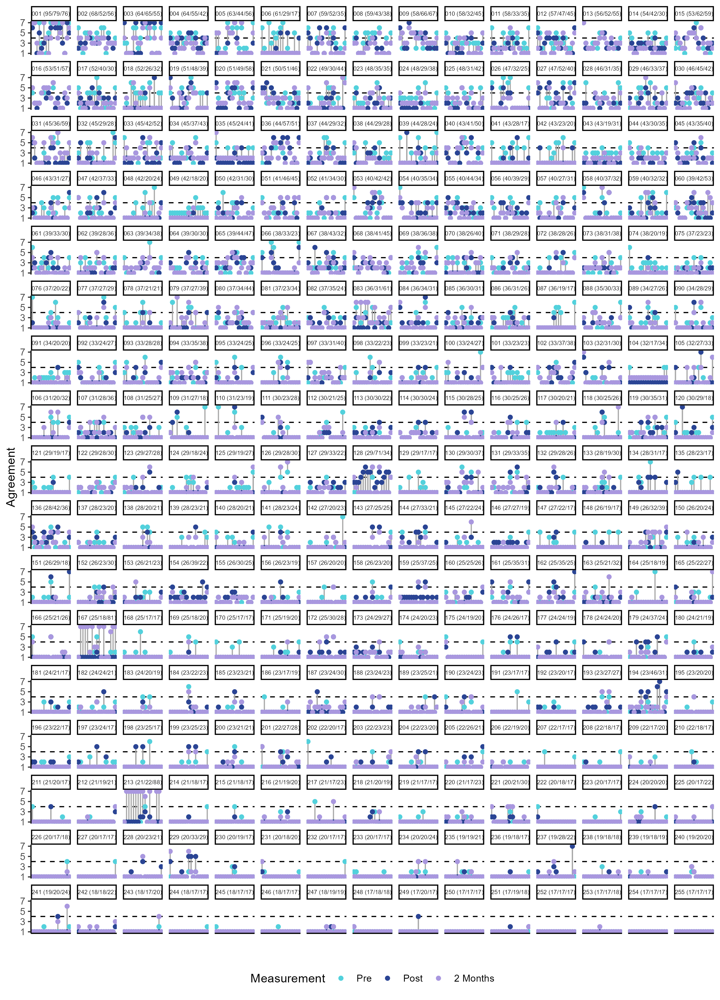
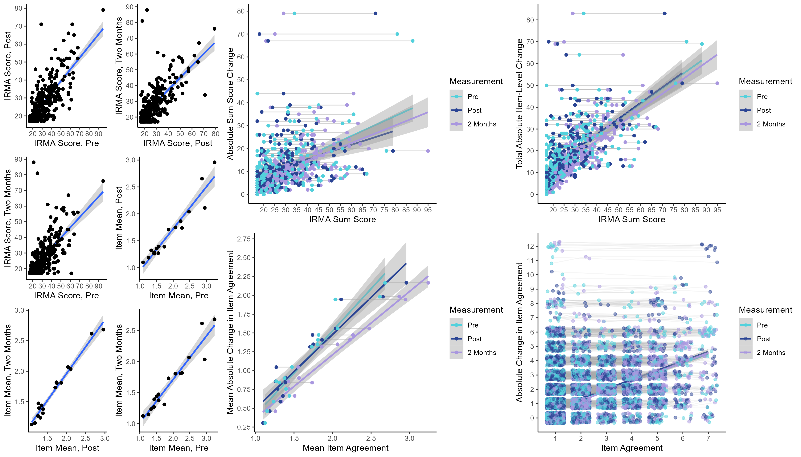

Banyard et al (2008) - Re-analysis
================

- <a href="#network-analysis" id="toc-network-analysis">Network
  Analysis</a>
  - <a href="#training-network" id="toc-training-network">Training
    Network</a>
    - <a href="#fit-indices" id="toc-fit-indices">Fit Indices</a>
    - <a href="#parameter-estimates" id="toc-parameter-estimates">Parameter
      Estimates</a>
    - <a href="#network-figures" id="toc-network-figures">Network Figures</a>
  - <a href="#test-network" id="toc-test-network">Test Network</a>
    - <a href="#fit-indices-1" id="toc-fit-indices-1">Fit Indices</a>
    - <a href="#parameter-estimates-1"
      id="toc-parameter-estimates-1">Parameter Estimates</a>
    - <a href="#network-figures-1" id="toc-network-figures-1">Network
      Figures</a>
- <a href="#factor-modeling" id="toc-factor-modeling">Factor Modeling</a>
  - <a
    href="#confirmatory-factor-analysis-with-test-data-seven-factor-model"
    id="toc-confirmatory-factor-analysis-with-test-data-seven-factor-model">Confirmatory
    Factor Analysis with Test Data (Seven-Factor Model)</a>
    - <a href="#fit-indices-2" id="toc-fit-indices-2">Fit Indices</a>
    - <a href="#parameter-estimates-2"
      id="toc-parameter-estimates-2">Parameter Estimates</a>
  - <a href="#exploratory-factor-analysis-with-training-data"
    id="toc-exploratory-factor-analysis-with-training-data">Exploratory
    Factor Analysis with Training Data</a>
  - <a href="#confirmatory-factor-analysis-with-test-data-six-factor-model"
    id="toc-confirmatory-factor-analysis-with-test-data-six-factor-model">Confirmatory
    Factor Analysis with Test Data (Six-Factor Model)</a>
- <a href="#change-over-time" id="toc-change-over-time">Change Over
  Time</a>
  - <a href="#sum-score-across-time" id="toc-sum-score-across-time">Sum
    Score Across Time</a>
  - <a href="#item-means-across-time" id="toc-item-means-across-time">Item
    Means Across Time</a>
  - <a href="#item-level-change-for-each-participant"
    id="toc-item-level-change-for-each-participant">Item-Level Change for
    Each Participant</a>
  - <a href="#relationship-between-scores-and-change-over-time"
    id="toc-relationship-between-scores-and-change-over-time">Relationship
    Between Scores and Change Over Time</a>
    - <a href="#sum-score-and-total-absolute-item-level-change"
      id="toc-sum-score-and-total-absolute-item-level-change">Sum Score and
      Total Absolute Item-Level Change</a>
    - <a href="#sum-score-and-sum-score-change"
      id="toc-sum-score-and-sum-score-change">Sum Score and Sum Score
      Change</a>
    - <a href="#item-level-mean-by-mean-absolute-change-in-item-agreement"
      id="toc-item-level-mean-by-mean-absolute-change-in-item-agreement">Item-Level
      Mean by Mean Absolute Change in Item Agreement</a>
    - <a href="#response-level-item-agreement-and-change-in-item-agreement"
      id="toc-response-level-item-agreement-and-change-in-item-agreement">Response-level
      Item Agreement and Change in Item Agreement</a>
    - <a href="#visualization" id="toc-visualization">Visualization</a>

# Network Analysis

## Training Network

### Fit Indices

``` r
network_fit_ind_1 %>% 
  mutate(across(where(is.numeric), round, 6))
```

                                Measure        Value
    logl                           logl -4318.514906
    unrestricted.logl unrestricted.logl -4259.034851
    baseline.logl         baseline.logl -4794.009265
    nvar                           nvar    17.000000
    nobs                           nobs   170.000000
    npar                           npar    65.000000
    df                               df   105.000000
    objective                 objective    16.212298
    chisq                         chisq   118.960110
    pvalue                       pvalue     0.166219
    baseline.chisq       baseline.chisq  1069.948829
    baseline.df             baseline.df   136.000000
    baseline.pvalue     baseline.pvalue     0.000000
    nfi                             nfi     0.888817
    pnfi                           pnfi     0.686219
    tli                             tli     0.980640
    nnfi                           nnfi     0.980640
    rfi                             rfi     0.855992
    ifi                             ifi     0.985533
    rni                             rni     0.985053
    cfi                             cfi     0.985053
    rmsea                         rmsea     0.027028
    rmsea.ci.lower       rmsea.ci.lower     0.000000
    rmsea.ci.upper       rmsea.ci.upper     0.048516
    rmsea.pvalue           rmsea.pvalue     0.962533
    aic.ll                       aic.ll  8767.029812
    aic.ll2                     aic.ll2  8840.995329
    aic.x                         aic.x   -91.039890
    aic.x2                       aic.x2   248.960110
    bic                             bic  8975.290247
    bic2                           bic2  8769.427137
    ebic.25                     ebic.25  9159.449114
    ebic.5                       ebic.5  9343.607982
    ebic.75                     ebic.75  9490.935075
    ebic1                         ebic1  9711.925716

### Parameter Estimates

``` r
network_pars_1 %>% 
  mutate(across(where(is.numeric), round, 3))
```

           var1 var1_id  op    var2 var2_id   est std    se     p se_boot p_boot
    1    preir1       1  ~1    <NA>      NA 2.484  NA 0.131 0.000      NA     NA
    2    preir2       2  ~1    <NA>      NA 1.720  NA 0.093 0.000      NA     NA
    3    preir3       3  ~1    <NA>      NA 1.357  NA 0.064 0.000      NA     NA
    4    preir4       4  ~1    <NA>      NA 1.209  NA 0.057 0.000      NA     NA
    5    preir6       5  ~1    <NA>      NA 1.407  NA 0.061 0.000      NA     NA
    6    preir7       6  ~1    <NA>      NA 1.659  NA 0.106 0.000      NA     NA
    7    preir8       7  ~1    <NA>      NA 2.962  NA 0.122 0.000      NA     NA
    8   preir10       8  ~1    <NA>      NA 1.868  NA 0.087 0.000      NA     NA
    9   preir11       9  ~1    <NA>      NA 1.071  NA 0.019 0.000      NA     NA
    10  preir12      10  ~1    <NA>      NA 1.429  NA 0.079 0.000      NA     NA
    11  preir13      11  ~1    <NA>      NA 1.615  NA 0.089 0.000      NA     NA
    12  preir14      12  ~1    <NA>      NA 2.302  NA 0.102 0.000      NA     NA
    13  preir16      13  ~1    <NA>      NA 1.527  NA 0.071 0.000      NA     NA
    14  preir17      14  ~1    <NA>      NA 2.093  NA 0.100 0.000      NA     NA
    15  preir18      15  ~1    <NA>      NA 3.176  NA 0.121 0.000      NA     NA
    16  preir19      16  ~1    <NA>      NA 2.363  NA 0.123 0.000      NA     NA
    17  preir20      17  ~1    <NA>      NA 2.951  NA 0.128 0.000      NA     NA
    18   preir2       2  --  preir1       1 0.000  NA    NA    NA      NA     NA
    19   preir3       3  --  preir1       1 0.000  NA    NA    NA      NA     NA
    20   preir4       4  --  preir1       1 0.000  NA    NA    NA      NA     NA
    21   preir6       5  --  preir1       1 0.204  NA 0.065 0.002      NA     NA
    22   preir7       6  --  preir1       1 0.000  NA    NA    NA      NA     NA
    23   preir8       7  --  preir1       1 0.000  NA    NA    NA      NA     NA
    24  preir10       8  --  preir1       1 0.000  NA    NA    NA      NA     NA
    25  preir11       9  --  preir1       1 0.000  NA    NA    NA      NA     NA
    26  preir12      10  --  preir1       1 0.000  NA    NA    NA      NA     NA
    27  preir13      11  --  preir1       1 0.000  NA    NA    NA      NA     NA
    28  preir14      12  --  preir1       1 0.272  NA 0.051 0.000      NA     NA
    29  preir16      13  --  preir1       1 0.157  NA 0.058 0.007      NA     NA
    30  preir17      14  --  preir1       1 0.000  NA    NA    NA      NA     NA
    31  preir18      15  --  preir1       1 0.000  NA    NA    NA      NA     NA
    32  preir19      16  --  preir1       1 0.000  NA    NA    NA      NA     NA
    33  preir20      17  --  preir1       1 0.000  NA    NA    NA      NA     NA
    34   preir3       3  --  preir2       2 0.193  NA 0.055 0.000      NA     NA
    35   preir4       4  --  preir2       2 0.449  NA 0.053 0.000      NA     NA
    36   preir6       5  --  preir2       2 0.000  NA    NA    NA      NA     NA
    37   preir7       6  --  preir2       2 0.000  NA    NA    NA      NA     NA
    38   preir8       7  --  preir2       2 0.000  NA    NA    NA      NA     NA
    39  preir10       8  --  preir2       2 0.000  NA    NA    NA      NA     NA
    40  preir11       9  --  preir2       2 0.000  NA    NA    NA      NA     NA
    41  preir12      10  --  preir2       2 0.000  NA    NA    NA      NA     NA
    42  preir13      11  --  preir2       2 0.000  NA    NA    NA      NA     NA
    43  preir14      12  --  preir2       2 0.143  NA 0.044 0.001      NA     NA
    44  preir16      13  --  preir2       2 0.000  NA    NA    NA      NA     NA
    45  preir17      14  --  preir2       2 0.000  NA    NA    NA      NA     NA
    46  preir18      15  --  preir2       2 0.175  NA 0.053 0.001      NA     NA
    47  preir19      16  --  preir2       2 0.000  NA    NA    NA      NA     NA
    48  preir20      17  --  preir2       2 0.000  NA    NA    NA      NA     NA
    49   preir4       4  --  preir3       3 0.000  NA    NA    NA      NA     NA
    50   preir6       5  --  preir3       3 0.000  NA    NA    NA      NA     NA
    51   preir7       6  --  preir3       3 0.000  NA    NA    NA      NA     NA
    52   preir8       7  --  preir3       3 0.000  NA    NA    NA      NA     NA
    53  preir10       8  --  preir3       3 0.232  NA 0.059 0.000      NA     NA
    54  preir11       9  --  preir3       3 0.000  NA    NA    NA      NA     NA
    55  preir12      10  --  preir3       3 0.000  NA    NA    NA      NA     NA
    56  preir13      11  --  preir3       3 0.000  NA    NA    NA      NA     NA
    57  preir14      12  --  preir3       3 0.000  NA    NA    NA      NA     NA
    58  preir16      13  --  preir3       3 0.245  NA 0.057 0.000      NA     NA
    59  preir17      14  --  preir3       3 0.000  NA    NA    NA      NA     NA
    60  preir18      15  --  preir3       3 0.000  NA    NA    NA      NA     NA
    61  preir19      16  --  preir3       3 0.000  NA    NA    NA      NA     NA
    62  preir20      17  --  preir3       3 0.000  NA    NA    NA      NA     NA
    63   preir6       5  --  preir4       4 0.000  NA    NA    NA      NA     NA
    64   preir7       6  --  preir4       4 0.000  NA    NA    NA      NA     NA
    65   preir8       7  --  preir4       4 0.000  NA    NA    NA      NA     NA
    66  preir10       8  --  preir4       4 0.000  NA    NA    NA      NA     NA
    67  preir11       9  --  preir4       4 0.000  NA    NA    NA      NA     NA
    68  preir12      10  --  preir4       4 0.204  NA 0.053 0.000      NA     NA
    69  preir13      11  --  preir4       4 0.144  NA 0.054 0.007      NA     NA
    70  preir14      12  --  preir4       4 0.000  NA    NA    NA      NA     NA
    71  preir16      13  --  preir4       4 0.000  NA    NA    NA      NA     NA
    72  preir17      14  --  preir4       4 0.000  NA    NA    NA      NA     NA
    73  preir18      15  --  preir4       4 0.000  NA    NA    NA      NA     NA
    74  preir19      16  --  preir4       4 0.000  NA    NA    NA      NA     NA
    75  preir20      17  --  preir4       4 0.000  NA    NA    NA      NA     NA
    76   preir7       6  --  preir6       5 0.000  NA    NA    NA      NA     NA
    77   preir8       7  --  preir6       5 0.000  NA    NA    NA      NA     NA
    78  preir10       8  --  preir6       5 0.000  NA    NA    NA      NA     NA
    79  preir11       9  --  preir6       5 0.221  NA 0.061 0.000      NA     NA
    80  preir12      10  --  preir6       5 0.269  NA 0.056 0.000      NA     NA
    81  preir13      11  --  preir6       5 0.000  NA    NA    NA      NA     NA
    82  preir14      12  --  preir6       5 0.138  NA 0.050 0.006      NA     NA
    83  preir16      13  --  preir6       5 0.000  NA    NA    NA      NA     NA
    84  preir17      14  --  preir6       5 0.000  NA    NA    NA      NA     NA
    85  preir18      15  --  preir6       5 0.000  NA    NA    NA      NA     NA
    86  preir19      16  --  preir6       5 0.000  NA    NA    NA      NA     NA
    87  preir20      17  --  preir6       5 0.000  NA    NA    NA      NA     NA
    88   preir8       7  --  preir7       6 0.000  NA    NA    NA      NA     NA
    89  preir10       8  --  preir7       6 0.200  NA 0.057 0.000      NA     NA
    90  preir11       9  --  preir7       6 0.000  NA    NA    NA      NA     NA
    91  preir12      10  --  preir7       6 0.294  NA 0.058 0.000      NA     NA
    92  preir13      11  --  preir7       6 0.000  NA    NA    NA      NA     NA
    93  preir14      12  --  preir7       6 0.000  NA    NA    NA      NA     NA
    94  preir16      13  --  preir7       6 0.000  NA    NA    NA      NA     NA
    95  preir17      14  --  preir7       6 0.000  NA    NA    NA      NA     NA
    96  preir18      15  --  preir7       6 0.000  NA    NA    NA      NA     NA
    97  preir19      16  --  preir7       6 0.000  NA    NA    NA      NA     NA
    98  preir20      17  --  preir7       6 0.000  NA    NA    NA      NA     NA
    99  preir10       8  --  preir8       7 0.221  NA 0.056 0.000      NA     NA
    100 preir11       9  --  preir8       7 0.000  NA    NA    NA      NA     NA
    101 preir12      10  --  preir8       7 0.000  NA    NA    NA      NA     NA
    102 preir13      11  --  preir8       7 0.000  NA    NA    NA      NA     NA
    103 preir14      12  --  preir8       7 0.388  NA 0.046 0.000      NA     NA
    104 preir16      13  --  preir8       7 0.000  NA    NA    NA      NA     NA
    105 preir17      14  --  preir8       7 0.000  NA    NA    NA      NA     NA
    106 preir18      15  --  preir8       7 0.000  NA    NA    NA      NA     NA
    107 preir19      16  --  preir8       7 0.000  NA    NA    NA      NA     NA
    108 preir20      17  --  preir8       7 0.000  NA    NA    NA      NA     NA
    109 preir11       9  -- preir10       8 0.000  NA    NA    NA      NA     NA
    110 preir12      10  -- preir10       8 0.000  NA    NA    NA      NA     NA
    111 preir13      11  -- preir10       8 0.000  NA    NA    NA      NA     NA
    112 preir14      12  -- preir10       8 0.000  NA    NA    NA      NA     NA
    113 preir16      13  -- preir10       8 0.000  NA    NA    NA      NA     NA
    114 preir17      14  -- preir10       8 0.000  NA    NA    NA      NA     NA
    115 preir18      15  -- preir10       8 0.000  NA    NA    NA      NA     NA
    116 preir19      16  -- preir10       8 0.187  NA 0.056 0.001      NA     NA
    117 preir20      17  -- preir10       8 0.175  NA 0.060 0.004      NA     NA
    118 preir12      10  -- preir11       9 0.000  NA    NA    NA      NA     NA
    119 preir13      11  -- preir11       9 0.000  NA    NA    NA      NA     NA
    120 preir14      12  -- preir11       9 0.000  NA    NA    NA      NA     NA
    121 preir16      13  -- preir11       9 0.240  NA 0.056 0.000      NA     NA
    122 preir17      14  -- preir11       9 0.000  NA    NA    NA      NA     NA
    123 preir18      15  -- preir11       9 0.000  NA    NA    NA      NA     NA
    124 preir19      16  -- preir11       9 0.000  NA    NA    NA      NA     NA
    125 preir20      17  -- preir11       9 0.000  NA    NA    NA      NA     NA
    126 preir13      11  -- preir12      10 0.000  NA    NA    NA      NA     NA
    127 preir14      12  -- preir12      10 0.000  NA    NA    NA      NA     NA
    128 preir16      13  -- preir12      10 0.000  NA    NA    NA      NA     NA
    129 preir17      14  -- preir12      10 0.209  NA 0.058 0.000      NA     NA
    130 preir18      15  -- preir12      10 0.000  NA    NA    NA      NA     NA
    131 preir19      16  -- preir12      10 0.000  NA    NA    NA      NA     NA
    132 preir20      17  -- preir12      10 0.000  NA    NA    NA      NA     NA
    133 preir14      12  -- preir13      11 0.404  NA 0.048 0.000      NA     NA
    134 preir16      13  -- preir13      11 0.151  NA 0.055 0.006      NA     NA
    135 preir17      14  -- preir13      11 0.000  NA    NA    NA      NA     NA
    136 preir18      15  -- preir13      11 0.000  NA    NA    NA      NA     NA
    137 preir19      16  -- preir13      11 0.000  NA    NA    NA      NA     NA
    138 preir20      17  -- preir13      11 0.000  NA    NA    NA      NA     NA
    139 preir16      13  -- preir14      12 0.000  NA    NA    NA      NA     NA
    140 preir17      14  -- preir14      12 0.000  NA    NA    NA      NA     NA
    141 preir18      15  -- preir14      12 0.000  NA    NA    NA      NA     NA
    142 preir19      16  -- preir14      12 0.186  NA 0.046 0.000      NA     NA
    143 preir20      17  -- preir14      12 0.000  NA    NA    NA      NA     NA
    144 preir17      14  -- preir16      13 0.000  NA    NA    NA      NA     NA
    145 preir18      15  -- preir16      13 0.000  NA    NA    NA      NA     NA
    146 preir19      16  -- preir16      13 0.228  NA 0.056 0.000      NA     NA
    147 preir20      17  -- preir16      13 0.138  NA 0.057 0.016      NA     NA
    148 preir18      15  -- preir17      14 0.187  NA 0.064 0.004      NA     NA
    149 preir19      16  -- preir17      14 0.207  NA 0.060 0.001      NA     NA
    150 preir20      17  -- preir17      14 0.000  NA    NA    NA      NA     NA
    151 preir19      16  -- preir18      15 0.241  NA 0.058 0.000      NA     NA
    152 preir20      17  -- preir18      15 0.295  NA 0.060 0.000      NA     NA
    153 preir20      17  -- preir19      16 0.000  NA    NA    NA      NA     NA
    154  preir1       1 ~/~  preir1       1 1.432  NA 0.075 0.000      NA     NA
    155  preir2       2 ~/~  preir2       2 0.935  NA 0.047 0.000      NA     NA
    156  preir3       3 ~/~  preir3       3 0.726  NA 0.038 0.000      NA     NA
    157  preir4       4 ~/~  preir4       4 0.594  NA 0.030 0.000      NA     NA
    158  preir6       5 ~/~  preir6       5 0.672  NA 0.034 0.000      NA     NA
    159  preir7       6 ~/~  preir7       6 1.283  NA 0.067 0.000      NA     NA
    160  preir8       7 ~/~  preir8       7 1.287  NA 0.067 0.000      NA     NA
    161 preir10       8 ~/~ preir10       8 0.933  NA 0.047 0.000      NA     NA
    162 preir11       9 ~/~ preir11       9 0.233  NA 0.012 0.000      NA     NA
    163 preir12      10 ~/~ preir12      10 0.861  NA 0.044 0.000      NA     NA
    164 preir13      11 ~/~ preir13      11 0.902  NA 0.047 0.000      NA     NA
    165 preir14      12 ~/~ preir14      12 0.816  NA 0.037 0.000      NA     NA
    166 preir16      13 ~/~ preir16      13 0.721  NA 0.036 0.000      NA     NA
    167 preir17      14 ~/~ preir17      14 1.173  NA 0.061 0.000      NA     NA
    168 preir18      15 ~/~ preir18      15 1.295  NA 0.066 0.000      NA     NA
    169 preir19      16 ~/~ preir19      16 1.206  NA 0.060 0.000      NA     NA
    170 preir20      17 ~/~ preir20      17 1.487  NA 0.077 0.000      NA     NA
        matrix row col par      group group_id fixed    mi   pmi    epc mi_free
    1       mu   1   1   1 fullsample        1 FALSE 0.000 1.000  0.000      NA
    2       mu   2   1   2 fullsample        1 FALSE 0.000 1.000  0.000      NA
    3       mu   3   1   3 fullsample        1 FALSE 0.000 1.000  0.000      NA
    4       mu   4   1   4 fullsample        1 FALSE 0.000 1.000  0.000      NA
    5       mu   5   1   5 fullsample        1 FALSE 0.000 1.000  0.000      NA
    6       mu   6   1   6 fullsample        1 FALSE 0.000 1.000  0.000      NA
    7       mu   7   1   7 fullsample        1 FALSE 0.000 1.000  0.000      NA
    8       mu   8   1   8 fullsample        1 FALSE 0.000 1.000  0.000      NA
    9       mu   9   1   9 fullsample        1 FALSE 0.000 1.000  0.000      NA
    10      mu  10   1  10 fullsample        1 FALSE 0.000 1.000  0.000      NA
    11      mu  11   1  11 fullsample        1 FALSE 0.000 1.000  0.000      NA
    12      mu  12   1  12 fullsample        1 FALSE 0.000 1.000  0.000      NA
    13      mu  13   1  13 fullsample        1 FALSE 0.000 1.000  0.000      NA
    14      mu  14   1  14 fullsample        1 FALSE 0.000 1.000  0.000      NA
    15      mu  15   1  15 fullsample        1 FALSE 0.000 1.000  0.000      NA
    16      mu  16   1  16 fullsample        1 FALSE 0.000 1.000  0.000      NA
    17      mu  17   1  17 fullsample        1 FALSE 0.000 1.000  0.000      NA
    18   omega   2   1   0 fullsample        1  TRUE 4.804 0.028  0.130      NA
    19   omega   3   1   0 fullsample        1  TRUE 2.068 0.150  0.090      NA
    20   omega   4   1   0 fullsample        1  TRUE 0.025 0.874  0.009      NA
    21   omega   5   1  18 fullsample        1 FALSE 0.000 1.000  0.000      NA
    22   omega   6   1   0 fullsample        1  TRUE 0.233 0.629 -0.028      NA
    23   omega   7   1   0 fullsample        1  TRUE 2.400 0.121  0.106      NA
    24   omega   8   1   0 fullsample        1  TRUE 4.642 0.031  0.124      NA
    25   omega   9   1   0 fullsample        1  TRUE 1.420 0.233 -0.081      NA
    26   omega  10   1   0 fullsample        1  TRUE 0.596 0.440  0.046      NA
    27   omega  11   1   0 fullsample        1  TRUE 0.009 0.926  0.007      NA
    28   omega  12   1  19 fullsample        1 FALSE 0.000 1.000  0.000      NA
    29   omega  13   1  20 fullsample        1 FALSE 0.000 1.000  0.000      NA
    30   omega  14   1   0 fullsample        1  TRUE 0.228 0.633  0.028      NA
    31   omega  15   1   0 fullsample        1  TRUE 2.553 0.110  0.089      NA
    32   omega  16   1   0 fullsample        1  TRUE 0.340 0.560  0.037      NA
    33   omega  17   1   0 fullsample        1  TRUE 2.820 0.093  0.102      NA
    34   omega   3   2  21 fullsample        1 FALSE 0.000 1.000  0.000      NA
    35   omega   4   2  22 fullsample        1 FALSE 0.000 1.000  0.000      NA
    36   omega   5   2   0 fullsample        1  TRUE 0.840 0.359 -0.052      NA
    37   omega   6   2   0 fullsample        1  TRUE 0.376 0.540 -0.034      NA
    38   omega   7   2   0 fullsample        1  TRUE 0.331 0.565 -0.034      NA
    39   omega   8   2   0 fullsample        1  TRUE 0.132 0.716 -0.020      NA
    40   omega   9   2   0 fullsample        1  TRUE 0.579 0.447  0.042      NA
    41   omega  10   2   0 fullsample        1  TRUE 1.905 0.168 -0.083      NA
    42   omega  11   2   0 fullsample        1  TRUE 1.535 0.215 -0.083      NA
    43   omega  12   2  23 fullsample        1 FALSE 0.000 1.000  0.000      NA
    44   omega  13   2   0 fullsample        1  TRUE 0.306 0.580  0.031      NA
    45   omega  14   2   0 fullsample        1  TRUE 0.002 0.961 -0.003      NA
    46   omega  15   2  24 fullsample        1 FALSE 0.000 1.000  0.000      NA
    47   omega  16   2   0 fullsample        1  TRUE 0.303 0.582  0.032      NA
    48   omega  17   2   0 fullsample        1  TRUE 0.010 0.921 -0.006      NA
    49   omega   4   3   0 fullsample        1  TRUE 0.803 0.370  0.058      NA
    50   omega   5   3   0 fullsample        1  TRUE 0.237 0.627 -0.028      NA
    51   omega   6   3   0 fullsample        1  TRUE 0.053 0.819  0.015      NA
    52   omega   7   3   0 fullsample        1  TRUE 0.164 0.686 -0.025      NA
    53   omega   8   3  25 fullsample        1 FALSE 0.000 1.000  0.000      NA
    54   omega   9   3   0 fullsample        1  TRUE 2.045 0.153  0.095      NA
    55   omega  10   3   0 fullsample        1  TRUE 1.705 0.192  0.074      NA
    56   omega  11   3   0 fullsample        1  TRUE 0.396 0.529 -0.038      NA
    57   omega  12   3   0 fullsample        1  TRUE 1.508 0.219  0.062      NA
    58   omega  13   3  26 fullsample        1 FALSE 0.000 1.000  0.000      NA
    59   omega  14   3   0 fullsample        1  TRUE 0.184 0.668  0.026      NA
    60   omega  15   3   0 fullsample        1  TRUE 0.123 0.726  0.021      NA
    61   omega  16   3   0 fullsample        1  TRUE 2.357 0.125  0.097      NA
    62   omega  17   3   0 fullsample        1  TRUE 2.457 0.117  0.107      NA
    63   omega   5   4   0 fullsample        1  TRUE 3.831 0.050 -0.115      NA
    64   omega   6   4   0 fullsample        1  TRUE 0.067 0.796  0.016      NA
    65   omega   7   4   0 fullsample        1  TRUE 1.204 0.273  0.060      NA
    66   omega   8   4   0 fullsample        1  TRUE 0.616 0.433  0.042      NA
    67   omega   9   4   0 fullsample        1  TRUE 0.080 0.777  0.016      NA
    68   omega  10   4  27 fullsample        1 FALSE 0.000 1.000  0.000      NA
    69   omega  11   4  28 fullsample        1 FALSE 0.000 1.000  0.000      NA
    70   omega  12   4   0 fullsample        1  TRUE 0.494 0.482 -0.039      NA
    71   omega  13   4   0 fullsample        1  TRUE 3.042 0.081 -0.094      NA
    72   omega  14   4   0 fullsample        1  TRUE 0.001 0.970 -0.002      NA
    73   omega  15   4   0 fullsample        1  TRUE 1.224 0.269  0.068      NA
    74   omega  16   4   0 fullsample        1  TRUE 0.642 0.423  0.042      NA
    75   omega  17   4   0 fullsample        1  TRUE 0.822 0.365  0.051      NA
    76   omega   6   5   0 fullsample        1  TRUE 3.558 0.059 -0.122      NA
    77   omega   7   5   0 fullsample        1  TRUE 1.031 0.310  0.065      NA
    78   omega   8   5   0 fullsample        1  TRUE 1.135 0.287  0.060      NA
    79   omega   9   5  29 fullsample        1 FALSE 0.000 1.000  0.000      NA
    80   omega  10   5  30 fullsample        1 FALSE 0.000 1.000  0.000      NA
    81   omega  11   5   0 fullsample        1  TRUE 0.291 0.590  0.035      NA
    82   omega  12   5  31 fullsample        1 FALSE 0.000 1.000  0.000      NA
    83   omega  13   5   0 fullsample        1  TRUE 3.204 0.073  0.109      NA
    84   omega  14   5   0 fullsample        1  TRUE 1.694 0.193  0.082      NA
    85   omega  15   5   0 fullsample        1  TRUE 0.378 0.539  0.034      NA
    86   omega  16   5   0 fullsample        1  TRUE 3.911 0.048  0.114      NA
    87   omega  17   5   0 fullsample        1  TRUE 1.740 0.187  0.076      NA
    88   omega   7   6   0 fullsample        1  TRUE 0.006 0.940 -0.005      NA
    89   omega   8   6  32 fullsample        1 FALSE 0.000 1.000  0.000      NA
    90   omega   9   6   0 fullsample        1  TRUE 0.021 0.884  0.009      NA
    91   omega  10   6  33 fullsample        1 FALSE 0.000 1.000  0.000      NA
    92   omega  11   6   0 fullsample        1  TRUE 0.054 0.816  0.013      NA
    93   omega  12   6   0 fullsample        1  TRUE 0.881 0.348 -0.043      NA
    94   omega  13   6   0 fullsample        1  TRUE 0.266 0.606 -0.029      NA
    95   omega  14   6   0 fullsample        1  TRUE 2.108 0.146 -0.098      NA
    96   omega  15   6   0 fullsample        1  TRUE 0.142 0.706 -0.022      NA
    97   omega  16   6   0 fullsample        1  TRUE 3.865 0.049 -0.114      NA
    98   omega  17   6   0 fullsample        1  TRUE 0.242 0.623 -0.032      NA
    99   omega   8   7  34 fullsample        1 FALSE 0.000 1.000  0.000      NA
    100  omega   9   7   0 fullsample        1  TRUE 0.032 0.857 -0.010      NA
    101  omega  10   7   0 fullsample        1  TRUE 1.058 0.304  0.055      NA
    102  omega  11   7   0 fullsample        1  TRUE 1.736 0.188  0.092      NA
    103  omega  12   7  35 fullsample        1 FALSE 0.000 1.000  0.000      NA
    104  omega  13   7   0 fullsample        1  TRUE 0.008 0.928 -0.005      NA
    105  omega  14   7   0 fullsample        1  TRUE 0.000 0.998  0.000      NA
    106  omega  15   7   0 fullsample        1  TRUE 0.813 0.367  0.049      NA
    107  omega  16   7   0 fullsample        1  TRUE 1.004 0.316  0.064      NA
    108  omega  17   7   0 fullsample        1  TRUE 0.408 0.523 -0.038      NA
    109  omega   9   8   0 fullsample        1  TRUE 0.013 0.910 -0.007      NA
    110  omega  10   8   0 fullsample        1  TRUE 4.420 0.036  0.120      NA
    111  omega  11   8   0 fullsample        1  TRUE 0.172 0.678  0.023      NA
    112  omega  12   8   0 fullsample        1  TRUE 0.944 0.331  0.052      NA
    113  omega  13   8   0 fullsample        1  TRUE 0.715 0.398  0.054      NA
    114  omega  14   8   0 fullsample        1  TRUE 0.189 0.664 -0.027      NA
    115  omega  15   8   0 fullsample        1  TRUE 2.276 0.131  0.096      NA
    116  omega  16   8  36 fullsample        1 FALSE 0.000 1.000  0.000      NA
    117  omega  17   8  37 fullsample        1 FALSE 0.000 1.000  0.000      NA
    118  omega  10   9   0 fullsample        1  TRUE 0.207 0.649  0.029      NA
    119  omega  11   9   0 fullsample        1  TRUE 2.459 0.117  0.095      NA
    120  omega  12   9   0 fullsample        1  TRUE 0.419 0.518  0.033      NA
    121  omega  13   9  38 fullsample        1 FALSE 0.000 1.000  0.000      NA
    122  omega  14   9   0 fullsample        1  TRUE 0.631 0.427 -0.050      NA
    123  omega  15   9   0 fullsample        1  TRUE 0.818 0.366 -0.053      NA
    124  omega  16   9   0 fullsample        1  TRUE 0.024 0.877 -0.009      NA
    125  omega  17   9   0 fullsample        1  TRUE 0.185 0.667  0.028      NA
    126  omega  11  10   0 fullsample        1  TRUE 1.672 0.196  0.071      NA
    127  omega  12  10   0 fullsample        1  TRUE 0.350 0.554  0.028      NA
    128  omega  13  10   0 fullsample        1  TRUE 0.128 0.721  0.019      NA
    129  omega  14  10  39 fullsample        1 FALSE 0.000 1.000  0.000      NA
    130  omega  15  10   0 fullsample        1  TRUE 1.401 0.237  0.068      NA
    131  omega  16  10   0 fullsample        1  TRUE 3.213 0.073  0.098      NA
    132  omega  17  10   0 fullsample        1  TRUE 3.088 0.079  0.100      NA
    133  omega  12  11  40 fullsample        1 FALSE 0.000 1.000  0.000      NA
    134  omega  13  11  41 fullsample        1 FALSE 0.000 1.000  0.000      NA
    135  omega  14  11   0 fullsample        1  TRUE 2.068 0.150 -0.081      NA
    136  omega  15  11   0 fullsample        1  TRUE 0.410 0.522 -0.035      NA
    137  omega  16  11   0 fullsample        1  TRUE 0.028 0.868  0.011      NA
    138  omega  17  11   0 fullsample        1  TRUE 0.000 0.994  0.000      NA
    139  omega  13  12   0 fullsample        1  TRUE 1.536 0.215  0.072      NA
    140  omega  14  12   0 fullsample        1  TRUE 0.012 0.912  0.006      NA
    141  omega  15  12   0 fullsample        1  TRUE 0.031 0.860  0.009      NA
    142  omega  16  12  42 fullsample        1 FALSE 0.000 1.000  0.000      NA
    143  omega  17  12   0 fullsample        1  TRUE 0.738 0.390 -0.041      NA
    144  omega  14  13   0 fullsample        1  TRUE 0.695 0.404 -0.051      NA
    145  omega  15  13   0 fullsample        1  TRUE 2.241 0.134  0.093      NA
    146  omega  16  13  43 fullsample        1 FALSE 0.000 1.000  0.000      NA
    147  omega  17  13  44 fullsample        1 FALSE 0.000 1.000  0.000      NA
    148  omega  15  14  45 fullsample        1 FALSE 0.000 1.000  0.000      NA
    149  omega  16  14  46 fullsample        1 FALSE 0.000 1.000  0.000      NA
    150  omega  17  14   0 fullsample        1  TRUE 0.008 0.928  0.006      NA
    151  omega  16  15  47 fullsample        1 FALSE 0.000 1.000  0.000      NA
    152  omega  17  15  48 fullsample        1 FALSE 0.000 1.000  0.000      NA
    153  omega  17  16   0 fullsample        1  TRUE 0.372 0.542 -0.041      NA
    154  delta   1   1  49 fullsample        1 FALSE 0.000 1.000  0.000      NA
    155  delta   2   2  50 fullsample        1 FALSE 0.000 1.000  0.000      NA
    156  delta   3   3  51 fullsample        1 FALSE 0.000 1.000  0.000      NA
    157  delta   4   4  52 fullsample        1 FALSE 0.000 1.000  0.000      NA
    158  delta   5   5  53 fullsample        1 FALSE 0.000 1.000  0.000      NA
    159  delta   6   6  54 fullsample        1 FALSE 0.000 1.000  0.000      NA
    160  delta   7   7  55 fullsample        1 FALSE 0.000 1.000  0.000      NA
    161  delta   8   8  56 fullsample        1 FALSE 0.000 1.000  0.000      NA
    162  delta   9   9  57 fullsample        1 FALSE 0.000 1.000  0.000      NA
    163  delta  10  10  58 fullsample        1 FALSE 0.000 1.000  0.000      NA
    164  delta  11  11  59 fullsample        1 FALSE 0.000 1.000  0.000      NA
    165  delta  12  12  60 fullsample        1 FALSE 0.000 1.000  0.000      NA
    166  delta  13  13  61 fullsample        1 FALSE 0.000 1.000  0.000      NA
    167  delta  14  14  62 fullsample        1 FALSE 0.000 1.000  0.000      NA
    168  delta  15  15  63 fullsample        1 FALSE 0.000 1.000  0.000      NA
    169  delta  16  16  64 fullsample        1 FALSE 0.000 1.000  0.000      NA
    170  delta  17  17  65 fullsample        1 FALSE 0.000 1.000  0.000      NA
        pmi_free epc_free mi_equal pmi_equal epc_equal minimum maximum identified
    1         NA       NA       NA        NA        NA    -Inf     Inf      FALSE
    2         NA       NA       NA        NA        NA    -Inf     Inf      FALSE
    3         NA       NA       NA        NA        NA    -Inf     Inf      FALSE
    4         NA       NA       NA        NA        NA    -Inf     Inf      FALSE
    5         NA       NA       NA        NA        NA    -Inf     Inf      FALSE
    6         NA       NA       NA        NA        NA    -Inf     Inf      FALSE
    7         NA       NA       NA        NA        NA    -Inf     Inf      FALSE
    8         NA       NA       NA        NA        NA    -Inf     Inf      FALSE
    9         NA       NA       NA        NA        NA    -Inf     Inf      FALSE
    10        NA       NA       NA        NA        NA    -Inf     Inf      FALSE
    11        NA       NA       NA        NA        NA    -Inf     Inf      FALSE
    12        NA       NA       NA        NA        NA    -Inf     Inf      FALSE
    13        NA       NA       NA        NA        NA    -Inf     Inf      FALSE
    14        NA       NA       NA        NA        NA    -Inf     Inf      FALSE
    15        NA       NA       NA        NA        NA    -Inf     Inf      FALSE
    16        NA       NA       NA        NA        NA    -Inf     Inf      FALSE
    17        NA       NA       NA        NA        NA    -Inf     Inf      FALSE
    18        NA       NA       NA        NA        NA      -1       1      FALSE
    19        NA       NA       NA        NA        NA      -1       1      FALSE
    20        NA       NA       NA        NA        NA      -1       1      FALSE
    21        NA       NA       NA        NA        NA      -1       1      FALSE
    22        NA       NA       NA        NA        NA      -1       1      FALSE
    23        NA       NA       NA        NA        NA      -1       1      FALSE
    24        NA       NA       NA        NA        NA      -1       1      FALSE
    25        NA       NA       NA        NA        NA      -1       1      FALSE
    26        NA       NA       NA        NA        NA      -1       1      FALSE
    27        NA       NA       NA        NA        NA      -1       1      FALSE
    28        NA       NA       NA        NA        NA      -1       1      FALSE
    29        NA       NA       NA        NA        NA      -1       1      FALSE
    30        NA       NA       NA        NA        NA      -1       1      FALSE
    31        NA       NA       NA        NA        NA      -1       1      FALSE
    32        NA       NA       NA        NA        NA      -1       1      FALSE
    33        NA       NA       NA        NA        NA      -1       1      FALSE
    34        NA       NA       NA        NA        NA      -1       1      FALSE
    35        NA       NA       NA        NA        NA      -1       1      FALSE
    36        NA       NA       NA        NA        NA      -1       1      FALSE
    37        NA       NA       NA        NA        NA      -1       1      FALSE
    38        NA       NA       NA        NA        NA      -1       1      FALSE
    39        NA       NA       NA        NA        NA      -1       1      FALSE
    40        NA       NA       NA        NA        NA      -1       1      FALSE
    41        NA       NA       NA        NA        NA      -1       1      FALSE
    42        NA       NA       NA        NA        NA      -1       1      FALSE
    43        NA       NA       NA        NA        NA      -1       1      FALSE
    44        NA       NA       NA        NA        NA      -1       1      FALSE
    45        NA       NA       NA        NA        NA      -1       1      FALSE
    46        NA       NA       NA        NA        NA      -1       1      FALSE
    47        NA       NA       NA        NA        NA      -1       1      FALSE
    48        NA       NA       NA        NA        NA      -1       1      FALSE
    49        NA       NA       NA        NA        NA      -1       1      FALSE
    50        NA       NA       NA        NA        NA      -1       1      FALSE
    51        NA       NA       NA        NA        NA      -1       1      FALSE
    52        NA       NA       NA        NA        NA      -1       1      FALSE
    53        NA       NA       NA        NA        NA      -1       1      FALSE
    54        NA       NA       NA        NA        NA      -1       1      FALSE
    55        NA       NA       NA        NA        NA      -1       1      FALSE
    56        NA       NA       NA        NA        NA      -1       1      FALSE
    57        NA       NA       NA        NA        NA      -1       1      FALSE
    58        NA       NA       NA        NA        NA      -1       1      FALSE
    59        NA       NA       NA        NA        NA      -1       1      FALSE
    60        NA       NA       NA        NA        NA      -1       1      FALSE
    61        NA       NA       NA        NA        NA      -1       1      FALSE
    62        NA       NA       NA        NA        NA      -1       1      FALSE
    63        NA       NA       NA        NA        NA      -1       1      FALSE
    64        NA       NA       NA        NA        NA      -1       1      FALSE
    65        NA       NA       NA        NA        NA      -1       1      FALSE
    66        NA       NA       NA        NA        NA      -1       1      FALSE
    67        NA       NA       NA        NA        NA      -1       1      FALSE
    68        NA       NA       NA        NA        NA      -1       1      FALSE
    69        NA       NA       NA        NA        NA      -1       1      FALSE
    70        NA       NA       NA        NA        NA      -1       1      FALSE
    71        NA       NA       NA        NA        NA      -1       1      FALSE
    72        NA       NA       NA        NA        NA      -1       1      FALSE
    73        NA       NA       NA        NA        NA      -1       1      FALSE
    74        NA       NA       NA        NA        NA      -1       1      FALSE
    75        NA       NA       NA        NA        NA      -1       1      FALSE
    76        NA       NA       NA        NA        NA      -1       1      FALSE
    77        NA       NA       NA        NA        NA      -1       1      FALSE
    78        NA       NA       NA        NA        NA      -1       1      FALSE
    79        NA       NA       NA        NA        NA      -1       1      FALSE
    80        NA       NA       NA        NA        NA      -1       1      FALSE
    81        NA       NA       NA        NA        NA      -1       1      FALSE
    82        NA       NA       NA        NA        NA      -1       1      FALSE
    83        NA       NA       NA        NA        NA      -1       1      FALSE
    84        NA       NA       NA        NA        NA      -1       1      FALSE
    85        NA       NA       NA        NA        NA      -1       1      FALSE
    86        NA       NA       NA        NA        NA      -1       1      FALSE
    87        NA       NA       NA        NA        NA      -1       1      FALSE
    88        NA       NA       NA        NA        NA      -1       1      FALSE
    89        NA       NA       NA        NA        NA      -1       1      FALSE
    90        NA       NA       NA        NA        NA      -1       1      FALSE
    91        NA       NA       NA        NA        NA      -1       1      FALSE
    92        NA       NA       NA        NA        NA      -1       1      FALSE
    93        NA       NA       NA        NA        NA      -1       1      FALSE
    94        NA       NA       NA        NA        NA      -1       1      FALSE
    95        NA       NA       NA        NA        NA      -1       1      FALSE
    96        NA       NA       NA        NA        NA      -1       1      FALSE
    97        NA       NA       NA        NA        NA      -1       1      FALSE
    98        NA       NA       NA        NA        NA      -1       1      FALSE
    99        NA       NA       NA        NA        NA      -1       1      FALSE
    100       NA       NA       NA        NA        NA      -1       1      FALSE
    101       NA       NA       NA        NA        NA      -1       1      FALSE
    102       NA       NA       NA        NA        NA      -1       1      FALSE
    103       NA       NA       NA        NA        NA      -1       1      FALSE
    104       NA       NA       NA        NA        NA      -1       1      FALSE
    105       NA       NA       NA        NA        NA      -1       1      FALSE
    106       NA       NA       NA        NA        NA      -1       1      FALSE
    107       NA       NA       NA        NA        NA      -1       1      FALSE
    108       NA       NA       NA        NA        NA      -1       1      FALSE
    109       NA       NA       NA        NA        NA      -1       1      FALSE
    110       NA       NA       NA        NA        NA      -1       1      FALSE
    111       NA       NA       NA        NA        NA      -1       1      FALSE
    112       NA       NA       NA        NA        NA      -1       1      FALSE
    113       NA       NA       NA        NA        NA      -1       1      FALSE
    114       NA       NA       NA        NA        NA      -1       1      FALSE
    115       NA       NA       NA        NA        NA      -1       1      FALSE
    116       NA       NA       NA        NA        NA      -1       1      FALSE
    117       NA       NA       NA        NA        NA      -1       1      FALSE
    118       NA       NA       NA        NA        NA      -1       1      FALSE
    119       NA       NA       NA        NA        NA      -1       1      FALSE
    120       NA       NA       NA        NA        NA      -1       1      FALSE
    121       NA       NA       NA        NA        NA      -1       1      FALSE
    122       NA       NA       NA        NA        NA      -1       1      FALSE
    123       NA       NA       NA        NA        NA      -1       1      FALSE
    124       NA       NA       NA        NA        NA      -1       1      FALSE
    125       NA       NA       NA        NA        NA      -1       1      FALSE
    126       NA       NA       NA        NA        NA      -1       1      FALSE
    127       NA       NA       NA        NA        NA      -1       1      FALSE
    128       NA       NA       NA        NA        NA      -1       1      FALSE
    129       NA       NA       NA        NA        NA      -1       1      FALSE
    130       NA       NA       NA        NA        NA      -1       1      FALSE
    131       NA       NA       NA        NA        NA      -1       1      FALSE
    132       NA       NA       NA        NA        NA      -1       1      FALSE
    133       NA       NA       NA        NA        NA      -1       1      FALSE
    134       NA       NA       NA        NA        NA      -1       1      FALSE
    135       NA       NA       NA        NA        NA      -1       1      FALSE
    136       NA       NA       NA        NA        NA      -1       1      FALSE
    137       NA       NA       NA        NA        NA      -1       1      FALSE
    138       NA       NA       NA        NA        NA      -1       1      FALSE
    139       NA       NA       NA        NA        NA      -1       1      FALSE
    140       NA       NA       NA        NA        NA      -1       1      FALSE
    141       NA       NA       NA        NA        NA      -1       1      FALSE
    142       NA       NA       NA        NA        NA      -1       1      FALSE
    143       NA       NA       NA        NA        NA      -1       1      FALSE
    144       NA       NA       NA        NA        NA      -1       1      FALSE
    145       NA       NA       NA        NA        NA      -1       1      FALSE
    146       NA       NA       NA        NA        NA      -1       1      FALSE
    147       NA       NA       NA        NA        NA      -1       1      FALSE
    148       NA       NA       NA        NA        NA      -1       1      FALSE
    149       NA       NA       NA        NA        NA      -1       1      FALSE
    150       NA       NA       NA        NA        NA      -1       1      FALSE
    151       NA       NA       NA        NA        NA      -1       1      FALSE
    152       NA       NA       NA        NA        NA      -1       1      FALSE
    153       NA       NA       NA        NA        NA      -1       1      FALSE
    154       NA       NA       NA        NA        NA       0     Inf      FALSE
    155       NA       NA       NA        NA        NA       0     Inf      FALSE
    156       NA       NA       NA        NA        NA       0     Inf      FALSE
    157       NA       NA       NA        NA        NA       0     Inf      FALSE
    158       NA       NA       NA        NA        NA       0     Inf      FALSE
    159       NA       NA       NA        NA        NA       0     Inf      FALSE
    160       NA       NA       NA        NA        NA       0     Inf      FALSE
    161       NA       NA       NA        NA        NA       0     Inf      FALSE
    162       NA       NA       NA        NA        NA       0     Inf      FALSE
    163       NA       NA       NA        NA        NA       0     Inf      FALSE
    164       NA       NA       NA        NA        NA       0     Inf      FALSE
    165       NA       NA       NA        NA        NA       0     Inf      FALSE
    166       NA       NA       NA        NA        NA       0     Inf      FALSE
    167       NA       NA       NA        NA        NA       0     Inf      FALSE
    168       NA       NA       NA        NA        NA       0     Inf      FALSE
    169       NA       NA       NA        NA        NA       0     Inf      FALSE
    170       NA       NA       NA        NA        NA       0     Inf      FALSE

### Network Figures

``` r
knitr::include_graphics("./figures/banyard_irma-network_train.png")
```


``` r
knitr::include_graphics("./figures/banyard_irma-network_train_walktrap.png")
```


## Test Network

### Fit Indices

``` r
network_fit_ind_1_test %>% 
  mutate(across(where(is.numeric), round, 6))
```

                                Measure        Value
    logl                           logl -4209.266913
    unrestricted.logl unrestricted.logl -4067.828424
    baseline.logl         baseline.logl -4594.786850
    nvar                           nvar    17.000000
    nobs                           nobs   170.000000
    npar                           npar    65.000000
    df                               df   105.000000
    objective                 objective    15.011770
    chisq                         chisq   282.876978
    pvalue                       pvalue     0.000000
    baseline.chisq       baseline.chisq  1053.916851
    baseline.df             baseline.df   136.000000
    baseline.pvalue     baseline.pvalue     0.000000
    nfi                             nfi     0.731595
    pnfi                           pnfi     0.564834
    tli                             tli     0.749004
    nnfi                           nnfi     0.749004
    rfi                             rfi     0.652351
    ifi                             ifi     0.812547
    rni                             rni     0.806217
    cfi                             cfi     0.806217
    rmsea                         rmsea     0.096478
    rmsea.ci.lower       rmsea.ci.lower     0.083026
    rmsea.ci.upper       rmsea.ci.upper     0.110109
    rmsea.pvalue           rmsea.pvalue     0.000000
    aic.ll                       aic.ll  8548.533826
    aic.ll2                     aic.ll2  8622.499343
    aic.x                         aic.x    72.876978
    aic.x2                       aic.x2   412.876978
    bic                             bic  8756.794260
    bic2                           bic2  8550.931151
    ebic.25                     ebic.25  8940.953128
    ebic.5                       ebic.5  9125.111995
    ebic.75                     ebic.75  9272.439089
    ebic1                         ebic1  9493.429730

### Parameter Estimates

``` r
network_pars_1_test %>% 
  mutate(across(where(is.numeric), round, 3))
```

           var1 var1_id  op    var2 var2_id   est std    se     p se_boot p_boot
    1    preir1       1  ~1    <NA>      NA 2.352  NA 0.125 0.000      NA     NA
    2    preir2       2  ~1    <NA>      NA 1.676  NA 0.080 0.000      NA     NA
    3    preir3       3  ~1    <NA>      NA 1.313  NA 0.055 0.000      NA     NA
    4    preir4       4  ~1    <NA>      NA 1.269  NA 0.053 0.000      NA     NA
    5    preir6       5  ~1    <NA>      NA 1.368  NA 0.064 0.000      NA     NA
    6    preir7       6  ~1    <NA>      NA 1.445  NA 0.067 0.000      NA     NA
    7    preir8       7  ~1    <NA>      NA 2.863  NA 0.122 0.000      NA     NA
    8   preir10       8  ~1    <NA>      NA 1.775  NA 0.092 0.000      NA     NA
    9   preir11       9  ~1    <NA>      NA 1.110  NA 0.026 0.000      NA     NA
    10  preir12      10  ~1    <NA>      NA 1.368  NA 0.065 0.000      NA     NA
    11  preir13      11  ~1    <NA>      NA 1.484  NA 0.074 0.000      NA     NA
    12  preir14      12  ~1    <NA>      NA 2.154  NA 0.095 0.000      NA     NA
    13  preir16      13  ~1    <NA>      NA 1.462  NA 0.064 0.000      NA     NA
    14  preir17      14  ~1    <NA>      NA 1.984  NA 0.101 0.000      NA     NA
    15  preir18      15  ~1    <NA>      NA 3.269  NA 0.127 0.000      NA     NA
    16  preir19      16  ~1    <NA>      NA 2.055  NA 0.106 0.000      NA     NA
    17  preir20      17  ~1    <NA>      NA 2.736  NA 0.133 0.000      NA     NA
    18   preir2       2  --  preir1       1 0.000  NA    NA    NA      NA     NA
    19   preir3       3  --  preir1       1 0.000  NA    NA    NA      NA     NA
    20   preir4       4  --  preir1       1 0.000  NA    NA    NA      NA     NA
    21   preir6       5  --  preir1       1 0.252  NA 0.066 0.000      NA     NA
    22   preir7       6  --  preir1       1 0.000  NA    NA    NA      NA     NA
    23   preir8       7  --  preir1       1 0.000  NA    NA    NA      NA     NA
    24  preir10       8  --  preir1       1 0.000  NA    NA    NA      NA     NA
    25  preir11       9  --  preir1       1 0.000  NA    NA    NA      NA     NA
    26  preir12      10  --  preir1       1 0.000  NA    NA    NA      NA     NA
    27  preir13      11  --  preir1       1 0.000  NA    NA    NA      NA     NA
    28  preir14      12  --  preir1       1 0.185  NA 0.056 0.001      NA     NA
    29  preir16      13  --  preir1       1 0.162  NA 0.054 0.002      NA     NA
    30  preir17      14  --  preir1       1 0.000  NA    NA    NA      NA     NA
    31  preir18      15  --  preir1       1 0.000  NA    NA    NA      NA     NA
    32  preir19      16  --  preir1       1 0.000  NA    NA    NA      NA     NA
    33  preir20      17  --  preir1       1 0.000  NA    NA    NA      NA     NA
    34   preir3       3  --  preir2       2 0.172  NA 0.062 0.005      NA     NA
    35   preir4       4  --  preir2       2 0.277  NA 0.064 0.000      NA     NA
    36   preir6       5  --  preir2       2 0.000  NA    NA    NA      NA     NA
    37   preir7       6  --  preir2       2 0.000  NA    NA    NA      NA     NA
    38   preir8       7  --  preir2       2 0.000  NA    NA    NA      NA     NA
    39  preir10       8  --  preir2       2 0.000  NA    NA    NA      NA     NA
    40  preir11       9  --  preir2       2 0.000  NA    NA    NA      NA     NA
    41  preir12      10  --  preir2       2 0.000  NA    NA    NA      NA     NA
    42  preir13      11  --  preir2       2 0.000  NA    NA    NA      NA     NA
    43  preir14      12  --  preir2       2 0.191  NA 0.050 0.000      NA     NA
    44  preir16      13  --  preir2       2 0.000  NA    NA    NA      NA     NA
    45  preir17      14  --  preir2       2 0.000  NA    NA    NA      NA     NA
    46  preir18      15  --  preir2       2 0.093  NA 0.060 0.120      NA     NA
    47  preir19      16  --  preir2       2 0.000  NA    NA    NA      NA     NA
    48  preir20      17  --  preir2       2 0.000  NA    NA    NA      NA     NA
    49   preir4       4  --  preir3       3 0.000  NA    NA    NA      NA     NA
    50   preir6       5  --  preir3       3 0.000  NA    NA    NA      NA     NA
    51   preir7       6  --  preir3       3 0.000  NA    NA    NA      NA     NA
    52   preir8       7  --  preir3       3 0.000  NA    NA    NA      NA     NA
    53  preir10       8  --  preir3       3 0.185  NA 0.060 0.002      NA     NA
    54  preir11       9  --  preir3       3 0.000  NA    NA    NA      NA     NA
    55  preir12      10  --  preir3       3 0.000  NA    NA    NA      NA     NA
    56  preir13      11  --  preir3       3 0.000  NA    NA    NA      NA     NA
    57  preir14      12  --  preir3       3 0.000  NA    NA    NA      NA     NA
    58  preir16      13  --  preir3       3 0.245  NA 0.051 0.000      NA     NA
    59  preir17      14  --  preir3       3 0.000  NA    NA    NA      NA     NA
    60  preir18      15  --  preir3       3 0.000  NA    NA    NA      NA     NA
    61  preir19      16  --  preir3       3 0.000  NA    NA    NA      NA     NA
    62  preir20      17  --  preir3       3 0.000  NA    NA    NA      NA     NA
    63   preir6       5  --  preir4       4 0.000  NA    NA    NA      NA     NA
    64   preir7       6  --  preir4       4 0.000  NA    NA    NA      NA     NA
    65   preir8       7  --  preir4       4 0.000  NA    NA    NA      NA     NA
    66  preir10       8  --  preir4       4 0.000  NA    NA    NA      NA     NA
    67  preir11       9  --  preir4       4 0.000  NA    NA    NA      NA     NA
    68  preir12      10  --  preir4       4 0.068  NA 0.065 0.294      NA     NA
    69  preir13      11  --  preir4       4 0.130  NA 0.058 0.026      NA     NA
    70  preir14      12  --  preir4       4 0.000  NA    NA    NA      NA     NA
    71  preir16      13  --  preir4       4 0.000  NA    NA    NA      NA     NA
    72  preir17      14  --  preir4       4 0.000  NA    NA    NA      NA     NA
    73  preir18      15  --  preir4       4 0.000  NA    NA    NA      NA     NA
    74  preir19      16  --  preir4       4 0.000  NA    NA    NA      NA     NA
    75  preir20      17  --  preir4       4 0.000  NA    NA    NA      NA     NA
    76   preir7       6  --  preir6       5 0.000  NA    NA    NA      NA     NA
    77   preir8       7  --  preir6       5 0.000  NA    NA    NA      NA     NA
    78  preir10       8  --  preir6       5 0.000  NA    NA    NA      NA     NA
    79  preir11       9  --  preir6       5 0.216  NA 0.062 0.000      NA     NA
    80  preir12      10  --  preir6       5 0.127  NA 0.060 0.035      NA     NA
    81  preir13      11  --  preir6       5 0.000  NA    NA    NA      NA     NA
    82  preir14      12  --  preir6       5 0.172  NA 0.053 0.001      NA     NA
    83  preir16      13  --  preir6       5 0.000  NA    NA    NA      NA     NA
    84  preir17      14  --  preir6       5 0.000  NA    NA    NA      NA     NA
    85  preir18      15  --  preir6       5 0.000  NA    NA    NA      NA     NA
    86  preir19      16  --  preir6       5 0.000  NA    NA    NA      NA     NA
    87  preir20      17  --  preir6       5 0.000  NA    NA    NA      NA     NA
    88   preir8       7  --  preir7       6 0.000  NA    NA    NA      NA     NA
    89  preir10       8  --  preir7       6 0.325  NA 0.057 0.000      NA     NA
    90  preir11       9  --  preir7       6 0.000  NA    NA    NA      NA     NA
    91  preir12      10  --  preir7       6 0.287  NA 0.063 0.000      NA     NA
    92  preir13      11  --  preir7       6 0.000  NA    NA    NA      NA     NA
    93  preir14      12  --  preir7       6 0.000  NA    NA    NA      NA     NA
    94  preir16      13  --  preir7       6 0.000  NA    NA    NA      NA     NA
    95  preir17      14  --  preir7       6 0.000  NA    NA    NA      NA     NA
    96  preir18      15  --  preir7       6 0.000  NA    NA    NA      NA     NA
    97  preir19      16  --  preir7       6 0.000  NA    NA    NA      NA     NA
    98  preir20      17  --  preir7       6 0.000  NA    NA    NA      NA     NA
    99  preir10       8  --  preir8       7 0.139  NA 0.058 0.017      NA     NA
    100 preir11       9  --  preir8       7 0.000  NA    NA    NA      NA     NA
    101 preir12      10  --  preir8       7 0.000  NA    NA    NA      NA     NA
    102 preir13      11  --  preir8       7 0.000  NA    NA    NA      NA     NA
    103 preir14      12  --  preir8       7 0.387  NA 0.049 0.000      NA     NA
    104 preir16      13  --  preir8       7 0.000  NA    NA    NA      NA     NA
    105 preir17      14  --  preir8       7 0.000  NA    NA    NA      NA     NA
    106 preir18      15  --  preir8       7 0.000  NA    NA    NA      NA     NA
    107 preir19      16  --  preir8       7 0.000  NA    NA    NA      NA     NA
    108 preir20      17  --  preir8       7 0.000  NA    NA    NA      NA     NA
    109 preir11       9  -- preir10       8 0.000  NA    NA    NA      NA     NA
    110 preir12      10  -- preir10       8 0.000  NA    NA    NA      NA     NA
    111 preir13      11  -- preir10       8 0.000  NA    NA    NA      NA     NA
    112 preir14      12  -- preir10       8 0.000  NA    NA    NA      NA     NA
    113 preir16      13  -- preir10       8 0.000  NA    NA    NA      NA     NA
    114 preir17      14  -- preir10       8 0.000  NA    NA    NA      NA     NA
    115 preir18      15  -- preir10       8 0.000  NA    NA    NA      NA     NA
    116 preir19      16  -- preir10       8 0.204  NA 0.053 0.000      NA     NA
    117 preir20      17  -- preir10       8 0.079  NA 0.061 0.191      NA     NA
    118 preir12      10  -- preir11       9 0.000  NA    NA    NA      NA     NA
    119 preir13      11  -- preir11       9 0.000  NA    NA    NA      NA     NA
    120 preir14      12  -- preir11       9 0.000  NA    NA    NA      NA     NA
    121 preir16      13  -- preir11       9 0.294  NA 0.050 0.000      NA     NA
    122 preir17      14  -- preir11       9 0.000  NA    NA    NA      NA     NA
    123 preir18      15  -- preir11       9 0.000  NA    NA    NA      NA     NA
    124 preir19      16  -- preir11       9 0.000  NA    NA    NA      NA     NA
    125 preir20      17  -- preir11       9 0.000  NA    NA    NA      NA     NA
    126 preir13      11  -- preir12      10 0.000  NA    NA    NA      NA     NA
    127 preir14      12  -- preir12      10 0.000  NA    NA    NA      NA     NA
    128 preir16      13  -- preir12      10 0.000  NA    NA    NA      NA     NA
    129 preir17      14  -- preir12      10 0.037  NA 0.064 0.568      NA     NA
    130 preir18      15  -- preir12      10 0.000  NA    NA    NA      NA     NA
    131 preir19      16  -- preir12      10 0.000  NA    NA    NA      NA     NA
    132 preir20      17  -- preir12      10 0.000  NA    NA    NA      NA     NA
    133 preir14      12  -- preir13      11 0.231  NA 0.052 0.000      NA     NA
    134 preir16      13  -- preir13      11 0.326  NA 0.053 0.000      NA     NA
    135 preir17      14  -- preir13      11 0.000  NA    NA    NA      NA     NA
    136 preir18      15  -- preir13      11 0.000  NA    NA    NA      NA     NA
    137 preir19      16  -- preir13      11 0.000  NA    NA    NA      NA     NA
    138 preir20      17  -- preir13      11 0.000  NA    NA    NA      NA     NA
    139 preir16      13  -- preir14      12 0.000  NA    NA    NA      NA     NA
    140 preir17      14  -- preir14      12 0.000  NA    NA    NA      NA     NA
    141 preir18      15  -- preir14      12 0.000  NA    NA    NA      NA     NA
    142 preir19      16  -- preir14      12 0.283  NA 0.049 0.000      NA     NA
    143 preir20      17  -- preir14      12 0.000  NA    NA    NA      NA     NA
    144 preir17      14  -- preir16      13 0.000  NA    NA    NA      NA     NA
    145 preir18      15  -- preir16      13 0.000  NA    NA    NA      NA     NA
    146 preir19      16  -- preir16      13 0.288  NA 0.050 0.000      NA     NA
    147 preir20      17  -- preir16      13 0.126  NA 0.051 0.013      NA     NA
    148 preir18      15  -- preir17      14 0.179  NA 0.068 0.008      NA     NA
    149 preir19      16  -- preir17      14 0.230  NA 0.054 0.000      NA     NA
    150 preir20      17  -- preir17      14 0.000  NA    NA    NA      NA     NA
    151 preir19      16  -- preir18      15 0.172  NA 0.055 0.002      NA     NA
    152 preir20      17  -- preir18      15 0.308  NA 0.063 0.000      NA     NA
    153 preir20      17  -- preir19      16 0.000  NA    NA    NA      NA     NA
    154  preir1       1 ~/~  preir1       1 1.421  NA 0.074 0.000      NA     NA
    155  preir2       2 ~/~  preir2       2 0.932  NA 0.048 0.000      NA     NA
    156  preir3       3 ~/~  preir3       3 0.638  NA 0.033 0.000      NA     NA
    157  preir4       4 ~/~  preir4       4 0.665  NA 0.035 0.000      NA     NA
    158  preir6       5 ~/~  preir6       5 0.724  NA 0.038 0.000      NA     NA
    159  preir7       6 ~/~  preir7       6 0.796  NA 0.041 0.000      NA     NA
    160  preir8       7 ~/~  preir8       7 1.364  NA 0.071 0.000      NA     NA
    161 preir10       8 ~/~ preir10       8 1.012  NA 0.051 0.000      NA     NA
    162 preir11       9 ~/~ preir11       9 0.299  NA 0.016 0.000      NA     NA
    163 preir12      10 ~/~ preir12      10 0.817  NA 0.043 0.000      NA     NA
    164 preir13      11 ~/~ preir13      11 0.788  NA 0.041 0.000      NA     NA
    165 preir14      12 ~/~ preir14      12 0.831  NA 0.039 0.000      NA     NA
    166 preir16      13 ~/~ preir16      13 0.567  NA 0.027 0.000      NA     NA
    167 preir17      14 ~/~ preir17      14 1.230  NA 0.064 0.000      NA     NA
    168 preir18      15 ~/~ preir18      15 1.463  NA 0.076 0.000      NA     NA
    169 preir19      16 ~/~ preir19      16 0.982  NA 0.048 0.000      NA     NA
    170 preir20      17 ~/~ preir20      17 1.617  NA 0.084 0.000      NA     NA
        matrix row col par      group group_id fixed     mi   pmi    epc mi_free
    1       mu   1   1   1 fullsample        1 FALSE  0.000 1.000  0.000      NA
    2       mu   2   1   2 fullsample        1 FALSE  0.000 1.000  0.000      NA
    3       mu   3   1   3 fullsample        1 FALSE  0.000 1.000  0.000      NA
    4       mu   4   1   4 fullsample        1 FALSE  0.000 1.000  0.000      NA
    5       mu   5   1   5 fullsample        1 FALSE  0.000 1.000  0.000      NA
    6       mu   6   1   6 fullsample        1 FALSE  0.000 1.000  0.000      NA
    7       mu   7   1   7 fullsample        1 FALSE  0.000 1.000  0.000      NA
    8       mu   8   1   8 fullsample        1 FALSE  0.000 1.000  0.000      NA
    9       mu   9   1   9 fullsample        1 FALSE  0.000 1.000  0.000      NA
    10      mu  10   1  10 fullsample        1 FALSE  0.000 1.000  0.000      NA
    11      mu  11   1  11 fullsample        1 FALSE  0.000 1.000  0.000      NA
    12      mu  12   1  12 fullsample        1 FALSE  0.000 1.000  0.000      NA
    13      mu  13   1  13 fullsample        1 FALSE  0.000 1.000  0.000      NA
    14      mu  14   1  14 fullsample        1 FALSE  0.000 1.000  0.000      NA
    15      mu  15   1  15 fullsample        1 FALSE  0.000 1.000  0.000      NA
    16      mu  16   1  16 fullsample        1 FALSE  0.000 1.000  0.000      NA
    17      mu  17   1  17 fullsample        1 FALSE  0.000 1.000  0.000      NA
    18   omega   2   1   0 fullsample        1  TRUE  2.876 0.090  0.111      NA
    19   omega   3   1   0 fullsample        1  TRUE  2.807 0.094  0.110      NA
    20   omega   4   1   0 fullsample        1  TRUE  0.875 0.350  0.059      NA
    21   omega   5   1  18 fullsample        1 FALSE  0.000 1.000  0.000      NA
    22   omega   6   1   0 fullsample        1  TRUE  1.153 0.283  0.062      NA
    23   omega   7   1   0 fullsample        1  TRUE  5.290 0.021  0.158      NA
    24   omega   8   1   0 fullsample        1  TRUE  1.227 0.268  0.065      NA
    25   omega   9   1   0 fullsample        1  TRUE  3.810 0.051  0.139      NA
    26   omega  10   1   0 fullsample        1  TRUE  0.717 0.397 -0.055      NA
    27   omega  11   1   0 fullsample        1  TRUE  2.443 0.118  0.109      NA
    28   omega  12   1  19 fullsample        1 FALSE  0.000 1.000  0.000      NA
    29   omega  13   1  20 fullsample        1 FALSE  0.000 1.000  0.000      NA
    30   omega  14   1   0 fullsample        1  TRUE  5.277 0.022  0.144      NA
    31   omega  15   1   0 fullsample        1  TRUE  2.832 0.092  0.101      NA
    32   omega  16   1   0 fullsample        1  TRUE  9.882 0.002  0.203      NA
    33   omega  17   1   0 fullsample        1  TRUE  3.830 0.050  0.126      NA
    34   omega   3   2  21 fullsample        1 FALSE  0.000 1.000  0.000      NA
    35   omega   4   2  22 fullsample        1 FALSE  0.000 1.000  0.000      NA
    36   omega   5   2   0 fullsample        1  TRUE  5.191 0.023  0.146      NA
    37   omega   6   2   0 fullsample        1  TRUE  1.459 0.227  0.071      NA
    38   omega   7   2   0 fullsample        1  TRUE 11.570 0.001  0.233      NA
    39   omega   8   2   0 fullsample        1  TRUE  7.327 0.007  0.167      NA
    40   omega   9   2   0 fullsample        1  TRUE 12.190 0.000  0.213      NA
    41   omega  10   2   0 fullsample        1  TRUE  0.138 0.710  0.024      NA
    42   omega  11   2   0 fullsample        1  TRUE  3.932 0.047  0.131      NA
    43   omega  12   2  23 fullsample        1 FALSE  0.000 1.000  0.000      NA
    44   omega  13   2   0 fullsample        1  TRUE  0.779 0.377  0.049      NA
    45   omega  14   2   0 fullsample        1  TRUE 12.924 0.000  0.234      NA
    46   omega  15   2  24 fullsample        1 FALSE  0.000 1.000  0.000      NA
    47   omega  16   2   0 fullsample        1  TRUE  4.588 0.032  0.132      NA
    48   omega  17   2   0 fullsample        1  TRUE  1.260 0.262  0.074      NA
    49   omega   4   3   0 fullsample        1  TRUE 17.059 0.000  0.279      NA
    50   omega   5   3   0 fullsample        1  TRUE  0.282 0.596  0.032      NA
    51   omega   6   3   0 fullsample        1  TRUE  0.264 0.607  0.033      NA
    52   omega   7   3   0 fullsample        1  TRUE  7.255 0.007  0.168      NA
    53   omega   8   3  25 fullsample        1 FALSE  0.000 1.000  0.000      NA
    54   omega   9   3   0 fullsample        1  TRUE 11.392 0.001  0.233      NA
    55   omega  10   3   0 fullsample        1  TRUE  0.329 0.566  0.036      NA
    56   omega  11   3   0 fullsample        1  TRUE  3.209 0.073  0.121      NA
    57   omega  12   3   0 fullsample        1  TRUE  3.339 0.068  0.100      NA
    58   omega  13   3  26 fullsample        1 FALSE  0.000 1.000  0.000      NA
    59   omega  14   3   0 fullsample        1  TRUE  0.587 0.444  0.049      NA
    60   omega  15   3   0 fullsample        1  TRUE  0.260 0.610 -0.032      NA
    61   omega  16   3   0 fullsample        1  TRUE  2.103 0.147  0.092      NA
    62   omega  17   3   0 fullsample        1  TRUE  1.537 0.215  0.085      NA
    63   omega   5   4   0 fullsample        1  TRUE  0.530 0.466  0.046      NA
    64   omega   6   4   0 fullsample        1  TRUE  1.148 0.284  0.069      NA
    65   omega   7   4   0 fullsample        1  TRUE  5.995 0.014  0.151      NA
    66   omega   8   4   0 fullsample        1  TRUE  2.570 0.109  0.096      NA
    67   omega   9   4   0 fullsample        1  TRUE 11.392 0.001  0.213      NA
    68   omega  10   4  27 fullsample        1 FALSE  0.000 1.000  0.000      NA
    69   omega  11   4  28 fullsample        1 FALSE  0.000 1.000  0.000      NA
    70   omega  12   4   0 fullsample        1  TRUE 12.868 0.000  0.205      NA
    71   omega  13   4   0 fullsample        1  TRUE  4.013 0.045  0.114      NA
    72   omega  14   4   0 fullsample        1  TRUE  0.382 0.537  0.040      NA
    73   omega  15   4   0 fullsample        1  TRUE  0.088 0.766  0.019      NA
    74   omega  16   4   0 fullsample        1  TRUE 18.669 0.000  0.234      NA
    75   omega  17   4   0 fullsample        1  TRUE  2.203 0.138  0.096      NA
    76   omega   6   5   0 fullsample        1  TRUE  7.241 0.007  0.163      NA
    77   omega   7   5   0 fullsample        1  TRUE  9.961 0.002  0.213      NA
    78   omega   8   5   0 fullsample        1  TRUE  8.623 0.003  0.170      NA
    79   omega   9   5  29 fullsample        1 FALSE  0.000 1.000  0.000      NA
    80   omega  10   5  30 fullsample        1 FALSE  0.000 1.000  0.000      NA
    81   omega  11   5   0 fullsample        1  TRUE  6.951 0.008  0.168      NA
    82   omega  12   5  31 fullsample        1 FALSE  0.000 1.000  0.000      NA
    83   omega  13   5   0 fullsample        1  TRUE  0.002 0.962  0.003      NA
    84   omega  14   5   0 fullsample        1  TRUE  1.967 0.161  0.087      NA
    85   omega  15   5   0 fullsample        1  TRUE  1.527 0.217  0.072      NA
    86   omega  16   5   0 fullsample        1  TRUE  7.253 0.007  0.158      NA
    87   omega  17   5   0 fullsample        1  TRUE  2.854 0.091  0.103      NA
    88   omega   7   6   0 fullsample        1  TRUE  3.435 0.064  0.115      NA
    89   omega   8   6  32 fullsample        1 FALSE  0.000 1.000  0.000      NA
    90   omega   9   6   0 fullsample        1  TRUE  5.610 0.018  0.139      NA
    91   omega  10   6  33 fullsample        1 FALSE  0.000 1.000  0.000      NA
    92   omega  11   6   0 fullsample        1  TRUE  7.699 0.006  0.151      NA
    93   omega  12   6   0 fullsample        1  TRUE  7.617 0.006  0.130      NA
    94   omega  13   6   0 fullsample        1  TRUE  2.085 0.149  0.068      NA
    95   omega  14   6   0 fullsample        1  TRUE  1.409 0.235  0.077      NA
    96   omega  15   6   0 fullsample        1  TRUE  1.615 0.204  0.075      NA
    97   omega  16   6   0 fullsample        1  TRUE  3.041 0.081  0.094      NA
    98   omega  17   6   0 fullsample        1  TRUE  3.490 0.062  0.122      NA
    99   omega   8   7  34 fullsample        1 FALSE  0.000 1.000  0.000      NA
    100  omega   9   7   0 fullsample        1  TRUE  4.894 0.027  0.131      NA
    101  omega  10   7   0 fullsample        1  TRUE  0.034 0.854  0.011      NA
    102  omega  11   7   0 fullsample        1  TRUE  7.027 0.008  0.176      NA
    103  omega  12   7  35 fullsample        1 FALSE  0.000 1.000  0.000      NA
    104  omega  13   7   0 fullsample        1  TRUE  7.111 0.008  0.139      NA
    105  omega  14   7   0 fullsample        1  TRUE  4.626 0.031  0.133      NA
    106  omega  15   7   0 fullsample        1  TRUE  8.578 0.003  0.174      NA
    107  omega  16   7   0 fullsample        1  TRUE  8.166 0.004  0.181      NA
    108  omega  17   7   0 fullsample        1  TRUE  8.950 0.003  0.184      NA
    109  omega   9   8   0 fullsample        1  TRUE 19.956 0.000  0.262      NA
    110  omega  10   8   0 fullsample        1  TRUE  4.047 0.044  0.133      NA
    111  omega  11   8   0 fullsample        1  TRUE  2.823 0.093  0.097      NA
    112  omega  12   8   0 fullsample        1  TRUE  5.923 0.015  0.144      NA
    113  omega  13   8   0 fullsample        1  TRUE  3.452 0.063  0.108      NA
    114  omega  14   8   0 fullsample        1  TRUE  4.561 0.033  0.141      NA
    115  omega  15   8   0 fullsample        1  TRUE  0.000 0.985 -0.001      NA
    116  omega  16   8  36 fullsample        1 FALSE  0.000 1.000  0.000      NA
    117  omega  17   8  37 fullsample        1 FALSE  0.000 1.000  0.000      NA
    118  omega  10   9   0 fullsample        1  TRUE  5.850 0.016  0.157      NA
    119  omega  11   9   0 fullsample        1  TRUE 17.916 0.000  0.289      NA
    120  omega  12   9   0 fullsample        1  TRUE  2.824 0.093  0.092      NA
    121  omega  13   9  38 fullsample        1 FALSE  0.000 1.000  0.000      NA
    122  omega  14   9   0 fullsample        1  TRUE 11.118 0.001  0.210      NA
    123  omega  15   9   0 fullsample        1  TRUE  1.289 0.256  0.069      NA
    124  omega  16   9   0 fullsample        1  TRUE  2.856 0.091  0.103      NA
    125  omega  17   9   0 fullsample        1  TRUE  0.681 0.409  0.056      NA
    126  omega  11  10   0 fullsample        1  TRUE 11.220 0.001  0.198      NA
    127  omega  12  10   0 fullsample        1  TRUE  0.910 0.340  0.050      NA
    128  omega  13  10   0 fullsample        1  TRUE  2.782 0.095  0.084      NA
    129  omega  14  10  39 fullsample        1 FALSE  0.000 1.000  0.000      NA
    130  omega  15  10   0 fullsample        1  TRUE  0.003 0.958  0.003      NA
    131  omega  16  10   0 fullsample        1  TRUE  0.021 0.885  0.008      NA
    132  omega  17  10   0 fullsample        1  TRUE  1.810 0.178  0.086      NA
    133  omega  12  11  40 fullsample        1 FALSE  0.000 1.000  0.000      NA
    134  omega  13  11  41 fullsample        1 FALSE  0.000 1.000  0.000      NA
    135  omega  14  11   0 fullsample        1  TRUE  8.923 0.003  0.181      NA
    136  omega  15  11   0 fullsample        1  TRUE  5.496 0.019  0.138      NA
    137  omega  16  11   0 fullsample        1  TRUE  0.022 0.881 -0.010      NA
    138  omega  17  11   0 fullsample        1  TRUE  0.542 0.461  0.048      NA
    139  omega  13  12   0 fullsample        1  TRUE  3.855 0.050  0.110      NA
    140  omega  14  12   0 fullsample        1  TRUE 14.599 0.000  0.220      NA
    141  omega  15  12   0 fullsample        1  TRUE  5.742 0.017  0.135      NA
    142  omega  16  12  42 fullsample        1 FALSE  0.000 1.000  0.000      NA
    143  omega  17  12   0 fullsample        1  TRUE  4.478 0.034  0.112      NA
    144  omega  14  13   0 fullsample        1  TRUE  8.383 0.004  0.170      NA
    145  omega  15  13   0 fullsample        1  TRUE  0.552 0.457  0.043      NA
    146  omega  16  13  43 fullsample        1 FALSE  0.000 1.000  0.000      NA
    147  omega  17  13  44 fullsample        1 FALSE  0.000 1.000  0.000      NA
    148  omega  15  14  45 fullsample        1 FALSE  0.000 1.000  0.000      NA
    149  omega  16  14  46 fullsample        1 FALSE  0.000 1.000  0.000      NA
    150  omega  17  14   0 fullsample        1  TRUE  0.240 0.624  0.035      NA
    151  omega  16  15  47 fullsample        1 FALSE  0.000 1.000  0.000      NA
    152  omega  17  15  48 fullsample        1 FALSE  0.000 1.000  0.000      NA
    153  omega  17  16   0 fullsample        1  TRUE  0.016 0.900  0.008      NA
    154  delta   1   1  49 fullsample        1 FALSE  0.000 1.000  0.000      NA
    155  delta   2   2  50 fullsample        1 FALSE  0.000 1.000  0.000      NA
    156  delta   3   3  51 fullsample        1 FALSE  0.000 1.000  0.000      NA
    157  delta   4   4  52 fullsample        1 FALSE  0.000 1.000  0.000      NA
    158  delta   5   5  53 fullsample        1 FALSE  0.000 1.000  0.000      NA
    159  delta   6   6  54 fullsample        1 FALSE  0.000 1.000  0.000      NA
    160  delta   7   7  55 fullsample        1 FALSE  0.000 1.000  0.000      NA
    161  delta   8   8  56 fullsample        1 FALSE  0.000 1.000  0.000      NA
    162  delta   9   9  57 fullsample        1 FALSE  0.000 1.000  0.000      NA
    163  delta  10  10  58 fullsample        1 FALSE  0.000 1.000  0.000      NA
    164  delta  11  11  59 fullsample        1 FALSE  0.000 1.000  0.000      NA
    165  delta  12  12  60 fullsample        1 FALSE  0.000 1.000  0.000      NA
    166  delta  13  13  61 fullsample        1 FALSE  0.000 1.000  0.000      NA
    167  delta  14  14  62 fullsample        1 FALSE  0.000 1.000  0.000      NA
    168  delta  15  15  63 fullsample        1 FALSE  0.000 1.000  0.000      NA
    169  delta  16  16  64 fullsample        1 FALSE  0.000 1.000  0.000      NA
    170  delta  17  17  65 fullsample        1 FALSE  0.000 1.000  0.000      NA
        pmi_free epc_free mi_equal pmi_equal epc_equal minimum maximum identified
    1         NA       NA       NA        NA        NA    -Inf     Inf      FALSE
    2         NA       NA       NA        NA        NA    -Inf     Inf      FALSE
    3         NA       NA       NA        NA        NA    -Inf     Inf      FALSE
    4         NA       NA       NA        NA        NA    -Inf     Inf      FALSE
    5         NA       NA       NA        NA        NA    -Inf     Inf      FALSE
    6         NA       NA       NA        NA        NA    -Inf     Inf      FALSE
    7         NA       NA       NA        NA        NA    -Inf     Inf      FALSE
    8         NA       NA       NA        NA        NA    -Inf     Inf      FALSE
    9         NA       NA       NA        NA        NA    -Inf     Inf      FALSE
    10        NA       NA       NA        NA        NA    -Inf     Inf      FALSE
    11        NA       NA       NA        NA        NA    -Inf     Inf      FALSE
    12        NA       NA       NA        NA        NA    -Inf     Inf      FALSE
    13        NA       NA       NA        NA        NA    -Inf     Inf      FALSE
    14        NA       NA       NA        NA        NA    -Inf     Inf      FALSE
    15        NA       NA       NA        NA        NA    -Inf     Inf      FALSE
    16        NA       NA       NA        NA        NA    -Inf     Inf      FALSE
    17        NA       NA       NA        NA        NA    -Inf     Inf      FALSE
    18        NA       NA       NA        NA        NA      -1       1      FALSE
    19        NA       NA       NA        NA        NA      -1       1      FALSE
    20        NA       NA       NA        NA        NA      -1       1      FALSE
    21        NA       NA       NA        NA        NA      -1       1      FALSE
    22        NA       NA       NA        NA        NA      -1       1      FALSE
    23        NA       NA       NA        NA        NA      -1       1      FALSE
    24        NA       NA       NA        NA        NA      -1       1      FALSE
    25        NA       NA       NA        NA        NA      -1       1      FALSE
    26        NA       NA       NA        NA        NA      -1       1      FALSE
    27        NA       NA       NA        NA        NA      -1       1      FALSE
    28        NA       NA       NA        NA        NA      -1       1      FALSE
    29        NA       NA       NA        NA        NA      -1       1      FALSE
    30        NA       NA       NA        NA        NA      -1       1      FALSE
    31        NA       NA       NA        NA        NA      -1       1      FALSE
    32        NA       NA       NA        NA        NA      -1       1      FALSE
    33        NA       NA       NA        NA        NA      -1       1      FALSE
    34        NA       NA       NA        NA        NA      -1       1      FALSE
    35        NA       NA       NA        NA        NA      -1       1      FALSE
    36        NA       NA       NA        NA        NA      -1       1      FALSE
    37        NA       NA       NA        NA        NA      -1       1      FALSE
    38        NA       NA       NA        NA        NA      -1       1      FALSE
    39        NA       NA       NA        NA        NA      -1       1      FALSE
    40        NA       NA       NA        NA        NA      -1       1      FALSE
    41        NA       NA       NA        NA        NA      -1       1      FALSE
    42        NA       NA       NA        NA        NA      -1       1      FALSE
    43        NA       NA       NA        NA        NA      -1       1      FALSE
    44        NA       NA       NA        NA        NA      -1       1      FALSE
    45        NA       NA       NA        NA        NA      -1       1      FALSE
    46        NA       NA       NA        NA        NA      -1       1      FALSE
    47        NA       NA       NA        NA        NA      -1       1      FALSE
    48        NA       NA       NA        NA        NA      -1       1      FALSE
    49        NA       NA       NA        NA        NA      -1       1      FALSE
    50        NA       NA       NA        NA        NA      -1       1      FALSE
    51        NA       NA       NA        NA        NA      -1       1      FALSE
    52        NA       NA       NA        NA        NA      -1       1      FALSE
    53        NA       NA       NA        NA        NA      -1       1      FALSE
    54        NA       NA       NA        NA        NA      -1       1      FALSE
    55        NA       NA       NA        NA        NA      -1       1      FALSE
    56        NA       NA       NA        NA        NA      -1       1      FALSE
    57        NA       NA       NA        NA        NA      -1       1      FALSE
    58        NA       NA       NA        NA        NA      -1       1      FALSE
    59        NA       NA       NA        NA        NA      -1       1      FALSE
    60        NA       NA       NA        NA        NA      -1       1      FALSE
    61        NA       NA       NA        NA        NA      -1       1      FALSE
    62        NA       NA       NA        NA        NA      -1       1      FALSE
    63        NA       NA       NA        NA        NA      -1       1      FALSE
    64        NA       NA       NA        NA        NA      -1       1      FALSE
    65        NA       NA       NA        NA        NA      -1       1      FALSE
    66        NA       NA       NA        NA        NA      -1       1      FALSE
    67        NA       NA       NA        NA        NA      -1       1      FALSE
    68        NA       NA       NA        NA        NA      -1       1      FALSE
    69        NA       NA       NA        NA        NA      -1       1      FALSE
    70        NA       NA       NA        NA        NA      -1       1      FALSE
    71        NA       NA       NA        NA        NA      -1       1      FALSE
    72        NA       NA       NA        NA        NA      -1       1      FALSE
    73        NA       NA       NA        NA        NA      -1       1      FALSE
    74        NA       NA       NA        NA        NA      -1       1      FALSE
    75        NA       NA       NA        NA        NA      -1       1      FALSE
    76        NA       NA       NA        NA        NA      -1       1      FALSE
    77        NA       NA       NA        NA        NA      -1       1      FALSE
    78        NA       NA       NA        NA        NA      -1       1      FALSE
    79        NA       NA       NA        NA        NA      -1       1      FALSE
    80        NA       NA       NA        NA        NA      -1       1      FALSE
    81        NA       NA       NA        NA        NA      -1       1      FALSE
    82        NA       NA       NA        NA        NA      -1       1      FALSE
    83        NA       NA       NA        NA        NA      -1       1      FALSE
    84        NA       NA       NA        NA        NA      -1       1      FALSE
    85        NA       NA       NA        NA        NA      -1       1      FALSE
    86        NA       NA       NA        NA        NA      -1       1      FALSE
    87        NA       NA       NA        NA        NA      -1       1      FALSE
    88        NA       NA       NA        NA        NA      -1       1      FALSE
    89        NA       NA       NA        NA        NA      -1       1      FALSE
    90        NA       NA       NA        NA        NA      -1       1      FALSE
    91        NA       NA       NA        NA        NA      -1       1      FALSE
    92        NA       NA       NA        NA        NA      -1       1      FALSE
    93        NA       NA       NA        NA        NA      -1       1      FALSE
    94        NA       NA       NA        NA        NA      -1       1      FALSE
    95        NA       NA       NA        NA        NA      -1       1      FALSE
    96        NA       NA       NA        NA        NA      -1       1      FALSE
    97        NA       NA       NA        NA        NA      -1       1      FALSE
    98        NA       NA       NA        NA        NA      -1       1      FALSE
    99        NA       NA       NA        NA        NA      -1       1      FALSE
    100       NA       NA       NA        NA        NA      -1       1      FALSE
    101       NA       NA       NA        NA        NA      -1       1      FALSE
    102       NA       NA       NA        NA        NA      -1       1      FALSE
    103       NA       NA       NA        NA        NA      -1       1      FALSE
    104       NA       NA       NA        NA        NA      -1       1      FALSE
    105       NA       NA       NA        NA        NA      -1       1      FALSE
    106       NA       NA       NA        NA        NA      -1       1      FALSE
    107       NA       NA       NA        NA        NA      -1       1      FALSE
    108       NA       NA       NA        NA        NA      -1       1      FALSE
    109       NA       NA       NA        NA        NA      -1       1      FALSE
    110       NA       NA       NA        NA        NA      -1       1      FALSE
    111       NA       NA       NA        NA        NA      -1       1      FALSE
    112       NA       NA       NA        NA        NA      -1       1      FALSE
    113       NA       NA       NA        NA        NA      -1       1      FALSE
    114       NA       NA       NA        NA        NA      -1       1      FALSE
    115       NA       NA       NA        NA        NA      -1       1      FALSE
    116       NA       NA       NA        NA        NA      -1       1      FALSE
    117       NA       NA       NA        NA        NA      -1       1      FALSE
    118       NA       NA       NA        NA        NA      -1       1      FALSE
    119       NA       NA       NA        NA        NA      -1       1      FALSE
    120       NA       NA       NA        NA        NA      -1       1      FALSE
    121       NA       NA       NA        NA        NA      -1       1      FALSE
    122       NA       NA       NA        NA        NA      -1       1      FALSE
    123       NA       NA       NA        NA        NA      -1       1      FALSE
    124       NA       NA       NA        NA        NA      -1       1      FALSE
    125       NA       NA       NA        NA        NA      -1       1      FALSE
    126       NA       NA       NA        NA        NA      -1       1      FALSE
    127       NA       NA       NA        NA        NA      -1       1      FALSE
    128       NA       NA       NA        NA        NA      -1       1      FALSE
    129       NA       NA       NA        NA        NA      -1       1      FALSE
    130       NA       NA       NA        NA        NA      -1       1      FALSE
    131       NA       NA       NA        NA        NA      -1       1      FALSE
    132       NA       NA       NA        NA        NA      -1       1      FALSE
    133       NA       NA       NA        NA        NA      -1       1      FALSE
    134       NA       NA       NA        NA        NA      -1       1      FALSE
    135       NA       NA       NA        NA        NA      -1       1      FALSE
    136       NA       NA       NA        NA        NA      -1       1      FALSE
    137       NA       NA       NA        NA        NA      -1       1      FALSE
    138       NA       NA       NA        NA        NA      -1       1      FALSE
    139       NA       NA       NA        NA        NA      -1       1      FALSE
    140       NA       NA       NA        NA        NA      -1       1      FALSE
    141       NA       NA       NA        NA        NA      -1       1      FALSE
    142       NA       NA       NA        NA        NA      -1       1      FALSE
    143       NA       NA       NA        NA        NA      -1       1      FALSE
    144       NA       NA       NA        NA        NA      -1       1      FALSE
    145       NA       NA       NA        NA        NA      -1       1      FALSE
    146       NA       NA       NA        NA        NA      -1       1      FALSE
    147       NA       NA       NA        NA        NA      -1       1      FALSE
    148       NA       NA       NA        NA        NA      -1       1      FALSE
    149       NA       NA       NA        NA        NA      -1       1      FALSE
    150       NA       NA       NA        NA        NA      -1       1      FALSE
    151       NA       NA       NA        NA        NA      -1       1      FALSE
    152       NA       NA       NA        NA        NA      -1       1      FALSE
    153       NA       NA       NA        NA        NA      -1       1      FALSE
    154       NA       NA       NA        NA        NA       0     Inf      FALSE
    155       NA       NA       NA        NA        NA       0     Inf      FALSE
    156       NA       NA       NA        NA        NA       0     Inf      FALSE
    157       NA       NA       NA        NA        NA       0     Inf      FALSE
    158       NA       NA       NA        NA        NA       0     Inf      FALSE
    159       NA       NA       NA        NA        NA       0     Inf      FALSE
    160       NA       NA       NA        NA        NA       0     Inf      FALSE
    161       NA       NA       NA        NA        NA       0     Inf      FALSE
    162       NA       NA       NA        NA        NA       0     Inf      FALSE
    163       NA       NA       NA        NA        NA       0     Inf      FALSE
    164       NA       NA       NA        NA        NA       0     Inf      FALSE
    165       NA       NA       NA        NA        NA       0     Inf      FALSE
    166       NA       NA       NA        NA        NA       0     Inf      FALSE
    167       NA       NA       NA        NA        NA       0     Inf      FALSE
    168       NA       NA       NA        NA        NA       0     Inf      FALSE
    169       NA       NA       NA        NA        NA       0     Inf      FALSE
    170       NA       NA       NA        NA        NA       0     Inf      FALSE

### Network Figures

``` r
knitr::include_graphics("./figures/hahnel_irma-network_test.png")
```


``` r
knitr::include_graphics("./figures/hahnel_irma-network_test_walktrap.png")
```


# Factor Modeling

## Confirmatory Factor Analysis with Test Data (Seven-Factor Model)

Note that the seven-factor model produces a covariance matrix for the
latent variables that is not positive definite. As such, I recommend not
interpreting the fit indices and parameter estimates. They are presented
here for completeness.

### Fit Indices

``` r
seven_factor_ind
```

                   npar                fmin               chisq                  df 
                 55.000               0.389             141.455              98.000 
                 pvalue      baseline.chisq         baseline.df     baseline.pvalue 
                  0.003            1053.917             136.000               0.000 
                    cfi                 tli                nnfi                 rfi 
                  0.953               0.934               0.934               0.814 
                    nfi                pnfi                 ifi                 rni 
                  0.866               0.624               0.955               0.953 
                   logl   unrestricted.logl                 aic                 bic 
              -4138.556           -4067.828            8387.112            8563.332 
                 ntotal                bic2               rmsea      rmsea.ci.lower 
                182.000            8389.140               0.049               0.030 
         rmsea.ci.upper        rmsea.pvalue                 rmr          rmr_nomean 
                  0.067               0.506               0.059               0.059 
                   srmr        srmr_bentler srmr_bentler_nomean                crmr 
                  0.047               0.047               0.047               0.050 
            crmr_nomean          srmr_mplus   srmr_mplus_nomean               cn_05 
                  0.050               0.047               0.047             158.108 
                  cn_01                 gfi                agfi                pgfi 
                172.734               0.919               0.874               0.589 
                    mfi                ecvi 
                  0.887               1.382 

### Parameter Estimates

``` r
seven_factor_par
```

           lhs op     rhs est.std    se      z pvalue ci.lower ci.upper
    1       sa =~  preir1   0.591 0.054 10.931      0    0.485    0.696
    2       sa =~ preir16   0.744 0.040 18.473      0    0.665    0.823
    3       sa =~ preir17   0.524 0.059  8.841      0    0.408    0.640
    4       sa =~ preir19   0.756 0.039 19.275      0    0.679    0.833
    5       de =~  preir7   0.543 0.067  8.147      0    0.413    0.674
    6       de =~ preir10   0.749 0.060 12.404      0    0.631    0.868
    7       de =~ preir12   0.411 0.074  5.523      0    0.265    0.556
    8       wi =~  preir2   0.630 0.072  8.769      0    0.489    0.771
    9       wi =~  preir4   0.539 0.071  7.567      0    0.400    0.679
    10      li =~  preir8   0.672 0.048 13.880      0    0.577    0.766
    11      li =~ preir14   0.806 0.041 19.802      0    0.727    0.886
    12      te =~  preir3   0.535 0.064  8.329      0    0.409    0.661
    13      te =~ preir13   0.675 0.061 11.009      0    0.554    0.795
    14      nr =~  preir6   0.523 0.066  7.948      0    0.394    0.653
    15      nr =~ preir11   0.658 0.064 10.342      0    0.533    0.783
    16      mt =~ preir18   0.681 0.076  8.988      0    0.532    0.829
    17      mt =~ preir20   0.569 0.074  7.731      0    0.425    0.713
    18  preir1 ~~  preir1   0.651 0.064 10.209      0    0.526    0.776
    19 preir16 ~~ preir16   0.446 0.060  7.442      0    0.329    0.564
    20 preir17 ~~ preir17   0.725 0.062 11.680      0    0.604    0.847
    21 preir19 ~~ preir19   0.428 0.059  7.225      0    0.312    0.545
    22  preir7 ~~  preir7   0.705 0.072  9.721      0    0.563    0.847
    23 preir10 ~~ preir10   0.439 0.091  4.844      0    0.261    0.616
    24 preir12 ~~ preir12   0.831 0.061 13.617      0    0.712    0.951
    25  preir2 ~~  preir2   0.603 0.090  6.668      0    0.426    0.781
    26  preir4 ~~  preir4   0.709 0.077  9.226      0    0.559    0.860
    27  preir8 ~~  preir8   0.549 0.065  8.451      0    0.422    0.676
    28 preir14 ~~ preir14   0.350 0.066  5.324      0    0.221    0.478
    29  preir3 ~~  preir3   0.713 0.069 10.363      0    0.578    0.848
    30 preir13 ~~ preir13   0.545 0.083  6.594      0    0.383    0.707
    31  preir6 ~~  preir6   0.726 0.069 10.527      0    0.591    0.861
    32 preir11 ~~ preir11   0.567 0.084  6.777      0    0.403    0.731
    33 preir18 ~~ preir18   0.536 0.103  5.197      0    0.334    0.739
    34 preir20 ~~ preir20   0.676 0.084  8.073      0    0.512    0.840
    35      sa ~~      sa   1.000 0.000     NA     NA    1.000    1.000
    36      de ~~      de   1.000 0.000     NA     NA    1.000    1.000
    37      wi ~~      wi   1.000 0.000     NA     NA    1.000    1.000
    38      li ~~      li   1.000 0.000     NA     NA    1.000    1.000
    39      te ~~      te   1.000 0.000     NA     NA    1.000    1.000
    40      nr ~~      nr   1.000 0.000     NA     NA    1.000    1.000
    41      mt ~~      mt   1.000 0.000     NA     NA    1.000    1.000
    42      sa ~~      de   0.669 0.078  8.602      0    0.516    0.821
    43      sa ~~      wi   0.787 0.091  8.639      0    0.608    0.965
    44      sa ~~      li   0.934 0.048 19.475      0    0.840    1.028
    45      sa ~~      te   0.945 0.077 12.210      0    0.794    1.097
    46      sa ~~      nr   0.911 0.083 10.955      0    0.748    1.074
    47      sa ~~      mt   0.683 0.088  7.795      0    0.511    0.855
    48      de ~~      wi   0.596 0.113  5.276      0    0.375    0.818
    49      de ~~      li   0.676 0.082  8.211      0    0.515    0.837
    50      de ~~      te   0.737 0.101  7.300      0    0.539    0.936
    51      de ~~      nr   0.893 0.099  9.013      0    0.699    1.087
    52      de ~~      mt   0.441 0.112  3.950      0    0.222    0.660
    53      wi ~~      li   0.837 0.095  8.847      0    0.651    1.022
    54      wi ~~      te   0.865 0.118  7.317      0    0.633    1.096
    55      wi ~~      nr   0.868 0.122  7.114      0    0.629    1.107
    56      wi ~~      mt   0.474 0.128  3.714      0    0.224    0.725
    57      li ~~      te   0.913 0.085 10.772      0    0.747    1.079
    58      li ~~      nr   0.804 0.093  8.640      0    0.622    0.987
    59      li ~~      mt   0.724 0.091  8.004      0    0.547    0.902
    60      te ~~      nr   1.086 0.114  9.519      0    0.862    1.310
    61      te ~~      mt   0.616 0.117  5.259      0    0.387    0.846
    62      nr ~~      mt   0.538 0.123  4.370      0    0.297    0.780

## Exploratory Factor Analysis with Training Data

``` r
banyard_train_parallel
```

    Call: fa.parallel(x = banyard_train, fm = "ml")
    Parallel analysis suggests that the number of factors =  6  and the number of components =  1 

     Eigen Values of 
      Original factors Resampled data Simulated data Original components
    1             5.10           0.85           0.84                5.75
    2             0.65           0.49           0.47                1.34
    3             0.48           0.40           0.39                1.22
    4             0.40           0.30           0.32                1.18
    5             0.34           0.24           0.23                1.09
    6             0.24           0.17           0.18                0.97
      Resampled components Simulated components
    1                 1.58                 1.58
    2                 1.45                 1.45
    3                 1.37                 1.36
    4                 1.28                 1.29
    5                 1.21                 1.20
    6                 1.14                 1.15

``` r
print.psych(banyard_train_efa, cut = .40)
```

    Factor Analysis using method =  ml
    Call: fa(r = banyard_train, nfactors = 6, rotate = "promax", fm = "ml")
    Standardized loadings (pattern matrix) based upon correlation matrix
              ML2   ML4   ML1   ML3   ML5   ML6   h2    u2 com
    preir1   0.46                               0.38 0.619 1.4
    preir2               0.44                   0.48 0.517 2.2
    preir3         0.53                         0.38 0.624 1.4
    preir4               0.97                   1.00 0.005 1.0
    preir6                                      0.46 0.540 2.7
    preir7                                 0.58 0.35 0.654 1.1
    preir8   0.77                               0.48 0.520 1.2
    preir10        0.51                         0.52 0.478 2.6
    preir11                          0.63       0.37 0.631 1.1
    preir12                    0.46        0.53 0.68 0.322 2.3
    preir13  0.65                               0.53 0.475 1.5
    preir14  0.96                               0.82 0.182 1.0
    preir16        0.56              0.40       0.62 0.384 2.2
    preir17                    0.60             0.38 0.615 1.2
    preir18        0.58                         0.52 0.481 1.8
    preir19                                     0.53 0.467 2.7
    preir20        0.54                         0.31 0.694 1.5

                           ML2  ML4  ML1  ML3  ML5  ML6
    SS loadings           2.48 2.04 1.28 1.17 0.95 0.86
    Proportion Var        0.15 0.12 0.08 0.07 0.06 0.05
    Cumulative Var        0.15 0.27 0.34 0.41 0.47 0.52
    Proportion Explained  0.28 0.23 0.15 0.13 0.11 0.10
    Cumulative Proportion 0.28 0.51 0.66 0.79 0.90 1.00

     With factor correlations of 
         ML2  ML4  ML1  ML3  ML5  ML6
    ML2 1.00 0.64 0.38 0.48 0.54 0.28
    ML4 0.64 1.00 0.40 0.47 0.39 0.23
    ML1 0.38 0.40 1.00 0.23 0.16 0.16
    ML3 0.48 0.47 0.23 1.00 0.34 0.26
    ML5 0.54 0.39 0.16 0.34 1.00 0.21
    ML6 0.28 0.23 0.16 0.26 0.21 1.00

    Mean item complexity =  1.7
    Test of the hypothesis that 6 factors are sufficient.

    The degrees of freedom for the null model are  136  and the objective function was  5.88 with Chi Square of  1025.9
    The degrees of freedom for the model are 49  and the objective function was  0.33 

    The root mean square of the residuals (RMSR) is  0.03 
    The df corrected root mean square of the residuals is  0.04 

    The harmonic number of observations is  182 with the empirical chi square  34.78  with prob <  0.94 
    The total number of observations was  182  with Likelihood Chi Square =  56.84  with prob <  0.21 

    Tucker Lewis Index of factoring reliability =  0.975
    RMSEA index =  0.029  and the 90 % confidence intervals are  0 0.059
    BIC =  -198.15
    Fit based upon off diagonal values = 0.99
    Measures of factor score adequacy             
                                                       ML2  ML4  ML1  ML3  ML5  ML6
    Correlation of (regression) scores with factors   0.95 0.90 0.99 0.84 0.82 0.81
    Multiple R square of scores with factors          0.90 0.81 0.99 0.71 0.68 0.65
    Minimum correlation of possible factor scores     0.80 0.62 0.98 0.42 0.35 0.30

## Confirmatory Factor Analysis with Test Data (Six-Factor Model)

Note that this model produces negative variance estimates. Standard
errors cannot be calculated, and I do not recommend interpreting the fit
statistics.

``` r
six_factor_ind
```

                   npar                fmin               chisq                  df 
                 46.000               0.284             103.371              59.000 
                 pvalue      baseline.chisq         baseline.df     baseline.pvalue 
                  0.000             760.884              91.000               0.000 
                    cfi                 tli                nnfi                 rfi 
                  0.934               0.898               0.898               0.790 
                    nfi                pnfi                 ifi                 rni 
                  0.864               0.560               0.937               0.934 
                   logl   unrestricted.logl                 aic                 bic 
              -3397.521           -3345.836            6887.042            7034.426 
                 ntotal                bic2               rmsea      rmsea.ci.lower 
                182.000            6888.739               0.064               0.043 
         rmsea.ci.upper        rmsea.pvalue                 rmr          rmr_nomean 
                  0.084               0.124               0.094               0.094 
                   srmr        srmr_bentler srmr_bentler_nomean                crmr 
                  0.053               0.053               0.053               0.056 
            crmr_nomean          srmr_mplus   srmr_mplus_nomean               cn_05 
                  0.056               0.053               0.053             138.209 
                  cn_01                 gfi                agfi                pgfi 
                154.469               0.926               0.869               0.521 
                    mfi                ecvi 
                  0.885               1.073 

# Change Over Time

## Sum Score Across Time

``` r
banyard_sum_icc
```

    # ICC by Group

    Group |   ICC
    -------------
    ID    | 0.658

## Item Means Across Time

``` r
banyard_item_icc
```

    # ICC by Group

    Group |   ICC
    -------------
    item  | 0.873

## Item-Level Change for Each Participant

``` r

```


## Relationship Between Scores and Change Over Time

### Sum Score and Total Absolute Item-Level Change

``` r
banyard_sum_change_cor
```


        Pearson's product-moment correlation

    data:  banyard_wide$irma_sum and banyard_wide$change_abs_total
    t = 21.8, df = 763, p-value <0.0000000000000002
    alternative hypothesis: true correlation is not equal to 0
    95 percent confidence interval:
     0.57339 0.66098
    sample estimates:
        cor 
    0.61911 

### Sum Score and Sum Score Change

``` r
banyard_score_change_abs_cor
```


        Pearson's product-moment correlation

    data:  banyard_wide$irma_sum and banyard_wide$change_sum_abs_all
    t = 12.2, df = 763, p-value <0.0000000000000002
    alternative hypothesis: true correlation is not equal to 0
    95 percent confidence interval:
     0.34165 0.46052
    sample estimates:
        cor 
    0.40278 

### Item-Level Mean by Mean Absolute Change in Item Agreement

``` r
banyard_change_by_item_cor
```


        Pearson's product-moment correlation

    data:  banyard_item_long$rma and banyard_item_long$mean_change
    t = 16.9, df = 49, p-value <0.0000000000000002
    alternative hypothesis: true correlation is not equal to 0
    95 percent confidence interval:
     0.86996 0.95613
    sample estimates:
        cor 
    0.92402 

### Response-level Item Agreement and Change in Item Agreement

``` r
banyard_response_change_cor
```


        Pearson's product-moment correlation

    data:  banyard_response_change$change_abs and banyard_response_change$rma
    t = 68.2, df = 14359, p-value <0.0000000000000002
    alternative hypothesis: true correlation is not equal to 0
    95 percent confidence interval:
     0.48213 0.50684
    sample estimates:
        cor 
    0.49459 

### Visualization

``` r

```


