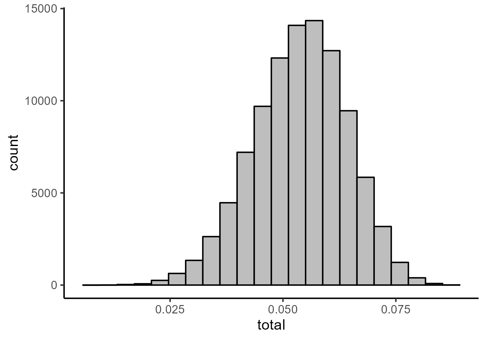

Dawtry et al (2019) - Network Re-analysis
================

- <a href="#network-analysis-of-combined-data-of-studies-1-3-and-5"
  id="toc-network-analysis-of-combined-data-of-studies-1-3-and-5">Network
  Analysis of Combined Data of Studies 1, 3, and 5</a>
  - <a href="#training-network" id="toc-training-network">Training
    Network</a>
    - <a href="#fit-indices" id="toc-fit-indices">Fit Indices</a>
    - <a href="#parameter-estimates" id="toc-parameter-estimates">Parameter
      Estimates</a>
    - <a href="#network-figures" id="toc-network-figures">Network Figures</a>
  - <a href="#test-network" id="toc-test-network">Test Network</a>
    - <a href="#fit-indices-1" id="toc-fit-indices-1">Fit Indices</a>
    - <a href="#parameter-estimates-1"
      id="toc-parameter-estimates-1">Parameter Estimates</a>
    - <a href="#network-figures-1" id="toc-network-figures-1">Network
      Figures</a>
- <a href="#factor-model" id="toc-factor-model">Factor Model</a>
  - <a href="#exploratory-factor-analysis-with-training-data"
    id="toc-exploratory-factor-analysis-with-training-data">Exploratory
    Factor Analysis with Training Data</a>
    - <a href="#parallel-analysis" id="toc-parallel-analysis">Parallel
      Analysis</a>
    - <a href="#exploratory-factor-analysis"
      id="toc-exploratory-factor-analysis">Exploratory Factor Analysis</a>
  - <a href="#confirmatory-factor-analysis-with-test-data"
    id="toc-confirmatory-factor-analysis-with-test-data">Confirmatory Factor
    Analysis with Test Data</a>
    - <a href="#fit-indices-2" id="toc-fit-indices-2">Fit Indices</a>
    - <a href="#parameter-estimates-2"
      id="toc-parameter-estimates-2">Parameter Estimates</a>
- <a href="#simulated-persuasion" id="toc-simulated-persuasion">Simulated
  Persuasion</a>
  - <a href="#fitting-model-to-full-data"
    id="toc-fitting-model-to-full-data">Fitting Model to Full Data</a>
    - <a href="#fit-indices-3" id="toc-fit-indices-3">Fit Indices</a>
    - <a href="#parameter-estimates-3"
      id="toc-parameter-estimates-3">Parameter Estimates</a>
    - <a href="#centrality-estimates" id="toc-centrality-estimates">Centrality
      Estimates</a>
    - <a href="#network-figures-2" id="toc-network-figures-2">Network
      Figures</a>
  - <a
    href="#creating-simulated-data-from-ising-models-based-on-the-estimated-network"
    id="toc-creating-simulated-data-from-ising-models-based-on-the-estimated-network">Creating
    Simulated Data from Ising Models Based on the Estimated Network</a>
    - <a href="#histograms-of-total-scores"
      id="toc-histograms-of-total-scores">Histograms of Total Scores</a>
    - <a href="#proportions-of-agreement-with-strongest-node"
      id="toc-proportions-of-agreement-with-strongest-node">Proportions of
      Agreement with Strongest Node</a>
    - <a
      href="#standardized-mean-difference-in-total-scores-between-baseline-and-persuasion-models"
      id="toc-standardized-mean-difference-in-total-scores-between-baseline-and-persuasion-models">Standardized
      Mean Difference in Total Scores Between Baseline and Persuasion
      Models</a>

# Network Analysis of Combined Data of Studies 1, 3, and 5

## Training Network

### Fit Indices

``` r
network_fit_ind_1
```

                                Measure          Value
    logl                           logl -10720.7405832
    unrestricted.logl unrestricted.logl -10602.1347558
    baseline.logl         baseline.logl -13545.3281547
    nvar                           nvar     22.0000000
    nobs                           nobs    275.0000000
    npar                           npar     93.0000000
    df                               df    182.0000000
    objective                 objective      7.6417744
    chisq                         chisq    237.2116547
    pvalue                       pvalue      0.0037001
    baseline.chisq       baseline.chisq   5886.3867978
    baseline.df             baseline.df    231.0000000
    baseline.pvalue     baseline.pvalue      0.0000000
    nfi                             nfi      0.9597017
    pnfi                           pnfi      0.7561286
    tli                             tli      0.9876089
    nnfi                           nnfi      0.9876089
    rfi                             rfi      0.9488521
    ifi                             ifi      0.9903212
    rni                             rni      0.9902373
    cfi                             cfi      0.9902373
    rmsea                         rmsea      0.0260803
    rmsea.ci.lower       rmsea.ci.lower      0.0154781
    rmsea.ci.upper       rmsea.ci.upper      0.0349391
    rmsea.pvalue           rmsea.pvalue      0.9999995
    aic.ll                       aic.ll  21627.4811663
    aic.ll2                     aic.ll2  21677.1516209
    aic.x                         aic.x   -126.7883453
    aic.x2                       aic.x2    423.2116547
    bic                             bic  22008.8108289
    bic2                           bic2  21713.6679307
    ebic.25                     ebic.25  22296.2777770
    ebic.5                       ebic.5  22583.7447252
    ebic.75                     ebic.75  22813.7182837
    ebic1                         ebic1  23158.6786215

### Parameter Estimates

``` r
network_pars_1
```

           var1 var1_id  op    var2 var2_id      est std        se
    1    RMAS_1       1  ~1    <NA>      NA 1.708520  NA 0.0483030
    2    RMAS_2       2  ~1    <NA>      NA 1.780269  NA 0.0496558
    3    RMAS_3       3  ~1    <NA>      NA 1.446188  NA 0.0369927
    4    RMAS_4       4  ~1    <NA>      NA 2.286996  NA 0.0595444
    5    RMAS_5       5  ~1    <NA>      NA 1.488789  NA 0.0352698
    6    RMAS_6       6  ~1    <NA>      NA 2.551570  NA 0.0605926
    7    RMAS_7       7  ~1    <NA>      NA 2.473094  NA 0.0577404
    8    RMAS_8       8  ~1    <NA>      NA 2.244395  NA 0.0530761
    9    RMAS_9       9  ~1    <NA>      NA 1.957399  NA 0.0523047
    10  RMAS_10      10  ~1    <NA>      NA 1.986547  NA 0.0515168
    11  RMAS_11      11  ~1    <NA>      NA 1.423767  NA 0.0350887
    12  RMAS_12      12  ~1    <NA>      NA 1.639013  NA 0.0441016
    13  RMAS_13      13  ~1    <NA>      NA 1.513453  NA 0.0405711
    14  RMAS_14      14  ~1    <NA>      NA 1.374439  NA 0.0344788
    15  RMAS_15      15  ~1    <NA>      NA 1.269058  NA 0.0292094
    16  RMAS_16      16  ~1    <NA>      NA 1.174888  NA 0.0215479
    17  RMAS_17      17  ~1    <NA>      NA 2.026906  NA 0.0540762
    18  RMAS_18      18  ~1    <NA>      NA 2.224215  NA 0.0538853
    19  RMAS_19      19  ~1    <NA>      NA 2.401345  NA 0.0557913
    20  RMAS_20      20  ~1    <NA>      NA 2.105381  NA 0.0514254
    21  RMAS_21      21  ~1    <NA>      NA 2.089686  NA 0.0522192
    22  RMAS_22      22  ~1    <NA>      NA 2.383408  NA 0.0557136
    23   RMAS_2       2  --  RMAS_1       1 0.329215  NA 0.0356011
    24   RMAS_3       3  --  RMAS_1       1 0.154575  NA 0.0412599
    25   RMAS_4       4  --  RMAS_1       1 0.000000  NA        NA
    26   RMAS_5       5  --  RMAS_1       1 0.145811  NA 0.0396434
    27   RMAS_6       6  --  RMAS_1       1 0.000000  NA        NA
    28   RMAS_7       7  --  RMAS_1       1 0.000000  NA        NA
    29   RMAS_8       8  --  RMAS_1       1 0.000000  NA        NA
    30   RMAS_9       9  --  RMAS_1       1 0.000000  NA        NA
    31  RMAS_10      10  --  RMAS_1       1 0.000000  NA        NA
    32  RMAS_11      11  --  RMAS_1       1 0.000000  NA        NA
    33  RMAS_12      12  --  RMAS_1       1 0.000000  NA        NA
    34  RMAS_13      13  --  RMAS_1       1 0.000000  NA        NA
    35  RMAS_14      14  --  RMAS_1       1 0.000000  NA        NA
    36  RMAS_15      15  --  RMAS_1       1 0.093554  NA 0.0276477
    37  RMAS_16      16  --  RMAS_1       1 0.000000  NA        NA
    38  RMAS_17      17  --  RMAS_1       1 0.000000  NA        NA
    39  RMAS_18      18  --  RMAS_1       1 0.000000  NA        NA
    40  RMAS_19      19  --  RMAS_1       1 0.000000  NA        NA
    41  RMAS_20      20  --  RMAS_1       1 0.098181  NA 0.0245424
    42  RMAS_21      21  --  RMAS_1       1 0.000000  NA        NA
    43  RMAS_22      22  --  RMAS_1       1 0.000000  NA        NA
    44   RMAS_3       3  --  RMAS_2       2 0.261312  NA 0.0340626
    45   RMAS_4       4  --  RMAS_2       2 0.408955  NA 0.0309051
    46   RMAS_5       5  --  RMAS_2       2 0.000000  NA        NA
    47   RMAS_6       6  --  RMAS_2       2 0.000000  NA        NA
    48   RMAS_7       7  --  RMAS_2       2 0.000000  NA        NA
    49   RMAS_8       8  --  RMAS_2       2 0.000000  NA        NA
    50   RMAS_9       9  --  RMAS_2       2 0.145064  NA 0.0290830
    51  RMAS_10      10  --  RMAS_2       2 0.000000  NA        NA
    52  RMAS_11      11  --  RMAS_2       2 0.000000  NA        NA
    53  RMAS_12      12  --  RMAS_2       2 0.000000  NA        NA
    54  RMAS_13      13  --  RMAS_2       2 0.000000  NA        NA
    55  RMAS_14      14  --  RMAS_2       2 0.000000  NA        NA
    56  RMAS_15      15  --  RMAS_2       2 0.000000  NA        NA
    57  RMAS_16      16  --  RMAS_2       2 0.000000  NA        NA
    58  RMAS_17      17  --  RMAS_2       2 0.000000  NA        NA
    59  RMAS_18      18  --  RMAS_2       2 0.000000  NA        NA
    60  RMAS_19      19  --  RMAS_2       2 0.000000  NA        NA
    61  RMAS_20      20  --  RMAS_2       2 0.000000  NA        NA
    62  RMAS_21      21  --  RMAS_2       2 0.000000  NA        NA
    63  RMAS_22      22  --  RMAS_2       2 0.000000  NA        NA
    64   RMAS_4       4  --  RMAS_3       3 0.000000  NA        NA
    65   RMAS_5       5  --  RMAS_3       3 0.142467  NA 0.0386236
    66   RMAS_6       6  --  RMAS_3       3 0.000000  NA        NA
    67   RMAS_7       7  --  RMAS_3       3 0.000000  NA        NA
    68   RMAS_8       8  --  RMAS_3       3 0.000000  NA        NA
    69   RMAS_9       9  --  RMAS_3       3 0.000000  NA        NA
    70  RMAS_10      10  --  RMAS_3       3 0.000000  NA        NA
    71  RMAS_11      11  --  RMAS_3       3 0.000000  NA        NA
    72  RMAS_12      12  --  RMAS_3       3 0.180706  NA 0.0349473
    73  RMAS_13      13  --  RMAS_3       3 0.000000  NA        NA
    74  RMAS_14      14  --  RMAS_3       3 0.150432  NA 0.0289774
    75  RMAS_15      15  --  RMAS_3       3 0.000000  NA        NA
    76  RMAS_16      16  --  RMAS_3       3 0.130472  NA 0.0311873
    77  RMAS_17      17  --  RMAS_3       3 0.000000  NA        NA
    78  RMAS_18      18  --  RMAS_3       3 0.000000  NA        NA
    79  RMAS_19      19  --  RMAS_3       3 0.000000  NA        NA
    80  RMAS_20      20  --  RMAS_3       3 0.000000  NA        NA
    81  RMAS_21      21  --  RMAS_3       3 0.000000  NA        NA
    82  RMAS_22      22  --  RMAS_3       3 0.000000  NA        NA
    83   RMAS_5       5  --  RMAS_4       4 0.000000  NA        NA
    84   RMAS_6       6  --  RMAS_4       4 0.264939  NA 0.0352323
    85   RMAS_7       7  --  RMAS_4       4 0.000000  NA        NA
    86   RMAS_8       8  --  RMAS_4       4 0.114529  NA 0.0334015
    87   RMAS_9       9  --  RMAS_4       4 0.000000  NA        NA
    88  RMAS_10      10  --  RMAS_4       4 0.000000  NA        NA
    89  RMAS_11      11  --  RMAS_4       4 0.000000  NA        NA
    90  RMAS_12      12  --  RMAS_4       4 0.000000  NA        NA
    91  RMAS_13      13  --  RMAS_4       4 0.000000  NA        NA
    92  RMAS_14      14  --  RMAS_4       4 0.000000  NA        NA
    93  RMAS_15      15  --  RMAS_4       4 0.000000  NA        NA
    94  RMAS_16      16  --  RMAS_4       4 0.000000  NA        NA
    95  RMAS_17      17  --  RMAS_4       4 0.000000  NA        NA
    96  RMAS_18      18  --  RMAS_4       4 0.167362  NA 0.0281151
    97  RMAS_19      19  --  RMAS_4       4 0.000000  NA        NA
    98  RMAS_20      20  --  RMAS_4       4 0.000000  NA        NA
    99  RMAS_21      21  --  RMAS_4       4 0.000000  NA        NA
    100 RMAS_22      22  --  RMAS_4       4 0.000000  NA        NA
    101  RMAS_6       6  --  RMAS_5       5 0.158704  NA 0.0380771
    102  RMAS_7       7  --  RMAS_5       5 0.000000  NA        NA
    103  RMAS_8       8  --  RMAS_5       5 0.122115  NA 0.0360468
    104  RMAS_9       9  --  RMAS_5       5 0.000000  NA        NA
    105 RMAS_10      10  --  RMAS_5       5 0.000000  NA        NA
    106 RMAS_11      11  --  RMAS_5       5 0.000000  NA        NA
    107 RMAS_12      12  --  RMAS_5       5 0.000000  NA        NA
    108 RMAS_13      13  --  RMAS_5       5 0.157847  NA 0.0318511
    109 RMAS_14      14  --  RMAS_5       5 0.000000  NA        NA
    110 RMAS_15      15  --  RMAS_5       5 0.000000  NA        NA
    111 RMAS_16      16  --  RMAS_5       5 0.000000  NA        NA
    112 RMAS_17      17  --  RMAS_5       5 0.000000  NA        NA
    113 RMAS_18      18  --  RMAS_5       5 0.000000  NA        NA
    114 RMAS_19      19  --  RMAS_5       5 0.000000  NA        NA
    115 RMAS_20      20  --  RMAS_5       5 0.000000  NA        NA
    116 RMAS_21      21  --  RMAS_5       5 0.107681  NA 0.0328549
    117 RMAS_22      22  --  RMAS_5       5 0.000000  NA        NA
    118  RMAS_7       7  --  RMAS_6       6 0.000000  NA        NA
    119  RMAS_8       8  --  RMAS_6       6 0.000000  NA        NA
    120  RMAS_9       9  --  RMAS_6       6 0.000000  NA        NA
    121 RMAS_10      10  --  RMAS_6       6 0.000000  NA        NA
    122 RMAS_11      11  --  RMAS_6       6 0.000000  NA        NA
    123 RMAS_12      12  --  RMAS_6       6 0.000000  NA        NA
    124 RMAS_13      13  --  RMAS_6       6 0.000000  NA        NA
    125 RMAS_14      14  --  RMAS_6       6 0.000000  NA        NA
    126 RMAS_15      15  --  RMAS_6       6 0.000000  NA        NA
    127 RMAS_16      16  --  RMAS_6       6 0.000000  NA        NA
    128 RMAS_17      17  --  RMAS_6       6 0.192510  NA 0.0390347
    129 RMAS_18      18  --  RMAS_6       6 0.000000  NA        NA
    130 RMAS_19      19  --  RMAS_6       6 0.000000  NA        NA
    131 RMAS_20      20  --  RMAS_6       6 0.000000  NA        NA
    132 RMAS_21      21  --  RMAS_6       6 0.000000  NA        NA
    133 RMAS_22      22  --  RMAS_6       6 0.131632  NA 0.0329803
    134  RMAS_8       8  --  RMAS_7       7 0.216960  NA 0.0412576
    135  RMAS_9       9  --  RMAS_7       7 0.310897  NA 0.0417980
    136 RMAS_10      10  --  RMAS_7       7 0.127294  NA 0.0443240
    137 RMAS_11      11  --  RMAS_7       7 0.000000  NA        NA
    138 RMAS_12      12  --  RMAS_7       7 0.000000  NA        NA
    139 RMAS_13      13  --  RMAS_7       7 0.000000  NA        NA
    140 RMAS_14      14  --  RMAS_7       7 0.000000  NA        NA
    141 RMAS_15      15  --  RMAS_7       7 0.000000  NA        NA
    142 RMAS_16      16  --  RMAS_7       7 0.000000  NA        NA
    143 RMAS_17      17  --  RMAS_7       7 0.000000  NA        NA
    144 RMAS_18      18  --  RMAS_7       7 0.000000  NA        NA
    145 RMAS_19      19  --  RMAS_7       7 0.000000  NA        NA
    146 RMAS_20      20  --  RMAS_7       7 0.000000  NA        NA
    147 RMAS_21      21  --  RMAS_7       7 0.000000  NA        NA
    148 RMAS_22      22  --  RMAS_7       7 0.000000  NA        NA
    149  RMAS_9       9  --  RMAS_8       8 0.181937  NA 0.0420789
    150 RMAS_10      10  --  RMAS_8       8 0.193123  NA 0.0416099
    151 RMAS_11      11  --  RMAS_8       8 0.000000  NA        NA
    152 RMAS_12      12  --  RMAS_8       8 0.000000  NA        NA
    153 RMAS_13      13  --  RMAS_8       8 0.000000  NA        NA
    154 RMAS_14      14  --  RMAS_8       8 0.000000  NA        NA
    155 RMAS_15      15  --  RMAS_8       8 0.000000  NA        NA
    156 RMAS_16      16  --  RMAS_8       8 0.000000  NA        NA
    157 RMAS_17      17  --  RMAS_8       8 0.000000  NA        NA
    158 RMAS_18      18  --  RMAS_8       8 0.000000  NA        NA
    159 RMAS_19      19  --  RMAS_8       8 0.000000  NA        NA
    160 RMAS_20      20  --  RMAS_8       8 0.139451  NA 0.0263484
    161 RMAS_21      21  --  RMAS_8       8 0.000000  NA        NA
    162 RMAS_22      22  --  RMAS_8       8 0.000000  NA        NA
    163 RMAS_10      10  --  RMAS_9       9 0.124530  NA 0.0436617
    164 RMAS_11      11  --  RMAS_9       9 0.000000  NA        NA
    165 RMAS_12      12  --  RMAS_9       9 0.000000  NA        NA
    166 RMAS_13      13  --  RMAS_9       9 0.000000  NA        NA
    167 RMAS_14      14  --  RMAS_9       9 0.000000  NA        NA
    168 RMAS_15      15  --  RMAS_9       9 0.000000  NA        NA
    169 RMAS_16      16  --  RMAS_9       9 0.000000  NA        NA
    170 RMAS_17      17  --  RMAS_9       9 0.000000  NA        NA
    171 RMAS_18      18  --  RMAS_9       9 0.000000  NA        NA
    172 RMAS_19      19  --  RMAS_9       9 0.000000  NA        NA
    173 RMAS_20      20  --  RMAS_9       9 0.000000  NA        NA
    174 RMAS_21      21  --  RMAS_9       9 0.000000  NA        NA
    175 RMAS_22      22  --  RMAS_9       9 0.000000  NA        NA
    176 RMAS_11      11  -- RMAS_10      10 0.210488  NA 0.0343692
    177 RMAS_12      12  -- RMAS_10      10 0.000000  NA        NA
    178 RMAS_13      13  -- RMAS_10      10 0.000000  NA        NA
    179 RMAS_14      14  -- RMAS_10      10 0.000000  NA        NA
    180 RMAS_15      15  -- RMAS_10      10 0.000000  NA        NA
    181 RMAS_16      16  -- RMAS_10      10 0.000000  NA        NA
    182 RMAS_17      17  -- RMAS_10      10 0.000000  NA        NA
    183 RMAS_18      18  -- RMAS_10      10 0.000000  NA        NA
    184 RMAS_19      19  -- RMAS_10      10 0.076224  NA 0.0268452
    185 RMAS_20      20  -- RMAS_10      10 0.000000  NA        NA
    186 RMAS_21      21  -- RMAS_10      10 0.000000  NA        NA
    187 RMAS_22      22  -- RMAS_10      10 0.000000  NA        NA
    188 RMAS_12      12  -- RMAS_11      11 0.364878  NA 0.0354673
    189 RMAS_13      13  -- RMAS_11      11 0.000000  NA        NA
    190 RMAS_14      14  -- RMAS_11      11 0.000000  NA        NA
    191 RMAS_15      15  -- RMAS_11      11 0.115855  NA 0.0372281
    192 RMAS_16      16  -- RMAS_11      11 0.164051  NA 0.0403144
    193 RMAS_17      17  -- RMAS_11      11 0.000000  NA        NA
    194 RMAS_18      18  -- RMAS_11      11 0.000000  NA        NA
    195 RMAS_19      19  -- RMAS_11      11 0.000000  NA        NA
    196 RMAS_20      20  -- RMAS_11      11 0.000000  NA        NA
    197 RMAS_21      21  -- RMAS_11      11 0.000000  NA        NA
    198 RMAS_22      22  -- RMAS_11      11 0.000000  NA        NA
    199 RMAS_13      13  -- RMAS_12      12 0.104514  NA 0.0311568
    200 RMAS_14      14  -- RMAS_12      12 0.000000  NA        NA
    201 RMAS_15      15  -- RMAS_12      12 0.000000  NA        NA
    202 RMAS_16      16  -- RMAS_12      12 0.000000  NA        NA
    203 RMAS_17      17  -- RMAS_12      12 0.100140  NA 0.0378616
    204 RMAS_18      18  -- RMAS_12      12 0.000000  NA        NA
    205 RMAS_19      19  -- RMAS_12      12 0.000000  NA        NA
    206 RMAS_20      20  -- RMAS_12      12 0.105249  NA 0.0245683
    207 RMAS_21      21  -- RMAS_12      12 0.000000  NA        NA
    208 RMAS_22      22  -- RMAS_12      12 0.000000  NA        NA
    209 RMAS_14      14  -- RMAS_13      13 0.584345  NA 0.0268118
    210 RMAS_15      15  -- RMAS_13      13 0.000000  NA        NA
    211 RMAS_16      16  -- RMAS_13      13 0.000000  NA        NA
    212 RMAS_17      17  -- RMAS_13      13 0.000000  NA        NA
    213 RMAS_18      18  -- RMAS_13      13 0.000000  NA        NA
    214 RMAS_19      19  -- RMAS_13      13 0.000000  NA        NA
    215 RMAS_20      20  -- RMAS_13      13 0.000000  NA        NA
    216 RMAS_21      21  -- RMAS_13      13 0.000000  NA        NA
    217 RMAS_22      22  -- RMAS_13      13 0.000000  NA        NA
    218 RMAS_15      15  -- RMAS_14      14 0.308221  NA 0.0268860
    219 RMAS_16      16  -- RMAS_14      14 0.000000  NA        NA
    220 RMAS_17      17  -- RMAS_14      14 0.164628  NA 0.0282292
    221 RMAS_18      18  -- RMAS_14      14 0.000000  NA        NA
    222 RMAS_19      19  -- RMAS_14      14 0.000000  NA        NA
    223 RMAS_20      20  -- RMAS_14      14 0.000000  NA        NA
    224 RMAS_21      21  -- RMAS_14      14 0.000000  NA        NA
    225 RMAS_22      22  -- RMAS_14      14 0.000000  NA        NA
    226 RMAS_16      16  -- RMAS_15      15 0.552021  NA 0.0295200
    227 RMAS_17      17  -- RMAS_15      15 0.000000  NA        NA
    228 RMAS_18      18  -- RMAS_15      15 0.000000  NA        NA
    229 RMAS_19      19  -- RMAS_15      15 0.000000  NA        NA
    230 RMAS_20      20  -- RMAS_15      15 0.000000  NA        NA
    231 RMAS_21      21  -- RMAS_15      15 0.000000  NA        NA
    232 RMAS_22      22  -- RMAS_15      15 0.000000  NA        NA
    233 RMAS_17      17  -- RMAS_16      16 0.000000  NA        NA
    234 RMAS_18      18  -- RMAS_16      16 0.000000  NA        NA
    235 RMAS_19      19  -- RMAS_16      16 0.000000  NA        NA
    236 RMAS_20      20  -- RMAS_16      16 0.000000  NA        NA
    237 RMAS_21      21  -- RMAS_16      16 0.000000  NA        NA
    238 RMAS_22      22  -- RMAS_16      16 0.000000  NA        NA
    239 RMAS_18      18  -- RMAS_17      17 0.194984  NA 0.0304757
    240 RMAS_19      19  -- RMAS_17      17 0.000000  NA        NA
    241 RMAS_20      20  -- RMAS_17      17 0.000000  NA        NA
    242 RMAS_21      21  -- RMAS_17      17 0.000000  NA        NA
    243 RMAS_22      22  -- RMAS_17      17 0.000000  NA        NA
    244 RMAS_19      19  -- RMAS_18      18 0.000000  NA        NA
    245 RMAS_20      20  -- RMAS_18      18 0.360456  NA 0.0327548
    246 RMAS_21      21  -- RMAS_18      18 0.169330  NA 0.0416436
    247 RMAS_22      22  -- RMAS_18      18 0.218870  NA 0.0373314
    248 RMAS_20      20  -- RMAS_19      19 0.455894  NA 0.0314082
    249 RMAS_21      21  -- RMAS_19      19 0.190830  NA 0.0429622
    250 RMAS_22      22  -- RMAS_19      19 0.322230  NA 0.0362453
    251 RMAS_21      21  -- RMAS_20      20 0.140656  NA 0.0420684
    252 RMAS_22      22  -- RMAS_20      20 0.000000  NA        NA
    253 RMAS_22      22  -- RMAS_21      21 0.168360  NA 0.0438315
    254  RMAS_1       1 ~/~  RMAS_1       1 0.705042  NA 0.0231694
    255  RMAS_2       2 ~/~  RMAS_2       2 0.635141  NA 0.0196055
    256  RMAS_3       3 ~/~  RMAS_3       3 0.508576  NA 0.0162685
    257  RMAS_4       4 ~/~  RMAS_4       4 0.827674  NA 0.0261500
    258  RMAS_5       5 ~/~  RMAS_5       5 0.568460  NA 0.0186442
    259  RMAS_6       6 ~/~  RMAS_6       6 1.003176  NA 0.0330573
    260  RMAS_7       7 ~/~  RMAS_7       7 1.012451  NA 0.0338994
    261  RMAS_8       8 ~/~  RMAS_8       8 0.830984  NA 0.0270887
    262  RMAS_9       9 ~/~  RMAS_9       9 0.886248  NA 0.0294159
    263 RMAS_10      10 ~/~ RMAS_10      10 0.896195  NA 0.0295950
    264 RMAS_11      11 ~/~ RMAS_11      11 0.546214  NA 0.0176394
    265 RMAS_12      12 ~/~ RMAS_12      12 0.676528  NA 0.0218797
    266 RMAS_13      13 ~/~ RMAS_13      13 0.530982  NA 0.0173854
    267 RMAS_14      14 ~/~ RMAS_14      14 0.392776  NA 0.0116227
    268 RMAS_15      15 ~/~ RMAS_15      15 0.352964  NA 0.0109163
    269 RMAS_16      16 ~/~ RMAS_16      16 0.289174  NA 0.0095971
    270 RMAS_17      17 ~/~ RMAS_17      17 0.902911  NA 0.0297149
    271 RMAS_18      18 ~/~ RMAS_18      18 0.637796  NA 0.0201398
    272 RMAS_19      19 ~/~ RMAS_19      19 0.631885  NA 0.0204880
    273 RMAS_20      20 ~/~ RMAS_20      20 0.532872  NA 0.0163091
    274 RMAS_21      21 ~/~ RMAS_21      21 0.726152  NA 0.0241331
    275 RMAS_22      22 ~/~ RMAS_22      22 0.753795  NA 0.0248326
                                                                                                                                                                                                                                                                                                                                p
    1   0.00000000000000000000000000000000000000000000000000000000000000000000000000000000000000000000000000000000000000000000000000000000000000000000000000000000000000000000000000000000000000000000000000000000000000000000000000000000000000000000000000000000000000000000000000000000047921048980106663106939834939623779064
    2   0.00000000000000000000000000000000000000000000000000000000000000000000000000000000000000000000000000000000000000000000000000000000000000000000000000000000000000000000000000000000000000000000000000000000000000000000000000000000000000000000000000000000000000000000000000000000000000001699122841660291823376316422411
    3   0.00000000000000000000000000000000000000000000000000000000000000000000000000000000000000000000000000000000000000000000000000000000000000000000000000000000000000000000000000000000000000000000000000000000000000000000000000000000000000000000000000000000000000000000000000000000000000000000000000000000000000000000000
    4   0.00000000000000000000000000000000000000000000000000000000000000000000000000000000000000000000000000000000000000000000000000000000000000000000000000000000000000000000000000000000000000000000000000000000000000000000000000000000000000000000000000000000000000000000000000000000000000000000000000000000000000000000000
    5   0.00000000000000000000000000000000000000000000000000000000000000000000000000000000000000000000000000000000000000000000000000000000000000000000000000000000000000000000000000000000000000000000000000000000000000000000000000000000000000000000000000000000000000000000000000000000000000000000000000000000000000000000000
    6   0.00000000000000000000000000000000000000000000000000000000000000000000000000000000000000000000000000000000000000000000000000000000000000000000000000000000000000000000000000000000000000000000000000000000000000000000000000000000000000000000000000000000000000000000000000000000000000000000000000000000000000000000000
    7   0.00000000000000000000000000000000000000000000000000000000000000000000000000000000000000000000000000000000000000000000000000000000000000000000000000000000000000000000000000000000000000000000000000000000000000000000000000000000000000000000000000000000000000000000000000000000000000000000000000000000000000000000000
    8   0.00000000000000000000000000000000000000000000000000000000000000000000000000000000000000000000000000000000000000000000000000000000000000000000000000000000000000000000000000000000000000000000000000000000000000000000000000000000000000000000000000000000000000000000000000000000000000000000000000000000000000000000000
    9   0.00000000000000000000000000000000000000000000000000000000000000000000000000000000000000000000000000000000000000000000000000000000000000000000000000000000000000000000000000000000000000000000000000000000000000000000000000000000000000000000000000000000000000000000000000000000000000000000000000000000000000000165107
    10  0.00000000000000000000000000000000000000000000000000000000000000000000000000000000000000000000000000000000000000000000000000000000000000000000000000000000000000000000000000000000000000000000000000000000000000000000000000000000000000000000000000000000000000000000000000000000000000000000000000000000000000000000000
    11  0.00000000000000000000000000000000000000000000000000000000000000000000000000000000000000000000000000000000000000000000000000000000000000000000000000000000000000000000000000000000000000000000000000000000000000000000000000000000000000000000000000000000000000000000000000000000000000000000000000000000000000000000000
    12  0.00000000000000000000000000000000000000000000000000000000000000000000000000000000000000000000000000000000000000000000000000000000000000000000000000000000000000000000000000000000000000000000000000000000000000000000000000000000000000000000000000000000000000000000000000000000000000000000000000000000000002554526909
    13  0.00000000000000000000000000000000000000000000000000000000000000000000000000000000000000000000000000000000000000000000000000000000000000000000000000000000000000000000000000000000000000000000000000000000000000000000000000000000000000000000000000000000000000000000000000000000000000000000000000000000000000014306243
    14  0.00000000000000000000000000000000000000000000000000000000000000000000000000000000000000000000000000000000000000000000000000000000000000000000000000000000000000000000000000000000000000000000000000000000000000000000000000000000000000000000000000000000000000000000000000000000000000000000000000000000000000000000000
    15  0.00000000000000000000000000000000000000000000000000000000000000000000000000000000000000000000000000000000000000000000000000000000000000000000000000000000000000000000000000000000000000000000000000000000000000000000000000000000000000000000000000000000000000000000000000000000000000000000000000000000000000000000000
    16  0.00000000000000000000000000000000000000000000000000000000000000000000000000000000000000000000000000000000000000000000000000000000000000000000000000000000000000000000000000000000000000000000000000000000000000000000000000000000000000000000000000000000000000000000000000000000000000000000000000000000000000000000000
    17  0.00000000000000000000000000000000000000000000000000000000000000000000000000000000000000000000000000000000000000000000000000000000000000000000000000000000000000000000000000000000000000000000000000000000000000000000000000000000000000000000000000000000000000000000000000000000000000000000000000000000000000000017823
    18  0.00000000000000000000000000000000000000000000000000000000000000000000000000000000000000000000000000000000000000000000000000000000000000000000000000000000000000000000000000000000000000000000000000000000000000000000000000000000000000000000000000000000000000000000000000000000000000000000000000000000000000000000000
    19  0.00000000000000000000000000000000000000000000000000000000000000000000000000000000000000000000000000000000000000000000000000000000000000000000000000000000000000000000000000000000000000000000000000000000000000000000000000000000000000000000000000000000000000000000000000000000000000000000000000000000000000000000000
    20  0.00000000000000000000000000000000000000000000000000000000000000000000000000000000000000000000000000000000000000000000000000000000000000000000000000000000000000000000000000000000000000000000000000000000000000000000000000000000000000000000000000000000000000000000000000000000000000000000000000000000000000000000000
    21  0.00000000000000000000000000000000000000000000000000000000000000000000000000000000000000000000000000000000000000000000000000000000000000000000000000000000000000000000000000000000000000000000000000000000000000000000000000000000000000000000000000000000000000000000000000000000000000000000000000000000000000000000000
    22  0.00000000000000000000000000000000000000000000000000000000000000000000000000000000000000000000000000000000000000000000000000000000000000000000000000000000000000000000000000000000000000000000000000000000000000000000000000000000000000000000000000000000000000000000000000000000000000000000000000000000000000000000000
    23  0.00000000000000000002301608566489037648299803562323972982994746416807174682617187500000000000000000000000000000000000000000000000000000000000000000000000000000000000000000000000000000000000000000000000000000000000000000000000000000000000000000000000000000000000000000000000000000000000000000000000000000000000000
    24  0.00017940616438659654874147875158740816914360038936138153076171875000000000000000000000000000000000000000000000000000000000000000000000000000000000000000000000000000000000000000000000000000000000000000000000000000000000000000000000000000000000000000000000000000000000000000000000000000000000000000000000000000000
    25                                                                                                                                                                                                                                                                                                                         NA
    26  0.00023500667017899517737856973642607272267923690378665924072265625000000000000000000000000000000000000000000000000000000000000000000000000000000000000000000000000000000000000000000000000000000000000000000000000000000000000000000000000000000000000000000000000000000000000000000000000000000000000000000000000000000
    27                                                                                                                                                                                                                                                                                                                         NA
    28                                                                                                                                                                                                                                                                                                                         NA
    29                                                                                                                                                                                                                                                                                                                         NA
    30                                                                                                                                                                                                                                                                                                                         NA
    31                                                                                                                                                                                                                                                                                                                         NA
    32                                                                                                                                                                                                                                                                                                                         NA
    33                                                                                                                                                                                                                                                                                                                         NA
    34                                                                                                                                                                                                                                                                                                                         NA
    35                                                                                                                                                                                                                                                                                                                         NA
    36  0.00071495907034207920385804335694501787656918168067932128906250000000000000000000000000000000000000000000000000000000000000000000000000000000000000000000000000000000000000000000000000000000000000000000000000000000000000000000000000000000000000000000000000000000000000000000000000000000000000000000000000000000000
    37                                                                                                                                                                                                                                                                                                                         NA
    38                                                                                                                                                                                                                                                                                                                         NA
    39                                                                                                                                                                                                                                                                                                                         NA
    40                                                                                                                                                                                                                                                                                                                         NA
    41  0.00006321067308022347357946563173314302730432245880365371704101562500000000000000000000000000000000000000000000000000000000000000000000000000000000000000000000000000000000000000000000000000000000000000000000000000000000000000000000000000000000000000000000000000000000000000000000000000000000000000000000000000000
    42                                                                                                                                                                                                                                                                                                                         NA
    43                                                                                                                                                                                                                                                                                                                         NA
    44  0.00000000000001699599191409765036164108975569320136855822056531906127929687500000000000000000000000000000000000000000000000000000000000000000000000000000000000000000000000000000000000000000000000000000000000000000000000000000000000000000000000000000000000000000000000000000000000000000000000000000000000000000000
    45  0.00000000000000000000000000000000000000056906392860191636153856242774651263971463777124881744384765625000000000000000000000000000000000000000000000000000000000000000000000000000000000000000000000000000000000000000000000000000000000000000000000000000000000000000000000000000000000000000000000000000000000000000000
    46                                                                                                                                                                                                                                                                                                                         NA
    47                                                                                                                                                                                                                                                                                                                         NA
    48                                                                                                                                                                                                                                                                                                                         NA
    49                                                                                                                                                                                                                                                                                                                         NA
    50  0.00000061030614912467178534774547848940073890844359993934631347656250000000000000000000000000000000000000000000000000000000000000000000000000000000000000000000000000000000000000000000000000000000000000000000000000000000000000000000000000000000000000000000000000000000000000000000000000000000000000000000000000000
    51                                                                                                                                                                                                                                                                                                                         NA
    52                                                                                                                                                                                                                                                                                                                         NA
    53                                                                                                                                                                                                                                                                                                                         NA
    54                                                                                                                                                                                                                                                                                                                         NA
    55                                                                                                                                                                                                                                                                                                                         NA
    56                                                                                                                                                                                                                                                                                                                         NA
    57                                                                                                                                                                                                                                                                                                                         NA
    58                                                                                                                                                                                                                                                                                                                         NA
    59                                                                                                                                                                                                                                                                                                                         NA
    60                                                                                                                                                                                                                                                                                                                         NA
    61                                                                                                                                                                                                                                                                                                                         NA
    62                                                                                                                                                                                                                                                                                                                         NA
    63                                                                                                                                                                                                                                                                                                                         NA
    64                                                                                                                                                                                                                                                                                                                         NA
    65  0.00022548876050305761650251190619798080660984851419925689697265625000000000000000000000000000000000000000000000000000000000000000000000000000000000000000000000000000000000000000000000000000000000000000000000000000000000000000000000000000000000000000000000000000000000000000000000000000000000000000000000000000000
    66                                                                                                                                                                                                                                                                                                                         NA
    67                                                                                                                                                                                                                                                                                                                         NA
    68                                                                                                                                                                                                                                                                                                                         NA
    69                                                                                                                                                                                                                                                                                                                         NA
    70                                                                                                                                                                                                                                                                                                                         NA
    71                                                                                                                                                                                                                                                                                                                         NA
    72  0.00000023305415946034174518464859859889770632435102015733718872070312500000000000000000000000000000000000000000000000000000000000000000000000000000000000000000000000000000000000000000000000000000000000000000000000000000000000000000000000000000000000000000000000000000000000000000000000000000000000000000000000000
    73                                                                                                                                                                                                                                                                                                                         NA
    74  0.00000020877798984277962915292320422722127659653779119253158569335937500000000000000000000000000000000000000000000000000000000000000000000000000000000000000000000000000000000000000000000000000000000000000000000000000000000000000000000000000000000000000000000000000000000000000000000000000000000000000000000000000
    75                                                                                                                                                                                                                                                                                                                         NA
    76  0.00002870550767391906807173007631917016624356620013713836669921875000000000000000000000000000000000000000000000000000000000000000000000000000000000000000000000000000000000000000000000000000000000000000000000000000000000000000000000000000000000000000000000000000000000000000000000000000000000000000000000000000000
    77                                                                                                                                                                                                                                                                                                                         NA
    78                                                                                                                                                                                                                                                                                                                         NA
    79                                                                                                                                                                                                                                                                                                                         NA
    80                                                                                                                                                                                                                                                                                                                         NA
    81                                                                                                                                                                                                                                                                                                                         NA
    82                                                                                                                                                                                                                                                                                                                         NA
    83                                                                                                                                                                                                                                                                                                                         NA
    84  0.00000000000005487077905921405388423722770951940219674725085496902465820312500000000000000000000000000000000000000000000000000000000000000000000000000000000000000000000000000000000000000000000000000000000000000000000000000000000000000000000000000000000000000000000000000000000000000000000000000000000000000000000
    85                                                                                                                                                                                                                                                                                                                         NA
    86  0.00060611834216955332455684102299642290745396167039871215820312500000000000000000000000000000000000000000000000000000000000000000000000000000000000000000000000000000000000000000000000000000000000000000000000000000000000000000000000000000000000000000000000000000000000000000000000000000000000000000000000000000000
    87                                                                                                                                                                                                                                                                                                                         NA
    88                                                                                                                                                                                                                                                                                                                         NA
    89                                                                                                                                                                                                                                                                                                                         NA
    90                                                                                                                                                                                                                                                                                                                         NA
    91                                                                                                                                                                                                                                                                                                                         NA
    92                                                                                                                                                                                                                                                                                                                         NA
    93                                                                                                                                                                                                                                                                                                                         NA
    94                                                                                                                                                                                                                                                                                                                         NA
    95                                                                                                                                                                                                                                                                                                                         NA
    96  0.00000000263703210103746170031580042802943353308364748954772949218750000000000000000000000000000000000000000000000000000000000000000000000000000000000000000000000000000000000000000000000000000000000000000000000000000000000000000000000000000000000000000000000000000000000000000000000000000000000000000000000000000
    97                                                                                                                                                                                                                                                                                                                         NA
    98                                                                                                                                                                                                                                                                                                                         NA
    99                                                                                                                                                                                                                                                                                                                         NA
    100                                                                                                                                                                                                                                                                                                                        NA
    101 0.00003073439713433661344462594078308370626473333686590194702148437500000000000000000000000000000000000000000000000000000000000000000000000000000000000000000000000000000000000000000000000000000000000000000000000000000000000000000000000000000000000000000000000000000000000000000000000000000000000000000000000000000
    102                                                                                                                                                                                                                                                                                                                        NA
    103 0.00070489236873256427059336592932936582656111568212509155273437500000000000000000000000000000000000000000000000000000000000000000000000000000000000000000000000000000000000000000000000000000000000000000000000000000000000000000000000000000000000000000000000000000000000000000000000000000000000000000000000000000000
    104                                                                                                                                                                                                                                                                                                                        NA
    105                                                                                                                                                                                                                                                                                                                        NA
    106                                                                                                                                                                                                                                                                                                                        NA
    107                                                                                                                                                                                                                                                                                                                        NA
    108 0.00000072034014601924676282802828541917961047147400677204132080078125000000000000000000000000000000000000000000000000000000000000000000000000000000000000000000000000000000000000000000000000000000000000000000000000000000000000000000000000000000000000000000000000000000000000000000000000000000000000000000000000000
    109                                                                                                                                                                                                                                                                                                                        NA
    110                                                                                                                                                                                                                                                                                                                        NA
    111                                                                                                                                                                                                                                                                                                                        NA
    112                                                                                                                                                                                                                                                                                                                        NA
    113                                                                                                                                                                                                                                                                                                                        NA
    114                                                                                                                                                                                                                                                                                                                        NA
    115                                                                                                                                                                                                                                                                                                                        NA
    116 0.00104746714873572561825543214553135840105824172496795654296875000000000000000000000000000000000000000000000000000000000000000000000000000000000000000000000000000000000000000000000000000000000000000000000000000000000000000000000000000000000000000000000000000000000000000000000000000000000000000000000000000000000
    117                                                                                                                                                                                                                                                                                                                        NA
    118                                                                                                                                                                                                                                                                                                                        NA
    119                                                                                                                                                                                                                                                                                                                        NA
    120                                                                                                                                                                                                                                                                                                                        NA
    121                                                                                                                                                                                                                                                                                                                        NA
    122                                                                                                                                                                                                                                                                                                                        NA
    123                                                                                                                                                                                                                                                                                                                        NA
    124                                                                                                                                                                                                                                                                                                                        NA
    125                                                                                                                                                                                                                                                                                                                        NA
    126                                                                                                                                                                                                                                                                                                                        NA
    127                                                                                                                                                                                                                                                                                                                        NA
    128 0.00000081489870926876217770151722419313955469988286495208740234375000000000000000000000000000000000000000000000000000000000000000000000000000000000000000000000000000000000000000000000000000000000000000000000000000000000000000000000000000000000000000000000000000000000000000000000000000000000000000000000000000000
    129                                                                                                                                                                                                                                                                                                                        NA
    130                                                                                                                                                                                                                                                                                                                        NA
    131                                                                                                                                                                                                                                                                                                                        NA
    132                                                                                                                                                                                                                                                                                                                        NA
    133 0.00006573332979851564776552219626637452165596187114715576171875000000000000000000000000000000000000000000000000000000000000000000000000000000000000000000000000000000000000000000000000000000000000000000000000000000000000000000000000000000000000000000000000000000000000000000000000000000000000000000000000000000000
    134 0.00000014511438568165485172960227355787310443702153861522674560546875000000000000000000000000000000000000000000000000000000000000000000000000000000000000000000000000000000000000000000000000000000000000000000000000000000000000000000000000000000000000000000000000000000000000000000000000000000000000000000000000000
    135 0.00000000000010215476642134596930739515174835219113447237759828567504882812500000000000000000000000000000000000000000000000000000000000000000000000000000000000000000000000000000000000000000000000000000000000000000000000000000000000000000000000000000000000000000000000000000000000000000000000000000000000000000000
    136 0.00408005931077232240206109636915243754629045724868774414062500000000000000000000000000000000000000000000000000000000000000000000000000000000000000000000000000000000000000000000000000000000000000000000000000000000000000000000000000000000000000000000000000000000000000000000000000000000000000000000000000000000000
    137                                                                                                                                                                                                                                                                                                                        NA
    138                                                                                                                                                                                                                                                                                                                        NA
    139                                                                                                                                                                                                                                                                                                                        NA
    140                                                                                                                                                                                                                                                                                                                        NA
    141                                                                                                                                                                                                                                                                                                                        NA
    142                                                                                                                                                                                                                                                                                                                        NA
    143                                                                                                                                                                                                                                                                                                                        NA
    144                                                                                                                                                                                                                                                                                                                        NA
    145                                                                                                                                                                                                                                                                                                                        NA
    146                                                                                                                                                                                                                                                                                                                        NA
    147                                                                                                                                                                                                                                                                                                                        NA
    148                                                                                                                                                                                                                                                                                                                        NA
    149 0.00001534168501547190531161812820926115819020196795463562011718750000000000000000000000000000000000000000000000000000000000000000000000000000000000000000000000000000000000000000000000000000000000000000000000000000000000000000000000000000000000000000000000000000000000000000000000000000000000000000000000000000000
    150 0.00000346250779100619803874475111094000112643698230385780334472656250000000000000000000000000000000000000000000000000000000000000000000000000000000000000000000000000000000000000000000000000000000000000000000000000000000000000000000000000000000000000000000000000000000000000000000000000000000000000000000000000000
    151                                                                                                                                                                                                                                                                                                                        NA
    152                                                                                                                                                                                                                                                                                                                        NA
    153                                                                                                                                                                                                                                                                                                                        NA
    154                                                                                                                                                                                                                                                                                                                        NA
    155                                                                                                                                                                                                                                                                                                                        NA
    156                                                                                                                                                                                                                                                                                                                        NA
    157                                                                                                                                                                                                                                                                                                                        NA
    158                                                                                                                                                                                                                                                                                                                        NA
    159                                                                                                                                                                                                                                                                                                                        NA
    160 0.00000012059402117897660375875693028469015644077444449067115783691406250000000000000000000000000000000000000000000000000000000000000000000000000000000000000000000000000000000000000000000000000000000000000000000000000000000000000000000000000000000000000000000000000000000000000000000000000000000000000000000000000
    161                                                                                                                                                                                                                                                                                                                        NA
    162                                                                                                                                                                                                                                                                                                                        NA
    163 0.00434228780908353737683080808551494556013494729995727539062500000000000000000000000000000000000000000000000000000000000000000000000000000000000000000000000000000000000000000000000000000000000000000000000000000000000000000000000000000000000000000000000000000000000000000000000000000000000000000000000000000000000
    164                                                                                                                                                                                                                                                                                                                        NA
    165                                                                                                                                                                                                                                                                                                                        NA
    166                                                                                                                                                                                                                                                                                                                        NA
    167                                                                                                                                                                                                                                                                                                                        NA
    168                                                                                                                                                                                                                                                                                                                        NA
    169                                                                                                                                                                                                                                                                                                                        NA
    170                                                                                                                                                                                                                                                                                                                        NA
    171                                                                                                                                                                                                                                                                                                                        NA
    172                                                                                                                                                                                                                                                                                                                        NA
    173                                                                                                                                                                                                                                                                                                                        NA
    174                                                                                                                                                                                                                                                                                                                        NA
    175                                                                                                                                                                                                                                                                                                                        NA
    176 0.00000000091062789380874671688048671569504222134128212928771972656250000000000000000000000000000000000000000000000000000000000000000000000000000000000000000000000000000000000000000000000000000000000000000000000000000000000000000000000000000000000000000000000000000000000000000000000000000000000000000000000000000
    177                                                                                                                                                                                                                                                                                                                        NA
    178                                                                                                                                                                                                                                                                                                                        NA
    179                                                                                                                                                                                                                                                                                                                        NA
    180                                                                                                                                                                                                                                                                                                                        NA
    181                                                                                                                                                                                                                                                                                                                        NA
    182                                                                                                                                                                                                                                                                                                                        NA
    183                                                                                                                                                                                                                                                                                                                        NA
    184 0.00452022151276130525199281606774093233980238437652587890625000000000000000000000000000000000000000000000000000000000000000000000000000000000000000000000000000000000000000000000000000000000000000000000000000000000000000000000000000000000000000000000000000000000000000000000000000000000000000000000000000000000000
    185                                                                                                                                                                                                                                                                                                                        NA
    186                                                                                                                                                                                                                                                                                                                        NA
    187                                                                                                                                                                                                                                                                                                                        NA
    188 0.00000000000000000000000080054538432533848980182655807880109932739287614822387695312500000000000000000000000000000000000000000000000000000000000000000000000000000000000000000000000000000000000000000000000000000000000000000000000000000000000000000000000000000000000000000000000000000000000000000000000000000000000
    189                                                                                                                                                                                                                                                                                                                        NA
    190                                                                                                                                                                                                                                                                                                                        NA
    191 0.00185796621515771928981330951557993103051558136940002441406250000000000000000000000000000000000000000000000000000000000000000000000000000000000000000000000000000000000000000000000000000000000000000000000000000000000000000000000000000000000000000000000000000000000000000000000000000000000000000000000000000000000
    192 0.00004715599233496091228796248673305058218829799443483352661132812500000000000000000000000000000000000000000000000000000000000000000000000000000000000000000000000000000000000000000000000000000000000000000000000000000000000000000000000000000000000000000000000000000000000000000000000000000000000000000000000000000
    193                                                                                                                                                                                                                                                                                                                        NA
    194                                                                                                                                                                                                                                                                                                                        NA
    195                                                                                                                                                                                                                                                                                                                        NA
    196                                                                                                                                                                                                                                                                                                                        NA
    197                                                                                                                                                                                                                                                                                                                        NA
    198                                                                                                                                                                                                                                                                                                                        NA
    199 0.00079518214812766320215980941910061119415331631898880004882812500000000000000000000000000000000000000000000000000000000000000000000000000000000000000000000000000000000000000000000000000000000000000000000000000000000000000000000000000000000000000000000000000000000000000000000000000000000000000000000000000000000
    200                                                                                                                                                                                                                                                                                                                        NA
    201                                                                                                                                                                                                                                                                                                                        NA
    202                                                                                                                                                                                                                                                                                                                        NA
    203 0.00817146557048640566345287794547402882017195224761962890625000000000000000000000000000000000000000000000000000000000000000000000000000000000000000000000000000000000000000000000000000000000000000000000000000000000000000000000000000000000000000000000000000000000000000000000000000000000000000000000000000000000000
    204                                                                                                                                                                                                                                                                                                                        NA
    205                                                                                                                                                                                                                                                                                                                        NA
    206 0.00001836266597146422221032563415477056878444273024797439575195312500000000000000000000000000000000000000000000000000000000000000000000000000000000000000000000000000000000000000000000000000000000000000000000000000000000000000000000000000000000000000000000000000000000000000000000000000000000000000000000000000000
    207                                                                                                                                                                                                                                                                                                                        NA
    208                                                                                                                                                                                                                                                                                                                        NA
    209 0.00000000000000000000000000000000000000000000000000000000000000000000000000000000000000000000000000000000262793193228021062222456161183714584694826044142246246337890625000000000000000000000000000000000000000000000000000000000000000000000000000000000000000000000000000000000000000000000000000000000000000000000000
    210                                                                                                                                                                                                                                                                                                                        NA
    211                                                                                                                                                                                                                                                                                                                        NA
    212                                                                                                                                                                                                                                                                                                                        NA
    213                                                                                                                                                                                                                                                                                                                        NA
    214                                                                                                                                                                                                                                                                                                                        NA
    215                                                                                                                                                                                                                                                                                                                        NA
    216                                                                                                                                                                                                                                                                                                                        NA
    217                                                                                                                                                                                                                                                                                                                        NA
    218 0.00000000000000000000000000000200074560583293440687267794597659076316631399095058441162109375000000000000000000000000000000000000000000000000000000000000000000000000000000000000000000000000000000000000000000000000000000000000000000000000000000000000000000000000000000000000000000000000000000000000000000000000000
    219                                                                                                                                                                                                                                                                                                                        NA
    220 0.00000000548237854405920103885094252227361266704974696040153503417968750000000000000000000000000000000000000000000000000000000000000000000000000000000000000000000000000000000000000000000000000000000000000000000000000000000000000000000000000000000000000000000000000000000000000000000000000000000000000000000000000
    221                                                                                                                                                                                                                                                                                                                        NA
    222                                                                                                                                                                                                                                                                                                                        NA
    223                                                                                                                                                                                                                                                                                                                        NA
    224                                                                                                                                                                                                                                                                                                                        NA
    225                                                                                                                                                                                                                                                                                                                        NA
    226 0.00000000000000000000000000000000000000000000000000000000000000000000000000000496208661686988539022205579875901548803085461258888244628906250000000000000000000000000000000000000000000000000000000000000000000000000000000000000000000000000000000000000000000000000000000000000000000000000000000000000000000000000000
    227                                                                                                                                                                                                                                                                                                                        NA
    228                                                                                                                                                                                                                                                                                                                        NA
    229                                                                                                                                                                                                                                                                                                                        NA
    230                                                                                                                                                                                                                                                                                                                        NA
    231                                                                                                                                                                                                                                                                                                                        NA
    232                                                                                                                                                                                                                                                                                                                        NA
    233                                                                                                                                                                                                                                                                                                                        NA
    234                                                                                                                                                                                                                                                                                                                        NA
    235                                                                                                                                                                                                                                                                                                                        NA
    236                                                                                                                                                                                                                                                                                                                        NA
    237                                                                                                                                                                                                                                                                                                                        NA
    238                                                                                                                                                                                                                                                                                                                        NA
    239 0.00000000015741106145270311596033596668320342359947971999645233154296875000000000000000000000000000000000000000000000000000000000000000000000000000000000000000000000000000000000000000000000000000000000000000000000000000000000000000000000000000000000000000000000000000000000000000000000000000000000000000000000000
    240                                                                                                                                                                                                                                                                                                                        NA
    241                                                                                                                                                                                                                                                                                                                        NA
    242                                                                                                                                                                                                                                                                                                                        NA
    243                                                                                                                                                                                                                                                                                                                        NA
    244                                                                                                                                                                                                                                                                                                                        NA
    245 0.00000000000000000000000000036281903984075823173943708965794030518736690282821655273437500000000000000000000000000000000000000000000000000000000000000000000000000000000000000000000000000000000000000000000000000000000000000000000000000000000000000000000000000000000000000000000000000000000000000000000000000000000
    246 0.00004779483729721734894257956227647810010239481925964355468750000000000000000000000000000000000000000000000000000000000000000000000000000000000000000000000000000000000000000000000000000000000000000000000000000000000000000000000000000000000000000000000000000000000000000000000000000000000000000000000000000000000
    247 0.00000000454876117161371724744930999939640514639904722571372985839843750000000000000000000000000000000000000000000000000000000000000000000000000000000000000000000000000000000000000000000000000000000000000000000000000000000000000000000000000000000000000000000000000000000000000000000000000000000000000000000000000
    248 0.00000000000000000000000000000000000000000000000971876241937115995829510328718470191233791410923004150390625000000000000000000000000000000000000000000000000000000000000000000000000000000000000000000000000000000000000000000000000000000000000000000000000000000000000000000000000000000000000000000000000000000000000
    249 0.00000892049806005344325578881869986958008666988462209701538085937500000000000000000000000000000000000000000000000000000000000000000000000000000000000000000000000000000000000000000000000000000000000000000000000000000000000000000000000000000000000000000000000000000000000000000000000000000000000000000000000000000
    250 0.00000000000000000060963666999825089076736617244023364037275314331054687500000000000000000000000000000000000000000000000000000000000000000000000000000000000000000000000000000000000000000000000000000000000000000000000000000000000000000000000000000000000000000000000000000000000000000000000000000000000000000000000
    251 0.00082728577290656088796816369779207889223471283912658691406250000000000000000000000000000000000000000000000000000000000000000000000000000000000000000000000000000000000000000000000000000000000000000000000000000000000000000000000000000000000000000000000000000000000000000000000000000000000000000000000000000000000
    252                                                                                                                                                                                                                                                                                                                        NA
    253 0.00012250064315680935455275812895337139707407914102077484130859375000000000000000000000000000000000000000000000000000000000000000000000000000000000000000000000000000000000000000000000000000000000000000000000000000000000000000000000000000000000000000000000000000000000000000000000000000000000000000000000000000000
    254 0.00000000000000000000000000000000000000000000000000000000000000000000000000000000000000000000000000000000000000000000000000000000000000000000000000000000000000000000000000000000000000000000000000000000002208354851674752967029616290695059888093965128064155578613281250000000000000000000000000000000000000000000000
    255 0.00000000000000000000000000000000000000000000000000000000000000000000000000000000000000000000000000000000000000000000000000000000000000000000000000000000000000000000000000000000000000000000000000000000000000000000000000000000000003111758215139809069429283061580804314871784299612045288085937500000000000000000000
    256 0.00000000000000000000000000000000000000000000000000000000000000000000000000000000000000000000000000000000000000000000000000000000000000000000000000000000000000000000000000000000000000000000000000000000000000000000015587760460965822712376543934809092206705827265977859497070312500000000000000000000000000000000000
    257 0.00000000000000000000000000000000000000000000000000000000000000000000000000000000000000000000000000000000000000000000000000000000000000000000000000000000000000000000000000000000000000000000000000000000000000000000000000073451263591170174753128274680591403011931106448173522949218750000000000000000000000000000000
    258 0.00000000000000000000000000000000000000000000000000000000000000000000000000000000000000000000000000000000000000000000000000000000000000000000000000000000000000000000000000000000000000000000000000000000000354085684969034321595629521972625752823660150170326232910156250000000000000000000000000000000000000000000000
    259 0.00000000000000000000000000000000000000000000000000000000000000000000000000000000000000000000000000000000000000000000000000000000000000000000000000000000000000000000000000000000000000000000000000000000027889692122136617311381479034082531143212690949440002441406250000000000000000000000000000000000000000000000000
    260 0.00000000000000000000000000000000000000000000000000000000000000000000000000000000000000000000000000000000000000000000000000000000000000000000000000000000000000000000000000000000000000000000000000053818697795137175853008582038228269084356725215911865234375000000000000000000000000000000000000000000000000000000000
    261 0.00000000000000000000000000000000000000000000000000000000000000000000000000000000000000000000000000000000000000000000000000000000000000000000000000000000000000000000000000000000000000000000000000000000000001176710770698318447098802697059483080010977573692798614501953125000000000000000000000000000000000000000000
    262 0.00000000000000000000000000000000000000000000000000000000000000000000000000000000000000000000000000000000000000000000000000000000000000000000000000000000000000000000000000000000000000000000000000000020676124876005956196561158533242519297346007078886032104492187500000000000000000000000000000000000000000000000000
    263 0.00000000000000000000000000000000000000000000000000000000000000000000000000000000000000000000000000000000000000000000000000000000000000000000000000000000000000000000000000000000000000000000000000000000197887442737756289578426871500482775445561856031417846679687500000000000000000000000000000000000000000000000000
    264 0.00000000000000000000000000000000000000000000000000000000000000000000000000000000000000000000000000000000000000000000000000000000000000000000000000000000000000000000000000000000000000000000000000000000000000000156512335972355341590089850001277227420359849929809570312500000000000000000000000000000000000000000000
    265 0.00000000000000000000000000000000000000000000000000000000000000000000000000000000000000000000000000000000000000000000000000000000000000000000000000000000000000000000000000000000000000000000000000000000000000000637096708813595816265490379137759191507939249277114868164062500000000000000000000000000000000000000000
    266 0.00000000000000000000000000000000000000000000000000000000000000000000000000000000000000000000000000000000000000000000000000000000000000000000000000000000000000000000000000000000000000000000000000000000000072572448957400646054119452976749471417861059308052062988281250000000000000000000000000000000000000000000000
    267 0.00000000000000000000000000000000000000000000000000000000000000000000000000000000000000000000000000000000000000000000000000000000000000000000000000000000000000000000000000000000000000000000000000000000000000000000000000000000000000000000000000000000024184729763335282744229903784116686438210308551788330078125000
    268 0.00000000000000000000000000000000000000000000000000000000000000000000000000000000000000000000000000000000000000000000000000000000000000000000000000000000000000000000000000000000000000000000000000000000000000000000000000000000000023605132999771875038259871804058320776675827801227569580078125000000000000000000000
    269 0.00000000000000000000000000000000000000000000000000000000000000000000000000000000000000000000000000000000000000000000000000000000000000000000000000000000000000000000000000000000000000000000000000000018809160306617088665934178770555718074319884181022644042968750000000000000000000000000000000000000000000000000000
    270 0.00000000000000000000000000000000000000000000000000000000000000000000000000000000000000000000000000000000000000000000000000000000000000000000000000000000000000000000000000000000000000000000000000000000008450579826982371700605511932735680602490901947021484375000000000000000000000000000000000000000000000000000000
    271 0.00000000000000000000000000000000000000000000000000000000000000000000000000000000000000000000000000000000000000000000000000000000000000000000000000000000000000000000000000000000000000000000000000000000000000000000000000042269162061138165677881550763572704454418271780014038085937500000000000000000000000000000000
    272 0.00000000000000000000000000000000000000000000000000000000000000000000000000000000000000000000000000000000000000000000000000000000000000000000000000000000000000000000000000000000000000000000000000000000000000007237574279522681254366023306801025682943873107433319091796875000000000000000000000000000000000000000000
    273 0.00000000000000000000000000000000000000000000000000000000000000000000000000000000000000000000000000000000000000000000000000000000000000000000000000000000000000000000000000000000000000000000000000000000000000000000000000000000000000000374045486761700685866653681710403134275111369788646697998046875000000000000000
    274 0.00000000000000000000000000000000000000000000000000000000000000000000000000000000000000000000000000000000000000000000000000000000000000000000000000000000000000000000000000000000000000000000000000000066500089379748718414198105364221191848628222942352294921875000000000000000000000000000000000000000000000000000000
    275 0.00000000000000000000000000000000000000000000000000000000000000000000000000000000000000000000000000000000000000000000000000000000000000000000000000000000000000000000000000000000000000000000000000000000021559102691778875358474126811003657167020719498395919799804687500000000000000000000000000000000000000000000000
        se_boot p_boot matrix row col par      group group_id fixed         mi
    1        NA     NA     mu   1   1   1 fullsample        1 FALSE 0.00000000
    2        NA     NA     mu   2   1   2 fullsample        1 FALSE 0.00000000
    3        NA     NA     mu   3   1   3 fullsample        1 FALSE 0.00000000
    4        NA     NA     mu   4   1   4 fullsample        1 FALSE 0.00000000
    5        NA     NA     mu   5   1   5 fullsample        1 FALSE 0.00000000
    6        NA     NA     mu   6   1   6 fullsample        1 FALSE 0.00000000
    7        NA     NA     mu   7   1   7 fullsample        1 FALSE 0.00000000
    8        NA     NA     mu   8   1   8 fullsample        1 FALSE 0.00000000
    9        NA     NA     mu   9   1   9 fullsample        1 FALSE 0.00000000
    10       NA     NA     mu  10   1  10 fullsample        1 FALSE 0.00000000
    11       NA     NA     mu  11   1  11 fullsample        1 FALSE 0.00000000
    12       NA     NA     mu  12   1  12 fullsample        1 FALSE 0.00000000
    13       NA     NA     mu  13   1  13 fullsample        1 FALSE 0.00000000
    14       NA     NA     mu  14   1  14 fullsample        1 FALSE 0.00000000
    15       NA     NA     mu  15   1  15 fullsample        1 FALSE 0.00000000
    16       NA     NA     mu  16   1  16 fullsample        1 FALSE 0.00000000
    17       NA     NA     mu  17   1  17 fullsample        1 FALSE 0.00000000
    18       NA     NA     mu  18   1  18 fullsample        1 FALSE 0.00000000
    19       NA     NA     mu  19   1  19 fullsample        1 FALSE 0.00000000
    20       NA     NA     mu  20   1  20 fullsample        1 FALSE 0.00000000
    21       NA     NA     mu  21   1  21 fullsample        1 FALSE 0.00000000
    22       NA     NA     mu  22   1  22 fullsample        1 FALSE 0.00000000
    23       NA     NA  omega   2   1  23 fullsample        1 FALSE 0.00000000
    24       NA     NA  omega   3   1  24 fullsample        1 FALSE 0.00000000
    25       NA     NA  omega   4   1   0 fullsample        1  TRUE 1.76249821
    26       NA     NA  omega   5   1  25 fullsample        1 FALSE 0.00000000
    27       NA     NA  omega   6   1   0 fullsample        1  TRUE 1.72822692
    28       NA     NA  omega   7   1   0 fullsample        1  TRUE 0.06043433
    29       NA     NA  omega   8   1   0 fullsample        1  TRUE 2.59036863
    30       NA     NA  omega   9   1   0 fullsample        1  TRUE 3.26703699
    31       NA     NA  omega  10   1   0 fullsample        1  TRUE 1.02143108
    32       NA     NA  omega  11   1   0 fullsample        1  TRUE 0.01130754
    33       NA     NA  omega  12   1   0 fullsample        1  TRUE 5.30083018
    34       NA     NA  omega  13   1   0 fullsample        1  TRUE 2.43368114
    35       NA     NA  omega  14   1   0 fullsample        1  TRUE 0.97262735
    36       NA     NA  omega  15   1  26 fullsample        1 FALSE 0.00000000
    37       NA     NA  omega  16   1   0 fullsample        1  TRUE 0.02735046
    38       NA     NA  omega  17   1   0 fullsample        1  TRUE 4.78903403
    39       NA     NA  omega  18   1   0 fullsample        1  TRUE 0.02967979
    40       NA     NA  omega  19   1   0 fullsample        1  TRUE 0.08275805
    41       NA     NA  omega  20   1  27 fullsample        1 FALSE 0.00000000
    42       NA     NA  omega  21   1   0 fullsample        1  TRUE 0.10962405
    43       NA     NA  omega  22   1   0 fullsample        1  TRUE 1.68738459
    44       NA     NA  omega   3   2  28 fullsample        1 FALSE 0.00000000
    45       NA     NA  omega   4   2  29 fullsample        1 FALSE 0.00000000
    46       NA     NA  omega   5   2   0 fullsample        1  TRUE 0.13561292
    47       NA     NA  omega   6   2   0 fullsample        1  TRUE 2.33395064
    48       NA     NA  omega   7   2   0 fullsample        1  TRUE 0.38591433
    49       NA     NA  omega   8   2   0 fullsample        1  TRUE 0.45558302
    50       NA     NA  omega   9   2  30 fullsample        1 FALSE 0.00000000
    51       NA     NA  omega  10   2   0 fullsample        1  TRUE 1.88715106
    52       NA     NA  omega  11   2   0 fullsample        1  TRUE 8.92638825
    53       NA     NA  omega  12   2   0 fullsample        1  TRUE 0.13569023
    54       NA     NA  omega  13   2   0 fullsample        1  TRUE 0.09622089
    55       NA     NA  omega  14   2   0 fullsample        1  TRUE 1.23173535
    56       NA     NA  omega  15   2   0 fullsample        1  TRUE 0.02115406
    57       NA     NA  omega  16   2   0 fullsample        1  TRUE 3.72885393
    58       NA     NA  omega  17   2   0 fullsample        1  TRUE 0.51374155
    59       NA     NA  omega  18   2   0 fullsample        1  TRUE 1.47756860
    60       NA     NA  omega  19   2   0 fullsample        1  TRUE 0.08268189
    61       NA     NA  omega  20   2   0 fullsample        1  TRUE 0.00027638
    62       NA     NA  omega  21   2   0 fullsample        1  TRUE 1.41242742
    63       NA     NA  omega  22   2   0 fullsample        1  TRUE 0.02266405
    64       NA     NA  omega   4   3   0 fullsample        1  TRUE 1.85283577
    65       NA     NA  omega   5   3  31 fullsample        1 FALSE 0.00000000
    66       NA     NA  omega   6   3   0 fullsample        1  TRUE 1.63004784
    67       NA     NA  omega   7   3   0 fullsample        1  TRUE 0.13332034
    68       NA     NA  omega   8   3   0 fullsample        1  TRUE 1.93867114
    69       NA     NA  omega   9   3   0 fullsample        1  TRUE 2.49946187
    70       NA     NA  omega  10   3   0 fullsample        1  TRUE 1.72763561
    71       NA     NA  omega  11   3   0 fullsample        1  TRUE 3.78035568
    72       NA     NA  omega  12   3  32 fullsample        1 FALSE 0.00000000
    73       NA     NA  omega  13   3   0 fullsample        1  TRUE 1.85208120
    74       NA     NA  omega  14   3  33 fullsample        1 FALSE 0.00000000
    75       NA     NA  omega  15   3   0 fullsample        1  TRUE 0.01495285
    76       NA     NA  omega  16   3  34 fullsample        1 FALSE 0.00000000
    77       NA     NA  omega  17   3   0 fullsample        1  TRUE 0.68584575
    78       NA     NA  omega  18   3   0 fullsample        1  TRUE 1.28005848
    79       NA     NA  omega  19   3   0 fullsample        1  TRUE 0.04021444
    80       NA     NA  omega  20   3   0 fullsample        1  TRUE 0.26303639
    81       NA     NA  omega  21   3   0 fullsample        1  TRUE 0.03493654
    82       NA     NA  omega  22   3   0 fullsample        1  TRUE 0.25083346
    83       NA     NA  omega   5   4   0 fullsample        1  TRUE 0.00842306
    84       NA     NA  omega   6   4  35 fullsample        1 FALSE 0.00000000
    85       NA     NA  omega   7   4   0 fullsample        1  TRUE 0.05520640
    86       NA     NA  omega   8   4  36 fullsample        1 FALSE 0.00000000
    87       NA     NA  omega   9   4   0 fullsample        1  TRUE 0.77532429
    88       NA     NA  omega  10   4   0 fullsample        1  TRUE 0.35281547
    89       NA     NA  omega  11   4   0 fullsample        1  TRUE 1.31005056
    90       NA     NA  omega  12   4   0 fullsample        1  TRUE 0.09424949
    91       NA     NA  omega  13   4   0 fullsample        1  TRUE 3.42794049
    92       NA     NA  omega  14   4   0 fullsample        1  TRUE 3.97239347
    93       NA     NA  omega  15   4   0 fullsample        1  TRUE 1.86498238
    94       NA     NA  omega  16   4   0 fullsample        1  TRUE 0.01439852
    95       NA     NA  omega  17   4   0 fullsample        1  TRUE 0.02882031
    96       NA     NA  omega  18   4  37 fullsample        1 FALSE 0.00000000
    97       NA     NA  omega  19   4   0 fullsample        1  TRUE 4.96077019
    98       NA     NA  omega  20   4   0 fullsample        1  TRUE 0.75847618
    99       NA     NA  omega  21   4   0 fullsample        1  TRUE 1.03490615
    100      NA     NA  omega  22   4   0 fullsample        1  TRUE 1.29236227
    101      NA     NA  omega   6   5  38 fullsample        1 FALSE 0.00000000
    102      NA     NA  omega   7   5   0 fullsample        1  TRUE 1.15740528
    103      NA     NA  omega   8   5  39 fullsample        1 FALSE 0.00000000
    104      NA     NA  omega   9   5   0 fullsample        1  TRUE 0.02735566
    105      NA     NA  omega  10   5   0 fullsample        1  TRUE 0.46337770
    106      NA     NA  omega  11   5   0 fullsample        1  TRUE 0.20696365
    107      NA     NA  omega  12   5   0 fullsample        1  TRUE 0.84542604
    108      NA     NA  omega  13   5  40 fullsample        1 FALSE 0.00000000
    109      NA     NA  omega  14   5   0 fullsample        1  TRUE 0.17866598
    110      NA     NA  omega  15   5   0 fullsample        1  TRUE 0.13976573
    111      NA     NA  omega  16   5   0 fullsample        1  TRUE 0.11235006
    112      NA     NA  omega  17   5   0 fullsample        1  TRUE 1.82039971
    113      NA     NA  omega  18   5   0 fullsample        1  TRUE 1.51423461
    114      NA     NA  omega  19   5   0 fullsample        1  TRUE 0.00124841
    115      NA     NA  omega  20   5   0 fullsample        1  TRUE 0.00764606
    116      NA     NA  omega  21   5  41 fullsample        1 FALSE 0.00000000
    117      NA     NA  omega  22   5   0 fullsample        1  TRUE 0.31091442
    118      NA     NA  omega   7   6   0 fullsample        1  TRUE 0.03780079
    119      NA     NA  omega   8   6   0 fullsample        1  TRUE 0.03108225
    120      NA     NA  omega   9   6   0 fullsample        1  TRUE 0.00028023
    121      NA     NA  omega  10   6   0 fullsample        1  TRUE 1.16198184
    122      NA     NA  omega  11   6   0 fullsample        1  TRUE 0.23244276
    123      NA     NA  omega  12   6   0 fullsample        1  TRUE 4.08875265
    124      NA     NA  omega  13   6   0 fullsample        1  TRUE 0.34030658
    125      NA     NA  omega  14   6   0 fullsample        1  TRUE 0.39812446
    126      NA     NA  omega  15   6   0 fullsample        1  TRUE 2.01439121
    127      NA     NA  omega  16   6   0 fullsample        1  TRUE 0.43520061
    128      NA     NA  omega  17   6  42 fullsample        1 FALSE 0.00000000
    129      NA     NA  omega  18   6   0 fullsample        1  TRUE 0.67841659
    130      NA     NA  omega  19   6   0 fullsample        1  TRUE 0.01234229
    131      NA     NA  omega  20   6   0 fullsample        1  TRUE 1.07910664
    132      NA     NA  omega  21   6   0 fullsample        1  TRUE 0.00256697
    133      NA     NA  omega  22   6  43 fullsample        1 FALSE 0.00000000
    134      NA     NA  omega   8   7  44 fullsample        1 FALSE 0.00000000
    135      NA     NA  omega   9   7  45 fullsample        1 FALSE 0.00000000
    136      NA     NA  omega  10   7  46 fullsample        1 FALSE 0.00000000
    137      NA     NA  omega  11   7   0 fullsample        1  TRUE 1.50343254
    138      NA     NA  omega  12   7   0 fullsample        1  TRUE 0.44978658
    139      NA     NA  omega  13   7   0 fullsample        1  TRUE 1.35192077
    140      NA     NA  omega  14   7   0 fullsample        1  TRUE 0.29856923
    141      NA     NA  omega  15   7   0 fullsample        1  TRUE 0.00027816
    142      NA     NA  omega  16   7   0 fullsample        1  TRUE 0.09628376
    143      NA     NA  omega  17   7   0 fullsample        1  TRUE 3.87631679
    144      NA     NA  omega  18   7   0 fullsample        1  TRUE 0.28576126
    145      NA     NA  omega  19   7   0 fullsample        1  TRUE 0.03401843
    146      NA     NA  omega  20   7   0 fullsample        1  TRUE 0.38870471
    147      NA     NA  omega  21   7   0 fullsample        1  TRUE 4.28191060
    148      NA     NA  omega  22   7   0 fullsample        1  TRUE 2.06072182
    149      NA     NA  omega   9   8  47 fullsample        1 FALSE 0.00000000
    150      NA     NA  omega  10   8  48 fullsample        1 FALSE 0.00000000
    151      NA     NA  omega  11   8   0 fullsample        1  TRUE 0.62454328
    152      NA     NA  omega  12   8   0 fullsample        1  TRUE 0.10002445
    153      NA     NA  omega  13   8   0 fullsample        1  TRUE 1.47041373
    154      NA     NA  omega  14   8   0 fullsample        1  TRUE 2.46984507
    155      NA     NA  omega  15   8   0 fullsample        1  TRUE 0.11017732
    156      NA     NA  omega  16   8   0 fullsample        1  TRUE 0.64865691
    157      NA     NA  omega  17   8   0 fullsample        1  TRUE 0.64475629
    158      NA     NA  omega  18   8   0 fullsample        1  TRUE 1.76783381
    159      NA     NA  omega  19   8   0 fullsample        1  TRUE 0.21324830
    160      NA     NA  omega  20   8  49 fullsample        1 FALSE 0.00000000
    161      NA     NA  omega  21   8   0 fullsample        1  TRUE 1.21633849
    162      NA     NA  omega  22   8   0 fullsample        1  TRUE 3.18727343
    163      NA     NA  omega  10   9  50 fullsample        1 FALSE 0.00000000
    164      NA     NA  omega  11   9   0 fullsample        1  TRUE 0.13243130
    165      NA     NA  omega  12   9   0 fullsample        1  TRUE 1.07750985
    166      NA     NA  omega  13   9   0 fullsample        1  TRUE 0.13927991
    167      NA     NA  omega  14   9   0 fullsample        1  TRUE 1.40836073
    168      NA     NA  omega  15   9   0 fullsample        1  TRUE 4.25059042
    169      NA     NA  omega  16   9   0 fullsample        1  TRUE 1.71362258
    170      NA     NA  omega  17   9   0 fullsample        1  TRUE 2.95438420
    171      NA     NA  omega  18   9   0 fullsample        1  TRUE 0.03458848
    172      NA     NA  omega  19   9   0 fullsample        1  TRUE 0.51621484
    173      NA     NA  omega  20   9   0 fullsample        1  TRUE 1.22629906
    174      NA     NA  omega  21   9   0 fullsample        1  TRUE 1.46482085
    175      NA     NA  omega  22   9   0 fullsample        1  TRUE 4.83087888
    176      NA     NA  omega  11  10  51 fullsample        1 FALSE 0.00000000
    177      NA     NA  omega  12  10   0 fullsample        1  TRUE 1.20591990
    178      NA     NA  omega  13  10   0 fullsample        1  TRUE 0.92419779
    179      NA     NA  omega  14  10   0 fullsample        1  TRUE 0.10371945
    180      NA     NA  omega  15  10   0 fullsample        1  TRUE 1.04733091
    181      NA     NA  omega  16  10   0 fullsample        1  TRUE 1.56973606
    182      NA     NA  omega  17  10   0 fullsample        1  TRUE 0.68990537
    183      NA     NA  omega  18  10   0 fullsample        1  TRUE 2.45614872
    184      NA     NA  omega  19  10  52 fullsample        1 FALSE 0.00000000
    185      NA     NA  omega  20  10   0 fullsample        1  TRUE 1.07282255
    186      NA     NA  omega  21  10   0 fullsample        1  TRUE 0.84100588
    187      NA     NA  omega  22  10   0 fullsample        1  TRUE 0.73079103
    188      NA     NA  omega  12  11  53 fullsample        1 FALSE 0.00000000
    189      NA     NA  omega  13  11   0 fullsample        1  TRUE 1.01427278
    190      NA     NA  omega  14  11   0 fullsample        1  TRUE 0.39806584
    191      NA     NA  omega  15  11  54 fullsample        1 FALSE 0.00000000
    192      NA     NA  omega  16  11  55 fullsample        1 FALSE 0.00000000
    193      NA     NA  omega  17  11   0 fullsample        1  TRUE 0.01469380
    194      NA     NA  omega  18  11   0 fullsample        1  TRUE 0.82970945
    195      NA     NA  omega  19  11   0 fullsample        1  TRUE 0.66760509
    196      NA     NA  omega  20  11   0 fullsample        1  TRUE 0.70334034
    197      NA     NA  omega  21  11   0 fullsample        1  TRUE 0.10013264
    198      NA     NA  omega  22  11   0 fullsample        1  TRUE 0.00166616
    199      NA     NA  omega  13  12  56 fullsample        1 FALSE 0.00000000
    200      NA     NA  omega  14  12   0 fullsample        1  TRUE 0.23847183
    201      NA     NA  omega  15  12   0 fullsample        1  TRUE 0.31842487
    202      NA     NA  omega  16  12   0 fullsample        1  TRUE 0.15868669
    203      NA     NA  omega  17  12  57 fullsample        1 FALSE 0.00000000
    204      NA     NA  omega  18  12   0 fullsample        1  TRUE 0.00121862
    205      NA     NA  omega  19  12   0 fullsample        1  TRUE 0.25238267
    206      NA     NA  omega  20  12  58 fullsample        1 FALSE 0.00000000
    207      NA     NA  omega  21  12   0 fullsample        1  TRUE 0.19478870
    208      NA     NA  omega  22  12   0 fullsample        1  TRUE 0.33354906
    209      NA     NA  omega  14  13  59 fullsample        1 FALSE 0.00000000
    210      NA     NA  omega  15  13   0 fullsample        1  TRUE 0.50448610
    211      NA     NA  omega  16  13   0 fullsample        1  TRUE 1.65333291
    212      NA     NA  omega  17  13   0 fullsample        1  TRUE 3.08076109
    213      NA     NA  omega  18  13   0 fullsample        1  TRUE 4.84741385
    214      NA     NA  omega  19  13   0 fullsample        1  TRUE 1.91571853
    215      NA     NA  omega  20  13   0 fullsample        1  TRUE 4.67019513
    216      NA     NA  omega  21  13   0 fullsample        1  TRUE 0.63831708
    217      NA     NA  omega  22  13   0 fullsample        1  TRUE 2.21439338
    218      NA     NA  omega  15  14  60 fullsample        1 FALSE 0.00000000
    219      NA     NA  omega  16  14   0 fullsample        1  TRUE 1.21632038
    220      NA     NA  omega  17  14  61 fullsample        1 FALSE 0.00000000
    221      NA     NA  omega  18  14   0 fullsample        1  TRUE 0.01742435
    222      NA     NA  omega  19  14   0 fullsample        1  TRUE 0.00021151
    223      NA     NA  omega  20  14   0 fullsample        1  TRUE 0.96251918
    224      NA     NA  omega  21  14   0 fullsample        1  TRUE 0.07033355
    225      NA     NA  omega  22  14   0 fullsample        1  TRUE 0.42851211
    226      NA     NA  omega  16  15  62 fullsample        1 FALSE 0.00000000
    227      NA     NA  omega  17  15   0 fullsample        1  TRUE 0.43810779
    228      NA     NA  omega  18  15   0 fullsample        1  TRUE 0.38444032
    229      NA     NA  omega  19  15   0 fullsample        1  TRUE 0.83153786
    230      NA     NA  omega  20  15   0 fullsample        1  TRUE 0.07167203
    231      NA     NA  omega  21  15   0 fullsample        1  TRUE 0.88611344
    232      NA     NA  omega  22  15   0 fullsample        1  TRUE 0.82287184
    233      NA     NA  omega  17  16   0 fullsample        1  TRUE 3.22681447
    234      NA     NA  omega  18  16   0 fullsample        1  TRUE 0.25537593
    235      NA     NA  omega  19  16   0 fullsample        1  TRUE 0.01381809
    236      NA     NA  omega  20  16   0 fullsample        1  TRUE 0.73150030
    237      NA     NA  omega  21  16   0 fullsample        1  TRUE 0.00014436
    238      NA     NA  omega  22  16   0 fullsample        1  TRUE 0.18976866
    239      NA     NA  omega  18  17  63 fullsample        1 FALSE 0.00000000
    240      NA     NA  omega  19  17   0 fullsample        1  TRUE 1.72689410
    241      NA     NA  omega  20  17   0 fullsample        1  TRUE 0.12596039
    242      NA     NA  omega  21  17   0 fullsample        1  TRUE 0.19668870
    243      NA     NA  omega  22  17   0 fullsample        1  TRUE 2.31735991
    244      NA     NA  omega  19  18   0 fullsample        1  TRUE 8.89448515
    245      NA     NA  omega  20  18  64 fullsample        1 FALSE 0.00000000
    246      NA     NA  omega  21  18  65 fullsample        1 FALSE 0.00000000
    247      NA     NA  omega  22  18  66 fullsample        1 FALSE 0.00000000
    248      NA     NA  omega  20  19  67 fullsample        1 FALSE 0.00000000
    249      NA     NA  omega  21  19  68 fullsample        1 FALSE 0.00000000
    250      NA     NA  omega  22  19  69 fullsample        1 FALSE 0.00000000
    251      NA     NA  omega  21  20  70 fullsample        1 FALSE 0.00000000
    252      NA     NA  omega  22  20   0 fullsample        1  TRUE 6.01582664
    253      NA     NA  omega  22  21  71 fullsample        1 FALSE 0.00000000
    254      NA     NA  delta   1   1  72 fullsample        1 FALSE 0.00000000
    255      NA     NA  delta   2   2  73 fullsample        1 FALSE 0.00000000
    256      NA     NA  delta   3   3  74 fullsample        1 FALSE 0.00000000
    257      NA     NA  delta   4   4  75 fullsample        1 FALSE 0.00000000
    258      NA     NA  delta   5   5  76 fullsample        1 FALSE 0.00000000
    259      NA     NA  delta   6   6  77 fullsample        1 FALSE 0.00000000
    260      NA     NA  delta   7   7  78 fullsample        1 FALSE 0.00000000
    261      NA     NA  delta   8   8  79 fullsample        1 FALSE 0.00000000
    262      NA     NA  delta   9   9  80 fullsample        1 FALSE 0.00000000
    263      NA     NA  delta  10  10  81 fullsample        1 FALSE 0.00000000
    264      NA     NA  delta  11  11  82 fullsample        1 FALSE 0.00000000
    265      NA     NA  delta  12  12  83 fullsample        1 FALSE 0.00000000
    266      NA     NA  delta  13  13  84 fullsample        1 FALSE 0.00000000
    267      NA     NA  delta  14  14  85 fullsample        1 FALSE 0.00000000
    268      NA     NA  delta  15  15  86 fullsample        1 FALSE 0.00000000
    269      NA     NA  delta  16  16  87 fullsample        1 FALSE 0.00000000
    270      NA     NA  delta  17  17  88 fullsample        1 FALSE 0.00000000
    271      NA     NA  delta  18  18  89 fullsample        1 FALSE 0.00000000
    272      NA     NA  delta  19  19  90 fullsample        1 FALSE 0.00000000
    273      NA     NA  delta  20  20  91 fullsample        1 FALSE 0.00000000
    274      NA     NA  delta  21  21  92 fullsample        1 FALSE 0.00000000
    275      NA     NA  delta  22  22  93 fullsample        1 FALSE 0.00000000
              pmi           epc mi_free pmi_free epc_free mi_equal pmi_equal
    1   1.0000000  0.0000000000      NA       NA       NA       NA        NA
    2   1.0000000  0.0000000000      NA       NA       NA       NA        NA
    3   1.0000000  0.0000000000      NA       NA       NA       NA        NA
    4   1.0000000  0.0000000000      NA       NA       NA       NA        NA
    5   1.0000000  0.0000000000      NA       NA       NA       NA        NA
    6   1.0000000  0.0000000000      NA       NA       NA       NA        NA
    7   1.0000000  0.0000000000      NA       NA       NA       NA        NA
    8   1.0000000  0.0000000000      NA       NA       NA       NA        NA
    9   1.0000000  0.0000000000      NA       NA       NA       NA        NA
    10  1.0000000  0.0000000000      NA       NA       NA       NA        NA
    11  1.0000000  0.0000000000      NA       NA       NA       NA        NA
    12  1.0000000  0.0000000000      NA       NA       NA       NA        NA
    13  1.0000000  0.0000000000      NA       NA       NA       NA        NA
    14  1.0000000  0.0000000000      NA       NA       NA       NA        NA
    15  1.0000000  0.0000000000      NA       NA       NA       NA        NA
    16  1.0000000  0.0000000000      NA       NA       NA       NA        NA
    17  1.0000000  0.0000000000      NA       NA       NA       NA        NA
    18  1.0000000  0.0000000000      NA       NA       NA       NA        NA
    19  1.0000000  0.0000000000      NA       NA       NA       NA        NA
    20  1.0000000  0.0000000000      NA       NA       NA       NA        NA
    21  1.0000000  0.0000000000      NA       NA       NA       NA        NA
    22  1.0000000  0.0000000000      NA       NA       NA       NA        NA
    23  0.9999994 -0.0000000128      NA       NA       NA       NA        NA
    24  0.9999993  0.0000000170      NA       NA       NA       NA        NA
    25  0.1843132  0.0534472706      NA       NA       NA       NA        NA
    26  1.0000000 -0.0000000002      NA       NA       NA       NA        NA
    27  0.1886375  0.0493773720      NA       NA       NA       NA        NA
    28  0.8058108 -0.0079906581      NA       NA       NA       NA        NA
    29  0.1075153  0.0590800461      NA       NA       NA       NA        NA
    30  0.0706852  0.0694205319      NA       NA       NA       NA        NA
    31  0.3121798  0.0350617038      NA       NA       NA       NA        NA
    32  0.9153150 -0.0036139999      NA       NA       NA       NA        NA
    33  0.0213153  0.0875732882      NA       NA       NA       NA        NA
    34  0.1187537  0.0494906059      NA       NA       NA       NA        NA
    35  0.3240258  0.0317737904      NA       NA       NA       NA        NA
    36  0.9999997 -0.0000000060      NA       NA       NA       NA        NA
    37  0.8686451  0.0064490119      NA       NA       NA       NA        NA
    38  0.0286415  0.0798337924      NA       NA       NA       NA        NA
    39  0.8632188  0.0060281824      NA       NA       NA       NA        NA
    40  0.7735940 -0.0097859306      NA       NA       NA       NA        NA
    41  0.9999979 -0.0000000389      NA       NA       NA       NA        NA
    42  0.7405726  0.0119021377      NA       NA       NA       NA        NA
    43  0.1939461  0.0423273106      NA       NA       NA       NA        NA
    44  0.9999995  0.0000000099      NA       NA       NA       NA        NA
    45  1.0000000  0.0000000005      NA       NA       NA       NA        NA
    46  0.7126819  0.0144245806      NA       NA       NA       NA        NA
    47  0.1265803  0.0571565442      NA       NA       NA       NA        NA
    48  0.5344549 -0.0195485907      NA       NA       NA       NA        NA
    49  0.4996955  0.0242526591      NA       NA       NA       NA        NA
    50  0.9999999  0.0000000038      NA       NA       NA       NA        NA
    51  0.1695236 -0.0434550165      NA       NA       NA       NA        NA
    52  0.0028108 -0.0850736301      NA       NA       NA       NA        NA
    53  0.7126037 -0.0122128278      NA       NA       NA       NA        NA
    54  0.7564127  0.0080529583      NA       NA       NA       NA        NA
    55  0.2670698  0.0284986605      NA       NA       NA       NA        NA
    56  0.8843600  0.0039780065      NA       NA       NA       NA        NA
    57  0.0534801 -0.0554270297      NA       NA       NA       NA        NA
    58  0.4735236  0.0229535976      NA       NA       NA       NA        NA
    59  0.2241553  0.0345959701      NA       NA       NA       NA        NA
    60  0.7736954  0.0066889950      NA       NA       NA       NA        NA
    61  0.9867360  0.0004141978      NA       NA       NA       NA        NA
    62  0.2346538  0.0328947600      NA       NA       NA       NA        NA
    63  0.8803340  0.0039895385      NA       NA       NA       NA        NA
    64  0.1734539  0.0495976270      NA       NA       NA       NA        NA
    65  0.9999991  0.0000000246      NA       NA       NA       NA        NA
    66  0.2016964  0.0450109557      NA       NA       NA       NA        NA
    67  0.7150139  0.0110995279      NA       NA       NA       NA        NA
    68  0.1638129  0.0462760372      NA       NA       NA       NA        NA
    69  0.1138852  0.0556409782      NA       NA       NA       NA        NA
    70  0.1887131 -0.0433125238      NA       NA       NA       NA        NA
    71  0.0518576 -0.0723093055      NA       NA       NA       NA        NA
    72  0.9999994  0.0000000155      NA       NA       NA       NA        NA
    73  0.1735415 -0.0534455088      NA       NA       NA       NA        NA
    74  0.9999999 -0.0000000018      NA       NA       NA       NA        NA
    75  0.9026758  0.0048000484      NA       NA       NA       NA        NA
    76  0.9999997  0.0000000060      NA       NA       NA       NA        NA
    77  0.4075810 -0.0313578385      NA       NA       NA       NA        NA
    78  0.2578882  0.0302093630      NA       NA       NA       NA        NA
    79  0.8410619 -0.0048395799      NA       NA       NA       NA        NA
    80  0.6080417  0.0130730781      NA       NA       NA       NA        NA
    81  0.8517287 -0.0055136774      NA       NA       NA       NA        NA
    82  0.6164888 -0.0135882461      NA       NA       NA       NA        NA
    83  0.9268750 -0.0034972379      NA       NA       NA       NA        NA
    84  0.9999998 -0.0000000059      NA       NA       NA       NA        NA
    85  0.8142395 -0.0078669449      NA       NA       NA       NA        NA
    86  0.9999997 -0.0000000093      NA       NA       NA       NA        NA
    87  0.3785750 -0.0346208741      NA       NA       NA       NA        NA
    88  0.5525237 -0.0207308852      NA       NA       NA       NA        NA
    89  0.2523855 -0.0332272679      NA       NA       NA       NA        NA
    90  0.7588428  0.0099622660      NA       NA       NA       NA        NA
    91  0.0641020  0.0476898602      NA       NA       NA       NA        NA
    92  0.0462520  0.0473460129      NA       NA       NA       NA        NA
    93  0.1720509  0.0333402216      NA       NA       NA       NA        NA
    94  0.9044880 -0.0031300767      NA       NA       NA       NA        NA
    95  0.8651946  0.0064892848      NA       NA       NA       NA        NA
    96  0.9999989 -0.0000000203      NA       NA       NA       NA        NA
    97  0.0259287  0.0633505384      NA       NA       NA       NA        NA
    98  0.3838058  0.0272871110      NA       NA       NA       NA        NA
    99  0.3090091  0.0348076464      NA       NA       NA       NA        NA
    100 0.2556131  0.0393890131      NA       NA       NA       NA        NA
    101 0.9999994 -0.0000000185      NA       NA       NA       NA        NA
    102 0.2820043  0.0400469388      NA       NA       NA       NA        NA
    103 0.9999994  0.0000000187      NA       NA       NA       NA        NA
    104 0.8686327  0.0063484267      NA       NA       NA       NA        NA
    105 0.4960496  0.0264999923      NA       NA       NA       NA        NA
    106 0.6491577 -0.0158587200      NA       NA       NA       NA        NA
    107 0.3578495  0.0365699451      NA       NA       NA       NA        NA
    108 0.9999996  0.0000000111      NA       NA       NA       NA        NA
    109 0.6725222  0.0162373716      NA       NA       NA       NA        NA
    110 0.7085140  0.0119105038      NA       NA       NA       NA        NA
    111 0.7374843 -0.0110734609      NA       NA       NA       NA        NA
    112 0.1772657  0.0551484724      NA       NA       NA       NA        NA
    113 0.2184941  0.0418971211      NA       NA       NA       NA        NA
    114 0.9718143 -0.0011378613      NA       NA       NA       NA        NA
    115 0.9303204 -0.0028060939      NA       NA       NA       NA        NA
    116 0.9999994  0.0000000168      NA       NA       NA       NA        NA
    117 0.5771196  0.0202146663      NA       NA       NA       NA        NA
    118 0.8458437  0.0067957185      NA       NA       NA       NA        NA
    119 0.8600570  0.0069100842      NA       NA       NA       NA        NA
    120 0.9866439 -0.0006025770      NA       NA       NA       NA        NA
    121 0.2810549  0.0397872484      NA       NA       NA       NA        NA
    122 0.6297184  0.0158203542      NA       NA       NA       NA        NA
    123 0.0431695  0.0736073314      NA       NA       NA       NA        NA
    124 0.5596523  0.0180630085      NA       NA       NA       NA        NA
    125 0.5280595  0.0176672354      NA       NA       NA       NA        NA
    126 0.1558138  0.0384230061      NA       NA       NA       NA        NA
    127 0.5094481  0.0190341917      NA       NA       NA       NA        NA
    128 0.9999993 -0.0000000221      NA       NA       NA       NA        NA
    129 0.4101325  0.0310397981      NA       NA       NA       NA        NA
    130 0.9115403  0.0037324251      NA       NA       NA       NA        NA
    131 0.2988975  0.0317261390      NA       NA       NA       NA        NA
    132 0.9595923 -0.0019516456      NA       NA       NA       NA        NA
    133 0.9999987 -0.0000000342      NA       NA       NA       NA        NA
    134 0.9999985  0.0000000487      NA       NA       NA       NA        NA
    135 0.9999993  0.0000000235      NA       NA       NA       NA        NA
    136 0.9999994  0.0000000223      NA       NA       NA       NA        NA
    137 0.2201440 -0.0423163049      NA       NA       NA       NA        NA
    138 0.5024363 -0.0220676475      NA       NA       NA       NA        NA
    139 0.2449426  0.0315381839      NA       NA       NA       NA        NA
    140 0.5847808  0.0130740761      NA       NA       NA       NA        NA
    141 0.9866933  0.0004215859      NA       NA       NA       NA        NA
    142 0.7563357  0.0086052298      NA       NA       NA       NA        NA
    143 0.0489719  0.0680938031      NA       NA       NA       NA        NA
    144 0.5929497  0.0145080085      NA       NA       NA       NA        NA
    145 0.8536676  0.0049007340      NA       NA       NA       NA        NA
    146 0.5329810  0.0160211105      NA       NA       NA       NA        NA
    147 0.0385200  0.0634110660      NA       NA       NA       NA        NA
    148 0.1511386  0.0424467040      NA       NA       NA       NA        NA
    149 0.9999996  0.0000000143      NA       NA       NA       NA        NA
    150 1.0000000  0.0000000011      NA       NA       NA       NA        NA
    151 0.4293640 -0.0270001042      NA       NA       NA       NA        NA
    152 0.7518003  0.0111326787      NA       NA       NA       NA        NA
    153 0.2252804  0.0344116385      NA       NA       NA       NA        NA
    154 0.1160494  0.0390790738      NA       NA       NA       NA        NA
    155 0.7399424  0.0084764850      NA       NA       NA       NA        NA
    156 0.4205933 -0.0221434540      NA       NA       NA       NA        NA
    157 0.4219937  0.0291989335      NA       NA       NA       NA        NA
    158 0.1836504 -0.0497332883      NA       NA       NA       NA        NA
    159 0.6442332  0.0172449641      NA       NA       NA       NA        NA
    160 0.9999997  0.0000000051      NA       NA       NA       NA        NA
    161 0.2700804  0.0416638576      NA       NA       NA       NA        NA
    162 0.0742137  0.0621078316      NA       NA       NA       NA        NA
    163 0.9999997 -0.0000000112      NA       NA       NA       NA        NA
    164 0.7159244 -0.0125506928      NA       NA       NA       NA        NA
    165 0.2992553 -0.0349562348      NA       NA       NA       NA        NA
    166 0.7089979 -0.0103145639      NA       NA       NA       NA        NA
    167 0.2353287  0.0294137256      NA       NA       NA       NA        NA
    168 0.0392367  0.0537412349      NA       NA       NA       NA        NA
    169 0.1905160  0.0371161873      NA       NA       NA       NA        NA
    170 0.0856449  0.0601426169      NA       NA       NA       NA        NA
    171 0.8524606 -0.0052227181      NA       NA       NA       NA        NA
    172 0.4724608  0.0193014615      NA       NA       NA       NA        NA
    173 0.2681280  0.0292558080      NA       NA       NA       NA        NA
    174 0.2261646  0.0374618389      NA       NA       NA       NA        NA
    175 0.0279544  0.0655604056      NA       NA       NA       NA        NA
    176 0.9999999  0.0000000030      NA       NA       NA       NA        NA
    177 0.2721417  0.0439839726      NA       NA       NA       NA        NA
    178 0.3363752 -0.0281078403      NA       NA       NA       NA        NA
    179 0.7474110 -0.0084520965      NA       NA       NA       NA        NA
    180 0.3061226 -0.0299181958      NA       NA       NA       NA        NA
    181 0.2102453 -0.0402348240      NA       NA       NA       NA        NA
    182 0.4061966  0.0310516024      NA       NA       NA       NA        NA
    183 0.1170655 -0.0524567626      NA       NA       NA       NA        NA
    184 0.9999990 -0.0000000256      NA       NA       NA       NA        NA
    185 0.3003088  0.0383158822      NA       NA       NA       NA        NA
    186 0.3591092  0.0352292266      NA       NA       NA       NA        NA
    187 0.3926269  0.0328390163      NA       NA       NA       NA        NA
    188 0.9999995  0.0000000140      NA       NA       NA       NA        NA
    189 0.3138814  0.0334263566      NA       NA       NA       NA        NA
    190 0.5280898  0.0199958068      NA       NA       NA       NA        NA
    191 0.9999995 -0.0000000101      NA       NA       NA       NA        NA
    192 0.9999997 -0.0000000067      NA       NA       NA       NA        NA
    193 0.9035184 -0.0046825535      NA       NA       NA       NA        NA
    194 0.3623566 -0.0236657927      NA       NA       NA       NA        NA
    195 0.4138878 -0.0206053356      NA       NA       NA       NA        NA
    196 0.4016636  0.0211104715      NA       NA       NA       NA        NA
    197 0.7516705  0.0091668196      NA       NA       NA       NA        NA
    198 0.9674405  0.0011327164      NA       NA       NA       NA        NA
    199 0.9999997  0.0000000075      NA       NA       NA       NA        NA
    200 0.6253120 -0.0185284148      NA       NA       NA       NA        NA
    201 0.5725558  0.0187284975      NA       NA       NA       NA        NA
    202 0.6903685  0.0142493520      NA       NA       NA       NA        NA
    203 0.9999998  0.0000000050      NA       NA       NA       NA        NA
    204 0.9721525  0.0012546028      NA       NA       NA       NA        NA
    205 0.6154023 -0.0175968704      NA       NA       NA       NA        NA
    206 0.9999989 -0.0000000206      NA       NA       NA       NA        NA
    207 0.6589606 -0.0158391787      NA       NA       NA       NA        NA
    208 0.5635767 -0.0192171494      NA       NA       NA       NA        NA
    209 0.9999997 -0.0000000044      NA       NA       NA       NA        NA
    210 0.4775356  0.0256330410      NA       NA       NA       NA        NA
    211 0.1985059  0.0389800570      NA       NA       NA       NA        NA
    212 0.0792234  0.0743143807      NA       NA       NA       NA        NA
    213 0.0276876  0.0502707445      NA       NA       NA       NA        NA
    214 0.1663294  0.0287649716      NA       NA       NA       NA        NA
    215 0.0306904  0.0447831044      NA       NA       NA       NA        NA
    216 0.4243209  0.0206674630      NA       NA       NA       NA        NA
    217 0.1367288  0.0355411869      NA       NA       NA       NA        NA
    218 0.9999999 -0.0000000017      NA       NA       NA       NA        NA
    219 0.2700840  0.0385157578      NA       NA       NA       NA        NA
    220 0.9999999 -0.0000000018      NA       NA       NA       NA        NA
    221 0.8949833  0.0027983284      NA       NA       NA       NA        NA
    222 0.9883965 -0.0002701924      NA       NA       NA       NA        NA
    223 0.3265530  0.0183305474      NA       NA       NA       NA        NA
    224 0.7908517  0.0060365967      NA       NA       NA       NA        NA
    225 0.5127199  0.0140132449      NA       NA       NA       NA        NA
    226 0.9999990 -0.0000000180      NA       NA       NA       NA        NA
    227 0.5080372 -0.0223862456      NA       NA       NA       NA        NA
    228 0.5352364 -0.0128511928      NA       NA       NA       NA        NA
    229 0.3618282 -0.0173894396      NA       NA       NA       NA        NA
    230 0.7889177  0.0051172821      NA       NA       NA       NA        NA
    231 0.3465327  0.0215667038      NA       NA       NA       NA        NA
    232 0.3643418  0.0197192795      NA       NA       NA       NA        NA
    233 0.0724415 -0.0588561859      NA       NA       NA       NA        NA
    234 0.6133149 -0.0110559610      NA       NA       NA       NA        NA
    235 0.9064239 -0.0023924427      NA       NA       NA       NA        NA
    236 0.3923973  0.0171289196      NA       NA       NA       NA        NA
    237 0.9904137  0.0002939401      NA       NA       NA       NA        NA
    238 0.6631092  0.0101634612      NA       NA       NA       NA        NA
    239 0.9999999 -0.0000000035      NA       NA       NA       NA        NA
    240 0.1888080  0.0421550814      NA       NA       NA       NA        NA
    241 0.7226578  0.0123535763      NA       NA       NA       NA        NA
    242 0.6574070 -0.0172177146      NA       NA       NA       NA        NA
    243 0.1279370  0.0592338676      NA       NA       NA       NA        NA
    244 0.0028603  0.1287649071      NA       NA       NA       NA        NA
    245 0.9999993 -0.0000000085      NA       NA       NA       NA        NA
    246 0.9999997  0.0000000063      NA       NA       NA       NA        NA
    247 0.9999996  0.0000000079      NA       NA       NA       NA        NA
    248 0.9999994  0.0000000077      NA       NA       NA       NA        NA
    249 0.9999999  0.0000000021      NA       NA       NA       NA        NA
    250 0.9999994 -0.0000000100      NA       NA       NA       NA        NA
    251 0.9999996  0.0000000062      NA       NA       NA       NA        NA
    252 0.0141781  0.1067190417      NA       NA       NA       NA        NA
    253 0.9999999 -0.0000000024      NA       NA       NA       NA        NA
    254 0.9999995  0.0000000118      NA       NA       NA       NA        NA
    255 0.9999993 -0.0000000140      NA       NA       NA       NA        NA
    256 0.9999997 -0.0000000046      NA       NA       NA       NA        NA
    257 0.9999990  0.0000000266      NA       NA       NA       NA        NA
    258 0.9999989 -0.0000000226      NA       NA       NA       NA        NA
    259 0.9999995 -0.0000000191      NA       NA       NA       NA        NA
    260 0.9999989  0.0000000410      NA       NA       NA       NA        NA
    261 0.9999992  0.0000000237      NA       NA       NA       NA        NA
    262 0.9999981 -0.0000000609      NA       NA       NA       NA        NA
    263 0.9999996 -0.0000000119      NA       NA       NA       NA        NA
    264 0.9999997  0.0000000067      NA       NA       NA       NA        NA
    265 0.9999999  0.0000000032      NA       NA       NA       NA        NA
    266 0.9999996 -0.0000000059      NA       NA       NA       NA        NA
    267 0.9999999 -0.0000000008      NA       NA       NA       NA        NA
    268 0.9999998  0.0000000018      NA       NA       NA       NA        NA
    269 0.9999999  0.0000000013      NA       NA       NA       NA        NA
    270 0.9999992  0.0000000280      NA       NA       NA       NA        NA
    271 0.9999999  0.0000000023      NA       NA       NA       NA        NA
    272 0.9999992 -0.0000000148      NA       NA       NA       NA        NA
    273 0.9999999  0.0000000008      NA       NA       NA       NA        NA
    274 0.9999981 -0.0000000460      NA       NA       NA       NA        NA
    275 0.9999993 -0.0000000169      NA       NA       NA       NA        NA
        epc_equal minimum maximum identified
    1          NA    -Inf     Inf      FALSE
    2          NA    -Inf     Inf      FALSE
    3          NA    -Inf     Inf      FALSE
    4          NA    -Inf     Inf      FALSE
    5          NA    -Inf     Inf      FALSE
    6          NA    -Inf     Inf      FALSE
    7          NA    -Inf     Inf      FALSE
    8          NA    -Inf     Inf      FALSE
    9          NA    -Inf     Inf      FALSE
    10         NA    -Inf     Inf      FALSE
    11         NA    -Inf     Inf      FALSE
    12         NA    -Inf     Inf      FALSE
    13         NA    -Inf     Inf      FALSE
    14         NA    -Inf     Inf      FALSE
    15         NA    -Inf     Inf      FALSE
    16         NA    -Inf     Inf      FALSE
    17         NA    -Inf     Inf      FALSE
    18         NA    -Inf     Inf      FALSE
    19         NA    -Inf     Inf      FALSE
    20         NA    -Inf     Inf      FALSE
    21         NA    -Inf     Inf      FALSE
    22         NA    -Inf     Inf      FALSE
    23         NA      -1       1      FALSE
    24         NA      -1       1      FALSE
    25         NA      -1       1      FALSE
    26         NA      -1       1      FALSE
    27         NA      -1       1      FALSE
    28         NA      -1       1      FALSE
    29         NA      -1       1      FALSE
    30         NA      -1       1      FALSE
    31         NA      -1       1      FALSE
    32         NA      -1       1      FALSE
    33         NA      -1       1      FALSE
    34         NA      -1       1      FALSE
    35         NA      -1       1      FALSE
    36         NA      -1       1      FALSE
    37         NA      -1       1      FALSE
    38         NA      -1       1      FALSE
    39         NA      -1       1      FALSE
    40         NA      -1       1      FALSE
    41         NA      -1       1      FALSE
    42         NA      -1       1      FALSE
    43         NA      -1       1      FALSE
    44         NA      -1       1      FALSE
    45         NA      -1       1      FALSE
    46         NA      -1       1      FALSE
    47         NA      -1       1      FALSE
    48         NA      -1       1      FALSE
    49         NA      -1       1      FALSE
    50         NA      -1       1      FALSE
    51         NA      -1       1      FALSE
    52         NA      -1       1      FALSE
    53         NA      -1       1      FALSE
    54         NA      -1       1      FALSE
    55         NA      -1       1      FALSE
    56         NA      -1       1      FALSE
    57         NA      -1       1      FALSE
    58         NA      -1       1      FALSE
    59         NA      -1       1      FALSE
    60         NA      -1       1      FALSE
    61         NA      -1       1      FALSE
    62         NA      -1       1      FALSE
    63         NA      -1       1      FALSE
    64         NA      -1       1      FALSE
    65         NA      -1       1      FALSE
    66         NA      -1       1      FALSE
    67         NA      -1       1      FALSE
    68         NA      -1       1      FALSE
    69         NA      -1       1      FALSE
    70         NA      -1       1      FALSE
    71         NA      -1       1      FALSE
    72         NA      -1       1      FALSE
    73         NA      -1       1      FALSE
    74         NA      -1       1      FALSE
    75         NA      -1       1      FALSE
    76         NA      -1       1      FALSE
    77         NA      -1       1      FALSE
    78         NA      -1       1      FALSE
    79         NA      -1       1      FALSE
    80         NA      -1       1      FALSE
    81         NA      -1       1      FALSE
    82         NA      -1       1      FALSE
    83         NA      -1       1      FALSE
    84         NA      -1       1      FALSE
    85         NA      -1       1      FALSE
    86         NA      -1       1      FALSE
    87         NA      -1       1      FALSE
    88         NA      -1       1      FALSE
    89         NA      -1       1      FALSE
    90         NA      -1       1      FALSE
    91         NA      -1       1      FALSE
    92         NA      -1       1      FALSE
    93         NA      -1       1      FALSE
    94         NA      -1       1      FALSE
    95         NA      -1       1      FALSE
    96         NA      -1       1      FALSE
    97         NA      -1       1      FALSE
    98         NA      -1       1      FALSE
    99         NA      -1       1      FALSE
    100        NA      -1       1      FALSE
    101        NA      -1       1      FALSE
    102        NA      -1       1      FALSE
    103        NA      -1       1      FALSE
    104        NA      -1       1      FALSE
    105        NA      -1       1      FALSE
    106        NA      -1       1      FALSE
    107        NA      -1       1      FALSE
    108        NA      -1       1      FALSE
    109        NA      -1       1      FALSE
    110        NA      -1       1      FALSE
    111        NA      -1       1      FALSE
    112        NA      -1       1      FALSE
    113        NA      -1       1      FALSE
    114        NA      -1       1      FALSE
    115        NA      -1       1      FALSE
    116        NA      -1       1      FALSE
    117        NA      -1       1      FALSE
    118        NA      -1       1      FALSE
    119        NA      -1       1      FALSE
    120        NA      -1       1      FALSE
    121        NA      -1       1      FALSE
    122        NA      -1       1      FALSE
    123        NA      -1       1      FALSE
    124        NA      -1       1      FALSE
    125        NA      -1       1      FALSE
    126        NA      -1       1      FALSE
    127        NA      -1       1      FALSE
    128        NA      -1       1      FALSE
    129        NA      -1       1      FALSE
    130        NA      -1       1      FALSE
    131        NA      -1       1      FALSE
    132        NA      -1       1      FALSE
    133        NA      -1       1      FALSE
    134        NA      -1       1      FALSE
    135        NA      -1       1      FALSE
    136        NA      -1       1      FALSE
    137        NA      -1       1      FALSE
    138        NA      -1       1      FALSE
    139        NA      -1       1      FALSE
    140        NA      -1       1      FALSE
    141        NA      -1       1      FALSE
    142        NA      -1       1      FALSE
    143        NA      -1       1      FALSE
    144        NA      -1       1      FALSE
    145        NA      -1       1      FALSE
    146        NA      -1       1      FALSE
    147        NA      -1       1      FALSE
    148        NA      -1       1      FALSE
    149        NA      -1       1      FALSE
    150        NA      -1       1      FALSE
    151        NA      -1       1      FALSE
    152        NA      -1       1      FALSE
    153        NA      -1       1      FALSE
    154        NA      -1       1      FALSE
    155        NA      -1       1      FALSE
    156        NA      -1       1      FALSE
    157        NA      -1       1      FALSE
    158        NA      -1       1      FALSE
    159        NA      -1       1      FALSE
    160        NA      -1       1      FALSE
    161        NA      -1       1      FALSE
    162        NA      -1       1      FALSE
    163        NA      -1       1      FALSE
    164        NA      -1       1      FALSE
    165        NA      -1       1      FALSE
    166        NA      -1       1      FALSE
    167        NA      -1       1      FALSE
    168        NA      -1       1      FALSE
    169        NA      -1       1      FALSE
    170        NA      -1       1      FALSE
    171        NA      -1       1      FALSE
    172        NA      -1       1      FALSE
    173        NA      -1       1      FALSE
    174        NA      -1       1      FALSE
    175        NA      -1       1      FALSE
    176        NA      -1       1      FALSE
    177        NA      -1       1      FALSE
    178        NA      -1       1      FALSE
    179        NA      -1       1      FALSE
    180        NA      -1       1      FALSE
    181        NA      -1       1      FALSE
    182        NA      -1       1      FALSE
    183        NA      -1       1      FALSE
    184        NA      -1       1      FALSE
    185        NA      -1       1      FALSE
    186        NA      -1       1      FALSE
    187        NA      -1       1      FALSE
    188        NA      -1       1      FALSE
    189        NA      -1       1      FALSE
    190        NA      -1       1      FALSE
    191        NA      -1       1      FALSE
    192        NA      -1       1      FALSE
    193        NA      -1       1      FALSE
    194        NA      -1       1      FALSE
    195        NA      -1       1      FALSE
    196        NA      -1       1      FALSE
    197        NA      -1       1      FALSE
    198        NA      -1       1      FALSE
    199        NA      -1       1      FALSE
    200        NA      -1       1      FALSE
    201        NA      -1       1      FALSE
    202        NA      -1       1      FALSE
    203        NA      -1       1      FALSE
    204        NA      -1       1      FALSE
    205        NA      -1       1      FALSE
    206        NA      -1       1      FALSE
    207        NA      -1       1      FALSE
    208        NA      -1       1      FALSE
    209        NA      -1       1      FALSE
    210        NA      -1       1      FALSE
    211        NA      -1       1      FALSE
    212        NA      -1       1      FALSE
    213        NA      -1       1      FALSE
    214        NA      -1       1      FALSE
    215        NA      -1       1      FALSE
    216        NA      -1       1      FALSE
    217        NA      -1       1      FALSE
    218        NA      -1       1      FALSE
    219        NA      -1       1      FALSE
    220        NA      -1       1      FALSE
    221        NA      -1       1      FALSE
    222        NA      -1       1      FALSE
    223        NA      -1       1      FALSE
    224        NA      -1       1      FALSE
    225        NA      -1       1      FALSE
    226        NA      -1       1      FALSE
    227        NA      -1       1      FALSE
    228        NA      -1       1      FALSE
    229        NA      -1       1      FALSE
    230        NA      -1       1      FALSE
    231        NA      -1       1      FALSE
    232        NA      -1       1      FALSE
    233        NA      -1       1      FALSE
    234        NA      -1       1      FALSE
    235        NA      -1       1      FALSE
    236        NA      -1       1      FALSE
    237        NA      -1       1      FALSE
    238        NA      -1       1      FALSE
    239        NA      -1       1      FALSE
    240        NA      -1       1      FALSE
    241        NA      -1       1      FALSE
    242        NA      -1       1      FALSE
    243        NA      -1       1      FALSE
    244        NA      -1       1      FALSE
    245        NA      -1       1      FALSE
    246        NA      -1       1      FALSE
    247        NA      -1       1      FALSE
    248        NA      -1       1      FALSE
    249        NA      -1       1      FALSE
    250        NA      -1       1      FALSE
    251        NA      -1       1      FALSE
    252        NA      -1       1      FALSE
    253        NA      -1       1      FALSE
    254        NA       0     Inf      FALSE
    255        NA       0     Inf      FALSE
    256        NA       0     Inf      FALSE
    257        NA       0     Inf      FALSE
    258        NA       0     Inf      FALSE
    259        NA       0     Inf      FALSE
    260        NA       0     Inf      FALSE
    261        NA       0     Inf      FALSE
    262        NA       0     Inf      FALSE
    263        NA       0     Inf      FALSE
    264        NA       0     Inf      FALSE
    265        NA       0     Inf      FALSE
    266        NA       0     Inf      FALSE
    267        NA       0     Inf      FALSE
    268        NA       0     Inf      FALSE
    269        NA       0     Inf      FALSE
    270        NA       0     Inf      FALSE
    271        NA       0     Inf      FALSE
    272        NA       0     Inf      FALSE
    273        NA       0     Inf      FALSE
    274        NA       0     Inf      FALSE
    275        NA       0     Inf      FALSE

### Network Figures

``` r
knitr::include_graphics("./figures/dawtry_irma-network_train.png")
```


``` r
knitr::include_graphics("./figures/dawtry_irma-network_train_walktrap.png")
```


## Test Network

### Fit Indices

``` r
network_fit_ind_1_test
```

                                Measure               Value
    logl                           logl -11138.203301560370
    unrestricted.logl unrestricted.logl -10984.924915542280
    baseline.logl         baseline.logl -14172.634480625673
    nvar                           nvar     22.000000000000
    nobs                           nobs    275.000000000000
    npar                           npar     93.000000000000
    df                               df    182.000000000000
    objective                 objective      8.741995053610
    chisq                         chisq    306.556772036180
    pvalue                       pvalue      0.000000021311
    baseline.chisq       baseline.chisq   6375.419130166785
    baseline.df             baseline.df    231.000000000000
    baseline.pvalue     baseline.pvalue      0.000000000000
    nfi                             nfi      0.951915824548
    pnfi                           pnfi      0.749994286007
    tli                             tli      0.974270751354
    nnfi                           nnfi      0.974270751354
    rfi                             rfi      0.938970085003
    ifi                             ifi      0.979888851470
    rni                             rni      0.979728470764
    cfi                             cfi      0.979728470764
    rmsea                         rmsea      0.038868598139
    rmsea.ci.lower       rmsea.ci.lower      0.031181193540
    rmsea.ci.upper       rmsea.ci.upper      0.046313547892
    rmsea.pvalue           rmsea.pvalue      0.993863770737
    aic.ll                       aic.ll  22462.406603120740
    aic.ll2                     aic.ll2  22511.108552981466
    aic.x                         aic.x    -57.443227963820
    aic.x2                       aic.x2    492.556772036180
    bic                             bic  22845.184570790661
    bic2                           bic2  22550.035256860821
    ebic.25                     ebic.25  23132.651518952985
    ebic.5                       ebic.5  23420.118467115310
    ebic.75                     ebic.75  23650.092025645168
    ebic1                         ebic1  23995.052363439954

### Parameter Estimates

``` r
network_pars_1_test
```

           var1 var1_id  op    var2 var2_id      est std       se
    1    RMAS_1       1  ~1    <NA>      NA 1.706402  NA 0.049657
    2    RMAS_2       2  ~1    <NA>      NA 1.830022  NA 0.051767
    3    RMAS_3       3  ~1    <NA>      NA 1.452539  NA 0.039132
    4    RMAS_4       4  ~1    <NA>      NA 2.304636  NA 0.060454
    5    RMAS_5       5  ~1    <NA>      NA 1.501104  NA 0.037284
    6    RMAS_6       6  ~1    <NA>      NA 2.487859  NA 0.058705
    7    RMAS_7       7  ~1    <NA>      NA 2.467991  NA 0.058271
    8    RMAS_8       8  ~1    <NA>      NA 2.253863  NA 0.053247
    9    RMAS_9       9  ~1    <NA>      NA 2.015453  NA 0.053296
    10  RMAS_10      10  ~1    <NA>      NA 2.064018  NA 0.053854
    11  RMAS_11      11  ~1    <NA>      NA 1.498896  NA 0.038695
    12  RMAS_12      12  ~1    <NA>      NA 1.715232  NA 0.046947
    13  RMAS_13      13  ~1    <NA>      NA 1.540839  NA 0.042605
    14  RMAS_14      14  ~1    <NA>      NA 1.395143  NA 0.036558
    15  RMAS_15      15  ~1    <NA>      NA 1.300221  NA 0.031465
    16  RMAS_16      16  ~1    <NA>      NA 1.187638  NA 0.025271
    17  RMAS_17      17  ~1    <NA>      NA 2.037528  NA 0.054538
    18  RMAS_18      18  ~1    <NA>      NA 2.196468  NA 0.052774
    19  RMAS_19      19  ~1    <NA>      NA 2.388521  NA 0.054056
    20  RMAS_20      20  ~1    <NA>      NA 2.123620  NA 0.052010
    21  RMAS_21      21  ~1    <NA>      NA 2.121413  NA 0.054893
    22  RMAS_22      22  ~1    <NA>      NA 2.379691  NA 0.054909
    23   RMAS_2       2  --  RMAS_1       1 0.184161  NA 0.036786
    24   RMAS_3       3  --  RMAS_1       1 0.198879  NA 0.040641
    25   RMAS_4       4  --  RMAS_1       1 0.000000  NA       NA
    26   RMAS_5       5  --  RMAS_1       1 0.193727  NA 0.040929
    27   RMAS_6       6  --  RMAS_1       1 0.000000  NA       NA
    28   RMAS_7       7  --  RMAS_1       1 0.000000  NA       NA
    29   RMAS_8       8  --  RMAS_1       1 0.000000  NA       NA
    30   RMAS_9       9  --  RMAS_1       1 0.000000  NA       NA
    31  RMAS_10      10  --  RMAS_1       1 0.000000  NA       NA
    32  RMAS_11      11  --  RMAS_1       1 0.000000  NA       NA
    33  RMAS_12      12  --  RMAS_1       1 0.000000  NA       NA
    34  RMAS_13      13  --  RMAS_1       1 0.000000  NA       NA
    35  RMAS_14      14  --  RMAS_1       1 0.000000  NA       NA
    36  RMAS_15      15  --  RMAS_1       1 0.103349  NA 0.029206
    37  RMAS_16      16  --  RMAS_1       1 0.000000  NA       NA
    38  RMAS_17      17  --  RMAS_1       1 0.000000  NA       NA
    39  RMAS_18      18  --  RMAS_1       1 0.000000  NA       NA
    40  RMAS_19      19  --  RMAS_1       1 0.000000  NA       NA
    41  RMAS_20      20  --  RMAS_1       1 0.123974  NA 0.024730
    42  RMAS_21      21  --  RMAS_1       1 0.000000  NA       NA
    43  RMAS_22      22  --  RMAS_1       1 0.000000  NA       NA
    44   RMAS_3       3  --  RMAS_2       2 0.369340  NA 0.031951
    45   RMAS_4       4  --  RMAS_2       2 0.426607  NA 0.030087
    46   RMAS_5       5  --  RMAS_2       2 0.000000  NA       NA
    47   RMAS_6       6  --  RMAS_2       2 0.000000  NA       NA
    48   RMAS_7       7  --  RMAS_2       2 0.000000  NA       NA
    49   RMAS_8       8  --  RMAS_2       2 0.000000  NA       NA
    50   RMAS_9       9  --  RMAS_2       2 0.148082  NA 0.027611
    51  RMAS_10      10  --  RMAS_2       2 0.000000  NA       NA
    52  RMAS_11      11  --  RMAS_2       2 0.000000  NA       NA
    53  RMAS_12      12  --  RMAS_2       2 0.000000  NA       NA
    54  RMAS_13      13  --  RMAS_2       2 0.000000  NA       NA
    55  RMAS_14      14  --  RMAS_2       2 0.000000  NA       NA
    56  RMAS_15      15  --  RMAS_2       2 0.000000  NA       NA
    57  RMAS_16      16  --  RMAS_2       2 0.000000  NA       NA
    58  RMAS_17      17  --  RMAS_2       2 0.000000  NA       NA
    59  RMAS_18      18  --  RMAS_2       2 0.000000  NA       NA
    60  RMAS_19      19  --  RMAS_2       2 0.000000  NA       NA
    61  RMAS_20      20  --  RMAS_2       2 0.000000  NA       NA
    62  RMAS_21      21  --  RMAS_2       2 0.000000  NA       NA
    63  RMAS_22      22  --  RMAS_2       2 0.000000  NA       NA
    64   RMAS_4       4  --  RMAS_3       3 0.000000  NA       NA
    65   RMAS_5       5  --  RMAS_3       3 0.148160  NA 0.037399
    66   RMAS_6       6  --  RMAS_3       3 0.000000  NA       NA
    67   RMAS_7       7  --  RMAS_3       3 0.000000  NA       NA
    68   RMAS_8       8  --  RMAS_3       3 0.000000  NA       NA
    69   RMAS_9       9  --  RMAS_3       3 0.000000  NA       NA
    70  RMAS_10      10  --  RMAS_3       3 0.000000  NA       NA
    71  RMAS_11      11  --  RMAS_3       3 0.000000  NA       NA
    72  RMAS_12      12  --  RMAS_3       3 0.073127  NA 0.031801
    73  RMAS_13      13  --  RMAS_3       3 0.000000  NA       NA
    74  RMAS_14      14  --  RMAS_3       3 0.137200  NA 0.026115
    75  RMAS_15      15  --  RMAS_3       3 0.000000  NA       NA
    76  RMAS_16      16  --  RMAS_3       3 0.152187  NA 0.029744
    77  RMAS_17      17  --  RMAS_3       3 0.000000  NA       NA
    78  RMAS_18      18  --  RMAS_3       3 0.000000  NA       NA
    79  RMAS_19      19  --  RMAS_3       3 0.000000  NA       NA
    80  RMAS_20      20  --  RMAS_3       3 0.000000  NA       NA
    81  RMAS_21      21  --  RMAS_3       3 0.000000  NA       NA
    82  RMAS_22      22  --  RMAS_3       3 0.000000  NA       NA
    83   RMAS_5       5  --  RMAS_4       4 0.000000  NA       NA
    84   RMAS_6       6  --  RMAS_4       4 0.259473  NA 0.034512
    85   RMAS_7       7  --  RMAS_4       4 0.000000  NA       NA
    86   RMAS_8       8  --  RMAS_4       4 0.139109  NA 0.032472
    87   RMAS_9       9  --  RMAS_4       4 0.000000  NA       NA
    88  RMAS_10      10  --  RMAS_4       4 0.000000  NA       NA
    89  RMAS_11      11  --  RMAS_4       4 0.000000  NA       NA
    90  RMAS_12      12  --  RMAS_4       4 0.000000  NA       NA
    91  RMAS_13      13  --  RMAS_4       4 0.000000  NA       NA
    92  RMAS_14      14  --  RMAS_4       4 0.000000  NA       NA
    93  RMAS_15      15  --  RMAS_4       4 0.000000  NA       NA
    94  RMAS_16      16  --  RMAS_4       4 0.000000  NA       NA
    95  RMAS_17      17  --  RMAS_4       4 0.000000  NA       NA
    96  RMAS_18      18  --  RMAS_4       4 0.160413  NA 0.027929
    97  RMAS_19      19  --  RMAS_4       4 0.000000  NA       NA
    98  RMAS_20      20  --  RMAS_4       4 0.000000  NA       NA
    99  RMAS_21      21  --  RMAS_4       4 0.000000  NA       NA
    100 RMAS_22      22  --  RMAS_4       4 0.000000  NA       NA
    101  RMAS_6       6  --  RMAS_5       5 0.146764  NA 0.037718
    102  RMAS_7       7  --  RMAS_5       5 0.000000  NA       NA
    103  RMAS_8       8  --  RMAS_5       5 0.154431  NA 0.035411
    104  RMAS_9       9  --  RMAS_5       5 0.000000  NA       NA
    105 RMAS_10      10  --  RMAS_5       5 0.000000  NA       NA
    106 RMAS_11      11  --  RMAS_5       5 0.000000  NA       NA
    107 RMAS_12      12  --  RMAS_5       5 0.000000  NA       NA
    108 RMAS_13      13  --  RMAS_5       5 0.112201  NA 0.029835
    109 RMAS_14      14  --  RMAS_5       5 0.000000  NA       NA
    110 RMAS_15      15  --  RMAS_5       5 0.000000  NA       NA
    111 RMAS_16      16  --  RMAS_5       5 0.000000  NA       NA
    112 RMAS_17      17  --  RMAS_5       5 0.000000  NA       NA
    113 RMAS_18      18  --  RMAS_5       5 0.000000  NA       NA
    114 RMAS_19      19  --  RMAS_5       5 0.000000  NA       NA
    115 RMAS_20      20  --  RMAS_5       5 0.000000  NA       NA
    116 RMAS_21      21  --  RMAS_5       5 0.069783  NA 0.032684
    117 RMAS_22      22  --  RMAS_5       5 0.000000  NA       NA
    118  RMAS_7       7  --  RMAS_6       6 0.000000  NA       NA
    119  RMAS_8       8  --  RMAS_6       6 0.000000  NA       NA
    120  RMAS_9       9  --  RMAS_6       6 0.000000  NA       NA
    121 RMAS_10      10  --  RMAS_6       6 0.000000  NA       NA
    122 RMAS_11      11  --  RMAS_6       6 0.000000  NA       NA
    123 RMAS_12      12  --  RMAS_6       6 0.000000  NA       NA
    124 RMAS_13      13  --  RMAS_6       6 0.000000  NA       NA
    125 RMAS_14      14  --  RMAS_6       6 0.000000  NA       NA
    126 RMAS_15      15  --  RMAS_6       6 0.000000  NA       NA
    127 RMAS_16      16  --  RMAS_6       6 0.000000  NA       NA
    128 RMAS_17      17  --  RMAS_6       6 0.180260  NA 0.038170
    129 RMAS_18      18  --  RMAS_6       6 0.000000  NA       NA
    130 RMAS_19      19  --  RMAS_6       6 0.000000  NA       NA
    131 RMAS_20      20  --  RMAS_6       6 0.000000  NA       NA
    132 RMAS_21      21  --  RMAS_6       6 0.000000  NA       NA
    133 RMAS_22      22  --  RMAS_6       6 0.132738  NA 0.032531
    134  RMAS_8       8  --  RMAS_7       7 0.215462  NA 0.040621
    135  RMAS_9       9  --  RMAS_7       7 0.327636  NA 0.040902
    136 RMAS_10      10  --  RMAS_7       7 0.134002  NA 0.044442
    137 RMAS_11      11  --  RMAS_7       7 0.000000  NA       NA
    138 RMAS_12      12  --  RMAS_7       7 0.000000  NA       NA
    139 RMAS_13      13  --  RMAS_7       7 0.000000  NA       NA
    140 RMAS_14      14  --  RMAS_7       7 0.000000  NA       NA
    141 RMAS_15      15  --  RMAS_7       7 0.000000  NA       NA
    142 RMAS_16      16  --  RMAS_7       7 0.000000  NA       NA
    143 RMAS_17      17  --  RMAS_7       7 0.000000  NA       NA
    144 RMAS_18      18  --  RMAS_7       7 0.000000  NA       NA
    145 RMAS_19      19  --  RMAS_7       7 0.000000  NA       NA
    146 RMAS_20      20  --  RMAS_7       7 0.000000  NA       NA
    147 RMAS_21      21  --  RMAS_7       7 0.000000  NA       NA
    148 RMAS_22      22  --  RMAS_7       7 0.000000  NA       NA
    149  RMAS_9       9  --  RMAS_8       8 0.185222  NA 0.041371
    150 RMAS_10      10  --  RMAS_8       8 0.177390  NA 0.041402
    151 RMAS_11      11  --  RMAS_8       8 0.000000  NA       NA
    152 RMAS_12      12  --  RMAS_8       8 0.000000  NA       NA
    153 RMAS_13      13  --  RMAS_8       8 0.000000  NA       NA
    154 RMAS_14      14  --  RMAS_8       8 0.000000  NA       NA
    155 RMAS_15      15  --  RMAS_8       8 0.000000  NA       NA
    156 RMAS_16      16  --  RMAS_8       8 0.000000  NA       NA
    157 RMAS_17      17  --  RMAS_8       8 0.000000  NA       NA
    158 RMAS_18      18  --  RMAS_8       8 0.000000  NA       NA
    159 RMAS_19      19  --  RMAS_8       8 0.000000  NA       NA
    160 RMAS_20      20  --  RMAS_8       8 0.116815  NA 0.025311
    161 RMAS_21      21  --  RMAS_8       8 0.000000  NA       NA
    162 RMAS_22      22  --  RMAS_8       8 0.000000  NA       NA
    163 RMAS_10      10  --  RMAS_9       9 0.199021  NA 0.042675
    164 RMAS_11      11  --  RMAS_9       9 0.000000  NA       NA
    165 RMAS_12      12  --  RMAS_9       9 0.000000  NA       NA
    166 RMAS_13      13  --  RMAS_9       9 0.000000  NA       NA
    167 RMAS_14      14  --  RMAS_9       9 0.000000  NA       NA
    168 RMAS_15      15  --  RMAS_9       9 0.000000  NA       NA
    169 RMAS_16      16  --  RMAS_9       9 0.000000  NA       NA
    170 RMAS_17      17  --  RMAS_9       9 0.000000  NA       NA
    171 RMAS_18      18  --  RMAS_9       9 0.000000  NA       NA
    172 RMAS_19      19  --  RMAS_9       9 0.000000  NA       NA
    173 RMAS_20      20  --  RMAS_9       9 0.000000  NA       NA
    174 RMAS_21      21  --  RMAS_9       9 0.000000  NA       NA
    175 RMAS_22      22  --  RMAS_9       9 0.000000  NA       NA
    176 RMAS_11      11  -- RMAS_10      10 0.162912  NA 0.032634
    177 RMAS_12      12  -- RMAS_10      10 0.000000  NA       NA
    178 RMAS_13      13  -- RMAS_10      10 0.000000  NA       NA
    179 RMAS_14      14  -- RMAS_10      10 0.000000  NA       NA
    180 RMAS_15      15  -- RMAS_10      10 0.000000  NA       NA
    181 RMAS_16      16  -- RMAS_10      10 0.000000  NA       NA
    182 RMAS_17      17  -- RMAS_10      10 0.000000  NA       NA
    183 RMAS_18      18  -- RMAS_10      10 0.000000  NA       NA
    184 RMAS_19      19  -- RMAS_10      10 0.084206  NA 0.026283
    185 RMAS_20      20  -- RMAS_10      10 0.000000  NA       NA
    186 RMAS_21      21  -- RMAS_10      10 0.000000  NA       NA
    187 RMAS_22      22  -- RMAS_10      10 0.000000  NA       NA
    188 RMAS_12      12  -- RMAS_11      11 0.408861  NA 0.034827
    189 RMAS_13      13  -- RMAS_11      11 0.000000  NA       NA
    190 RMAS_14      14  -- RMAS_11      11 0.000000  NA       NA
    191 RMAS_15      15  -- RMAS_11      11 0.102339  NA 0.036641
    192 RMAS_16      16  -- RMAS_11      11 0.197509  NA 0.038891
    193 RMAS_17      17  -- RMAS_11      11 0.000000  NA       NA
    194 RMAS_18      18  -- RMAS_11      11 0.000000  NA       NA
    195 RMAS_19      19  -- RMAS_11      11 0.000000  NA       NA
    196 RMAS_20      20  -- RMAS_11      11 0.000000  NA       NA
    197 RMAS_21      21  -- RMAS_11      11 0.000000  NA       NA
    198 RMAS_22      22  -- RMAS_11      11 0.000000  NA       NA
    199 RMAS_13      13  -- RMAS_12      12 0.138697  NA 0.030257
    200 RMAS_14      14  -- RMAS_12      12 0.000000  NA       NA
    201 RMAS_15      15  -- RMAS_12      12 0.000000  NA       NA
    202 RMAS_16      16  -- RMAS_12      12 0.000000  NA       NA
    203 RMAS_17      17  -- RMAS_12      12 0.085388  NA 0.037259
    204 RMAS_18      18  -- RMAS_12      12 0.000000  NA       NA
    205 RMAS_19      19  -- RMAS_12      12 0.000000  NA       NA
    206 RMAS_20      20  -- RMAS_12      12 0.097219  NA 0.024069
    207 RMAS_21      21  -- RMAS_12      12 0.000000  NA       NA
    208 RMAS_22      22  -- RMAS_12      12 0.000000  NA       NA
    209 RMAS_14      14  -- RMAS_13      13 0.616604  NA 0.025108
    210 RMAS_15      15  -- RMAS_13      13 0.000000  NA       NA
    211 RMAS_16      16  -- RMAS_13      13 0.000000  NA       NA
    212 RMAS_17      17  -- RMAS_13      13 0.000000  NA       NA
    213 RMAS_18      18  -- RMAS_13      13 0.000000  NA       NA
    214 RMAS_19      19  -- RMAS_13      13 0.000000  NA       NA
    215 RMAS_20      20  -- RMAS_13      13 0.000000  NA       NA
    216 RMAS_21      21  -- RMAS_13      13 0.000000  NA       NA
    217 RMAS_22      22  -- RMAS_13      13 0.000000  NA       NA
    218 RMAS_15      15  -- RMAS_14      14 0.299659  NA 0.026673
    219 RMAS_16      16  -- RMAS_14      14 0.000000  NA       NA
    220 RMAS_17      17  -- RMAS_14      14 0.185452  NA 0.027207
    221 RMAS_18      18  -- RMAS_14      14 0.000000  NA       NA
    222 RMAS_19      19  -- RMAS_14      14 0.000000  NA       NA
    223 RMAS_20      20  -- RMAS_14      14 0.000000  NA       NA
    224 RMAS_21      21  -- RMAS_14      14 0.000000  NA       NA
    225 RMAS_22      22  -- RMAS_14      14 0.000000  NA       NA
    226 RMAS_16      16  -- RMAS_15      15 0.506780  NA 0.031077
    227 RMAS_17      17  -- RMAS_15      15 0.000000  NA       NA
    228 RMAS_18      18  -- RMAS_15      15 0.000000  NA       NA
    229 RMAS_19      19  -- RMAS_15      15 0.000000  NA       NA
    230 RMAS_20      20  -- RMAS_15      15 0.000000  NA       NA
    231 RMAS_21      21  -- RMAS_15      15 0.000000  NA       NA
    232 RMAS_22      22  -- RMAS_15      15 0.000000  NA       NA
    233 RMAS_17      17  -- RMAS_16      16 0.000000  NA       NA
    234 RMAS_18      18  -- RMAS_16      16 0.000000  NA       NA
    235 RMAS_19      19  -- RMAS_16      16 0.000000  NA       NA
    236 RMAS_20      20  -- RMAS_16      16 0.000000  NA       NA
    237 RMAS_21      21  -- RMAS_16      16 0.000000  NA       NA
    238 RMAS_22      22  -- RMAS_16      16 0.000000  NA       NA
    239 RMAS_18      18  -- RMAS_17      17 0.225648  NA 0.030976
    240 RMAS_19      19  -- RMAS_17      17 0.000000  NA       NA
    241 RMAS_20      20  -- RMAS_17      17 0.000000  NA       NA
    242 RMAS_21      21  -- RMAS_17      17 0.000000  NA       NA
    243 RMAS_22      22  -- RMAS_17      17 0.000000  NA       NA
    244 RMAS_19      19  -- RMAS_18      18 0.000000  NA       NA
    245 RMAS_20      20  -- RMAS_18      18 0.351042  NA 0.032419
    246 RMAS_21      21  -- RMAS_18      18 0.091992  NA 0.042212
    247 RMAS_22      22  -- RMAS_18      18 0.214998  NA 0.036707
    248 RMAS_20      20  -- RMAS_19      19 0.462524  NA 0.030843
    249 RMAS_21      21  -- RMAS_19      19 0.159624  NA 0.043761
    250 RMAS_22      22  -- RMAS_19      19 0.332610  NA 0.035498
    251 RMAS_21      21  -- RMAS_20      20 0.196609  NA 0.041386
    252 RMAS_22      22  -- RMAS_20      20 0.000000  NA       NA
    253 RMAS_22      22  -- RMAS_21      21 0.191729  NA 0.042985
    254  RMAS_1       1 ~/~  RMAS_1       1 0.729209  NA 0.023773
    255  RMAS_2       2 ~/~  RMAS_2       2 0.636040  NA 0.019253
    256  RMAS_3       3 ~/~  RMAS_3       3 0.499601  NA 0.015752
    257  RMAS_4       4 ~/~  RMAS_4       4 0.815723  NA 0.025445
    258  RMAS_5       5 ~/~  RMAS_5       5 0.594710  NA 0.019395
    259  RMAS_6       6 ~/~  RMAS_6       6 0.978138  NA 0.032021
    260  RMAS_7       7 ~/~  RMAS_7       7 0.990322  NA 0.032901
    261  RMAS_8       8 ~/~  RMAS_8       8 0.808570  NA 0.026022
    262  RMAS_9       9 ~/~  RMAS_9       9 0.848724  NA 0.027862
    263 RMAS_10      10 ~/~ RMAS_10      10 0.913673  NA 0.029948
    264 RMAS_11      11 ~/~ RMAS_11      11 0.595434  NA 0.019084
    265 RMAS_12      12 ~/~ RMAS_12      12 0.729493  NA 0.023511
    266 RMAS_13      13 ~/~ RMAS_13      13 0.531956  NA 0.017285
    267 RMAS_14      14 ~/~ RMAS_14      14 0.398722  NA 0.011576
    268 RMAS_15      15 ~/~ RMAS_15      15 0.393324  NA 0.012169
    269 RMAS_16      16 ~/~ RMAS_16      16 0.345992  NA 0.011356
    270 RMAS_17      17 ~/~ RMAS_17      17 0.890768  NA 0.028958
    271 RMAS_18      18 ~/~ RMAS_18      18 0.648873  NA 0.020261
    272 RMAS_19      19 ~/~ RMAS_19      19 0.612772  NA 0.019628
    273 RMAS_20      20 ~/~ RMAS_20      20 0.533598  NA 0.016180
    274 RMAS_21      21 ~/~ RMAS_21      21 0.789942  NA 0.026137
    275 RMAS_22      22 ~/~ RMAS_22      22 0.740746  NA 0.024193
                                                                                                                                                                                                                                                                                                                              p
    1   0.000000000000000000000000000000000000000000000000000000000000000000000000000000000000000000000000000000000000000000000000000000000000000000000000000000000000000000000000000000000000000000000000000000000000000000000000000000000000000000000000000000000000000000871522458917125032382133831276860291836783289909363
    2   0.000000000000000000000000000000000000000000000000000000000000000000000000000000000000000000000000000000000000000000000000000000000000000000000000000000000000000000000000000000000000000000000000000000000000000000000000000000000000000000000000000000000000000000000000000000000967676652840451016149986296355223203
    3   0.000000000000000000000000000000000000000000000000000000000000000000000000000000000000000000000000000000000000000000000000000000000000000000000000000000000000000000000000000000000000000000000000000000000000000000000000000000000000000000000000000000000000000000000000000000000000000000000000000000000000138463244
    4   0.000000000000000000000000000000000000000000000000000000000000000000000000000000000000000000000000000000000000000000000000000000000000000000000000000000000000000000000000000000000000000000000000000000000000000000000000000000000000000000000000000000000000000000000000000000000000000000000000000000000000000000000
    5   0.000000000000000000000000000000000000000000000000000000000000000000000000000000000000000000000000000000000000000000000000000000000000000000000000000000000000000000000000000000000000000000000000000000000000000000000000000000000000000000000000000000000000000000000000000000000000000000000000000000000000000000000
    6   0.000000000000000000000000000000000000000000000000000000000000000000000000000000000000000000000000000000000000000000000000000000000000000000000000000000000000000000000000000000000000000000000000000000000000000000000000000000000000000000000000000000000000000000000000000000000000000000000000000000000000000000000
    7   0.000000000000000000000000000000000000000000000000000000000000000000000000000000000000000000000000000000000000000000000000000000000000000000000000000000000000000000000000000000000000000000000000000000000000000000000000000000000000000000000000000000000000000000000000000000000000000000000000000000000000000000000
    8   0.000000000000000000000000000000000000000000000000000000000000000000000000000000000000000000000000000000000000000000000000000000000000000000000000000000000000000000000000000000000000000000000000000000000000000000000000000000000000000000000000000000000000000000000000000000000000000000000000000000000000000000000
    9   0.000000000000000000000000000000000000000000000000000000000000000000000000000000000000000000000000000000000000000000000000000000000000000000000000000000000000000000000000000000000000000000000000000000000000000000000000000000000000000000000000000000000000000000000000000000000000000000000000000000000000000000000
    10  0.000000000000000000000000000000000000000000000000000000000000000000000000000000000000000000000000000000000000000000000000000000000000000000000000000000000000000000000000000000000000000000000000000000000000000000000000000000000000000000000000000000000000000000000000000000000000000000000000000000000000000000000
    11  0.000000000000000000000000000000000000000000000000000000000000000000000000000000000000000000000000000000000000000000000000000000000000000000000000000000000000000000000000000000000000000000000000000000000000000000000000000000000000000000000000000000000000000000000000000000000000000000000000000000000000000000000
    12  0.000000000000000000000000000000000000000000000000000000000000000000000000000000000000000000000000000000000000000000000000000000000000000000000000000000000000000000000000000000000000000000000000000000000000000000000000000000000000000000000000000000000000000000000000000000000000000000000000000300397289705091347
    13  0.000000000000000000000000000000000000000000000000000000000000000000000000000000000000000000000000000000000000000000000000000000000000000000000000000000000000000000000000000000000000000000000000000000000000000000000000000000000000000000000000000000000000000000000000000000000000000000000210853134508903997416593
    14  0.000000000000000000000000000000000000000000000000000000000000000000000000000000000000000000000000000000000000000000000000000000000000000000000000000000000000000000000000000000000000000000000000000000000000000000000000000000000000000000000000000000000000000000000000000000000000000000000000000000000000000000000
    15  0.000000000000000000000000000000000000000000000000000000000000000000000000000000000000000000000000000000000000000000000000000000000000000000000000000000000000000000000000000000000000000000000000000000000000000000000000000000000000000000000000000000000000000000000000000000000000000000000000000000000000000000000
    16  0.000000000000000000000000000000000000000000000000000000000000000000000000000000000000000000000000000000000000000000000000000000000000000000000000000000000000000000000000000000000000000000000000000000000000000000000000000000000000000000000000000000000000000000000000000000000000000000000000000000000000000000000
    17  0.000000000000000000000000000000000000000000000000000000000000000000000000000000000000000000000000000000000000000000000000000000000000000000000000000000000000000000000000000000000000000000000000000000000000000000000000000000000000000000000000000000000000000000000000000000000000000000000000000000000000000017578
    18  0.000000000000000000000000000000000000000000000000000000000000000000000000000000000000000000000000000000000000000000000000000000000000000000000000000000000000000000000000000000000000000000000000000000000000000000000000000000000000000000000000000000000000000000000000000000000000000000000000000000000000000000000
    19  0.000000000000000000000000000000000000000000000000000000000000000000000000000000000000000000000000000000000000000000000000000000000000000000000000000000000000000000000000000000000000000000000000000000000000000000000000000000000000000000000000000000000000000000000000000000000000000000000000000000000000000000000
    20  0.000000000000000000000000000000000000000000000000000000000000000000000000000000000000000000000000000000000000000000000000000000000000000000000000000000000000000000000000000000000000000000000000000000000000000000000000000000000000000000000000000000000000000000000000000000000000000000000000000000000000000000000
    21  0.000000000000000000000000000000000000000000000000000000000000000000000000000000000000000000000000000000000000000000000000000000000000000000000000000000000000000000000000000000000000000000000000000000000000000000000000000000000000000000000000000000000000000000000000000000000000000000000000000000000000000000000
    22  0.000000000000000000000000000000000000000000000000000000000000000000000000000000000000000000000000000000000000000000000000000000000000000000000000000000000000000000000000000000000000000000000000000000000000000000000000000000000000000000000000000000000000000000000000000000000000000000000000000000000000000000000
    23  0.000000554776459992954504209933253022768440132495015859603881835937500000000000000000000000000000000000000000000000000000000000000000000000000000000000000000000000000000000000000000000000000000000000000000000000000000000000000000000000000000000000000000000000000000000000000000000000000000000000000000000000000
    24  0.000000990090490662560471658154570562260232691187411546707153320312500000000000000000000000000000000000000000000000000000000000000000000000000000000000000000000000000000000000000000000000000000000000000000000000000000000000000000000000000000000000000000000000000000000000000000000000000000000000000000000000000
    25                                                                                                                                                                                                                                                                                                                       NA
    26  0.000002209495632964380060605028011089245865150587633252143859863281250000000000000000000000000000000000000000000000000000000000000000000000000000000000000000000000000000000000000000000000000000000000000000000000000000000000000000000000000000000000000000000000000000000000000000000000000000000000000000000000000
    27                                                                                                                                                                                                                                                                                                                       NA
    28                                                                                                                                                                                                                                                                                                                       NA
    29                                                                                                                                                                                                                                                                                                                       NA
    30                                                                                                                                                                                                                                                                                                                       NA
    31                                                                                                                                                                                                                                                                                                                       NA
    32                                                                                                                                                                                                                                                                                                                       NA
    33                                                                                                                                                                                                                                                                                                                       NA
    34                                                                                                                                                                                                                                                                                                                       NA
    35                                                                                                                                                                                                                                                                                                                       NA
    36  0.000402316237467041312465126923214597809419501572847366333007812500000000000000000000000000000000000000000000000000000000000000000000000000000000000000000000000000000000000000000000000000000000000000000000000000000000000000000000000000000000000000000000000000000000000000000000000000000000000000000000000000000
    37                                                                                                                                                                                                                                                                                                                       NA
    38                                                                                                                                                                                                                                                                                                                       NA
    39                                                                                                                                                                                                                                                                                                                       NA
    40                                                                                                                                                                                                                                                                                                                       NA
    41  0.000000535472700642481760045787719803911386406980454921722412109375000000000000000000000000000000000000000000000000000000000000000000000000000000000000000000000000000000000000000000000000000000000000000000000000000000000000000000000000000000000000000000000000000000000000000000000000000000000000000000000000000
    42                                                                                                                                                                                                                                                                                                                       NA
    43                                                                                                                                                                                                                                                                                                                       NA
    44  0.000000000000000000000000000000659625753609757409538436045970399845828069373965263366699218750000000000000000000000000000000000000000000000000000000000000000000000000000000000000000000000000000000000000000000000000000000000000000000000000000000000000000000000000000000000000000000000000000000000000000000000000
    45  0.000000000000000000000000000000000000000000001233562609007577600024607722417613331344909965991973876953125000000000000000000000000000000000000000000000000000000000000000000000000000000000000000000000000000000000000000000000000000000000000000000000000000000000000000000000000000000000000000000000000000000000000
    46                                                                                                                                                                                                                                                                                                                       NA
    47                                                                                                                                                                                                                                                                                                                       NA
    48                                                                                                                                                                                                                                                                                                                       NA
    49                                                                                                                                                                                                                                                                                                                       NA
    50  0.000000081788230469882519232602269276810602605110034346580505371093750000000000000000000000000000000000000000000000000000000000000000000000000000000000000000000000000000000000000000000000000000000000000000000000000000000000000000000000000000000000000000000000000000000000000000000000000000000000000000000000000
    51                                                                                                                                                                                                                                                                                                                       NA
    52                                                                                                                                                                                                                                                                                                                       NA
    53                                                                                                                                                                                                                                                                                                                       NA
    54                                                                                                                                                                                                                                                                                                                       NA
    55                                                                                                                                                                                                                                                                                                                       NA
    56                                                                                                                                                                                                                                                                                                                       NA
    57                                                                                                                                                                                                                                                                                                                       NA
    58                                                                                                                                                                                                                                                                                                                       NA
    59                                                                                                                                                                                                                                                                                                                       NA
    60                                                                                                                                                                                                                                                                                                                       NA
    61                                                                                                                                                                                                                                                                                                                       NA
    62                                                                                                                                                                                                                                                                                                                       NA
    63                                                                                                                                                                                                                                                                                                                       NA
    64                                                                                                                                                                                                                                                                                                                       NA
    65  0.000074430963676734552235403352682396871387027204036712646484375000000000000000000000000000000000000000000000000000000000000000000000000000000000000000000000000000000000000000000000000000000000000000000000000000000000000000000000000000000000000000000000000000000000000000000000000000000000000000000000000000000
    66                                                                                                                                                                                                                                                                                                                       NA
    67                                                                                                                                                                                                                                                                                                                       NA
    68                                                                                                                                                                                                                                                                                                                       NA
    69                                                                                                                                                                                                                                                                                                                       NA
    70                                                                                                                                                                                                                                                                                                                       NA
    71                                                                                                                                                                                                                                                                                                                       NA
    72  0.021477270185598400925597317723259038757532835006713867187500000000000000000000000000000000000000000000000000000000000000000000000000000000000000000000000000000000000000000000000000000000000000000000000000000000000000000000000000000000000000000000000000000000000000000000000000000000000000000000000000000000000
    73                                                                                                                                                                                                                                                                                                                       NA
    74  0.000000149082483120511258127029174946898137932294048368930816650390625000000000000000000000000000000000000000000000000000000000000000000000000000000000000000000000000000000000000000000000000000000000000000000000000000000000000000000000000000000000000000000000000000000000000000000000000000000000000000000000000
    75                                                                                                                                                                                                                                                                                                                       NA
    76  0.000000311109660357248608169612735796505376129061914980411529541015625000000000000000000000000000000000000000000000000000000000000000000000000000000000000000000000000000000000000000000000000000000000000000000000000000000000000000000000000000000000000000000000000000000000000000000000000000000000000000000000000
    77                                                                                                                                                                                                                                                                                                                       NA
    78                                                                                                                                                                                                                                                                                                                       NA
    79                                                                                                                                                                                                                                                                                                                       NA
    80                                                                                                                                                                                                                                                                                                                       NA
    81                                                                                                                                                                                                                                                                                                                       NA
    82                                                                                                                                                                                                                                                                                                                       NA
    83                                                                                                                                                                                                                                                                                                                       NA
    84  0.000000000000055523989027800443765529869732944234783644787967205047607421875000000000000000000000000000000000000000000000000000000000000000000000000000000000000000000000000000000000000000000000000000000000000000000000000000000000000000000000000000000000000000000000000000000000000000000000000000000000000000000
    85                                                                                                                                                                                                                                                                                                                       NA
    86  0.000018352599413415126336501792536637367447838187217712402343750000000000000000000000000000000000000000000000000000000000000000000000000000000000000000000000000000000000000000000000000000000000000000000000000000000000000000000000000000000000000000000000000000000000000000000000000000000000000000000000000000000
    87                                                                                                                                                                                                                                                                                                                       NA
    88                                                                                                                                                                                                                                                                                                                       NA
    89                                                                                                                                                                                                                                                                                                                       NA
    90                                                                                                                                                                                                                                                                                                                       NA
    91                                                                                                                                                                                                                                                                                                                       NA
    92                                                                                                                                                                                                                                                                                                                       NA
    93                                                                                                                                                                                                                                                                                                                       NA
    94                                                                                                                                                                                                                                                                                                                       NA
    95                                                                                                                                                                                                                                                                                                                       NA
    96  0.000000009271290165648667130210425213476810313295572996139526367187500000000000000000000000000000000000000000000000000000000000000000000000000000000000000000000000000000000000000000000000000000000000000000000000000000000000000000000000000000000000000000000000000000000000000000000000000000000000000000000000000
    97                                                                                                                                                                                                                                                                                                                       NA
    98                                                                                                                                                                                                                                                                                                                       NA
    99                                                                                                                                                                                                                                                                                                                       NA
    100                                                                                                                                                                                                                                                                                                                      NA
    101 0.000099778057766704349069997181942426323075778782367706298828125000000000000000000000000000000000000000000000000000000000000000000000000000000000000000000000000000000000000000000000000000000000000000000000000000000000000000000000000000000000000000000000000000000000000000000000000000000000000000000000000000000
    102                                                                                                                                                                                                                                                                                                                      NA
    103 0.000012943834241456256487889237005717291140172164887189865112304687500000000000000000000000000000000000000000000000000000000000000000000000000000000000000000000000000000000000000000000000000000000000000000000000000000000000000000000000000000000000000000000000000000000000000000000000000000000000000000000000000
    104                                                                                                                                                                                                                                                                                                                      NA
    105                                                                                                                                                                                                                                                                                                                      NA
    106                                                                                                                                                                                                                                                                                                                      NA
    107                                                                                                                                                                                                                                                                                                                      NA
    108 0.000169395235544087462923462661379403471073601394891738891601562500000000000000000000000000000000000000000000000000000000000000000000000000000000000000000000000000000000000000000000000000000000000000000000000000000000000000000000000000000000000000000000000000000000000000000000000000000000000000000000000000000
    109                                                                                                                                                                                                                                                                                                                      NA
    110                                                                                                                                                                                                                                                                                                                      NA
    111                                                                                                                                                                                                                                                                                                                      NA
    112                                                                                                                                                                                                                                                                                                                      NA
    113                                                                                                                                                                                                                                                                                                                      NA
    114                                                                                                                                                                                                                                                                                                                      NA
    115                                                                                                                                                                                                                                                                                                                      NA
    116 0.032752057675500816091851419287195312790572643280029296875000000000000000000000000000000000000000000000000000000000000000000000000000000000000000000000000000000000000000000000000000000000000000000000000000000000000000000000000000000000000000000000000000000000000000000000000000000000000000000000000000000000000
    117                                                                                                                                                                                                                                                                                                                      NA
    118                                                                                                                                                                                                                                                                                                                      NA
    119                                                                                                                                                                                                                                                                                                                      NA
    120                                                                                                                                                                                                                                                                                                                      NA
    121                                                                                                                                                                                                                                                                                                                      NA
    122                                                                                                                                                                                                                                                                                                                      NA
    123                                                                                                                                                                                                                                                                                                                      NA
    124                                                                                                                                                                                                                                                                                                                      NA
    125                                                                                                                                                                                                                                                                                                                      NA
    126                                                                                                                                                                                                                                                                                                                      NA
    127                                                                                                                                                                                                                                                                                                                      NA
    128 0.000002328468993543847129993468181297089358849916607141494750976562500000000000000000000000000000000000000000000000000000000000000000000000000000000000000000000000000000000000000000000000000000000000000000000000000000000000000000000000000000000000000000000000000000000000000000000000000000000000000000000000000
    129                                                                                                                                                                                                                                                                                                                      NA
    130                                                                                                                                                                                                                                                                                                                      NA
    131                                                                                                                                                                                                                                                                                                                      NA
    132                                                                                                                                                                                                                                                                                                                      NA
    133 0.000044964331931582228255028788055369659559801220893859863281250000000000000000000000000000000000000000000000000000000000000000000000000000000000000000000000000000000000000000000000000000000000000000000000000000000000000000000000000000000000000000000000000000000000000000000000000000000000000000000000000000000
    134 0.000000113145661174779597999036362399039035153691656887531280517578125000000000000000000000000000000000000000000000000000000000000000000000000000000000000000000000000000000000000000000000000000000000000000000000000000000000000000000000000000000000000000000000000000000000000000000000000000000000000000000000000
    135 0.000000000000001144270289730216375555238439432059749378822743892669677734375000000000000000000000000000000000000000000000000000000000000000000000000000000000000000000000000000000000000000000000000000000000000000000000000000000000000000000000000000000000000000000000000000000000000000000000000000000000000000000
    136 0.002567636917913975608263044136947428341954946517944335937500000000000000000000000000000000000000000000000000000000000000000000000000000000000000000000000000000000000000000000000000000000000000000000000000000000000000000000000000000000000000000000000000000000000000000000000000000000000000000000000000000000000
    137                                                                                                                                                                                                                                                                                                                      NA
    138                                                                                                                                                                                                                                                                                                                      NA
    139                                                                                                                                                                                                                                                                                                                      NA
    140                                                                                                                                                                                                                                                                                                                      NA
    141                                                                                                                                                                                                                                                                                                                      NA
    142                                                                                                                                                                                                                                                                                                                      NA
    143                                                                                                                                                                                                                                                                                                                      NA
    144                                                                                                                                                                                                                                                                                                                      NA
    145                                                                                                                                                                                                                                                                                                                      NA
    146                                                                                                                                                                                                                                                                                                                      NA
    147                                                                                                                                                                                                                                                                                                                      NA
    148                                                                                                                                                                                                                                                                                                                      NA
    149 0.000007565980531710169215784539398228503159771207720041275024414062500000000000000000000000000000000000000000000000000000000000000000000000000000000000000000000000000000000000000000000000000000000000000000000000000000000000000000000000000000000000000000000000000000000000000000000000000000000000000000000000000
    150 0.000018310453626274658460795774495011301041813567280769348144531250000000000000000000000000000000000000000000000000000000000000000000000000000000000000000000000000000000000000000000000000000000000000000000000000000000000000000000000000000000000000000000000000000000000000000000000000000000000000000000000000000
    151                                                                                                                                                                                                                                                                                                                      NA
    152                                                                                                                                                                                                                                                                                                                      NA
    153                                                                                                                                                                                                                                                                                                                      NA
    154                                                                                                                                                                                                                                                                                                                      NA
    155                                                                                                                                                                                                                                                                                                                      NA
    156                                                                                                                                                                                                                                                                                                                      NA
    157                                                                                                                                                                                                                                                                                                                      NA
    158                                                                                                                                                                                                                                                                                                                      NA
    159                                                                                                                                                                                                                                                                                                                      NA
    160 0.000003929414065573761173730954476823740151303354650735855102539062500000000000000000000000000000000000000000000000000000000000000000000000000000000000000000000000000000000000000000000000000000000000000000000000000000000000000000000000000000000000000000000000000000000000000000000000000000000000000000000000000
    161                                                                                                                                                                                                                                                                                                                      NA
    162                                                                                                                                                                                                                                                                                                                      NA
    163 0.000003105805541916212735801400279811446125677321106195449829101562500000000000000000000000000000000000000000000000000000000000000000000000000000000000000000000000000000000000000000000000000000000000000000000000000000000000000000000000000000000000000000000000000000000000000000000000000000000000000000000000000
    164                                                                                                                                                                                                                                                                                                                      NA
    165                                                                                                                                                                                                                                                                                                                      NA
    166                                                                                                                                                                                                                                                                                                                      NA
    167                                                                                                                                                                                                                                                                                                                      NA
    168                                                                                                                                                                                                                                                                                                                      NA
    169                                                                                                                                                                                                                                                                                                                      NA
    170                                                                                                                                                                                                                                                                                                                      NA
    171                                                                                                                                                                                                                                                                                                                      NA
    172                                                                                                                                                                                                                                                                                                                      NA
    173                                                                                                                                                                                                                                                                                                                      NA
    174                                                                                                                                                                                                                                                                                                                      NA
    175                                                                                                                                                                                                                                                                                                                      NA
    176 0.000000597463437863242012755560228498552532983012497425079345703125000000000000000000000000000000000000000000000000000000000000000000000000000000000000000000000000000000000000000000000000000000000000000000000000000000000000000000000000000000000000000000000000000000000000000000000000000000000000000000000000000
    177                                                                                                                                                                                                                                                                                                                      NA
    178                                                                                                                                                                                                                                                                                                                      NA
    179                                                                                                                                                                                                                                                                                                                      NA
    180                                                                                                                                                                                                                                                                                                                      NA
    181                                                                                                                                                                                                                                                                                                                      NA
    182                                                                                                                                                                                                                                                                                                                      NA
    183                                                                                                                                                                                                                                                                                                                      NA
    184 0.001356302380979685284420610535960349807282909750938415527343750000000000000000000000000000000000000000000000000000000000000000000000000000000000000000000000000000000000000000000000000000000000000000000000000000000000000000000000000000000000000000000000000000000000000000000000000000000000000000000000000000000
    185                                                                                                                                                                                                                                                                                                                      NA
    186                                                                                                                                                                                                                                                                                                                      NA
    187                                                                                                                                                                                                                                                                                                                      NA
    188 0.000000000000000000000000000000079638222919580650216789252660021247720578685402870178222656250000000000000000000000000000000000000000000000000000000000000000000000000000000000000000000000000000000000000000000000000000000000000000000000000000000000000000000000000000000000000000000000000000000000000000000000000
    189                                                                                                                                                                                                                                                                                                                      NA
    190                                                                                                                                                                                                                                                                                                                      NA
    191 0.005221261590813690116330558765866953763179481029510498046875000000000000000000000000000000000000000000000000000000000000000000000000000000000000000000000000000000000000000000000000000000000000000000000000000000000000000000000000000000000000000000000000000000000000000000000000000000000000000000000000000000000
    192 0.000000380383588325662689022532703120305086486041545867919921875000000000000000000000000000000000000000000000000000000000000000000000000000000000000000000000000000000000000000000000000000000000000000000000000000000000000000000000000000000000000000000000000000000000000000000000000000000000000000000000000000000
    193                                                                                                                                                                                                                                                                                                                      NA
    194                                                                                                                                                                                                                                                                                                                      NA
    195                                                                                                                                                                                                                                                                                                                      NA
    196                                                                                                                                                                                                                                                                                                                      NA
    197                                                                                                                                                                                                                                                                                                                      NA
    198                                                                                                                                                                                                                                                                                                                      NA
    199 0.000004561524325541367884916110764237373587093316018581390380859375000000000000000000000000000000000000000000000000000000000000000000000000000000000000000000000000000000000000000000000000000000000000000000000000000000000000000000000000000000000000000000000000000000000000000000000000000000000000000000000000000
    200                                                                                                                                                                                                                                                                                                                      NA
    201                                                                                                                                                                                                                                                                                                                      NA
    202                                                                                                                                                                                                                                                                                                                      NA
    203 0.021919490209369278665985092402479494921863079071044921875000000000000000000000000000000000000000000000000000000000000000000000000000000000000000000000000000000000000000000000000000000000000000000000000000000000000000000000000000000000000000000000000000000000000000000000000000000000000000000000000000000000000
    204                                                                                                                                                                                                                                                                                                                      NA
    205                                                                                                                                                                                                                                                                                                                      NA
    206 0.000053643330345281702454390826417807147663552314043045043945312500000000000000000000000000000000000000000000000000000000000000000000000000000000000000000000000000000000000000000000000000000000000000000000000000000000000000000000000000000000000000000000000000000000000000000000000000000000000000000000000000000
    207                                                                                                                                                                                                                                                                                                                      NA
    208                                                                                                                                                                                                                                                                                                                      NA
    209 0.000000000000000000000000000000000000000000000000000000000000000000000000000000000000000000000000000000000000000000000000000000000000354187276069359865396032893691824483539676293730735778808593750000000000000000000000000000000000000000000000000000000000000000000000000000000000000000000000000000000000000000000
    210                                                                                                                                                                                                                                                                                                                      NA
    211                                                                                                                                                                                                                                                                                                                      NA
    212                                                                                                                                                                                                                                                                                                                      NA
    213                                                                                                                                                                                                                                                                                                                      NA
    214                                                                                                                                                                                                                                                                                                                      NA
    215                                                                                                                                                                                                                                                                                                                      NA
    216                                                                                                                                                                                                                                                                                                                      NA
    217                                                                                                                                                                                                                                                                                                                      NA
    218 0.000000000000000000000000000027595844523216137651657614560107845136371906846761703491210937500000000000000000000000000000000000000000000000000000000000000000000000000000000000000000000000000000000000000000000000000000000000000000000000000000000000000000000000000000000000000000000000000000000000000000000000000
    219                                                                                                                                                                                                                                                                                                                      NA
    220 0.000000000009341147196245307681924940901296849915524944663047790527343750000000000000000000000000000000000000000000000000000000000000000000000000000000000000000000000000000000000000000000000000000000000000000000000000000000000000000000000000000000000000000000000000000000000000000000000000000000000000000000000
    221                                                                                                                                                                                                                                                                                                                      NA
    222                                                                                                                                                                                                                                                                                                                      NA
    223                                                                                                                                                                                                                                                                                                                      NA
    224                                                                                                                                                                                                                                                                                                                      NA
    225                                                                                                                                                                                                                                                                                                                      NA
    226 0.000000000000000000000000000000000000000000000000000000000008777318570049541459829334222320085245883092284202575683593750000000000000000000000000000000000000000000000000000000000000000000000000000000000000000000000000000000000000000000000000000000000000000000000000000000000000000000000000000000000000000000000
    227                                                                                                                                                                                                                                                                                                                      NA
    228                                                                                                                                                                                                                                                                                                                      NA
    229                                                                                                                                                                                                                                                                                                                      NA
    230                                                                                                                                                                                                                                                                                                                      NA
    231                                                                                                                                                                                                                                                                                                                      NA
    232                                                                                                                                                                                                                                                                                                                      NA
    233                                                                                                                                                                                                                                                                                                                      NA
    234                                                                                                                                                                                                                                                                                                                      NA
    235                                                                                                                                                                                                                                                                                                                      NA
    236                                                                                                                                                                                                                                                                                                                      NA
    237                                                                                                                                                                                                                                                                                                                      NA
    238                                                                                                                                                                                                                                                                                                                      NA
    239 0.000000000000322349555359098794175484736790338047285331413149833679199218750000000000000000000000000000000000000000000000000000000000000000000000000000000000000000000000000000000000000000000000000000000000000000000000000000000000000000000000000000000000000000000000000000000000000000000000000000000000000000000
    240                                                                                                                                                                                                                                                                                                                      NA
    241                                                                                                                                                                                                                                                                                                                      NA
    242                                                                                                                                                                                                                                                                                                                      NA
    243                                                                                                                                                                                                                                                                                                                      NA
    244                                                                                                                                                                                                                                                                                                                      NA
    245 0.000000000000000000000000002525471674625831859780852872709999701328342780470848083496093750000000000000000000000000000000000000000000000000000000000000000000000000000000000000000000000000000000000000000000000000000000000000000000000000000000000000000000000000000000000000000000000000000000000000000000000000000
    246 0.029310117749019939936694356674706796184182167053222656250000000000000000000000000000000000000000000000000000000000000000000000000000000000000000000000000000000000000000000000000000000000000000000000000000000000000000000000000000000000000000000000000000000000000000000000000000000000000000000000000000000000000
    247 0.000000004710377144352823837285260122342833710717968642711639404296875000000000000000000000000000000000000000000000000000000000000000000000000000000000000000000000000000000000000000000000000000000000000000000000000000000000000000000000000000000000000000000000000000000000000000000000000000000000000000000000000
    248 0.000000000000000000000000000000000000000000000000007812401213197186532373461620437637975555844604969024658203125000000000000000000000000000000000000000000000000000000000000000000000000000000000000000000000000000000000000000000000000000000000000000000000000000000000000000000000000000000000000000000000000000000
    249 0.000264652877100057120924453402110998467833269387483596801757812500000000000000000000000000000000000000000000000000000000000000000000000000000000000000000000000000000000000000000000000000000000000000000000000000000000000000000000000000000000000000000000000000000000000000000000000000000000000000000000000000000
    250 0.000000000000000000007270583418688231637505570148505285033024847507476806640625000000000000000000000000000000000000000000000000000000000000000000000000000000000000000000000000000000000000000000000000000000000000000000000000000000000000000000000000000000000000000000000000000000000000000000000000000000000000000
    251 0.000002028437520804859680624565587692131884978152811527252197265625000000000000000000000000000000000000000000000000000000000000000000000000000000000000000000000000000000000000000000000000000000000000000000000000000000000000000000000000000000000000000000000000000000000000000000000000000000000000000000000000000
    252                                                                                                                                                                                                                                                                                                                      NA
    253 0.000008179912468718055388455789866952727606985718011856079101562500000000000000000000000000000000000000000000000000000000000000000000000000000000000000000000000000000000000000000000000000000000000000000000000000000000000000000000000000000000000000000000000000000000000000000000000000000000000000000000000000000
    254 0.000000000000000000000000000000000000000000000000000000000000000000000000000000000000000000000000000000000000000000000000000000000000000000000000000000000000000000000000000000000000000000000000000000000000012570159393220725735883236406920104855089448392391204833984375000000000000000000000000000000000000000000
    255 0.000000000000000000000000000000000000000000000000000000000000000000000000000000000000000000000000000000000000000000000000000000000000000000000000000000000000000000000000000000000000000000000000000000000000000000000000000000000000000000000024903999946707752286435139099651792093936819583177566528320312500000000
    256 0.000000000000000000000000000000000000000000000000000000000000000000000000000000000000000000000000000000000000000000000000000000000000000000000000000000000000000000000000000000000000000000000000000000000000000000000000000091270882827234107387628925245337541127810254693031311035156250000000000000000000000000000
    257 0.000000000000000000000000000000000000000000000000000000000000000000000000000000000000000000000000000000000000000000000000000000000000000000000000000000000000000000000000000000000000000000000000000000000000000000000000000000001661801976704930507546323359413520392990903928875923156738281250000000000000000000000
    258 0.000000000000000000000000000000000000000000000000000000000000000000000000000000000000000000000000000000000000000000000000000000000000000000000000000000000000000000000000000000000000000000000000000000000000017865942551721590917691850908255446483963169157505035400390625000000000000000000000000000000000000000000
    259 0.000000000000000000000000000000000000000000000000000000000000000000000000000000000000000000000000000000000000000000000000000000000000000000000000000000000000000000000000000000000000000000000000000000000000615381131845793559421650686935834073665319010615348815917968750000000000000000000000000000000000000000000
    260 0.000000000000000000000000000000000000000000000000000000000000000000000000000000000000000000000000000000000000000000000000000000000000000000000000000000000000000000000000000000000000000000000000000000486964859112160729313206752877363214793149381875991821289062500000000000000000000000000000000000000000000000000
    261 0.000000000000000000000000000000000000000000000000000000000000000000000000000000000000000000000000000000000000000000000000000000000000000000000000000000000000000000000000000000000000000000000000000000000000000000057170547241500994325481832536439696923480369150638580322265625000000000000000000000000000000000000
    262 0.000000000000000000000000000000000000000000000000000000000000000000000000000000000000000000000000000000000000000000000000000000000000000000000000000000000000000000000000000000000000000000000000000000000008476609777919977489236968981600739425630308687686920166015625000000000000000000000000000000000000000000000
    263 0.000000000000000000000000000000000000000000000000000000000000000000000000000000000000000000000000000000000000000000000000000000000000000000000000000000000000000000000000000000000000000000000000000000000002012287991064371161240367791300798216980183497071266174316406250000000000000000000000000000000000000000000
    264 0.000000000000000000000000000000000000000000000000000000000000000000000000000000000000000000000000000000000000000000000000000000000000000000000000000000000000000000000000000000000000000000000000000000000000000000001032101722519523874402151697449170342224533669650554656982421875000000000000000000000000000000000
    265 0.000000000000000000000000000000000000000000000000000000000000000000000000000000000000000000000000000000000000000000000000000000000000000000000000000000000000000000000000000000000000000000000000000000000000000000225080054471697246819619775415333151613594964146614074707031250000000000000000000000000000000000000
    266 0.000000000000000000000000000000000000000000000000000000000000000000000000000000000000000000000000000000000000000000000000000000000000000000000000000000000000000000000000000000000000000000000000000000000000000560193751969508667385572175945185335876885801553726196289062500000000000000000000000000000000000000000
    267 0.000000000000000000000000000000000000000000000000000000000000000000000000000000000000000000000000000000000000000000000000000000000000000000000000000000000000000000000000000000000000000000000000000000000000000000000000000000000000000000000000000000000000000000053128070951169354659351928837907053093658760190010
    268 0.000000000000000000000000000000000000000000000000000000000000000000000000000000000000000000000000000000000000000000000000000000000000000000000000000000000000000000000000000000000000000000000000000000000000000000000000000000000000351541324859883426478049384122925857809605076909065246582031250000000000000000000
    269 0.000000000000000000000000000000000000000000000000000000000000000000000000000000000000000000000000000000000000000000000000000000000000000000000000000000000000000000000000000000000000000000000000000000000007087469125257066579828824082198934775078669190406799316406250000000000000000000000000000000000000000000000
    270 0.000000000000000000000000000000000000000000000000000000000000000000000000000000000000000000000000000000000000000000000000000000000000000000000000000000000000000000000000000000000000000000000000000000000000000894389196004103851495026233919816149864345788955688476562500000000000000000000000000000000000000000000
    271 0.000000000000000000000000000000000000000000000000000000000000000000000000000000000000000000000000000000000000000000000000000000000000000000000000000000000000000000000000000000000000000000000000000000000000000000000000000000004779256940577829025022099651565099520666990429162979125976562500000000000000000000000
    272 0.000000000000000000000000000000000000000000000000000000000000000000000000000000000000000000000000000000000000000000000000000000000000000000000000000000000000000000000000000000000000000000000000000000000000000000000595065169986283054592846042396558914333581924438476562500000000000000000000000000000000000000000
    273 0.000000000000000000000000000000000000000000000000000000000000000000000000000000000000000000000000000000000000000000000000000000000000000000000000000000000000000000000000000000000000000000000000000000000000000000000000000000000000000000000161511149144363859693832030650639808300184085965156555175781250000000000
    274 0.000000000000000000000000000000000000000000000000000000000000000000000000000000000000000000000000000000000000000000000000000000000000000000000000000000000000000000000000000000000000000000000000000000011682820058271334270937405475088155526464106515049934387207031250000000000000000000000000000000000000000000000
    275 0.000000000000000000000000000000000000000000000000000000000000000000000000000000000000000000000000000000000000000000000000000000000000000000000000000000000000000000000000000000000000000000000000000000000000069192015291134619054888577061035448423353955149650573730468750000000000000000000000000000000000000000000
        se_boot p_boot matrix row col par      group group_id fixed            mi
    1        NA     NA     mu   1   1   1 fullsample        1 FALSE  0.0000000000
    2        NA     NA     mu   2   1   2 fullsample        1 FALSE  0.0000000000
    3        NA     NA     mu   3   1   3 fullsample        1 FALSE  0.0000000000
    4        NA     NA     mu   4   1   4 fullsample        1 FALSE  0.0000000000
    5        NA     NA     mu   5   1   5 fullsample        1 FALSE  0.0000000000
    6        NA     NA     mu   6   1   6 fullsample        1 FALSE  0.0000000000
    7        NA     NA     mu   7   1   7 fullsample        1 FALSE  0.0000000000
    8        NA     NA     mu   8   1   8 fullsample        1 FALSE  0.0000000000
    9        NA     NA     mu   9   1   9 fullsample        1 FALSE  0.0000000000
    10       NA     NA     mu  10   1  10 fullsample        1 FALSE  0.0000000000
    11       NA     NA     mu  11   1  11 fullsample        1 FALSE  0.0000000000
    12       NA     NA     mu  12   1  12 fullsample        1 FALSE  0.0000000000
    13       NA     NA     mu  13   1  13 fullsample        1 FALSE  0.0000000000
    14       NA     NA     mu  14   1  14 fullsample        1 FALSE  0.0000000000
    15       NA     NA     mu  15   1  15 fullsample        1 FALSE  0.0000000000
    16       NA     NA     mu  16   1  16 fullsample        1 FALSE  0.0000000000
    17       NA     NA     mu  17   1  17 fullsample        1 FALSE  0.0000000000
    18       NA     NA     mu  18   1  18 fullsample        1 FALSE  0.0000000000
    19       NA     NA     mu  19   1  19 fullsample        1 FALSE  0.0000000000
    20       NA     NA     mu  20   1  20 fullsample        1 FALSE  0.0000000000
    21       NA     NA     mu  21   1  21 fullsample        1 FALSE  0.0000000000
    22       NA     NA     mu  22   1  22 fullsample        1 FALSE  0.0000000000
    23       NA     NA  omega   2   1  23 fullsample        1 FALSE  0.0000015339
    24       NA     NA  omega   3   1  24 fullsample        1 FALSE  0.0000011174
    25       NA     NA  omega   4   1   0 fullsample        1  TRUE  1.2420533019
    26       NA     NA  omega   5   1  25 fullsample        1 FALSE  0.0000016108
    27       NA     NA  omega   6   1   0 fullsample        1  TRUE  5.9289596602
    28       NA     NA  omega   7   1   0 fullsample        1  TRUE  2.6044514711
    29       NA     NA  omega   8   1   0 fullsample        1  TRUE  0.0500033768
    30       NA     NA  omega   9   1   0 fullsample        1  TRUE  0.0891543420
    31       NA     NA  omega  10   1   0 fullsample        1  TRUE  1.8854337800
    32       NA     NA  omega  11   1   0 fullsample        1  TRUE  0.0052674756
    33       NA     NA  omega  12   1   0 fullsample        1  TRUE  1.6667280117
    34       NA     NA  omega  13   1   0 fullsample        1  TRUE  1.4158785726
    35       NA     NA  omega  14   1   0 fullsample        1  TRUE  0.4416705531
    36       NA     NA  omega  15   1  26 fullsample        1 FALSE  0.0000004245
    37       NA     NA  omega  16   1   0 fullsample        1  TRUE  0.5599599723
    38       NA     NA  omega  17   1   0 fullsample        1  TRUE  3.3804082112
    39       NA     NA  omega  18   1   0 fullsample        1  TRUE  2.8215412381
    40       NA     NA  omega  19   1   0 fullsample        1  TRUE  1.6113616919
    41       NA     NA  omega  20   1  27 fullsample        1 FALSE  0.0000007328
    42       NA     NA  omega  21   1   0 fullsample        1  TRUE  0.6817370947
    43       NA     NA  omega  22   1   0 fullsample        1  TRUE  5.8269416844
    44       NA     NA  omega   3   2  28 fullsample        1 FALSE  0.0000000706
    45       NA     NA  omega   4   2  29 fullsample        1 FALSE  0.0000001059
    46       NA     NA  omega   5   2   0 fullsample        1  TRUE  4.7823133991
    47       NA     NA  omega   6   2   0 fullsample        1  TRUE  3.0081564972
    48       NA     NA  omega   7   2   0 fullsample        1  TRUE  0.9499219686
    49       NA     NA  omega   8   2   0 fullsample        1  TRUE  0.5657518788
    50       NA     NA  omega   9   2  30 fullsample        1 FALSE  0.0000000768
    51       NA     NA  omega  10   2   0 fullsample        1  TRUE  3.4156964847
    52       NA     NA  omega  11   2   0 fullsample        1  TRUE  2.0091239912
    53       NA     NA  omega  12   2   0 fullsample        1  TRUE  0.4853569067
    54       NA     NA  omega  13   2   0 fullsample        1  TRUE  0.2542192612
    55       NA     NA  omega  14   2   0 fullsample        1  TRUE  0.0111312369
    56       NA     NA  omega  15   2   0 fullsample        1  TRUE  4.6606151966
    57       NA     NA  omega  16   2   0 fullsample        1  TRUE  4.5748316685
    58       NA     NA  omega  17   2   0 fullsample        1  TRUE  1.6673211866
    59       NA     NA  omega  18   2   0 fullsample        1  TRUE  0.0876072678
    60       NA     NA  omega  19   2   0 fullsample        1  TRUE  0.5031664931
    61       NA     NA  omega  20   2   0 fullsample        1  TRUE  4.1007366914
    62       NA     NA  omega  21   2   0 fullsample        1  TRUE  3.0468448643
    63       NA     NA  omega  22   2   0 fullsample        1  TRUE  3.1505721294
    64       NA     NA  omega   4   3   0 fullsample        1  TRUE  0.0443840828
    65       NA     NA  omega   5   3  31 fullsample        1 FALSE  0.0000001347
    66       NA     NA  omega   6   3   0 fullsample        1  TRUE  2.5747345514
    67       NA     NA  omega   7   3   0 fullsample        1  TRUE  0.7454835643
    68       NA     NA  omega   8   3   0 fullsample        1  TRUE  0.3338886954
    69       NA     NA  omega   9   3   0 fullsample        1  TRUE  2.0807281910
    70       NA     NA  omega  10   3   0 fullsample        1  TRUE  0.0085968407
    71       NA     NA  omega  11   3   0 fullsample        1  TRUE  1.0100068755
    72       NA     NA  omega  12   3  32 fullsample        1 FALSE  0.0000003551
    73       NA     NA  omega  13   3   0 fullsample        1  TRUE  0.0778448970
    74       NA     NA  omega  14   3  33 fullsample        1 FALSE  0.0000000185
    75       NA     NA  omega  15   3   0 fullsample        1  TRUE  0.0051355014
    76       NA     NA  omega  16   3  34 fullsample        1 FALSE  0.0000000204
    77       NA     NA  omega  17   3   0 fullsample        1  TRUE  0.3569589291
    78       NA     NA  omega  18   3   0 fullsample        1  TRUE  2.1600243975
    79       NA     NA  omega  19   3   0 fullsample        1  TRUE  0.0649678879
    80       NA     NA  omega  20   3   0 fullsample        1  TRUE  0.0542912972
    81       NA     NA  omega  21   3   0 fullsample        1  TRUE  1.5713146398
    82       NA     NA  omega  22   3   0 fullsample        1  TRUE  0.0259611183
    83       NA     NA  omega   5   4   0 fullsample        1  TRUE  1.1951391138
    84       NA     NA  omega   6   4  35 fullsample        1 FALSE  0.0000001834
    85       NA     NA  omega   7   4   0 fullsample        1  TRUE  2.4654533573
    86       NA     NA  omega   8   4  36 fullsample        1 FALSE  0.0000002619
    87       NA     NA  omega   9   4   0 fullsample        1  TRUE  0.9403428139
    88       NA     NA  omega  10   4   0 fullsample        1  TRUE  1.7368782686
    89       NA     NA  omega  11   4   0 fullsample        1  TRUE  2.8468375136
    90       NA     NA  omega  12   4   0 fullsample        1  TRUE  0.1280815240
    91       NA     NA  omega  13   4   0 fullsample        1  TRUE  0.1462941474
    92       NA     NA  omega  14   4   0 fullsample        1  TRUE  0.1384920185
    93       NA     NA  omega  15   4   0 fullsample        1  TRUE  1.5699339324
    94       NA     NA  omega  16   4   0 fullsample        1  TRUE  5.5525547148
    95       NA     NA  omega  17   4   0 fullsample        1  TRUE  0.0727518705
    96       NA     NA  omega  18   4  37 fullsample        1 FALSE  0.0000001720
    97       NA     NA  omega  19   4   0 fullsample        1  TRUE  4.0783821532
    98       NA     NA  omega  20   4   0 fullsample        1  TRUE  3.2252306118
    99       NA     NA  omega  21   4   0 fullsample        1  TRUE  0.0023493285
    100      NA     NA  omega  22   4   0 fullsample        1  TRUE  2.9655817655
    101      NA     NA  omega   6   5  38 fullsample        1 FALSE  0.0000002863
    102      NA     NA  omega   7   5   0 fullsample        1  TRUE  0.0071951035
    103      NA     NA  omega   8   5  39 fullsample        1 FALSE  0.0000003507
    104      NA     NA  omega   9   5   0 fullsample        1  TRUE  0.6946614018
    105      NA     NA  omega  10   5   0 fullsample        1  TRUE  0.2142119280
    106      NA     NA  omega  11   5   0 fullsample        1  TRUE  1.3222187788
    107      NA     NA  omega  12   5   0 fullsample        1  TRUE  0.6052545014
    108      NA     NA  omega  13   5  40 fullsample        1 FALSE  0.0000000659
    109      NA     NA  omega  14   5   0 fullsample        1  TRUE  0.0236522210
    110      NA     NA  omega  15   5   0 fullsample        1  TRUE  5.9771793745
    111      NA     NA  omega  16   5   0 fullsample        1  TRUE  2.1810589894
    112      NA     NA  omega  17   5   0 fullsample        1  TRUE  1.7703910932
    113      NA     NA  omega  18   5   0 fullsample        1  TRUE  0.6801375213
    114      NA     NA  omega  19   5   0 fullsample        1  TRUE  0.1664412373
    115      NA     NA  omega  20   5   0 fullsample        1  TRUE  0.7129009324
    116      NA     NA  omega  21   5  41 fullsample        1 FALSE  0.0000000283
    117      NA     NA  omega  22   5   0 fullsample        1  TRUE  0.4511265164
    118      NA     NA  omega   7   6   0 fullsample        1  TRUE  0.5552772624
    119      NA     NA  omega   8   6   0 fullsample        1  TRUE  4.2199407132
    120      NA     NA  omega   9   6   0 fullsample        1  TRUE  0.2273496257
    121      NA     NA  omega  10   6   0 fullsample        1  TRUE  1.9585038077
    122      NA     NA  omega  11   6   0 fullsample        1  TRUE  0.3776242496
    123      NA     NA  omega  12   6   0 fullsample        1  TRUE  2.1977223193
    124      NA     NA  omega  13   6   0 fullsample        1  TRUE  0.9538255634
    125      NA     NA  omega  14   6   0 fullsample        1  TRUE  0.0813105572
    126      NA     NA  omega  15   6   0 fullsample        1  TRUE  0.9303141582
    127      NA     NA  omega  16   6   0 fullsample        1  TRUE  0.0125226353
    128      NA     NA  omega  17   6  42 fullsample        1 FALSE  0.0000000824
    129      NA     NA  omega  18   6   0 fullsample        1  TRUE  0.1611136858
    130      NA     NA  omega  19   6   0 fullsample        1  TRUE  0.9222447373
    131      NA     NA  omega  20   6   0 fullsample        1  TRUE  1.6917094505
    132      NA     NA  omega  21   6   0 fullsample        1  TRUE  0.4755800637
    133      NA     NA  omega  22   6  43 fullsample        1 FALSE  0.0000000943
    134      NA     NA  omega   8   7  44 fullsample        1 FALSE  0.0000000802
    135      NA     NA  omega   9   7  45 fullsample        1 FALSE  0.0000000349
    136      NA     NA  omega  10   7  46 fullsample        1 FALSE  0.0000000427
    137      NA     NA  omega  11   7   0 fullsample        1  TRUE  0.8360224083
    138      NA     NA  omega  12   7   0 fullsample        1  TRUE  5.8391259160
    139      NA     NA  omega  13   7   0 fullsample        1  TRUE  0.1185980944
    140      NA     NA  omega  14   7   0 fullsample        1  TRUE  0.4981132921
    141      NA     NA  omega  15   7   0 fullsample        1  TRUE  0.1098172141
    142      NA     NA  omega  16   7   0 fullsample        1  TRUE  1.9541388060
    143      NA     NA  omega  17   7   0 fullsample        1  TRUE  1.4254832582
    144      NA     NA  omega  18   7   0 fullsample        1  TRUE  0.0806916749
    145      NA     NA  omega  19   7   0 fullsample        1  TRUE  0.3856689787
    146      NA     NA  omega  20   7   0 fullsample        1  TRUE  1.4034403268
    147      NA     NA  omega  21   7   0 fullsample        1  TRUE  1.7231555084
    148      NA     NA  omega  22   7   0 fullsample        1  TRUE  1.0517586064
    149      NA     NA  omega   9   8  47 fullsample        1 FALSE  0.0000000890
    150      NA     NA  omega  10   8  48 fullsample        1 FALSE  0.0000001799
    151      NA     NA  omega  11   8   0 fullsample        1  TRUE  0.0005701952
    152      NA     NA  omega  12   8   0 fullsample        1  TRUE  0.0633281484
    153      NA     NA  omega  13   8   0 fullsample        1  TRUE  0.5103229521
    154      NA     NA  omega  14   8   0 fullsample        1  TRUE  0.0217385044
    155      NA     NA  omega  15   8   0 fullsample        1  TRUE  0.0220660255
    156      NA     NA  omega  16   8   0 fullsample        1  TRUE  4.2065467836
    157      NA     NA  omega  17   8   0 fullsample        1  TRUE  1.0731876010
    158      NA     NA  omega  18   8   0 fullsample        1  TRUE  0.0273770986
    159      NA     NA  omega  19   8   0 fullsample        1  TRUE  0.3433816271
    160      NA     NA  omega  20   8  49 fullsample        1 FALSE  0.0000005159
    161      NA     NA  omega  21   8   0 fullsample        1  TRUE  0.0294528982
    162      NA     NA  omega  22   8   0 fullsample        1  TRUE  4.7248957985
    163      NA     NA  omega  10   9  50 fullsample        1 FALSE  0.0000000623
    164      NA     NA  omega  11   9   0 fullsample        1  TRUE  0.0450431781
    165      NA     NA  omega  12   9   0 fullsample        1  TRUE  0.0473278598
    166      NA     NA  omega  13   9   0 fullsample        1  TRUE  0.3986714648
    167      NA     NA  omega  14   9   0 fullsample        1  TRUE  0.4498655848
    168      NA     NA  omega  15   9   0 fullsample        1  TRUE  2.7997304513
    169      NA     NA  omega  16   9   0 fullsample        1  TRUE  0.1326878153
    170      NA     NA  omega  17   9   0 fullsample        1  TRUE  0.2724599567
    171      NA     NA  omega  18   9   0 fullsample        1  TRUE  2.5125940766
    172      NA     NA  omega  19   9   0 fullsample        1  TRUE  0.0225268300
    173      NA     NA  omega  20   9   0 fullsample        1  TRUE  1.4109265113
    174      NA     NA  omega  21   9   0 fullsample        1  TRUE  0.6943869975
    175      NA     NA  omega  22   9   0 fullsample        1  TRUE  4.3204913133
    176      NA     NA  omega  11  10  51 fullsample        1 FALSE  0.0000000065
    177      NA     NA  omega  12  10   0 fullsample        1  TRUE  0.9164170774
    178      NA     NA  omega  13  10   0 fullsample        1  TRUE  0.7343102921
    179      NA     NA  omega  14  10   0 fullsample        1  TRUE  1.1798068818
    180      NA     NA  omega  15  10   0 fullsample        1  TRUE  0.0102010060
    181      NA     NA  omega  16  10   0 fullsample        1  TRUE  1.0008821743
    182      NA     NA  omega  17  10   0 fullsample        1  TRUE  0.0005730301
    183      NA     NA  omega  18  10   0 fullsample        1  TRUE  0.7117053769
    184      NA     NA  omega  19  10  52 fullsample        1 FALSE  0.0000001999
    185      NA     NA  omega  20  10   0 fullsample        1  TRUE  1.6756518024
    186      NA     NA  omega  21  10   0 fullsample        1  TRUE  2.3381717871
    187      NA     NA  omega  22  10   0 fullsample        1  TRUE  3.9887938665
    188      NA     NA  omega  12  11  53 fullsample        1 FALSE  0.0000000925
    189      NA     NA  omega  13  11   0 fullsample        1  TRUE  3.6424942614
    190      NA     NA  omega  14  11   0 fullsample        1  TRUE  1.9668970727
    191      NA     NA  omega  15  11  54 fullsample        1 FALSE  0.0000000227
    192      NA     NA  omega  16  11  55 fullsample        1 FALSE  0.0000000168
    193      NA     NA  omega  17  11   0 fullsample        1  TRUE  0.0044980587
    194      NA     NA  omega  18  11   0 fullsample        1  TRUE  0.0327915984
    195      NA     NA  omega  19  11   0 fullsample        1  TRUE  0.0001025579
    196      NA     NA  omega  20  11   0 fullsample        1  TRUE  0.7841410621
    197      NA     NA  omega  21  11   0 fullsample        1  TRUE  0.0082784830
    198      NA     NA  omega  22  11   0 fullsample        1  TRUE  0.6841003062
    199      NA     NA  omega  13  12  56 fullsample        1 FALSE  0.0000000387
    200      NA     NA  omega  14  12   0 fullsample        1  TRUE  2.0222017082
    201      NA     NA  omega  15  12   0 fullsample        1  TRUE  0.0960095939
    202      NA     NA  omega  16  12   0 fullsample        1  TRUE  2.4564095868
    203      NA     NA  omega  17  12  57 fullsample        1 FALSE  0.0000002863
    204      NA     NA  omega  18  12   0 fullsample        1  TRUE  0.0277121262
    205      NA     NA  omega  19  12   0 fullsample        1  TRUE  0.3775380024
    206      NA     NA  omega  20  12  58 fullsample        1 FALSE  0.0000000726
    207      NA     NA  omega  21  12   0 fullsample        1  TRUE  3.2995991747
    208      NA     NA  omega  22  12   0 fullsample        1  TRUE  0.9739247669
    209      NA     NA  omega  14  13  59 fullsample        1 FALSE  0.0000000251
    210      NA     NA  omega  15  13   0 fullsample        1  TRUE  0.0493938636
    211      NA     NA  omega  16  13   0 fullsample        1  TRUE  6.0144894483
    212      NA     NA  omega  17  13   0 fullsample        1  TRUE  8.3073769881
    213      NA     NA  omega  18  13   0 fullsample        1  TRUE  4.2640899469
    214      NA     NA  omega  19  13   0 fullsample        1  TRUE  1.2885952506
    215      NA     NA  omega  20  13   0 fullsample        1  TRUE  7.9817842446
    216      NA     NA  omega  21  13   0 fullsample        1  TRUE  0.2965915597
    217      NA     NA  omega  22  13   0 fullsample        1  TRUE  7.8905602138
    218      NA     NA  omega  15  14  60 fullsample        1 FALSE  0.0000000205
    219      NA     NA  omega  16  14   0 fullsample        1  TRUE  5.4489766809
    220      NA     NA  omega  17  14  61 fullsample        1 FALSE  0.0000002003
    221      NA     NA  omega  18  14   0 fullsample        1  TRUE  0.0533181729
    222      NA     NA  omega  19  14   0 fullsample        1  TRUE  0.2103526173
    223      NA     NA  omega  20  14   0 fullsample        1  TRUE  2.8238638522
    224      NA     NA  omega  21  14   0 fullsample        1  TRUE  0.0057158724
    225      NA     NA  omega  22  14   0 fullsample        1  TRUE  3.6612062185
    226      NA     NA  omega  16  15  62 fullsample        1 FALSE  0.0000000028
    227      NA     NA  omega  17  15   0 fullsample        1  TRUE  0.5474630322
    228      NA     NA  omega  18  15   0 fullsample        1  TRUE  1.0340938957
    229      NA     NA  omega  19  15   0 fullsample        1  TRUE  2.2121628178
    230      NA     NA  omega  20  15   0 fullsample        1  TRUE  3.6180642522
    231      NA     NA  omega  21  15   0 fullsample        1  TRUE  6.9800133789
    232      NA     NA  omega  22  15   0 fullsample        1  TRUE  7.2541988015
    233      NA     NA  omega  17  16   0 fullsample        1  TRUE  0.1120502889
    234      NA     NA  omega  18  16   0 fullsample        1  TRUE  0.3435735740
    235      NA     NA  omega  19  16   0 fullsample        1  TRUE  0.2542074094
    236      NA     NA  omega  20  16   0 fullsample        1  TRUE  1.7366280019
    237      NA     NA  omega  21  16   0 fullsample        1  TRUE  0.6812249491
    238      NA     NA  omega  22  16   0 fullsample        1  TRUE  0.6440523306
    239      NA     NA  omega  18  17  63 fullsample        1 FALSE  0.0000000194
    240      NA     NA  omega  19  17   0 fullsample        1  TRUE  5.4357594813
    241      NA     NA  omega  20  17   0 fullsample        1  TRUE  5.8197773852
    242      NA     NA  omega  21  17   0 fullsample        1  TRUE  0.0604107989
    243      NA     NA  omega  22  17   0 fullsample        1  TRUE  7.8736913066
    244      NA     NA  omega  19  18   0 fullsample        1  TRUE  6.4588693953
    245      NA     NA  omega  20  18  64 fullsample        1 FALSE  0.0000005092
    246      NA     NA  omega  21  18  65 fullsample        1 FALSE  0.0000003001
    247      NA     NA  omega  22  18  66 fullsample        1 FALSE  0.0000003007
    248      NA     NA  omega  20  19  67 fullsample        1 FALSE  0.0000002294
    249      NA     NA  omega  21  19  68 fullsample        1 FALSE  0.0000001766
    250      NA     NA  omega  22  19  69 fullsample        1 FALSE  0.0000001925
    251      NA     NA  omega  21  20  70 fullsample        1 FALSE  0.0000002284
    252      NA     NA  omega  22  20   0 fullsample        1  TRUE 10.8856979452
    253      NA     NA  omega  22  21  71 fullsample        1 FALSE  0.0000001567
    254      NA     NA  delta   1   1  72 fullsample        1 FALSE  0.0000014954
    255      NA     NA  delta   2   2  73 fullsample        1 FALSE  0.0000000190
    256      NA     NA  delta   3   3  74 fullsample        1 FALSE  0.0000000071
    257      NA     NA  delta   4   4  75 fullsample        1 FALSE  0.0000000431
    258      NA     NA  delta   5   5  76 fullsample        1 FALSE  0.0000000594
    259      NA     NA  delta   6   6  77 fullsample        1 FALSE  0.0000000049
    260      NA     NA  delta   7   7  78 fullsample        1 FALSE  0.0000000000
    261      NA     NA  delta   8   8  79 fullsample        1 FALSE  0.0000000039
    262      NA     NA  delta   9   9  80 fullsample        1 FALSE  0.0000000013
    263      NA     NA  delta  10  10  81 fullsample        1 FALSE  0.0000000027
    264      NA     NA  delta  11  11  82 fullsample        1 FALSE  0.0000000025
    265      NA     NA  delta  12  12  83 fullsample        1 FALSE  0.0000001281
    266      NA     NA  delta  13  13  84 fullsample        1 FALSE  0.0000000023
    267      NA     NA  delta  14  14  85 fullsample        1 FALSE  0.0000000414
    268      NA     NA  delta  15  15  86 fullsample        1 FALSE  0.0000000147
    269      NA     NA  delta  16  16  87 fullsample        1 FALSE  0.0000000022
    270      NA     NA  delta  17  17  88 fullsample        1 FALSE  0.0000001093
    271      NA     NA  delta  18  18  89 fullsample        1 FALSE  0.0000000333
    272      NA     NA  delta  19  19  90 fullsample        1 FALSE  0.0000000010
    273      NA     NA  delta  20  20  91 fullsample        1 FALSE  0.0000000101
    274      NA     NA  delta  21  21  92 fullsample        1 FALSE  0.0000000062
    275      NA     NA  delta  22  22  93 fullsample        1 FALSE  0.0000000006
              pmi           epc mi_free pmi_free epc_free mi_equal pmi_equal
    1   1.0000000  0.0000000000      NA       NA       NA       NA        NA
    2   1.0000000  0.0000000000      NA       NA       NA       NA        NA
    3   1.0000000  0.0000000000      NA       NA       NA       NA        NA
    4   1.0000000  0.0000000000      NA       NA       NA       NA        NA
    5   1.0000000  0.0000000000      NA       NA       NA       NA        NA
    6   1.0000000  0.0000000000      NA       NA       NA       NA        NA
    7   1.0000000  0.0000000000      NA       NA       NA       NA        NA
    8   1.0000000  0.0000000000      NA       NA       NA       NA        NA
    9   1.0000000  0.0000000000      NA       NA       NA       NA        NA
    10  1.0000000  0.0000000000      NA       NA       NA       NA        NA
    11  1.0000000  0.0000000000      NA       NA       NA       NA        NA
    12  1.0000000  0.0000000000      NA       NA       NA       NA        NA
    13  1.0000000  0.0000000000      NA       NA       NA       NA        NA
    14  1.0000000  0.0000000000      NA       NA       NA       NA        NA
    15  1.0000000  0.0000000000      NA       NA       NA       NA        NA
    16  1.0000000  0.0000000000      NA       NA       NA       NA        NA
    17  1.0000000  0.0000000000      NA       NA       NA       NA        NA
    18  1.0000000  0.0000000000      NA       NA       NA       NA        NA
    19  1.0000000  0.0000000000      NA       NA       NA       NA        NA
    20  1.0000000  0.0000000000      NA       NA       NA       NA        NA
    21  1.0000000  0.0000000000      NA       NA       NA       NA        NA
    22  1.0000000  0.0000000000      NA       NA       NA       NA        NA
    23  0.9990118 -0.0000198087      NA       NA       NA       NA        NA
    24  0.9991566 -0.0000173918      NA       NA       NA       NA        NA
    25  0.2650757  0.0430859319      NA       NA       NA       NA        NA
    26  0.9989873 -0.0000271754      NA       NA       NA       NA        NA
    27  0.0148940  0.0932032840      NA       NA       NA       NA        NA
    28  0.1065640 -0.0516954055      NA       NA       NA       NA        NA
    29  0.8230574 -0.0082464440      NA       NA       NA       NA        NA
    30  0.7652550 -0.0105619904      NA       NA       NA       NA        NA
    31  0.1697178  0.0474338843      NA       NA       NA       NA        NA
    32  0.9421424  0.0024488972      NA       NA       NA       NA        NA
    33  0.1966974  0.0494707731      NA       NA       NA       NA        NA
    34  0.2340830  0.0371512704      NA       NA       NA       NA        NA
    35  0.5063173  0.0211335560      NA       NA       NA       NA        NA
    36  0.9994801 -0.0000111830      NA       NA       NA       NA        NA
    37  0.4542764  0.0298167210      NA       NA       NA       NA        NA
    38  0.0659757  0.0665608819      NA       NA       NA       NA        NA
    39  0.0930071  0.0599806381      NA       NA       NA       NA        NA
    40  0.2043005  0.0438833239      NA       NA       NA       NA        NA
    41  0.9993170 -0.0000118688      NA       NA       NA       NA        NA
    42  0.4089892  0.0311382568      NA       NA       NA       NA        NA
    43  0.0157825  0.0792303413      NA       NA       NA       NA        NA
    44  0.9997880 -0.0000035343      NA       NA       NA       NA        NA
    45  0.9997404 -0.0000045805      NA       NA       NA       NA        NA
    46  0.0287535  0.0853044047      NA       NA       NA       NA        NA
    47  0.0828465  0.0645109269      NA       NA       NA       NA        NA
    48  0.3297392  0.0299515184      NA       NA       NA       NA        NA
    49  0.4519520  0.0267243430      NA       NA       NA       NA        NA
    50  0.9997788 -0.0000051482      NA       NA       NA       NA        NA
    51  0.0645792  0.0575521134      NA       NA       NA       NA        NA
    52  0.1563556 -0.0387150058      NA       NA       NA       NA        NA
    53  0.4860058 -0.0230125448      NA       NA       NA       NA        NA
    54  0.6141197  0.0124418231      NA       NA       NA       NA        NA
    55  0.9159754 -0.0026662594      NA       NA       NA       NA        NA
    56  0.0308621  0.0574686040      NA       NA       NA       NA        NA
    57  0.0324449 -0.0643860781      NA       NA       NA       NA        NA
    58  0.1966177  0.0394554856      NA       NA       NA       NA        NA
    59  0.7672413 -0.0084718417      NA       NA       NA       NA        NA
    60  0.4781121  0.0157131662      NA       NA       NA       NA        NA
    61  0.0428645  0.0468932179      NA       NA       NA       NA        NA
    62  0.0808942  0.0472514699      NA       NA       NA       NA        NA
    63  0.0759003  0.0449209188      NA       NA       NA       NA        NA
    64  0.8331406 -0.0077222420      NA       NA       NA       NA        NA
    65  0.9997071 -0.0000068161      NA       NA       NA       NA        NA
    66  0.1085823  0.0548179939      NA       NA       NA       NA        NA
    67  0.3879099 -0.0245757768      NA       NA       NA       NA        NA
    68  0.5633782 -0.0184448130      NA       NA       NA       NA        NA
    69  0.1491690  0.0490903926      NA       NA       NA       NA        NA
    70  0.9261267  0.0028379157      NA       NA       NA       NA        NA
    71  0.3149012 -0.0342357858      NA       NA       NA       NA        NA
    72  0.9995246 -0.0000111725      NA       NA       NA       NA        NA
    73  0.7802395 -0.0100349615      NA       NA       NA       NA        NA
    74  0.9998916 -0.0000016953      NA       NA       NA       NA        NA
    75  0.9428706 -0.0026607641      NA       NA       NA       NA        NA
    76  0.9998861 -0.0000022823      NA       NA       NA       NA        NA
    77  0.5502000  0.0204904666      NA       NA       NA       NA        NA
    78  0.1416424 -0.0388121636      NA       NA       NA       NA        NA
    79  0.7988096 -0.0057799088      NA       NA       NA       NA        NA
    80  0.8157576 -0.0055803572      NA       NA       NA       NA        NA
    81  0.2100162 -0.0355960013      NA       NA       NA       NA        NA
    82  0.8719953  0.0040980304      NA       NA       NA       NA        NA
    83  0.2742954 -0.0410374235      NA       NA       NA       NA        NA
    84  0.9996583 -0.0000088058      NA       NA       NA       NA        NA
    85  0.1163741  0.0513851968      NA       NA       NA       NA        NA
    86  0.9995917 -0.0000097759      NA       NA       NA       NA        NA
    87  0.3321897 -0.0368699287      NA       NA       NA       NA        NA
    88  0.1875349  0.0449069876      NA       NA       NA       NA        NA
    89  0.0915539 -0.0471516474      NA       NA       NA       NA        NA
    90  0.7204295 -0.0113396602      NA       NA       NA       NA        NA
    91  0.7021023  0.0093151125      NA       NA       NA       NA        NA
    92  0.7097848  0.0085271596      NA       NA       NA       NA        NA
    93  0.2102166  0.0309717715      NA       NA       NA       NA        NA
    94  0.0184537 -0.0630166377      NA       NA       NA       NA        NA
    95  0.7873714  0.0098506284      NA       NA       NA       NA        NA
    96  0.9996691 -0.0000062538      NA       NA       NA       NA        NA
    97  0.0434352  0.0544463875      NA       NA       NA       NA        NA
    98  0.0725116  0.0526417198      NA       NA       NA       NA        NA
    99  0.9613418 -0.0015788151      NA       NA       NA       NA        NA
    100 0.0850539  0.0565153044      NA       NA       NA       NA        NA
    101 0.9995730 -0.0000135929      NA       NA       NA       NA        NA
    102 0.9324013  0.0031171738      NA       NA       NA       NA        NA
    103 0.9995275 -0.0000135918      NA       NA       NA       NA        NA
    104 0.4045834 -0.0311703659      NA       NA       NA       NA        NA
    105 0.6434860  0.0177153816      NA       NA       NA       NA        NA
    106 0.2501942  0.0389322844      NA       NA       NA       NA        NA
    107 0.4365802  0.0299625595      NA       NA       NA       NA        NA
    108 0.9997952 -0.0000048423      NA       NA       NA       NA        NA
    109 0.8777731 -0.0058081431      NA       NA       NA       NA        NA
    110 0.0144922  0.0811643027      NA       NA       NA       NA        NA
    111 0.1397183  0.0503252533      NA       NA       NA       NA        NA
    112 0.1833337  0.0522025905      NA       NA       NA       NA        NA
    113 0.4095394  0.0275883719      NA       NA       NA       NA        NA
    114 0.6832942  0.0127435269      NA       NA       NA       NA        NA
    115 0.3984825  0.0268805377      NA       NA       NA       NA        NA
    116 0.9998657 -0.0000037365      NA       NA       NA       NA        NA
    117 0.5018005  0.0236193896      NA       NA       NA       NA        NA
    118 0.4561694  0.0255806143      NA       NA       NA       NA        NA
    119 0.0399516  0.0797956222      NA       NA       NA       NA        NA
    120 0.6334960  0.0165280902      NA       NA       NA       NA        NA
    121 0.1616734  0.0508409940      NA       NA       NA       NA        NA
    122 0.5388774  0.0198627233      NA       NA       NA       NA        NA
    123 0.1382148  0.0534546168      NA       NA       NA       NA        NA
    124 0.3287474  0.0287827633      NA       NA       NA       NA        NA
    125 0.7755292 -0.0077631212      NA       NA       NA       NA        NA
    126 0.3347813  0.0271658255      NA       NA       NA       NA        NA
    127 0.9108991  0.0033307912      NA       NA       NA       NA        NA
    128 0.9997710 -0.0000074326      NA       NA       NA       NA        NA
    129 0.6881332  0.0154600873      NA       NA       NA       NA        NA
    130 0.3368863  0.0321358523      NA       NA       NA       NA        NA
    131 0.1933758  0.0394004176      NA       NA       NA       NA        NA
    132 0.4904312  0.0267285547      NA       NA       NA       NA        NA
    133 0.9997550 -0.0000065640      NA       NA       NA       NA        NA
    134 0.9997740 -0.0000068112      NA       NA       NA       NA        NA
    135 0.9998509 -0.0000046157      NA       NA       NA       NA        NA
    136 0.9998351 -0.0000057060      NA       NA       NA       NA        NA
    137 0.3605368 -0.0301500477      NA       NA       NA       NA        NA
    138 0.0156736 -0.0773967513      NA       NA       NA       NA        NA
    139 0.7305600  0.0086820428      NA       NA       NA       NA        NA
    140 0.4803303 -0.0158278379      NA       NA       NA       NA        NA
    141 0.7403523 -0.0084213548      NA       NA       NA       NA        NA
    142 0.1621416 -0.0385952851      NA       NA       NA       NA        NA
    143 0.2325030  0.0392355554      NA       NA       NA       NA        NA
    144 0.7763623  0.0077723556      NA       NA       NA       NA        NA
    145 0.5345848  0.0162380176      NA       NA       NA       NA        NA
    146 0.2361484  0.0295221910      NA       NA       NA       NA        NA
    147 0.1892874  0.0401626393      NA       NA       NA       NA        NA
    148 0.3051024  0.0294126583      NA       NA       NA       NA        NA
    149 0.9997620 -0.0000066315      NA       NA       NA       NA        NA
    150 0.9996616 -0.0000102024      NA       NA       NA       NA        NA
    151 0.9809493  0.0007786347      NA       NA       NA       NA        NA
    152 0.8013110  0.0085294020      NA       NA       NA       NA        NA
    153 0.4749991  0.0189227544      NA       NA       NA       NA        NA
    154 0.8827849  0.0034730925      NA       NA       NA       NA        NA
    155 0.8819116 -0.0038464196      NA       NA       NA       NA        NA
    156 0.0402682 -0.0568196788      NA       NA       NA       NA        NA
    157 0.3002266  0.0359102892      NA       NA       NA       NA        NA
    158 0.8685817 -0.0060585371      NA       NA       NA       NA        NA
    159 0.5578838  0.0211950537      NA       NA       NA       NA        NA
    160 0.9994269 -0.0000103905      NA       NA       NA       NA        NA
    161 0.8637375  0.0064251066      NA       NA       NA       NA        NA
    162 0.0297290  0.0729572979      NA       NA       NA       NA        NA
    163 0.9998009 -0.0000063180      NA       NA       NA       NA        NA
    164 0.8319247  0.0069611101      NA       NA       NA       NA        NA
    165 0.8277800 -0.0069685326      NA       NA       NA       NA        NA
    166 0.5277762  0.0159492005      NA       NA       NA       NA        NA
    167 0.5023988  0.0153726709      NA       NA       NA       NA        NA
    168 0.0942802  0.0430409220      NA       NA       NA       NA        NA
    169 0.7156613 -0.0101641546      NA       NA       NA       NA        NA
    170 0.6016864  0.0170144236      NA       NA       NA       NA        NA
    171 0.1129399 -0.0440568958      NA       NA       NA       NA        NA
    172 0.8806941 -0.0039374283      NA       NA       NA       NA        NA
    173 0.2349026  0.0300360851      NA       NA       NA       NA        NA
    174 0.4046762  0.0252161664      NA       NA       NA       NA        NA
    175 0.0376560  0.0590460523      NA       NA       NA       NA        NA
    176 0.9999356 -0.0000020548      NA       NA       NA       NA        NA
    177 0.3384175  0.0376085716      NA       NA       NA       NA        NA
    178 0.3914896 -0.0234374712      NA       NA       NA       NA        NA
    179 0.2773953 -0.0267604367      NA       NA       NA       NA        NA
    180 0.9195504 -0.0029348153      NA       NA       NA       NA        NA
    181 0.3170971 -0.0318747572      NA       NA       NA       NA        NA
    182 0.9809020  0.0008534943      NA       NA       NA       NA        NA
    183 0.3988782 -0.0279705852      NA       NA       NA       NA        NA
    184 0.9996433 -0.0000083566      NA       NA       NA       NA        NA
    185 0.1955032  0.0463835645      NA       NA       NA       NA        NA
    186 0.1262376  0.0578152420      NA       NA       NA       NA        NA
    187 0.0458038  0.0746207142      NA       NA       NA       NA        NA
    188 0.9997573 -0.0000064706      NA       NA       NA       NA        NA
    189 0.0563225  0.0613594344      NA       NA       NA       NA        NA
    190 0.1607776  0.0420831597      NA       NA       NA       NA        NA
    191 0.9998798 -0.0000026779      NA       NA       NA       NA        NA
    192 0.9998966 -0.0000025049      NA       NA       NA       NA        NA
    193 0.9465279 -0.0025334212      NA       NA       NA       NA        NA
    194 0.8563012 -0.0047863146      NA       NA       NA       NA        NA
    195 0.9919199  0.0002499182      NA       NA       NA       NA        NA
    196 0.3758776  0.0219077753      NA       NA       NA       NA        NA
    197 0.9275036 -0.0026478441      NA       NA       NA       NA        NA
    198 0.4081784  0.0224038928      NA       NA       NA       NA        NA
    199 0.9998430 -0.0000035730      NA       NA       NA       NA        NA
    200 0.1550142  0.0536869666      NA       NA       NA       NA        NA
    201 0.7566719 -0.0107728441      NA       NA       NA       NA        NA
    202 0.1170461  0.0576819494      NA       NA       NA       NA        NA
    203 0.9995731 -0.0000131130      NA       NA       NA       NA        NA
    204 0.8677874  0.0060411243      NA       NA       NA       NA        NA
    205 0.5389238 -0.0213661559      NA       NA       NA       NA        NA
    206 0.9997851 -0.0000040727      NA       NA       NA       NA        NA
    207 0.0692968 -0.0659620817      NA       NA       NA       NA        NA
    208 0.3237033  0.0325030521      NA       NA       NA       NA        NA
    209 0.9998735  0.0000017504      NA       NA       NA       NA        NA
    210 0.8241214  0.0082379551      NA       NA       NA       NA        NA
    211 0.0141889  0.0727657436      NA       NA       NA       NA        NA
    212 0.0039484  0.1208650172      NA       NA       NA       NA        NA
    213 0.0389261  0.0470773694      NA       NA       NA       NA        NA
    214 0.2563070  0.0224777197      NA       NA       NA       NA        NA
    215 0.0047250  0.0560116310      NA       NA       NA       NA        NA
    216 0.5860271  0.0135135148      NA       NA       NA       NA        NA
    217 0.0049693  0.0635963255      NA       NA       NA       NA        NA
    218 0.9998857  0.0000016795      NA       NA       NA       NA        NA
    219 0.0195798  0.0771028265      NA       NA       NA       NA        NA
    220 0.9996429  0.0000073764      NA       NA       NA       NA        NA
    221 0.8173868 -0.0049883701      NA       NA       NA       NA        NA
    222 0.6464912  0.0082120757      NA       NA       NA       NA        NA
    223 0.0928726  0.0303926879      NA       NA       NA       NA        NA
    224 0.9397346 -0.0016825356      NA       NA       NA       NA        NA
    225 0.0556933  0.0393203351      NA       NA       NA       NA        NA
    226 0.9999579  0.0000007551      NA       NA       NA       NA        NA
    227 0.4593562 -0.0255691631      NA       NA       NA       NA        NA
    228 0.3091991  0.0227504719      NA       NA       NA       NA        NA
    229 0.1369266  0.0293807121      NA       NA       NA       NA        NA
    230 0.0571553  0.0377404446      NA       NA       NA       NA        NA
    231 0.0082425  0.0640357289      NA       NA       NA       NA        NA
    232 0.0070735  0.0603249990      NA       NA       NA       NA        NA
    233 0.7378219 -0.0109614303      NA       NA       NA       NA        NA
    234 0.5577737  0.0136725693      NA       NA       NA       NA        NA
    235 0.6141280  0.0104981759      NA       NA       NA       NA        NA
    236 0.1875666  0.0269866614      NA       NA       NA       NA        NA
    237 0.4091652  0.0211279649      NA       NA       NA       NA        NA
    238 0.4222472  0.0190534048      NA       NA       NA       NA        NA
    239 0.9998889 -0.0000025635      NA       NA       NA       NA        NA
    240 0.0197285  0.0716779547      NA       NA       NA       NA        NA
    241 0.0158470  0.0799157016      NA       NA       NA       NA        NA
    242 0.8058478  0.0092120502      NA       NA       NA       NA        NA
    243 0.0050159  0.1051590761      NA       NA       NA       NA        NA
    244 0.0110400  0.1075052065      NA       NA       NA       NA        NA
    245 0.9994307 -0.0000074395      NA       NA       NA       NA        NA
    246 0.9995629 -0.0000085717      NA       NA       NA       NA        NA
    247 0.9995625 -0.0000078814      NA       NA       NA       NA        NA
    248 0.9996178 -0.0000045010      NA       NA       NA       NA        NA
    249 0.9996647 -0.0000059131      NA       NA       NA       NA        NA
    250 0.9996500 -0.0000056575      NA       NA       NA       NA        NA
    251 0.9996187 -0.0000060376      NA       NA       NA       NA        NA
    252 0.0009691  0.1421805258      NA       NA       NA       NA        NA
    253 0.9996841 -0.0000067522      NA       NA       NA       NA        NA
    254 0.9990243 -0.0000237936      NA       NA       NA       NA        NA
    255 0.9998900 -0.0000020600      NA       NA       NA       NA        NA
    256 0.9999326 -0.0000010206      NA       NA       NA       NA        NA
    257 0.9998343 -0.0000042610      NA       NA       NA       NA        NA
    258 0.9998055 -0.0000040839      NA       NA       NA       NA        NA
    259 0.9999444 -0.0000019741      NA       NA       NA       NA        NA
    260 0.9999999 -0.0000000048      NA       NA       NA       NA        NA
    261 0.9999500 -0.0000013822      NA       NA       NA       NA        NA
    262 0.9999708 -0.0000008730      NA       NA       NA       NA        NA
    263 0.9999583 -0.0000014001      NA       NA       NA       NA        NA
    264 0.9999605 -0.0000008118      NA       NA       NA       NA        NA
    265 0.9997145 -0.0000072323      NA       NA       NA       NA        NA
    266 0.9999621  0.0000006009      NA       NA       NA       NA        NA
    267 0.9998377  0.0000017383      NA       NA       NA       NA        NA
    268 0.9999032  0.0000011357      NA       NA       NA       NA        NA
    269 0.9999625  0.0000004135      NA       NA       NA       NA        NA
    270 0.9997362 -0.0000084238      NA       NA       NA       NA        NA
    271 0.9998543 -0.0000027842      NA       NA       NA       NA        NA
    272 0.9999752 -0.0000004200      NA       NA       NA       NA        NA
    273 0.9999198 -0.0000010944      NA       NA       NA       NA        NA
    274 0.9999374 -0.0000016316      NA       NA       NA       NA        NA
    275 0.9999807 -0.0000004511      NA       NA       NA       NA        NA
        epc_equal minimum maximum identified
    1          NA    -Inf     Inf      FALSE
    2          NA    -Inf     Inf      FALSE
    3          NA    -Inf     Inf      FALSE
    4          NA    -Inf     Inf      FALSE
    5          NA    -Inf     Inf      FALSE
    6          NA    -Inf     Inf      FALSE
    7          NA    -Inf     Inf      FALSE
    8          NA    -Inf     Inf      FALSE
    9          NA    -Inf     Inf      FALSE
    10         NA    -Inf     Inf      FALSE
    11         NA    -Inf     Inf      FALSE
    12         NA    -Inf     Inf      FALSE
    13         NA    -Inf     Inf      FALSE
    14         NA    -Inf     Inf      FALSE
    15         NA    -Inf     Inf      FALSE
    16         NA    -Inf     Inf      FALSE
    17         NA    -Inf     Inf      FALSE
    18         NA    -Inf     Inf      FALSE
    19         NA    -Inf     Inf      FALSE
    20         NA    -Inf     Inf      FALSE
    21         NA    -Inf     Inf      FALSE
    22         NA    -Inf     Inf      FALSE
    23         NA      -1       1      FALSE
    24         NA      -1       1      FALSE
    25         NA      -1       1      FALSE
    26         NA      -1       1      FALSE
    27         NA      -1       1      FALSE
    28         NA      -1       1      FALSE
    29         NA      -1       1      FALSE
    30         NA      -1       1      FALSE
    31         NA      -1       1      FALSE
    32         NA      -1       1      FALSE
    33         NA      -1       1      FALSE
    34         NA      -1       1      FALSE
    35         NA      -1       1      FALSE
    36         NA      -1       1      FALSE
    37         NA      -1       1      FALSE
    38         NA      -1       1      FALSE
    39         NA      -1       1      FALSE
    40         NA      -1       1      FALSE
    41         NA      -1       1      FALSE
    42         NA      -1       1      FALSE
    43         NA      -1       1      FALSE
    44         NA      -1       1      FALSE
    45         NA      -1       1      FALSE
    46         NA      -1       1      FALSE
    47         NA      -1       1      FALSE
    48         NA      -1       1      FALSE
    49         NA      -1       1      FALSE
    50         NA      -1       1      FALSE
    51         NA      -1       1      FALSE
    52         NA      -1       1      FALSE
    53         NA      -1       1      FALSE
    54         NA      -1       1      FALSE
    55         NA      -1       1      FALSE
    56         NA      -1       1      FALSE
    57         NA      -1       1      FALSE
    58         NA      -1       1      FALSE
    59         NA      -1       1      FALSE
    60         NA      -1       1      FALSE
    61         NA      -1       1      FALSE
    62         NA      -1       1      FALSE
    63         NA      -1       1      FALSE
    64         NA      -1       1      FALSE
    65         NA      -1       1      FALSE
    66         NA      -1       1      FALSE
    67         NA      -1       1      FALSE
    68         NA      -1       1      FALSE
    69         NA      -1       1      FALSE
    70         NA      -1       1      FALSE
    71         NA      -1       1      FALSE
    72         NA      -1       1      FALSE
    73         NA      -1       1      FALSE
    74         NA      -1       1      FALSE
    75         NA      -1       1      FALSE
    76         NA      -1       1      FALSE
    77         NA      -1       1      FALSE
    78         NA      -1       1      FALSE
    79         NA      -1       1      FALSE
    80         NA      -1       1      FALSE
    81         NA      -1       1      FALSE
    82         NA      -1       1      FALSE
    83         NA      -1       1      FALSE
    84         NA      -1       1      FALSE
    85         NA      -1       1      FALSE
    86         NA      -1       1      FALSE
    87         NA      -1       1      FALSE
    88         NA      -1       1      FALSE
    89         NA      -1       1      FALSE
    90         NA      -1       1      FALSE
    91         NA      -1       1      FALSE
    92         NA      -1       1      FALSE
    93         NA      -1       1      FALSE
    94         NA      -1       1      FALSE
    95         NA      -1       1      FALSE
    96         NA      -1       1      FALSE
    97         NA      -1       1      FALSE
    98         NA      -1       1      FALSE
    99         NA      -1       1      FALSE
    100        NA      -1       1      FALSE
    101        NA      -1       1      FALSE
    102        NA      -1       1      FALSE
    103        NA      -1       1      FALSE
    104        NA      -1       1      FALSE
    105        NA      -1       1      FALSE
    106        NA      -1       1      FALSE
    107        NA      -1       1      FALSE
    108        NA      -1       1      FALSE
    109        NA      -1       1      FALSE
    110        NA      -1       1      FALSE
    111        NA      -1       1      FALSE
    112        NA      -1       1      FALSE
    113        NA      -1       1      FALSE
    114        NA      -1       1      FALSE
    115        NA      -1       1      FALSE
    116        NA      -1       1      FALSE
    117        NA      -1       1      FALSE
    118        NA      -1       1      FALSE
    119        NA      -1       1      FALSE
    120        NA      -1       1      FALSE
    121        NA      -1       1      FALSE
    122        NA      -1       1      FALSE
    123        NA      -1       1      FALSE
    124        NA      -1       1      FALSE
    125        NA      -1       1      FALSE
    126        NA      -1       1      FALSE
    127        NA      -1       1      FALSE
    128        NA      -1       1      FALSE
    129        NA      -1       1      FALSE
    130        NA      -1       1      FALSE
    131        NA      -1       1      FALSE
    132        NA      -1       1      FALSE
    133        NA      -1       1      FALSE
    134        NA      -1       1      FALSE
    135        NA      -1       1      FALSE
    136        NA      -1       1      FALSE
    137        NA      -1       1      FALSE
    138        NA      -1       1      FALSE
    139        NA      -1       1      FALSE
    140        NA      -1       1      FALSE
    141        NA      -1       1      FALSE
    142        NA      -1       1      FALSE
    143        NA      -1       1      FALSE
    144        NA      -1       1      FALSE
    145        NA      -1       1      FALSE
    146        NA      -1       1      FALSE
    147        NA      -1       1      FALSE
    148        NA      -1       1      FALSE
    149        NA      -1       1      FALSE
    150        NA      -1       1      FALSE
    151        NA      -1       1      FALSE
    152        NA      -1       1      FALSE
    153        NA      -1       1      FALSE
    154        NA      -1       1      FALSE
    155        NA      -1       1      FALSE
    156        NA      -1       1      FALSE
    157        NA      -1       1      FALSE
    158        NA      -1       1      FALSE
    159        NA      -1       1      FALSE
    160        NA      -1       1      FALSE
    161        NA      -1       1      FALSE
    162        NA      -1       1      FALSE
    163        NA      -1       1      FALSE
    164        NA      -1       1      FALSE
    165        NA      -1       1      FALSE
    166        NA      -1       1      FALSE
    167        NA      -1       1      FALSE
    168        NA      -1       1      FALSE
    169        NA      -1       1      FALSE
    170        NA      -1       1      FALSE
    171        NA      -1       1      FALSE
    172        NA      -1       1      FALSE
    173        NA      -1       1      FALSE
    174        NA      -1       1      FALSE
    175        NA      -1       1      FALSE
    176        NA      -1       1      FALSE
    177        NA      -1       1      FALSE
    178        NA      -1       1      FALSE
    179        NA      -1       1      FALSE
    180        NA      -1       1      FALSE
    181        NA      -1       1      FALSE
    182        NA      -1       1      FALSE
    183        NA      -1       1      FALSE
    184        NA      -1       1      FALSE
    185        NA      -1       1      FALSE
    186        NA      -1       1      FALSE
    187        NA      -1       1      FALSE
    188        NA      -1       1      FALSE
    189        NA      -1       1      FALSE
    190        NA      -1       1      FALSE
    191        NA      -1       1      FALSE
    192        NA      -1       1      FALSE
    193        NA      -1       1      FALSE
    194        NA      -1       1      FALSE
    195        NA      -1       1      FALSE
    196        NA      -1       1      FALSE
    197        NA      -1       1      FALSE
    198        NA      -1       1      FALSE
    199        NA      -1       1      FALSE
    200        NA      -1       1      FALSE
    201        NA      -1       1      FALSE
    202        NA      -1       1      FALSE
    203        NA      -1       1      FALSE
    204        NA      -1       1      FALSE
    205        NA      -1       1      FALSE
    206        NA      -1       1      FALSE
    207        NA      -1       1      FALSE
    208        NA      -1       1      FALSE
    209        NA      -1       1      FALSE
    210        NA      -1       1      FALSE
    211        NA      -1       1      FALSE
    212        NA      -1       1      FALSE
    213        NA      -1       1      FALSE
    214        NA      -1       1      FALSE
    215        NA      -1       1      FALSE
    216        NA      -1       1      FALSE
    217        NA      -1       1      FALSE
    218        NA      -1       1      FALSE
    219        NA      -1       1      FALSE
    220        NA      -1       1      FALSE
    221        NA      -1       1      FALSE
    222        NA      -1       1      FALSE
    223        NA      -1       1      FALSE
    224        NA      -1       1      FALSE
    225        NA      -1       1      FALSE
    226        NA      -1       1      FALSE
    227        NA      -1       1      FALSE
    228        NA      -1       1      FALSE
    229        NA      -1       1      FALSE
    230        NA      -1       1      FALSE
    231        NA      -1       1      FALSE
    232        NA      -1       1      FALSE
    233        NA      -1       1      FALSE
    234        NA      -1       1      FALSE
    235        NA      -1       1      FALSE
    236        NA      -1       1      FALSE
    237        NA      -1       1      FALSE
    238        NA      -1       1      FALSE
    239        NA      -1       1      FALSE
    240        NA      -1       1      FALSE
    241        NA      -1       1      FALSE
    242        NA      -1       1      FALSE
    243        NA      -1       1      FALSE
    244        NA      -1       1      FALSE
    245        NA      -1       1      FALSE
    246        NA      -1       1      FALSE
    247        NA      -1       1      FALSE
    248        NA      -1       1      FALSE
    249        NA      -1       1      FALSE
    250        NA      -1       1      FALSE
    251        NA      -1       1      FALSE
    252        NA      -1       1      FALSE
    253        NA      -1       1      FALSE
    254        NA       0     Inf      FALSE
    255        NA       0     Inf      FALSE
    256        NA       0     Inf      FALSE
    257        NA       0     Inf      FALSE
    258        NA       0     Inf      FALSE
    259        NA       0     Inf      FALSE
    260        NA       0     Inf      FALSE
    261        NA       0     Inf      FALSE
    262        NA       0     Inf      FALSE
    263        NA       0     Inf      FALSE
    264        NA       0     Inf      FALSE
    265        NA       0     Inf      FALSE
    266        NA       0     Inf      FALSE
    267        NA       0     Inf      FALSE
    268        NA       0     Inf      FALSE
    269        NA       0     Inf      FALSE
    270        NA       0     Inf      FALSE
    271        NA       0     Inf      FALSE
    272        NA       0     Inf      FALSE
    273        NA       0     Inf      FALSE
    274        NA       0     Inf      FALSE
    275        NA       0     Inf      FALSE

### Network Figures

``` r
knitr::include_graphics("./figures/dawtry_irma-network_test.png")
```


``` r
knitr::include_graphics("./figures/dawtry_irma-network_test_walktrap.png")
```


# Factor Model

## Exploratory Factor Analysis with Training Data

### Parallel Analysis

``` r
parallel_train
```

    Call: fa.parallel(x = dawtry_train)
    Parallel analysis suggests that the number of factors =  5  and the number of components =  3 

     Eigen Values of 
      Original factors Resampled data Simulated data Original components
    1             8.92           0.48           0.49                9.48
    2             1.44           0.36           0.37                1.99
    3             0.67           0.30           0.31                1.40
    4             0.60           0.26           0.26                1.17
    5             0.38           0.22           0.22                1.01
      Resampled components Simulated components
    1                 1.41                 1.41
    2                 1.34                 1.35
    3                 1.28                 1.30
    4                 1.25                 1.24
    5                 1.20                 1.20

### Exploratory Factor Analysis

``` r
efa_train
```

    Factor Analysis using method =  minres
    Call: fa(r = dawtry_train, nfactors = 5, rotate = "oblimin")
    Standardized loadings (pattern matrix) based upon correlation matrix
              MR1   MR2   MR4   MR3   MR5   h2   u2 com
    RMAS_1   0.04  0.19  0.51  0.03  0.08 0.51 0.49 1.4
    RMAS_2  -0.04  0.00  0.88  0.01 -0.03 0.72 0.28 1.0
    RMAS_3  -0.03  0.28  0.50  0.00  0.12 0.54 0.46 1.7
    RMAS_4   0.14 -0.12  0.75  0.02  0.05 0.69 0.31 1.1
    RMAS_5   0.23  0.31  0.10  0.15  0.11 0.47 0.53 3.0
    RMAS_6   0.22  0.03  0.38  0.04  0.02 0.35 0.65 1.7
    RMAS_7  -0.03 -0.06 -0.07  0.81  0.05 0.59 0.41 1.0
    RMAS_8   0.07  0.04  0.11  0.56  0.05 0.48 0.52 1.1
    RMAS_9  -0.03  0.04  0.10  0.63  0.01 0.46 0.54 1.1
    RMAS_10  0.12  0.27  0.10  0.37 -0.20 0.34 0.66 2.8
    RMAS_11  0.10  0.77 -0.01  0.03 -0.12 0.58 0.42 1.1
    RMAS_12  0.24  0.48  0.02  0.14  0.00 0.49 0.51 1.7
    RMAS_13  0.13 -0.04  0.02  0.12  0.70 0.65 0.35 1.1
    RMAS_14  0.00  0.18  0.09  0.02  0.74 0.81 0.19 1.2
    RMAS_15  0.00  0.69  0.05 -0.01  0.20 0.70 0.30 1.2
    RMAS_16 -0.07  0.73  0.04 -0.01  0.17 0.68 0.32 1.1
    RMAS_17  0.39  0.05 -0.01  0.06  0.33 0.43 0.57 2.0
    RMAS_18  0.87  0.01  0.00 -0.03  0.10 0.81 0.19 1.0
    RMAS_19  0.91 -0.03  0.01 -0.07 -0.01 0.77 0.23 1.0
    RMAS_20  0.85  0.05 -0.02  0.07 -0.01 0.80 0.20 1.0
    RMAS_21  0.66  0.09  0.12  0.10 -0.06 0.66 0.34 1.2
    RMAS_22  0.78 -0.03  0.04  0.03 -0.01 0.64 0.36 1.0

                           MR1  MR2  MR4  MR3  MR5
    SS loadings           4.25 2.71 2.60 1.90 1.71
    Proportion Var        0.19 0.12 0.12 0.09 0.08
    Cumulative Var        0.19 0.32 0.43 0.52 0.60
    Proportion Explained  0.32 0.21 0.20 0.14 0.13
    Cumulative Proportion 0.32 0.53 0.73 0.87 1.00

     With factor correlations of 
         MR1  MR2  MR4  MR3  MR5
    MR1 1.00 0.38 0.60 0.49 0.38
    MR2 0.38 1.00 0.48 0.33 0.53
    MR4 0.60 0.48 1.00 0.43 0.42
    MR3 0.49 0.33 0.43 1.00 0.33
    MR5 0.38 0.53 0.42 0.33 1.00

    Mean item complexity =  1.4
    Test of the hypothesis that 5 factors are sufficient.

    The degrees of freedom for the null model are  231  and the objective function was  13.44 with Chi Square of  6087.7
    The degrees of freedom for the model are 131  and the objective function was  0.68 

    The root mean square of the residuals (RMSR) is  0.02 
    The df corrected root mean square of the residuals is  0.03 

    The harmonic number of observations is  461 with the empirical chi square  110.56  with prob <  0.9 
    The total number of observations was  462  with Likelihood Chi Square =  304.71  with prob <  0.00000000000000072 

    Tucker Lewis Index of factoring reliability =  0.947
    RMSEA index =  0.054  and the 90 % confidence intervals are  0.046 0.062
    BIC =  -499.05
    Fit based upon off diagonal values = 1
    Measures of factor score adequacy             
                                                       MR1  MR2  MR4  MR3  MR5
    Correlation of (regression) scores with factors   0.97 0.93 0.94 0.89 0.92
    Multiple R square of scores with factors          0.94 0.86 0.87 0.79 0.84
    Minimum correlation of possible factor scores     0.88 0.73 0.75 0.58 0.69

## Confirmatory Factor Analysis with Test Data

### Fit Indices

``` r
five_factor_ind
```

                   npar                fmin               chisq                  df 
                 54.000               0.784             709.938             199.000 
                 pvalue      baseline.chisq         baseline.df     baseline.pvalue 
                  0.000            6375.419             231.000               0.000 
                    cfi                 tli                nnfi                 rfi 
                  0.917               0.903               0.903               0.871 
                    nfi                pnfi                 ifi                 rni 
                  0.889               0.766               0.917               0.917 
                   logl   unrestricted.logl                 aic                 bic 
             -11339.894          -10984.925           22787.788           23010.046 
                 ntotal                bic2               rmsea      rmsea.ci.lower 
                453.000           22838.669               0.075               0.069 
         rmsea.ci.upper        rmsea.pvalue                 rmr          rmr_nomean 
                  0.081               0.000               0.067               0.067 
                   srmr        srmr_bentler srmr_bentler_nomean                crmr 
                  0.066               0.066               0.066               0.069 
            crmr_nomean          srmr_mplus   srmr_mplus_nomean               cn_05 
                  0.069               0.066               0.066             149.617 
                  cn_01                 gfi                agfi                pgfi 
                159.454               0.871               0.836               0.685 
                    mfi                ecvi 
                  0.569               1.806 

### Parameter Estimates

``` r
five_factor_par
```

                lhs op          rhs est.std    se      z pvalue ci.lower ci.upper
    1         asked =~       RMAS_1   0.743 0.024 31.026      0    0.696    0.790
    2         asked =~       RMAS_2   0.850 0.017 50.923      0    0.818    0.883
    3         asked =~       RMAS_3   0.796 0.020 38.995      0    0.756    0.836
    4         asked =~       RMAS_4   0.764 0.023 33.854      0    0.720    0.808
    5         asked =~       RMAS_6   0.610 0.032 19.019      0    0.548    0.673
    6       mean_to =~       RMAS_7   0.646 0.033 19.517      0    0.582    0.711
    7       mean_to =~       RMAS_8   0.763 0.027 28.349      0    0.711    0.816
    8       mean_to =~       RMAS_9   0.720 0.029 24.671      0    0.663    0.777
    9       mean_to =~      RMAS_10   0.655 0.033 20.067      0    0.591    0.719
    10 resist_drunk =~       RMAS_5   0.596 0.033 17.918      0    0.531    0.662
    11 resist_drunk =~      RMAS_11   0.654 0.030 21.762      0    0.595    0.712
    12 resist_drunk =~      RMAS_12   0.632 0.031 20.181      0    0.570    0.693
    13 resist_drunk =~      RMAS_15   0.835 0.019 44.984      0    0.798    0.871
    14 resist_drunk =~      RMAS_16   0.789 0.022 36.675      0    0.747    0.831
    15      lied_nr =~      RMAS_17   0.587 0.032 18.088      0    0.523    0.650
    16      lied_nr =~      RMAS_18   0.825 0.017 48.836      0    0.792    0.858
    17      lied_nr =~      RMAS_19   0.869 0.014 63.572      0    0.842    0.895
    18      lied_nr =~      RMAS_20   0.915 0.010 89.062      0    0.895    0.936
    19      lied_nr =~      RMAS_21   0.750 0.022 33.701      0    0.707    0.794
    20      lied_nr =~      RMAS_22   0.804 0.018 43.594      0    0.768    0.840
    21       resist =~      RMAS_13   0.850 0.018 47.586      0    0.815    0.885
    22       resist =~      RMAS_14   0.939 0.015 64.321      0    0.911    0.968
    23       RMAS_1 ~~       RMAS_1   0.448 0.036 12.590      0    0.378    0.518
    24       RMAS_2 ~~       RMAS_2   0.277 0.028  9.754      0    0.221    0.333
    25       RMAS_3 ~~       RMAS_3   0.367 0.032 11.309      0    0.303    0.431
    26       RMAS_4 ~~       RMAS_4   0.417 0.034 12.093      0    0.349    0.484
    27       RMAS_6 ~~       RMAS_6   0.627 0.039 16.013      0    0.551    0.704
    28       RMAS_7 ~~       RMAS_7   0.582 0.043 13.591      0    0.498    0.666
    29       RMAS_8 ~~       RMAS_8   0.417 0.041 10.146      0    0.337    0.498
    30       RMAS_9 ~~       RMAS_9   0.482 0.042 11.463      0    0.399    0.564
    31      RMAS_10 ~~      RMAS_10   0.571 0.043 13.334      0    0.487    0.654
    32       RMAS_5 ~~       RMAS_5   0.644 0.040 16.228      0    0.566    0.722
    33      RMAS_11 ~~      RMAS_11   0.573 0.039 14.588      0    0.496    0.650
    34      RMAS_12 ~~      RMAS_12   0.601 0.040 15.188      0    0.523    0.678
    35      RMAS_15 ~~      RMAS_15   0.303 0.031  9.788      0    0.243    0.364
    36      RMAS_16 ~~      RMAS_16   0.378 0.034 11.145      0    0.312    0.444
    37      RMAS_17 ~~      RMAS_17   0.656 0.038 17.247      0    0.581    0.731
    38      RMAS_18 ~~      RMAS_18   0.319 0.028 11.449      0    0.265    0.374
    39      RMAS_19 ~~      RMAS_19   0.246 0.024 10.354      0    0.199    0.292
    40      RMAS_20 ~~      RMAS_20   0.162 0.019  8.607      0    0.125    0.199
    41      RMAS_21 ~~      RMAS_21   0.437 0.033 13.080      0    0.372    0.502
    42      RMAS_22 ~~      RMAS_22   0.354 0.030 11.919      0    0.295    0.412
    43      RMAS_13 ~~      RMAS_13   0.277 0.030  9.127      0    0.218    0.337
    44      RMAS_14 ~~      RMAS_14   0.118 0.027  4.305      0    0.064    0.172
    45        asked ~~        asked   1.000 0.000     NA     NA    1.000    1.000
    46      mean_to ~~      mean_to   1.000 0.000     NA     NA    1.000    1.000
    47 resist_drunk ~~ resist_drunk   1.000 0.000     NA     NA    1.000    1.000
    48      lied_nr ~~      lied_nr   1.000 0.000     NA     NA    1.000    1.000
    49       resist ~~       resist   1.000 0.000     NA     NA    1.000    1.000
    50        asked ~~      mean_to   0.683 0.035 19.579      0    0.614    0.751
    51        asked ~~ resist_drunk   0.729 0.030 24.497      0    0.670    0.787
    52        asked ~~      lied_nr   0.718 0.028 25.797      0    0.663    0.772
    53        asked ~~       resist   0.651 0.033 19.644      0    0.586    0.716
    54      mean_to ~~ resist_drunk   0.508 0.045 11.254      0    0.420    0.597
    55      mean_to ~~      lied_nr   0.624 0.037 17.021      0    0.552    0.696
    56      mean_to ~~       resist   0.428 0.047  9.122      0    0.336    0.519
    57 resist_drunk ~~      lied_nr   0.615 0.035 17.531      0    0.546    0.684
    58 resist_drunk ~~       resist   0.826 0.023 36.013      0    0.781    0.871
    59      lied_nr ~~       resist   0.550 0.037 14.809      0    0.477    0.622

# Simulated Persuasion

## Fitting Model to Full Data

### Fit Indices

``` r
network_fit_ind_full
```

                                Measure                              Value
    logl                           logl -21996.187539636102883378043770790
    unrestricted.logl unrestricted.logl -21776.710052183738298481330275536
    baseline.logl         baseline.logl -27814.240927717313752509653568268
    nvar                           nvar     22.000000000000000000000000000
    nobs                           nobs    275.000000000000000000000000000
    npar                           npar     93.000000000000000000000000000
    df                               df    182.000000000000000000000000000
    objective                 objective      8.338738994950290361884981394
    chisq                         chisq    438.954974904729169793426990509
    pvalue                       pvalue      0.000000000000000000000028989
    baseline.chisq       baseline.chisq  12075.061751067150908056646585464
    baseline.df             baseline.df    231.000000000000000000000000000
    baseline.pvalue     baseline.pvalue      0.000000000000000000000000000
    nfi                             nfi      0.963647807029563541192374032
    pnfi                           pnfi      0.759237666144504608212173480
    tli                             tli      0.972464246868130488543613410
    nnfi                           nnfi      0.972464246868130599565915873
    rfi                             rfi      0.953860678152907537352689360
    ifi                             ifi      0.978394547990834029249640480
    rni                             rni      0.978305164199133159286247974
    cfi                             cfi      0.978305164199133159286247974
    rmsea                         rmsea      0.039563030648242646092338504
    rmsea.ci.lower       rmsea.ci.lower      0.034852211313686529137179093
    rmsea.ci.upper       rmsea.ci.upper      0.044302768930582374362625586
    rmsea.pvalue           rmsea.pvalue      0.999888781472512033765553952
    aic.ll                       aic.ll  44178.375079272205766756087541580
    aic.ll2                     aic.ll2  44200.013693133594642858952283859
    aic.x                         aic.x     74.954974904729169793426990509
    aic.x2                       aic.x2    624.954974904729169793426990509
    bic                             bic  44625.204229638031392823904752731
    bic2                           bic2  44329.851203566322510596364736557
    ebic.25                     ebic.25  44912.671177800351870246231555939
    ebic.5                       ebic.5  45200.138125962679623626172542572
    ebic.75                     ebic.75  45430.111684492534550372511148453
    ebic1                         ebic1  45775.072022287327854428440332413

### Parameter Estimates

``` r
network_pars_full
```

           var1 var1_id  op    var2 var2_id      est std        se
    1    RMAS_1       1  ~1    <NA>      NA 1.716186  NA 0.0340877
    2    RMAS_2       2  ~1    <NA>      NA 1.808204  NA 0.0356467
    3    RMAS_3       3  ~1    <NA>      NA 1.449002  NA 0.0264492
    4    RMAS_4       4  ~1    <NA>      NA 2.324834  NA 0.0421554
    5    RMAS_5       5  ~1    <NA>      NA 1.524390  NA 0.0264912
    6    RMAS_6       6  ~1    <NA>      NA 2.539911  NA 0.0429674
    7    RMAS_7       7  ~1    <NA>      NA 2.465632  NA 0.0404077
    8    RMAS_8       8  ~1    <NA>      NA 2.261641  NA 0.0373050
    9    RMAS_9       9  ~1    <NA>      NA 2.002217  NA 0.0360609
    10  RMAS_10      10  ~1    <NA>      NA 2.011086  NA 0.0365332
    11  RMAS_11      11  ~1    <NA>      NA 1.458980  NA 0.0259526
    12  RMAS_12      12  ~1    <NA>      NA 1.672949  NA 0.0316409
    13  RMAS_13      13  ~1    <NA>      NA 1.557650  NA 0.0298001
    14  RMAS_14      14  ~1    <NA>      NA 1.391353  NA 0.0253020
    15  RMAS_15      15  ~1    <NA>      NA 1.287140  NA 0.0207005
    16  RMAS_16      16  ~1    <NA>      NA 1.189579  NA 0.0168349
    17  RMAS_17      17  ~1    <NA>      NA 2.046563  NA 0.0387243
    18  RMAS_18      18  ~1    <NA>      NA 2.230599  NA 0.0380517
    19  RMAS_19      19  ~1    <NA>      NA 2.376940  NA 0.0390684
    20  RMAS_20      20  ~1    <NA>      NA 2.114191  NA 0.0367570
    21  RMAS_21      21  ~1    <NA>      NA 2.124169  NA 0.0380848
    22  RMAS_22      22  ~1    <NA>      NA 2.426829  NA 0.0399217
    23   RMAS_2       2  --  RMAS_1       1 0.254043  NA 0.0255608
    24   RMAS_3       3  --  RMAS_1       1 0.177874  NA 0.0293278
    25   RMAS_4       4  --  RMAS_1       1 0.000000  NA        NA
    26   RMAS_5       5  --  RMAS_1       1 0.163103  NA 0.0285025
    27   RMAS_6       6  --  RMAS_1       1 0.000000  NA        NA
    28   RMAS_7       7  --  RMAS_1       1 0.000000  NA        NA
    29   RMAS_8       8  --  RMAS_1       1 0.000000  NA        NA
    30   RMAS_9       9  --  RMAS_1       1 0.000000  NA        NA
    31  RMAS_10      10  --  RMAS_1       1 0.000000  NA        NA
    32  RMAS_11      11  --  RMAS_1       1 0.000000  NA        NA
    33  RMAS_12      12  --  RMAS_1       1 0.000000  NA        NA
    34  RMAS_13      13  --  RMAS_1       1 0.000000  NA        NA
    35  RMAS_14      14  --  RMAS_1       1 0.000000  NA        NA
    36  RMAS_15      15  --  RMAS_1       1 0.104537  NA 0.0203094
    37  RMAS_16      16  --  RMAS_1       1 0.000000  NA        NA
    38  RMAS_17      17  --  RMAS_1       1 0.000000  NA        NA
    39  RMAS_18      18  --  RMAS_1       1 0.000000  NA        NA
    40  RMAS_19      19  --  RMAS_1       1 0.000000  NA        NA
    41  RMAS_20      20  --  RMAS_1       1 0.093829  NA 0.0175473
    42  RMAS_21      21  --  RMAS_1       1 0.000000  NA        NA
    43  RMAS_22      22  --  RMAS_1       1 0.000000  NA        NA
    44   RMAS_3       3  --  RMAS_2       2 0.299201  NA 0.0235087
    45   RMAS_4       4  --  RMAS_2       2 0.444574  NA 0.0213886
    46   RMAS_5       5  --  RMAS_2       2 0.000000  NA        NA
    47   RMAS_6       6  --  RMAS_2       2 0.000000  NA        NA
    48   RMAS_7       7  --  RMAS_2       2 0.000000  NA        NA
    49   RMAS_8       8  --  RMAS_2       2 0.000000  NA        NA
    50   RMAS_9       9  --  RMAS_2       2 0.135782  NA 0.0198240
    51  RMAS_10      10  --  RMAS_2       2 0.000000  NA        NA
    52  RMAS_11      11  --  RMAS_2       2 0.000000  NA        NA
    53  RMAS_12      12  --  RMAS_2       2 0.000000  NA        NA
    54  RMAS_13      13  --  RMAS_2       2 0.000000  NA        NA
    55  RMAS_14      14  --  RMAS_2       2 0.000000  NA        NA
    56  RMAS_15      15  --  RMAS_2       2 0.000000  NA        NA
    57  RMAS_16      16  --  RMAS_2       2 0.000000  NA        NA
    58  RMAS_17      17  --  RMAS_2       2 0.000000  NA        NA
    59  RMAS_18      18  --  RMAS_2       2 0.000000  NA        NA
    60  RMAS_19      19  --  RMAS_2       2 0.000000  NA        NA
    61  RMAS_20      20  --  RMAS_2       2 0.000000  NA        NA
    62  RMAS_21      21  --  RMAS_2       2 0.000000  NA        NA
    63  RMAS_22      22  --  RMAS_2       2 0.000000  NA        NA
    64   RMAS_4       4  --  RMAS_3       3 0.000000  NA        NA
    65   RMAS_5       5  --  RMAS_3       3 0.144767  NA 0.0269259
    66   RMAS_6       6  --  RMAS_3       3 0.000000  NA        NA
    67   RMAS_7       7  --  RMAS_3       3 0.000000  NA        NA
    68   RMAS_8       8  --  RMAS_3       3 0.000000  NA        NA
    69   RMAS_9       9  --  RMAS_3       3 0.000000  NA        NA
    70  RMAS_10      10  --  RMAS_3       3 0.000000  NA        NA
    71  RMAS_11      11  --  RMAS_3       3 0.000000  NA        NA
    72  RMAS_12      12  --  RMAS_3       3 0.089400  NA 0.0236579
    73  RMAS_13      13  --  RMAS_3       3 0.000000  NA        NA
    74  RMAS_14      14  --  RMAS_3       3 0.147183  NA 0.0204095
    75  RMAS_15      15  --  RMAS_3       3 0.000000  NA        NA
    76  RMAS_16      16  --  RMAS_3       3 0.151363  NA 0.0215310
    77  RMAS_17      17  --  RMAS_3       3 0.000000  NA        NA
    78  RMAS_18      18  --  RMAS_3       3 0.000000  NA        NA
    79  RMAS_19      19  --  RMAS_3       3 0.000000  NA        NA
    80  RMAS_20      20  --  RMAS_3       3 0.000000  NA        NA
    81  RMAS_21      21  --  RMAS_3       3 0.000000  NA        NA
    82  RMAS_22      22  --  RMAS_3       3 0.000000  NA        NA
    83   RMAS_5       5  --  RMAS_4       4 0.000000  NA        NA
    84   RMAS_6       6  --  RMAS_4       4 0.268106  NA 0.0245548
    85   RMAS_7       7  --  RMAS_4       4 0.000000  NA        NA
    86   RMAS_8       8  --  RMAS_4       4 0.110153  NA 0.0229165
    87   RMAS_9       9  --  RMAS_4       4 0.000000  NA        NA
    88  RMAS_10      10  --  RMAS_4       4 0.000000  NA        NA
    89  RMAS_11      11  --  RMAS_4       4 0.000000  NA        NA
    90  RMAS_12      12  --  RMAS_4       4 0.000000  NA        NA
    91  RMAS_13      13  --  RMAS_4       4 0.000000  NA        NA
    92  RMAS_14      14  --  RMAS_4       4 0.000000  NA        NA
    93  RMAS_15      15  --  RMAS_4       4 0.000000  NA        NA
    94  RMAS_16      16  --  RMAS_4       4 0.000000  NA        NA
    95  RMAS_17      17  --  RMAS_4       4 0.000000  NA        NA
    96  RMAS_18      18  --  RMAS_4       4 0.150814  NA 0.0187615
    97  RMAS_19      19  --  RMAS_4       4 0.000000  NA        NA
    98  RMAS_20      20  --  RMAS_4       4 0.000000  NA        NA
    99  RMAS_21      21  --  RMAS_4       4 0.000000  NA        NA
    100 RMAS_22      22  --  RMAS_4       4 0.000000  NA        NA
    101  RMAS_6       6  --  RMAS_5       5 0.125892  NA 0.0266515
    102  RMAS_7       7  --  RMAS_5       5 0.000000  NA        NA
    103  RMAS_8       8  --  RMAS_5       5 0.171085  NA 0.0254125
    104  RMAS_9       9  --  RMAS_5       5 0.000000  NA        NA
    105 RMAS_10      10  --  RMAS_5       5 0.000000  NA        NA
    106 RMAS_11      11  --  RMAS_5       5 0.000000  NA        NA
    107 RMAS_12      12  --  RMAS_5       5 0.000000  NA        NA
    108 RMAS_13      13  --  RMAS_5       5 0.142879  NA 0.0223489
    109 RMAS_14      14  --  RMAS_5       5 0.000000  NA        NA
    110 RMAS_15      15  --  RMAS_5       5 0.000000  NA        NA
    111 RMAS_16      16  --  RMAS_5       5 0.000000  NA        NA
    112 RMAS_17      17  --  RMAS_5       5 0.000000  NA        NA
    113 RMAS_18      18  --  RMAS_5       5 0.000000  NA        NA
    114 RMAS_19      19  --  RMAS_5       5 0.000000  NA        NA
    115 RMAS_20      20  --  RMAS_5       5 0.000000  NA        NA
    116 RMAS_21      21  --  RMAS_5       5 0.115812  NA 0.0227855
    117 RMAS_22      22  --  RMAS_5       5 0.000000  NA        NA
    118  RMAS_7       7  --  RMAS_6       6 0.000000  NA        NA
    119  RMAS_8       8  --  RMAS_6       6 0.000000  NA        NA
    120  RMAS_9       9  --  RMAS_6       6 0.000000  NA        NA
    121 RMAS_10      10  --  RMAS_6       6 0.000000  NA        NA
    122 RMAS_11      11  --  RMAS_6       6 0.000000  NA        NA
    123 RMAS_12      12  --  RMAS_6       6 0.000000  NA        NA
    124 RMAS_13      13  --  RMAS_6       6 0.000000  NA        NA
    125 RMAS_14      14  --  RMAS_6       6 0.000000  NA        NA
    126 RMAS_15      15  --  RMAS_6       6 0.000000  NA        NA
    127 RMAS_16      16  --  RMAS_6       6 0.000000  NA        NA
    128 RMAS_17      17  --  RMAS_6       6 0.161046  NA 0.0270983
    129 RMAS_18      18  --  RMAS_6       6 0.000000  NA        NA
    130 RMAS_19      19  --  RMAS_6       6 0.000000  NA        NA
    131 RMAS_20      20  --  RMAS_6       6 0.000000  NA        NA
    132 RMAS_21      21  --  RMAS_6       6 0.000000  NA        NA
    133 RMAS_22      22  --  RMAS_6       6 0.151083  NA 0.0232842
    134  RMAS_8       8  --  RMAS_7       7 0.228580  NA 0.0288901
    135  RMAS_9       9  --  RMAS_7       7 0.358161  NA 0.0284334
    136 RMAS_10      10  --  RMAS_7       7 0.134617  NA 0.0312794
    137 RMAS_11      11  --  RMAS_7       7 0.000000  NA        NA
    138 RMAS_12      12  --  RMAS_7       7 0.000000  NA        NA
    139 RMAS_13      13  --  RMAS_7       7 0.000000  NA        NA
    140 RMAS_14      14  --  RMAS_7       7 0.000000  NA        NA
    141 RMAS_15      15  --  RMAS_7       7 0.000000  NA        NA
    142 RMAS_16      16  --  RMAS_7       7 0.000000  NA        NA
    143 RMAS_17      17  --  RMAS_7       7 0.000000  NA        NA
    144 RMAS_18      18  --  RMAS_7       7 0.000000  NA        NA
    145 RMAS_19      19  --  RMAS_7       7 0.000000  NA        NA
    146 RMAS_20      20  --  RMAS_7       7 0.000000  NA        NA
    147 RMAS_21      21  --  RMAS_7       7 0.000000  NA        NA
    148 RMAS_22      22  --  RMAS_7       7 0.000000  NA        NA
    149  RMAS_9       9  --  RMAS_8       8 0.180345  NA 0.0296461
    150 RMAS_10      10  --  RMAS_8       8 0.165284  NA 0.0295818
    151 RMAS_11      11  --  RMAS_8       8 0.000000  NA        NA
    152 RMAS_12      12  --  RMAS_8       8 0.000000  NA        NA
    153 RMAS_13      13  --  RMAS_8       8 0.000000  NA        NA
    154 RMAS_14      14  --  RMAS_8       8 0.000000  NA        NA
    155 RMAS_15      15  --  RMAS_8       8 0.000000  NA        NA
    156 RMAS_16      16  --  RMAS_8       8 0.000000  NA        NA
    157 RMAS_17      17  --  RMAS_8       8 0.000000  NA        NA
    158 RMAS_18      18  --  RMAS_8       8 0.000000  NA        NA
    159 RMAS_19      19  --  RMAS_8       8 0.000000  NA        NA
    160 RMAS_20      20  --  RMAS_8       8 0.109265  NA 0.0181672
    161 RMAS_21      21  --  RMAS_8       8 0.000000  NA        NA
    162 RMAS_22      22  --  RMAS_8       8 0.000000  NA        NA
    163 RMAS_10      10  --  RMAS_9       9 0.141367  NA 0.0307884
    164 RMAS_11      11  --  RMAS_9       9 0.000000  NA        NA
    165 RMAS_12      12  --  RMAS_9       9 0.000000  NA        NA
    166 RMAS_13      13  --  RMAS_9       9 0.000000  NA        NA
    167 RMAS_14      14  --  RMAS_9       9 0.000000  NA        NA
    168 RMAS_15      15  --  RMAS_9       9 0.000000  NA        NA
    169 RMAS_16      16  --  RMAS_9       9 0.000000  NA        NA
    170 RMAS_17      17  --  RMAS_9       9 0.000000  NA        NA
    171 RMAS_18      18  --  RMAS_9       9 0.000000  NA        NA
    172 RMAS_19      19  --  RMAS_9       9 0.000000  NA        NA
    173 RMAS_20      20  --  RMAS_9       9 0.000000  NA        NA
    174 RMAS_21      21  --  RMAS_9       9 0.000000  NA        NA
    175 RMAS_22      22  --  RMAS_9       9 0.000000  NA        NA
    176 RMAS_11      11  -- RMAS_10      10 0.180265  NA 0.0233880
    177 RMAS_12      12  -- RMAS_10      10 0.000000  NA        NA
    178 RMAS_13      13  -- RMAS_10      10 0.000000  NA        NA
    179 RMAS_14      14  -- RMAS_10      10 0.000000  NA        NA
    180 RMAS_15      15  -- RMAS_10      10 0.000000  NA        NA
    181 RMAS_16      16  -- RMAS_10      10 0.000000  NA        NA
    182 RMAS_17      17  -- RMAS_10      10 0.000000  NA        NA
    183 RMAS_18      18  -- RMAS_10      10 0.000000  NA        NA
    184 RMAS_19      19  -- RMAS_10      10 0.082212  NA 0.0188354
    185 RMAS_20      20  -- RMAS_10      10 0.000000  NA        NA
    186 RMAS_21      21  -- RMAS_10      10 0.000000  NA        NA
    187 RMAS_22      22  -- RMAS_10      10 0.000000  NA        NA
    188 RMAS_12      12  -- RMAS_11      11 0.402059  NA 0.0243881
    189 RMAS_13      13  -- RMAS_11      11 0.000000  NA        NA
    190 RMAS_14      14  -- RMAS_11      11 0.000000  NA        NA
    191 RMAS_15      15  -- RMAS_11      11 0.117408  NA 0.0263454
    192 RMAS_16      16  -- RMAS_11      11 0.201900  NA 0.0275217
    193 RMAS_17      17  -- RMAS_11      11 0.000000  NA        NA
    194 RMAS_18      18  -- RMAS_11      11 0.000000  NA        NA
    195 RMAS_19      19  -- RMAS_11      11 0.000000  NA        NA
    196 RMAS_20      20  -- RMAS_11      11 0.000000  NA        NA
    197 RMAS_21      21  -- RMAS_11      11 0.000000  NA        NA
    198 RMAS_22      22  -- RMAS_11      11 0.000000  NA        NA
    199 RMAS_13      13  -- RMAS_12      12 0.116271  NA 0.0222274
    200 RMAS_14      14  -- RMAS_12      12 0.000000  NA        NA
    201 RMAS_15      15  -- RMAS_12      12 0.000000  NA        NA
    202 RMAS_16      16  -- RMAS_12      12 0.000000  NA        NA
    203 RMAS_17      17  -- RMAS_12      12 0.106666  NA 0.0264432
    204 RMAS_18      18  -- RMAS_12      12 0.000000  NA        NA
    205 RMAS_19      19  -- RMAS_12      12 0.000000  NA        NA
    206 RMAS_20      20  -- RMAS_12      12 0.108389  NA 0.0174387
    207 RMAS_21      21  -- RMAS_12      12 0.000000  NA        NA
    208 RMAS_22      22  -- RMAS_12      12 0.000000  NA        NA
    209 RMAS_14      14  -- RMAS_13      13 0.574595  NA 0.0192809
    210 RMAS_15      15  -- RMAS_13      13 0.000000  NA        NA
    211 RMAS_16      16  -- RMAS_13      13 0.000000  NA        NA
    212 RMAS_17      17  -- RMAS_13      13 0.000000  NA        NA
    213 RMAS_18      18  -- RMAS_13      13 0.000000  NA        NA
    214 RMAS_19      19  -- RMAS_13      13 0.000000  NA        NA
    215 RMAS_20      20  -- RMAS_13      13 0.000000  NA        NA
    216 RMAS_21      21  -- RMAS_13      13 0.000000  NA        NA
    217 RMAS_22      22  -- RMAS_13      13 0.000000  NA        NA
    218 RMAS_15      15  -- RMAS_14      14 0.280159  NA 0.0190771
    219 RMAS_16      16  -- RMAS_14      14 0.000000  NA        NA
    220 RMAS_17      17  -- RMAS_14      14 0.194958  NA 0.0203258
    221 RMAS_18      18  -- RMAS_14      14 0.000000  NA        NA
    222 RMAS_19      19  -- RMAS_14      14 0.000000  NA        NA
    223 RMAS_20      20  -- RMAS_14      14 0.000000  NA        NA
    224 RMAS_21      21  -- RMAS_14      14 0.000000  NA        NA
    225 RMAS_22      22  -- RMAS_14      14 0.000000  NA        NA
    226 RMAS_16      16  -- RMAS_15      15 0.546316  NA 0.0211470
    227 RMAS_17      17  -- RMAS_15      15 0.000000  NA        NA
    228 RMAS_18      18  -- RMAS_15      15 0.000000  NA        NA
    229 RMAS_19      19  -- RMAS_15      15 0.000000  NA        NA
    230 RMAS_20      20  -- RMAS_15      15 0.000000  NA        NA
    231 RMAS_21      21  -- RMAS_15      15 0.000000  NA        NA
    232 RMAS_22      22  -- RMAS_15      15 0.000000  NA        NA
    233 RMAS_17      17  -- RMAS_16      16 0.000000  NA        NA
    234 RMAS_18      18  -- RMAS_16      16 0.000000  NA        NA
    235 RMAS_19      19  -- RMAS_16      16 0.000000  NA        NA
    236 RMAS_20      20  -- RMAS_16      16 0.000000  NA        NA
    237 RMAS_21      21  -- RMAS_16      16 0.000000  NA        NA
    238 RMAS_22      22  -- RMAS_16      16 0.000000  NA        NA
    239 RMAS_18      18  -- RMAS_17      17 0.215442  NA 0.0209824
    240 RMAS_19      19  -- RMAS_17      17 0.000000  NA        NA
    241 RMAS_20      20  -- RMAS_17      17 0.000000  NA        NA
    242 RMAS_21      21  -- RMAS_17      17 0.000000  NA        NA
    243 RMAS_22      22  -- RMAS_17      17 0.000000  NA        NA
    244 RMAS_19      19  -- RMAS_18      18 0.000000  NA        NA
    245 RMAS_20      20  -- RMAS_18      18 0.379851  NA 0.0231149
    246 RMAS_21      21  -- RMAS_18      18 0.165727  NA 0.0290406
    247 RMAS_22      22  -- RMAS_18      18 0.228430  NA 0.0257039
    248 RMAS_20      20  -- RMAS_19      19 0.426452  NA 0.0227472
    249 RMAS_21      21  -- RMAS_19      19 0.210539  NA 0.0299750
    250 RMAS_22      22  -- RMAS_19      19 0.330547  NA 0.0256686
    251 RMAS_21      21  -- RMAS_20      20 0.151175  NA 0.0297472
    252 RMAS_22      22  -- RMAS_20      20 0.000000  NA        NA
    253 RMAS_22      22  -- RMAS_21      21 0.145527  NA 0.0307760
    254  RMAS_1       1 ~/~  RMAS_1       1 0.726007  NA 0.0168203
    255  RMAS_2       2 ~/~  RMAS_2       2 0.643741  NA 0.0139208
    256  RMAS_3       3 ~/~  RMAS_3       3 0.514562  NA 0.0116040
    257  RMAS_4       4 ~/~  RMAS_4       4 0.815850  NA 0.0180630
    258  RMAS_5       5 ~/~  RMAS_5       5 0.600569  NA 0.0138277
    259  RMAS_6       6 ~/~  RMAS_6       6 1.016369  NA 0.0236060
    260  RMAS_7       7 ~/~  RMAS_7       7 0.965321  NA 0.0227276
    261  RMAS_8       8 ~/~  RMAS_8       8 0.827534  NA 0.0189335
    262  RMAS_9       9 ~/~  RMAS_9       9 0.837997  NA 0.0195427
    263 RMAS_10      10 ~/~ RMAS_10      10 0.907346  NA 0.0210992
    264 RMAS_11      11 ~/~ RMAS_11      11 0.554589  NA 0.0125053
    265 RMAS_12      12 ~/~ RMAS_12      12 0.695302  NA 0.0158627
    266 RMAS_13      13 ~/~ RMAS_13      13 0.568891  NA 0.0131194
    267 RMAS_14      14 ~/~ RMAS_14      14 0.421599  NA 0.0088208
    268 RMAS_15      15 ~/~ RMAS_15      15 0.360562  NA 0.0079213
    269 RMAS_16      16 ~/~ RMAS_16      16 0.314167  NA 0.0073036
    270 RMAS_17      17 ~/~ RMAS_17      17 0.895398  NA 0.0206397
    271 RMAS_18      18 ~/~ RMAS_18      18 0.621351  NA 0.0136973
    272 RMAS_19      19 ~/~ RMAS_19      19 0.631026  NA 0.0144092
    273 RMAS_20      20 ~/~ RMAS_20      20 0.544358  NA 0.0118431
    274 RMAS_21      21 ~/~ RMAS_21      21 0.739182  NA 0.0172509
    275 RMAS_22      22 ~/~ RMAS_22      22 0.755765  NA 0.0174380
                                                                                                                                                                                                                p
    1   0.0000000000000000000000000000000000000000000000000000000000000000000000000000000000000000000000000000000000000000000000000000000000000000000000000000000000000000000000000000000000000000000000000000000
    2   0.0000000000000000000000000000000000000000000000000000000000000000000000000000000000000000000000000000000000000000000000000000000000000000000000000000000000000000000000000000000000000000000000000000000
    3   0.0000000000000000000000000000000000000000000000000000000000000000000000000000000000000000000000000000000000000000000000000000000000000000000000000000000000000000000000000000000000000000000000000000000
    4   0.0000000000000000000000000000000000000000000000000000000000000000000000000000000000000000000000000000000000000000000000000000000000000000000000000000000000000000000000000000000000000000000000000000000
    5   0.0000000000000000000000000000000000000000000000000000000000000000000000000000000000000000000000000000000000000000000000000000000000000000000000000000000000000000000000000000000000000000000000000000000
    6   0.0000000000000000000000000000000000000000000000000000000000000000000000000000000000000000000000000000000000000000000000000000000000000000000000000000000000000000000000000000000000000000000000000000000
    7   0.0000000000000000000000000000000000000000000000000000000000000000000000000000000000000000000000000000000000000000000000000000000000000000000000000000000000000000000000000000000000000000000000000000000
    8   0.0000000000000000000000000000000000000000000000000000000000000000000000000000000000000000000000000000000000000000000000000000000000000000000000000000000000000000000000000000000000000000000000000000000
    9   0.0000000000000000000000000000000000000000000000000000000000000000000000000000000000000000000000000000000000000000000000000000000000000000000000000000000000000000000000000000000000000000000000000000000
    10  0.0000000000000000000000000000000000000000000000000000000000000000000000000000000000000000000000000000000000000000000000000000000000000000000000000000000000000000000000000000000000000000000000000000000
    11  0.0000000000000000000000000000000000000000000000000000000000000000000000000000000000000000000000000000000000000000000000000000000000000000000000000000000000000000000000000000000000000000000000000000000
    12  0.0000000000000000000000000000000000000000000000000000000000000000000000000000000000000000000000000000000000000000000000000000000000000000000000000000000000000000000000000000000000000000000000000000000
    13  0.0000000000000000000000000000000000000000000000000000000000000000000000000000000000000000000000000000000000000000000000000000000000000000000000000000000000000000000000000000000000000000000000000000000
    14  0.0000000000000000000000000000000000000000000000000000000000000000000000000000000000000000000000000000000000000000000000000000000000000000000000000000000000000000000000000000000000000000000000000000000
    15  0.0000000000000000000000000000000000000000000000000000000000000000000000000000000000000000000000000000000000000000000000000000000000000000000000000000000000000000000000000000000000000000000000000000000
    16  0.0000000000000000000000000000000000000000000000000000000000000000000000000000000000000000000000000000000000000000000000000000000000000000000000000000000000000000000000000000000000000000000000000000000
    17  0.0000000000000000000000000000000000000000000000000000000000000000000000000000000000000000000000000000000000000000000000000000000000000000000000000000000000000000000000000000000000000000000000000000000
    18  0.0000000000000000000000000000000000000000000000000000000000000000000000000000000000000000000000000000000000000000000000000000000000000000000000000000000000000000000000000000000000000000000000000000000
    19  0.0000000000000000000000000000000000000000000000000000000000000000000000000000000000000000000000000000000000000000000000000000000000000000000000000000000000000000000000000000000000000000000000000000000
    20  0.0000000000000000000000000000000000000000000000000000000000000000000000000000000000000000000000000000000000000000000000000000000000000000000000000000000000000000000000000000000000000000000000000000000
    21  0.0000000000000000000000000000000000000000000000000000000000000000000000000000000000000000000000000000000000000000000000000000000000000000000000000000000000000000000000000000000000000000000000000000000
    22  0.0000000000000000000000000000000000000000000000000000000000000000000000000000000000000000000000000000000000000000000000000000000000000000000000000000000000000000000000000000000000000000000000000000000
    23  0.0000000000000000000000282247284740917192477627217783719970611855387687683105468750000000000000000000000000000000000000000000000000000000000000000000000000000000000000000000000000000000000000000000000
    24  0.0000000013193341120386072368077939875874449171533342450857162475585937500000000000000000000000000000000000000000000000000000000000000000000000000000000000000000000000000000000000000000000000000000000
    25                                                                                                                                                                                                         NA
    26  0.0000000105025898564016175297866628746135120309190824627876281738281250000000000000000000000000000000000000000000000000000000000000000000000000000000000000000000000000000000000000000000000000000000000
    27                                                                                                                                                                                                         NA
    28                                                                                                                                                                                                         NA
    29                                                                                                                                                                                                         NA
    30                                                                                                                                                                                                         NA
    31                                                                                                                                                                                                         NA
    32                                                                                                                                                                                                         NA
    33                                                                                                                                                                                                         NA
    34                                                                                                                                                                                                         NA
    35                                                                                                                                                                                                         NA
    36  0.0000002643373932397990137962637269275489870778983458876609802246093750000000000000000000000000000000000000000000000000000000000000000000000000000000000000000000000000000000000000000000000000000000000
    37                                                                                                                                                                                                         NA
    38                                                                                                                                                                                                         NA
    39                                                                                                                                                                                                         NA
    40                                                                                                                                                                                                         NA
    41  0.0000000893159824533302910704729571378379660018254071474075317382812500000000000000000000000000000000000000000000000000000000000000000000000000000000000000000000000000000000000000000000000000000000000
    42                                                                                                                                                                                                         NA
    43                                                                                                                                                                                                         NA
    44  0.0000000000000000000000000000000000004172809509791953285970378395575153263052925467491149902343750000000000000000000000000000000000000000000000000000000000000000000000000000000000000000000000000000000
    45  0.0000000000000000000000000000000000000000000000000000000000000000000000000000000000000000000000058442517670498847241408735264656115759862586855888366699218750000000000000000000000000000000000000000000
    46                                                                                                                                                                                                         NA
    47                                                                                                                                                                                                         NA
    48                                                                                                                                                                                                         NA
    49                                                                                                                                                                                                         NA
    50  0.0000000000074162710063841327471495512568822050525341182947158813476562500000000000000000000000000000000000000000000000000000000000000000000000000000000000000000000000000000000000000000000000000000000
    51                                                                                                                                                                                                         NA
    52                                                                                                                                                                                                         NA
    53                                                                                                                                                                                                         NA
    54                                                                                                                                                                                                         NA
    55                                                                                                                                                                                                         NA
    56                                                                                                                                                                                                         NA
    57                                                                                                                                                                                                         NA
    58                                                                                                                                                                                                         NA
    59                                                                                                                                                                                                         NA
    60                                                                                                                                                                                                         NA
    61                                                                                                                                                                                                         NA
    62                                                                                                                                                                                                         NA
    63                                                                                                                                                                                                         NA
    64                                                                                                                                                                                                         NA
    65  0.0000000759523550754461855734345210322544517111964523792266845703125000000000000000000000000000000000000000000000000000000000000000000000000000000000000000000000000000000000000000000000000000000000000
    66                                                                                                                                                                                                         NA
    67                                                                                                                                                                                                         NA
    68                                                                                                                                                                                                         NA
    69                                                                                                                                                                                                         NA
    70                                                                                                                                                                                                         NA
    71                                                                                                                                                                                                         NA
    72  0.0001575453782261942168099744243647819530451670289039611816406250000000000000000000000000000000000000000000000000000000000000000000000000000000000000000000000000000000000000000000000000000000000000000
    73                                                                                                                                                                                                         NA
    74  0.0000000000005533901666550786893096491869670217056409455835819244384765625000000000000000000000000000000000000000000000000000000000000000000000000000000000000000000000000000000000000000000000000000000
    75                                                                                                                                                                                                         NA
    76  0.0000000000020650635320398624747428861780917941359803080558776855468750000000000000000000000000000000000000000000000000000000000000000000000000000000000000000000000000000000000000000000000000000000000
    77                                                                                                                                                                                                         NA
    78                                                                                                                                                                                                         NA
    79                                                                                                                                                                                                         NA
    80                                                                                                                                                                                                         NA
    81                                                                                                                                                                                                         NA
    82                                                                                                                                                                                                         NA
    83                                                                                                                                                                                                         NA
    84  0.0000000000000000000000000009383499919110910143793535809209060971625149250030517578125000000000000000000000000000000000000000000000000000000000000000000000000000000000000000000000000000000000000000000
    85                                                                                                                                                                                                         NA
    86  0.0000015343935928043341461197296426988145867653656750917434692382812500000000000000000000000000000000000000000000000000000000000000000000000000000000000000000000000000000000000000000000000000000000000
    87                                                                                                                                                                                                         NA
    88                                                                                                                                                                                                         NA
    89                                                                                                                                                                                                         NA
    90                                                                                                                                                                                                         NA
    91                                                                                                                                                                                                         NA
    92                                                                                                                                                                                                         NA
    93                                                                                                                                                                                                         NA
    94                                                                                                                                                                                                         NA
    95                                                                                                                                                                                                         NA
    96  0.0000000000000009096793891147844032113445322806910553481429815292358398437500000000000000000000000000000000000000000000000000000000000000000000000000000000000000000000000000000000000000000000000000000
    97                                                                                                                                                                                                         NA
    98                                                                                                                                                                                                         NA
    99                                                                                                                                                                                                         NA
    100                                                                                                                                                                                                        NA
    101 0.0000023167630575879392530562472796162865051883272826671600341796875000000000000000000000000000000000000000000000000000000000000000000000000000000000000000000000000000000000000000000000000000000000000
    102                                                                                                                                                                                                        NA
    103 0.0000000000166977163665469916309716524871475940017262473702430725097656250000000000000000000000000000000000000000000000000000000000000000000000000000000000000000000000000000000000000000000000000000000
    104                                                                                                                                                                                                        NA
    105                                                                                                                                                                                                        NA
    106                                                                                                                                                                                                        NA
    107                                                                                                                                                                                                        NA
    108 0.0000000001625118696668736327764354099301158385060261934995651245117187500000000000000000000000000000000000000000000000000000000000000000000000000000000000000000000000000000000000000000000000000000000
    109                                                                                                                                                                                                        NA
    110                                                                                                                                                                                                        NA
    111                                                                                                                                                                                                        NA
    112                                                                                                                                                                                                        NA
    113                                                                                                                                                                                                        NA
    114                                                                                                                                                                                                        NA
    115                                                                                                                                                                                                        NA
    116 0.0000003721178082225491874114597923295377768226899206638336181640625000000000000000000000000000000000000000000000000000000000000000000000000000000000000000000000000000000000000000000000000000000000000
    117                                                                                                                                                                                                        NA
    118                                                                                                                                                                                                        NA
    119                                                                                                                                                                                                        NA
    120                                                                                                                                                                                                        NA
    121                                                                                                                                                                                                        NA
    122                                                                                                                                                                                                        NA
    123                                                                                                                                                                                                        NA
    124                                                                                                                                                                                                        NA
    125                                                                                                                                                                                                        NA
    126                                                                                                                                                                                                        NA
    127                                                                                                                                                                                                        NA
    128 0.0000000027979006677036410632389978880851799658557865768671035766601562500000000000000000000000000000000000000000000000000000000000000000000000000000000000000000000000000000000000000000000000000000000
    129                                                                                                                                                                                                        NA
    130                                                                                                                                                                                                        NA
    131                                                                                                                                                                                                        NA
    132                                                                                                                                                                                                        NA
    133 0.0000000000866011325384137324763511589509334953618235886096954345703125000000000000000000000000000000000000000000000000000000000000000000000000000000000000000000000000000000000000000000000000000000000
    134 0.0000000000000025315052969446407873758964068855448203976266086101531982421875000000000000000000000000000000000000000000000000000000000000000000000000000000000000000000000000000000000000000000000000000
    135 0.0000000000000000000000000000000000022070982466707073270731354064366769307525828480720520019531250000000000000000000000000000000000000000000000000000000000000000000000000000000000000000000000000000000
    136 0.0000167959897759601301274121065709721278835786506533622741699218750000000000000000000000000000000000000000000000000000000000000000000000000000000000000000000000000000000000000000000000000000000000000
    137                                                                                                                                                                                                        NA
    138                                                                                                                                                                                                        NA
    139                                                                                                                                                                                                        NA
    140                                                                                                                                                                                                        NA
    141                                                                                                                                                                                                        NA
    142                                                                                                                                                                                                        NA
    143                                                                                                                                                                                                        NA
    144                                                                                                                                                                                                        NA
    145                                                                                                                                                                                                        NA
    146                                                                                                                                                                                                        NA
    147                                                                                                                                                                                                        NA
    148                                                                                                                                                                                                        NA
    149 0.0000000011776691480935319767016367098477758190711028873920440673828125000000000000000000000000000000000000000000000000000000000000000000000000000000000000000000000000000000000000000000000000000000000
    150 0.0000000230531934218687033872827174540987016371218487620353698730468750000000000000000000000000000000000000000000000000000000000000000000000000000000000000000000000000000000000000000000000000000000000
    151                                                                                                                                                                                                        NA
    152                                                                                                                                                                                                        NA
    153                                                                                                                                                                                                        NA
    154                                                                                                                                                                                                        NA
    155                                                                                                                                                                                                        NA
    156                                                                                                                                                                                                        NA
    157                                                                                                                                                                                                        NA
    158                                                                                                                                                                                                        NA
    159                                                                                                                                                                                                        NA
    160 0.0000000018058474893708018720918373478667717790813185274600982666015625000000000000000000000000000000000000000000000000000000000000000000000000000000000000000000000000000000000000000000000000000000000
    161                                                                                                                                                                                                        NA
    162                                                                                                                                                                                                        NA
    163 0.0000043993391958648980868441802360990777742699719965457916259765625000000000000000000000000000000000000000000000000000000000000000000000000000000000000000000000000000000000000000000000000000000000000
    164                                                                                                                                                                                                        NA
    165                                                                                                                                                                                                        NA
    166                                                                                                                                                                                                        NA
    167                                                                                                                                                                                                        NA
    168                                                                                                                                                                                                        NA
    169                                                                                                                                                                                                        NA
    170                                                                                                                                                                                                        NA
    171                                                                                                                                                                                                        NA
    172                                                                                                                                                                                                        NA
    173                                                                                                                                                                                                        NA
    174                                                                                                                                                                                                        NA
    175                                                                                                                                                                                                        NA
    176 0.0000000000000128218433813067404845702224047698791764560155570507049560546875000000000000000000000000000000000000000000000000000000000000000000000000000000000000000000000000000000000000000000000000000
    177                                                                                                                                                                                                        NA
    178                                                                                                                                                                                                        NA
    179                                                                                                                                                                                                        NA
    180                                                                                                                                                                                                        NA
    181                                                                                                                                                                                                        NA
    182                                                                                                                                                                                                        NA
    183                                                                                                                                                                                                        NA
    184 0.0000127252315160898643955390829862750479151145555078983306884765625000000000000000000000000000000000000000000000000000000000000000000000000000000000000000000000000000000000000000000000000000000000000
    185                                                                                                                                                                                                        NA
    186                                                                                                                                                                                                        NA
    187                                                                                                                                                                                                        NA
    188 0.0000000000000000000000000000000000000000000000000000000000004635323373292297823369811915483751363353803753852844238281250000000000000000000000000000000000000000000000000000000000000000000000000000000
    189                                                                                                                                                                                                        NA
    190                                                                                                                                                                                                        NA
    191 0.0000083304615691154632346054897951148632273543626070022583007812500000000000000000000000000000000000000000000000000000000000000000000000000000000000000000000000000000000000000000000000000000000000000
    192 0.0000000000002200476037837046226330189879760723670187871903181076049804687500000000000000000000000000000000000000000000000000000000000000000000000000000000000000000000000000000000000000000000000000000
    193                                                                                                                                                                                                        NA
    194                                                                                                                                                                                                        NA
    195                                                                                                                                                                                                        NA
    196                                                                                                                                                                                                        NA
    197                                                                                                                                                                                                        NA
    198                                                                                                                                                                                                        NA
    199 0.0000001686213759153580347841319686530425769888097420334815979003906250000000000000000000000000000000000000000000000000000000000000000000000000000000000000000000000000000000000000000000000000000000000
    200                                                                                                                                                                                                        NA
    201                                                                                                                                                                                                        NA
    202                                                                                                                                                                                                        NA
    203 0.0000548844717392294378574546520610510924598202109336853027343750000000000000000000000000000000000000000000000000000000000000000000000000000000000000000000000000000000000000000000000000000000000000000
    204                                                                                                                                                                                                        NA
    205                                                                                                                                                                                                        NA
    206 0.0000000005117592275961588370140897819027259174617938697338104248046875000000000000000000000000000000000000000000000000000000000000000000000000000000000000000000000000000000000000000000000000000000000
    207                                                                                                                                                                                                        NA
    208                                                                                                                                                                                                        NA
    209 0.0000000000000000000000000000000000000000000000000000000000000000000000000000000000000000000000000000000000000000000000000000000000000000000000000000000000000000000000000000000000000000000000000037645
    210                                                                                                                                                                                                        NA
    211                                                                                                                                                                                                        NA
    212                                                                                                                                                                                                        NA
    213                                                                                                                                                                                                        NA
    214                                                                                                                                                                                                        NA
    215                                                                                                                                                                                                        NA
    216                                                                                                                                                                                                        NA
    217                                                                                                                                                                                                        NA
    218 0.0000000000000000000000000000000000000000000000007968481220271789672651707725492542522260919213294982910156250000000000000000000000000000000000000000000000000000000000000000000000000000000000000000000
    219                                                                                                                                                                                                        NA
    220 0.0000000000000000000008666621675696638922234416035905724129406735301017761230468750000000000000000000000000000000000000000000000000000000000000000000000000000000000000000000000000000000000000000000000
    221                                                                                                                                                                                                        NA
    222                                                                                                                                                                                                        NA
    223                                                                                                                                                                                                        NA
    224                                                                                                                                                                                                        NA
    225                                                                                                                                                                                                        NA
    226 0.0000000000000000000000000000000000000000000000000000000000000000000000000000000000000000000000000000000000000000000000000000000000000000000000000036650667832211704481870651051167442346923053264617920
    227                                                                                                                                                                                                        NA
    228                                                                                                                                                                                                        NA
    229                                                                                                                                                                                                        NA
    230                                                                                                                                                                                                        NA
    231                                                                                                                                                                                                        NA
    232                                                                                                                                                                                                        NA
    233                                                                                                                                                                                                        NA
    234                                                                                                                                                                                                        NA
    235                                                                                                                                                                                                        NA
    236                                                                                                                                                                                                        NA
    237                                                                                                                                                                                                        NA
    238                                                                                                                                                                                                        NA
    239 0.0000000000000000000000009846566224147335203917275059382063773227855563163757324218750000000000000000000000000000000000000000000000000000000000000000000000000000000000000000000000000000000000000000000
    240                                                                                                                                                                                                        NA
    241                                                                                                                                                                                                        NA
    242                                                                                                                                                                                                        NA
    243                                                                                                                                                                                                        NA
    244                                                                                                                                                                                                        NA
    245 0.0000000000000000000000000000000000000000000000000000000000011064807396548268903337455815183432150661246851086616516113281250000000000000000000000000000000000000000000000000000000000000000000000000000
    246 0.0000000115157880478107207142344364791952671112085226923227310180664062500000000000000000000000000000000000000000000000000000000000000000000000000000000000000000000000000000000000000000000000000000000
    247 0.0000000000000000006279647452629011653013613170060125412419438362121582031250000000000000000000000000000000000000000000000000000000000000000000000000000000000000000000000000000000000000000000000000000
    248 0.0000000000000000000000000000000000000000000000000000000000000000000000000000020326786644092126132930126169995332929829601198434829711914062500000000000000000000000000000000000000000000000000000000000
    249 0.0000000000021585762940433889656155486136412946507334709167480468750000000000000000000000000000000000000000000000000000000000000000000000000000000000000000000000000000000000000000000000000000000000000
    250 0.0000000000000000000000000000000000000602701515807412707128806750311866835545515641570091247558593750000000000000000000000000000000000000000000000000000000000000000000000000000000000000000000000000000
    251 0.0000003734913192608531249316525246761955258989473804831504821777343750000000000000000000000000000000000000000000000000000000000000000000000000000000000000000000000000000000000000000000000000000000000
    252                                                                                                                                                                                                        NA
    253 0.0000022609730092074890438896828115389325830619782209396362304687500000000000000000000000000000000000000000000000000000000000000000000000000000000000000000000000000000000000000000000000000000000000000
    254 0.0000000000000000000000000000000000000000000000000000000000000000000000000000000000000000000000000000000000000000000000000000000000000000000000000000000000000000000000000000000000000000000000000000000
    255 0.0000000000000000000000000000000000000000000000000000000000000000000000000000000000000000000000000000000000000000000000000000000000000000000000000000000000000000000000000000000000000000000000000000000
    256 0.0000000000000000000000000000000000000000000000000000000000000000000000000000000000000000000000000000000000000000000000000000000000000000000000000000000000000000000000000000000000000000000000000000000
    257 0.0000000000000000000000000000000000000000000000000000000000000000000000000000000000000000000000000000000000000000000000000000000000000000000000000000000000000000000000000000000000000000000000000000000
    258 0.0000000000000000000000000000000000000000000000000000000000000000000000000000000000000000000000000000000000000000000000000000000000000000000000000000000000000000000000000000000000000000000000000000000
    259 0.0000000000000000000000000000000000000000000000000000000000000000000000000000000000000000000000000000000000000000000000000000000000000000000000000000000000000000000000000000000000000000000000000000000
    260 0.0000000000000000000000000000000000000000000000000000000000000000000000000000000000000000000000000000000000000000000000000000000000000000000000000000000000000000000000000000000000000000000000000000000
    261 0.0000000000000000000000000000000000000000000000000000000000000000000000000000000000000000000000000000000000000000000000000000000000000000000000000000000000000000000000000000000000000000000000000000000
    262 0.0000000000000000000000000000000000000000000000000000000000000000000000000000000000000000000000000000000000000000000000000000000000000000000000000000000000000000000000000000000000000000000000000000000
    263 0.0000000000000000000000000000000000000000000000000000000000000000000000000000000000000000000000000000000000000000000000000000000000000000000000000000000000000000000000000000000000000000000000000000000
    264 0.0000000000000000000000000000000000000000000000000000000000000000000000000000000000000000000000000000000000000000000000000000000000000000000000000000000000000000000000000000000000000000000000000000000
    265 0.0000000000000000000000000000000000000000000000000000000000000000000000000000000000000000000000000000000000000000000000000000000000000000000000000000000000000000000000000000000000000000000000000000000
    266 0.0000000000000000000000000000000000000000000000000000000000000000000000000000000000000000000000000000000000000000000000000000000000000000000000000000000000000000000000000000000000000000000000000000000
    267 0.0000000000000000000000000000000000000000000000000000000000000000000000000000000000000000000000000000000000000000000000000000000000000000000000000000000000000000000000000000000000000000000000000000000
    268 0.0000000000000000000000000000000000000000000000000000000000000000000000000000000000000000000000000000000000000000000000000000000000000000000000000000000000000000000000000000000000000000000000000000000
    269 0.0000000000000000000000000000000000000000000000000000000000000000000000000000000000000000000000000000000000000000000000000000000000000000000000000000000000000000000000000000000000000000000000000000000
    270 0.0000000000000000000000000000000000000000000000000000000000000000000000000000000000000000000000000000000000000000000000000000000000000000000000000000000000000000000000000000000000000000000000000000000
    271 0.0000000000000000000000000000000000000000000000000000000000000000000000000000000000000000000000000000000000000000000000000000000000000000000000000000000000000000000000000000000000000000000000000000000
    272 0.0000000000000000000000000000000000000000000000000000000000000000000000000000000000000000000000000000000000000000000000000000000000000000000000000000000000000000000000000000000000000000000000000000000
    273 0.0000000000000000000000000000000000000000000000000000000000000000000000000000000000000000000000000000000000000000000000000000000000000000000000000000000000000000000000000000000000000000000000000000000
    274 0.0000000000000000000000000000000000000000000000000000000000000000000000000000000000000000000000000000000000000000000000000000000000000000000000000000000000000000000000000000000000000000000000000000000
    275 0.0000000000000000000000000000000000000000000000000000000000000000000000000000000000000000000000000000000000000000000000000000000000000000000000000000000000000000000000000000000000000000000000000000000
        se_boot p_boot matrix row col par      group group_id fixed            mi
    1        NA     NA     mu   1   1   1 fullsample        1 FALSE  0.0000000000
    2        NA     NA     mu   2   1   2 fullsample        1 FALSE  0.0000000000
    3        NA     NA     mu   3   1   3 fullsample        1 FALSE  0.0000000000
    4        NA     NA     mu   4   1   4 fullsample        1 FALSE  0.0000000000
    5        NA     NA     mu   5   1   5 fullsample        1 FALSE  0.0000000000
    6        NA     NA     mu   6   1   6 fullsample        1 FALSE  0.0000000000
    7        NA     NA     mu   7   1   7 fullsample        1 FALSE  0.0000000000
    8        NA     NA     mu   8   1   8 fullsample        1 FALSE  0.0000000000
    9        NA     NA     mu   9   1   9 fullsample        1 FALSE  0.0000000000
    10       NA     NA     mu  10   1  10 fullsample        1 FALSE  0.0000000000
    11       NA     NA     mu  11   1  11 fullsample        1 FALSE  0.0000000000
    12       NA     NA     mu  12   1  12 fullsample        1 FALSE  0.0000000000
    13       NA     NA     mu  13   1  13 fullsample        1 FALSE  0.0000000000
    14       NA     NA     mu  14   1  14 fullsample        1 FALSE  0.0000000000
    15       NA     NA     mu  15   1  15 fullsample        1 FALSE  0.0000000000
    16       NA     NA     mu  16   1  16 fullsample        1 FALSE  0.0000000000
    17       NA     NA     mu  17   1  17 fullsample        1 FALSE  0.0000000000
    18       NA     NA     mu  18   1  18 fullsample        1 FALSE  0.0000000000
    19       NA     NA     mu  19   1  19 fullsample        1 FALSE  0.0000000000
    20       NA     NA     mu  20   1  20 fullsample        1 FALSE  0.0000000000
    21       NA     NA     mu  21   1  21 fullsample        1 FALSE  0.0000000000
    22       NA     NA     mu  22   1  22 fullsample        1 FALSE  0.0000000000
    23       NA     NA  omega   2   1  23 fullsample        1 FALSE  0.0000005769
    24       NA     NA  omega   3   1  24 fullsample        1 FALSE  0.0000006023
    25       NA     NA  omega   4   1   0 fullsample        1  TRUE  6.7484359003
    26       NA     NA  omega   5   1  25 fullsample        1 FALSE  0.0000005993
    27       NA     NA  omega   6   1   0 fullsample        1  TRUE  6.9330843672
    28       NA     NA  omega   7   1   0 fullsample        1  TRUE  1.1066625692
    29       NA     NA  omega   8   1   0 fullsample        1  TRUE  0.1768117403
    30       NA     NA  omega   9   1   0 fullsample        1  TRUE  0.2836919815
    31       NA     NA  omega  10   1   0 fullsample        1  TRUE 11.7074878740
    32       NA     NA  omega  11   1   0 fullsample        1  TRUE  1.4453520920
    33       NA     NA  omega  12   1   0 fullsample        1  TRUE  6.7723664677
    34       NA     NA  omega  13   1   0 fullsample        1  TRUE  4.5615485750
    35       NA     NA  omega  14   1   0 fullsample        1  TRUE  6.0532197428
    36       NA     NA  omega  15   1  26 fullsample        1 FALSE  0.0000004971
    37       NA     NA  omega  16   1   0 fullsample        1  TRUE  1.7803577867
    38       NA     NA  omega  17   1   0 fullsample        1  TRUE  4.8194958277
    39       NA     NA  omega  18   1   0 fullsample        1  TRUE  1.5175985015
    40       NA     NA  omega  19   1   0 fullsample        1  TRUE  4.1760727785
    41       NA     NA  omega  20   1  27 fullsample        1 FALSE  0.0000001480
    42       NA     NA  omega  21   1   0 fullsample        1  TRUE  2.1602112350
    43       NA     NA  omega  22   1   0 fullsample        1  TRUE  6.5325369817
    44       NA     NA  omega   3   2  28 fullsample        1 FALSE  0.0000000582
    45       NA     NA  omega   4   2  29 fullsample        1 FALSE  0.0000000483
    46       NA     NA  omega   5   2   0 fullsample        1  TRUE  1.4183695258
    47       NA     NA  omega   6   2   0 fullsample        1  TRUE  3.1768485794
    48       NA     NA  omega   7   2   0 fullsample        1  TRUE  0.0358919910
    49       NA     NA  omega   8   2   0 fullsample        1  TRUE  0.0000110001
    50       NA     NA  omega   9   2  30 fullsample        1 FALSE  0.0000000275
    51       NA     NA  omega  10   2   0 fullsample        1  TRUE  2.2406247691
    52       NA     NA  omega  11   2   0 fullsample        1  TRUE  0.8747831949
    53       NA     NA  omega  12   2   0 fullsample        1  TRUE  0.1080720791
    54       NA     NA  omega  13   2   0 fullsample        1  TRUE  1.2463504021
    55       NA     NA  omega  14   2   0 fullsample        1  TRUE  0.2650510890
    56       NA     NA  omega  15   2   0 fullsample        1  TRUE  2.8515926474
    57       NA     NA  omega  16   2   0 fullsample        1  TRUE  2.2632135149
    58       NA     NA  omega  17   2   0 fullsample        1  TRUE  0.0232497655
    59       NA     NA  omega  18   2   0 fullsample        1  TRUE  0.0051832990
    60       NA     NA  omega  19   2   0 fullsample        1  TRUE  2.6909136037
    61       NA     NA  omega  20   2   0 fullsample        1  TRUE  3.0667943268
    62       NA     NA  omega  21   2   0 fullsample        1  TRUE  9.2828162599
    63       NA     NA  omega  22   2   0 fullsample        1  TRUE  2.3315122420
    64       NA     NA  omega   4   3   0 fullsample        1  TRUE  2.3343432309
    65       NA     NA  omega   5   3  31 fullsample        1 FALSE  0.0000001362
    66       NA     NA  omega   6   3   0 fullsample        1  TRUE  3.6563902142
    67       NA     NA  omega   7   3   0 fullsample        1  TRUE  0.5482469910
    68       NA     NA  omega   8   3   0 fullsample        1  TRUE  0.1203129870
    69       NA     NA  omega   9   3   0 fullsample        1  TRUE  3.7939701073
    70       NA     NA  omega  10   3   0 fullsample        1  TRUE  1.9402162512
    71       NA     NA  omega  11   3   0 fullsample        1  TRUE  1.3169089186
    72       NA     NA  omega  12   3  32 fullsample        1 FALSE  0.0000004251
    73       NA     NA  omega  13   3   0 fullsample        1  TRUE  0.3455081898
    74       NA     NA  omega  14   3  33 fullsample        1 FALSE  0.0000003163
    75       NA     NA  omega  15   3   0 fullsample        1  TRUE  2.2709316637
    76       NA     NA  omega  16   3  34 fullsample        1 FALSE  0.0000003284
    77       NA     NA  omega  17   3   0 fullsample        1  TRUE  0.0330308247
    78       NA     NA  omega  18   3   0 fullsample        1  TRUE  0.3368131289
    79       NA     NA  omega  19   3   0 fullsample        1  TRUE  0.4990703246
    80       NA     NA  omega  20   3   0 fullsample        1  TRUE  0.0160328127
    81       NA     NA  omega  21   3   0 fullsample        1  TRUE  0.0905899985
    82       NA     NA  omega  22   3   0 fullsample        1  TRUE  0.0118135426
    83       NA     NA  omega   5   4   0 fullsample        1  TRUE  0.0141915650
    84       NA     NA  omega   6   4  35 fullsample        1 FALSE  0.0000000543
    85       NA     NA  omega   7   4   0 fullsample        1  TRUE  1.7805603810
    86       NA     NA  omega   8   4  36 fullsample        1 FALSE  0.0000000591
    87       NA     NA  omega   9   4   0 fullsample        1  TRUE  0.0282510265
    88       NA     NA  omega  10   4   0 fullsample        1  TRUE  3.6414867445
    89       NA     NA  omega  11   4   0 fullsample        1  TRUE  1.9043179836
    90       NA     NA  omega  12   4   0 fullsample        1  TRUE  0.2570450409
    91       NA     NA  omega  13   4   0 fullsample        1  TRUE  5.2290309614
    92       NA     NA  omega  14   4   0 fullsample        1  TRUE  3.0254438842
    93       NA     NA  omega  15   4   0 fullsample        1  TRUE  1.9759472329
    94       NA     NA  omega  16   4   0 fullsample        1  TRUE  3.5224973446
    95       NA     NA  omega  17   4   0 fullsample        1  TRUE  0.9171552047
    96       NA     NA  omega  18   4  37 fullsample        1 FALSE  0.0000000254
    97       NA     NA  omega  19   4   0 fullsample        1  TRUE 11.3289263067
    98       NA     NA  omega  20   4   0 fullsample        1  TRUE  3.2425607052
    99       NA     NA  omega  21   4   0 fullsample        1  TRUE  6.0412362423
    100      NA     NA  omega  22   4   0 fullsample        1  TRUE  8.2804333198
    101      NA     NA  omega   6   5  38 fullsample        1 FALSE  0.0000001241
    102      NA     NA  omega   7   5   0 fullsample        1  TRUE  0.2056978790
    103      NA     NA  omega   8   5  39 fullsample        1 FALSE  0.0000001410
    104      NA     NA  omega   9   5   0 fullsample        1  TRUE  0.6282598396
    105      NA     NA  omega  10   5   0 fullsample        1  TRUE  9.5399504591
    106      NA     NA  omega  11   5   0 fullsample        1  TRUE  8.2421056732
    107      NA     NA  omega  12   5   0 fullsample        1  TRUE  8.9280155970
    108      NA     NA  omega  13   5  40 fullsample        1 FALSE  0.0000001820
    109      NA     NA  omega  14   5   0 fullsample        1  TRUE  1.8459129709
    110      NA     NA  omega  15   5   0 fullsample        1  TRUE 19.1357734037
    111      NA     NA  omega  16   5   0 fullsample        1  TRUE 11.0150378285
    112      NA     NA  omega  17   5   0 fullsample        1  TRUE  6.3715961928
    113      NA     NA  omega  18   5   0 fullsample        1  TRUE  4.2458346806
    114      NA     NA  omega  19   5   0 fullsample        1  TRUE  0.0006327235
    115      NA     NA  omega  20   5   0 fullsample        1  TRUE  5.1631308044
    116      NA     NA  omega  21   5  41 fullsample        1 FALSE  0.0000000069
    117      NA     NA  omega  22   5   0 fullsample        1  TRUE  2.3585383751
    118      NA     NA  omega   7   6   0 fullsample        1  TRUE  1.9655558605
    119      NA     NA  omega   8   6   0 fullsample        1  TRUE  2.5594740112
    120      NA     NA  omega   9   6   0 fullsample        1  TRUE  1.0918553693
    121      NA     NA  omega  10   6   0 fullsample        1  TRUE  4.5684319185
    122      NA     NA  omega  11   6   0 fullsample        1  TRUE  1.5987215734
    123      NA     NA  omega  12   6   0 fullsample        1  TRUE  2.0754087250
    124      NA     NA  omega  13   6   0 fullsample        1  TRUE  1.3310009420
    125      NA     NA  omega  14   6   0 fullsample        1  TRUE  0.8755557636
    126      NA     NA  omega  15   6   0 fullsample        1  TRUE  2.7269200691
    127      NA     NA  omega  16   6   0 fullsample        1  TRUE  0.0213089493
    128      NA     NA  omega  17   6  42 fullsample        1 FALSE  0.0000000456
    129      NA     NA  omega  18   6   0 fullsample        1  TRUE  0.0049896475
    130      NA     NA  omega  19   6   0 fullsample        1  TRUE  0.6077252996
    131      NA     NA  omega  20   6   0 fullsample        1  TRUE  0.5868253014
    132      NA     NA  omega  21   6   0 fullsample        1  TRUE  0.4733349138
    133      NA     NA  omega  22   6  43 fullsample        1 FALSE  0.0000000109
    134      NA     NA  omega   8   7  44 fullsample        1 FALSE  0.0000000071
    135      NA     NA  omega   9   7  45 fullsample        1 FALSE  0.0000000043
    136      NA     NA  omega  10   7  46 fullsample        1 FALSE  0.0000000086
    137      NA     NA  omega  11   7   0 fullsample        1  TRUE  1.4511867455
    138      NA     NA  omega  12   7   0 fullsample        1  TRUE  0.0926403477
    139      NA     NA  omega  13   7   0 fullsample        1  TRUE  5.5999830711
    140      NA     NA  omega  14   7   0 fullsample        1  TRUE  0.5158790868
    141      NA     NA  omega  15   7   0 fullsample        1  TRUE  0.0026753146
    142      NA     NA  omega  16   7   0 fullsample        1  TRUE  0.7111623886
    143      NA     NA  omega  17   7   0 fullsample        1  TRUE  3.8991568405
    144      NA     NA  omega  18   7   0 fullsample        1  TRUE  1.2755019120
    145      NA     NA  omega  19   7   0 fullsample        1  TRUE  0.4078492067
    146      NA     NA  omega  20   7   0 fullsample        1  TRUE  4.1484984476
    147      NA     NA  omega  21   7   0 fullsample        1  TRUE  8.4460092519
    148      NA     NA  omega  22   7   0 fullsample        1  TRUE  3.5301435067
    149      NA     NA  omega   9   8  47 fullsample        1 FALSE  0.0000000134
    150      NA     NA  omega  10   8  48 fullsample        1 FALSE  0.0000000469
    151      NA     NA  omega  11   8   0 fullsample        1  TRUE  0.0070361014
    152      NA     NA  omega  12   8   0 fullsample        1  TRUE  1.8909959035
    153      NA     NA  omega  13   8   0 fullsample        1  TRUE  9.6319950099
    154      NA     NA  omega  14   8   0 fullsample        1  TRUE  1.9760320667
    155      NA     NA  omega  15   8   0 fullsample        1  TRUE  0.7450133294
    156      NA     NA  omega  16   8   0 fullsample        1  TRUE  0.9788789831
    157      NA     NA  omega  17   8   0 fullsample        1  TRUE  2.8730778888
    158      NA     NA  omega  18   8   0 fullsample        1  TRUE  0.7966098975
    159      NA     NA  omega  19   8   0 fullsample        1  TRUE  0.0554302161
    160      NA     NA  omega  20   8  49 fullsample        1 FALSE  0.0000000487
    161      NA     NA  omega  21   8   0 fullsample        1  TRUE  2.0405825930
    162      NA     NA  omega  22   8   0 fullsample        1  TRUE  3.0606979389
    163      NA     NA  omega  10   9  50 fullsample        1 FALSE  0.0000000136
    164      NA     NA  omega  11   9   0 fullsample        1  TRUE  0.1473233852
    165      NA     NA  omega  12   9   0 fullsample        1  TRUE  0.7362921463
    166      NA     NA  omega  13   9   0 fullsample        1  TRUE  2.7060258651
    167      NA     NA  omega  14   9   0 fullsample        1  TRUE  5.5194732095
    168      NA     NA  omega  15   9   0 fullsample        1  TRUE  8.3547331701
    169      NA     NA  omega  16   9   0 fullsample        1  TRUE  2.5418215204
    170      NA     NA  omega  17   9   0 fullsample        1  TRUE  2.8692100188
    171      NA     NA  omega  18   9   0 fullsample        1  TRUE  0.0387755640
    172      NA     NA  omega  19   9   0 fullsample        1  TRUE  0.2018205036
    173      NA     NA  omega  20   9   0 fullsample        1  TRUE  4.4907816361
    174      NA     NA  omega  21   9   0 fullsample        1  TRUE  7.4654218493
    175      NA     NA  omega  22   9   0 fullsample        1  TRUE 10.7465682334
    176      NA     NA  omega  11  10  51 fullsample        1 FALSE  0.0000000050
    177      NA     NA  omega  12  10   0 fullsample        1  TRUE  6.7175334612
    178      NA     NA  omega  13  10   0 fullsample        1  TRUE  0.1231338441
    179      NA     NA  omega  14  10   0 fullsample        1  TRUE  0.0531593968
    180      NA     NA  omega  15  10   0 fullsample        1  TRUE  0.5533798156
    181      NA     NA  omega  16  10   0 fullsample        1  TRUE  1.1813292317
    182      NA     NA  omega  17  10   0 fullsample        1  TRUE  0.5024426386
    183      NA     NA  omega  18  10   0 fullsample        1  TRUE  0.0835252754
    184      NA     NA  omega  19  10  52 fullsample        1 FALSE  0.0000000248
    185      NA     NA  omega  20  10   0 fullsample        1  TRUE  6.9721186841
    186      NA     NA  omega  21  10   0 fullsample        1  TRUE  8.2296573775
    187      NA     NA  omega  22  10   0 fullsample        1  TRUE  6.7271740619
    188      NA     NA  omega  12  11  53 fullsample        1 FALSE  0.0000001641
    189      NA     NA  omega  13  11   0 fullsample        1  TRUE  0.0961935547
    190      NA     NA  omega  14  11   0 fullsample        1  TRUE  1.2726606918
    191      NA     NA  omega  15  11  54 fullsample        1 FALSE  0.0000003273
    192      NA     NA  omega  16  11  55 fullsample        1 FALSE  0.0000002416
    193      NA     NA  omega  17  11   0 fullsample        1  TRUE  0.2277216786
    194      NA     NA  omega  18  11   0 fullsample        1  TRUE  0.2817318001
    195      NA     NA  omega  19  11   0 fullsample        1  TRUE  1.1795307429
    196      NA     NA  omega  20  11   0 fullsample        1  TRUE  0.0004732295
    197      NA     NA  omega  21  11   0 fullsample        1  TRUE  0.6620534549
    198      NA     NA  omega  22  11   0 fullsample        1  TRUE  0.0087630369
    199      NA     NA  omega  13  12  56 fullsample        1 FALSE  0.0000002316
    200      NA     NA  omega  14  12   0 fullsample        1  TRUE  3.5219134585
    201      NA     NA  omega  15  12   0 fullsample        1  TRUE  1.3420378189
    202      NA     NA  omega  16  12   0 fullsample        1  TRUE  3.4152745727
    203      NA     NA  omega  17  12  57 fullsample        1 FALSE  0.0000002115
    204      NA     NA  omega  18  12   0 fullsample        1  TRUE  1.2298886682
    205      NA     NA  omega  19  12   0 fullsample        1  TRUE  0.0056825905
    206      NA     NA  omega  20  12  58 fullsample        1 FALSE  0.0000000012
    207      NA     NA  omega  21  12   0 fullsample        1  TRUE  0.0321108200
    208      NA     NA  omega  22  12   0 fullsample        1  TRUE  0.5087561344
    209      NA     NA  omega  14  13  59 fullsample        1 FALSE  0.0000001786
    210      NA     NA  omega  15  13   0 fullsample        1  TRUE  0.0380058289
    211      NA     NA  omega  16  13   0 fullsample        1  TRUE  2.3960421520
    212      NA     NA  omega  17  13   0 fullsample        1  TRUE 15.6011173847
    213      NA     NA  omega  18  13   0 fullsample        1  TRUE 12.5349639013
    214      NA     NA  omega  19  13   0 fullsample        1  TRUE  4.2012535478
    215      NA     NA  omega  20  13   0 fullsample        1  TRUE 12.1800357595
    216      NA     NA  omega  21  13   0 fullsample        1  TRUE  3.6823306761
    217      NA     NA  omega  22  13   0 fullsample        1  TRUE  7.0280684365
    218      NA     NA  omega  15  14  60 fullsample        1 FALSE  0.0000001929
    219      NA     NA  omega  16  14   0 fullsample        1  TRUE 17.5994495140
    220      NA     NA  omega  17  14  61 fullsample        1 FALSE  0.0000000004
    221      NA     NA  omega  18  14   0 fullsample        1  TRUE  0.4269709459
    222      NA     NA  omega  19  14   0 fullsample        1  TRUE  0.0225728523
    223      NA     NA  omega  20  14   0 fullsample        1  TRUE  1.2529744893
    224      NA     NA  omega  21  14   0 fullsample        1  TRUE  0.5357956043
    225      NA     NA  omega  22  14   0 fullsample        1  TRUE  2.2664229972
    226      NA     NA  omega  16  15  62 fullsample        1 FALSE  0.0000002979
    227      NA     NA  omega  17  15   0 fullsample        1  TRUE  0.1956716296
    228      NA     NA  omega  18  15   0 fullsample        1  TRUE  0.8343422272
    229      NA     NA  omega  19  15   0 fullsample        1  TRUE  0.5832876251
    230      NA     NA  omega  20  15   0 fullsample        1  TRUE  2.5108501024
    231      NA     NA  omega  21  15   0 fullsample        1  TRUE 10.6389238770
    232      NA     NA  omega  22  15   0 fullsample        1  TRUE  4.6580925619
    233      NA     NA  omega  17  16   0 fullsample        1  TRUE  0.8392190379
    234      NA     NA  omega  18  16   0 fullsample        1  TRUE  0.0205902486
    235      NA     NA  omega  19  16   0 fullsample        1  TRUE  0.0205782209
    236      NA     NA  omega  20  16   0 fullsample        1  TRUE  0.0882629387
    237      NA     NA  omega  21  16   0 fullsample        1  TRUE  1.4430836140
    238      NA     NA  omega  22  16   0 fullsample        1  TRUE  0.0275608809
    239      NA     NA  omega  18  17  63 fullsample        1 FALSE  0.0000000055
    240      NA     NA  omega  19  17   0 fullsample        1  TRUE  7.4878432515
    241      NA     NA  omega  20  17   0 fullsample        1  TRUE  8.1678409178
    242      NA     NA  omega  21  17   0 fullsample        1  TRUE  0.0160356515
    243      NA     NA  omega  22  17   0 fullsample        1  TRUE  4.5155683324
    244      NA     NA  omega  19  18   0 fullsample        1  TRUE 26.4520226163
    245      NA     NA  omega  20  18  64 fullsample        1 FALSE  0.0000000201
    246      NA     NA  omega  21  18  65 fullsample        1 FALSE  0.0000000034
    247      NA     NA  omega  22  18  66 fullsample        1 FALSE  0.0000000075
    248      NA     NA  omega  20  19  67 fullsample        1 FALSE  0.0000000002
    249      NA     NA  omega  21  19  68 fullsample        1 FALSE  0.0000000014
    250      NA     NA  omega  22  19  69 fullsample        1 FALSE  0.0000000000
    251      NA     NA  omega  21  20  70 fullsample        1 FALSE  0.0000000003
    252      NA     NA  omega  22  20   0 fullsample        1  TRUE 23.1584798870
    253      NA     NA  omega  22  21  71 fullsample        1 FALSE  0.0000000011
    254      NA     NA  delta   1   1  72 fullsample        1 FALSE  0.0000003578
    255      NA     NA  delta   2   2  73 fullsample        1 FALSE  0.0000000100
    256      NA     NA  delta   3   3  74 fullsample        1 FALSE  0.0000000254
    257      NA     NA  delta   4   4  75 fullsample        1 FALSE  0.0000000111
    258      NA     NA  delta   5   5  76 fullsample        1 FALSE  0.0000000501
    259      NA     NA  delta   6   6  77 fullsample        1 FALSE  0.0000000006
    260      NA     NA  delta   7   7  78 fullsample        1 FALSE  0.0000000002
    261      NA     NA  delta   8   8  79 fullsample        1 FALSE  0.0000000018
    262      NA     NA  delta   9   9  80 fullsample        1 FALSE  0.0000000005
    263      NA     NA  delta  10  10  81 fullsample        1 FALSE  0.0000000020
    264      NA     NA  delta  11  11  82 fullsample        1 FALSE  0.0000000066
    265      NA     NA  delta  12  12  83 fullsample        1 FALSE  0.0000000670
    266      NA     NA  delta  13  13  84 fullsample        1 FALSE  0.0000000153
    267      NA     NA  delta  14  14  85 fullsample        1 FALSE  0.0000000112
    268      NA     NA  delta  15  15  86 fullsample        1 FALSE  0.0000000400
    269      NA     NA  delta  16  16  87 fullsample        1 FALSE  0.0000000011
    270      NA     NA  delta  17  17  88 fullsample        1 FALSE  0.0000000596
    271      NA     NA  delta  18  18  89 fullsample        1 FALSE  0.0000000002
    272      NA     NA  delta  19  19  90 fullsample        1 FALSE  0.0000000008
    273      NA     NA  delta  20  20  91 fullsample        1 FALSE  0.0000000016
    274      NA     NA  delta  21  21  92 fullsample        1 FALSE  0.0000000003
    275      NA     NA  delta  22  22  93 fullsample        1 FALSE  0.0000000001
                 pmi           epc mi_free pmi_free epc_free mi_equal pmi_equal
    1   1.0000000000  0.0000000000      NA       NA       NA       NA        NA
    2   1.0000000000  0.0000000000      NA       NA       NA       NA        NA
    3   1.0000000000  0.0000000000      NA       NA       NA       NA        NA
    4   1.0000000000  0.0000000000      NA       NA       NA       NA        NA
    5   1.0000000000  0.0000000000      NA       NA       NA       NA        NA
    6   1.0000000000  0.0000000000      NA       NA       NA       NA        NA
    7   1.0000000000  0.0000000000      NA       NA       NA       NA        NA
    8   1.0000000000  0.0000000000      NA       NA       NA       NA        NA
    9   1.0000000000  0.0000000000      NA       NA       NA       NA        NA
    10  1.0000000000  0.0000000000      NA       NA       NA       NA        NA
    11  1.0000000000  0.0000000000      NA       NA       NA       NA        NA
    12  1.0000000000  0.0000000000      NA       NA       NA       NA        NA
    13  1.0000000000  0.0000000000      NA       NA       NA       NA        NA
    14  1.0000000000  0.0000000000      NA       NA       NA       NA        NA
    15  1.0000000000  0.0000000000      NA       NA       NA       NA        NA
    16  1.0000000000  0.0000000000      NA       NA       NA       NA        NA
    17  1.0000000000  0.0000000000      NA       NA       NA       NA        NA
    18  1.0000000000  0.0000000000      NA       NA       NA       NA        NA
    19  1.0000000000  0.0000000000      NA       NA       NA       NA        NA
    20  1.0000000000  0.0000000000      NA       NA       NA       NA        NA
    21  1.0000000000  0.0000000000      NA       NA       NA       NA        NA
    22  1.0000000000  0.0000000000      NA       NA       NA       NA        NA
    23  0.9993939698 -0.0000092069      NA       NA       NA       NA        NA
    24  0.9993807789 -0.0000102164      NA       NA       NA       NA        NA
    25  0.0093829904  0.0730002684      NA       NA       NA       NA        NA
    26  0.9993823215 -0.0000123553      NA       NA       NA       NA        NA
    27  0.0084615641  0.0712209620      NA       NA       NA       NA        NA
    28  0.2928085842 -0.0238659711      NA       NA       NA       NA        NA
    29  0.6741276198  0.0110066278      NA       NA       NA       NA        NA
    30  0.5942915088  0.0137641261      NA       NA       NA       NA        NA
    31  0.0006224910  0.0855092876      NA       NA       NA       NA        NA
    32  0.2292752154  0.0288939600      NA       NA       NA       NA        NA
    33  0.0092579996  0.0699449498      NA       NA       NA       NA        NA
    34  0.0326974958  0.0492200037      NA       NA       NA       NA        NA
    35  0.0138809628  0.0576111678      NA       NA       NA       NA        NA
    36  0.9994374394 -0.0000087691      NA       NA       NA       NA        NA
    37  0.1821053984  0.0373399492      NA       NA       NA       NA        NA
    38  0.0281395749  0.0566220904      NA       NA       NA       NA        NA
    39  0.2179832736  0.0306224632      NA       NA       NA       NA        NA
    40  0.0409985995  0.0493292498      NA       NA       NA       NA        NA
    41  0.9996930030 -0.0000040466      NA       NA       NA       NA        NA
    42  0.1416252198  0.0379351877      NA       NA       NA       NA        NA
    43  0.0105918781  0.0593170353      NA       NA       NA       NA        NA
    44  0.9998074915 -0.0000026312      NA       NA       NA       NA        NA
    45  0.9998246267 -0.0000023317      NA       NA       NA       NA        NA
    46  0.2336719576  0.0321437145      NA       NA       NA       NA        NA
    47  0.0746886509  0.0480163950      NA       NA       NA       NA        NA
    48  0.8497387155  0.0041570256      NA       NA       NA       NA        NA
    49  0.9973537066 -0.0000849975      NA       NA       NA       NA        NA
    50  0.9998676079 -0.0000023944      NA       NA       NA       NA        NA
    51  0.1344266554  0.0333981226      NA       NA       NA       NA        NA
    52  0.3496345127 -0.0180396385      NA       NA       NA       NA        NA
    53  0.7423498129  0.0074890892      NA       NA       NA       NA        NA
    54  0.2642506772  0.0205279247      NA       NA       NA       NA        NA
    55  0.6066710323  0.0095239517      NA       NA       NA       NA        NA
    56  0.0912834668  0.0318392012      NA       NA       NA       NA        NA
    57  0.1324789042 -0.0301386442      NA       NA       NA       NA        NA
    58  0.8788093591  0.0033473288      NA       NA       NA       NA        NA
    59  0.9426057819  0.0014066996      NA       NA       NA       NA        NA
    60  0.1009219339  0.0264366028      NA       NA       NA       NA        NA
    61  0.0799068989  0.0298079060      NA       NA       NA       NA        NA
    62  0.0023131352  0.0580123960      NA       NA       NA       NA        NA
    63  0.1267786616  0.0279682916      NA       NA       NA       NA        NA
    64  0.1265483537  0.0399049619      NA       NA       NA       NA        NA
    65  0.9997055527 -0.0000053527      NA       NA       NA       NA        NA
    66  0.0558545233  0.0476638780      NA       NA       NA       NA        NA
    67  0.4590348586 -0.0154560022      NA       NA       NA       NA        NA
    68  0.7286952776 -0.0081855189      NA       NA       NA       NA        NA
    69  0.0514375079  0.0474390585      NA       NA       NA       NA        NA
    70  0.1636450558  0.0322820439      NA       NA       NA       NA        NA
    71  0.2511475575 -0.0292201124      NA       NA       NA       NA        NA
    72  0.9994797933 -0.0000093979      NA       NA       NA       NA        NA
    73  0.5566669153 -0.0158569183      NA       NA       NA       NA        NA
    74  0.9995512710 -0.0000058782      NA       NA       NA       NA        NA
    75  0.1318206364  0.0413852726      NA       NA       NA       NA        NA
    76  0.9995427565 -0.0000068075      NA       NA       NA       NA        NA
    77  0.8557837567 -0.0046505982      NA       NA       NA       NA        NA
    78  0.5616745460 -0.0106803645      NA       NA       NA       NA        NA
    79  0.4799088985 -0.0119249150      NA       NA       NA       NA        NA
    80  0.8992405780  0.0022480123      NA       NA       NA       NA        NA
    81  0.7634284305  0.0061549368      NA       NA       NA       NA        NA
    82  0.9134482772 -0.0020455460      NA       NA       NA       NA        NA
    83  0.9051736665 -0.0031433595      NA       NA       NA       NA        NA
    84  0.9998140757 -0.0000034786      NA       NA       NA       NA        NA
    85  0.1820805299  0.0303181671      NA       NA       NA       NA        NA
    86  0.9998060334 -0.0000035320      NA       NA       NA       NA        NA
    87  0.8665200153  0.0045301496      NA       NA       NA       NA        NA
    88  0.0563565872  0.0459711498      NA       NA       NA       NA        NA
    89  0.1675957946 -0.0268600529      NA       NA       NA       NA        NA
    90  0.6121575582  0.0113058617      NA       NA       NA       NA        NA
    91  0.0222129046  0.0416918121      NA       NA       NA       NA        NA
    92  0.0819678883  0.0296749311      NA       NA       NA       NA        NA
    93  0.1598180092  0.0240637313      NA       NA       NA       NA        NA
    94  0.0605411601 -0.0337352450      NA       NA       NA       NA        NA
    95  0.3382230329  0.0248500878      NA       NA       NA       NA        NA
    96  0.9998729018 -0.0000016342      NA       NA       NA       NA        NA
    97  0.0007630901  0.0662927784      NA       NA       NA       NA        NA
    98  0.0717484167  0.0392568319      NA       NA       NA       NA        NA
    99  0.0139754945  0.0573623621      NA       NA       NA       NA        NA
    100 0.0040074564  0.0685258068      NA       NA       NA       NA        NA
    101 0.9997189195 -0.0000064767      NA       NA       NA       NA        NA
    102 0.6501604650  0.0117310455      NA       NA       NA       NA        NA
    103 0.9997004377 -0.0000063898      NA       NA       NA       NA        NA
    104 0.4279943355  0.0210475871      NA       NA       NA       NA        NA
    105 0.0020104717  0.0852653201      NA       NA       NA       NA        NA
    106 0.0040929622  0.0676906669      NA       NA       NA       NA        NA
    107 0.0028082930  0.0808622676      NA       NA       NA       NA        NA
    108 0.9996596524 -0.0000062281      NA       NA       NA       NA        NA
    109 0.1742594892  0.0364636917      NA       NA       NA       NA        NA
    110 0.0000121742  0.0980021462      NA       NA       NA       NA        NA
    111 0.0009037568  0.0757810317      NA       NA       NA       NA        NA
    112 0.0115961245  0.0700770187      NA       NA       NA       NA        NA
    113 0.0393467238  0.0483146333      NA       NA       NA       NA        NA
    114 0.9799321314 -0.0005749742      NA       NA       NA       NA        NA
    115 0.0230712722  0.0517020805      NA       NA       NA       NA        NA
    116 0.9999335394 -0.0000012427      NA       NA       NA       NA        NA
    117 0.1245988832  0.0384969120      NA       NA       NA       NA        NA
    118 0.1609203735  0.0336244873      NA       NA       NA       NA        NA
    119 0.1096350545  0.0444203494      NA       NA       NA       NA        NA
    120 0.2960604844  0.0258767959      NA       NA       NA       NA        NA
    121 0.0325663619  0.0562196766      NA       NA       NA       NA        NA
    122 0.2060844765  0.0284834628      NA       NA       NA       NA        NA
    123 0.1496898360  0.0368496107      NA       NA       NA       NA        NA
    124 0.2486272272  0.0255497235      NA       NA       NA       NA        NA
    125 0.3494218161  0.0190887200      NA       NA       NA       NA        NA
    126 0.0986693992  0.0319935704      NA       NA       NA       NA        NA
    127 0.8839404517  0.0029371570      NA       NA       NA       NA        NA
    128 0.9998296473 -0.0000039809      NA       NA       NA       NA        NA
    129 0.9436863146 -0.0018628107      NA       NA       NA       NA        NA
    130 0.4356455628  0.0188562328      NA       NA       NA       NA        NA
    131 0.4436493874  0.0167688011      NA       NA       NA       NA        NA
    132 0.4914569397  0.0185228955      NA       NA       NA       NA        NA
    133 0.9999167430 -0.0000015729      NA       NA       NA       NA        NA
    134 0.9999328044 -0.0000014841      NA       NA       NA       NA        NA
    135 0.9999478845 -0.0000011778      NA       NA       NA       NA        NA
    136 0.9999260919 -0.0000018933      NA       NA       NA       NA        NA
    137 0.2283376246 -0.0272404851      NA       NA       NA       NA        NA
    138 0.7608469583 -0.0068155301      NA       NA       NA       NA        NA
    139 0.0179606511  0.0448521449      NA       NA       NA       NA        NA
    140 0.4726048597  0.0120626224      NA       NA       NA       NA        NA
    141 0.9587490574  0.0009038761      NA       NA       NA       NA        NA
    142 0.3990581969 -0.0156766753      NA       NA       NA       NA        NA
    143 0.0483103474  0.0454450419      NA       NA       NA       NA        NA
    144 0.2587370569  0.0203001243      NA       NA       NA       NA        NA
    145 0.5230631866  0.0115920141      NA       NA       NA       NA        NA
    146 0.0416714614  0.0356719517      NA       NA       NA       NA        NA
    147 0.0036584535  0.0597982594      NA       NA       NA       NA        NA
    148 0.0602625721  0.0372817855      NA       NA       NA       NA        NA
    149 0.9999077481 -0.0000019784      NA       NA       NA       NA        NA
    150 0.9998271485 -0.0000040361      NA       NA       NA       NA        NA
    151 0.9331506706 -0.0019235712      NA       NA       NA       NA        NA
    152 0.1690896364  0.0333989658      NA       NA       NA       NA        NA
    153 0.0019121679  0.0636831874      NA       NA       NA       NA        NA
    154 0.1598090451  0.0253153755      NA       NA       NA       NA        NA
    155 0.3880596475  0.0156983689      NA       NA       NA       NA        NA
    156 0.3224757240 -0.0188852861      NA       NA       NA       NA        NA
    157 0.0900724612  0.0423930109      NA       NA       NA       NA        NA
    158 0.3721088912 -0.0228791452      NA       NA       NA       NA        NA
    159 0.8138701726 -0.0060039059      NA       NA       NA       NA        NA
    160 0.9998238955 -0.0000024285      NA       NA       NA       NA        NA
    161 0.1531509803  0.0375464331      NA       NA       NA       NA        NA
    162 0.0802072108  0.0419534840      NA       NA       NA       NA        NA
    163 0.9999068390 -0.0000023087      NA       NA       NA       NA        NA
    164 0.7011064632  0.0087234445      NA       NA       NA       NA        NA
    165 0.3908512309  0.0195474349      NA       NA       NA       NA        NA
    166 0.0999697569  0.0317522757      NA       NA       NA       NA        NA
    167 0.0188059211  0.0408816321      NA       NA       NA       NA        NA
    168 0.0038468395  0.0521017159      NA       NA       NA       NA        NA
    169 0.1108668195  0.0304626131      NA       NA       NA       NA        NA
    170 0.0902891785  0.0395644419      NA       NA       NA       NA        NA
    171 0.8438939622  0.0036646066      NA       NA       NA       NA        NA
    172 0.6532553834  0.0082580577      NA       NA       NA       NA        NA
    173 0.0340780930  0.0380534045      NA       NA       NA       NA        NA
    174 0.0062895291  0.0569151138      NA       NA       NA       NA        NA
    175 0.0010447287  0.0658299476      NA       NA       NA       NA        NA
    176 0.9999437844 -0.0000012957      NA       NA       NA       NA        NA
    177 0.0095469572  0.0742853263      NA       NA       NA       NA        NA
    178 0.7256601280 -0.0074414412      NA       NA       NA       NA        NA
    179 0.8176541467 -0.0044077857      NA       NA       NA       NA        NA
    180 0.4569399824  0.0157025405      NA       NA       NA       NA        NA
    181 0.2770855565 -0.0246663360      NA       NA       NA       NA        NA
    182 0.4784288098  0.0184607442      NA       NA       NA       NA        NA
    183 0.7725757172 -0.0066930320      NA       NA       NA       NA        NA
    184 0.9998743745 -0.0000022037      NA       NA       NA       NA        NA
    185 0.0082789417  0.0677486670      NA       NA       NA       NA        NA
    186 0.0041211309  0.0776620077      NA       NA       NA       NA        NA
    187 0.0094954920  0.0700150795      NA       NA       NA       NA        NA
    188 0.9996767859 -0.0000060270      NA       NA       NA       NA        NA
    189 0.7564462387  0.0072593340      NA       NA       NA       NA        NA
    190 0.2592681288  0.0247996101      NA       NA       NA       NA        NA
    191 0.9995435237 -0.0000069423      NA       NA       NA       NA        NA
    192 0.9996077968 -0.0000063478      NA       NA       NA       NA        NA
    193 0.6332183394 -0.0126318973      NA       NA       NA       NA        NA
    194 0.5955683738 -0.0092889700      NA       NA       NA       NA        NA
    195 0.2774515477 -0.0187786370      NA       NA       NA       NA        NA
    196 0.9826443164  0.0003816874      NA       NA       NA       NA        NA
    197 0.4158359312  0.0159693439      NA       NA       NA       NA        NA
    198 0.9254180966  0.0017589804      NA       NA       NA       NA        NA
    199 0.9996159914 -0.0000068219      NA       NA       NA       NA        NA
    200 0.0605624902  0.0502534464      NA       NA       NA       NA        NA
    201 0.2466749143  0.0277654979      NA       NA       NA       NA        NA
    202 0.0645956669  0.0466099130      NA       NA       NA       NA        NA
    203 0.9996330742 -0.0000079947      NA       NA       NA       NA        NA
    204 0.2674286905  0.0281191820      NA       NA       NA       NA        NA
    205 0.9399100176  0.0018437716      NA       NA       NA       NA        NA
    206 0.9999721734 -0.0000003819      NA       NA       NA       NA        NA
    207 0.8577846509  0.0045197690      NA       NA       NA       NA        NA
    208 0.4756778123  0.0166428760      NA       NA       NA       NA        NA
    209 0.9996628340 -0.0000039569      NA       NA       NA       NA        NA
    210 0.8454314354 -0.0048965498      NA       NA       NA       NA        NA
    211 0.1216426612  0.0325822521      NA       NA       NA       NA        NA
    212 0.0000782084  0.1171995147      NA       NA       NA       NA        NA
    213 0.0003994073  0.0574730347      NA       NA       NA       NA        NA
    214 0.0403941090  0.0309172130      NA       NA       NA       NA        NA
    215 0.0004830372  0.0526825747      NA       NA       NA       NA        NA
    216 0.0549919292  0.0353142824      NA       NA       NA       NA        NA
    217 0.0080241857  0.0452734301      NA       NA       NA       NA        NA
    218 0.9996496070 -0.0000039547      NA       NA       NA       NA        NA
    219 0.0000272667  0.1019091588      NA       NA       NA       NA        NA
    220 0.9999849926 -0.0000002396      NA       NA       NA       NA        NA
    221 0.5134790143  0.0100377417      NA       NA       NA       NA        NA
    222 0.8805731822 -0.0020427435      NA       NA       NA       NA        NA
    223 0.2629851255  0.0153683695      NA       NA       NA       NA        NA
    224 0.4641804066  0.0119793432      NA       NA       NA       NA        NA
    225 0.1322047282  0.0232992570      NA       NA       NA       NA        NA
    226 0.9995644985 -0.0000052282      NA       NA       NA       NA        NA
    227 0.6582375026 -0.0103595858      NA       NA       NA       NA        NA
    228 0.3610199265  0.0132797737      NA       NA       NA       NA        NA
    229 0.4450265545  0.0104516934      NA       NA       NA       NA        NA
    230 0.1130649252  0.0218147926      NA       NA       NA       NA        NA
    231 0.0011073209  0.0527883621      NA       NA       NA       NA        NA
    232 0.0309075088  0.0332105695      NA       NA       NA       NA        NA
    233 0.3596202219 -0.0204177665      NA       NA       NA       NA        NA
    234 0.8859008186  0.0021410139      NA       NA       NA       NA        NA
    235 0.8859339206 -0.0020387204      NA       NA       NA       NA        NA
    236 0.7663971941  0.0041801083      NA       NA       NA       NA        NA
    237 0.2296409958  0.0201839532      NA       NA       NA       NA        NA
    238 0.8681453810 -0.0026622381      NA       NA       NA       NA        NA
    239 0.9999407085 -0.0000009145      NA       NA       NA       NA        NA
    240 0.0062116910  0.0619151961      NA       NA       NA       NA        NA
    241 0.0042639634  0.0713811361      NA       NA       NA       NA        NA
    242 0.8992317057 -0.0034226558      NA       NA       NA       NA        NA
    243 0.0335877255  0.0576901175      NA       NA       NA       NA        NA
    244 0.0000002702  0.1554006350      NA       NA       NA       NA        NA
    245 0.9998867544 -0.0000009988      NA       NA       NA       NA        NA
    246 0.9999533762 -0.0000005679      NA       NA       NA       NA        NA
    247 0.9999310736 -0.0000008146      NA       NA       NA       NA        NA
    248 0.9999887722  0.0000000974      NA       NA       NA       NA        NA
    249 0.9999696385  0.0000003620      NA       NA       NA       NA        NA
    250 0.9999978299 -0.0000000249      NA       NA       NA       NA        NA
    251 0.9999852630  0.0000001609      NA       NA       NA       NA        NA
    252 0.0000014918  0.1475191905      NA       NA       NA       NA        NA
    253 0.9999739648  0.0000003738      NA       NA       NA       NA        NA
    254 0.9995227146 -0.0000083647      NA       NA       NA       NA        NA
    255 0.9999203003 -0.0000011033      NA       NA       NA       NA        NA
    256 0.9998729187 -0.0000014836      NA       NA       NA       NA        NA
    257 0.9999159071 -0.0000015508      NA       NA       NA       NA        NA
    258 0.9998214770 -0.0000026956      NA       NA       NA       NA        NA
    259 0.9999796692 -0.0000005335      NA       NA       NA       NA        NA
    260 0.9999892076  0.0000002706      NA       NA       NA       NA        NA
    261 0.9999659692 -0.0000006982      NA       NA       NA       NA        NA
    262 0.9999819288 -0.0000003867      NA       NA       NA       NA        NA
    263 0.9999647511 -0.0000008506      NA       NA       NA       NA        NA
    264 0.9999351782 -0.0000008697      NA       NA       NA       NA        NA
    265 0.9997934023 -0.0000035397      NA       NA       NA       NA        NA
    266 0.9999011974 -0.0000012583      NA       NA       NA       NA        NA
    267 0.9999153964 -0.0000007221      NA       NA       NA       NA        NA
    268 0.9998405104 -0.0000012039      NA       NA       NA       NA        NA
    269 0.9999730023 -0.0000001868      NA       NA       NA       NA        NA
    270 0.9998051537 -0.0000044414      NA       NA       NA       NA        NA
    271 0.9999901765 -0.0000001217      NA       NA       NA       NA        NA
    272 0.9999773117  0.0000002830      NA       NA       NA       NA        NA
    273 0.9999683239  0.0000003182      NA       NA       NA       NA        NA
    274 0.9999862119  0.0000002308      NA       NA       NA       NA        NA
    275 0.9999918741  0.0000001367      NA       NA       NA       NA        NA
        epc_equal minimum maximum identified
    1          NA    -Inf     Inf      FALSE
    2          NA    -Inf     Inf      FALSE
    3          NA    -Inf     Inf      FALSE
    4          NA    -Inf     Inf      FALSE
    5          NA    -Inf     Inf      FALSE
    6          NA    -Inf     Inf      FALSE
    7          NA    -Inf     Inf      FALSE
    8          NA    -Inf     Inf      FALSE
    9          NA    -Inf     Inf      FALSE
    10         NA    -Inf     Inf      FALSE
    11         NA    -Inf     Inf      FALSE
    12         NA    -Inf     Inf      FALSE
    13         NA    -Inf     Inf      FALSE
    14         NA    -Inf     Inf      FALSE
    15         NA    -Inf     Inf      FALSE
    16         NA    -Inf     Inf      FALSE
    17         NA    -Inf     Inf      FALSE
    18         NA    -Inf     Inf      FALSE
    19         NA    -Inf     Inf      FALSE
    20         NA    -Inf     Inf      FALSE
    21         NA    -Inf     Inf      FALSE
    22         NA    -Inf     Inf      FALSE
    23         NA      -1       1      FALSE
    24         NA      -1       1      FALSE
    25         NA      -1       1      FALSE
    26         NA      -1       1      FALSE
    27         NA      -1       1      FALSE
    28         NA      -1       1      FALSE
    29         NA      -1       1      FALSE
    30         NA      -1       1      FALSE
    31         NA      -1       1      FALSE
    32         NA      -1       1      FALSE
    33         NA      -1       1      FALSE
    34         NA      -1       1      FALSE
    35         NA      -1       1      FALSE
    36         NA      -1       1      FALSE
    37         NA      -1       1      FALSE
    38         NA      -1       1      FALSE
    39         NA      -1       1      FALSE
    40         NA      -1       1      FALSE
    41         NA      -1       1      FALSE
    42         NA      -1       1      FALSE
    43         NA      -1       1      FALSE
    44         NA      -1       1      FALSE
    45         NA      -1       1      FALSE
    46         NA      -1       1      FALSE
    47         NA      -1       1      FALSE
    48         NA      -1       1      FALSE
    49         NA      -1       1      FALSE
    50         NA      -1       1      FALSE
    51         NA      -1       1      FALSE
    52         NA      -1       1      FALSE
    53         NA      -1       1      FALSE
    54         NA      -1       1      FALSE
    55         NA      -1       1      FALSE
    56         NA      -1       1      FALSE
    57         NA      -1       1      FALSE
    58         NA      -1       1      FALSE
    59         NA      -1       1      FALSE
    60         NA      -1       1      FALSE
    61         NA      -1       1      FALSE
    62         NA      -1       1      FALSE
    63         NA      -1       1      FALSE
    64         NA      -1       1      FALSE
    65         NA      -1       1      FALSE
    66         NA      -1       1      FALSE
    67         NA      -1       1      FALSE
    68         NA      -1       1      FALSE
    69         NA      -1       1      FALSE
    70         NA      -1       1      FALSE
    71         NA      -1       1      FALSE
    72         NA      -1       1      FALSE
    73         NA      -1       1      FALSE
    74         NA      -1       1      FALSE
    75         NA      -1       1      FALSE
    76         NA      -1       1      FALSE
    77         NA      -1       1      FALSE
    78         NA      -1       1      FALSE
    79         NA      -1       1      FALSE
    80         NA      -1       1      FALSE
    81         NA      -1       1      FALSE
    82         NA      -1       1      FALSE
    83         NA      -1       1      FALSE
    84         NA      -1       1      FALSE
    85         NA      -1       1      FALSE
    86         NA      -1       1      FALSE
    87         NA      -1       1      FALSE
    88         NA      -1       1      FALSE
    89         NA      -1       1      FALSE
    90         NA      -1       1      FALSE
    91         NA      -1       1      FALSE
    92         NA      -1       1      FALSE
    93         NA      -1       1      FALSE
    94         NA      -1       1      FALSE
    95         NA      -1       1      FALSE
    96         NA      -1       1      FALSE
    97         NA      -1       1      FALSE
    98         NA      -1       1      FALSE
    99         NA      -1       1      FALSE
    100        NA      -1       1      FALSE
    101        NA      -1       1      FALSE
    102        NA      -1       1      FALSE
    103        NA      -1       1      FALSE
    104        NA      -1       1      FALSE
    105        NA      -1       1      FALSE
    106        NA      -1       1      FALSE
    107        NA      -1       1      FALSE
    108        NA      -1       1      FALSE
    109        NA      -1       1      FALSE
    110        NA      -1       1      FALSE
    111        NA      -1       1      FALSE
    112        NA      -1       1      FALSE
    113        NA      -1       1      FALSE
    114        NA      -1       1      FALSE
    115        NA      -1       1      FALSE
    116        NA      -1       1      FALSE
    117        NA      -1       1      FALSE
    118        NA      -1       1      FALSE
    119        NA      -1       1      FALSE
    120        NA      -1       1      FALSE
    121        NA      -1       1      FALSE
    122        NA      -1       1      FALSE
    123        NA      -1       1      FALSE
    124        NA      -1       1      FALSE
    125        NA      -1       1      FALSE
    126        NA      -1       1      FALSE
    127        NA      -1       1      FALSE
    128        NA      -1       1      FALSE
    129        NA      -1       1      FALSE
    130        NA      -1       1      FALSE
    131        NA      -1       1      FALSE
    132        NA      -1       1      FALSE
    133        NA      -1       1      FALSE
    134        NA      -1       1      FALSE
    135        NA      -1       1      FALSE
    136        NA      -1       1      FALSE
    137        NA      -1       1      FALSE
    138        NA      -1       1      FALSE
    139        NA      -1       1      FALSE
    140        NA      -1       1      FALSE
    141        NA      -1       1      FALSE
    142        NA      -1       1      FALSE
    143        NA      -1       1      FALSE
    144        NA      -1       1      FALSE
    145        NA      -1       1      FALSE
    146        NA      -1       1      FALSE
    147        NA      -1       1      FALSE
    148        NA      -1       1      FALSE
    149        NA      -1       1      FALSE
    150        NA      -1       1      FALSE
    151        NA      -1       1      FALSE
    152        NA      -1       1      FALSE
    153        NA      -1       1      FALSE
    154        NA      -1       1      FALSE
    155        NA      -1       1      FALSE
    156        NA      -1       1      FALSE
    157        NA      -1       1      FALSE
    158        NA      -1       1      FALSE
    159        NA      -1       1      FALSE
    160        NA      -1       1      FALSE
    161        NA      -1       1      FALSE
    162        NA      -1       1      FALSE
    163        NA      -1       1      FALSE
    164        NA      -1       1      FALSE
    165        NA      -1       1      FALSE
    166        NA      -1       1      FALSE
    167        NA      -1       1      FALSE
    168        NA      -1       1      FALSE
    169        NA      -1       1      FALSE
    170        NA      -1       1      FALSE
    171        NA      -1       1      FALSE
    172        NA      -1       1      FALSE
    173        NA      -1       1      FALSE
    174        NA      -1       1      FALSE
    175        NA      -1       1      FALSE
    176        NA      -1       1      FALSE
    177        NA      -1       1      FALSE
    178        NA      -1       1      FALSE
    179        NA      -1       1      FALSE
    180        NA      -1       1      FALSE
    181        NA      -1       1      FALSE
    182        NA      -1       1      FALSE
    183        NA      -1       1      FALSE
    184        NA      -1       1      FALSE
    185        NA      -1       1      FALSE
    186        NA      -1       1      FALSE
    187        NA      -1       1      FALSE
    188        NA      -1       1      FALSE
    189        NA      -1       1      FALSE
    190        NA      -1       1      FALSE
    191        NA      -1       1      FALSE
    192        NA      -1       1      FALSE
    193        NA      -1       1      FALSE
    194        NA      -1       1      FALSE
    195        NA      -1       1      FALSE
    196        NA      -1       1      FALSE
    197        NA      -1       1      FALSE
    198        NA      -1       1      FALSE
    199        NA      -1       1      FALSE
    200        NA      -1       1      FALSE
    201        NA      -1       1      FALSE
    202        NA      -1       1      FALSE
    203        NA      -1       1      FALSE
    204        NA      -1       1      FALSE
    205        NA      -1       1      FALSE
    206        NA      -1       1      FALSE
    207        NA      -1       1      FALSE
    208        NA      -1       1      FALSE
    209        NA      -1       1      FALSE
    210        NA      -1       1      FALSE
    211        NA      -1       1      FALSE
    212        NA      -1       1      FALSE
    213        NA      -1       1      FALSE
    214        NA      -1       1      FALSE
    215        NA      -1       1      FALSE
    216        NA      -1       1      FALSE
    217        NA      -1       1      FALSE
    218        NA      -1       1      FALSE
    219        NA      -1       1      FALSE
    220        NA      -1       1      FALSE
    221        NA      -1       1      FALSE
    222        NA      -1       1      FALSE
    223        NA      -1       1      FALSE
    224        NA      -1       1      FALSE
    225        NA      -1       1      FALSE
    226        NA      -1       1      FALSE
    227        NA      -1       1      FALSE
    228        NA      -1       1      FALSE
    229        NA      -1       1      FALSE
    230        NA      -1       1      FALSE
    231        NA      -1       1      FALSE
    232        NA      -1       1      FALSE
    233        NA      -1       1      FALSE
    234        NA      -1       1      FALSE
    235        NA      -1       1      FALSE
    236        NA      -1       1      FALSE
    237        NA      -1       1      FALSE
    238        NA      -1       1      FALSE
    239        NA      -1       1      FALSE
    240        NA      -1       1      FALSE
    241        NA      -1       1      FALSE
    242        NA      -1       1      FALSE
    243        NA      -1       1      FALSE
    244        NA      -1       1      FALSE
    245        NA      -1       1      FALSE
    246        NA      -1       1      FALSE
    247        NA      -1       1      FALSE
    248        NA      -1       1      FALSE
    249        NA      -1       1      FALSE
    250        NA      -1       1      FALSE
    251        NA      -1       1      FALSE
    252        NA      -1       1      FALSE
    253        NA      -1       1      FALSE
    254        NA       0     Inf      FALSE
    255        NA       0     Inf      FALSE
    256        NA       0     Inf      FALSE
    257        NA       0     Inf      FALSE
    258        NA       0     Inf      FALSE
    259        NA       0     Inf      FALSE
    260        NA       0     Inf      FALSE
    261        NA       0     Inf      FALSE
    262        NA       0     Inf      FALSE
    263        NA       0     Inf      FALSE
    264        NA       0     Inf      FALSE
    265        NA       0     Inf      FALSE
    266        NA       0     Inf      FALSE
    267        NA       0     Inf      FALSE
    268        NA       0     Inf      FALSE
    269        NA       0     Inf      FALSE
    270        NA       0     Inf      FALSE
    271        NA       0     Inf      FALSE
    272        NA       0     Inf      FALSE
    273        NA       0     Inf      FALSE
    274        NA       0     Inf      FALSE
    275        NA       0     Inf      FALSE

### Centrality Estimates

``` r

```


``` r
dawtry_mean_strength
```

    [1] 0.91682

``` r
dawtry_mean_closeness
```

    [1] 0.0040083

### Network Figures

``` r
knitr::include_graphics("./figures/dawtry_irma-network_fulldata.png")
```


``` r
knitr::include_graphics("./figures/dawtry_irma-network_fulldata_walktrap.png")
```


## Creating Simulated Data from Ising Models Based on the Estimated Network

### Histograms of Total Scores

``` r
as.numeric(strongest_node)
```

    [1] 20

#### No Persuasion, Unweighted Sum

``` r
knitr::include_graphics("./figures/dawtry_ising_base_unweighted_hist.png")
```


#### No Persuasion, Weighted by Closeness

``` r
knitr::include_graphics("./figures/dawtry_ising_base_weighted_hist.png")
```


#### Persuasion, Unweighted Sum

``` r
knitr::include_graphics("./figures/dawtry_ising_pers_unweighted_hist.png")
```


#### Persuasion, Weighted by Closeness

``` r

```


### Proportions of Agreement with Strongest Node

``` r
dawtry_base_prop
```

    [1] 0.47377

``` r
dawtry_pers_prop
```

    [1] 0.1743

### Standardized Mean Difference in Total Scores Between Baseline and Persuasion Models

``` r
dawtry_unweighted_d
```

    [1] 0.17478

``` r
dawtry_weighted_d
```

    [1] 0.18467
