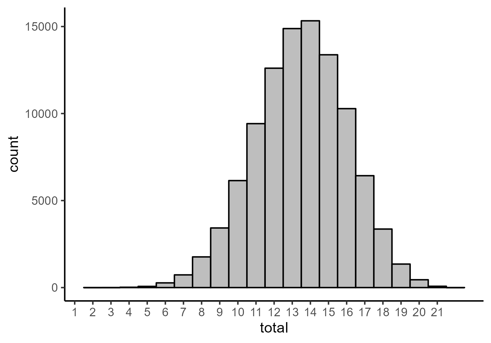
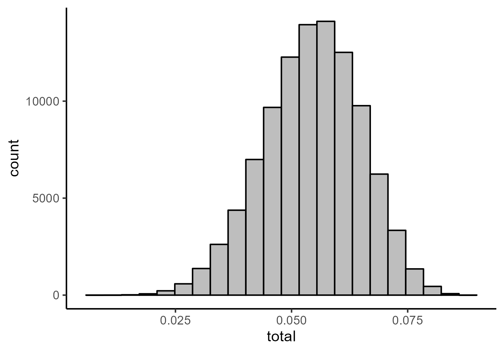

Dawtry et al (2019) - Network Re-analysis
================

- <a href="#network-analysis-of-combined-data-of-studies-1-3-and-5"
  id="toc-network-analysis-of-combined-data-of-studies-1-3-and-5">Network
  Analysis of Combined Data of Studies 1, 3, and 5</a>
  - <a href="#training-network" id="toc-training-network">Training
    Network</a>
    - <a href="#fit-indices" id="toc-fit-indices">Fit Indices</a>
    - <a href="#parameter-estimates" id="toc-parameter-estimates">Parameter
      Estimates</a>
    - <a href="#network-figures" id="toc-network-figures">Network Figures</a>
  - <a href="#test-network" id="toc-test-network">Test Network</a>
    - <a href="#fit-indices-1" id="toc-fit-indices-1">Fit Indices</a>
    - <a href="#parameter-estimates-1"
      id="toc-parameter-estimates-1">Parameter Estimates</a>
    - <a href="#network-figures-1" id="toc-network-figures-1">Network
      Figures</a>
- <a href="#factor-model" id="toc-factor-model">Factor Model</a>
  - <a href="#exploratory-factor-analysis-with-training-data"
    id="toc-exploratory-factor-analysis-with-training-data">Exploratory
    Factor Analysis with Training Data</a>
    - <a href="#parallel-analysis" id="toc-parallel-analysis">Parallel
      Analysis</a>
    - <a href="#exploratory-factor-analysis"
      id="toc-exploratory-factor-analysis">Exploratory Factor Analysis</a>
  - <a href="#confirmatory-factor-analysis-with-test-data"
    id="toc-confirmatory-factor-analysis-with-test-data">Confirmatory Factor
    Analysis with Test Data</a>
    - <a href="#fit-indices-2" id="toc-fit-indices-2">Fit Indices</a>
    - <a href="#parameter-estimates-2"
      id="toc-parameter-estimates-2">Parameter Estimates</a>
- <a href="#simulated-persuasion" id="toc-simulated-persuasion">Simulated
  Persuasion</a>
  - <a href="#fitting-model-to-full-data"
    id="toc-fitting-model-to-full-data">Fitting Model to Full Data</a>
    - <a href="#fit-indices-3" id="toc-fit-indices-3">Fit Indices</a>
    - <a href="#parameter-estimates-3"
      id="toc-parameter-estimates-3">Parameter Estimates</a>
    - <a href="#centrality-estimates" id="toc-centrality-estimates">Centrality
      Estimates</a>
    - <a href="#network-figures-2" id="toc-network-figures-2">Network
      Figures</a>
  - <a
    href="#creating-simulated-data-from-ising-models-based-on-the-estimated-network"
    id="toc-creating-simulated-data-from-ising-models-based-on-the-estimated-network">Creating
    Simulated Data from Ising Models Based on the Estimated Network</a>
    - <a href="#histograms-of-total-scores"
      id="toc-histograms-of-total-scores">Histograms of Total Scores</a>
    - <a href="#proportions-of-agreement-with-strongest-node"
      id="toc-proportions-of-agreement-with-strongest-node">Proportions of
      Agreement with Strongest Node</a>
    - <a
      href="#standardized-mean-difference-in-total-scores-between-baseline-and-persuasion-models"
      id="toc-standardized-mean-difference-in-total-scores-between-baseline-and-persuasion-models">Standardized
      Mean Difference in Total Scores Between Baseline and Persuasion
      Models</a>

# Network Analysis of Combined Data of Studies 1, 3, and 5

## Training Network

### Fit Indices

``` r
network_fit_ind_1 %>% 
  mutate(across(where(is.numeric), round, 6))
```

                                Measure         Value
    logl                           logl -10720.740583
    unrestricted.logl unrestricted.logl -10602.134756
    baseline.logl         baseline.logl -13545.328155
    nvar                           nvar     22.000000
    nobs                           nobs    275.000000
    npar                           npar     93.000000
    df                               df    182.000000
    objective                 objective      7.641774
    chisq                         chisq    237.211655
    pvalue                       pvalue      0.003700
    baseline.chisq       baseline.chisq   5886.386798
    baseline.df             baseline.df    231.000000
    baseline.pvalue     baseline.pvalue      0.000000
    nfi                             nfi      0.959702
    pnfi                           pnfi      0.756129
    tli                             tli      0.987609
    nnfi                           nnfi      0.987609
    rfi                             rfi      0.948852
    ifi                             ifi      0.990321
    rni                             rni      0.990237
    cfi                             cfi      0.990237
    rmsea                         rmsea      0.026080
    rmsea.ci.lower       rmsea.ci.lower      0.015478
    rmsea.ci.upper       rmsea.ci.upper      0.034939
    rmsea.pvalue           rmsea.pvalue      1.000000
    aic.ll                       aic.ll  21627.481166
    aic.ll2                     aic.ll2  21677.151621
    aic.x                         aic.x   -126.788345
    aic.x2                       aic.x2    423.211655
    bic                             bic  22008.810829
    bic2                           bic2  21713.667931
    ebic.25                     ebic.25  22296.277777
    ebic.5                       ebic.5  22583.744725
    ebic.75                     ebic.75  22813.718284
    ebic1                         ebic1  23158.678622

### Parameter Estimates

``` r
network_pars_1 %>% 
  mutate(across(where(is.numeric), round, 3))
```

           var1 var1_id  op    var2 var2_id   est std    se     p se_boot p_boot
    1    RMAS_1       1  ~1    <NA>      NA 1.709  NA 0.048 0.000      NA     NA
    2    RMAS_2       2  ~1    <NA>      NA 1.780  NA 0.050 0.000      NA     NA
    3    RMAS_3       3  ~1    <NA>      NA 1.446  NA 0.037 0.000      NA     NA
    4    RMAS_4       4  ~1    <NA>      NA 2.287  NA 0.060 0.000      NA     NA
    5    RMAS_5       5  ~1    <NA>      NA 1.489  NA 0.035 0.000      NA     NA
    6    RMAS_6       6  ~1    <NA>      NA 2.552  NA 0.061 0.000      NA     NA
    7    RMAS_7       7  ~1    <NA>      NA 2.473  NA 0.058 0.000      NA     NA
    8    RMAS_8       8  ~1    <NA>      NA 2.244  NA 0.053 0.000      NA     NA
    9    RMAS_9       9  ~1    <NA>      NA 1.957  NA 0.052 0.000      NA     NA
    10  RMAS_10      10  ~1    <NA>      NA 1.987  NA 0.052 0.000      NA     NA
    11  RMAS_11      11  ~1    <NA>      NA 1.424  NA 0.035 0.000      NA     NA
    12  RMAS_12      12  ~1    <NA>      NA 1.639  NA 0.044 0.000      NA     NA
    13  RMAS_13      13  ~1    <NA>      NA 1.513  NA 0.041 0.000      NA     NA
    14  RMAS_14      14  ~1    <NA>      NA 1.374  NA 0.034 0.000      NA     NA
    15  RMAS_15      15  ~1    <NA>      NA 1.269  NA 0.029 0.000      NA     NA
    16  RMAS_16      16  ~1    <NA>      NA 1.175  NA 0.022 0.000      NA     NA
    17  RMAS_17      17  ~1    <NA>      NA 2.027  NA 0.054 0.000      NA     NA
    18  RMAS_18      18  ~1    <NA>      NA 2.224  NA 0.054 0.000      NA     NA
    19  RMAS_19      19  ~1    <NA>      NA 2.401  NA 0.056 0.000      NA     NA
    20  RMAS_20      20  ~1    <NA>      NA 2.105  NA 0.051 0.000      NA     NA
    21  RMAS_21      21  ~1    <NA>      NA 2.090  NA 0.052 0.000      NA     NA
    22  RMAS_22      22  ~1    <NA>      NA 2.383  NA 0.056 0.000      NA     NA
    23   RMAS_2       2  --  RMAS_1       1 0.329  NA 0.036 0.000      NA     NA
    24   RMAS_3       3  --  RMAS_1       1 0.155  NA 0.041 0.000      NA     NA
    25   RMAS_4       4  --  RMAS_1       1 0.000  NA    NA    NA      NA     NA
    26   RMAS_5       5  --  RMAS_1       1 0.146  NA 0.040 0.000      NA     NA
    27   RMAS_6       6  --  RMAS_1       1 0.000  NA    NA    NA      NA     NA
    28   RMAS_7       7  --  RMAS_1       1 0.000  NA    NA    NA      NA     NA
    29   RMAS_8       8  --  RMAS_1       1 0.000  NA    NA    NA      NA     NA
    30   RMAS_9       9  --  RMAS_1       1 0.000  NA    NA    NA      NA     NA
    31  RMAS_10      10  --  RMAS_1       1 0.000  NA    NA    NA      NA     NA
    32  RMAS_11      11  --  RMAS_1       1 0.000  NA    NA    NA      NA     NA
    33  RMAS_12      12  --  RMAS_1       1 0.000  NA    NA    NA      NA     NA
    34  RMAS_13      13  --  RMAS_1       1 0.000  NA    NA    NA      NA     NA
    35  RMAS_14      14  --  RMAS_1       1 0.000  NA    NA    NA      NA     NA
    36  RMAS_15      15  --  RMAS_1       1 0.094  NA 0.028 0.001      NA     NA
    37  RMAS_16      16  --  RMAS_1       1 0.000  NA    NA    NA      NA     NA
    38  RMAS_17      17  --  RMAS_1       1 0.000  NA    NA    NA      NA     NA
    39  RMAS_18      18  --  RMAS_1       1 0.000  NA    NA    NA      NA     NA
    40  RMAS_19      19  --  RMAS_1       1 0.000  NA    NA    NA      NA     NA
    41  RMAS_20      20  --  RMAS_1       1 0.098  NA 0.025 0.000      NA     NA
    42  RMAS_21      21  --  RMAS_1       1 0.000  NA    NA    NA      NA     NA
    43  RMAS_22      22  --  RMAS_1       1 0.000  NA    NA    NA      NA     NA
    44   RMAS_3       3  --  RMAS_2       2 0.261  NA 0.034 0.000      NA     NA
    45   RMAS_4       4  --  RMAS_2       2 0.409  NA 0.031 0.000      NA     NA
    46   RMAS_5       5  --  RMAS_2       2 0.000  NA    NA    NA      NA     NA
    47   RMAS_6       6  --  RMAS_2       2 0.000  NA    NA    NA      NA     NA
    48   RMAS_7       7  --  RMAS_2       2 0.000  NA    NA    NA      NA     NA
    49   RMAS_8       8  --  RMAS_2       2 0.000  NA    NA    NA      NA     NA
    50   RMAS_9       9  --  RMAS_2       2 0.145  NA 0.029 0.000      NA     NA
    51  RMAS_10      10  --  RMAS_2       2 0.000  NA    NA    NA      NA     NA
    52  RMAS_11      11  --  RMAS_2       2 0.000  NA    NA    NA      NA     NA
    53  RMAS_12      12  --  RMAS_2       2 0.000  NA    NA    NA      NA     NA
    54  RMAS_13      13  --  RMAS_2       2 0.000  NA    NA    NA      NA     NA
    55  RMAS_14      14  --  RMAS_2       2 0.000  NA    NA    NA      NA     NA
    56  RMAS_15      15  --  RMAS_2       2 0.000  NA    NA    NA      NA     NA
    57  RMAS_16      16  --  RMAS_2       2 0.000  NA    NA    NA      NA     NA
    58  RMAS_17      17  --  RMAS_2       2 0.000  NA    NA    NA      NA     NA
    59  RMAS_18      18  --  RMAS_2       2 0.000  NA    NA    NA      NA     NA
    60  RMAS_19      19  --  RMAS_2       2 0.000  NA    NA    NA      NA     NA
    61  RMAS_20      20  --  RMAS_2       2 0.000  NA    NA    NA      NA     NA
    62  RMAS_21      21  --  RMAS_2       2 0.000  NA    NA    NA      NA     NA
    63  RMAS_22      22  --  RMAS_2       2 0.000  NA    NA    NA      NA     NA
    64   RMAS_4       4  --  RMAS_3       3 0.000  NA    NA    NA      NA     NA
    65   RMAS_5       5  --  RMAS_3       3 0.142  NA 0.039 0.000      NA     NA
    66   RMAS_6       6  --  RMAS_3       3 0.000  NA    NA    NA      NA     NA
    67   RMAS_7       7  --  RMAS_3       3 0.000  NA    NA    NA      NA     NA
    68   RMAS_8       8  --  RMAS_3       3 0.000  NA    NA    NA      NA     NA
    69   RMAS_9       9  --  RMAS_3       3 0.000  NA    NA    NA      NA     NA
    70  RMAS_10      10  --  RMAS_3       3 0.000  NA    NA    NA      NA     NA
    71  RMAS_11      11  --  RMAS_3       3 0.000  NA    NA    NA      NA     NA
    72  RMAS_12      12  --  RMAS_3       3 0.181  NA 0.035 0.000      NA     NA
    73  RMAS_13      13  --  RMAS_3       3 0.000  NA    NA    NA      NA     NA
    74  RMAS_14      14  --  RMAS_3       3 0.150  NA 0.029 0.000      NA     NA
    75  RMAS_15      15  --  RMAS_3       3 0.000  NA    NA    NA      NA     NA
    76  RMAS_16      16  --  RMAS_3       3 0.130  NA 0.031 0.000      NA     NA
    77  RMAS_17      17  --  RMAS_3       3 0.000  NA    NA    NA      NA     NA
    78  RMAS_18      18  --  RMAS_3       3 0.000  NA    NA    NA      NA     NA
    79  RMAS_19      19  --  RMAS_3       3 0.000  NA    NA    NA      NA     NA
    80  RMAS_20      20  --  RMAS_3       3 0.000  NA    NA    NA      NA     NA
    81  RMAS_21      21  --  RMAS_3       3 0.000  NA    NA    NA      NA     NA
    82  RMAS_22      22  --  RMAS_3       3 0.000  NA    NA    NA      NA     NA
    83   RMAS_5       5  --  RMAS_4       4 0.000  NA    NA    NA      NA     NA
    84   RMAS_6       6  --  RMAS_4       4 0.265  NA 0.035 0.000      NA     NA
    85   RMAS_7       7  --  RMAS_4       4 0.000  NA    NA    NA      NA     NA
    86   RMAS_8       8  --  RMAS_4       4 0.115  NA 0.033 0.001      NA     NA
    87   RMAS_9       9  --  RMAS_4       4 0.000  NA    NA    NA      NA     NA
    88  RMAS_10      10  --  RMAS_4       4 0.000  NA    NA    NA      NA     NA
    89  RMAS_11      11  --  RMAS_4       4 0.000  NA    NA    NA      NA     NA
    90  RMAS_12      12  --  RMAS_4       4 0.000  NA    NA    NA      NA     NA
    91  RMAS_13      13  --  RMAS_4       4 0.000  NA    NA    NA      NA     NA
    92  RMAS_14      14  --  RMAS_4       4 0.000  NA    NA    NA      NA     NA
    93  RMAS_15      15  --  RMAS_4       4 0.000  NA    NA    NA      NA     NA
    94  RMAS_16      16  --  RMAS_4       4 0.000  NA    NA    NA      NA     NA
    95  RMAS_17      17  --  RMAS_4       4 0.000  NA    NA    NA      NA     NA
    96  RMAS_18      18  --  RMAS_4       4 0.167  NA 0.028 0.000      NA     NA
    97  RMAS_19      19  --  RMAS_4       4 0.000  NA    NA    NA      NA     NA
    98  RMAS_20      20  --  RMAS_4       4 0.000  NA    NA    NA      NA     NA
    99  RMAS_21      21  --  RMAS_4       4 0.000  NA    NA    NA      NA     NA
    100 RMAS_22      22  --  RMAS_4       4 0.000  NA    NA    NA      NA     NA
    101  RMAS_6       6  --  RMAS_5       5 0.159  NA 0.038 0.000      NA     NA
    102  RMAS_7       7  --  RMAS_5       5 0.000  NA    NA    NA      NA     NA
    103  RMAS_8       8  --  RMAS_5       5 0.122  NA 0.036 0.001      NA     NA
    104  RMAS_9       9  --  RMAS_5       5 0.000  NA    NA    NA      NA     NA
    105 RMAS_10      10  --  RMAS_5       5 0.000  NA    NA    NA      NA     NA
    106 RMAS_11      11  --  RMAS_5       5 0.000  NA    NA    NA      NA     NA
    107 RMAS_12      12  --  RMAS_5       5 0.000  NA    NA    NA      NA     NA
    108 RMAS_13      13  --  RMAS_5       5 0.158  NA 0.032 0.000      NA     NA
    109 RMAS_14      14  --  RMAS_5       5 0.000  NA    NA    NA      NA     NA
    110 RMAS_15      15  --  RMAS_5       5 0.000  NA    NA    NA      NA     NA
    111 RMAS_16      16  --  RMAS_5       5 0.000  NA    NA    NA      NA     NA
    112 RMAS_17      17  --  RMAS_5       5 0.000  NA    NA    NA      NA     NA
    113 RMAS_18      18  --  RMAS_5       5 0.000  NA    NA    NA      NA     NA
    114 RMAS_19      19  --  RMAS_5       5 0.000  NA    NA    NA      NA     NA
    115 RMAS_20      20  --  RMAS_5       5 0.000  NA    NA    NA      NA     NA
    116 RMAS_21      21  --  RMAS_5       5 0.108  NA 0.033 0.001      NA     NA
    117 RMAS_22      22  --  RMAS_5       5 0.000  NA    NA    NA      NA     NA
    118  RMAS_7       7  --  RMAS_6       6 0.000  NA    NA    NA      NA     NA
    119  RMAS_8       8  --  RMAS_6       6 0.000  NA    NA    NA      NA     NA
    120  RMAS_9       9  --  RMAS_6       6 0.000  NA    NA    NA      NA     NA
    121 RMAS_10      10  --  RMAS_6       6 0.000  NA    NA    NA      NA     NA
    122 RMAS_11      11  --  RMAS_6       6 0.000  NA    NA    NA      NA     NA
    123 RMAS_12      12  --  RMAS_6       6 0.000  NA    NA    NA      NA     NA
    124 RMAS_13      13  --  RMAS_6       6 0.000  NA    NA    NA      NA     NA
    125 RMAS_14      14  --  RMAS_6       6 0.000  NA    NA    NA      NA     NA
    126 RMAS_15      15  --  RMAS_6       6 0.000  NA    NA    NA      NA     NA
    127 RMAS_16      16  --  RMAS_6       6 0.000  NA    NA    NA      NA     NA
    128 RMAS_17      17  --  RMAS_6       6 0.193  NA 0.039 0.000      NA     NA
    129 RMAS_18      18  --  RMAS_6       6 0.000  NA    NA    NA      NA     NA
    130 RMAS_19      19  --  RMAS_6       6 0.000  NA    NA    NA      NA     NA
    131 RMAS_20      20  --  RMAS_6       6 0.000  NA    NA    NA      NA     NA
    132 RMAS_21      21  --  RMAS_6       6 0.000  NA    NA    NA      NA     NA
    133 RMAS_22      22  --  RMAS_6       6 0.132  NA 0.033 0.000      NA     NA
    134  RMAS_8       8  --  RMAS_7       7 0.217  NA 0.041 0.000      NA     NA
    135  RMAS_9       9  --  RMAS_7       7 0.311  NA 0.042 0.000      NA     NA
    136 RMAS_10      10  --  RMAS_7       7 0.127  NA 0.044 0.004      NA     NA
    137 RMAS_11      11  --  RMAS_7       7 0.000  NA    NA    NA      NA     NA
    138 RMAS_12      12  --  RMAS_7       7 0.000  NA    NA    NA      NA     NA
    139 RMAS_13      13  --  RMAS_7       7 0.000  NA    NA    NA      NA     NA
    140 RMAS_14      14  --  RMAS_7       7 0.000  NA    NA    NA      NA     NA
    141 RMAS_15      15  --  RMAS_7       7 0.000  NA    NA    NA      NA     NA
    142 RMAS_16      16  --  RMAS_7       7 0.000  NA    NA    NA      NA     NA
    143 RMAS_17      17  --  RMAS_7       7 0.000  NA    NA    NA      NA     NA
    144 RMAS_18      18  --  RMAS_7       7 0.000  NA    NA    NA      NA     NA
    145 RMAS_19      19  --  RMAS_7       7 0.000  NA    NA    NA      NA     NA
    146 RMAS_20      20  --  RMAS_7       7 0.000  NA    NA    NA      NA     NA
    147 RMAS_21      21  --  RMAS_7       7 0.000  NA    NA    NA      NA     NA
    148 RMAS_22      22  --  RMAS_7       7 0.000  NA    NA    NA      NA     NA
    149  RMAS_9       9  --  RMAS_8       8 0.182  NA 0.042 0.000      NA     NA
    150 RMAS_10      10  --  RMAS_8       8 0.193  NA 0.042 0.000      NA     NA
    151 RMAS_11      11  --  RMAS_8       8 0.000  NA    NA    NA      NA     NA
    152 RMAS_12      12  --  RMAS_8       8 0.000  NA    NA    NA      NA     NA
    153 RMAS_13      13  --  RMAS_8       8 0.000  NA    NA    NA      NA     NA
    154 RMAS_14      14  --  RMAS_8       8 0.000  NA    NA    NA      NA     NA
    155 RMAS_15      15  --  RMAS_8       8 0.000  NA    NA    NA      NA     NA
    156 RMAS_16      16  --  RMAS_8       8 0.000  NA    NA    NA      NA     NA
    157 RMAS_17      17  --  RMAS_8       8 0.000  NA    NA    NA      NA     NA
    158 RMAS_18      18  --  RMAS_8       8 0.000  NA    NA    NA      NA     NA
    159 RMAS_19      19  --  RMAS_8       8 0.000  NA    NA    NA      NA     NA
    160 RMAS_20      20  --  RMAS_8       8 0.139  NA 0.026 0.000      NA     NA
    161 RMAS_21      21  --  RMAS_8       8 0.000  NA    NA    NA      NA     NA
    162 RMAS_22      22  --  RMAS_8       8 0.000  NA    NA    NA      NA     NA
    163 RMAS_10      10  --  RMAS_9       9 0.125  NA 0.044 0.004      NA     NA
    164 RMAS_11      11  --  RMAS_9       9 0.000  NA    NA    NA      NA     NA
    165 RMAS_12      12  --  RMAS_9       9 0.000  NA    NA    NA      NA     NA
    166 RMAS_13      13  --  RMAS_9       9 0.000  NA    NA    NA      NA     NA
    167 RMAS_14      14  --  RMAS_9       9 0.000  NA    NA    NA      NA     NA
    168 RMAS_15      15  --  RMAS_9       9 0.000  NA    NA    NA      NA     NA
    169 RMAS_16      16  --  RMAS_9       9 0.000  NA    NA    NA      NA     NA
    170 RMAS_17      17  --  RMAS_9       9 0.000  NA    NA    NA      NA     NA
    171 RMAS_18      18  --  RMAS_9       9 0.000  NA    NA    NA      NA     NA
    172 RMAS_19      19  --  RMAS_9       9 0.000  NA    NA    NA      NA     NA
    173 RMAS_20      20  --  RMAS_9       9 0.000  NA    NA    NA      NA     NA
    174 RMAS_21      21  --  RMAS_9       9 0.000  NA    NA    NA      NA     NA
    175 RMAS_22      22  --  RMAS_9       9 0.000  NA    NA    NA      NA     NA
    176 RMAS_11      11  -- RMAS_10      10 0.210  NA 0.034 0.000      NA     NA
    177 RMAS_12      12  -- RMAS_10      10 0.000  NA    NA    NA      NA     NA
    178 RMAS_13      13  -- RMAS_10      10 0.000  NA    NA    NA      NA     NA
    179 RMAS_14      14  -- RMAS_10      10 0.000  NA    NA    NA      NA     NA
    180 RMAS_15      15  -- RMAS_10      10 0.000  NA    NA    NA      NA     NA
    181 RMAS_16      16  -- RMAS_10      10 0.000  NA    NA    NA      NA     NA
    182 RMAS_17      17  -- RMAS_10      10 0.000  NA    NA    NA      NA     NA
    183 RMAS_18      18  -- RMAS_10      10 0.000  NA    NA    NA      NA     NA
    184 RMAS_19      19  -- RMAS_10      10 0.076  NA 0.027 0.005      NA     NA
    185 RMAS_20      20  -- RMAS_10      10 0.000  NA    NA    NA      NA     NA
    186 RMAS_21      21  -- RMAS_10      10 0.000  NA    NA    NA      NA     NA
    187 RMAS_22      22  -- RMAS_10      10 0.000  NA    NA    NA      NA     NA
    188 RMAS_12      12  -- RMAS_11      11 0.365  NA 0.035 0.000      NA     NA
    189 RMAS_13      13  -- RMAS_11      11 0.000  NA    NA    NA      NA     NA
    190 RMAS_14      14  -- RMAS_11      11 0.000  NA    NA    NA      NA     NA
    191 RMAS_15      15  -- RMAS_11      11 0.116  NA 0.037 0.002      NA     NA
    192 RMAS_16      16  -- RMAS_11      11 0.164  NA 0.040 0.000      NA     NA
    193 RMAS_17      17  -- RMAS_11      11 0.000  NA    NA    NA      NA     NA
    194 RMAS_18      18  -- RMAS_11      11 0.000  NA    NA    NA      NA     NA
    195 RMAS_19      19  -- RMAS_11      11 0.000  NA    NA    NA      NA     NA
    196 RMAS_20      20  -- RMAS_11      11 0.000  NA    NA    NA      NA     NA
    197 RMAS_21      21  -- RMAS_11      11 0.000  NA    NA    NA      NA     NA
    198 RMAS_22      22  -- RMAS_11      11 0.000  NA    NA    NA      NA     NA
    199 RMAS_13      13  -- RMAS_12      12 0.105  NA 0.031 0.001      NA     NA
    200 RMAS_14      14  -- RMAS_12      12 0.000  NA    NA    NA      NA     NA
    201 RMAS_15      15  -- RMAS_12      12 0.000  NA    NA    NA      NA     NA
    202 RMAS_16      16  -- RMAS_12      12 0.000  NA    NA    NA      NA     NA
    203 RMAS_17      17  -- RMAS_12      12 0.100  NA 0.038 0.008      NA     NA
    204 RMAS_18      18  -- RMAS_12      12 0.000  NA    NA    NA      NA     NA
    205 RMAS_19      19  -- RMAS_12      12 0.000  NA    NA    NA      NA     NA
    206 RMAS_20      20  -- RMAS_12      12 0.105  NA 0.025 0.000      NA     NA
    207 RMAS_21      21  -- RMAS_12      12 0.000  NA    NA    NA      NA     NA
    208 RMAS_22      22  -- RMAS_12      12 0.000  NA    NA    NA      NA     NA
    209 RMAS_14      14  -- RMAS_13      13 0.584  NA 0.027 0.000      NA     NA
    210 RMAS_15      15  -- RMAS_13      13 0.000  NA    NA    NA      NA     NA
    211 RMAS_16      16  -- RMAS_13      13 0.000  NA    NA    NA      NA     NA
    212 RMAS_17      17  -- RMAS_13      13 0.000  NA    NA    NA      NA     NA
    213 RMAS_18      18  -- RMAS_13      13 0.000  NA    NA    NA      NA     NA
    214 RMAS_19      19  -- RMAS_13      13 0.000  NA    NA    NA      NA     NA
    215 RMAS_20      20  -- RMAS_13      13 0.000  NA    NA    NA      NA     NA
    216 RMAS_21      21  -- RMAS_13      13 0.000  NA    NA    NA      NA     NA
    217 RMAS_22      22  -- RMAS_13      13 0.000  NA    NA    NA      NA     NA
    218 RMAS_15      15  -- RMAS_14      14 0.308  NA 0.027 0.000      NA     NA
    219 RMAS_16      16  -- RMAS_14      14 0.000  NA    NA    NA      NA     NA
    220 RMAS_17      17  -- RMAS_14      14 0.165  NA 0.028 0.000      NA     NA
    221 RMAS_18      18  -- RMAS_14      14 0.000  NA    NA    NA      NA     NA
    222 RMAS_19      19  -- RMAS_14      14 0.000  NA    NA    NA      NA     NA
    223 RMAS_20      20  -- RMAS_14      14 0.000  NA    NA    NA      NA     NA
    224 RMAS_21      21  -- RMAS_14      14 0.000  NA    NA    NA      NA     NA
    225 RMAS_22      22  -- RMAS_14      14 0.000  NA    NA    NA      NA     NA
    226 RMAS_16      16  -- RMAS_15      15 0.552  NA 0.030 0.000      NA     NA
    227 RMAS_17      17  -- RMAS_15      15 0.000  NA    NA    NA      NA     NA
    228 RMAS_18      18  -- RMAS_15      15 0.000  NA    NA    NA      NA     NA
    229 RMAS_19      19  -- RMAS_15      15 0.000  NA    NA    NA      NA     NA
    230 RMAS_20      20  -- RMAS_15      15 0.000  NA    NA    NA      NA     NA
    231 RMAS_21      21  -- RMAS_15      15 0.000  NA    NA    NA      NA     NA
    232 RMAS_22      22  -- RMAS_15      15 0.000  NA    NA    NA      NA     NA
    233 RMAS_17      17  -- RMAS_16      16 0.000  NA    NA    NA      NA     NA
    234 RMAS_18      18  -- RMAS_16      16 0.000  NA    NA    NA      NA     NA
    235 RMAS_19      19  -- RMAS_16      16 0.000  NA    NA    NA      NA     NA
    236 RMAS_20      20  -- RMAS_16      16 0.000  NA    NA    NA      NA     NA
    237 RMAS_21      21  -- RMAS_16      16 0.000  NA    NA    NA      NA     NA
    238 RMAS_22      22  -- RMAS_16      16 0.000  NA    NA    NA      NA     NA
    239 RMAS_18      18  -- RMAS_17      17 0.195  NA 0.030 0.000      NA     NA
    240 RMAS_19      19  -- RMAS_17      17 0.000  NA    NA    NA      NA     NA
    241 RMAS_20      20  -- RMAS_17      17 0.000  NA    NA    NA      NA     NA
    242 RMAS_21      21  -- RMAS_17      17 0.000  NA    NA    NA      NA     NA
    243 RMAS_22      22  -- RMAS_17      17 0.000  NA    NA    NA      NA     NA
    244 RMAS_19      19  -- RMAS_18      18 0.000  NA    NA    NA      NA     NA
    245 RMAS_20      20  -- RMAS_18      18 0.360  NA 0.033 0.000      NA     NA
    246 RMAS_21      21  -- RMAS_18      18 0.169  NA 0.042 0.000      NA     NA
    247 RMAS_22      22  -- RMAS_18      18 0.219  NA 0.037 0.000      NA     NA
    248 RMAS_20      20  -- RMAS_19      19 0.456  NA 0.031 0.000      NA     NA
    249 RMAS_21      21  -- RMAS_19      19 0.191  NA 0.043 0.000      NA     NA
    250 RMAS_22      22  -- RMAS_19      19 0.322  NA 0.036 0.000      NA     NA
    251 RMAS_21      21  -- RMAS_20      20 0.141  NA 0.042 0.001      NA     NA
    252 RMAS_22      22  -- RMAS_20      20 0.000  NA    NA    NA      NA     NA
    253 RMAS_22      22  -- RMAS_21      21 0.168  NA 0.044 0.000      NA     NA
    254  RMAS_1       1 ~/~  RMAS_1       1 0.705  NA 0.023 0.000      NA     NA
    255  RMAS_2       2 ~/~  RMAS_2       2 0.635  NA 0.020 0.000      NA     NA
    256  RMAS_3       3 ~/~  RMAS_3       3 0.509  NA 0.016 0.000      NA     NA
    257  RMAS_4       4 ~/~  RMAS_4       4 0.828  NA 0.026 0.000      NA     NA
    258  RMAS_5       5 ~/~  RMAS_5       5 0.568  NA 0.019 0.000      NA     NA
    259  RMAS_6       6 ~/~  RMAS_6       6 1.003  NA 0.033 0.000      NA     NA
    260  RMAS_7       7 ~/~  RMAS_7       7 1.012  NA 0.034 0.000      NA     NA
    261  RMAS_8       8 ~/~  RMAS_8       8 0.831  NA 0.027 0.000      NA     NA
    262  RMAS_9       9 ~/~  RMAS_9       9 0.886  NA 0.029 0.000      NA     NA
    263 RMAS_10      10 ~/~ RMAS_10      10 0.896  NA 0.030 0.000      NA     NA
    264 RMAS_11      11 ~/~ RMAS_11      11 0.546  NA 0.018 0.000      NA     NA
    265 RMAS_12      12 ~/~ RMAS_12      12 0.677  NA 0.022 0.000      NA     NA
    266 RMAS_13      13 ~/~ RMAS_13      13 0.531  NA 0.017 0.000      NA     NA
    267 RMAS_14      14 ~/~ RMAS_14      14 0.393  NA 0.012 0.000      NA     NA
    268 RMAS_15      15 ~/~ RMAS_15      15 0.353  NA 0.011 0.000      NA     NA
    269 RMAS_16      16 ~/~ RMAS_16      16 0.289  NA 0.010 0.000      NA     NA
    270 RMAS_17      17 ~/~ RMAS_17      17 0.903  NA 0.030 0.000      NA     NA
    271 RMAS_18      18 ~/~ RMAS_18      18 0.638  NA 0.020 0.000      NA     NA
    272 RMAS_19      19 ~/~ RMAS_19      19 0.632  NA 0.020 0.000      NA     NA
    273 RMAS_20      20 ~/~ RMAS_20      20 0.533  NA 0.016 0.000      NA     NA
    274 RMAS_21      21 ~/~ RMAS_21      21 0.726  NA 0.024 0.000      NA     NA
    275 RMAS_22      22 ~/~ RMAS_22      22 0.754  NA 0.025 0.000      NA     NA
        matrix row col par      group group_id fixed    mi   pmi    epc mi_free
    1       mu   1   1   1 fullsample        1 FALSE 0.000 1.000  0.000      NA
    2       mu   2   1   2 fullsample        1 FALSE 0.000 1.000  0.000      NA
    3       mu   3   1   3 fullsample        1 FALSE 0.000 1.000  0.000      NA
    4       mu   4   1   4 fullsample        1 FALSE 0.000 1.000  0.000      NA
    5       mu   5   1   5 fullsample        1 FALSE 0.000 1.000  0.000      NA
    6       mu   6   1   6 fullsample        1 FALSE 0.000 1.000  0.000      NA
    7       mu   7   1   7 fullsample        1 FALSE 0.000 1.000  0.000      NA
    8       mu   8   1   8 fullsample        1 FALSE 0.000 1.000  0.000      NA
    9       mu   9   1   9 fullsample        1 FALSE 0.000 1.000  0.000      NA
    10      mu  10   1  10 fullsample        1 FALSE 0.000 1.000  0.000      NA
    11      mu  11   1  11 fullsample        1 FALSE 0.000 1.000  0.000      NA
    12      mu  12   1  12 fullsample        1 FALSE 0.000 1.000  0.000      NA
    13      mu  13   1  13 fullsample        1 FALSE 0.000 1.000  0.000      NA
    14      mu  14   1  14 fullsample        1 FALSE 0.000 1.000  0.000      NA
    15      mu  15   1  15 fullsample        1 FALSE 0.000 1.000  0.000      NA
    16      mu  16   1  16 fullsample        1 FALSE 0.000 1.000  0.000      NA
    17      mu  17   1  17 fullsample        1 FALSE 0.000 1.000  0.000      NA
    18      mu  18   1  18 fullsample        1 FALSE 0.000 1.000  0.000      NA
    19      mu  19   1  19 fullsample        1 FALSE 0.000 1.000  0.000      NA
    20      mu  20   1  20 fullsample        1 FALSE 0.000 1.000  0.000      NA
    21      mu  21   1  21 fullsample        1 FALSE 0.000 1.000  0.000      NA
    22      mu  22   1  22 fullsample        1 FALSE 0.000 1.000  0.000      NA
    23   omega   2   1  23 fullsample        1 FALSE 0.000 1.000  0.000      NA
    24   omega   3   1  24 fullsample        1 FALSE 0.000 1.000  0.000      NA
    25   omega   4   1   0 fullsample        1  TRUE 1.762 0.184  0.053      NA
    26   omega   5   1  25 fullsample        1 FALSE 0.000 1.000  0.000      NA
    27   omega   6   1   0 fullsample        1  TRUE 1.728 0.189  0.049      NA
    28   omega   7   1   0 fullsample        1  TRUE 0.060 0.806 -0.008      NA
    29   omega   8   1   0 fullsample        1  TRUE 2.590 0.108  0.059      NA
    30   omega   9   1   0 fullsample        1  TRUE 3.267 0.071  0.069      NA
    31   omega  10   1   0 fullsample        1  TRUE 1.021 0.312  0.035      NA
    32   omega  11   1   0 fullsample        1  TRUE 0.011 0.915 -0.004      NA
    33   omega  12   1   0 fullsample        1  TRUE 5.301 0.021  0.088      NA
    34   omega  13   1   0 fullsample        1  TRUE 2.434 0.119  0.049      NA
    35   omega  14   1   0 fullsample        1  TRUE 0.973 0.324  0.032      NA
    36   omega  15   1  26 fullsample        1 FALSE 0.000 1.000  0.000      NA
    37   omega  16   1   0 fullsample        1  TRUE 0.027 0.869  0.006      NA
    38   omega  17   1   0 fullsample        1  TRUE 4.789 0.029  0.080      NA
    39   omega  18   1   0 fullsample        1  TRUE 0.030 0.863  0.006      NA
    40   omega  19   1   0 fullsample        1  TRUE 0.083 0.774 -0.010      NA
    41   omega  20   1  27 fullsample        1 FALSE 0.000 1.000  0.000      NA
    42   omega  21   1   0 fullsample        1  TRUE 0.110 0.741  0.012      NA
    43   omega  22   1   0 fullsample        1  TRUE 1.687 0.194  0.042      NA
    44   omega   3   2  28 fullsample        1 FALSE 0.000 1.000  0.000      NA
    45   omega   4   2  29 fullsample        1 FALSE 0.000 1.000  0.000      NA
    46   omega   5   2   0 fullsample        1  TRUE 0.136 0.713  0.014      NA
    47   omega   6   2   0 fullsample        1  TRUE 2.334 0.127  0.057      NA
    48   omega   7   2   0 fullsample        1  TRUE 0.386 0.534 -0.020      NA
    49   omega   8   2   0 fullsample        1  TRUE 0.456 0.500  0.024      NA
    50   omega   9   2  30 fullsample        1 FALSE 0.000 1.000  0.000      NA
    51   omega  10   2   0 fullsample        1  TRUE 1.887 0.170 -0.043      NA
    52   omega  11   2   0 fullsample        1  TRUE 8.926 0.003 -0.085      NA
    53   omega  12   2   0 fullsample        1  TRUE 0.136 0.713 -0.012      NA
    54   omega  13   2   0 fullsample        1  TRUE 0.096 0.756  0.008      NA
    55   omega  14   2   0 fullsample        1  TRUE 1.232 0.267  0.028      NA
    56   omega  15   2   0 fullsample        1  TRUE 0.021 0.884  0.004      NA
    57   omega  16   2   0 fullsample        1  TRUE 3.729 0.053 -0.055      NA
    58   omega  17   2   0 fullsample        1  TRUE 0.514 0.474  0.023      NA
    59   omega  18   2   0 fullsample        1  TRUE 1.478 0.224  0.035      NA
    60   omega  19   2   0 fullsample        1  TRUE 0.083 0.774  0.007      NA
    61   omega  20   2   0 fullsample        1  TRUE 0.000 0.987  0.000      NA
    62   omega  21   2   0 fullsample        1  TRUE 1.412 0.235  0.033      NA
    63   omega  22   2   0 fullsample        1  TRUE 0.023 0.880  0.004      NA
    64   omega   4   3   0 fullsample        1  TRUE 1.853 0.173  0.050      NA
    65   omega   5   3  31 fullsample        1 FALSE 0.000 1.000  0.000      NA
    66   omega   6   3   0 fullsample        1  TRUE 1.630 0.202  0.045      NA
    67   omega   7   3   0 fullsample        1  TRUE 0.133 0.715  0.011      NA
    68   omega   8   3   0 fullsample        1  TRUE 1.939 0.164  0.046      NA
    69   omega   9   3   0 fullsample        1  TRUE 2.499 0.114  0.056      NA
    70   omega  10   3   0 fullsample        1  TRUE 1.728 0.189 -0.043      NA
    71   omega  11   3   0 fullsample        1  TRUE 3.780 0.052 -0.072      NA
    72   omega  12   3  32 fullsample        1 FALSE 0.000 1.000  0.000      NA
    73   omega  13   3   0 fullsample        1  TRUE 1.852 0.174 -0.053      NA
    74   omega  14   3  33 fullsample        1 FALSE 0.000 1.000  0.000      NA
    75   omega  15   3   0 fullsample        1  TRUE 0.015 0.903  0.005      NA
    76   omega  16   3  34 fullsample        1 FALSE 0.000 1.000  0.000      NA
    77   omega  17   3   0 fullsample        1  TRUE 0.686 0.408 -0.031      NA
    78   omega  18   3   0 fullsample        1  TRUE 1.280 0.258  0.030      NA
    79   omega  19   3   0 fullsample        1  TRUE 0.040 0.841 -0.005      NA
    80   omega  20   3   0 fullsample        1  TRUE 0.263 0.608  0.013      NA
    81   omega  21   3   0 fullsample        1  TRUE 0.035 0.852 -0.006      NA
    82   omega  22   3   0 fullsample        1  TRUE 0.251 0.616 -0.014      NA
    83   omega   5   4   0 fullsample        1  TRUE 0.008 0.927 -0.003      NA
    84   omega   6   4  35 fullsample        1 FALSE 0.000 1.000  0.000      NA
    85   omega   7   4   0 fullsample        1  TRUE 0.055 0.814 -0.008      NA
    86   omega   8   4  36 fullsample        1 FALSE 0.000 1.000  0.000      NA
    87   omega   9   4   0 fullsample        1  TRUE 0.775 0.379 -0.035      NA
    88   omega  10   4   0 fullsample        1  TRUE 0.353 0.553 -0.021      NA
    89   omega  11   4   0 fullsample        1  TRUE 1.310 0.252 -0.033      NA
    90   omega  12   4   0 fullsample        1  TRUE 0.094 0.759  0.010      NA
    91   omega  13   4   0 fullsample        1  TRUE 3.428 0.064  0.048      NA
    92   omega  14   4   0 fullsample        1  TRUE 3.972 0.046  0.047      NA
    93   omega  15   4   0 fullsample        1  TRUE 1.865 0.172  0.033      NA
    94   omega  16   4   0 fullsample        1  TRUE 0.014 0.904 -0.003      NA
    95   omega  17   4   0 fullsample        1  TRUE 0.029 0.865  0.006      NA
    96   omega  18   4  37 fullsample        1 FALSE 0.000 1.000  0.000      NA
    97   omega  19   4   0 fullsample        1  TRUE 4.961 0.026  0.063      NA
    98   omega  20   4   0 fullsample        1  TRUE 0.758 0.384  0.027      NA
    99   omega  21   4   0 fullsample        1  TRUE 1.035 0.309  0.035      NA
    100  omega  22   4   0 fullsample        1  TRUE 1.292 0.256  0.039      NA
    101  omega   6   5  38 fullsample        1 FALSE 0.000 1.000  0.000      NA
    102  omega   7   5   0 fullsample        1  TRUE 1.157 0.282  0.040      NA
    103  omega   8   5  39 fullsample        1 FALSE 0.000 1.000  0.000      NA
    104  omega   9   5   0 fullsample        1  TRUE 0.027 0.869  0.006      NA
    105  omega  10   5   0 fullsample        1  TRUE 0.463 0.496  0.026      NA
    106  omega  11   5   0 fullsample        1  TRUE 0.207 0.649 -0.016      NA
    107  omega  12   5   0 fullsample        1  TRUE 0.845 0.358  0.037      NA
    108  omega  13   5  40 fullsample        1 FALSE 0.000 1.000  0.000      NA
    109  omega  14   5   0 fullsample        1  TRUE 0.179 0.673  0.016      NA
    110  omega  15   5   0 fullsample        1  TRUE 0.140 0.709  0.012      NA
    111  omega  16   5   0 fullsample        1  TRUE 0.112 0.737 -0.011      NA
    112  omega  17   5   0 fullsample        1  TRUE 1.820 0.177  0.055      NA
    113  omega  18   5   0 fullsample        1  TRUE 1.514 0.218  0.042      NA
    114  omega  19   5   0 fullsample        1  TRUE 0.001 0.972 -0.001      NA
    115  omega  20   5   0 fullsample        1  TRUE 0.008 0.930 -0.003      NA
    116  omega  21   5  41 fullsample        1 FALSE 0.000 1.000  0.000      NA
    117  omega  22   5   0 fullsample        1  TRUE 0.311 0.577  0.020      NA
    118  omega   7   6   0 fullsample        1  TRUE 0.038 0.846  0.007      NA
    119  omega   8   6   0 fullsample        1  TRUE 0.031 0.860  0.007      NA
    120  omega   9   6   0 fullsample        1  TRUE 0.000 0.987 -0.001      NA
    121  omega  10   6   0 fullsample        1  TRUE 1.162 0.281  0.040      NA
    122  omega  11   6   0 fullsample        1  TRUE 0.232 0.630  0.016      NA
    123  omega  12   6   0 fullsample        1  TRUE 4.089 0.043  0.074      NA
    124  omega  13   6   0 fullsample        1  TRUE 0.340 0.560  0.018      NA
    125  omega  14   6   0 fullsample        1  TRUE 0.398 0.528  0.018      NA
    126  omega  15   6   0 fullsample        1  TRUE 2.014 0.156  0.038      NA
    127  omega  16   6   0 fullsample        1  TRUE 0.435 0.509  0.019      NA
    128  omega  17   6  42 fullsample        1 FALSE 0.000 1.000  0.000      NA
    129  omega  18   6   0 fullsample        1  TRUE 0.678 0.410  0.031      NA
    130  omega  19   6   0 fullsample        1  TRUE 0.012 0.912  0.004      NA
    131  omega  20   6   0 fullsample        1  TRUE 1.079 0.299  0.032      NA
    132  omega  21   6   0 fullsample        1  TRUE 0.003 0.960 -0.002      NA
    133  omega  22   6  43 fullsample        1 FALSE 0.000 1.000  0.000      NA
    134  omega   8   7  44 fullsample        1 FALSE 0.000 1.000  0.000      NA
    135  omega   9   7  45 fullsample        1 FALSE 0.000 1.000  0.000      NA
    136  omega  10   7  46 fullsample        1 FALSE 0.000 1.000  0.000      NA
    137  omega  11   7   0 fullsample        1  TRUE 1.503 0.220 -0.042      NA
    138  omega  12   7   0 fullsample        1  TRUE 0.450 0.502 -0.022      NA
    139  omega  13   7   0 fullsample        1  TRUE 1.352 0.245  0.032      NA
    140  omega  14   7   0 fullsample        1  TRUE 0.299 0.585  0.013      NA
    141  omega  15   7   0 fullsample        1  TRUE 0.000 0.987  0.000      NA
    142  omega  16   7   0 fullsample        1  TRUE 0.096 0.756  0.009      NA
    143  omega  17   7   0 fullsample        1  TRUE 3.876 0.049  0.068      NA
    144  omega  18   7   0 fullsample        1  TRUE 0.286 0.593  0.015      NA
    145  omega  19   7   0 fullsample        1  TRUE 0.034 0.854  0.005      NA
    146  omega  20   7   0 fullsample        1  TRUE 0.389 0.533  0.016      NA
    147  omega  21   7   0 fullsample        1  TRUE 4.282 0.039  0.063      NA
    148  omega  22   7   0 fullsample        1  TRUE 2.061 0.151  0.042      NA
    149  omega   9   8  47 fullsample        1 FALSE 0.000 1.000  0.000      NA
    150  omega  10   8  48 fullsample        1 FALSE 0.000 1.000  0.000      NA
    151  omega  11   8   0 fullsample        1  TRUE 0.625 0.429 -0.027      NA
    152  omega  12   8   0 fullsample        1  TRUE 0.100 0.752  0.011      NA
    153  omega  13   8   0 fullsample        1  TRUE 1.470 0.225  0.034      NA
    154  omega  14   8   0 fullsample        1  TRUE 2.470 0.116  0.039      NA
    155  omega  15   8   0 fullsample        1  TRUE 0.110 0.740  0.008      NA
    156  omega  16   8   0 fullsample        1  TRUE 0.649 0.421 -0.022      NA
    157  omega  17   8   0 fullsample        1  TRUE 0.645 0.422  0.029      NA
    158  omega  18   8   0 fullsample        1  TRUE 1.768 0.184 -0.050      NA
    159  omega  19   8   0 fullsample        1  TRUE 0.213 0.644  0.017      NA
    160  omega  20   8  49 fullsample        1 FALSE 0.000 1.000  0.000      NA
    161  omega  21   8   0 fullsample        1  TRUE 1.216 0.270  0.042      NA
    162  omega  22   8   0 fullsample        1  TRUE 3.187 0.074  0.062      NA
    163  omega  10   9  50 fullsample        1 FALSE 0.000 1.000  0.000      NA
    164  omega  11   9   0 fullsample        1  TRUE 0.132 0.716 -0.013      NA
    165  omega  12   9   0 fullsample        1  TRUE 1.078 0.299 -0.035      NA
    166  omega  13   9   0 fullsample        1  TRUE 0.139 0.709 -0.010      NA
    167  omega  14   9   0 fullsample        1  TRUE 1.408 0.235  0.029      NA
    168  omega  15   9   0 fullsample        1  TRUE 4.251 0.039  0.054      NA
    169  omega  16   9   0 fullsample        1  TRUE 1.714 0.191  0.037      NA
    170  omega  17   9   0 fullsample        1  TRUE 2.954 0.086  0.060      NA
    171  omega  18   9   0 fullsample        1  TRUE 0.035 0.852 -0.005      NA
    172  omega  19   9   0 fullsample        1  TRUE 0.516 0.472  0.019      NA
    173  omega  20   9   0 fullsample        1  TRUE 1.226 0.268  0.029      NA
    174  omega  21   9   0 fullsample        1  TRUE 1.465 0.226  0.037      NA
    175  omega  22   9   0 fullsample        1  TRUE 4.831 0.028  0.066      NA
    176  omega  11  10  51 fullsample        1 FALSE 0.000 1.000  0.000      NA
    177  omega  12  10   0 fullsample        1  TRUE 1.206 0.272  0.044      NA
    178  omega  13  10   0 fullsample        1  TRUE 0.924 0.336 -0.028      NA
    179  omega  14  10   0 fullsample        1  TRUE 0.104 0.747 -0.008      NA
    180  omega  15  10   0 fullsample        1  TRUE 1.047 0.306 -0.030      NA
    181  omega  16  10   0 fullsample        1  TRUE 1.570 0.210 -0.040      NA
    182  omega  17  10   0 fullsample        1  TRUE 0.690 0.406  0.031      NA
    183  omega  18  10   0 fullsample        1  TRUE 2.456 0.117 -0.052      NA
    184  omega  19  10  52 fullsample        1 FALSE 0.000 1.000  0.000      NA
    185  omega  20  10   0 fullsample        1  TRUE 1.073 0.300  0.038      NA
    186  omega  21  10   0 fullsample        1  TRUE 0.841 0.359  0.035      NA
    187  omega  22  10   0 fullsample        1  TRUE 0.731 0.393  0.033      NA
    188  omega  12  11  53 fullsample        1 FALSE 0.000 1.000  0.000      NA
    189  omega  13  11   0 fullsample        1  TRUE 1.014 0.314  0.033      NA
    190  omega  14  11   0 fullsample        1  TRUE 0.398 0.528  0.020      NA
    191  omega  15  11  54 fullsample        1 FALSE 0.000 1.000  0.000      NA
    192  omega  16  11  55 fullsample        1 FALSE 0.000 1.000  0.000      NA
    193  omega  17  11   0 fullsample        1  TRUE 0.015 0.904 -0.005      NA
    194  omega  18  11   0 fullsample        1  TRUE 0.830 0.362 -0.024      NA
    195  omega  19  11   0 fullsample        1  TRUE 0.668 0.414 -0.021      NA
    196  omega  20  11   0 fullsample        1  TRUE 0.703 0.402  0.021      NA
    197  omega  21  11   0 fullsample        1  TRUE 0.100 0.752  0.009      NA
    198  omega  22  11   0 fullsample        1  TRUE 0.002 0.967  0.001      NA
    199  omega  13  12  56 fullsample        1 FALSE 0.000 1.000  0.000      NA
    200  omega  14  12   0 fullsample        1  TRUE 0.238 0.625 -0.019      NA
    201  omega  15  12   0 fullsample        1  TRUE 0.318 0.573  0.019      NA
    202  omega  16  12   0 fullsample        1  TRUE 0.159 0.690  0.014      NA
    203  omega  17  12  57 fullsample        1 FALSE 0.000 1.000  0.000      NA
    204  omega  18  12   0 fullsample        1  TRUE 0.001 0.972  0.001      NA
    205  omega  19  12   0 fullsample        1  TRUE 0.252 0.615 -0.018      NA
    206  omega  20  12  58 fullsample        1 FALSE 0.000 1.000  0.000      NA
    207  omega  21  12   0 fullsample        1  TRUE 0.195 0.659 -0.016      NA
    208  omega  22  12   0 fullsample        1  TRUE 0.334 0.564 -0.019      NA
    209  omega  14  13  59 fullsample        1 FALSE 0.000 1.000  0.000      NA
    210  omega  15  13   0 fullsample        1  TRUE 0.504 0.478  0.026      NA
    211  omega  16  13   0 fullsample        1  TRUE 1.653 0.199  0.039      NA
    212  omega  17  13   0 fullsample        1  TRUE 3.081 0.079  0.074      NA
    213  omega  18  13   0 fullsample        1  TRUE 4.847 0.028  0.050      NA
    214  omega  19  13   0 fullsample        1  TRUE 1.916 0.166  0.029      NA
    215  omega  20  13   0 fullsample        1  TRUE 4.670 0.031  0.045      NA
    216  omega  21  13   0 fullsample        1  TRUE 0.638 0.424  0.021      NA
    217  omega  22  13   0 fullsample        1  TRUE 2.214 0.137  0.036      NA
    218  omega  15  14  60 fullsample        1 FALSE 0.000 1.000  0.000      NA
    219  omega  16  14   0 fullsample        1  TRUE 1.216 0.270  0.039      NA
    220  omega  17  14  61 fullsample        1 FALSE 0.000 1.000  0.000      NA
    221  omega  18  14   0 fullsample        1  TRUE 0.017 0.895  0.003      NA
    222  omega  19  14   0 fullsample        1  TRUE 0.000 0.988  0.000      NA
    223  omega  20  14   0 fullsample        1  TRUE 0.963 0.327  0.018      NA
    224  omega  21  14   0 fullsample        1  TRUE 0.070 0.791  0.006      NA
    225  omega  22  14   0 fullsample        1  TRUE 0.429 0.513  0.014      NA
    226  omega  16  15  62 fullsample        1 FALSE 0.000 1.000  0.000      NA
    227  omega  17  15   0 fullsample        1  TRUE 0.438 0.508 -0.022      NA
    228  omega  18  15   0 fullsample        1  TRUE 0.384 0.535 -0.013      NA
    229  omega  19  15   0 fullsample        1  TRUE 0.832 0.362 -0.017      NA
    230  omega  20  15   0 fullsample        1  TRUE 0.072 0.789  0.005      NA
    231  omega  21  15   0 fullsample        1  TRUE 0.886 0.347  0.022      NA
    232  omega  22  15   0 fullsample        1  TRUE 0.823 0.364  0.020      NA
    233  omega  17  16   0 fullsample        1  TRUE 3.227 0.072 -0.059      NA
    234  omega  18  16   0 fullsample        1  TRUE 0.255 0.613 -0.011      NA
    235  omega  19  16   0 fullsample        1  TRUE 0.014 0.906 -0.002      NA
    236  omega  20  16   0 fullsample        1  TRUE 0.732 0.392  0.017      NA
    237  omega  21  16   0 fullsample        1  TRUE 0.000 0.990  0.000      NA
    238  omega  22  16   0 fullsample        1  TRUE 0.190 0.663  0.010      NA
    239  omega  18  17  63 fullsample        1 FALSE 0.000 1.000  0.000      NA
    240  omega  19  17   0 fullsample        1  TRUE 1.727 0.189  0.042      NA
    241  omega  20  17   0 fullsample        1  TRUE 0.126 0.723  0.012      NA
    242  omega  21  17   0 fullsample        1  TRUE 0.197 0.657 -0.017      NA
    243  omega  22  17   0 fullsample        1  TRUE 2.317 0.128  0.059      NA
    244  omega  19  18   0 fullsample        1  TRUE 8.894 0.003  0.129      NA
    245  omega  20  18  64 fullsample        1 FALSE 0.000 1.000  0.000      NA
    246  omega  21  18  65 fullsample        1 FALSE 0.000 1.000  0.000      NA
    247  omega  22  18  66 fullsample        1 FALSE 0.000 1.000  0.000      NA
    248  omega  20  19  67 fullsample        1 FALSE 0.000 1.000  0.000      NA
    249  omega  21  19  68 fullsample        1 FALSE 0.000 1.000  0.000      NA
    250  omega  22  19  69 fullsample        1 FALSE 0.000 1.000  0.000      NA
    251  omega  21  20  70 fullsample        1 FALSE 0.000 1.000  0.000      NA
    252  omega  22  20   0 fullsample        1  TRUE 6.016 0.014  0.107      NA
    253  omega  22  21  71 fullsample        1 FALSE 0.000 1.000  0.000      NA
    254  delta   1   1  72 fullsample        1 FALSE 0.000 1.000  0.000      NA
    255  delta   2   2  73 fullsample        1 FALSE 0.000 1.000  0.000      NA
    256  delta   3   3  74 fullsample        1 FALSE 0.000 1.000  0.000      NA
    257  delta   4   4  75 fullsample        1 FALSE 0.000 1.000  0.000      NA
    258  delta   5   5  76 fullsample        1 FALSE 0.000 1.000  0.000      NA
    259  delta   6   6  77 fullsample        1 FALSE 0.000 1.000  0.000      NA
    260  delta   7   7  78 fullsample        1 FALSE 0.000 1.000  0.000      NA
    261  delta   8   8  79 fullsample        1 FALSE 0.000 1.000  0.000      NA
    262  delta   9   9  80 fullsample        1 FALSE 0.000 1.000  0.000      NA
    263  delta  10  10  81 fullsample        1 FALSE 0.000 1.000  0.000      NA
    264  delta  11  11  82 fullsample        1 FALSE 0.000 1.000  0.000      NA
    265  delta  12  12  83 fullsample        1 FALSE 0.000 1.000  0.000      NA
    266  delta  13  13  84 fullsample        1 FALSE 0.000 1.000  0.000      NA
    267  delta  14  14  85 fullsample        1 FALSE 0.000 1.000  0.000      NA
    268  delta  15  15  86 fullsample        1 FALSE 0.000 1.000  0.000      NA
    269  delta  16  16  87 fullsample        1 FALSE 0.000 1.000  0.000      NA
    270  delta  17  17  88 fullsample        1 FALSE 0.000 1.000  0.000      NA
    271  delta  18  18  89 fullsample        1 FALSE 0.000 1.000  0.000      NA
    272  delta  19  19  90 fullsample        1 FALSE 0.000 1.000  0.000      NA
    273  delta  20  20  91 fullsample        1 FALSE 0.000 1.000  0.000      NA
    274  delta  21  21  92 fullsample        1 FALSE 0.000 1.000  0.000      NA
    275  delta  22  22  93 fullsample        1 FALSE 0.000 1.000  0.000      NA
        pmi_free epc_free mi_equal pmi_equal epc_equal minimum maximum identified
    1         NA       NA       NA        NA        NA    -Inf     Inf      FALSE
    2         NA       NA       NA        NA        NA    -Inf     Inf      FALSE
    3         NA       NA       NA        NA        NA    -Inf     Inf      FALSE
    4         NA       NA       NA        NA        NA    -Inf     Inf      FALSE
    5         NA       NA       NA        NA        NA    -Inf     Inf      FALSE
    6         NA       NA       NA        NA        NA    -Inf     Inf      FALSE
    7         NA       NA       NA        NA        NA    -Inf     Inf      FALSE
    8         NA       NA       NA        NA        NA    -Inf     Inf      FALSE
    9         NA       NA       NA        NA        NA    -Inf     Inf      FALSE
    10        NA       NA       NA        NA        NA    -Inf     Inf      FALSE
    11        NA       NA       NA        NA        NA    -Inf     Inf      FALSE
    12        NA       NA       NA        NA        NA    -Inf     Inf      FALSE
    13        NA       NA       NA        NA        NA    -Inf     Inf      FALSE
    14        NA       NA       NA        NA        NA    -Inf     Inf      FALSE
    15        NA       NA       NA        NA        NA    -Inf     Inf      FALSE
    16        NA       NA       NA        NA        NA    -Inf     Inf      FALSE
    17        NA       NA       NA        NA        NA    -Inf     Inf      FALSE
    18        NA       NA       NA        NA        NA    -Inf     Inf      FALSE
    19        NA       NA       NA        NA        NA    -Inf     Inf      FALSE
    20        NA       NA       NA        NA        NA    -Inf     Inf      FALSE
    21        NA       NA       NA        NA        NA    -Inf     Inf      FALSE
    22        NA       NA       NA        NA        NA    -Inf     Inf      FALSE
    23        NA       NA       NA        NA        NA      -1       1      FALSE
    24        NA       NA       NA        NA        NA      -1       1      FALSE
    25        NA       NA       NA        NA        NA      -1       1      FALSE
    26        NA       NA       NA        NA        NA      -1       1      FALSE
    27        NA       NA       NA        NA        NA      -1       1      FALSE
    28        NA       NA       NA        NA        NA      -1       1      FALSE
    29        NA       NA       NA        NA        NA      -1       1      FALSE
    30        NA       NA       NA        NA        NA      -1       1      FALSE
    31        NA       NA       NA        NA        NA      -1       1      FALSE
    32        NA       NA       NA        NA        NA      -1       1      FALSE
    33        NA       NA       NA        NA        NA      -1       1      FALSE
    34        NA       NA       NA        NA        NA      -1       1      FALSE
    35        NA       NA       NA        NA        NA      -1       1      FALSE
    36        NA       NA       NA        NA        NA      -1       1      FALSE
    37        NA       NA       NA        NA        NA      -1       1      FALSE
    38        NA       NA       NA        NA        NA      -1       1      FALSE
    39        NA       NA       NA        NA        NA      -1       1      FALSE
    40        NA       NA       NA        NA        NA      -1       1      FALSE
    41        NA       NA       NA        NA        NA      -1       1      FALSE
    42        NA       NA       NA        NA        NA      -1       1      FALSE
    43        NA       NA       NA        NA        NA      -1       1      FALSE
    44        NA       NA       NA        NA        NA      -1       1      FALSE
    45        NA       NA       NA        NA        NA      -1       1      FALSE
    46        NA       NA       NA        NA        NA      -1       1      FALSE
    47        NA       NA       NA        NA        NA      -1       1      FALSE
    48        NA       NA       NA        NA        NA      -1       1      FALSE
    49        NA       NA       NA        NA        NA      -1       1      FALSE
    50        NA       NA       NA        NA        NA      -1       1      FALSE
    51        NA       NA       NA        NA        NA      -1       1      FALSE
    52        NA       NA       NA        NA        NA      -1       1      FALSE
    53        NA       NA       NA        NA        NA      -1       1      FALSE
    54        NA       NA       NA        NA        NA      -1       1      FALSE
    55        NA       NA       NA        NA        NA      -1       1      FALSE
    56        NA       NA       NA        NA        NA      -1       1      FALSE
    57        NA       NA       NA        NA        NA      -1       1      FALSE
    58        NA       NA       NA        NA        NA      -1       1      FALSE
    59        NA       NA       NA        NA        NA      -1       1      FALSE
    60        NA       NA       NA        NA        NA      -1       1      FALSE
    61        NA       NA       NA        NA        NA      -1       1      FALSE
    62        NA       NA       NA        NA        NA      -1       1      FALSE
    63        NA       NA       NA        NA        NA      -1       1      FALSE
    64        NA       NA       NA        NA        NA      -1       1      FALSE
    65        NA       NA       NA        NA        NA      -1       1      FALSE
    66        NA       NA       NA        NA        NA      -1       1      FALSE
    67        NA       NA       NA        NA        NA      -1       1      FALSE
    68        NA       NA       NA        NA        NA      -1       1      FALSE
    69        NA       NA       NA        NA        NA      -1       1      FALSE
    70        NA       NA       NA        NA        NA      -1       1      FALSE
    71        NA       NA       NA        NA        NA      -1       1      FALSE
    72        NA       NA       NA        NA        NA      -1       1      FALSE
    73        NA       NA       NA        NA        NA      -1       1      FALSE
    74        NA       NA       NA        NA        NA      -1       1      FALSE
    75        NA       NA       NA        NA        NA      -1       1      FALSE
    76        NA       NA       NA        NA        NA      -1       1      FALSE
    77        NA       NA       NA        NA        NA      -1       1      FALSE
    78        NA       NA       NA        NA        NA      -1       1      FALSE
    79        NA       NA       NA        NA        NA      -1       1      FALSE
    80        NA       NA       NA        NA        NA      -1       1      FALSE
    81        NA       NA       NA        NA        NA      -1       1      FALSE
    82        NA       NA       NA        NA        NA      -1       1      FALSE
    83        NA       NA       NA        NA        NA      -1       1      FALSE
    84        NA       NA       NA        NA        NA      -1       1      FALSE
    85        NA       NA       NA        NA        NA      -1       1      FALSE
    86        NA       NA       NA        NA        NA      -1       1      FALSE
    87        NA       NA       NA        NA        NA      -1       1      FALSE
    88        NA       NA       NA        NA        NA      -1       1      FALSE
    89        NA       NA       NA        NA        NA      -1       1      FALSE
    90        NA       NA       NA        NA        NA      -1       1      FALSE
    91        NA       NA       NA        NA        NA      -1       1      FALSE
    92        NA       NA       NA        NA        NA      -1       1      FALSE
    93        NA       NA       NA        NA        NA      -1       1      FALSE
    94        NA       NA       NA        NA        NA      -1       1      FALSE
    95        NA       NA       NA        NA        NA      -1       1      FALSE
    96        NA       NA       NA        NA        NA      -1       1      FALSE
    97        NA       NA       NA        NA        NA      -1       1      FALSE
    98        NA       NA       NA        NA        NA      -1       1      FALSE
    99        NA       NA       NA        NA        NA      -1       1      FALSE
    100       NA       NA       NA        NA        NA      -1       1      FALSE
    101       NA       NA       NA        NA        NA      -1       1      FALSE
    102       NA       NA       NA        NA        NA      -1       1      FALSE
    103       NA       NA       NA        NA        NA      -1       1      FALSE
    104       NA       NA       NA        NA        NA      -1       1      FALSE
    105       NA       NA       NA        NA        NA      -1       1      FALSE
    106       NA       NA       NA        NA        NA      -1       1      FALSE
    107       NA       NA       NA        NA        NA      -1       1      FALSE
    108       NA       NA       NA        NA        NA      -1       1      FALSE
    109       NA       NA       NA        NA        NA      -1       1      FALSE
    110       NA       NA       NA        NA        NA      -1       1      FALSE
    111       NA       NA       NA        NA        NA      -1       1      FALSE
    112       NA       NA       NA        NA        NA      -1       1      FALSE
    113       NA       NA       NA        NA        NA      -1       1      FALSE
    114       NA       NA       NA        NA        NA      -1       1      FALSE
    115       NA       NA       NA        NA        NA      -1       1      FALSE
    116       NA       NA       NA        NA        NA      -1       1      FALSE
    117       NA       NA       NA        NA        NA      -1       1      FALSE
    118       NA       NA       NA        NA        NA      -1       1      FALSE
    119       NA       NA       NA        NA        NA      -1       1      FALSE
    120       NA       NA       NA        NA        NA      -1       1      FALSE
    121       NA       NA       NA        NA        NA      -1       1      FALSE
    122       NA       NA       NA        NA        NA      -1       1      FALSE
    123       NA       NA       NA        NA        NA      -1       1      FALSE
    124       NA       NA       NA        NA        NA      -1       1      FALSE
    125       NA       NA       NA        NA        NA      -1       1      FALSE
    126       NA       NA       NA        NA        NA      -1       1      FALSE
    127       NA       NA       NA        NA        NA      -1       1      FALSE
    128       NA       NA       NA        NA        NA      -1       1      FALSE
    129       NA       NA       NA        NA        NA      -1       1      FALSE
    130       NA       NA       NA        NA        NA      -1       1      FALSE
    131       NA       NA       NA        NA        NA      -1       1      FALSE
    132       NA       NA       NA        NA        NA      -1       1      FALSE
    133       NA       NA       NA        NA        NA      -1       1      FALSE
    134       NA       NA       NA        NA        NA      -1       1      FALSE
    135       NA       NA       NA        NA        NA      -1       1      FALSE
    136       NA       NA       NA        NA        NA      -1       1      FALSE
    137       NA       NA       NA        NA        NA      -1       1      FALSE
    138       NA       NA       NA        NA        NA      -1       1      FALSE
    139       NA       NA       NA        NA        NA      -1       1      FALSE
    140       NA       NA       NA        NA        NA      -1       1      FALSE
    141       NA       NA       NA        NA        NA      -1       1      FALSE
    142       NA       NA       NA        NA        NA      -1       1      FALSE
    143       NA       NA       NA        NA        NA      -1       1      FALSE
    144       NA       NA       NA        NA        NA      -1       1      FALSE
    145       NA       NA       NA        NA        NA      -1       1      FALSE
    146       NA       NA       NA        NA        NA      -1       1      FALSE
    147       NA       NA       NA        NA        NA      -1       1      FALSE
    148       NA       NA       NA        NA        NA      -1       1      FALSE
    149       NA       NA       NA        NA        NA      -1       1      FALSE
    150       NA       NA       NA        NA        NA      -1       1      FALSE
    151       NA       NA       NA        NA        NA      -1       1      FALSE
    152       NA       NA       NA        NA        NA      -1       1      FALSE
    153       NA       NA       NA        NA        NA      -1       1      FALSE
    154       NA       NA       NA        NA        NA      -1       1      FALSE
    155       NA       NA       NA        NA        NA      -1       1      FALSE
    156       NA       NA       NA        NA        NA      -1       1      FALSE
    157       NA       NA       NA        NA        NA      -1       1      FALSE
    158       NA       NA       NA        NA        NA      -1       1      FALSE
    159       NA       NA       NA        NA        NA      -1       1      FALSE
    160       NA       NA       NA        NA        NA      -1       1      FALSE
    161       NA       NA       NA        NA        NA      -1       1      FALSE
    162       NA       NA       NA        NA        NA      -1       1      FALSE
    163       NA       NA       NA        NA        NA      -1       1      FALSE
    164       NA       NA       NA        NA        NA      -1       1      FALSE
    165       NA       NA       NA        NA        NA      -1       1      FALSE
    166       NA       NA       NA        NA        NA      -1       1      FALSE
    167       NA       NA       NA        NA        NA      -1       1      FALSE
    168       NA       NA       NA        NA        NA      -1       1      FALSE
    169       NA       NA       NA        NA        NA      -1       1      FALSE
    170       NA       NA       NA        NA        NA      -1       1      FALSE
    171       NA       NA       NA        NA        NA      -1       1      FALSE
    172       NA       NA       NA        NA        NA      -1       1      FALSE
    173       NA       NA       NA        NA        NA      -1       1      FALSE
    174       NA       NA       NA        NA        NA      -1       1      FALSE
    175       NA       NA       NA        NA        NA      -1       1      FALSE
    176       NA       NA       NA        NA        NA      -1       1      FALSE
    177       NA       NA       NA        NA        NA      -1       1      FALSE
    178       NA       NA       NA        NA        NA      -1       1      FALSE
    179       NA       NA       NA        NA        NA      -1       1      FALSE
    180       NA       NA       NA        NA        NA      -1       1      FALSE
    181       NA       NA       NA        NA        NA      -1       1      FALSE
    182       NA       NA       NA        NA        NA      -1       1      FALSE
    183       NA       NA       NA        NA        NA      -1       1      FALSE
    184       NA       NA       NA        NA        NA      -1       1      FALSE
    185       NA       NA       NA        NA        NA      -1       1      FALSE
    186       NA       NA       NA        NA        NA      -1       1      FALSE
    187       NA       NA       NA        NA        NA      -1       1      FALSE
    188       NA       NA       NA        NA        NA      -1       1      FALSE
    189       NA       NA       NA        NA        NA      -1       1      FALSE
    190       NA       NA       NA        NA        NA      -1       1      FALSE
    191       NA       NA       NA        NA        NA      -1       1      FALSE
    192       NA       NA       NA        NA        NA      -1       1      FALSE
    193       NA       NA       NA        NA        NA      -1       1      FALSE
    194       NA       NA       NA        NA        NA      -1       1      FALSE
    195       NA       NA       NA        NA        NA      -1       1      FALSE
    196       NA       NA       NA        NA        NA      -1       1      FALSE
    197       NA       NA       NA        NA        NA      -1       1      FALSE
    198       NA       NA       NA        NA        NA      -1       1      FALSE
    199       NA       NA       NA        NA        NA      -1       1      FALSE
    200       NA       NA       NA        NA        NA      -1       1      FALSE
    201       NA       NA       NA        NA        NA      -1       1      FALSE
    202       NA       NA       NA        NA        NA      -1       1      FALSE
    203       NA       NA       NA        NA        NA      -1       1      FALSE
    204       NA       NA       NA        NA        NA      -1       1      FALSE
    205       NA       NA       NA        NA        NA      -1       1      FALSE
    206       NA       NA       NA        NA        NA      -1       1      FALSE
    207       NA       NA       NA        NA        NA      -1       1      FALSE
    208       NA       NA       NA        NA        NA      -1       1      FALSE
    209       NA       NA       NA        NA        NA      -1       1      FALSE
    210       NA       NA       NA        NA        NA      -1       1      FALSE
    211       NA       NA       NA        NA        NA      -1       1      FALSE
    212       NA       NA       NA        NA        NA      -1       1      FALSE
    213       NA       NA       NA        NA        NA      -1       1      FALSE
    214       NA       NA       NA        NA        NA      -1       1      FALSE
    215       NA       NA       NA        NA        NA      -1       1      FALSE
    216       NA       NA       NA        NA        NA      -1       1      FALSE
    217       NA       NA       NA        NA        NA      -1       1      FALSE
    218       NA       NA       NA        NA        NA      -1       1      FALSE
    219       NA       NA       NA        NA        NA      -1       1      FALSE
    220       NA       NA       NA        NA        NA      -1       1      FALSE
    221       NA       NA       NA        NA        NA      -1       1      FALSE
    222       NA       NA       NA        NA        NA      -1       1      FALSE
    223       NA       NA       NA        NA        NA      -1       1      FALSE
    224       NA       NA       NA        NA        NA      -1       1      FALSE
    225       NA       NA       NA        NA        NA      -1       1      FALSE
    226       NA       NA       NA        NA        NA      -1       1      FALSE
    227       NA       NA       NA        NA        NA      -1       1      FALSE
    228       NA       NA       NA        NA        NA      -1       1      FALSE
    229       NA       NA       NA        NA        NA      -1       1      FALSE
    230       NA       NA       NA        NA        NA      -1       1      FALSE
    231       NA       NA       NA        NA        NA      -1       1      FALSE
    232       NA       NA       NA        NA        NA      -1       1      FALSE
    233       NA       NA       NA        NA        NA      -1       1      FALSE
    234       NA       NA       NA        NA        NA      -1       1      FALSE
    235       NA       NA       NA        NA        NA      -1       1      FALSE
    236       NA       NA       NA        NA        NA      -1       1      FALSE
    237       NA       NA       NA        NA        NA      -1       1      FALSE
    238       NA       NA       NA        NA        NA      -1       1      FALSE
    239       NA       NA       NA        NA        NA      -1       1      FALSE
    240       NA       NA       NA        NA        NA      -1       1      FALSE
    241       NA       NA       NA        NA        NA      -1       1      FALSE
    242       NA       NA       NA        NA        NA      -1       1      FALSE
    243       NA       NA       NA        NA        NA      -1       1      FALSE
    244       NA       NA       NA        NA        NA      -1       1      FALSE
    245       NA       NA       NA        NA        NA      -1       1      FALSE
    246       NA       NA       NA        NA        NA      -1       1      FALSE
    247       NA       NA       NA        NA        NA      -1       1      FALSE
    248       NA       NA       NA        NA        NA      -1       1      FALSE
    249       NA       NA       NA        NA        NA      -1       1      FALSE
    250       NA       NA       NA        NA        NA      -1       1      FALSE
    251       NA       NA       NA        NA        NA      -1       1      FALSE
    252       NA       NA       NA        NA        NA      -1       1      FALSE
    253       NA       NA       NA        NA        NA      -1       1      FALSE
    254       NA       NA       NA        NA        NA       0     Inf      FALSE
    255       NA       NA       NA        NA        NA       0     Inf      FALSE
    256       NA       NA       NA        NA        NA       0     Inf      FALSE
    257       NA       NA       NA        NA        NA       0     Inf      FALSE
    258       NA       NA       NA        NA        NA       0     Inf      FALSE
    259       NA       NA       NA        NA        NA       0     Inf      FALSE
    260       NA       NA       NA        NA        NA       0     Inf      FALSE
    261       NA       NA       NA        NA        NA       0     Inf      FALSE
    262       NA       NA       NA        NA        NA       0     Inf      FALSE
    263       NA       NA       NA        NA        NA       0     Inf      FALSE
    264       NA       NA       NA        NA        NA       0     Inf      FALSE
    265       NA       NA       NA        NA        NA       0     Inf      FALSE
    266       NA       NA       NA        NA        NA       0     Inf      FALSE
    267       NA       NA       NA        NA        NA       0     Inf      FALSE
    268       NA       NA       NA        NA        NA       0     Inf      FALSE
    269       NA       NA       NA        NA        NA       0     Inf      FALSE
    270       NA       NA       NA        NA        NA       0     Inf      FALSE
    271       NA       NA       NA        NA        NA       0     Inf      FALSE
    272       NA       NA       NA        NA        NA       0     Inf      FALSE
    273       NA       NA       NA        NA        NA       0     Inf      FALSE
    274       NA       NA       NA        NA        NA       0     Inf      FALSE
    275       NA       NA       NA        NA        NA       0     Inf      FALSE

### Network Figures

``` r
knitr::include_graphics("./figures/dawtry_irma-network_train.png")
```


``` r
knitr::include_graphics("./figures/dawtry_irma-network_train_walktrap.png")
```


## Test Network

### Fit Indices

``` r
network_fit_ind_1_test %>% 
  mutate(across(where(is.numeric), round, 6))
```

                                Measure         Value
    logl                           logl -11138.203302
    unrestricted.logl unrestricted.logl -10984.924916
    baseline.logl         baseline.logl -14172.634481
    nvar                           nvar     22.000000
    nobs                           nobs    275.000000
    npar                           npar     93.000000
    df                               df    182.000000
    objective                 objective      8.741995
    chisq                         chisq    306.556772
    pvalue                       pvalue      0.000000
    baseline.chisq       baseline.chisq   6375.419130
    baseline.df             baseline.df    231.000000
    baseline.pvalue     baseline.pvalue      0.000000
    nfi                             nfi      0.951916
    pnfi                           pnfi      0.749994
    tli                             tli      0.974271
    nnfi                           nnfi      0.974271
    rfi                             rfi      0.938970
    ifi                             ifi      0.979889
    rni                             rni      0.979728
    cfi                             cfi      0.979728
    rmsea                         rmsea      0.038869
    rmsea.ci.lower       rmsea.ci.lower      0.031181
    rmsea.ci.upper       rmsea.ci.upper      0.046314
    rmsea.pvalue           rmsea.pvalue      0.993864
    aic.ll                       aic.ll  22462.406603
    aic.ll2                     aic.ll2  22511.108553
    aic.x                         aic.x    -57.443228
    aic.x2                       aic.x2    492.556772
    bic                             bic  22845.184571
    bic2                           bic2  22550.035257
    ebic.25                     ebic.25  23132.651519
    ebic.5                       ebic.5  23420.118467
    ebic.75                     ebic.75  23650.092026
    ebic1                         ebic1  23995.052363

### Parameter Estimates

``` r
network_pars_1_test %>% 
  mutate(across(where(is.numeric), round, 3))
```

           var1 var1_id  op    var2 var2_id   est std    se     p se_boot p_boot
    1    RMAS_1       1  ~1    <NA>      NA 1.706  NA 0.050 0.000      NA     NA
    2    RMAS_2       2  ~1    <NA>      NA 1.830  NA 0.052 0.000      NA     NA
    3    RMAS_3       3  ~1    <NA>      NA 1.453  NA 0.039 0.000      NA     NA
    4    RMAS_4       4  ~1    <NA>      NA 2.305  NA 0.060 0.000      NA     NA
    5    RMAS_5       5  ~1    <NA>      NA 1.501  NA 0.037 0.000      NA     NA
    6    RMAS_6       6  ~1    <NA>      NA 2.488  NA 0.059 0.000      NA     NA
    7    RMAS_7       7  ~1    <NA>      NA 2.468  NA 0.058 0.000      NA     NA
    8    RMAS_8       8  ~1    <NA>      NA 2.254  NA 0.053 0.000      NA     NA
    9    RMAS_9       9  ~1    <NA>      NA 2.015  NA 0.053 0.000      NA     NA
    10  RMAS_10      10  ~1    <NA>      NA 2.064  NA 0.054 0.000      NA     NA
    11  RMAS_11      11  ~1    <NA>      NA 1.499  NA 0.039 0.000      NA     NA
    12  RMAS_12      12  ~1    <NA>      NA 1.715  NA 0.047 0.000      NA     NA
    13  RMAS_13      13  ~1    <NA>      NA 1.541  NA 0.043 0.000      NA     NA
    14  RMAS_14      14  ~1    <NA>      NA 1.395  NA 0.037 0.000      NA     NA
    15  RMAS_15      15  ~1    <NA>      NA 1.300  NA 0.031 0.000      NA     NA
    16  RMAS_16      16  ~1    <NA>      NA 1.188  NA 0.025 0.000      NA     NA
    17  RMAS_17      17  ~1    <NA>      NA 2.038  NA 0.055 0.000      NA     NA
    18  RMAS_18      18  ~1    <NA>      NA 2.196  NA 0.053 0.000      NA     NA
    19  RMAS_19      19  ~1    <NA>      NA 2.389  NA 0.054 0.000      NA     NA
    20  RMAS_20      20  ~1    <NA>      NA 2.124  NA 0.052 0.000      NA     NA
    21  RMAS_21      21  ~1    <NA>      NA 2.121  NA 0.055 0.000      NA     NA
    22  RMAS_22      22  ~1    <NA>      NA 2.380  NA 0.055 0.000      NA     NA
    23   RMAS_2       2  --  RMAS_1       1 0.184  NA 0.037 0.000      NA     NA
    24   RMAS_3       3  --  RMAS_1       1 0.199  NA 0.041 0.000      NA     NA
    25   RMAS_4       4  --  RMAS_1       1 0.000  NA    NA    NA      NA     NA
    26   RMAS_5       5  --  RMAS_1       1 0.194  NA 0.041 0.000      NA     NA
    27   RMAS_6       6  --  RMAS_1       1 0.000  NA    NA    NA      NA     NA
    28   RMAS_7       7  --  RMAS_1       1 0.000  NA    NA    NA      NA     NA
    29   RMAS_8       8  --  RMAS_1       1 0.000  NA    NA    NA      NA     NA
    30   RMAS_9       9  --  RMAS_1       1 0.000  NA    NA    NA      NA     NA
    31  RMAS_10      10  --  RMAS_1       1 0.000  NA    NA    NA      NA     NA
    32  RMAS_11      11  --  RMAS_1       1 0.000  NA    NA    NA      NA     NA
    33  RMAS_12      12  --  RMAS_1       1 0.000  NA    NA    NA      NA     NA
    34  RMAS_13      13  --  RMAS_1       1 0.000  NA    NA    NA      NA     NA
    35  RMAS_14      14  --  RMAS_1       1 0.000  NA    NA    NA      NA     NA
    36  RMAS_15      15  --  RMAS_1       1 0.103  NA 0.029 0.000      NA     NA
    37  RMAS_16      16  --  RMAS_1       1 0.000  NA    NA    NA      NA     NA
    38  RMAS_17      17  --  RMAS_1       1 0.000  NA    NA    NA      NA     NA
    39  RMAS_18      18  --  RMAS_1       1 0.000  NA    NA    NA      NA     NA
    40  RMAS_19      19  --  RMAS_1       1 0.000  NA    NA    NA      NA     NA
    41  RMAS_20      20  --  RMAS_1       1 0.124  NA 0.025 0.000      NA     NA
    42  RMAS_21      21  --  RMAS_1       1 0.000  NA    NA    NA      NA     NA
    43  RMAS_22      22  --  RMAS_1       1 0.000  NA    NA    NA      NA     NA
    44   RMAS_3       3  --  RMAS_2       2 0.369  NA 0.032 0.000      NA     NA
    45   RMAS_4       4  --  RMAS_2       2 0.427  NA 0.030 0.000      NA     NA
    46   RMAS_5       5  --  RMAS_2       2 0.000  NA    NA    NA      NA     NA
    47   RMAS_6       6  --  RMAS_2       2 0.000  NA    NA    NA      NA     NA
    48   RMAS_7       7  --  RMAS_2       2 0.000  NA    NA    NA      NA     NA
    49   RMAS_8       8  --  RMAS_2       2 0.000  NA    NA    NA      NA     NA
    50   RMAS_9       9  --  RMAS_2       2 0.148  NA 0.028 0.000      NA     NA
    51  RMAS_10      10  --  RMAS_2       2 0.000  NA    NA    NA      NA     NA
    52  RMAS_11      11  --  RMAS_2       2 0.000  NA    NA    NA      NA     NA
    53  RMAS_12      12  --  RMAS_2       2 0.000  NA    NA    NA      NA     NA
    54  RMAS_13      13  --  RMAS_2       2 0.000  NA    NA    NA      NA     NA
    55  RMAS_14      14  --  RMAS_2       2 0.000  NA    NA    NA      NA     NA
    56  RMAS_15      15  --  RMAS_2       2 0.000  NA    NA    NA      NA     NA
    57  RMAS_16      16  --  RMAS_2       2 0.000  NA    NA    NA      NA     NA
    58  RMAS_17      17  --  RMAS_2       2 0.000  NA    NA    NA      NA     NA
    59  RMAS_18      18  --  RMAS_2       2 0.000  NA    NA    NA      NA     NA
    60  RMAS_19      19  --  RMAS_2       2 0.000  NA    NA    NA      NA     NA
    61  RMAS_20      20  --  RMAS_2       2 0.000  NA    NA    NA      NA     NA
    62  RMAS_21      21  --  RMAS_2       2 0.000  NA    NA    NA      NA     NA
    63  RMAS_22      22  --  RMAS_2       2 0.000  NA    NA    NA      NA     NA
    64   RMAS_4       4  --  RMAS_3       3 0.000  NA    NA    NA      NA     NA
    65   RMAS_5       5  --  RMAS_3       3 0.148  NA 0.037 0.000      NA     NA
    66   RMAS_6       6  --  RMAS_3       3 0.000  NA    NA    NA      NA     NA
    67   RMAS_7       7  --  RMAS_3       3 0.000  NA    NA    NA      NA     NA
    68   RMAS_8       8  --  RMAS_3       3 0.000  NA    NA    NA      NA     NA
    69   RMAS_9       9  --  RMAS_3       3 0.000  NA    NA    NA      NA     NA
    70  RMAS_10      10  --  RMAS_3       3 0.000  NA    NA    NA      NA     NA
    71  RMAS_11      11  --  RMAS_3       3 0.000  NA    NA    NA      NA     NA
    72  RMAS_12      12  --  RMAS_3       3 0.073  NA 0.032 0.021      NA     NA
    73  RMAS_13      13  --  RMAS_3       3 0.000  NA    NA    NA      NA     NA
    74  RMAS_14      14  --  RMAS_3       3 0.137  NA 0.026 0.000      NA     NA
    75  RMAS_15      15  --  RMAS_3       3 0.000  NA    NA    NA      NA     NA
    76  RMAS_16      16  --  RMAS_3       3 0.152  NA 0.030 0.000      NA     NA
    77  RMAS_17      17  --  RMAS_3       3 0.000  NA    NA    NA      NA     NA
    78  RMAS_18      18  --  RMAS_3       3 0.000  NA    NA    NA      NA     NA
    79  RMAS_19      19  --  RMAS_3       3 0.000  NA    NA    NA      NA     NA
    80  RMAS_20      20  --  RMAS_3       3 0.000  NA    NA    NA      NA     NA
    81  RMAS_21      21  --  RMAS_3       3 0.000  NA    NA    NA      NA     NA
    82  RMAS_22      22  --  RMAS_3       3 0.000  NA    NA    NA      NA     NA
    83   RMAS_5       5  --  RMAS_4       4 0.000  NA    NA    NA      NA     NA
    84   RMAS_6       6  --  RMAS_4       4 0.259  NA 0.035 0.000      NA     NA
    85   RMAS_7       7  --  RMAS_4       4 0.000  NA    NA    NA      NA     NA
    86   RMAS_8       8  --  RMAS_4       4 0.139  NA 0.032 0.000      NA     NA
    87   RMAS_9       9  --  RMAS_4       4 0.000  NA    NA    NA      NA     NA
    88  RMAS_10      10  --  RMAS_4       4 0.000  NA    NA    NA      NA     NA
    89  RMAS_11      11  --  RMAS_4       4 0.000  NA    NA    NA      NA     NA
    90  RMAS_12      12  --  RMAS_4       4 0.000  NA    NA    NA      NA     NA
    91  RMAS_13      13  --  RMAS_4       4 0.000  NA    NA    NA      NA     NA
    92  RMAS_14      14  --  RMAS_4       4 0.000  NA    NA    NA      NA     NA
    93  RMAS_15      15  --  RMAS_4       4 0.000  NA    NA    NA      NA     NA
    94  RMAS_16      16  --  RMAS_4       4 0.000  NA    NA    NA      NA     NA
    95  RMAS_17      17  --  RMAS_4       4 0.000  NA    NA    NA      NA     NA
    96  RMAS_18      18  --  RMAS_4       4 0.160  NA 0.028 0.000      NA     NA
    97  RMAS_19      19  --  RMAS_4       4 0.000  NA    NA    NA      NA     NA
    98  RMAS_20      20  --  RMAS_4       4 0.000  NA    NA    NA      NA     NA
    99  RMAS_21      21  --  RMAS_4       4 0.000  NA    NA    NA      NA     NA
    100 RMAS_22      22  --  RMAS_4       4 0.000  NA    NA    NA      NA     NA
    101  RMAS_6       6  --  RMAS_5       5 0.147  NA 0.038 0.000      NA     NA
    102  RMAS_7       7  --  RMAS_5       5 0.000  NA    NA    NA      NA     NA
    103  RMAS_8       8  --  RMAS_5       5 0.154  NA 0.035 0.000      NA     NA
    104  RMAS_9       9  --  RMAS_5       5 0.000  NA    NA    NA      NA     NA
    105 RMAS_10      10  --  RMAS_5       5 0.000  NA    NA    NA      NA     NA
    106 RMAS_11      11  --  RMAS_5       5 0.000  NA    NA    NA      NA     NA
    107 RMAS_12      12  --  RMAS_5       5 0.000  NA    NA    NA      NA     NA
    108 RMAS_13      13  --  RMAS_5       5 0.112  NA 0.030 0.000      NA     NA
    109 RMAS_14      14  --  RMAS_5       5 0.000  NA    NA    NA      NA     NA
    110 RMAS_15      15  --  RMAS_5       5 0.000  NA    NA    NA      NA     NA
    111 RMAS_16      16  --  RMAS_5       5 0.000  NA    NA    NA      NA     NA
    112 RMAS_17      17  --  RMAS_5       5 0.000  NA    NA    NA      NA     NA
    113 RMAS_18      18  --  RMAS_5       5 0.000  NA    NA    NA      NA     NA
    114 RMAS_19      19  --  RMAS_5       5 0.000  NA    NA    NA      NA     NA
    115 RMAS_20      20  --  RMAS_5       5 0.000  NA    NA    NA      NA     NA
    116 RMAS_21      21  --  RMAS_5       5 0.070  NA 0.033 0.033      NA     NA
    117 RMAS_22      22  --  RMAS_5       5 0.000  NA    NA    NA      NA     NA
    118  RMAS_7       7  --  RMAS_6       6 0.000  NA    NA    NA      NA     NA
    119  RMAS_8       8  --  RMAS_6       6 0.000  NA    NA    NA      NA     NA
    120  RMAS_9       9  --  RMAS_6       6 0.000  NA    NA    NA      NA     NA
    121 RMAS_10      10  --  RMAS_6       6 0.000  NA    NA    NA      NA     NA
    122 RMAS_11      11  --  RMAS_6       6 0.000  NA    NA    NA      NA     NA
    123 RMAS_12      12  --  RMAS_6       6 0.000  NA    NA    NA      NA     NA
    124 RMAS_13      13  --  RMAS_6       6 0.000  NA    NA    NA      NA     NA
    125 RMAS_14      14  --  RMAS_6       6 0.000  NA    NA    NA      NA     NA
    126 RMAS_15      15  --  RMAS_6       6 0.000  NA    NA    NA      NA     NA
    127 RMAS_16      16  --  RMAS_6       6 0.000  NA    NA    NA      NA     NA
    128 RMAS_17      17  --  RMAS_6       6 0.180  NA 0.038 0.000      NA     NA
    129 RMAS_18      18  --  RMAS_6       6 0.000  NA    NA    NA      NA     NA
    130 RMAS_19      19  --  RMAS_6       6 0.000  NA    NA    NA      NA     NA
    131 RMAS_20      20  --  RMAS_6       6 0.000  NA    NA    NA      NA     NA
    132 RMAS_21      21  --  RMAS_6       6 0.000  NA    NA    NA      NA     NA
    133 RMAS_22      22  --  RMAS_6       6 0.133  NA 0.033 0.000      NA     NA
    134  RMAS_8       8  --  RMAS_7       7 0.215  NA 0.041 0.000      NA     NA
    135  RMAS_9       9  --  RMAS_7       7 0.328  NA 0.041 0.000      NA     NA
    136 RMAS_10      10  --  RMAS_7       7 0.134  NA 0.044 0.003      NA     NA
    137 RMAS_11      11  --  RMAS_7       7 0.000  NA    NA    NA      NA     NA
    138 RMAS_12      12  --  RMAS_7       7 0.000  NA    NA    NA      NA     NA
    139 RMAS_13      13  --  RMAS_7       7 0.000  NA    NA    NA      NA     NA
    140 RMAS_14      14  --  RMAS_7       7 0.000  NA    NA    NA      NA     NA
    141 RMAS_15      15  --  RMAS_7       7 0.000  NA    NA    NA      NA     NA
    142 RMAS_16      16  --  RMAS_7       7 0.000  NA    NA    NA      NA     NA
    143 RMAS_17      17  --  RMAS_7       7 0.000  NA    NA    NA      NA     NA
    144 RMAS_18      18  --  RMAS_7       7 0.000  NA    NA    NA      NA     NA
    145 RMAS_19      19  --  RMAS_7       7 0.000  NA    NA    NA      NA     NA
    146 RMAS_20      20  --  RMAS_7       7 0.000  NA    NA    NA      NA     NA
    147 RMAS_21      21  --  RMAS_7       7 0.000  NA    NA    NA      NA     NA
    148 RMAS_22      22  --  RMAS_7       7 0.000  NA    NA    NA      NA     NA
    149  RMAS_9       9  --  RMAS_8       8 0.185  NA 0.041 0.000      NA     NA
    150 RMAS_10      10  --  RMAS_8       8 0.177  NA 0.041 0.000      NA     NA
    151 RMAS_11      11  --  RMAS_8       8 0.000  NA    NA    NA      NA     NA
    152 RMAS_12      12  --  RMAS_8       8 0.000  NA    NA    NA      NA     NA
    153 RMAS_13      13  --  RMAS_8       8 0.000  NA    NA    NA      NA     NA
    154 RMAS_14      14  --  RMAS_8       8 0.000  NA    NA    NA      NA     NA
    155 RMAS_15      15  --  RMAS_8       8 0.000  NA    NA    NA      NA     NA
    156 RMAS_16      16  --  RMAS_8       8 0.000  NA    NA    NA      NA     NA
    157 RMAS_17      17  --  RMAS_8       8 0.000  NA    NA    NA      NA     NA
    158 RMAS_18      18  --  RMAS_8       8 0.000  NA    NA    NA      NA     NA
    159 RMAS_19      19  --  RMAS_8       8 0.000  NA    NA    NA      NA     NA
    160 RMAS_20      20  --  RMAS_8       8 0.117  NA 0.025 0.000      NA     NA
    161 RMAS_21      21  --  RMAS_8       8 0.000  NA    NA    NA      NA     NA
    162 RMAS_22      22  --  RMAS_8       8 0.000  NA    NA    NA      NA     NA
    163 RMAS_10      10  --  RMAS_9       9 0.199  NA 0.043 0.000      NA     NA
    164 RMAS_11      11  --  RMAS_9       9 0.000  NA    NA    NA      NA     NA
    165 RMAS_12      12  --  RMAS_9       9 0.000  NA    NA    NA      NA     NA
    166 RMAS_13      13  --  RMAS_9       9 0.000  NA    NA    NA      NA     NA
    167 RMAS_14      14  --  RMAS_9       9 0.000  NA    NA    NA      NA     NA
    168 RMAS_15      15  --  RMAS_9       9 0.000  NA    NA    NA      NA     NA
    169 RMAS_16      16  --  RMAS_9       9 0.000  NA    NA    NA      NA     NA
    170 RMAS_17      17  --  RMAS_9       9 0.000  NA    NA    NA      NA     NA
    171 RMAS_18      18  --  RMAS_9       9 0.000  NA    NA    NA      NA     NA
    172 RMAS_19      19  --  RMAS_9       9 0.000  NA    NA    NA      NA     NA
    173 RMAS_20      20  --  RMAS_9       9 0.000  NA    NA    NA      NA     NA
    174 RMAS_21      21  --  RMAS_9       9 0.000  NA    NA    NA      NA     NA
    175 RMAS_22      22  --  RMAS_9       9 0.000  NA    NA    NA      NA     NA
    176 RMAS_11      11  -- RMAS_10      10 0.163  NA 0.033 0.000      NA     NA
    177 RMAS_12      12  -- RMAS_10      10 0.000  NA    NA    NA      NA     NA
    178 RMAS_13      13  -- RMAS_10      10 0.000  NA    NA    NA      NA     NA
    179 RMAS_14      14  -- RMAS_10      10 0.000  NA    NA    NA      NA     NA
    180 RMAS_15      15  -- RMAS_10      10 0.000  NA    NA    NA      NA     NA
    181 RMAS_16      16  -- RMAS_10      10 0.000  NA    NA    NA      NA     NA
    182 RMAS_17      17  -- RMAS_10      10 0.000  NA    NA    NA      NA     NA
    183 RMAS_18      18  -- RMAS_10      10 0.000  NA    NA    NA      NA     NA
    184 RMAS_19      19  -- RMAS_10      10 0.084  NA 0.026 0.001      NA     NA
    185 RMAS_20      20  -- RMAS_10      10 0.000  NA    NA    NA      NA     NA
    186 RMAS_21      21  -- RMAS_10      10 0.000  NA    NA    NA      NA     NA
    187 RMAS_22      22  -- RMAS_10      10 0.000  NA    NA    NA      NA     NA
    188 RMAS_12      12  -- RMAS_11      11 0.409  NA 0.035 0.000      NA     NA
    189 RMAS_13      13  -- RMAS_11      11 0.000  NA    NA    NA      NA     NA
    190 RMAS_14      14  -- RMAS_11      11 0.000  NA    NA    NA      NA     NA
    191 RMAS_15      15  -- RMAS_11      11 0.102  NA 0.037 0.005      NA     NA
    192 RMAS_16      16  -- RMAS_11      11 0.198  NA 0.039 0.000      NA     NA
    193 RMAS_17      17  -- RMAS_11      11 0.000  NA    NA    NA      NA     NA
    194 RMAS_18      18  -- RMAS_11      11 0.000  NA    NA    NA      NA     NA
    195 RMAS_19      19  -- RMAS_11      11 0.000  NA    NA    NA      NA     NA
    196 RMAS_20      20  -- RMAS_11      11 0.000  NA    NA    NA      NA     NA
    197 RMAS_21      21  -- RMAS_11      11 0.000  NA    NA    NA      NA     NA
    198 RMAS_22      22  -- RMAS_11      11 0.000  NA    NA    NA      NA     NA
    199 RMAS_13      13  -- RMAS_12      12 0.139  NA 0.030 0.000      NA     NA
    200 RMAS_14      14  -- RMAS_12      12 0.000  NA    NA    NA      NA     NA
    201 RMAS_15      15  -- RMAS_12      12 0.000  NA    NA    NA      NA     NA
    202 RMAS_16      16  -- RMAS_12      12 0.000  NA    NA    NA      NA     NA
    203 RMAS_17      17  -- RMAS_12      12 0.085  NA 0.037 0.022      NA     NA
    204 RMAS_18      18  -- RMAS_12      12 0.000  NA    NA    NA      NA     NA
    205 RMAS_19      19  -- RMAS_12      12 0.000  NA    NA    NA      NA     NA
    206 RMAS_20      20  -- RMAS_12      12 0.097  NA 0.024 0.000      NA     NA
    207 RMAS_21      21  -- RMAS_12      12 0.000  NA    NA    NA      NA     NA
    208 RMAS_22      22  -- RMAS_12      12 0.000  NA    NA    NA      NA     NA
    209 RMAS_14      14  -- RMAS_13      13 0.617  NA 0.025 0.000      NA     NA
    210 RMAS_15      15  -- RMAS_13      13 0.000  NA    NA    NA      NA     NA
    211 RMAS_16      16  -- RMAS_13      13 0.000  NA    NA    NA      NA     NA
    212 RMAS_17      17  -- RMAS_13      13 0.000  NA    NA    NA      NA     NA
    213 RMAS_18      18  -- RMAS_13      13 0.000  NA    NA    NA      NA     NA
    214 RMAS_19      19  -- RMAS_13      13 0.000  NA    NA    NA      NA     NA
    215 RMAS_20      20  -- RMAS_13      13 0.000  NA    NA    NA      NA     NA
    216 RMAS_21      21  -- RMAS_13      13 0.000  NA    NA    NA      NA     NA
    217 RMAS_22      22  -- RMAS_13      13 0.000  NA    NA    NA      NA     NA
    218 RMAS_15      15  -- RMAS_14      14 0.300  NA 0.027 0.000      NA     NA
    219 RMAS_16      16  -- RMAS_14      14 0.000  NA    NA    NA      NA     NA
    220 RMAS_17      17  -- RMAS_14      14 0.185  NA 0.027 0.000      NA     NA
    221 RMAS_18      18  -- RMAS_14      14 0.000  NA    NA    NA      NA     NA
    222 RMAS_19      19  -- RMAS_14      14 0.000  NA    NA    NA      NA     NA
    223 RMAS_20      20  -- RMAS_14      14 0.000  NA    NA    NA      NA     NA
    224 RMAS_21      21  -- RMAS_14      14 0.000  NA    NA    NA      NA     NA
    225 RMAS_22      22  -- RMAS_14      14 0.000  NA    NA    NA      NA     NA
    226 RMAS_16      16  -- RMAS_15      15 0.507  NA 0.031 0.000      NA     NA
    227 RMAS_17      17  -- RMAS_15      15 0.000  NA    NA    NA      NA     NA
    228 RMAS_18      18  -- RMAS_15      15 0.000  NA    NA    NA      NA     NA
    229 RMAS_19      19  -- RMAS_15      15 0.000  NA    NA    NA      NA     NA
    230 RMAS_20      20  -- RMAS_15      15 0.000  NA    NA    NA      NA     NA
    231 RMAS_21      21  -- RMAS_15      15 0.000  NA    NA    NA      NA     NA
    232 RMAS_22      22  -- RMAS_15      15 0.000  NA    NA    NA      NA     NA
    233 RMAS_17      17  -- RMAS_16      16 0.000  NA    NA    NA      NA     NA
    234 RMAS_18      18  -- RMAS_16      16 0.000  NA    NA    NA      NA     NA
    235 RMAS_19      19  -- RMAS_16      16 0.000  NA    NA    NA      NA     NA
    236 RMAS_20      20  -- RMAS_16      16 0.000  NA    NA    NA      NA     NA
    237 RMAS_21      21  -- RMAS_16      16 0.000  NA    NA    NA      NA     NA
    238 RMAS_22      22  -- RMAS_16      16 0.000  NA    NA    NA      NA     NA
    239 RMAS_18      18  -- RMAS_17      17 0.226  NA 0.031 0.000      NA     NA
    240 RMAS_19      19  -- RMAS_17      17 0.000  NA    NA    NA      NA     NA
    241 RMAS_20      20  -- RMAS_17      17 0.000  NA    NA    NA      NA     NA
    242 RMAS_21      21  -- RMAS_17      17 0.000  NA    NA    NA      NA     NA
    243 RMAS_22      22  -- RMAS_17      17 0.000  NA    NA    NA      NA     NA
    244 RMAS_19      19  -- RMAS_18      18 0.000  NA    NA    NA      NA     NA
    245 RMAS_20      20  -- RMAS_18      18 0.351  NA 0.032 0.000      NA     NA
    246 RMAS_21      21  -- RMAS_18      18 0.092  NA 0.042 0.029      NA     NA
    247 RMAS_22      22  -- RMAS_18      18 0.215  NA 0.037 0.000      NA     NA
    248 RMAS_20      20  -- RMAS_19      19 0.463  NA 0.031 0.000      NA     NA
    249 RMAS_21      21  -- RMAS_19      19 0.160  NA 0.044 0.000      NA     NA
    250 RMAS_22      22  -- RMAS_19      19 0.333  NA 0.035 0.000      NA     NA
    251 RMAS_21      21  -- RMAS_20      20 0.197  NA 0.041 0.000      NA     NA
    252 RMAS_22      22  -- RMAS_20      20 0.000  NA    NA    NA      NA     NA
    253 RMAS_22      22  -- RMAS_21      21 0.192  NA 0.043 0.000      NA     NA
    254  RMAS_1       1 ~/~  RMAS_1       1 0.729  NA 0.024 0.000      NA     NA
    255  RMAS_2       2 ~/~  RMAS_2       2 0.636  NA 0.019 0.000      NA     NA
    256  RMAS_3       3 ~/~  RMAS_3       3 0.500  NA 0.016 0.000      NA     NA
    257  RMAS_4       4 ~/~  RMAS_4       4 0.816  NA 0.025 0.000      NA     NA
    258  RMAS_5       5 ~/~  RMAS_5       5 0.595  NA 0.019 0.000      NA     NA
    259  RMAS_6       6 ~/~  RMAS_6       6 0.978  NA 0.032 0.000      NA     NA
    260  RMAS_7       7 ~/~  RMAS_7       7 0.990  NA 0.033 0.000      NA     NA
    261  RMAS_8       8 ~/~  RMAS_8       8 0.809  NA 0.026 0.000      NA     NA
    262  RMAS_9       9 ~/~  RMAS_9       9 0.849  NA 0.028 0.000      NA     NA
    263 RMAS_10      10 ~/~ RMAS_10      10 0.914  NA 0.030 0.000      NA     NA
    264 RMAS_11      11 ~/~ RMAS_11      11 0.595  NA 0.019 0.000      NA     NA
    265 RMAS_12      12 ~/~ RMAS_12      12 0.729  NA 0.024 0.000      NA     NA
    266 RMAS_13      13 ~/~ RMAS_13      13 0.532  NA 0.017 0.000      NA     NA
    267 RMAS_14      14 ~/~ RMAS_14      14 0.399  NA 0.012 0.000      NA     NA
    268 RMAS_15      15 ~/~ RMAS_15      15 0.393  NA 0.012 0.000      NA     NA
    269 RMAS_16      16 ~/~ RMAS_16      16 0.346  NA 0.011 0.000      NA     NA
    270 RMAS_17      17 ~/~ RMAS_17      17 0.891  NA 0.029 0.000      NA     NA
    271 RMAS_18      18 ~/~ RMAS_18      18 0.649  NA 0.020 0.000      NA     NA
    272 RMAS_19      19 ~/~ RMAS_19      19 0.613  NA 0.020 0.000      NA     NA
    273 RMAS_20      20 ~/~ RMAS_20      20 0.534  NA 0.016 0.000      NA     NA
    274 RMAS_21      21 ~/~ RMAS_21      21 0.790  NA 0.026 0.000      NA     NA
    275 RMAS_22      22 ~/~ RMAS_22      22 0.741  NA 0.024 0.000      NA     NA
        matrix row col par      group group_id fixed     mi   pmi    epc mi_free
    1       mu   1   1   1 fullsample        1 FALSE  0.000 1.000  0.000      NA
    2       mu   2   1   2 fullsample        1 FALSE  0.000 1.000  0.000      NA
    3       mu   3   1   3 fullsample        1 FALSE  0.000 1.000  0.000      NA
    4       mu   4   1   4 fullsample        1 FALSE  0.000 1.000  0.000      NA
    5       mu   5   1   5 fullsample        1 FALSE  0.000 1.000  0.000      NA
    6       mu   6   1   6 fullsample        1 FALSE  0.000 1.000  0.000      NA
    7       mu   7   1   7 fullsample        1 FALSE  0.000 1.000  0.000      NA
    8       mu   8   1   8 fullsample        1 FALSE  0.000 1.000  0.000      NA
    9       mu   9   1   9 fullsample        1 FALSE  0.000 1.000  0.000      NA
    10      mu  10   1  10 fullsample        1 FALSE  0.000 1.000  0.000      NA
    11      mu  11   1  11 fullsample        1 FALSE  0.000 1.000  0.000      NA
    12      mu  12   1  12 fullsample        1 FALSE  0.000 1.000  0.000      NA
    13      mu  13   1  13 fullsample        1 FALSE  0.000 1.000  0.000      NA
    14      mu  14   1  14 fullsample        1 FALSE  0.000 1.000  0.000      NA
    15      mu  15   1  15 fullsample        1 FALSE  0.000 1.000  0.000      NA
    16      mu  16   1  16 fullsample        1 FALSE  0.000 1.000  0.000      NA
    17      mu  17   1  17 fullsample        1 FALSE  0.000 1.000  0.000      NA
    18      mu  18   1  18 fullsample        1 FALSE  0.000 1.000  0.000      NA
    19      mu  19   1  19 fullsample        1 FALSE  0.000 1.000  0.000      NA
    20      mu  20   1  20 fullsample        1 FALSE  0.000 1.000  0.000      NA
    21      mu  21   1  21 fullsample        1 FALSE  0.000 1.000  0.000      NA
    22      mu  22   1  22 fullsample        1 FALSE  0.000 1.000  0.000      NA
    23   omega   2   1  23 fullsample        1 FALSE  0.000 0.999  0.000      NA
    24   omega   3   1  24 fullsample        1 FALSE  0.000 0.999  0.000      NA
    25   omega   4   1   0 fullsample        1  TRUE  1.242 0.265  0.043      NA
    26   omega   5   1  25 fullsample        1 FALSE  0.000 0.999  0.000      NA
    27   omega   6   1   0 fullsample        1  TRUE  5.929 0.015  0.093      NA
    28   omega   7   1   0 fullsample        1  TRUE  2.604 0.107 -0.052      NA
    29   omega   8   1   0 fullsample        1  TRUE  0.050 0.823 -0.008      NA
    30   omega   9   1   0 fullsample        1  TRUE  0.089 0.765 -0.011      NA
    31   omega  10   1   0 fullsample        1  TRUE  1.885 0.170  0.047      NA
    32   omega  11   1   0 fullsample        1  TRUE  0.005 0.942  0.002      NA
    33   omega  12   1   0 fullsample        1  TRUE  1.667 0.197  0.049      NA
    34   omega  13   1   0 fullsample        1  TRUE  1.416 0.234  0.037      NA
    35   omega  14   1   0 fullsample        1  TRUE  0.442 0.506  0.021      NA
    36   omega  15   1  26 fullsample        1 FALSE  0.000 0.999  0.000      NA
    37   omega  16   1   0 fullsample        1  TRUE  0.560 0.454  0.030      NA
    38   omega  17   1   0 fullsample        1  TRUE  3.380 0.066  0.067      NA
    39   omega  18   1   0 fullsample        1  TRUE  2.822 0.093  0.060      NA
    40   omega  19   1   0 fullsample        1  TRUE  1.611 0.204  0.044      NA
    41   omega  20   1  27 fullsample        1 FALSE  0.000 0.999  0.000      NA
    42   omega  21   1   0 fullsample        1  TRUE  0.682 0.409  0.031      NA
    43   omega  22   1   0 fullsample        1  TRUE  5.827 0.016  0.079      NA
    44   omega   3   2  28 fullsample        1 FALSE  0.000 1.000  0.000      NA
    45   omega   4   2  29 fullsample        1 FALSE  0.000 1.000  0.000      NA
    46   omega   5   2   0 fullsample        1  TRUE  4.782 0.029  0.085      NA
    47   omega   6   2   0 fullsample        1  TRUE  3.008 0.083  0.065      NA
    48   omega   7   2   0 fullsample        1  TRUE  0.950 0.330  0.030      NA
    49   omega   8   2   0 fullsample        1  TRUE  0.566 0.452  0.027      NA
    50   omega   9   2  30 fullsample        1 FALSE  0.000 1.000  0.000      NA
    51   omega  10   2   0 fullsample        1  TRUE  3.416 0.065  0.058      NA
    52   omega  11   2   0 fullsample        1  TRUE  2.009 0.156 -0.039      NA
    53   omega  12   2   0 fullsample        1  TRUE  0.485 0.486 -0.023      NA
    54   omega  13   2   0 fullsample        1  TRUE  0.254 0.614  0.012      NA
    55   omega  14   2   0 fullsample        1  TRUE  0.011 0.916 -0.003      NA
    56   omega  15   2   0 fullsample        1  TRUE  4.661 0.031  0.057      NA
    57   omega  16   2   0 fullsample        1  TRUE  4.575 0.032 -0.064      NA
    58   omega  17   2   0 fullsample        1  TRUE  1.667 0.197  0.039      NA
    59   omega  18   2   0 fullsample        1  TRUE  0.088 0.767 -0.008      NA
    60   omega  19   2   0 fullsample        1  TRUE  0.503 0.478  0.016      NA
    61   omega  20   2   0 fullsample        1  TRUE  4.101 0.043  0.047      NA
    62   omega  21   2   0 fullsample        1  TRUE  3.047 0.081  0.047      NA
    63   omega  22   2   0 fullsample        1  TRUE  3.151 0.076  0.045      NA
    64   omega   4   3   0 fullsample        1  TRUE  0.044 0.833 -0.008      NA
    65   omega   5   3  31 fullsample        1 FALSE  0.000 1.000  0.000      NA
    66   omega   6   3   0 fullsample        1  TRUE  2.575 0.109  0.055      NA
    67   omega   7   3   0 fullsample        1  TRUE  0.745 0.388 -0.025      NA
    68   omega   8   3   0 fullsample        1  TRUE  0.334 0.563 -0.018      NA
    69   omega   9   3   0 fullsample        1  TRUE  2.081 0.149  0.049      NA
    70   omega  10   3   0 fullsample        1  TRUE  0.009 0.926  0.003      NA
    71   omega  11   3   0 fullsample        1  TRUE  1.010 0.315 -0.034      NA
    72   omega  12   3  32 fullsample        1 FALSE  0.000 1.000  0.000      NA
    73   omega  13   3   0 fullsample        1  TRUE  0.078 0.780 -0.010      NA
    74   omega  14   3  33 fullsample        1 FALSE  0.000 1.000  0.000      NA
    75   omega  15   3   0 fullsample        1  TRUE  0.005 0.943 -0.003      NA
    76   omega  16   3  34 fullsample        1 FALSE  0.000 1.000  0.000      NA
    77   omega  17   3   0 fullsample        1  TRUE  0.357 0.550  0.020      NA
    78   omega  18   3   0 fullsample        1  TRUE  2.160 0.142 -0.039      NA
    79   omega  19   3   0 fullsample        1  TRUE  0.065 0.799 -0.006      NA
    80   omega  20   3   0 fullsample        1  TRUE  0.054 0.816 -0.006      NA
    81   omega  21   3   0 fullsample        1  TRUE  1.571 0.210 -0.036      NA
    82   omega  22   3   0 fullsample        1  TRUE  0.026 0.872  0.004      NA
    83   omega   5   4   0 fullsample        1  TRUE  1.195 0.274 -0.041      NA
    84   omega   6   4  35 fullsample        1 FALSE  0.000 1.000  0.000      NA
    85   omega   7   4   0 fullsample        1  TRUE  2.465 0.116  0.051      NA
    86   omega   8   4  36 fullsample        1 FALSE  0.000 1.000  0.000      NA
    87   omega   9   4   0 fullsample        1  TRUE  0.940 0.332 -0.037      NA
    88   omega  10   4   0 fullsample        1  TRUE  1.737 0.188  0.045      NA
    89   omega  11   4   0 fullsample        1  TRUE  2.847 0.092 -0.047      NA
    90   omega  12   4   0 fullsample        1  TRUE  0.128 0.720 -0.011      NA
    91   omega  13   4   0 fullsample        1  TRUE  0.146 0.702  0.009      NA
    92   omega  14   4   0 fullsample        1  TRUE  0.138 0.710  0.009      NA
    93   omega  15   4   0 fullsample        1  TRUE  1.570 0.210  0.031      NA
    94   omega  16   4   0 fullsample        1  TRUE  5.553 0.018 -0.063      NA
    95   omega  17   4   0 fullsample        1  TRUE  0.073 0.787  0.010      NA
    96   omega  18   4  37 fullsample        1 FALSE  0.000 1.000  0.000      NA
    97   omega  19   4   0 fullsample        1  TRUE  4.078 0.043  0.054      NA
    98   omega  20   4   0 fullsample        1  TRUE  3.225 0.073  0.053      NA
    99   omega  21   4   0 fullsample        1  TRUE  0.002 0.961 -0.002      NA
    100  omega  22   4   0 fullsample        1  TRUE  2.966 0.085  0.057      NA
    101  omega   6   5  38 fullsample        1 FALSE  0.000 1.000  0.000      NA
    102  omega   7   5   0 fullsample        1  TRUE  0.007 0.932  0.003      NA
    103  omega   8   5  39 fullsample        1 FALSE  0.000 1.000  0.000      NA
    104  omega   9   5   0 fullsample        1  TRUE  0.695 0.405 -0.031      NA
    105  omega  10   5   0 fullsample        1  TRUE  0.214 0.643  0.018      NA
    106  omega  11   5   0 fullsample        1  TRUE  1.322 0.250  0.039      NA
    107  omega  12   5   0 fullsample        1  TRUE  0.605 0.437  0.030      NA
    108  omega  13   5  40 fullsample        1 FALSE  0.000 1.000  0.000      NA
    109  omega  14   5   0 fullsample        1  TRUE  0.024 0.878 -0.006      NA
    110  omega  15   5   0 fullsample        1  TRUE  5.977 0.014  0.081      NA
    111  omega  16   5   0 fullsample        1  TRUE  2.181 0.140  0.050      NA
    112  omega  17   5   0 fullsample        1  TRUE  1.770 0.183  0.052      NA
    113  omega  18   5   0 fullsample        1  TRUE  0.680 0.410  0.028      NA
    114  omega  19   5   0 fullsample        1  TRUE  0.166 0.683  0.013      NA
    115  omega  20   5   0 fullsample        1  TRUE  0.713 0.398  0.027      NA
    116  omega  21   5  41 fullsample        1 FALSE  0.000 1.000  0.000      NA
    117  omega  22   5   0 fullsample        1  TRUE  0.451 0.502  0.024      NA
    118  omega   7   6   0 fullsample        1  TRUE  0.555 0.456  0.026      NA
    119  omega   8   6   0 fullsample        1  TRUE  4.220 0.040  0.080      NA
    120  omega   9   6   0 fullsample        1  TRUE  0.227 0.633  0.017      NA
    121  omega  10   6   0 fullsample        1  TRUE  1.959 0.162  0.051      NA
    122  omega  11   6   0 fullsample        1  TRUE  0.378 0.539  0.020      NA
    123  omega  12   6   0 fullsample        1  TRUE  2.198 0.138  0.053      NA
    124  omega  13   6   0 fullsample        1  TRUE  0.954 0.329  0.029      NA
    125  omega  14   6   0 fullsample        1  TRUE  0.081 0.776 -0.008      NA
    126  omega  15   6   0 fullsample        1  TRUE  0.930 0.335  0.027      NA
    127  omega  16   6   0 fullsample        1  TRUE  0.013 0.911  0.003      NA
    128  omega  17   6  42 fullsample        1 FALSE  0.000 1.000  0.000      NA
    129  omega  18   6   0 fullsample        1  TRUE  0.161 0.688  0.015      NA
    130  omega  19   6   0 fullsample        1  TRUE  0.922 0.337  0.032      NA
    131  omega  20   6   0 fullsample        1  TRUE  1.692 0.193  0.039      NA
    132  omega  21   6   0 fullsample        1  TRUE  0.476 0.490  0.027      NA
    133  omega  22   6  43 fullsample        1 FALSE  0.000 1.000  0.000      NA
    134  omega   8   7  44 fullsample        1 FALSE  0.000 1.000  0.000      NA
    135  omega   9   7  45 fullsample        1 FALSE  0.000 1.000  0.000      NA
    136  omega  10   7  46 fullsample        1 FALSE  0.000 1.000  0.000      NA
    137  omega  11   7   0 fullsample        1  TRUE  0.836 0.361 -0.030      NA
    138  omega  12   7   0 fullsample        1  TRUE  5.839 0.016 -0.077      NA
    139  omega  13   7   0 fullsample        1  TRUE  0.119 0.731  0.009      NA
    140  omega  14   7   0 fullsample        1  TRUE  0.498 0.480 -0.016      NA
    141  omega  15   7   0 fullsample        1  TRUE  0.110 0.740 -0.008      NA
    142  omega  16   7   0 fullsample        1  TRUE  1.954 0.162 -0.039      NA
    143  omega  17   7   0 fullsample        1  TRUE  1.425 0.233  0.039      NA
    144  omega  18   7   0 fullsample        1  TRUE  0.081 0.776  0.008      NA
    145  omega  19   7   0 fullsample        1  TRUE  0.386 0.535  0.016      NA
    146  omega  20   7   0 fullsample        1  TRUE  1.403 0.236  0.030      NA
    147  omega  21   7   0 fullsample        1  TRUE  1.723 0.189  0.040      NA
    148  omega  22   7   0 fullsample        1  TRUE  1.052 0.305  0.029      NA
    149  omega   9   8  47 fullsample        1 FALSE  0.000 1.000  0.000      NA
    150  omega  10   8  48 fullsample        1 FALSE  0.000 1.000  0.000      NA
    151  omega  11   8   0 fullsample        1  TRUE  0.001 0.981  0.001      NA
    152  omega  12   8   0 fullsample        1  TRUE  0.063 0.801  0.009      NA
    153  omega  13   8   0 fullsample        1  TRUE  0.510 0.475  0.019      NA
    154  omega  14   8   0 fullsample        1  TRUE  0.022 0.883  0.003      NA
    155  omega  15   8   0 fullsample        1  TRUE  0.022 0.882 -0.004      NA
    156  omega  16   8   0 fullsample        1  TRUE  4.207 0.040 -0.057      NA
    157  omega  17   8   0 fullsample        1  TRUE  1.073 0.300  0.036      NA
    158  omega  18   8   0 fullsample        1  TRUE  0.027 0.869 -0.006      NA
    159  omega  19   8   0 fullsample        1  TRUE  0.343 0.558  0.021      NA
    160  omega  20   8  49 fullsample        1 FALSE  0.000 0.999  0.000      NA
    161  omega  21   8   0 fullsample        1  TRUE  0.029 0.864  0.006      NA
    162  omega  22   8   0 fullsample        1  TRUE  4.725 0.030  0.073      NA
    163  omega  10   9  50 fullsample        1 FALSE  0.000 1.000  0.000      NA
    164  omega  11   9   0 fullsample        1  TRUE  0.045 0.832  0.007      NA
    165  omega  12   9   0 fullsample        1  TRUE  0.047 0.828 -0.007      NA
    166  omega  13   9   0 fullsample        1  TRUE  0.399 0.528  0.016      NA
    167  omega  14   9   0 fullsample        1  TRUE  0.450 0.502  0.015      NA
    168  omega  15   9   0 fullsample        1  TRUE  2.800 0.094  0.043      NA
    169  omega  16   9   0 fullsample        1  TRUE  0.133 0.716 -0.010      NA
    170  omega  17   9   0 fullsample        1  TRUE  0.272 0.602  0.017      NA
    171  omega  18   9   0 fullsample        1  TRUE  2.513 0.113 -0.044      NA
    172  omega  19   9   0 fullsample        1  TRUE  0.023 0.881 -0.004      NA
    173  omega  20   9   0 fullsample        1  TRUE  1.411 0.235  0.030      NA
    174  omega  21   9   0 fullsample        1  TRUE  0.694 0.405  0.025      NA
    175  omega  22   9   0 fullsample        1  TRUE  4.320 0.038  0.059      NA
    176  omega  11  10  51 fullsample        1 FALSE  0.000 1.000  0.000      NA
    177  omega  12  10   0 fullsample        1  TRUE  0.916 0.338  0.038      NA
    178  omega  13  10   0 fullsample        1  TRUE  0.734 0.391 -0.023      NA
    179  omega  14  10   0 fullsample        1  TRUE  1.180 0.277 -0.027      NA
    180  omega  15  10   0 fullsample        1  TRUE  0.010 0.920 -0.003      NA
    181  omega  16  10   0 fullsample        1  TRUE  1.001 0.317 -0.032      NA
    182  omega  17  10   0 fullsample        1  TRUE  0.001 0.981  0.001      NA
    183  omega  18  10   0 fullsample        1  TRUE  0.712 0.399 -0.028      NA
    184  omega  19  10  52 fullsample        1 FALSE  0.000 1.000  0.000      NA
    185  omega  20  10   0 fullsample        1  TRUE  1.676 0.196  0.046      NA
    186  omega  21  10   0 fullsample        1  TRUE  2.338 0.126  0.058      NA
    187  omega  22  10   0 fullsample        1  TRUE  3.989 0.046  0.075      NA
    188  omega  12  11  53 fullsample        1 FALSE  0.000 1.000  0.000      NA
    189  omega  13  11   0 fullsample        1  TRUE  3.642 0.056  0.061      NA
    190  omega  14  11   0 fullsample        1  TRUE  1.967 0.161  0.042      NA
    191  omega  15  11  54 fullsample        1 FALSE  0.000 1.000  0.000      NA
    192  omega  16  11  55 fullsample        1 FALSE  0.000 1.000  0.000      NA
    193  omega  17  11   0 fullsample        1  TRUE  0.004 0.947 -0.003      NA
    194  omega  18  11   0 fullsample        1  TRUE  0.033 0.856 -0.005      NA
    195  omega  19  11   0 fullsample        1  TRUE  0.000 0.992  0.000      NA
    196  omega  20  11   0 fullsample        1  TRUE  0.784 0.376  0.022      NA
    197  omega  21  11   0 fullsample        1  TRUE  0.008 0.928 -0.003      NA
    198  omega  22  11   0 fullsample        1  TRUE  0.684 0.408  0.022      NA
    199  omega  13  12  56 fullsample        1 FALSE  0.000 1.000  0.000      NA
    200  omega  14  12   0 fullsample        1  TRUE  2.022 0.155  0.054      NA
    201  omega  15  12   0 fullsample        1  TRUE  0.096 0.757 -0.011      NA
    202  omega  16  12   0 fullsample        1  TRUE  2.456 0.117  0.058      NA
    203  omega  17  12  57 fullsample        1 FALSE  0.000 1.000  0.000      NA
    204  omega  18  12   0 fullsample        1  TRUE  0.028 0.868  0.006      NA
    205  omega  19  12   0 fullsample        1  TRUE  0.378 0.539 -0.021      NA
    206  omega  20  12  58 fullsample        1 FALSE  0.000 1.000  0.000      NA
    207  omega  21  12   0 fullsample        1  TRUE  3.300 0.069 -0.066      NA
    208  omega  22  12   0 fullsample        1  TRUE  0.974 0.324  0.033      NA
    209  omega  14  13  59 fullsample        1 FALSE  0.000 1.000  0.000      NA
    210  omega  15  13   0 fullsample        1  TRUE  0.049 0.824  0.008      NA
    211  omega  16  13   0 fullsample        1  TRUE  6.014 0.014  0.073      NA
    212  omega  17  13   0 fullsample        1  TRUE  8.307 0.004  0.121      NA
    213  omega  18  13   0 fullsample        1  TRUE  4.264 0.039  0.047      NA
    214  omega  19  13   0 fullsample        1  TRUE  1.289 0.256  0.022      NA
    215  omega  20  13   0 fullsample        1  TRUE  7.982 0.005  0.056      NA
    216  omega  21  13   0 fullsample        1  TRUE  0.297 0.586  0.014      NA
    217  omega  22  13   0 fullsample        1  TRUE  7.891 0.005  0.064      NA
    218  omega  15  14  60 fullsample        1 FALSE  0.000 1.000  0.000      NA
    219  omega  16  14   0 fullsample        1  TRUE  5.449 0.020  0.077      NA
    220  omega  17  14  61 fullsample        1 FALSE  0.000 1.000  0.000      NA
    221  omega  18  14   0 fullsample        1  TRUE  0.053 0.817 -0.005      NA
    222  omega  19  14   0 fullsample        1  TRUE  0.210 0.646  0.008      NA
    223  omega  20  14   0 fullsample        1  TRUE  2.824 0.093  0.030      NA
    224  omega  21  14   0 fullsample        1  TRUE  0.006 0.940 -0.002      NA
    225  omega  22  14   0 fullsample        1  TRUE  3.661 0.056  0.039      NA
    226  omega  16  15  62 fullsample        1 FALSE  0.000 1.000  0.000      NA
    227  omega  17  15   0 fullsample        1  TRUE  0.547 0.459 -0.026      NA
    228  omega  18  15   0 fullsample        1  TRUE  1.034 0.309  0.023      NA
    229  omega  19  15   0 fullsample        1  TRUE  2.212 0.137  0.029      NA
    230  omega  20  15   0 fullsample        1  TRUE  3.618 0.057  0.038      NA
    231  omega  21  15   0 fullsample        1  TRUE  6.980 0.008  0.064      NA
    232  omega  22  15   0 fullsample        1  TRUE  7.254 0.007  0.060      NA
    233  omega  17  16   0 fullsample        1  TRUE  0.112 0.738 -0.011      NA
    234  omega  18  16   0 fullsample        1  TRUE  0.344 0.558  0.014      NA
    235  omega  19  16   0 fullsample        1  TRUE  0.254 0.614  0.010      NA
    236  omega  20  16   0 fullsample        1  TRUE  1.737 0.188  0.027      NA
    237  omega  21  16   0 fullsample        1  TRUE  0.681 0.409  0.021      NA
    238  omega  22  16   0 fullsample        1  TRUE  0.644 0.422  0.019      NA
    239  omega  18  17  63 fullsample        1 FALSE  0.000 1.000  0.000      NA
    240  omega  19  17   0 fullsample        1  TRUE  5.436 0.020  0.072      NA
    241  omega  20  17   0 fullsample        1  TRUE  5.820 0.016  0.080      NA
    242  omega  21  17   0 fullsample        1  TRUE  0.060 0.806  0.009      NA
    243  omega  22  17   0 fullsample        1  TRUE  7.874 0.005  0.105      NA
    244  omega  19  18   0 fullsample        1  TRUE  6.459 0.011  0.108      NA
    245  omega  20  18  64 fullsample        1 FALSE  0.000 0.999  0.000      NA
    246  omega  21  18  65 fullsample        1 FALSE  0.000 1.000  0.000      NA
    247  omega  22  18  66 fullsample        1 FALSE  0.000 1.000  0.000      NA
    248  omega  20  19  67 fullsample        1 FALSE  0.000 1.000  0.000      NA
    249  omega  21  19  68 fullsample        1 FALSE  0.000 1.000  0.000      NA
    250  omega  22  19  69 fullsample        1 FALSE  0.000 1.000  0.000      NA
    251  omega  21  20  70 fullsample        1 FALSE  0.000 1.000  0.000      NA
    252  omega  22  20   0 fullsample        1  TRUE 10.886 0.001  0.142      NA
    253  omega  22  21  71 fullsample        1 FALSE  0.000 1.000  0.000      NA
    254  delta   1   1  72 fullsample        1 FALSE  0.000 0.999  0.000      NA
    255  delta   2   2  73 fullsample        1 FALSE  0.000 1.000  0.000      NA
    256  delta   3   3  74 fullsample        1 FALSE  0.000 1.000  0.000      NA
    257  delta   4   4  75 fullsample        1 FALSE  0.000 1.000  0.000      NA
    258  delta   5   5  76 fullsample        1 FALSE  0.000 1.000  0.000      NA
    259  delta   6   6  77 fullsample        1 FALSE  0.000 1.000  0.000      NA
    260  delta   7   7  78 fullsample        1 FALSE  0.000 1.000  0.000      NA
    261  delta   8   8  79 fullsample        1 FALSE  0.000 1.000  0.000      NA
    262  delta   9   9  80 fullsample        1 FALSE  0.000 1.000  0.000      NA
    263  delta  10  10  81 fullsample        1 FALSE  0.000 1.000  0.000      NA
    264  delta  11  11  82 fullsample        1 FALSE  0.000 1.000  0.000      NA
    265  delta  12  12  83 fullsample        1 FALSE  0.000 1.000  0.000      NA
    266  delta  13  13  84 fullsample        1 FALSE  0.000 1.000  0.000      NA
    267  delta  14  14  85 fullsample        1 FALSE  0.000 1.000  0.000      NA
    268  delta  15  15  86 fullsample        1 FALSE  0.000 1.000  0.000      NA
    269  delta  16  16  87 fullsample        1 FALSE  0.000 1.000  0.000      NA
    270  delta  17  17  88 fullsample        1 FALSE  0.000 1.000  0.000      NA
    271  delta  18  18  89 fullsample        1 FALSE  0.000 1.000  0.000      NA
    272  delta  19  19  90 fullsample        1 FALSE  0.000 1.000  0.000      NA
    273  delta  20  20  91 fullsample        1 FALSE  0.000 1.000  0.000      NA
    274  delta  21  21  92 fullsample        1 FALSE  0.000 1.000  0.000      NA
    275  delta  22  22  93 fullsample        1 FALSE  0.000 1.000  0.000      NA
        pmi_free epc_free mi_equal pmi_equal epc_equal minimum maximum identified
    1         NA       NA       NA        NA        NA    -Inf     Inf      FALSE
    2         NA       NA       NA        NA        NA    -Inf     Inf      FALSE
    3         NA       NA       NA        NA        NA    -Inf     Inf      FALSE
    4         NA       NA       NA        NA        NA    -Inf     Inf      FALSE
    5         NA       NA       NA        NA        NA    -Inf     Inf      FALSE
    6         NA       NA       NA        NA        NA    -Inf     Inf      FALSE
    7         NA       NA       NA        NA        NA    -Inf     Inf      FALSE
    8         NA       NA       NA        NA        NA    -Inf     Inf      FALSE
    9         NA       NA       NA        NA        NA    -Inf     Inf      FALSE
    10        NA       NA       NA        NA        NA    -Inf     Inf      FALSE
    11        NA       NA       NA        NA        NA    -Inf     Inf      FALSE
    12        NA       NA       NA        NA        NA    -Inf     Inf      FALSE
    13        NA       NA       NA        NA        NA    -Inf     Inf      FALSE
    14        NA       NA       NA        NA        NA    -Inf     Inf      FALSE
    15        NA       NA       NA        NA        NA    -Inf     Inf      FALSE
    16        NA       NA       NA        NA        NA    -Inf     Inf      FALSE
    17        NA       NA       NA        NA        NA    -Inf     Inf      FALSE
    18        NA       NA       NA        NA        NA    -Inf     Inf      FALSE
    19        NA       NA       NA        NA        NA    -Inf     Inf      FALSE
    20        NA       NA       NA        NA        NA    -Inf     Inf      FALSE
    21        NA       NA       NA        NA        NA    -Inf     Inf      FALSE
    22        NA       NA       NA        NA        NA    -Inf     Inf      FALSE
    23        NA       NA       NA        NA        NA      -1       1      FALSE
    24        NA       NA       NA        NA        NA      -1       1      FALSE
    25        NA       NA       NA        NA        NA      -1       1      FALSE
    26        NA       NA       NA        NA        NA      -1       1      FALSE
    27        NA       NA       NA        NA        NA      -1       1      FALSE
    28        NA       NA       NA        NA        NA      -1       1      FALSE
    29        NA       NA       NA        NA        NA      -1       1      FALSE
    30        NA       NA       NA        NA        NA      -1       1      FALSE
    31        NA       NA       NA        NA        NA      -1       1      FALSE
    32        NA       NA       NA        NA        NA      -1       1      FALSE
    33        NA       NA       NA        NA        NA      -1       1      FALSE
    34        NA       NA       NA        NA        NA      -1       1      FALSE
    35        NA       NA       NA        NA        NA      -1       1      FALSE
    36        NA       NA       NA        NA        NA      -1       1      FALSE
    37        NA       NA       NA        NA        NA      -1       1      FALSE
    38        NA       NA       NA        NA        NA      -1       1      FALSE
    39        NA       NA       NA        NA        NA      -1       1      FALSE
    40        NA       NA       NA        NA        NA      -1       1      FALSE
    41        NA       NA       NA        NA        NA      -1       1      FALSE
    42        NA       NA       NA        NA        NA      -1       1      FALSE
    43        NA       NA       NA        NA        NA      -1       1      FALSE
    44        NA       NA       NA        NA        NA      -1       1      FALSE
    45        NA       NA       NA        NA        NA      -1       1      FALSE
    46        NA       NA       NA        NA        NA      -1       1      FALSE
    47        NA       NA       NA        NA        NA      -1       1      FALSE
    48        NA       NA       NA        NA        NA      -1       1      FALSE
    49        NA       NA       NA        NA        NA      -1       1      FALSE
    50        NA       NA       NA        NA        NA      -1       1      FALSE
    51        NA       NA       NA        NA        NA      -1       1      FALSE
    52        NA       NA       NA        NA        NA      -1       1      FALSE
    53        NA       NA       NA        NA        NA      -1       1      FALSE
    54        NA       NA       NA        NA        NA      -1       1      FALSE
    55        NA       NA       NA        NA        NA      -1       1      FALSE
    56        NA       NA       NA        NA        NA      -1       1      FALSE
    57        NA       NA       NA        NA        NA      -1       1      FALSE
    58        NA       NA       NA        NA        NA      -1       1      FALSE
    59        NA       NA       NA        NA        NA      -1       1      FALSE
    60        NA       NA       NA        NA        NA      -1       1      FALSE
    61        NA       NA       NA        NA        NA      -1       1      FALSE
    62        NA       NA       NA        NA        NA      -1       1      FALSE
    63        NA       NA       NA        NA        NA      -1       1      FALSE
    64        NA       NA       NA        NA        NA      -1       1      FALSE
    65        NA       NA       NA        NA        NA      -1       1      FALSE
    66        NA       NA       NA        NA        NA      -1       1      FALSE
    67        NA       NA       NA        NA        NA      -1       1      FALSE
    68        NA       NA       NA        NA        NA      -1       1      FALSE
    69        NA       NA       NA        NA        NA      -1       1      FALSE
    70        NA       NA       NA        NA        NA      -1       1      FALSE
    71        NA       NA       NA        NA        NA      -1       1      FALSE
    72        NA       NA       NA        NA        NA      -1       1      FALSE
    73        NA       NA       NA        NA        NA      -1       1      FALSE
    74        NA       NA       NA        NA        NA      -1       1      FALSE
    75        NA       NA       NA        NA        NA      -1       1      FALSE
    76        NA       NA       NA        NA        NA      -1       1      FALSE
    77        NA       NA       NA        NA        NA      -1       1      FALSE
    78        NA       NA       NA        NA        NA      -1       1      FALSE
    79        NA       NA       NA        NA        NA      -1       1      FALSE
    80        NA       NA       NA        NA        NA      -1       1      FALSE
    81        NA       NA       NA        NA        NA      -1       1      FALSE
    82        NA       NA       NA        NA        NA      -1       1      FALSE
    83        NA       NA       NA        NA        NA      -1       1      FALSE
    84        NA       NA       NA        NA        NA      -1       1      FALSE
    85        NA       NA       NA        NA        NA      -1       1      FALSE
    86        NA       NA       NA        NA        NA      -1       1      FALSE
    87        NA       NA       NA        NA        NA      -1       1      FALSE
    88        NA       NA       NA        NA        NA      -1       1      FALSE
    89        NA       NA       NA        NA        NA      -1       1      FALSE
    90        NA       NA       NA        NA        NA      -1       1      FALSE
    91        NA       NA       NA        NA        NA      -1       1      FALSE
    92        NA       NA       NA        NA        NA      -1       1      FALSE
    93        NA       NA       NA        NA        NA      -1       1      FALSE
    94        NA       NA       NA        NA        NA      -1       1      FALSE
    95        NA       NA       NA        NA        NA      -1       1      FALSE
    96        NA       NA       NA        NA        NA      -1       1      FALSE
    97        NA       NA       NA        NA        NA      -1       1      FALSE
    98        NA       NA       NA        NA        NA      -1       1      FALSE
    99        NA       NA       NA        NA        NA      -1       1      FALSE
    100       NA       NA       NA        NA        NA      -1       1      FALSE
    101       NA       NA       NA        NA        NA      -1       1      FALSE
    102       NA       NA       NA        NA        NA      -1       1      FALSE
    103       NA       NA       NA        NA        NA      -1       1      FALSE
    104       NA       NA       NA        NA        NA      -1       1      FALSE
    105       NA       NA       NA        NA        NA      -1       1      FALSE
    106       NA       NA       NA        NA        NA      -1       1      FALSE
    107       NA       NA       NA        NA        NA      -1       1      FALSE
    108       NA       NA       NA        NA        NA      -1       1      FALSE
    109       NA       NA       NA        NA        NA      -1       1      FALSE
    110       NA       NA       NA        NA        NA      -1       1      FALSE
    111       NA       NA       NA        NA        NA      -1       1      FALSE
    112       NA       NA       NA        NA        NA      -1       1      FALSE
    113       NA       NA       NA        NA        NA      -1       1      FALSE
    114       NA       NA       NA        NA        NA      -1       1      FALSE
    115       NA       NA       NA        NA        NA      -1       1      FALSE
    116       NA       NA       NA        NA        NA      -1       1      FALSE
    117       NA       NA       NA        NA        NA      -1       1      FALSE
    118       NA       NA       NA        NA        NA      -1       1      FALSE
    119       NA       NA       NA        NA        NA      -1       1      FALSE
    120       NA       NA       NA        NA        NA      -1       1      FALSE
    121       NA       NA       NA        NA        NA      -1       1      FALSE
    122       NA       NA       NA        NA        NA      -1       1      FALSE
    123       NA       NA       NA        NA        NA      -1       1      FALSE
    124       NA       NA       NA        NA        NA      -1       1      FALSE
    125       NA       NA       NA        NA        NA      -1       1      FALSE
    126       NA       NA       NA        NA        NA      -1       1      FALSE
    127       NA       NA       NA        NA        NA      -1       1      FALSE
    128       NA       NA       NA        NA        NA      -1       1      FALSE
    129       NA       NA       NA        NA        NA      -1       1      FALSE
    130       NA       NA       NA        NA        NA      -1       1      FALSE
    131       NA       NA       NA        NA        NA      -1       1      FALSE
    132       NA       NA       NA        NA        NA      -1       1      FALSE
    133       NA       NA       NA        NA        NA      -1       1      FALSE
    134       NA       NA       NA        NA        NA      -1       1      FALSE
    135       NA       NA       NA        NA        NA      -1       1      FALSE
    136       NA       NA       NA        NA        NA      -1       1      FALSE
    137       NA       NA       NA        NA        NA      -1       1      FALSE
    138       NA       NA       NA        NA        NA      -1       1      FALSE
    139       NA       NA       NA        NA        NA      -1       1      FALSE
    140       NA       NA       NA        NA        NA      -1       1      FALSE
    141       NA       NA       NA        NA        NA      -1       1      FALSE
    142       NA       NA       NA        NA        NA      -1       1      FALSE
    143       NA       NA       NA        NA        NA      -1       1      FALSE
    144       NA       NA       NA        NA        NA      -1       1      FALSE
    145       NA       NA       NA        NA        NA      -1       1      FALSE
    146       NA       NA       NA        NA        NA      -1       1      FALSE
    147       NA       NA       NA        NA        NA      -1       1      FALSE
    148       NA       NA       NA        NA        NA      -1       1      FALSE
    149       NA       NA       NA        NA        NA      -1       1      FALSE
    150       NA       NA       NA        NA        NA      -1       1      FALSE
    151       NA       NA       NA        NA        NA      -1       1      FALSE
    152       NA       NA       NA        NA        NA      -1       1      FALSE
    153       NA       NA       NA        NA        NA      -1       1      FALSE
    154       NA       NA       NA        NA        NA      -1       1      FALSE
    155       NA       NA       NA        NA        NA      -1       1      FALSE
    156       NA       NA       NA        NA        NA      -1       1      FALSE
    157       NA       NA       NA        NA        NA      -1       1      FALSE
    158       NA       NA       NA        NA        NA      -1       1      FALSE
    159       NA       NA       NA        NA        NA      -1       1      FALSE
    160       NA       NA       NA        NA        NA      -1       1      FALSE
    161       NA       NA       NA        NA        NA      -1       1      FALSE
    162       NA       NA       NA        NA        NA      -1       1      FALSE
    163       NA       NA       NA        NA        NA      -1       1      FALSE
    164       NA       NA       NA        NA        NA      -1       1      FALSE
    165       NA       NA       NA        NA        NA      -1       1      FALSE
    166       NA       NA       NA        NA        NA      -1       1      FALSE
    167       NA       NA       NA        NA        NA      -1       1      FALSE
    168       NA       NA       NA        NA        NA      -1       1      FALSE
    169       NA       NA       NA        NA        NA      -1       1      FALSE
    170       NA       NA       NA        NA        NA      -1       1      FALSE
    171       NA       NA       NA        NA        NA      -1       1      FALSE
    172       NA       NA       NA        NA        NA      -1       1      FALSE
    173       NA       NA       NA        NA        NA      -1       1      FALSE
    174       NA       NA       NA        NA        NA      -1       1      FALSE
    175       NA       NA       NA        NA        NA      -1       1      FALSE
    176       NA       NA       NA        NA        NA      -1       1      FALSE
    177       NA       NA       NA        NA        NA      -1       1      FALSE
    178       NA       NA       NA        NA        NA      -1       1      FALSE
    179       NA       NA       NA        NA        NA      -1       1      FALSE
    180       NA       NA       NA        NA        NA      -1       1      FALSE
    181       NA       NA       NA        NA        NA      -1       1      FALSE
    182       NA       NA       NA        NA        NA      -1       1      FALSE
    183       NA       NA       NA        NA        NA      -1       1      FALSE
    184       NA       NA       NA        NA        NA      -1       1      FALSE
    185       NA       NA       NA        NA        NA      -1       1      FALSE
    186       NA       NA       NA        NA        NA      -1       1      FALSE
    187       NA       NA       NA        NA        NA      -1       1      FALSE
    188       NA       NA       NA        NA        NA      -1       1      FALSE
    189       NA       NA       NA        NA        NA      -1       1      FALSE
    190       NA       NA       NA        NA        NA      -1       1      FALSE
    191       NA       NA       NA        NA        NA      -1       1      FALSE
    192       NA       NA       NA        NA        NA      -1       1      FALSE
    193       NA       NA       NA        NA        NA      -1       1      FALSE
    194       NA       NA       NA        NA        NA      -1       1      FALSE
    195       NA       NA       NA        NA        NA      -1       1      FALSE
    196       NA       NA       NA        NA        NA      -1       1      FALSE
    197       NA       NA       NA        NA        NA      -1       1      FALSE
    198       NA       NA       NA        NA        NA      -1       1      FALSE
    199       NA       NA       NA        NA        NA      -1       1      FALSE
    200       NA       NA       NA        NA        NA      -1       1      FALSE
    201       NA       NA       NA        NA        NA      -1       1      FALSE
    202       NA       NA       NA        NA        NA      -1       1      FALSE
    203       NA       NA       NA        NA        NA      -1       1      FALSE
    204       NA       NA       NA        NA        NA      -1       1      FALSE
    205       NA       NA       NA        NA        NA      -1       1      FALSE
    206       NA       NA       NA        NA        NA      -1       1      FALSE
    207       NA       NA       NA        NA        NA      -1       1      FALSE
    208       NA       NA       NA        NA        NA      -1       1      FALSE
    209       NA       NA       NA        NA        NA      -1       1      FALSE
    210       NA       NA       NA        NA        NA      -1       1      FALSE
    211       NA       NA       NA        NA        NA      -1       1      FALSE
    212       NA       NA       NA        NA        NA      -1       1      FALSE
    213       NA       NA       NA        NA        NA      -1       1      FALSE
    214       NA       NA       NA        NA        NA      -1       1      FALSE
    215       NA       NA       NA        NA        NA      -1       1      FALSE
    216       NA       NA       NA        NA        NA      -1       1      FALSE
    217       NA       NA       NA        NA        NA      -1       1      FALSE
    218       NA       NA       NA        NA        NA      -1       1      FALSE
    219       NA       NA       NA        NA        NA      -1       1      FALSE
    220       NA       NA       NA        NA        NA      -1       1      FALSE
    221       NA       NA       NA        NA        NA      -1       1      FALSE
    222       NA       NA       NA        NA        NA      -1       1      FALSE
    223       NA       NA       NA        NA        NA      -1       1      FALSE
    224       NA       NA       NA        NA        NA      -1       1      FALSE
    225       NA       NA       NA        NA        NA      -1       1      FALSE
    226       NA       NA       NA        NA        NA      -1       1      FALSE
    227       NA       NA       NA        NA        NA      -1       1      FALSE
    228       NA       NA       NA        NA        NA      -1       1      FALSE
    229       NA       NA       NA        NA        NA      -1       1      FALSE
    230       NA       NA       NA        NA        NA      -1       1      FALSE
    231       NA       NA       NA        NA        NA      -1       1      FALSE
    232       NA       NA       NA        NA        NA      -1       1      FALSE
    233       NA       NA       NA        NA        NA      -1       1      FALSE
    234       NA       NA       NA        NA        NA      -1       1      FALSE
    235       NA       NA       NA        NA        NA      -1       1      FALSE
    236       NA       NA       NA        NA        NA      -1       1      FALSE
    237       NA       NA       NA        NA        NA      -1       1      FALSE
    238       NA       NA       NA        NA        NA      -1       1      FALSE
    239       NA       NA       NA        NA        NA      -1       1      FALSE
    240       NA       NA       NA        NA        NA      -1       1      FALSE
    241       NA       NA       NA        NA        NA      -1       1      FALSE
    242       NA       NA       NA        NA        NA      -1       1      FALSE
    243       NA       NA       NA        NA        NA      -1       1      FALSE
    244       NA       NA       NA        NA        NA      -1       1      FALSE
    245       NA       NA       NA        NA        NA      -1       1      FALSE
    246       NA       NA       NA        NA        NA      -1       1      FALSE
    247       NA       NA       NA        NA        NA      -1       1      FALSE
    248       NA       NA       NA        NA        NA      -1       1      FALSE
    249       NA       NA       NA        NA        NA      -1       1      FALSE
    250       NA       NA       NA        NA        NA      -1       1      FALSE
    251       NA       NA       NA        NA        NA      -1       1      FALSE
    252       NA       NA       NA        NA        NA      -1       1      FALSE
    253       NA       NA       NA        NA        NA      -1       1      FALSE
    254       NA       NA       NA        NA        NA       0     Inf      FALSE
    255       NA       NA       NA        NA        NA       0     Inf      FALSE
    256       NA       NA       NA        NA        NA       0     Inf      FALSE
    257       NA       NA       NA        NA        NA       0     Inf      FALSE
    258       NA       NA       NA        NA        NA       0     Inf      FALSE
    259       NA       NA       NA        NA        NA       0     Inf      FALSE
    260       NA       NA       NA        NA        NA       0     Inf      FALSE
    261       NA       NA       NA        NA        NA       0     Inf      FALSE
    262       NA       NA       NA        NA        NA       0     Inf      FALSE
    263       NA       NA       NA        NA        NA       0     Inf      FALSE
    264       NA       NA       NA        NA        NA       0     Inf      FALSE
    265       NA       NA       NA        NA        NA       0     Inf      FALSE
    266       NA       NA       NA        NA        NA       0     Inf      FALSE
    267       NA       NA       NA        NA        NA       0     Inf      FALSE
    268       NA       NA       NA        NA        NA       0     Inf      FALSE
    269       NA       NA       NA        NA        NA       0     Inf      FALSE
    270       NA       NA       NA        NA        NA       0     Inf      FALSE
    271       NA       NA       NA        NA        NA       0     Inf      FALSE
    272       NA       NA       NA        NA        NA       0     Inf      FALSE
    273       NA       NA       NA        NA        NA       0     Inf      FALSE
    274       NA       NA       NA        NA        NA       0     Inf      FALSE
    275       NA       NA       NA        NA        NA       0     Inf      FALSE

### Network Figures

``` r
knitr::include_graphics("./figures/dawtry_irma-network_test.png")
```


``` r
knitr::include_graphics("./figures/dawtry_irma-network_test_walktrap.png")
```


# Factor Model

## Exploratory Factor Analysis with Training Data

### Parallel Analysis

``` r
parallel_train
```

    Call: fa.parallel(x = dawtry_train)
    Parallel analysis suggests that the number of factors =  5  and the number of components =  3 

     Eigen Values of 
      Original factors Resampled data Simulated data Original components
    1             8.92           0.48           0.49                9.48
    2             1.44           0.36           0.37                1.99
    3             0.67           0.30           0.31                1.40
    4             0.60           0.26           0.26                1.17
    5             0.38           0.22           0.22                1.01
      Resampled components Simulated components
    1                 1.41                 1.41
    2                 1.34                 1.35
    3                 1.28                 1.30
    4                 1.25                 1.24
    5                 1.20                 1.20

### Exploratory Factor Analysis

``` r
efa_train
```

    Factor Analysis using method =  minres
    Call: fa(r = dawtry_train, nfactors = 5, rotate = "oblimin")
    Standardized loadings (pattern matrix) based upon correlation matrix
              MR1   MR2   MR4   MR3   MR5   h2   u2 com
    RMAS_1   0.04  0.19  0.51  0.03  0.08 0.51 0.49 1.4
    RMAS_2  -0.04  0.00  0.88  0.01 -0.03 0.72 0.28 1.0
    RMAS_3  -0.03  0.28  0.50  0.00  0.12 0.54 0.46 1.7
    RMAS_4   0.14 -0.12  0.75  0.02  0.05 0.69 0.31 1.1
    RMAS_5   0.23  0.31  0.10  0.15  0.11 0.47 0.53 3.0
    RMAS_6   0.22  0.03  0.38  0.04  0.02 0.35 0.65 1.7
    RMAS_7  -0.03 -0.06 -0.07  0.81  0.05 0.59 0.41 1.0
    RMAS_8   0.07  0.04  0.11  0.56  0.05 0.48 0.52 1.1
    RMAS_9  -0.03  0.04  0.10  0.63  0.01 0.46 0.54 1.1
    RMAS_10  0.12  0.27  0.10  0.37 -0.20 0.34 0.66 2.8
    RMAS_11  0.10  0.77 -0.01  0.03 -0.12 0.58 0.42 1.1
    RMAS_12  0.24  0.48  0.02  0.14  0.00 0.49 0.51 1.7
    RMAS_13  0.13 -0.04  0.02  0.12  0.70 0.65 0.35 1.1
    RMAS_14  0.00  0.18  0.09  0.02  0.74 0.81 0.19 1.2
    RMAS_15  0.00  0.69  0.05 -0.01  0.20 0.70 0.30 1.2
    RMAS_16 -0.07  0.73  0.04 -0.01  0.17 0.68 0.32 1.1
    RMAS_17  0.39  0.05 -0.01  0.06  0.33 0.43 0.57 2.0
    RMAS_18  0.87  0.01  0.00 -0.03  0.10 0.81 0.19 1.0
    RMAS_19  0.91 -0.03  0.01 -0.07 -0.01 0.77 0.23 1.0
    RMAS_20  0.85  0.05 -0.02  0.07 -0.01 0.80 0.20 1.0
    RMAS_21  0.66  0.09  0.12  0.10 -0.06 0.66 0.34 1.2
    RMAS_22  0.78 -0.03  0.04  0.03 -0.01 0.64 0.36 1.0

                           MR1  MR2  MR4  MR3  MR5
    SS loadings           4.25 2.71 2.60 1.90 1.71
    Proportion Var        0.19 0.12 0.12 0.09 0.08
    Cumulative Var        0.19 0.32 0.43 0.52 0.60
    Proportion Explained  0.32 0.21 0.20 0.14 0.13
    Cumulative Proportion 0.32 0.53 0.73 0.87 1.00

     With factor correlations of 
         MR1  MR2  MR4  MR3  MR5
    MR1 1.00 0.38 0.60 0.49 0.38
    MR2 0.38 1.00 0.48 0.33 0.53
    MR4 0.60 0.48 1.00 0.43 0.42
    MR3 0.49 0.33 0.43 1.00 0.33
    MR5 0.38 0.53 0.42 0.33 1.00

    Mean item complexity =  1.4
    Test of the hypothesis that 5 factors are sufficient.

    The degrees of freedom for the null model are  231  and the objective function was  13.44 with Chi Square of  6087.7
    The degrees of freedom for the model are 131  and the objective function was  0.68 

    The root mean square of the residuals (RMSR) is  0.02 
    The df corrected root mean square of the residuals is  0.03 

    The harmonic number of observations is  461 with the empirical chi square  110.56  with prob <  0.9 
    The total number of observations was  462  with Likelihood Chi Square =  304.71  with prob <  0.00000000000000072 

    Tucker Lewis Index of factoring reliability =  0.947
    RMSEA index =  0.054  and the 90 % confidence intervals are  0.046 0.062
    BIC =  -499.05
    Fit based upon off diagonal values = 1
    Measures of factor score adequacy             
                                                       MR1  MR2  MR4  MR3  MR5
    Correlation of (regression) scores with factors   0.97 0.93 0.94 0.89 0.92
    Multiple R square of scores with factors          0.94 0.86 0.87 0.79 0.84
    Minimum correlation of possible factor scores     0.88 0.73 0.75 0.58 0.69

## Confirmatory Factor Analysis with Test Data

### Fit Indices

``` r
five_factor_ind
```

                   npar                fmin               chisq                  df 
                 54.000               0.784             709.938             199.000 
                 pvalue      baseline.chisq         baseline.df     baseline.pvalue 
                  0.000            6375.419             231.000               0.000 
                    cfi                 tli                nnfi                 rfi 
                  0.917               0.903               0.903               0.871 
                    nfi                pnfi                 ifi                 rni 
                  0.889               0.766               0.917               0.917 
                   logl   unrestricted.logl                 aic                 bic 
             -11339.894          -10984.925           22787.788           23010.046 
                 ntotal                bic2               rmsea      rmsea.ci.lower 
                453.000           22838.669               0.075               0.069 
         rmsea.ci.upper        rmsea.pvalue                 rmr          rmr_nomean 
                  0.081               0.000               0.067               0.067 
                   srmr        srmr_bentler srmr_bentler_nomean                crmr 
                  0.066               0.066               0.066               0.069 
            crmr_nomean          srmr_mplus   srmr_mplus_nomean               cn_05 
                  0.069               0.066               0.066             149.617 
                  cn_01                 gfi                agfi                pgfi 
                159.454               0.871               0.836               0.685 
                    mfi                ecvi 
                  0.569               1.806 

### Parameter Estimates

``` r
five_factor_par
```

                lhs op          rhs est.std    se      z pvalue ci.lower ci.upper
    1         asked =~       RMAS_1   0.743 0.024 31.026      0    0.696    0.790
    2         asked =~       RMAS_2   0.850 0.017 50.923      0    0.818    0.883
    3         asked =~       RMAS_3   0.796 0.020 38.995      0    0.756    0.836
    4         asked =~       RMAS_4   0.764 0.023 33.854      0    0.720    0.808
    5         asked =~       RMAS_6   0.610 0.032 19.019      0    0.548    0.673
    6       mean_to =~       RMAS_7   0.646 0.033 19.517      0    0.582    0.711
    7       mean_to =~       RMAS_8   0.763 0.027 28.349      0    0.711    0.816
    8       mean_to =~       RMAS_9   0.720 0.029 24.671      0    0.663    0.777
    9       mean_to =~      RMAS_10   0.655 0.033 20.067      0    0.591    0.719
    10 resist_drunk =~       RMAS_5   0.596 0.033 17.918      0    0.531    0.662
    11 resist_drunk =~      RMAS_11   0.654 0.030 21.762      0    0.595    0.712
    12 resist_drunk =~      RMAS_12   0.632 0.031 20.181      0    0.570    0.693
    13 resist_drunk =~      RMAS_15   0.835 0.019 44.984      0    0.798    0.871
    14 resist_drunk =~      RMAS_16   0.789 0.022 36.675      0    0.747    0.831
    15      lied_nr =~      RMAS_17   0.587 0.032 18.088      0    0.523    0.650
    16      lied_nr =~      RMAS_18   0.825 0.017 48.836      0    0.792    0.858
    17      lied_nr =~      RMAS_19   0.869 0.014 63.572      0    0.842    0.895
    18      lied_nr =~      RMAS_20   0.915 0.010 89.062      0    0.895    0.936
    19      lied_nr =~      RMAS_21   0.750 0.022 33.701      0    0.707    0.794
    20      lied_nr =~      RMAS_22   0.804 0.018 43.594      0    0.768    0.840
    21       resist =~      RMAS_13   0.850 0.018 47.586      0    0.815    0.885
    22       resist =~      RMAS_14   0.939 0.015 64.321      0    0.911    0.968
    23       RMAS_1 ~~       RMAS_1   0.448 0.036 12.590      0    0.378    0.518
    24       RMAS_2 ~~       RMAS_2   0.277 0.028  9.754      0    0.221    0.333
    25       RMAS_3 ~~       RMAS_3   0.367 0.032 11.309      0    0.303    0.431
    26       RMAS_4 ~~       RMAS_4   0.417 0.034 12.093      0    0.349    0.484
    27       RMAS_6 ~~       RMAS_6   0.627 0.039 16.013      0    0.551    0.704
    28       RMAS_7 ~~       RMAS_7   0.582 0.043 13.591      0    0.498    0.666
    29       RMAS_8 ~~       RMAS_8   0.417 0.041 10.146      0    0.337    0.498
    30       RMAS_9 ~~       RMAS_9   0.482 0.042 11.463      0    0.399    0.564
    31      RMAS_10 ~~      RMAS_10   0.571 0.043 13.334      0    0.487    0.654
    32       RMAS_5 ~~       RMAS_5   0.644 0.040 16.228      0    0.566    0.722
    33      RMAS_11 ~~      RMAS_11   0.573 0.039 14.588      0    0.496    0.650
    34      RMAS_12 ~~      RMAS_12   0.601 0.040 15.188      0    0.523    0.678
    35      RMAS_15 ~~      RMAS_15   0.303 0.031  9.788      0    0.243    0.364
    36      RMAS_16 ~~      RMAS_16   0.378 0.034 11.145      0    0.312    0.444
    37      RMAS_17 ~~      RMAS_17   0.656 0.038 17.247      0    0.581    0.731
    38      RMAS_18 ~~      RMAS_18   0.319 0.028 11.449      0    0.265    0.374
    39      RMAS_19 ~~      RMAS_19   0.246 0.024 10.354      0    0.199    0.292
    40      RMAS_20 ~~      RMAS_20   0.162 0.019  8.607      0    0.125    0.199
    41      RMAS_21 ~~      RMAS_21   0.437 0.033 13.080      0    0.372    0.502
    42      RMAS_22 ~~      RMAS_22   0.354 0.030 11.919      0    0.295    0.412
    43      RMAS_13 ~~      RMAS_13   0.277 0.030  9.127      0    0.218    0.337
    44      RMAS_14 ~~      RMAS_14   0.118 0.027  4.305      0    0.064    0.172
    45        asked ~~        asked   1.000 0.000     NA     NA    1.000    1.000
    46      mean_to ~~      mean_to   1.000 0.000     NA     NA    1.000    1.000
    47 resist_drunk ~~ resist_drunk   1.000 0.000     NA     NA    1.000    1.000
    48      lied_nr ~~      lied_nr   1.000 0.000     NA     NA    1.000    1.000
    49       resist ~~       resist   1.000 0.000     NA     NA    1.000    1.000
    50        asked ~~      mean_to   0.683 0.035 19.579      0    0.614    0.751
    51        asked ~~ resist_drunk   0.729 0.030 24.497      0    0.670    0.787
    52        asked ~~      lied_nr   0.718 0.028 25.797      0    0.663    0.772
    53        asked ~~       resist   0.651 0.033 19.644      0    0.586    0.716
    54      mean_to ~~ resist_drunk   0.508 0.045 11.254      0    0.420    0.597
    55      mean_to ~~      lied_nr   0.624 0.037 17.021      0    0.552    0.696
    56      mean_to ~~       resist   0.428 0.047  9.122      0    0.336    0.519
    57 resist_drunk ~~      lied_nr   0.615 0.035 17.531      0    0.546    0.684
    58 resist_drunk ~~       resist   0.826 0.023 36.013      0    0.781    0.871
    59      lied_nr ~~       resist   0.550 0.037 14.809      0    0.477    0.622

# Simulated Persuasion

## Fitting Model to Full Data

### Fit Indices

``` r
network_fit_ind_full %>% 
  mutate(across(where(is.numeric), round, 6))
```

                                Measure         Value
    logl                           logl -21996.187540
    unrestricted.logl unrestricted.logl -21776.710052
    baseline.logl         baseline.logl -27814.240928
    nvar                           nvar     22.000000
    nobs                           nobs    275.000000
    npar                           npar     93.000000
    df                               df    182.000000
    objective                 objective      8.338739
    chisq                         chisq    438.954975
    pvalue                       pvalue      0.000000
    baseline.chisq       baseline.chisq  12075.061751
    baseline.df             baseline.df    231.000000
    baseline.pvalue     baseline.pvalue      0.000000
    nfi                             nfi      0.963648
    pnfi                           pnfi      0.759238
    tli                             tli      0.972464
    nnfi                           nnfi      0.972464
    rfi                             rfi      0.953861
    ifi                             ifi      0.978395
    rni                             rni      0.978305
    cfi                             cfi      0.978305
    rmsea                         rmsea      0.039563
    rmsea.ci.lower       rmsea.ci.lower      0.034852
    rmsea.ci.upper       rmsea.ci.upper      0.044303
    rmsea.pvalue           rmsea.pvalue      0.999889
    aic.ll                       aic.ll  44178.375079
    aic.ll2                     aic.ll2  44200.013693
    aic.x                         aic.x     74.954975
    aic.x2                       aic.x2    624.954975
    bic                             bic  44625.204230
    bic2                           bic2  44329.851204
    ebic.25                     ebic.25  44912.671178
    ebic.5                       ebic.5  45200.138126
    ebic.75                     ebic.75  45430.111684
    ebic1                         ebic1  45775.072022

### Parameter Estimates

``` r
network_pars_full %>% 
  mutate(across(where(is.numeric), round, 3))
```

           var1 var1_id  op    var2 var2_id   est std    se  p se_boot p_boot
    1    RMAS_1       1  ~1    <NA>      NA 1.716  NA 0.034  0      NA     NA
    2    RMAS_2       2  ~1    <NA>      NA 1.808  NA 0.036  0      NA     NA
    3    RMAS_3       3  ~1    <NA>      NA 1.449  NA 0.026  0      NA     NA
    4    RMAS_4       4  ~1    <NA>      NA 2.325  NA 0.042  0      NA     NA
    5    RMAS_5       5  ~1    <NA>      NA 1.524  NA 0.026  0      NA     NA
    6    RMAS_6       6  ~1    <NA>      NA 2.540  NA 0.043  0      NA     NA
    7    RMAS_7       7  ~1    <NA>      NA 2.466  NA 0.040  0      NA     NA
    8    RMAS_8       8  ~1    <NA>      NA 2.262  NA 0.037  0      NA     NA
    9    RMAS_9       9  ~1    <NA>      NA 2.002  NA 0.036  0      NA     NA
    10  RMAS_10      10  ~1    <NA>      NA 2.011  NA 0.037  0      NA     NA
    11  RMAS_11      11  ~1    <NA>      NA 1.459  NA 0.026  0      NA     NA
    12  RMAS_12      12  ~1    <NA>      NA 1.673  NA 0.032  0      NA     NA
    13  RMAS_13      13  ~1    <NA>      NA 1.558  NA 0.030  0      NA     NA
    14  RMAS_14      14  ~1    <NA>      NA 1.391  NA 0.025  0      NA     NA
    15  RMAS_15      15  ~1    <NA>      NA 1.287  NA 0.021  0      NA     NA
    16  RMAS_16      16  ~1    <NA>      NA 1.190  NA 0.017  0      NA     NA
    17  RMAS_17      17  ~1    <NA>      NA 2.047  NA 0.039  0      NA     NA
    18  RMAS_18      18  ~1    <NA>      NA 2.231  NA 0.038  0      NA     NA
    19  RMAS_19      19  ~1    <NA>      NA 2.377  NA 0.039  0      NA     NA
    20  RMAS_20      20  ~1    <NA>      NA 2.114  NA 0.037  0      NA     NA
    21  RMAS_21      21  ~1    <NA>      NA 2.124  NA 0.038  0      NA     NA
    22  RMAS_22      22  ~1    <NA>      NA 2.427  NA 0.040  0      NA     NA
    23   RMAS_2       2  --  RMAS_1       1 0.254  NA 0.026  0      NA     NA
    24   RMAS_3       3  --  RMAS_1       1 0.178  NA 0.029  0      NA     NA
    25   RMAS_4       4  --  RMAS_1       1 0.000  NA    NA NA      NA     NA
    26   RMAS_5       5  --  RMAS_1       1 0.163  NA 0.029  0      NA     NA
    27   RMAS_6       6  --  RMAS_1       1 0.000  NA    NA NA      NA     NA
    28   RMAS_7       7  --  RMAS_1       1 0.000  NA    NA NA      NA     NA
    29   RMAS_8       8  --  RMAS_1       1 0.000  NA    NA NA      NA     NA
    30   RMAS_9       9  --  RMAS_1       1 0.000  NA    NA NA      NA     NA
    31  RMAS_10      10  --  RMAS_1       1 0.000  NA    NA NA      NA     NA
    32  RMAS_11      11  --  RMAS_1       1 0.000  NA    NA NA      NA     NA
    33  RMAS_12      12  --  RMAS_1       1 0.000  NA    NA NA      NA     NA
    34  RMAS_13      13  --  RMAS_1       1 0.000  NA    NA NA      NA     NA
    35  RMAS_14      14  --  RMAS_1       1 0.000  NA    NA NA      NA     NA
    36  RMAS_15      15  --  RMAS_1       1 0.105  NA 0.020  0      NA     NA
    37  RMAS_16      16  --  RMAS_1       1 0.000  NA    NA NA      NA     NA
    38  RMAS_17      17  --  RMAS_1       1 0.000  NA    NA NA      NA     NA
    39  RMAS_18      18  --  RMAS_1       1 0.000  NA    NA NA      NA     NA
    40  RMAS_19      19  --  RMAS_1       1 0.000  NA    NA NA      NA     NA
    41  RMAS_20      20  --  RMAS_1       1 0.094  NA 0.018  0      NA     NA
    42  RMAS_21      21  --  RMAS_1       1 0.000  NA    NA NA      NA     NA
    43  RMAS_22      22  --  RMAS_1       1 0.000  NA    NA NA      NA     NA
    44   RMAS_3       3  --  RMAS_2       2 0.299  NA 0.024  0      NA     NA
    45   RMAS_4       4  --  RMAS_2       2 0.445  NA 0.021  0      NA     NA
    46   RMAS_5       5  --  RMAS_2       2 0.000  NA    NA NA      NA     NA
    47   RMAS_6       6  --  RMAS_2       2 0.000  NA    NA NA      NA     NA
    48   RMAS_7       7  --  RMAS_2       2 0.000  NA    NA NA      NA     NA
    49   RMAS_8       8  --  RMAS_2       2 0.000  NA    NA NA      NA     NA
    50   RMAS_9       9  --  RMAS_2       2 0.136  NA 0.020  0      NA     NA
    51  RMAS_10      10  --  RMAS_2       2 0.000  NA    NA NA      NA     NA
    52  RMAS_11      11  --  RMAS_2       2 0.000  NA    NA NA      NA     NA
    53  RMAS_12      12  --  RMAS_2       2 0.000  NA    NA NA      NA     NA
    54  RMAS_13      13  --  RMAS_2       2 0.000  NA    NA NA      NA     NA
    55  RMAS_14      14  --  RMAS_2       2 0.000  NA    NA NA      NA     NA
    56  RMAS_15      15  --  RMAS_2       2 0.000  NA    NA NA      NA     NA
    57  RMAS_16      16  --  RMAS_2       2 0.000  NA    NA NA      NA     NA
    58  RMAS_17      17  --  RMAS_2       2 0.000  NA    NA NA      NA     NA
    59  RMAS_18      18  --  RMAS_2       2 0.000  NA    NA NA      NA     NA
    60  RMAS_19      19  --  RMAS_2       2 0.000  NA    NA NA      NA     NA
    61  RMAS_20      20  --  RMAS_2       2 0.000  NA    NA NA      NA     NA
    62  RMAS_21      21  --  RMAS_2       2 0.000  NA    NA NA      NA     NA
    63  RMAS_22      22  --  RMAS_2       2 0.000  NA    NA NA      NA     NA
    64   RMAS_4       4  --  RMAS_3       3 0.000  NA    NA NA      NA     NA
    65   RMAS_5       5  --  RMAS_3       3 0.145  NA 0.027  0      NA     NA
    66   RMAS_6       6  --  RMAS_3       3 0.000  NA    NA NA      NA     NA
    67   RMAS_7       7  --  RMAS_3       3 0.000  NA    NA NA      NA     NA
    68   RMAS_8       8  --  RMAS_3       3 0.000  NA    NA NA      NA     NA
    69   RMAS_9       9  --  RMAS_3       3 0.000  NA    NA NA      NA     NA
    70  RMAS_10      10  --  RMAS_3       3 0.000  NA    NA NA      NA     NA
    71  RMAS_11      11  --  RMAS_3       3 0.000  NA    NA NA      NA     NA
    72  RMAS_12      12  --  RMAS_3       3 0.089  NA 0.024  0      NA     NA
    73  RMAS_13      13  --  RMAS_3       3 0.000  NA    NA NA      NA     NA
    74  RMAS_14      14  --  RMAS_3       3 0.147  NA 0.020  0      NA     NA
    75  RMAS_15      15  --  RMAS_3       3 0.000  NA    NA NA      NA     NA
    76  RMAS_16      16  --  RMAS_3       3 0.151  NA 0.022  0      NA     NA
    77  RMAS_17      17  --  RMAS_3       3 0.000  NA    NA NA      NA     NA
    78  RMAS_18      18  --  RMAS_3       3 0.000  NA    NA NA      NA     NA
    79  RMAS_19      19  --  RMAS_3       3 0.000  NA    NA NA      NA     NA
    80  RMAS_20      20  --  RMAS_3       3 0.000  NA    NA NA      NA     NA
    81  RMAS_21      21  --  RMAS_3       3 0.000  NA    NA NA      NA     NA
    82  RMAS_22      22  --  RMAS_3       3 0.000  NA    NA NA      NA     NA
    83   RMAS_5       5  --  RMAS_4       4 0.000  NA    NA NA      NA     NA
    84   RMAS_6       6  --  RMAS_4       4 0.268  NA 0.025  0      NA     NA
    85   RMAS_7       7  --  RMAS_4       4 0.000  NA    NA NA      NA     NA
    86   RMAS_8       8  --  RMAS_4       4 0.110  NA 0.023  0      NA     NA
    87   RMAS_9       9  --  RMAS_4       4 0.000  NA    NA NA      NA     NA
    88  RMAS_10      10  --  RMAS_4       4 0.000  NA    NA NA      NA     NA
    89  RMAS_11      11  --  RMAS_4       4 0.000  NA    NA NA      NA     NA
    90  RMAS_12      12  --  RMAS_4       4 0.000  NA    NA NA      NA     NA
    91  RMAS_13      13  --  RMAS_4       4 0.000  NA    NA NA      NA     NA
    92  RMAS_14      14  --  RMAS_4       4 0.000  NA    NA NA      NA     NA
    93  RMAS_15      15  --  RMAS_4       4 0.000  NA    NA NA      NA     NA
    94  RMAS_16      16  --  RMAS_4       4 0.000  NA    NA NA      NA     NA
    95  RMAS_17      17  --  RMAS_4       4 0.000  NA    NA NA      NA     NA
    96  RMAS_18      18  --  RMAS_4       4 0.151  NA 0.019  0      NA     NA
    97  RMAS_19      19  --  RMAS_4       4 0.000  NA    NA NA      NA     NA
    98  RMAS_20      20  --  RMAS_4       4 0.000  NA    NA NA      NA     NA
    99  RMAS_21      21  --  RMAS_4       4 0.000  NA    NA NA      NA     NA
    100 RMAS_22      22  --  RMAS_4       4 0.000  NA    NA NA      NA     NA
    101  RMAS_6       6  --  RMAS_5       5 0.126  NA 0.027  0      NA     NA
    102  RMAS_7       7  --  RMAS_5       5 0.000  NA    NA NA      NA     NA
    103  RMAS_8       8  --  RMAS_5       5 0.171  NA 0.025  0      NA     NA
    104  RMAS_9       9  --  RMAS_5       5 0.000  NA    NA NA      NA     NA
    105 RMAS_10      10  --  RMAS_5       5 0.000  NA    NA NA      NA     NA
    106 RMAS_11      11  --  RMAS_5       5 0.000  NA    NA NA      NA     NA
    107 RMAS_12      12  --  RMAS_5       5 0.000  NA    NA NA      NA     NA
    108 RMAS_13      13  --  RMAS_5       5 0.143  NA 0.022  0      NA     NA
    109 RMAS_14      14  --  RMAS_5       5 0.000  NA    NA NA      NA     NA
    110 RMAS_15      15  --  RMAS_5       5 0.000  NA    NA NA      NA     NA
    111 RMAS_16      16  --  RMAS_5       5 0.000  NA    NA NA      NA     NA
    112 RMAS_17      17  --  RMAS_5       5 0.000  NA    NA NA      NA     NA
    113 RMAS_18      18  --  RMAS_5       5 0.000  NA    NA NA      NA     NA
    114 RMAS_19      19  --  RMAS_5       5 0.000  NA    NA NA      NA     NA
    115 RMAS_20      20  --  RMAS_5       5 0.000  NA    NA NA      NA     NA
    116 RMAS_21      21  --  RMAS_5       5 0.116  NA 0.023  0      NA     NA
    117 RMAS_22      22  --  RMAS_5       5 0.000  NA    NA NA      NA     NA
    118  RMAS_7       7  --  RMAS_6       6 0.000  NA    NA NA      NA     NA
    119  RMAS_8       8  --  RMAS_6       6 0.000  NA    NA NA      NA     NA
    120  RMAS_9       9  --  RMAS_6       6 0.000  NA    NA NA      NA     NA
    121 RMAS_10      10  --  RMAS_6       6 0.000  NA    NA NA      NA     NA
    122 RMAS_11      11  --  RMAS_6       6 0.000  NA    NA NA      NA     NA
    123 RMAS_12      12  --  RMAS_6       6 0.000  NA    NA NA      NA     NA
    124 RMAS_13      13  --  RMAS_6       6 0.000  NA    NA NA      NA     NA
    125 RMAS_14      14  --  RMAS_6       6 0.000  NA    NA NA      NA     NA
    126 RMAS_15      15  --  RMAS_6       6 0.000  NA    NA NA      NA     NA
    127 RMAS_16      16  --  RMAS_6       6 0.000  NA    NA NA      NA     NA
    128 RMAS_17      17  --  RMAS_6       6 0.161  NA 0.027  0      NA     NA
    129 RMAS_18      18  --  RMAS_6       6 0.000  NA    NA NA      NA     NA
    130 RMAS_19      19  --  RMAS_6       6 0.000  NA    NA NA      NA     NA
    131 RMAS_20      20  --  RMAS_6       6 0.000  NA    NA NA      NA     NA
    132 RMAS_21      21  --  RMAS_6       6 0.000  NA    NA NA      NA     NA
    133 RMAS_22      22  --  RMAS_6       6 0.151  NA 0.023  0      NA     NA
    134  RMAS_8       8  --  RMAS_7       7 0.229  NA 0.029  0      NA     NA
    135  RMAS_9       9  --  RMAS_7       7 0.358  NA 0.028  0      NA     NA
    136 RMAS_10      10  --  RMAS_7       7 0.135  NA 0.031  0      NA     NA
    137 RMAS_11      11  --  RMAS_7       7 0.000  NA    NA NA      NA     NA
    138 RMAS_12      12  --  RMAS_7       7 0.000  NA    NA NA      NA     NA
    139 RMAS_13      13  --  RMAS_7       7 0.000  NA    NA NA      NA     NA
    140 RMAS_14      14  --  RMAS_7       7 0.000  NA    NA NA      NA     NA
    141 RMAS_15      15  --  RMAS_7       7 0.000  NA    NA NA      NA     NA
    142 RMAS_16      16  --  RMAS_7       7 0.000  NA    NA NA      NA     NA
    143 RMAS_17      17  --  RMAS_7       7 0.000  NA    NA NA      NA     NA
    144 RMAS_18      18  --  RMAS_7       7 0.000  NA    NA NA      NA     NA
    145 RMAS_19      19  --  RMAS_7       7 0.000  NA    NA NA      NA     NA
    146 RMAS_20      20  --  RMAS_7       7 0.000  NA    NA NA      NA     NA
    147 RMAS_21      21  --  RMAS_7       7 0.000  NA    NA NA      NA     NA
    148 RMAS_22      22  --  RMAS_7       7 0.000  NA    NA NA      NA     NA
    149  RMAS_9       9  --  RMAS_8       8 0.180  NA 0.030  0      NA     NA
    150 RMAS_10      10  --  RMAS_8       8 0.165  NA 0.030  0      NA     NA
    151 RMAS_11      11  --  RMAS_8       8 0.000  NA    NA NA      NA     NA
    152 RMAS_12      12  --  RMAS_8       8 0.000  NA    NA NA      NA     NA
    153 RMAS_13      13  --  RMAS_8       8 0.000  NA    NA NA      NA     NA
    154 RMAS_14      14  --  RMAS_8       8 0.000  NA    NA NA      NA     NA
    155 RMAS_15      15  --  RMAS_8       8 0.000  NA    NA NA      NA     NA
    156 RMAS_16      16  --  RMAS_8       8 0.000  NA    NA NA      NA     NA
    157 RMAS_17      17  --  RMAS_8       8 0.000  NA    NA NA      NA     NA
    158 RMAS_18      18  --  RMAS_8       8 0.000  NA    NA NA      NA     NA
    159 RMAS_19      19  --  RMAS_8       8 0.000  NA    NA NA      NA     NA
    160 RMAS_20      20  --  RMAS_8       8 0.109  NA 0.018  0      NA     NA
    161 RMAS_21      21  --  RMAS_8       8 0.000  NA    NA NA      NA     NA
    162 RMAS_22      22  --  RMAS_8       8 0.000  NA    NA NA      NA     NA
    163 RMAS_10      10  --  RMAS_9       9 0.141  NA 0.031  0      NA     NA
    164 RMAS_11      11  --  RMAS_9       9 0.000  NA    NA NA      NA     NA
    165 RMAS_12      12  --  RMAS_9       9 0.000  NA    NA NA      NA     NA
    166 RMAS_13      13  --  RMAS_9       9 0.000  NA    NA NA      NA     NA
    167 RMAS_14      14  --  RMAS_9       9 0.000  NA    NA NA      NA     NA
    168 RMAS_15      15  --  RMAS_9       9 0.000  NA    NA NA      NA     NA
    169 RMAS_16      16  --  RMAS_9       9 0.000  NA    NA NA      NA     NA
    170 RMAS_17      17  --  RMAS_9       9 0.000  NA    NA NA      NA     NA
    171 RMAS_18      18  --  RMAS_9       9 0.000  NA    NA NA      NA     NA
    172 RMAS_19      19  --  RMAS_9       9 0.000  NA    NA NA      NA     NA
    173 RMAS_20      20  --  RMAS_9       9 0.000  NA    NA NA      NA     NA
    174 RMAS_21      21  --  RMAS_9       9 0.000  NA    NA NA      NA     NA
    175 RMAS_22      22  --  RMAS_9       9 0.000  NA    NA NA      NA     NA
    176 RMAS_11      11  -- RMAS_10      10 0.180  NA 0.023  0      NA     NA
    177 RMAS_12      12  -- RMAS_10      10 0.000  NA    NA NA      NA     NA
    178 RMAS_13      13  -- RMAS_10      10 0.000  NA    NA NA      NA     NA
    179 RMAS_14      14  -- RMAS_10      10 0.000  NA    NA NA      NA     NA
    180 RMAS_15      15  -- RMAS_10      10 0.000  NA    NA NA      NA     NA
    181 RMAS_16      16  -- RMAS_10      10 0.000  NA    NA NA      NA     NA
    182 RMAS_17      17  -- RMAS_10      10 0.000  NA    NA NA      NA     NA
    183 RMAS_18      18  -- RMAS_10      10 0.000  NA    NA NA      NA     NA
    184 RMAS_19      19  -- RMAS_10      10 0.082  NA 0.019  0      NA     NA
    185 RMAS_20      20  -- RMAS_10      10 0.000  NA    NA NA      NA     NA
    186 RMAS_21      21  -- RMAS_10      10 0.000  NA    NA NA      NA     NA
    187 RMAS_22      22  -- RMAS_10      10 0.000  NA    NA NA      NA     NA
    188 RMAS_12      12  -- RMAS_11      11 0.402  NA 0.024  0      NA     NA
    189 RMAS_13      13  -- RMAS_11      11 0.000  NA    NA NA      NA     NA
    190 RMAS_14      14  -- RMAS_11      11 0.000  NA    NA NA      NA     NA
    191 RMAS_15      15  -- RMAS_11      11 0.117  NA 0.026  0      NA     NA
    192 RMAS_16      16  -- RMAS_11      11 0.202  NA 0.028  0      NA     NA
    193 RMAS_17      17  -- RMAS_11      11 0.000  NA    NA NA      NA     NA
    194 RMAS_18      18  -- RMAS_11      11 0.000  NA    NA NA      NA     NA
    195 RMAS_19      19  -- RMAS_11      11 0.000  NA    NA NA      NA     NA
    196 RMAS_20      20  -- RMAS_11      11 0.000  NA    NA NA      NA     NA
    197 RMAS_21      21  -- RMAS_11      11 0.000  NA    NA NA      NA     NA
    198 RMAS_22      22  -- RMAS_11      11 0.000  NA    NA NA      NA     NA
    199 RMAS_13      13  -- RMAS_12      12 0.116  NA 0.022  0      NA     NA
    200 RMAS_14      14  -- RMAS_12      12 0.000  NA    NA NA      NA     NA
    201 RMAS_15      15  -- RMAS_12      12 0.000  NA    NA NA      NA     NA
    202 RMAS_16      16  -- RMAS_12      12 0.000  NA    NA NA      NA     NA
    203 RMAS_17      17  -- RMAS_12      12 0.107  NA 0.026  0      NA     NA
    204 RMAS_18      18  -- RMAS_12      12 0.000  NA    NA NA      NA     NA
    205 RMAS_19      19  -- RMAS_12      12 0.000  NA    NA NA      NA     NA
    206 RMAS_20      20  -- RMAS_12      12 0.108  NA 0.017  0      NA     NA
    207 RMAS_21      21  -- RMAS_12      12 0.000  NA    NA NA      NA     NA
    208 RMAS_22      22  -- RMAS_12      12 0.000  NA    NA NA      NA     NA
    209 RMAS_14      14  -- RMAS_13      13 0.575  NA 0.019  0      NA     NA
    210 RMAS_15      15  -- RMAS_13      13 0.000  NA    NA NA      NA     NA
    211 RMAS_16      16  -- RMAS_13      13 0.000  NA    NA NA      NA     NA
    212 RMAS_17      17  -- RMAS_13      13 0.000  NA    NA NA      NA     NA
    213 RMAS_18      18  -- RMAS_13      13 0.000  NA    NA NA      NA     NA
    214 RMAS_19      19  -- RMAS_13      13 0.000  NA    NA NA      NA     NA
    215 RMAS_20      20  -- RMAS_13      13 0.000  NA    NA NA      NA     NA
    216 RMAS_21      21  -- RMAS_13      13 0.000  NA    NA NA      NA     NA
    217 RMAS_22      22  -- RMAS_13      13 0.000  NA    NA NA      NA     NA
    218 RMAS_15      15  -- RMAS_14      14 0.280  NA 0.019  0      NA     NA
    219 RMAS_16      16  -- RMAS_14      14 0.000  NA    NA NA      NA     NA
    220 RMAS_17      17  -- RMAS_14      14 0.195  NA 0.020  0      NA     NA
    221 RMAS_18      18  -- RMAS_14      14 0.000  NA    NA NA      NA     NA
    222 RMAS_19      19  -- RMAS_14      14 0.000  NA    NA NA      NA     NA
    223 RMAS_20      20  -- RMAS_14      14 0.000  NA    NA NA      NA     NA
    224 RMAS_21      21  -- RMAS_14      14 0.000  NA    NA NA      NA     NA
    225 RMAS_22      22  -- RMAS_14      14 0.000  NA    NA NA      NA     NA
    226 RMAS_16      16  -- RMAS_15      15 0.546  NA 0.021  0      NA     NA
    227 RMAS_17      17  -- RMAS_15      15 0.000  NA    NA NA      NA     NA
    228 RMAS_18      18  -- RMAS_15      15 0.000  NA    NA NA      NA     NA
    229 RMAS_19      19  -- RMAS_15      15 0.000  NA    NA NA      NA     NA
    230 RMAS_20      20  -- RMAS_15      15 0.000  NA    NA NA      NA     NA
    231 RMAS_21      21  -- RMAS_15      15 0.000  NA    NA NA      NA     NA
    232 RMAS_22      22  -- RMAS_15      15 0.000  NA    NA NA      NA     NA
    233 RMAS_17      17  -- RMAS_16      16 0.000  NA    NA NA      NA     NA
    234 RMAS_18      18  -- RMAS_16      16 0.000  NA    NA NA      NA     NA
    235 RMAS_19      19  -- RMAS_16      16 0.000  NA    NA NA      NA     NA
    236 RMAS_20      20  -- RMAS_16      16 0.000  NA    NA NA      NA     NA
    237 RMAS_21      21  -- RMAS_16      16 0.000  NA    NA NA      NA     NA
    238 RMAS_22      22  -- RMAS_16      16 0.000  NA    NA NA      NA     NA
    239 RMAS_18      18  -- RMAS_17      17 0.215  NA 0.021  0      NA     NA
    240 RMAS_19      19  -- RMAS_17      17 0.000  NA    NA NA      NA     NA
    241 RMAS_20      20  -- RMAS_17      17 0.000  NA    NA NA      NA     NA
    242 RMAS_21      21  -- RMAS_17      17 0.000  NA    NA NA      NA     NA
    243 RMAS_22      22  -- RMAS_17      17 0.000  NA    NA NA      NA     NA
    244 RMAS_19      19  -- RMAS_18      18 0.000  NA    NA NA      NA     NA
    245 RMAS_20      20  -- RMAS_18      18 0.380  NA 0.023  0      NA     NA
    246 RMAS_21      21  -- RMAS_18      18 0.166  NA 0.029  0      NA     NA
    247 RMAS_22      22  -- RMAS_18      18 0.228  NA 0.026  0      NA     NA
    248 RMAS_20      20  -- RMAS_19      19 0.426  NA 0.023  0      NA     NA
    249 RMAS_21      21  -- RMAS_19      19 0.211  NA 0.030  0      NA     NA
    250 RMAS_22      22  -- RMAS_19      19 0.331  NA 0.026  0      NA     NA
    251 RMAS_21      21  -- RMAS_20      20 0.151  NA 0.030  0      NA     NA
    252 RMAS_22      22  -- RMAS_20      20 0.000  NA    NA NA      NA     NA
    253 RMAS_22      22  -- RMAS_21      21 0.146  NA 0.031  0      NA     NA
    254  RMAS_1       1 ~/~  RMAS_1       1 0.726  NA 0.017  0      NA     NA
    255  RMAS_2       2 ~/~  RMAS_2       2 0.644  NA 0.014  0      NA     NA
    256  RMAS_3       3 ~/~  RMAS_3       3 0.515  NA 0.012  0      NA     NA
    257  RMAS_4       4 ~/~  RMAS_4       4 0.816  NA 0.018  0      NA     NA
    258  RMAS_5       5 ~/~  RMAS_5       5 0.601  NA 0.014  0      NA     NA
    259  RMAS_6       6 ~/~  RMAS_6       6 1.016  NA 0.024  0      NA     NA
    260  RMAS_7       7 ~/~  RMAS_7       7 0.965  NA 0.023  0      NA     NA
    261  RMAS_8       8 ~/~  RMAS_8       8 0.828  NA 0.019  0      NA     NA
    262  RMAS_9       9 ~/~  RMAS_9       9 0.838  NA 0.020  0      NA     NA
    263 RMAS_10      10 ~/~ RMAS_10      10 0.907  NA 0.021  0      NA     NA
    264 RMAS_11      11 ~/~ RMAS_11      11 0.555  NA 0.013  0      NA     NA
    265 RMAS_12      12 ~/~ RMAS_12      12 0.695  NA 0.016  0      NA     NA
    266 RMAS_13      13 ~/~ RMAS_13      13 0.569  NA 0.013  0      NA     NA
    267 RMAS_14      14 ~/~ RMAS_14      14 0.422  NA 0.009  0      NA     NA
    268 RMAS_15      15 ~/~ RMAS_15      15 0.361  NA 0.008  0      NA     NA
    269 RMAS_16      16 ~/~ RMAS_16      16 0.314  NA 0.007  0      NA     NA
    270 RMAS_17      17 ~/~ RMAS_17      17 0.895  NA 0.021  0      NA     NA
    271 RMAS_18      18 ~/~ RMAS_18      18 0.621  NA 0.014  0      NA     NA
    272 RMAS_19      19 ~/~ RMAS_19      19 0.631  NA 0.014  0      NA     NA
    273 RMAS_20      20 ~/~ RMAS_20      20 0.544  NA 0.012  0      NA     NA
    274 RMAS_21      21 ~/~ RMAS_21      21 0.739  NA 0.017  0      NA     NA
    275 RMAS_22      22 ~/~ RMAS_22      22 0.756  NA 0.017  0      NA     NA
        matrix row col par      group group_id fixed     mi   pmi    epc mi_free
    1       mu   1   1   1 fullsample        1 FALSE  0.000 1.000  0.000      NA
    2       mu   2   1   2 fullsample        1 FALSE  0.000 1.000  0.000      NA
    3       mu   3   1   3 fullsample        1 FALSE  0.000 1.000  0.000      NA
    4       mu   4   1   4 fullsample        1 FALSE  0.000 1.000  0.000      NA
    5       mu   5   1   5 fullsample        1 FALSE  0.000 1.000  0.000      NA
    6       mu   6   1   6 fullsample        1 FALSE  0.000 1.000  0.000      NA
    7       mu   7   1   7 fullsample        1 FALSE  0.000 1.000  0.000      NA
    8       mu   8   1   8 fullsample        1 FALSE  0.000 1.000  0.000      NA
    9       mu   9   1   9 fullsample        1 FALSE  0.000 1.000  0.000      NA
    10      mu  10   1  10 fullsample        1 FALSE  0.000 1.000  0.000      NA
    11      mu  11   1  11 fullsample        1 FALSE  0.000 1.000  0.000      NA
    12      mu  12   1  12 fullsample        1 FALSE  0.000 1.000  0.000      NA
    13      mu  13   1  13 fullsample        1 FALSE  0.000 1.000  0.000      NA
    14      mu  14   1  14 fullsample        1 FALSE  0.000 1.000  0.000      NA
    15      mu  15   1  15 fullsample        1 FALSE  0.000 1.000  0.000      NA
    16      mu  16   1  16 fullsample        1 FALSE  0.000 1.000  0.000      NA
    17      mu  17   1  17 fullsample        1 FALSE  0.000 1.000  0.000      NA
    18      mu  18   1  18 fullsample        1 FALSE  0.000 1.000  0.000      NA
    19      mu  19   1  19 fullsample        1 FALSE  0.000 1.000  0.000      NA
    20      mu  20   1  20 fullsample        1 FALSE  0.000 1.000  0.000      NA
    21      mu  21   1  21 fullsample        1 FALSE  0.000 1.000  0.000      NA
    22      mu  22   1  22 fullsample        1 FALSE  0.000 1.000  0.000      NA
    23   omega   2   1  23 fullsample        1 FALSE  0.000 0.999  0.000      NA
    24   omega   3   1  24 fullsample        1 FALSE  0.000 0.999  0.000      NA
    25   omega   4   1   0 fullsample        1  TRUE  6.748 0.009  0.073      NA
    26   omega   5   1  25 fullsample        1 FALSE  0.000 0.999  0.000      NA
    27   omega   6   1   0 fullsample        1  TRUE  6.933 0.008  0.071      NA
    28   omega   7   1   0 fullsample        1  TRUE  1.107 0.293 -0.024      NA
    29   omega   8   1   0 fullsample        1  TRUE  0.177 0.674  0.011      NA
    30   omega   9   1   0 fullsample        1  TRUE  0.284 0.594  0.014      NA
    31   omega  10   1   0 fullsample        1  TRUE 11.707 0.001  0.086      NA
    32   omega  11   1   0 fullsample        1  TRUE  1.445 0.229  0.029      NA
    33   omega  12   1   0 fullsample        1  TRUE  6.772 0.009  0.070      NA
    34   omega  13   1   0 fullsample        1  TRUE  4.562 0.033  0.049      NA
    35   omega  14   1   0 fullsample        1  TRUE  6.053 0.014  0.058      NA
    36   omega  15   1  26 fullsample        1 FALSE  0.000 0.999  0.000      NA
    37   omega  16   1   0 fullsample        1  TRUE  1.780 0.182  0.037      NA
    38   omega  17   1   0 fullsample        1  TRUE  4.819 0.028  0.057      NA
    39   omega  18   1   0 fullsample        1  TRUE  1.518 0.218  0.031      NA
    40   omega  19   1   0 fullsample        1  TRUE  4.176 0.041  0.049      NA
    41   omega  20   1  27 fullsample        1 FALSE  0.000 1.000  0.000      NA
    42   omega  21   1   0 fullsample        1  TRUE  2.160 0.142  0.038      NA
    43   omega  22   1   0 fullsample        1  TRUE  6.533 0.011  0.059      NA
    44   omega   3   2  28 fullsample        1 FALSE  0.000 1.000  0.000      NA
    45   omega   4   2  29 fullsample        1 FALSE  0.000 1.000  0.000      NA
    46   omega   5   2   0 fullsample        1  TRUE  1.418 0.234  0.032      NA
    47   omega   6   2   0 fullsample        1  TRUE  3.177 0.075  0.048      NA
    48   omega   7   2   0 fullsample        1  TRUE  0.036 0.850  0.004      NA
    49   omega   8   2   0 fullsample        1  TRUE  0.000 0.997  0.000      NA
    50   omega   9   2  30 fullsample        1 FALSE  0.000 1.000  0.000      NA
    51   omega  10   2   0 fullsample        1  TRUE  2.241 0.134  0.033      NA
    52   omega  11   2   0 fullsample        1  TRUE  0.875 0.350 -0.018      NA
    53   omega  12   2   0 fullsample        1  TRUE  0.108 0.742  0.007      NA
    54   omega  13   2   0 fullsample        1  TRUE  1.246 0.264  0.021      NA
    55   omega  14   2   0 fullsample        1  TRUE  0.265 0.607  0.010      NA
    56   omega  15   2   0 fullsample        1  TRUE  2.852 0.091  0.032      NA
    57   omega  16   2   0 fullsample        1  TRUE  2.263 0.132 -0.030      NA
    58   omega  17   2   0 fullsample        1  TRUE  0.023 0.879  0.003      NA
    59   omega  18   2   0 fullsample        1  TRUE  0.005 0.943  0.001      NA
    60   omega  19   2   0 fullsample        1  TRUE  2.691 0.101  0.026      NA
    61   omega  20   2   0 fullsample        1  TRUE  3.067 0.080  0.030      NA
    62   omega  21   2   0 fullsample        1  TRUE  9.283 0.002  0.058      NA
    63   omega  22   2   0 fullsample        1  TRUE  2.332 0.127  0.028      NA
    64   omega   4   3   0 fullsample        1  TRUE  2.334 0.127  0.040      NA
    65   omega   5   3  31 fullsample        1 FALSE  0.000 1.000  0.000      NA
    66   omega   6   3   0 fullsample        1  TRUE  3.656 0.056  0.048      NA
    67   omega   7   3   0 fullsample        1  TRUE  0.548 0.459 -0.015      NA
    68   omega   8   3   0 fullsample        1  TRUE  0.120 0.729 -0.008      NA
    69   omega   9   3   0 fullsample        1  TRUE  3.794 0.051  0.047      NA
    70   omega  10   3   0 fullsample        1  TRUE  1.940 0.164  0.032      NA
    71   omega  11   3   0 fullsample        1  TRUE  1.317 0.251 -0.029      NA
    72   omega  12   3  32 fullsample        1 FALSE  0.000 0.999  0.000      NA
    73   omega  13   3   0 fullsample        1  TRUE  0.346 0.557 -0.016      NA
    74   omega  14   3  33 fullsample        1 FALSE  0.000 1.000  0.000      NA
    75   omega  15   3   0 fullsample        1  TRUE  2.271 0.132  0.041      NA
    76   omega  16   3  34 fullsample        1 FALSE  0.000 1.000  0.000      NA
    77   omega  17   3   0 fullsample        1  TRUE  0.033 0.856 -0.005      NA
    78   omega  18   3   0 fullsample        1  TRUE  0.337 0.562 -0.011      NA
    79   omega  19   3   0 fullsample        1  TRUE  0.499 0.480 -0.012      NA
    80   omega  20   3   0 fullsample        1  TRUE  0.016 0.899  0.002      NA
    81   omega  21   3   0 fullsample        1  TRUE  0.091 0.763  0.006      NA
    82   omega  22   3   0 fullsample        1  TRUE  0.012 0.913 -0.002      NA
    83   omega   5   4   0 fullsample        1  TRUE  0.014 0.905 -0.003      NA
    84   omega   6   4  35 fullsample        1 FALSE  0.000 1.000  0.000      NA
    85   omega   7   4   0 fullsample        1  TRUE  1.781 0.182  0.030      NA
    86   omega   8   4  36 fullsample        1 FALSE  0.000 1.000  0.000      NA
    87   omega   9   4   0 fullsample        1  TRUE  0.028 0.867  0.005      NA
    88   omega  10   4   0 fullsample        1  TRUE  3.641 0.056  0.046      NA
    89   omega  11   4   0 fullsample        1  TRUE  1.904 0.168 -0.027      NA
    90   omega  12   4   0 fullsample        1  TRUE  0.257 0.612  0.011      NA
    91   omega  13   4   0 fullsample        1  TRUE  5.229 0.022  0.042      NA
    92   omega  14   4   0 fullsample        1  TRUE  3.025 0.082  0.030      NA
    93   omega  15   4   0 fullsample        1  TRUE  1.976 0.160  0.024      NA
    94   omega  16   4   0 fullsample        1  TRUE  3.522 0.061 -0.034      NA
    95   omega  17   4   0 fullsample        1  TRUE  0.917 0.338  0.025      NA
    96   omega  18   4  37 fullsample        1 FALSE  0.000 1.000  0.000      NA
    97   omega  19   4   0 fullsample        1  TRUE 11.329 0.001  0.066      NA
    98   omega  20   4   0 fullsample        1  TRUE  3.243 0.072  0.039      NA
    99   omega  21   4   0 fullsample        1  TRUE  6.041 0.014  0.057      NA
    100  omega  22   4   0 fullsample        1  TRUE  8.280 0.004  0.069      NA
    101  omega   6   5  38 fullsample        1 FALSE  0.000 1.000  0.000      NA
    102  omega   7   5   0 fullsample        1  TRUE  0.206 0.650  0.012      NA
    103  omega   8   5  39 fullsample        1 FALSE  0.000 1.000  0.000      NA
    104  omega   9   5   0 fullsample        1  TRUE  0.628 0.428  0.021      NA
    105  omega  10   5   0 fullsample        1  TRUE  9.540 0.002  0.085      NA
    106  omega  11   5   0 fullsample        1  TRUE  8.242 0.004  0.068      NA
    107  omega  12   5   0 fullsample        1  TRUE  8.928 0.003  0.081      NA
    108  omega  13   5  40 fullsample        1 FALSE  0.000 1.000  0.000      NA
    109  omega  14   5   0 fullsample        1  TRUE  1.846 0.174  0.036      NA
    110  omega  15   5   0 fullsample        1  TRUE 19.136 0.000  0.098      NA
    111  omega  16   5   0 fullsample        1  TRUE 11.015 0.001  0.076      NA
    112  omega  17   5   0 fullsample        1  TRUE  6.372 0.012  0.070      NA
    113  omega  18   5   0 fullsample        1  TRUE  4.246 0.039  0.048      NA
    114  omega  19   5   0 fullsample        1  TRUE  0.001 0.980 -0.001      NA
    115  omega  20   5   0 fullsample        1  TRUE  5.163 0.023  0.052      NA
    116  omega  21   5  41 fullsample        1 FALSE  0.000 1.000  0.000      NA
    117  omega  22   5   0 fullsample        1  TRUE  2.359 0.125  0.038      NA
    118  omega   7   6   0 fullsample        1  TRUE  1.966 0.161  0.034      NA
    119  omega   8   6   0 fullsample        1  TRUE  2.559 0.110  0.044      NA
    120  omega   9   6   0 fullsample        1  TRUE  1.092 0.296  0.026      NA
    121  omega  10   6   0 fullsample        1  TRUE  4.568 0.033  0.056      NA
    122  omega  11   6   0 fullsample        1  TRUE  1.599 0.206  0.028      NA
    123  omega  12   6   0 fullsample        1  TRUE  2.075 0.150  0.037      NA
    124  omega  13   6   0 fullsample        1  TRUE  1.331 0.249  0.026      NA
    125  omega  14   6   0 fullsample        1  TRUE  0.876 0.349  0.019      NA
    126  omega  15   6   0 fullsample        1  TRUE  2.727 0.099  0.032      NA
    127  omega  16   6   0 fullsample        1  TRUE  0.021 0.884  0.003      NA
    128  omega  17   6  42 fullsample        1 FALSE  0.000 1.000  0.000      NA
    129  omega  18   6   0 fullsample        1  TRUE  0.005 0.944 -0.002      NA
    130  omega  19   6   0 fullsample        1  TRUE  0.608 0.436  0.019      NA
    131  omega  20   6   0 fullsample        1  TRUE  0.587 0.444  0.017      NA
    132  omega  21   6   0 fullsample        1  TRUE  0.473 0.491  0.019      NA
    133  omega  22   6  43 fullsample        1 FALSE  0.000 1.000  0.000      NA
    134  omega   8   7  44 fullsample        1 FALSE  0.000 1.000  0.000      NA
    135  omega   9   7  45 fullsample        1 FALSE  0.000 1.000  0.000      NA
    136  omega  10   7  46 fullsample        1 FALSE  0.000 1.000  0.000      NA
    137  omega  11   7   0 fullsample        1  TRUE  1.451 0.228 -0.027      NA
    138  omega  12   7   0 fullsample        1  TRUE  0.093 0.761 -0.007      NA
    139  omega  13   7   0 fullsample        1  TRUE  5.600 0.018  0.045      NA
    140  omega  14   7   0 fullsample        1  TRUE  0.516 0.473  0.012      NA
    141  omega  15   7   0 fullsample        1  TRUE  0.003 0.959  0.001      NA
    142  omega  16   7   0 fullsample        1  TRUE  0.711 0.399 -0.016      NA
    143  omega  17   7   0 fullsample        1  TRUE  3.899 0.048  0.045      NA
    144  omega  18   7   0 fullsample        1  TRUE  1.276 0.259  0.020      NA
    145  omega  19   7   0 fullsample        1  TRUE  0.408 0.523  0.012      NA
    146  omega  20   7   0 fullsample        1  TRUE  4.148 0.042  0.036      NA
    147  omega  21   7   0 fullsample        1  TRUE  8.446 0.004  0.060      NA
    148  omega  22   7   0 fullsample        1  TRUE  3.530 0.060  0.037      NA
    149  omega   9   8  47 fullsample        1 FALSE  0.000 1.000  0.000      NA
    150  omega  10   8  48 fullsample        1 FALSE  0.000 1.000  0.000      NA
    151  omega  11   8   0 fullsample        1  TRUE  0.007 0.933 -0.002      NA
    152  omega  12   8   0 fullsample        1  TRUE  1.891 0.169  0.033      NA
    153  omega  13   8   0 fullsample        1  TRUE  9.632 0.002  0.064      NA
    154  omega  14   8   0 fullsample        1  TRUE  1.976 0.160  0.025      NA
    155  omega  15   8   0 fullsample        1  TRUE  0.745 0.388  0.016      NA
    156  omega  16   8   0 fullsample        1  TRUE  0.979 0.322 -0.019      NA
    157  omega  17   8   0 fullsample        1  TRUE  2.873 0.090  0.042      NA
    158  omega  18   8   0 fullsample        1  TRUE  0.797 0.372 -0.023      NA
    159  omega  19   8   0 fullsample        1  TRUE  0.055 0.814 -0.006      NA
    160  omega  20   8  49 fullsample        1 FALSE  0.000 1.000  0.000      NA
    161  omega  21   8   0 fullsample        1  TRUE  2.041 0.153  0.038      NA
    162  omega  22   8   0 fullsample        1  TRUE  3.061 0.080  0.042      NA
    163  omega  10   9  50 fullsample        1 FALSE  0.000 1.000  0.000      NA
    164  omega  11   9   0 fullsample        1  TRUE  0.147 0.701  0.009      NA
    165  omega  12   9   0 fullsample        1  TRUE  0.736 0.391  0.020      NA
    166  omega  13   9   0 fullsample        1  TRUE  2.706 0.100  0.032      NA
    167  omega  14   9   0 fullsample        1  TRUE  5.519 0.019  0.041      NA
    168  omega  15   9   0 fullsample        1  TRUE  8.355 0.004  0.052      NA
    169  omega  16   9   0 fullsample        1  TRUE  2.542 0.111  0.030      NA
    170  omega  17   9   0 fullsample        1  TRUE  2.869 0.090  0.040      NA
    171  omega  18   9   0 fullsample        1  TRUE  0.039 0.844  0.004      NA
    172  omega  19   9   0 fullsample        1  TRUE  0.202 0.653  0.008      NA
    173  omega  20   9   0 fullsample        1  TRUE  4.491 0.034  0.038      NA
    174  omega  21   9   0 fullsample        1  TRUE  7.465 0.006  0.057      NA
    175  omega  22   9   0 fullsample        1  TRUE 10.747 0.001  0.066      NA
    176  omega  11  10  51 fullsample        1 FALSE  0.000 1.000  0.000      NA
    177  omega  12  10   0 fullsample        1  TRUE  6.718 0.010  0.074      NA
    178  omega  13  10   0 fullsample        1  TRUE  0.123 0.726 -0.007      NA
    179  omega  14  10   0 fullsample        1  TRUE  0.053 0.818 -0.004      NA
    180  omega  15  10   0 fullsample        1  TRUE  0.553 0.457  0.016      NA
    181  omega  16  10   0 fullsample        1  TRUE  1.181 0.277 -0.025      NA
    182  omega  17  10   0 fullsample        1  TRUE  0.502 0.478  0.018      NA
    183  omega  18  10   0 fullsample        1  TRUE  0.084 0.773 -0.007      NA
    184  omega  19  10  52 fullsample        1 FALSE  0.000 1.000  0.000      NA
    185  omega  20  10   0 fullsample        1  TRUE  6.972 0.008  0.068      NA
    186  omega  21  10   0 fullsample        1  TRUE  8.230 0.004  0.078      NA
    187  omega  22  10   0 fullsample        1  TRUE  6.727 0.009  0.070      NA
    188  omega  12  11  53 fullsample        1 FALSE  0.000 1.000  0.000      NA
    189  omega  13  11   0 fullsample        1  TRUE  0.096 0.756  0.007      NA
    190  omega  14  11   0 fullsample        1  TRUE  1.273 0.259  0.025      NA
    191  omega  15  11  54 fullsample        1 FALSE  0.000 1.000  0.000      NA
    192  omega  16  11  55 fullsample        1 FALSE  0.000 1.000  0.000      NA
    193  omega  17  11   0 fullsample        1  TRUE  0.228 0.633 -0.013      NA
    194  omega  18  11   0 fullsample        1  TRUE  0.282 0.596 -0.009      NA
    195  omega  19  11   0 fullsample        1  TRUE  1.180 0.277 -0.019      NA
    196  omega  20  11   0 fullsample        1  TRUE  0.000 0.983  0.000      NA
    197  omega  21  11   0 fullsample        1  TRUE  0.662 0.416  0.016      NA
    198  omega  22  11   0 fullsample        1  TRUE  0.009 0.925  0.002      NA
    199  omega  13  12  56 fullsample        1 FALSE  0.000 1.000  0.000      NA
    200  omega  14  12   0 fullsample        1  TRUE  3.522 0.061  0.050      NA
    201  omega  15  12   0 fullsample        1  TRUE  1.342 0.247  0.028      NA
    202  omega  16  12   0 fullsample        1  TRUE  3.415 0.065  0.047      NA
    203  omega  17  12  57 fullsample        1 FALSE  0.000 1.000  0.000      NA
    204  omega  18  12   0 fullsample        1  TRUE  1.230 0.267  0.028      NA
    205  omega  19  12   0 fullsample        1  TRUE  0.006 0.940  0.002      NA
    206  omega  20  12  58 fullsample        1 FALSE  0.000 1.000  0.000      NA
    207  omega  21  12   0 fullsample        1  TRUE  0.032 0.858  0.005      NA
    208  omega  22  12   0 fullsample        1  TRUE  0.509 0.476  0.017      NA
    209  omega  14  13  59 fullsample        1 FALSE  0.000 1.000  0.000      NA
    210  omega  15  13   0 fullsample        1  TRUE  0.038 0.845 -0.005      NA
    211  omega  16  13   0 fullsample        1  TRUE  2.396 0.122  0.033      NA
    212  omega  17  13   0 fullsample        1  TRUE 15.601 0.000  0.117      NA
    213  omega  18  13   0 fullsample        1  TRUE 12.535 0.000  0.057      NA
    214  omega  19  13   0 fullsample        1  TRUE  4.201 0.040  0.031      NA
    215  omega  20  13   0 fullsample        1  TRUE 12.180 0.000  0.053      NA
    216  omega  21  13   0 fullsample        1  TRUE  3.682 0.055  0.035      NA
    217  omega  22  13   0 fullsample        1  TRUE  7.028 0.008  0.045      NA
    218  omega  15  14  60 fullsample        1 FALSE  0.000 1.000  0.000      NA
    219  omega  16  14   0 fullsample        1  TRUE 17.599 0.000  0.102      NA
    220  omega  17  14  61 fullsample        1 FALSE  0.000 1.000  0.000      NA
    221  omega  18  14   0 fullsample        1  TRUE  0.427 0.513  0.010      NA
    222  omega  19  14   0 fullsample        1  TRUE  0.023 0.881 -0.002      NA
    223  omega  20  14   0 fullsample        1  TRUE  1.253 0.263  0.015      NA
    224  omega  21  14   0 fullsample        1  TRUE  0.536 0.464  0.012      NA
    225  omega  22  14   0 fullsample        1  TRUE  2.266 0.132  0.023      NA
    226  omega  16  15  62 fullsample        1 FALSE  0.000 1.000  0.000      NA
    227  omega  17  15   0 fullsample        1  TRUE  0.196 0.658 -0.010      NA
    228  omega  18  15   0 fullsample        1  TRUE  0.834 0.361  0.013      NA
    229  omega  19  15   0 fullsample        1  TRUE  0.583 0.445  0.010      NA
    230  omega  20  15   0 fullsample        1  TRUE  2.511 0.113  0.022      NA
    231  omega  21  15   0 fullsample        1  TRUE 10.639 0.001  0.053      NA
    232  omega  22  15   0 fullsample        1  TRUE  4.658 0.031  0.033      NA
    233  omega  17  16   0 fullsample        1  TRUE  0.839 0.360 -0.020      NA
    234  omega  18  16   0 fullsample        1  TRUE  0.021 0.886  0.002      NA
    235  omega  19  16   0 fullsample        1  TRUE  0.021 0.886 -0.002      NA
    236  omega  20  16   0 fullsample        1  TRUE  0.088 0.766  0.004      NA
    237  omega  21  16   0 fullsample        1  TRUE  1.443 0.230  0.020      NA
    238  omega  22  16   0 fullsample        1  TRUE  0.028 0.868 -0.003      NA
    239  omega  18  17  63 fullsample        1 FALSE  0.000 1.000  0.000      NA
    240  omega  19  17   0 fullsample        1  TRUE  7.488 0.006  0.062      NA
    241  omega  20  17   0 fullsample        1  TRUE  8.168 0.004  0.071      NA
    242  omega  21  17   0 fullsample        1  TRUE  0.016 0.899 -0.003      NA
    243  omega  22  17   0 fullsample        1  TRUE  4.516 0.034  0.058      NA
    244  omega  19  18   0 fullsample        1  TRUE 26.452 0.000  0.155      NA
    245  omega  20  18  64 fullsample        1 FALSE  0.000 1.000  0.000      NA
    246  omega  21  18  65 fullsample        1 FALSE  0.000 1.000  0.000      NA
    247  omega  22  18  66 fullsample        1 FALSE  0.000 1.000  0.000      NA
    248  omega  20  19  67 fullsample        1 FALSE  0.000 1.000  0.000      NA
    249  omega  21  19  68 fullsample        1 FALSE  0.000 1.000  0.000      NA
    250  omega  22  19  69 fullsample        1 FALSE  0.000 1.000  0.000      NA
    251  omega  21  20  70 fullsample        1 FALSE  0.000 1.000  0.000      NA
    252  omega  22  20   0 fullsample        1  TRUE 23.158 0.000  0.148      NA
    253  omega  22  21  71 fullsample        1 FALSE  0.000 1.000  0.000      NA
    254  delta   1   1  72 fullsample        1 FALSE  0.000 1.000  0.000      NA
    255  delta   2   2  73 fullsample        1 FALSE  0.000 1.000  0.000      NA
    256  delta   3   3  74 fullsample        1 FALSE  0.000 1.000  0.000      NA
    257  delta   4   4  75 fullsample        1 FALSE  0.000 1.000  0.000      NA
    258  delta   5   5  76 fullsample        1 FALSE  0.000 1.000  0.000      NA
    259  delta   6   6  77 fullsample        1 FALSE  0.000 1.000  0.000      NA
    260  delta   7   7  78 fullsample        1 FALSE  0.000 1.000  0.000      NA
    261  delta   8   8  79 fullsample        1 FALSE  0.000 1.000  0.000      NA
    262  delta   9   9  80 fullsample        1 FALSE  0.000 1.000  0.000      NA
    263  delta  10  10  81 fullsample        1 FALSE  0.000 1.000  0.000      NA
    264  delta  11  11  82 fullsample        1 FALSE  0.000 1.000  0.000      NA
    265  delta  12  12  83 fullsample        1 FALSE  0.000 1.000  0.000      NA
    266  delta  13  13  84 fullsample        1 FALSE  0.000 1.000  0.000      NA
    267  delta  14  14  85 fullsample        1 FALSE  0.000 1.000  0.000      NA
    268  delta  15  15  86 fullsample        1 FALSE  0.000 1.000  0.000      NA
    269  delta  16  16  87 fullsample        1 FALSE  0.000 1.000  0.000      NA
    270  delta  17  17  88 fullsample        1 FALSE  0.000 1.000  0.000      NA
    271  delta  18  18  89 fullsample        1 FALSE  0.000 1.000  0.000      NA
    272  delta  19  19  90 fullsample        1 FALSE  0.000 1.000  0.000      NA
    273  delta  20  20  91 fullsample        1 FALSE  0.000 1.000  0.000      NA
    274  delta  21  21  92 fullsample        1 FALSE  0.000 1.000  0.000      NA
    275  delta  22  22  93 fullsample        1 FALSE  0.000 1.000  0.000      NA
        pmi_free epc_free mi_equal pmi_equal epc_equal minimum maximum identified
    1         NA       NA       NA        NA        NA    -Inf     Inf      FALSE
    2         NA       NA       NA        NA        NA    -Inf     Inf      FALSE
    3         NA       NA       NA        NA        NA    -Inf     Inf      FALSE
    4         NA       NA       NA        NA        NA    -Inf     Inf      FALSE
    5         NA       NA       NA        NA        NA    -Inf     Inf      FALSE
    6         NA       NA       NA        NA        NA    -Inf     Inf      FALSE
    7         NA       NA       NA        NA        NA    -Inf     Inf      FALSE
    8         NA       NA       NA        NA        NA    -Inf     Inf      FALSE
    9         NA       NA       NA        NA        NA    -Inf     Inf      FALSE
    10        NA       NA       NA        NA        NA    -Inf     Inf      FALSE
    11        NA       NA       NA        NA        NA    -Inf     Inf      FALSE
    12        NA       NA       NA        NA        NA    -Inf     Inf      FALSE
    13        NA       NA       NA        NA        NA    -Inf     Inf      FALSE
    14        NA       NA       NA        NA        NA    -Inf     Inf      FALSE
    15        NA       NA       NA        NA        NA    -Inf     Inf      FALSE
    16        NA       NA       NA        NA        NA    -Inf     Inf      FALSE
    17        NA       NA       NA        NA        NA    -Inf     Inf      FALSE
    18        NA       NA       NA        NA        NA    -Inf     Inf      FALSE
    19        NA       NA       NA        NA        NA    -Inf     Inf      FALSE
    20        NA       NA       NA        NA        NA    -Inf     Inf      FALSE
    21        NA       NA       NA        NA        NA    -Inf     Inf      FALSE
    22        NA       NA       NA        NA        NA    -Inf     Inf      FALSE
    23        NA       NA       NA        NA        NA      -1       1      FALSE
    24        NA       NA       NA        NA        NA      -1       1      FALSE
    25        NA       NA       NA        NA        NA      -1       1      FALSE
    26        NA       NA       NA        NA        NA      -1       1      FALSE
    27        NA       NA       NA        NA        NA      -1       1      FALSE
    28        NA       NA       NA        NA        NA      -1       1      FALSE
    29        NA       NA       NA        NA        NA      -1       1      FALSE
    30        NA       NA       NA        NA        NA      -1       1      FALSE
    31        NA       NA       NA        NA        NA      -1       1      FALSE
    32        NA       NA       NA        NA        NA      -1       1      FALSE
    33        NA       NA       NA        NA        NA      -1       1      FALSE
    34        NA       NA       NA        NA        NA      -1       1      FALSE
    35        NA       NA       NA        NA        NA      -1       1      FALSE
    36        NA       NA       NA        NA        NA      -1       1      FALSE
    37        NA       NA       NA        NA        NA      -1       1      FALSE
    38        NA       NA       NA        NA        NA      -1       1      FALSE
    39        NA       NA       NA        NA        NA      -1       1      FALSE
    40        NA       NA       NA        NA        NA      -1       1      FALSE
    41        NA       NA       NA        NA        NA      -1       1      FALSE
    42        NA       NA       NA        NA        NA      -1       1      FALSE
    43        NA       NA       NA        NA        NA      -1       1      FALSE
    44        NA       NA       NA        NA        NA      -1       1      FALSE
    45        NA       NA       NA        NA        NA      -1       1      FALSE
    46        NA       NA       NA        NA        NA      -1       1      FALSE
    47        NA       NA       NA        NA        NA      -1       1      FALSE
    48        NA       NA       NA        NA        NA      -1       1      FALSE
    49        NA       NA       NA        NA        NA      -1       1      FALSE
    50        NA       NA       NA        NA        NA      -1       1      FALSE
    51        NA       NA       NA        NA        NA      -1       1      FALSE
    52        NA       NA       NA        NA        NA      -1       1      FALSE
    53        NA       NA       NA        NA        NA      -1       1      FALSE
    54        NA       NA       NA        NA        NA      -1       1      FALSE
    55        NA       NA       NA        NA        NA      -1       1      FALSE
    56        NA       NA       NA        NA        NA      -1       1      FALSE
    57        NA       NA       NA        NA        NA      -1       1      FALSE
    58        NA       NA       NA        NA        NA      -1       1      FALSE
    59        NA       NA       NA        NA        NA      -1       1      FALSE
    60        NA       NA       NA        NA        NA      -1       1      FALSE
    61        NA       NA       NA        NA        NA      -1       1      FALSE
    62        NA       NA       NA        NA        NA      -1       1      FALSE
    63        NA       NA       NA        NA        NA      -1       1      FALSE
    64        NA       NA       NA        NA        NA      -1       1      FALSE
    65        NA       NA       NA        NA        NA      -1       1      FALSE
    66        NA       NA       NA        NA        NA      -1       1      FALSE
    67        NA       NA       NA        NA        NA      -1       1      FALSE
    68        NA       NA       NA        NA        NA      -1       1      FALSE
    69        NA       NA       NA        NA        NA      -1       1      FALSE
    70        NA       NA       NA        NA        NA      -1       1      FALSE
    71        NA       NA       NA        NA        NA      -1       1      FALSE
    72        NA       NA       NA        NA        NA      -1       1      FALSE
    73        NA       NA       NA        NA        NA      -1       1      FALSE
    74        NA       NA       NA        NA        NA      -1       1      FALSE
    75        NA       NA       NA        NA        NA      -1       1      FALSE
    76        NA       NA       NA        NA        NA      -1       1      FALSE
    77        NA       NA       NA        NA        NA      -1       1      FALSE
    78        NA       NA       NA        NA        NA      -1       1      FALSE
    79        NA       NA       NA        NA        NA      -1       1      FALSE
    80        NA       NA       NA        NA        NA      -1       1      FALSE
    81        NA       NA       NA        NA        NA      -1       1      FALSE
    82        NA       NA       NA        NA        NA      -1       1      FALSE
    83        NA       NA       NA        NA        NA      -1       1      FALSE
    84        NA       NA       NA        NA        NA      -1       1      FALSE
    85        NA       NA       NA        NA        NA      -1       1      FALSE
    86        NA       NA       NA        NA        NA      -1       1      FALSE
    87        NA       NA       NA        NA        NA      -1       1      FALSE
    88        NA       NA       NA        NA        NA      -1       1      FALSE
    89        NA       NA       NA        NA        NA      -1       1      FALSE
    90        NA       NA       NA        NA        NA      -1       1      FALSE
    91        NA       NA       NA        NA        NA      -1       1      FALSE
    92        NA       NA       NA        NA        NA      -1       1      FALSE
    93        NA       NA       NA        NA        NA      -1       1      FALSE
    94        NA       NA       NA        NA        NA      -1       1      FALSE
    95        NA       NA       NA        NA        NA      -1       1      FALSE
    96        NA       NA       NA        NA        NA      -1       1      FALSE
    97        NA       NA       NA        NA        NA      -1       1      FALSE
    98        NA       NA       NA        NA        NA      -1       1      FALSE
    99        NA       NA       NA        NA        NA      -1       1      FALSE
    100       NA       NA       NA        NA        NA      -1       1      FALSE
    101       NA       NA       NA        NA        NA      -1       1      FALSE
    102       NA       NA       NA        NA        NA      -1       1      FALSE
    103       NA       NA       NA        NA        NA      -1       1      FALSE
    104       NA       NA       NA        NA        NA      -1       1      FALSE
    105       NA       NA       NA        NA        NA      -1       1      FALSE
    106       NA       NA       NA        NA        NA      -1       1      FALSE
    107       NA       NA       NA        NA        NA      -1       1      FALSE
    108       NA       NA       NA        NA        NA      -1       1      FALSE
    109       NA       NA       NA        NA        NA      -1       1      FALSE
    110       NA       NA       NA        NA        NA      -1       1      FALSE
    111       NA       NA       NA        NA        NA      -1       1      FALSE
    112       NA       NA       NA        NA        NA      -1       1      FALSE
    113       NA       NA       NA        NA        NA      -1       1      FALSE
    114       NA       NA       NA        NA        NA      -1       1      FALSE
    115       NA       NA       NA        NA        NA      -1       1      FALSE
    116       NA       NA       NA        NA        NA      -1       1      FALSE
    117       NA       NA       NA        NA        NA      -1       1      FALSE
    118       NA       NA       NA        NA        NA      -1       1      FALSE
    119       NA       NA       NA        NA        NA      -1       1      FALSE
    120       NA       NA       NA        NA        NA      -1       1      FALSE
    121       NA       NA       NA        NA        NA      -1       1      FALSE
    122       NA       NA       NA        NA        NA      -1       1      FALSE
    123       NA       NA       NA        NA        NA      -1       1      FALSE
    124       NA       NA       NA        NA        NA      -1       1      FALSE
    125       NA       NA       NA        NA        NA      -1       1      FALSE
    126       NA       NA       NA        NA        NA      -1       1      FALSE
    127       NA       NA       NA        NA        NA      -1       1      FALSE
    128       NA       NA       NA        NA        NA      -1       1      FALSE
    129       NA       NA       NA        NA        NA      -1       1      FALSE
    130       NA       NA       NA        NA        NA      -1       1      FALSE
    131       NA       NA       NA        NA        NA      -1       1      FALSE
    132       NA       NA       NA        NA        NA      -1       1      FALSE
    133       NA       NA       NA        NA        NA      -1       1      FALSE
    134       NA       NA       NA        NA        NA      -1       1      FALSE
    135       NA       NA       NA        NA        NA      -1       1      FALSE
    136       NA       NA       NA        NA        NA      -1       1      FALSE
    137       NA       NA       NA        NA        NA      -1       1      FALSE
    138       NA       NA       NA        NA        NA      -1       1      FALSE
    139       NA       NA       NA        NA        NA      -1       1      FALSE
    140       NA       NA       NA        NA        NA      -1       1      FALSE
    141       NA       NA       NA        NA        NA      -1       1      FALSE
    142       NA       NA       NA        NA        NA      -1       1      FALSE
    143       NA       NA       NA        NA        NA      -1       1      FALSE
    144       NA       NA       NA        NA        NA      -1       1      FALSE
    145       NA       NA       NA        NA        NA      -1       1      FALSE
    146       NA       NA       NA        NA        NA      -1       1      FALSE
    147       NA       NA       NA        NA        NA      -1       1      FALSE
    148       NA       NA       NA        NA        NA      -1       1      FALSE
    149       NA       NA       NA        NA        NA      -1       1      FALSE
    150       NA       NA       NA        NA        NA      -1       1      FALSE
    151       NA       NA       NA        NA        NA      -1       1      FALSE
    152       NA       NA       NA        NA        NA      -1       1      FALSE
    153       NA       NA       NA        NA        NA      -1       1      FALSE
    154       NA       NA       NA        NA        NA      -1       1      FALSE
    155       NA       NA       NA        NA        NA      -1       1      FALSE
    156       NA       NA       NA        NA        NA      -1       1      FALSE
    157       NA       NA       NA        NA        NA      -1       1      FALSE
    158       NA       NA       NA        NA        NA      -1       1      FALSE
    159       NA       NA       NA        NA        NA      -1       1      FALSE
    160       NA       NA       NA        NA        NA      -1       1      FALSE
    161       NA       NA       NA        NA        NA      -1       1      FALSE
    162       NA       NA       NA        NA        NA      -1       1      FALSE
    163       NA       NA       NA        NA        NA      -1       1      FALSE
    164       NA       NA       NA        NA        NA      -1       1      FALSE
    165       NA       NA       NA        NA        NA      -1       1      FALSE
    166       NA       NA       NA        NA        NA      -1       1      FALSE
    167       NA       NA       NA        NA        NA      -1       1      FALSE
    168       NA       NA       NA        NA        NA      -1       1      FALSE
    169       NA       NA       NA        NA        NA      -1       1      FALSE
    170       NA       NA       NA        NA        NA      -1       1      FALSE
    171       NA       NA       NA        NA        NA      -1       1      FALSE
    172       NA       NA       NA        NA        NA      -1       1      FALSE
    173       NA       NA       NA        NA        NA      -1       1      FALSE
    174       NA       NA       NA        NA        NA      -1       1      FALSE
    175       NA       NA       NA        NA        NA      -1       1      FALSE
    176       NA       NA       NA        NA        NA      -1       1      FALSE
    177       NA       NA       NA        NA        NA      -1       1      FALSE
    178       NA       NA       NA        NA        NA      -1       1      FALSE
    179       NA       NA       NA        NA        NA      -1       1      FALSE
    180       NA       NA       NA        NA        NA      -1       1      FALSE
    181       NA       NA       NA        NA        NA      -1       1      FALSE
    182       NA       NA       NA        NA        NA      -1       1      FALSE
    183       NA       NA       NA        NA        NA      -1       1      FALSE
    184       NA       NA       NA        NA        NA      -1       1      FALSE
    185       NA       NA       NA        NA        NA      -1       1      FALSE
    186       NA       NA       NA        NA        NA      -1       1      FALSE
    187       NA       NA       NA        NA        NA      -1       1      FALSE
    188       NA       NA       NA        NA        NA      -1       1      FALSE
    189       NA       NA       NA        NA        NA      -1       1      FALSE
    190       NA       NA       NA        NA        NA      -1       1      FALSE
    191       NA       NA       NA        NA        NA      -1       1      FALSE
    192       NA       NA       NA        NA        NA      -1       1      FALSE
    193       NA       NA       NA        NA        NA      -1       1      FALSE
    194       NA       NA       NA        NA        NA      -1       1      FALSE
    195       NA       NA       NA        NA        NA      -1       1      FALSE
    196       NA       NA       NA        NA        NA      -1       1      FALSE
    197       NA       NA       NA        NA        NA      -1       1      FALSE
    198       NA       NA       NA        NA        NA      -1       1      FALSE
    199       NA       NA       NA        NA        NA      -1       1      FALSE
    200       NA       NA       NA        NA        NA      -1       1      FALSE
    201       NA       NA       NA        NA        NA      -1       1      FALSE
    202       NA       NA       NA        NA        NA      -1       1      FALSE
    203       NA       NA       NA        NA        NA      -1       1      FALSE
    204       NA       NA       NA        NA        NA      -1       1      FALSE
    205       NA       NA       NA        NA        NA      -1       1      FALSE
    206       NA       NA       NA        NA        NA      -1       1      FALSE
    207       NA       NA       NA        NA        NA      -1       1      FALSE
    208       NA       NA       NA        NA        NA      -1       1      FALSE
    209       NA       NA       NA        NA        NA      -1       1      FALSE
    210       NA       NA       NA        NA        NA      -1       1      FALSE
    211       NA       NA       NA        NA        NA      -1       1      FALSE
    212       NA       NA       NA        NA        NA      -1       1      FALSE
    213       NA       NA       NA        NA        NA      -1       1      FALSE
    214       NA       NA       NA        NA        NA      -1       1      FALSE
    215       NA       NA       NA        NA        NA      -1       1      FALSE
    216       NA       NA       NA        NA        NA      -1       1      FALSE
    217       NA       NA       NA        NA        NA      -1       1      FALSE
    218       NA       NA       NA        NA        NA      -1       1      FALSE
    219       NA       NA       NA        NA        NA      -1       1      FALSE
    220       NA       NA       NA        NA        NA      -1       1      FALSE
    221       NA       NA       NA        NA        NA      -1       1      FALSE
    222       NA       NA       NA        NA        NA      -1       1      FALSE
    223       NA       NA       NA        NA        NA      -1       1      FALSE
    224       NA       NA       NA        NA        NA      -1       1      FALSE
    225       NA       NA       NA        NA        NA      -1       1      FALSE
    226       NA       NA       NA        NA        NA      -1       1      FALSE
    227       NA       NA       NA        NA        NA      -1       1      FALSE
    228       NA       NA       NA        NA        NA      -1       1      FALSE
    229       NA       NA       NA        NA        NA      -1       1      FALSE
    230       NA       NA       NA        NA        NA      -1       1      FALSE
    231       NA       NA       NA        NA        NA      -1       1      FALSE
    232       NA       NA       NA        NA        NA      -1       1      FALSE
    233       NA       NA       NA        NA        NA      -1       1      FALSE
    234       NA       NA       NA        NA        NA      -1       1      FALSE
    235       NA       NA       NA        NA        NA      -1       1      FALSE
    236       NA       NA       NA        NA        NA      -1       1      FALSE
    237       NA       NA       NA        NA        NA      -1       1      FALSE
    238       NA       NA       NA        NA        NA      -1       1      FALSE
    239       NA       NA       NA        NA        NA      -1       1      FALSE
    240       NA       NA       NA        NA        NA      -1       1      FALSE
    241       NA       NA       NA        NA        NA      -1       1      FALSE
    242       NA       NA       NA        NA        NA      -1       1      FALSE
    243       NA       NA       NA        NA        NA      -1       1      FALSE
    244       NA       NA       NA        NA        NA      -1       1      FALSE
    245       NA       NA       NA        NA        NA      -1       1      FALSE
    246       NA       NA       NA        NA        NA      -1       1      FALSE
    247       NA       NA       NA        NA        NA      -1       1      FALSE
    248       NA       NA       NA        NA        NA      -1       1      FALSE
    249       NA       NA       NA        NA        NA      -1       1      FALSE
    250       NA       NA       NA        NA        NA      -1       1      FALSE
    251       NA       NA       NA        NA        NA      -1       1      FALSE
    252       NA       NA       NA        NA        NA      -1       1      FALSE
    253       NA       NA       NA        NA        NA      -1       1      FALSE
    254       NA       NA       NA        NA        NA       0     Inf      FALSE
    255       NA       NA       NA        NA        NA       0     Inf      FALSE
    256       NA       NA       NA        NA        NA       0     Inf      FALSE
    257       NA       NA       NA        NA        NA       0     Inf      FALSE
    258       NA       NA       NA        NA        NA       0     Inf      FALSE
    259       NA       NA       NA        NA        NA       0     Inf      FALSE
    260       NA       NA       NA        NA        NA       0     Inf      FALSE
    261       NA       NA       NA        NA        NA       0     Inf      FALSE
    262       NA       NA       NA        NA        NA       0     Inf      FALSE
    263       NA       NA       NA        NA        NA       0     Inf      FALSE
    264       NA       NA       NA        NA        NA       0     Inf      FALSE
    265       NA       NA       NA        NA        NA       0     Inf      FALSE
    266       NA       NA       NA        NA        NA       0     Inf      FALSE
    267       NA       NA       NA        NA        NA       0     Inf      FALSE
    268       NA       NA       NA        NA        NA       0     Inf      FALSE
    269       NA       NA       NA        NA        NA       0     Inf      FALSE
    270       NA       NA       NA        NA        NA       0     Inf      FALSE
    271       NA       NA       NA        NA        NA       0     Inf      FALSE
    272       NA       NA       NA        NA        NA       0     Inf      FALSE
    273       NA       NA       NA        NA        NA       0     Inf      FALSE
    274       NA       NA       NA        NA        NA       0     Inf      FALSE
    275       NA       NA       NA        NA        NA       0     Inf      FALSE

### Centrality Estimates

``` r
knitr::include_graphics("./figures/dawtry_centrality_plot.png")
```


``` r
dawtry_mean_strength
```

    [1] 0.91682

``` r
dawtry_mean_closeness
```

    [1] 0.0040083

### Network Figures

``` r
knitr::include_graphics("./figures/dawtry_irma-network_fulldata.png")
```


``` r
knitr::include_graphics("./figures/dawtry_irma-network_fulldata_walktrap.png")
```


## Creating Simulated Data from Ising Models Based on the Estimated Network

### Histograms of Total Scores

``` r
as.numeric(strongest_node)
```

    [1] 20

#### No Persuasion, Unweighted Sum

``` r

```


#### No Persuasion, Weighted by Closeness

``` r

```


#### Persuasion, Unweighted Sum

``` r

```


#### Persuasion, Weighted by Closeness

``` r
knitr::include_graphics("./figures/dawtry_ising_pers_weighted_hist.png")
```


### Proportions of Agreement with Strongest Node

``` r
dawtry_base_prop
```

    [1] 0.66229

``` r
dawtry_pers_prop
```

    [1] 0.56585

### Standardized Mean Difference in Total Scores Between Baseline and Persuasion Models

``` r
dawtry_unweighted_d
```

    [1] 0.053741

``` r
dawtry_weighted_d
```

    [1] 0.056754
