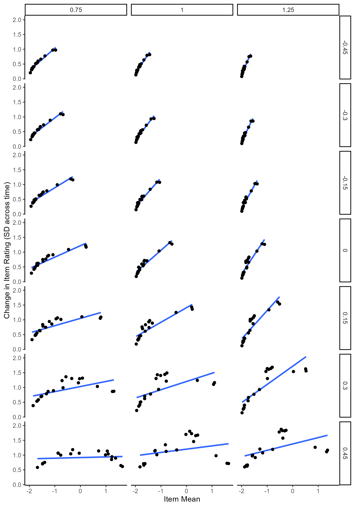

# Formal Model of Rape Myth Acceptance

- [Formal Model](#formal-model)
- [Simulation 1: Variations of Connectivity and
  Motivation](#simulation-1-variations-of-connectivity-and-motivation)
  - [(In)stability Over Time](#instability-over-time)
    - [Sum Scores](#sum-scores)
    - [Item Ratings](#item-ratings)
- [Simulation 2: Changes of Motivation Over
  Time](#simulation-2-changes-of-motivation-over-time)

# Formal Model

This model draws considerable inspiration from Cramer et al (2016,
10.1371/journal.pone.0167490).

Let us assume that a person’s expression of a given myth statement can
take some number of values $k$, where lower values correspond to
disagreement with the myth, higher values correspond to acceptance of
the myth, and the central value (i.e., the median $c$ of the values 0
through $k - 1$) corresponds to a neutral position toward the myth
(e.g., “neither agree nor disagree”). We model acceptance of myth $i$ at
time $t$ as a value $x$ sampled from a binomial distribution, with
$k - 1$ trials with probability $p$ of each trial taking the value 1,
centered such that the median value of 1 through $k$ is 0. For example,
for a 5-point scale, this model creates values from -2 to 2. The
following equation describes these assumptions:

$$
x^t_i = B(k - 1, p^t_i) - c
$$

The probability $p$ for myth $i$ at time $t$ is assumed to result from a
logistic function:

$$
p^t_i = \frac{1}{1 + e^{b_i - A^t_i}}
$$

Here, $b_i$ represents the general tendency for the myth $i$ to be
expressed, and $A$ is the level of activation currently directed toward
this myth. Let us assume that a myth receives activation (or
deactivation) from two sources: (1) the values at the previous time
point $t - 1$ of adjacent myths (i.e., myths connected by an edge in the
network model) weighted by the strength of the connection $W_{ij}$ and
(2) their current motivation to express rape myths. The activation
function is defined as follows:

$$
A^t_i = \sum_{j = 1}^J{W_{ij}x^{t-1}_j + m^t}
$$

Values for $b$ can be estimated from empirical means standardized by the
number of scale points (i.e., $\frac{\bar{X}}{k}$) for rape myth
acceptance using a logit transformation:

$$
b_i = -log(\frac{\frac{\bar{X}}{k}}{1 - \frac{\bar{X}}{k}})
$$

Values for $W$ can be estimated from the empirical edge weights
$r_{ij}$, converted from $r$ to log odds and scaled by $k - c - 1$, such
that the maximum amount of activation and deactivation is conferred by
maximum and minimum values respectively:

$$
W_{ij} = \frac{2r_{ij}}{\sqrt{1 - 2r_{ij}}} \times \frac{\sqrt{3}}{\pi} \times \frac{1}{k - c - 1}
$$

# Simulation 1: Variations of Connectivity and Motivation

I used the data from Łyś et al (2023) to estimate $b$ and $W$ values.

The first simulation based on the proposed model varied the level of
network connectivity by multiplying the weights by 0.75, 1.00, or 1.25
and the level of motivation from -0.45 to 0.45 in increments of .15. For
each combination of connectivity and motivation, I simulated 200 people
over 50 time points. Each person’s starting values were set by sampling
from binomial distributions using the baseline $b$ values.

The results of this simulation are visualized below.

``` r
knitr::include_graphics("figures/rma-model_simulation-01.png")
```


## (In)stability Over Time

In the following analyses, change over time is measured using the
standardized deviation of each person’s sum scores or of item-level
ratings across time.

### Sum Scores

Below, we can see that under most conditions, the model reproduces the
empirically observed positive correlation between change over time and
sum scores. However, under conditions of higher motivation, especially
with high connectivity, the correlation is reduced or eliminated,
apparently due to the appearance of a set of people with persistently
high sum scores.

``` r

```


``` r
knitr::kable(sim_1_sum_cor)
```

| connectivity |     m |        cor |
|-------------:|------:|-----------:|
|         0.75 | -0.45 |  0.0634872 |
|         0.75 | -0.30 |  0.1121944 |
|         0.75 | -0.15 |  0.0803413 |
|         0.75 |  0.00 |  0.1019593 |
|         0.75 |  0.15 |  0.2299470 |
|         0.75 |  0.30 |  0.1712739 |
|         0.75 |  0.45 | -0.1819774 |
|         1.00 | -0.45 |  0.1076654 |
|         1.00 | -0.30 |  0.1202825 |
|         1.00 | -0.15 |  0.1866624 |
|         1.00 |  0.00 |  0.2234356 |
|         1.00 |  0.15 |  0.3564586 |
|         1.00 |  0.30 |  0.0865219 |
|         1.00 |  0.45 |  0.5419489 |
|         1.25 | -0.45 |  0.1572636 |
|         1.25 | -0.30 |  0.1763637 |
|         1.25 | -0.15 |  0.2021913 |
|         1.25 |  0.00 |  0.3740312 |
|         1.25 |  0.15 |  0.1730004 |
|         1.25 |  0.30 | -0.1751639 |
|         1.25 |  0.45 |  0.4427303 |

``` r
mean(sim_1_sum_cor$cor)
```

    [1] 0.169077

### Item Ratings

As we can see below, under most conditions, the model reproduces the
empirically observed positive correlation between the overall item mean
and change of ratings over time. However, at high levels of motivation,
we see that the relationship is more complicated: When items have means
greater than the midpoint, we wee that change over time decreases.

``` r

```


``` r
knitr::kable(sim_1_item_cor)
```

| connectivity |     m |  item_cor |
|-------------:|------:|----------:|
|         0.75 | -0.45 | 0.9771212 |
|         0.75 | -0.30 | 0.9767830 |
|         0.75 | -0.15 | 0.9694283 |
|         0.75 |  0.00 | 0.9332458 |
|         0.75 |  0.15 | 0.8045000 |
|         0.75 |  0.30 | 0.5659445 |
|         0.75 |  0.45 | 0.1322689 |
|         1.00 | -0.45 | 0.9766573 |
|         1.00 | -0.30 | 0.9764550 |
|         1.00 | -0.15 | 0.9728989 |
|         1.00 |  0.00 | 0.9656886 |
|         1.00 |  0.15 | 0.9004078 |
|         1.00 |  0.30 | 0.6137172 |
|         1.00 |  0.45 | 0.2973561 |
|         1.25 | -0.45 | 0.9728134 |
|         1.25 | -0.30 | 0.9744838 |
|         1.25 | -0.15 | 0.9654144 |
|         1.25 |  0.00 | 0.9356859 |
|         1.25 |  0.15 | 0.9071565 |
|         1.25 |  0.30 | 0.8311354 |
|         1.25 |  0.45 | 0.4970448 |

``` r
mean(sim_1_item_cor$item_cor)
```

    [1] 0.816486

# Simulation 2: Changes of Motivation Over Time

In this simulation, I varied the network connectivity at the same levels
as the first simulation and varied motivation across time in three
different ways: (1) rising over time from -0.45 to 0.45, (2) falling
over time from 0.45 to -0.45, and (3) continuously set at 0.30 but
sinking momentarily to -1.00 at $t = 25$.

The results of this simulation are displayed below.

``` r
knitr::include_graphics("figures/rma-model_simulation-02.png")
```


