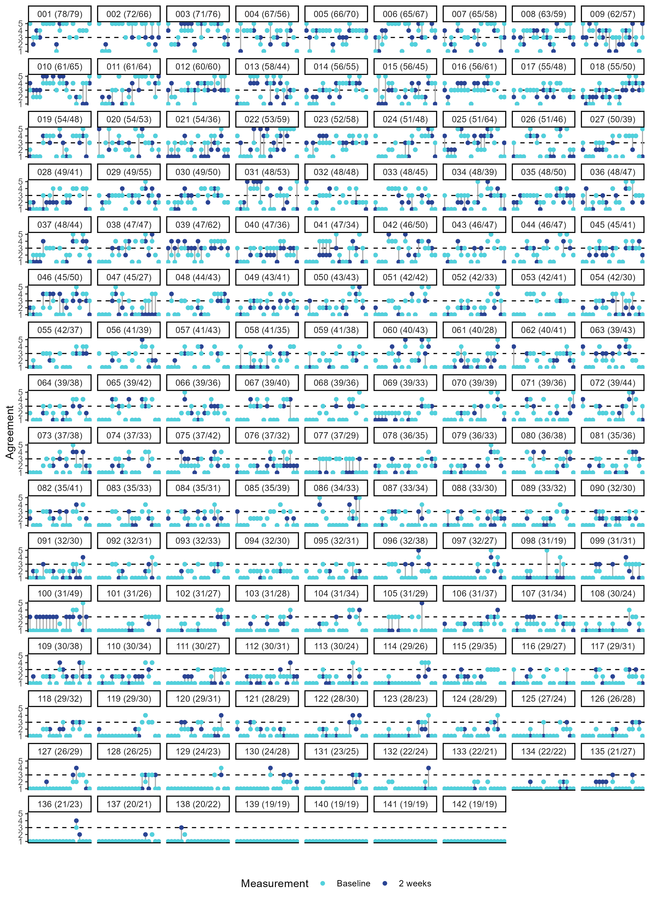
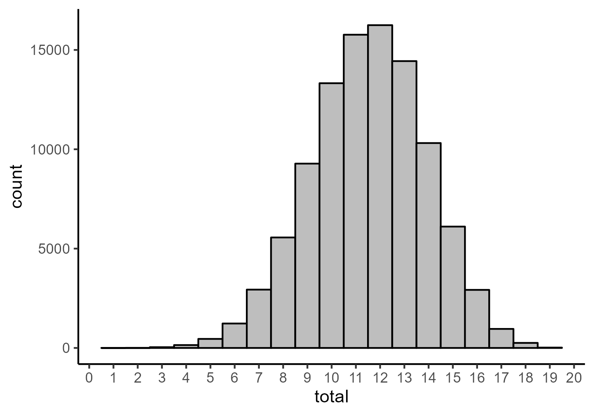
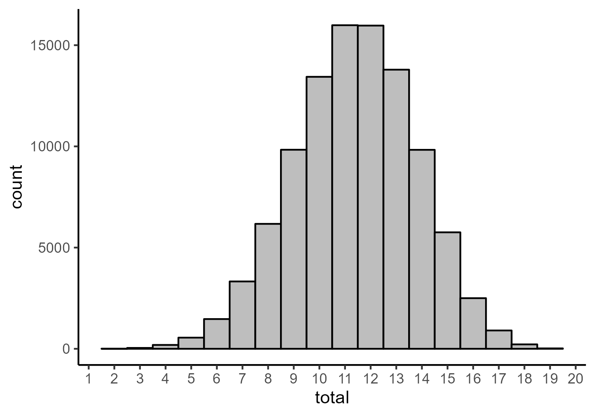
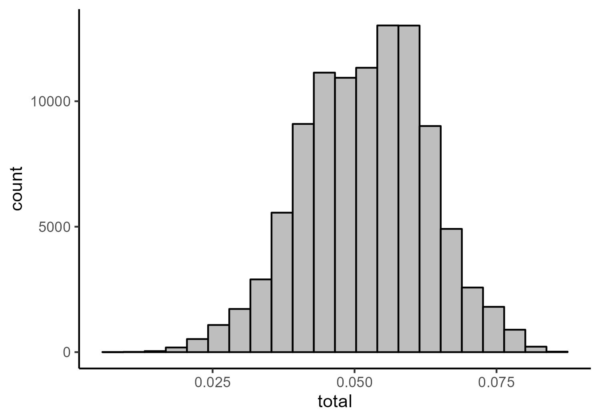

Łyś et al (2023) - Network Re-analysis
================

- <a href="#network-analysis" id="toc-network-analysis">Network
  Analysis</a>
  - <a href="#study-1" id="toc-study-1">Study 1</a>
    - <a href="#fit-indices" id="toc-fit-indices">Fit Indices</a>
    - <a href="#parameter-estimates" id="toc-parameter-estimates">Parameter
      Estimates</a>
    - <a href="#network-figures" id="toc-network-figures">Network Figures</a>
  - <a href="#study-2---post-data" id="toc-study-2---post-data">Study 2 -
    Post-Data</a>
    - <a href="#fit-indices-1" id="toc-fit-indices-1">Fit Indices</a>
    - <a href="#parameter-estimates-1"
      id="toc-parameter-estimates-1">Parameter Estimates</a>
    - <a href="#network-figures-1" id="toc-network-figures-1">Network
      Figures</a>
  - <a href="#study-3" id="toc-study-3">Study 3</a>
    - <a href="#fit-indices-2" id="toc-fit-indices-2">Fit Indices</a>
    - <a href="#parameter-estimates-2"
      id="toc-parameter-estimates-2">Parameter Estimates</a>
    - <a href="#network-figures-2" id="toc-network-figures-2">Network
      Figures</a>
- <a href="#confirmatory-factor-analysis"
  id="toc-confirmatory-factor-analysis">Confirmatory Factor Analysis</a>
  - <a href="#study-2" id="toc-study-2">Study 2</a>
    - <a href="#fit-indices-3" id="toc-fit-indices-3">Fit Indices</a>
    - <a href="#parameter-estimates-3"
      id="toc-parameter-estimates-3">Parameter Estimates</a>
  - <a href="#study-3-1" id="toc-study-3-1">Study 3</a>
    - <a href="#fit-indices-4" id="toc-fit-indices-4">Fit Indices</a>
    - <a href="#parameter-estimates-4"
      id="toc-parameter-estimates-4">Parameter Estimates</a>
- <a href="#change-over-time" id="toc-change-over-time">Change Over
  Time</a>
  - <a href="#sum-score-across-time" id="toc-sum-score-across-time">Sum
    Score Across Time</a>
  - <a href="#item-means-across-time" id="toc-item-means-across-time">Item
    Means Across Time</a>
  - <a href="#item-level-change-for-each-participant"
    id="toc-item-level-change-for-each-participant">Item-Level Change for
    Each Participant</a>
  - <a href="#relationship-between-scores-and-change-over-time"
    id="toc-relationship-between-scores-and-change-over-time">Relationship
    Between Scores and Change Over Time</a>
    - <a href="#sum-score-and-total-absolute-item-level-change"
      id="toc-sum-score-and-total-absolute-item-level-change">Sum Score and
      Total Absolute Item-Level Change</a>
    - <a href="#sum-score-and-sum-score-change"
      id="toc-sum-score-and-sum-score-change">Sum Score and Sum Score
      Change</a>
    - <a href="#item-level-mean-by-mean-absolute-change-in-item-agreement"
      id="toc-item-level-mean-by-mean-absolute-change-in-item-agreement">Item-Level
      Mean by Mean Absolute Change in Item Agreement</a>
    - <a href="#visualization" id="toc-visualization">Visualization</a>
- <a href="#simulated-persuasion-with-study-1-network"
  id="toc-simulated-persuasion-with-study-1-network">Simulated Persuasion
  with Study 1 Network</a>
  - <a href="#centrality-estimates" id="toc-centrality-estimates">Centrality
    Estimates</a>
  - <a
    href="#creating-simulated-data-from-ising-models-based-on-the-estimated-network"
    id="toc-creating-simulated-data-from-ising-models-based-on-the-estimated-network">Creating
    Simulated Data from Ising Models Based on the Estimated Network</a>
    - <a href="#histograms-of-total-scores"
      id="toc-histograms-of-total-scores">Histograms of Total Scores</a>
    - <a href="#proportions-of-agreement-with-strongest-node"
      id="toc-proportions-of-agreement-with-strongest-node">Proportions of
      Agreement with Strongest Node</a>
    - <a
      href="#standardized-mean-difference-in-total-scores-between-baseline-and-persuasion-models"
      id="toc-standardized-mean-difference-in-total-scores-between-baseline-and-persuasion-models">Standardized
      Mean Difference in Total Scores Between Baseline and Persuasion
      Models</a>

# Network Analysis

## Study 1

### Fit Indices

``` r
network_fit_ind_full_1 %>% 
  mutate(across(where(is.numeric), round, 6))
```

                                Measure         Value
    logl                           logl -19150.069006
    unrestricted.logl unrestricted.logl -19083.691459
    baseline.logl         baseline.logl -22438.344650
    nvar                           nvar     19.000000
    nobs                           nobs    209.000000
    npar                           npar     88.000000
    df                               df    121.000000
    objective                 objective     11.003763
    chisq                         chisq    132.755094
    pvalue                       pvalue      0.219167
    baseline.chisq       baseline.chisq   6709.306382
    baseline.df             baseline.df    171.000000
    baseline.pvalue     baseline.pvalue      0.000000
    nfi                             nfi      0.980213
    pnfi                           pnfi      0.693601
    tli                             tli      0.997459
    nnfi                           nnfi      0.997459
    rfi                             rfi      0.972037
    ifi                             ifi      0.998216
    rni                             rni      0.998202
    cfi                             cfi      0.998202
    rmsea                         rmsea      0.010793
    rmsea.ci.lower       rmsea.ci.lower      0.000000
    rmsea.ci.upper       rmsea.ci.upper      0.020868
    rmsea.pvalue           rmsea.pvalue      1.000000
    aic.ll                       aic.ll  38476.138013
    aic.ll2                     aic.ll2  38497.163516
    aic.x                         aic.x   -109.244906
    aic.x2                       aic.x2    308.755094
    bic                             bic  38892.046552
    bic2                           bic2  38612.588593
    ebic.25                     ebic.25  39151.157182
    ebic.5                       ebic.5  39410.267812
    ebic.75                     ebic.75  39617.556316
    ebic1                         ebic1  39928.489073

### Parameter Estimates

``` r
network_pars_full_1 %>% 
  mutate(across(where(is.numeric), round, 3))
```

         var1 var1_id  op  var2 var2_id    est std    se     p se_boot p_boot
    1    rma1       1  ~1  <NA>      NA  1.661  NA 0.038 0.000      NA     NA
    2    rma2       2  ~1  <NA>      NA  1.812  NA 0.039 0.000      NA     NA
    3    rma3       3  ~1  <NA>      NA  1.520  NA 0.032 0.000      NA     NA
    4    rma4       4  ~1  <NA>      NA  2.843  NA 0.047 0.000      NA     NA
    5    rma5       5  ~1  <NA>      NA  3.095  NA 0.042 0.000      NA     NA
    6    rma6       6  ~1  <NA>      NA  2.396  NA 0.039 0.000      NA     NA
    7    rma7       7  ~1  <NA>      NA  3.131  NA 0.045 0.000      NA     NA
    8    rma8       8  ~1  <NA>      NA  1.894  NA 0.040 0.000      NA     NA
    9    rma9       9  ~1  <NA>      NA  1.586  NA 0.035 0.000      NA     NA
    10  rma10      10  ~1  <NA>      NA  1.273  NA 0.022 0.000      NA     NA
    11  rma11      11  ~1  <NA>      NA  1.373  NA 0.029 0.000      NA     NA
    12  rma12      12  ~1  <NA>      NA  1.241  NA 0.024 0.000      NA     NA
    13  rma13      13  ~1  <NA>      NA  2.405  NA 0.036 0.000      NA     NA
    14  rma14      14  ~1  <NA>      NA  2.660  NA 0.040 0.000      NA     NA
    15  rma15      15  ~1  <NA>      NA  2.121  NA 0.037 0.000      NA     NA
    16  rma16      16  ~1  <NA>      NA  1.896  NA 0.036 0.000      NA     NA
    17  rma17      17  ~1  <NA>      NA  1.116  NA 0.016 0.000      NA     NA
    18  rma18      18  ~1  <NA>      NA  2.523  NA 0.038 0.000      NA     NA
    19  rma19      19  ~1  <NA>      NA  1.910  NA 0.041 0.000      NA     NA
    20   rma2       2  --  rma1       1  0.245  NA 0.031 0.000      NA     NA
    21   rma3       3  --  rma1       1  0.278  NA 0.030 0.000      NA     NA
    22   rma4       4  --  rma1       1  0.125  NA 0.031 0.000      NA     NA
    23   rma5       5  --  rma1       1  0.000  NA    NA    NA      NA     NA
    24   rma6       6  --  rma1       1  0.000  NA    NA    NA      NA     NA
    25   rma7       7  --  rma1       1  0.000  NA    NA    NA      NA     NA
    26   rma8       8  --  rma1       1  0.000  NA    NA    NA      NA     NA
    27   rma9       9  --  rma1       1  0.133  NA 0.026 0.000      NA     NA
    28  rma10      10  --  rma1       1  0.000  NA    NA    NA      NA     NA
    29  rma11      11  --  rma1       1  0.187  NA 0.025 0.000      NA     NA
    30  rma12      12  --  rma1       1  0.000  NA    NA    NA      NA     NA
    31  rma13      13  --  rma1       1  0.000  NA    NA    NA      NA     NA
    32  rma14      14  --  rma1       1  0.000  NA    NA    NA      NA     NA
    33  rma15      15  --  rma1       1  0.000  NA    NA    NA      NA     NA
    34  rma16      16  --  rma1       1  0.000  NA    NA    NA      NA     NA
    35  rma17      17  --  rma1       1  0.000  NA    NA    NA      NA     NA
    36  rma18      18  --  rma1       1  0.000  NA    NA    NA      NA     NA
    37  rma19      19  --  rma1       1  0.000  NA    NA    NA      NA     NA
    38   rma3       3  --  rma2       2  0.231  NA 0.031 0.000      NA     NA
    39   rma4       4  --  rma2       2  0.245  NA 0.031 0.000      NA     NA
    40   rma5       5  --  rma2       2  0.000  NA    NA    NA      NA     NA
    41   rma6       6  --  rma2       2  0.000  NA    NA    NA      NA     NA
    42   rma7       7  --  rma2       2  0.000  NA    NA    NA      NA     NA
    43   rma8       8  --  rma2       2  0.000  NA    NA    NA      NA     NA
    44   rma9       9  --  rma2       2  0.000  NA    NA    NA      NA     NA
    45  rma10      10  --  rma2       2  0.000  NA    NA    NA      NA     NA
    46  rma11      11  --  rma2       2  0.000  NA    NA    NA      NA     NA
    47  rma12      12  --  rma2       2  0.092  NA 0.023 0.000      NA     NA
    48  rma13      13  --  rma2       2  0.074  NA 0.026 0.004      NA     NA
    49  rma14      14  --  rma2       2  0.000  NA    NA    NA      NA     NA
    50  rma15      15  --  rma2       2  0.085  NA 0.025 0.001      NA     NA
    51  rma16      16  --  rma2       2  0.000  NA    NA    NA      NA     NA
    52  rma17      17  --  rma2       2  0.000  NA    NA    NA      NA     NA
    53  rma18      18  --  rma2       2  0.000  NA    NA    NA      NA     NA
    54  rma19      19  --  rma2       2  0.000  NA    NA    NA      NA     NA
    55   rma4       4  --  rma3       3  0.155  NA 0.031 0.000      NA     NA
    56   rma5       5  --  rma3       3  0.000  NA    NA    NA      NA     NA
    57   rma6       6  --  rma3       3  0.000  NA    NA    NA      NA     NA
    58   rma7       7  --  rma3       3  0.000  NA    NA    NA      NA     NA
    59   rma8       8  --  rma3       3  0.090  NA 0.026 0.000      NA     NA
    60   rma9       9  --  rma3       3  0.000  NA    NA    NA      NA     NA
    61  rma10      10  --  rma3       3  0.000  NA    NA    NA      NA     NA
    62  rma11      11  --  rma3       3  0.000  NA    NA    NA      NA     NA
    63  rma12      12  --  rma3       3  0.000  NA    NA    NA      NA     NA
    64  rma13      13  --  rma3       3  0.000  NA    NA    NA      NA     NA
    65  rma14      14  --  rma3       3  0.000  NA    NA    NA      NA     NA
    66  rma15      15  --  rma3       3  0.000  NA    NA    NA      NA     NA
    67  rma16      16  --  rma3       3  0.000  NA    NA    NA      NA     NA
    68  rma17      17  --  rma3       3  0.194  NA 0.027 0.000      NA     NA
    69  rma18      18  --  rma3       3  0.000  NA    NA    NA      NA     NA
    70  rma19      19  --  rma3       3  0.106  NA 0.027 0.000      NA     NA
    71   rma5       5  --  rma4       4  0.127  NA 0.023 0.000      NA     NA
    72   rma6       6  --  rma4       4  0.000  NA    NA    NA      NA     NA
    73   rma7       7  --  rma4       4  0.000  NA    NA    NA      NA     NA
    74   rma8       8  --  rma4       4  0.000  NA    NA    NA      NA     NA
    75   rma9       9  --  rma4       4  0.000  NA    NA    NA      NA     NA
    76  rma10      10  --  rma4       4  0.000  NA    NA    NA      NA     NA
    77  rma11      11  --  rma4       4  0.000  NA    NA    NA      NA     NA
    78  rma12      12  --  rma4       4  0.000  NA    NA    NA      NA     NA
    79  rma13      13  --  rma4       4  0.000  NA    NA    NA      NA     NA
    80  rma14      14  --  rma4       4  0.000  NA    NA    NA      NA     NA
    81  rma15      15  --  rma4       4  0.141  NA 0.025 0.000      NA     NA
    82  rma16      16  --  rma4       4  0.000  NA    NA    NA      NA     NA
    83  rma17      17  --  rma4       4 -0.109  NA 0.027 0.000      NA     NA
    84  rma18      18  --  rma4       4  0.147  NA 0.026 0.000      NA     NA
    85  rma19      19  --  rma4       4  0.000  NA    NA    NA      NA     NA
    86   rma6       6  --  rma5       5  0.300  NA 0.030 0.000      NA     NA
    87   rma7       7  --  rma5       5  0.391  NA 0.029 0.000      NA     NA
    88   rma8       8  --  rma5       5  0.000  NA    NA    NA      NA     NA
    89   rma9       9  --  rma5       5  0.000  NA    NA    NA      NA     NA
    90  rma10      10  --  rma5       5  0.000  NA    NA    NA      NA     NA
    91  rma11      11  --  rma5       5  0.000  NA    NA    NA      NA     NA
    92  rma12      12  --  rma5       5  0.000  NA    NA    NA      NA     NA
    93  rma13      13  --  rma5       5  0.000  NA    NA    NA      NA     NA
    94  rma14      14  --  rma5       5  0.000  NA    NA    NA      NA     NA
    95  rma15      15  --  rma5       5  0.000  NA    NA    NA      NA     NA
    96  rma16      16  --  rma5       5  0.000  NA    NA    NA      NA     NA
    97  rma17      17  --  rma5       5  0.000  NA    NA    NA      NA     NA
    98  rma18      18  --  rma5       5  0.000  NA    NA    NA      NA     NA
    99  rma19      19  --  rma5       5  0.000  NA    NA    NA      NA     NA
    100  rma7       7  --  rma6       6  0.123  NA 0.033 0.000      NA     NA
    101  rma8       8  --  rma6       6  0.154  NA 0.030 0.000      NA     NA
    102  rma9       9  --  rma6       6  0.000  NA    NA    NA      NA     NA
    103 rma10      10  --  rma6       6  0.000  NA    NA    NA      NA     NA
    104 rma11      11  --  rma6       6  0.000  NA    NA    NA      NA     NA
    105 rma12      12  --  rma6       6  0.000  NA    NA    NA      NA     NA
    106 rma13      13  --  rma6       6  0.000  NA    NA    NA      NA     NA
    107 rma14      14  --  rma6       6  0.000  NA    NA    NA      NA     NA
    108 rma15      15  --  rma6       6  0.123  NA 0.020 0.000      NA     NA
    109 rma16      16  --  rma6       6  0.000  NA    NA    NA      NA     NA
    110 rma17      17  --  rma6       6  0.000  NA    NA    NA      NA     NA
    111 rma18      18  --  rma6       6  0.000  NA    NA    NA      NA     NA
    112 rma19      19  --  rma6       6  0.000  NA    NA    NA      NA     NA
    113  rma8       8  --  rma7       7  0.089  NA 0.029 0.002      NA     NA
    114  rma9       9  --  rma7       7  0.000  NA    NA    NA      NA     NA
    115 rma10      10  --  rma7       7  0.000  NA    NA    NA      NA     NA
    116 rma11      11  --  rma7       7  0.000  NA    NA    NA      NA     NA
    117 rma12      12  --  rma7       7  0.000  NA    NA    NA      NA     NA
    118 rma13      13  --  rma7       7  0.000  NA    NA    NA      NA     NA
    119 rma14      14  --  rma7       7  0.078  NA 0.022 0.000      NA     NA
    120 rma15      15  --  rma7       7  0.000  NA    NA    NA      NA     NA
    121 rma16      16  --  rma7       7  0.000  NA    NA    NA      NA     NA
    122 rma17      17  --  rma7       7  0.000  NA    NA    NA      NA     NA
    123 rma18      18  --  rma7       7  0.000  NA    NA    NA      NA     NA
    124 rma19      19  --  rma7       7  0.000  NA    NA    NA      NA     NA
    125  rma9       9  --  rma8       8  0.139  NA 0.031 0.000      NA     NA
    126 rma10      10  --  rma8       8  0.178  NA 0.030 0.000      NA     NA
    127 rma11      11  --  rma8       8  0.000  NA    NA    NA      NA     NA
    128 rma12      12  --  rma8       8  0.000  NA    NA    NA      NA     NA
    129 rma13      13  --  rma8       8  0.000  NA    NA    NA      NA     NA
    130 rma14      14  --  rma8       8  0.000  NA    NA    NA      NA     NA
    131 rma15      15  --  rma8       8  0.000  NA    NA    NA      NA     NA
    132 rma16      16  --  rma8       8  0.000  NA    NA    NA      NA     NA
    133 rma17      17  --  rma8       8  0.000  NA    NA    NA      NA     NA
    134 rma18      18  --  rma8       8  0.094  NA 0.025 0.000      NA     NA
    135 rma19      19  --  rma8       8  0.000  NA    NA    NA      NA     NA
    136 rma10      10  --  rma9       9  0.207  NA 0.031 0.000      NA     NA
    137 rma11      11  --  rma9       9  0.000  NA    NA    NA      NA     NA
    138 rma12      12  --  rma9       9  0.093  NA 0.027 0.001      NA     NA
    139 rma13      13  --  rma9       9  0.000  NA    NA    NA      NA     NA
    140 rma14      14  --  rma9       9  0.000  NA    NA    NA      NA     NA
    141 rma15      15  --  rma9       9  0.167  NA 0.022 0.000      NA     NA
    142 rma16      16  --  rma9       9  0.000  NA    NA    NA      NA     NA
    143 rma17      17  --  rma9       9  0.000  NA    NA    NA      NA     NA
    144 rma18      18  --  rma9       9  0.000  NA    NA    NA      NA     NA
    145 rma19      19  --  rma9       9  0.000  NA    NA    NA      NA     NA
    146 rma11      11  -- rma10      10  0.109  NA 0.031 0.000      NA     NA
    147 rma12      12  -- rma10      10  0.197  NA 0.031 0.000      NA     NA
    148 rma13      13  -- rma10      10  0.000  NA    NA    NA      NA     NA
    149 rma14      14  -- rma10      10  0.000  NA    NA    NA      NA     NA
    150 rma15      15  -- rma10      10  0.000  NA    NA    NA      NA     NA
    151 rma16      16  -- rma10      10  0.000  NA    NA    NA      NA     NA
    152 rma17      17  -- rma10      10  0.140  NA 0.031 0.000      NA     NA
    153 rma18      18  -- rma10      10  0.000  NA    NA    NA      NA     NA
    154 rma19      19  -- rma10      10  0.000  NA    NA    NA      NA     NA
    155 rma12      12  -- rma11      11  0.392  NA 0.027 0.000      NA     NA
    156 rma13      13  -- rma11      11  0.000  NA    NA    NA      NA     NA
    157 rma14      14  -- rma11      11  0.000  NA    NA    NA      NA     NA
    158 rma15      15  -- rma11      11  0.000  NA    NA    NA      NA     NA
    159 rma16      16  -- rma11      11  0.000  NA    NA    NA      NA     NA
    160 rma17      17  -- rma11      11  0.000  NA    NA    NA      NA     NA
    161 rma18      18  -- rma11      11  0.000  NA    NA    NA      NA     NA
    162 rma19      19  -- rma11      11  0.153  NA 0.031 0.000      NA     NA
    163 rma13      13  -- rma12      12  0.000  NA    NA    NA      NA     NA
    164 rma14      14  -- rma12      12  0.000  NA    NA    NA      NA     NA
    165 rma15      15  -- rma12      12  0.000  NA    NA    NA      NA     NA
    166 rma16      16  -- rma12      12  0.000  NA    NA    NA      NA     NA
    167 rma17      17  -- rma12      12  0.286  NA 0.027 0.000      NA     NA
    168 rma18      18  -- rma12      12  0.000  NA    NA    NA      NA     NA
    169 rma19      19  -- rma12      12  0.107  NA 0.030 0.000      NA     NA
    170 rma14      14  -- rma13      13  0.206  NA 0.032 0.000      NA     NA
    171 rma15      15  -- rma13      13  0.278  NA 0.029 0.000      NA     NA
    172 rma16      16  -- rma13      13  0.110  NA 0.033 0.001      NA     NA
    173 rma17      17  -- rma13      13  0.000  NA    NA    NA      NA     NA
    174 rma18      18  -- rma13      13  0.162  NA 0.031 0.000      NA     NA
    175 rma19      19  -- rma13      13  0.126  NA 0.028 0.000      NA     NA
    176 rma15      15  -- rma14      14  0.232  NA 0.029 0.000      NA     NA
    177 rma16      16  -- rma14      14  0.113  NA 0.033 0.001      NA     NA
    178 rma17      17  -- rma14      14  0.000  NA    NA    NA      NA     NA
    179 rma18      18  -- rma14      14  0.294  NA 0.030 0.000      NA     NA
    180 rma19      19  -- rma14      14  0.000  NA    NA    NA      NA     NA
    181 rma16      16  -- rma15      15  0.321  NA 0.028 0.000      NA     NA
    182 rma17      17  -- rma15      15  0.000  NA    NA    NA      NA     NA
    183 rma18      18  -- rma15      15  0.000  NA    NA    NA      NA     NA
    184 rma19      19  -- rma15      15  0.000  NA    NA    NA      NA     NA
    185 rma17      17  -- rma16      16  0.117  NA 0.023 0.000      NA     NA
    186 rma18      18  -- rma16      16  0.194  NA 0.030 0.000      NA     NA
    187 rma19      19  -- rma16      16  0.123  NA 0.028 0.000      NA     NA
    188 rma18      18  -- rma17      17  0.000  NA    NA    NA      NA     NA
    189 rma19      19  -- rma17      17  0.000  NA    NA    NA      NA     NA
    190 rma19      19  -- rma18      18  0.000  NA    NA    NA      NA     NA
    191  rma1       1 ~/~  rma1       1  0.789  NA 0.019 0.000      NA     NA
    192  rma2       2 ~/~  rma2       2  0.774  NA 0.019 0.000      NA     NA
    193  rma3       3 ~/~  rma3       3  0.656  NA 0.016 0.000      NA     NA
    194  rma4       4 ~/~  rma4       4  1.001  NA 0.024 0.000      NA     NA
    195  rma5       5 ~/~  rma5       5  0.969  NA 0.024 0.000      NA     NA
    196  rma6       6 ~/~  rma6       6  0.943  NA 0.023 0.000      NA     NA
    197  rma7       7 ~/~  rma7       7  1.094  NA 0.027 0.000      NA     NA
    198  rma8       8 ~/~  rma8       8  1.000  NA 0.024 0.000      NA     NA
    199  rma9       9 ~/~  rma9       9  0.819  NA 0.020 0.000      NA     NA
    200 rma10      10 ~/~ rma10      10  0.503  NA 0.012 0.000      NA     NA
    201 rma11      11 ~/~ rma11      11  0.624  NA 0.015 0.000      NA     NA
    202 rma12      12 ~/~ rma12      12  0.477  NA 0.011 0.000      NA     NA
    203 rma13      13 ~/~ rma13      13  0.697  NA 0.017 0.000      NA     NA
    204 rma14      14 ~/~ rma14      14  0.768  NA 0.019 0.000      NA     NA
    205 rma15      15 ~/~ rma15      15  0.615  NA 0.014 0.000      NA     NA
    206 rma16      16 ~/~ rma16      16  0.688  NA 0.017 0.000      NA     NA
    207 rma17      17 ~/~ rma17      17  0.382  NA 0.009 0.000      NA     NA
    208 rma18      18 ~/~ rma18      18  0.788  NA 0.019 0.000      NA     NA
    209 rma19      19 ~/~ rma19      19  1.007  NA 0.024 0.000      NA     NA
        matrix row col par      group group_id fixed    mi   pmi    epc mi_free
    1       mu   1   1   1 fullsample        1 FALSE 0.000 1.000  0.000      NA
    2       mu   2   1   2 fullsample        1 FALSE 0.000 1.000  0.000      NA
    3       mu   3   1   3 fullsample        1 FALSE 0.000 1.000  0.000      NA
    4       mu   4   1   4 fullsample        1 FALSE 0.000 1.000  0.000      NA
    5       mu   5   1   5 fullsample        1 FALSE 0.000 1.000  0.000      NA
    6       mu   6   1   6 fullsample        1 FALSE 0.000 1.000  0.000      NA
    7       mu   7   1   7 fullsample        1 FALSE 0.000 1.000  0.000      NA
    8       mu   8   1   8 fullsample        1 FALSE 0.000 1.000  0.000      NA
    9       mu   9   1   9 fullsample        1 FALSE 0.000 1.000  0.000      NA
    10      mu  10   1  10 fullsample        1 FALSE 0.000 1.000  0.000      NA
    11      mu  11   1  11 fullsample        1 FALSE 0.000 1.000  0.000      NA
    12      mu  12   1  12 fullsample        1 FALSE 0.000 1.000  0.000      NA
    13      mu  13   1  13 fullsample        1 FALSE 0.000 1.000  0.000      NA
    14      mu  14   1  14 fullsample        1 FALSE 0.000 1.000  0.000      NA
    15      mu  15   1  15 fullsample        1 FALSE 0.000 1.000  0.000      NA
    16      mu  16   1  16 fullsample        1 FALSE 0.000 1.000  0.000      NA
    17      mu  17   1  17 fullsample        1 FALSE 0.000 1.000  0.000      NA
    18      mu  18   1  18 fullsample        1 FALSE 0.000 1.000  0.000      NA
    19      mu  19   1  19 fullsample        1 FALSE 0.000 1.000  0.000      NA
    20   omega   2   1  20 fullsample        1 FALSE 0.000 1.000  0.000      NA
    21   omega   3   1  21 fullsample        1 FALSE 0.000 1.000  0.000      NA
    22   omega   4   1  22 fullsample        1 FALSE 0.000 1.000  0.000      NA
    23   omega   5   1   0 fullsample        1  TRUE 0.104 0.747 -0.008      NA
    24   omega   6   1   0 fullsample        1  TRUE 0.317 0.573  0.014      NA
    25   omega   7   1   0 fullsample        1  TRUE 0.516 0.473 -0.017      NA
    26   omega   8   1   0 fullsample        1  TRUE 0.940 0.332  0.029      NA
    27   omega   9   1  23 fullsample        1 FALSE 0.000 1.000  0.000      NA
    28   omega  10   1   0 fullsample        1  TRUE 2.959 0.085 -0.047      NA
    29   omega  11   1  24 fullsample        1 FALSE 0.000 1.000  0.000      NA
    30   omega  12   1   0 fullsample        1  TRUE 0.053 0.818 -0.007      NA
    31   omega  13   1   0 fullsample        1  TRUE 2.592 0.107  0.039      NA
    32   omega  14   1   0 fullsample        1  TRUE 1.518 0.218  0.027      NA
    33   omega  15   1   0 fullsample        1  TRUE 0.010 0.922 -0.002      NA
    34   omega  16   1   0 fullsample        1  TRUE 2.008 0.156  0.032      NA
    35   omega  17   1   0 fullsample        1  TRUE 0.304 0.582  0.016      NA
    36   omega  18   1   0 fullsample        1  TRUE 2.456 0.117  0.038      NA
    37   omega  19   1   0 fullsample        1  TRUE 3.573 0.059  0.058      NA
    38   omega   3   2  25 fullsample        1 FALSE 0.000 1.000  0.000      NA
    39   omega   4   2  26 fullsample        1 FALSE 0.000 1.000  0.000      NA
    40   omega   5   2   0 fullsample        1  TRUE 0.006 0.939 -0.002      NA
    41   omega   6   2   0 fullsample        1  TRUE 0.776 0.378  0.022      NA
    42   omega   7   2   0 fullsample        1  TRUE 0.076 0.783  0.007      NA
    43   omega   8   2   0 fullsample        1  TRUE 1.148 0.284  0.031      NA
    44   omega   9   2   0 fullsample        1  TRUE 2.074 0.150  0.043      NA
    45   omega  10   2   0 fullsample        1  TRUE 1.468 0.226 -0.031      NA
    46   omega  11   2   0 fullsample        1  TRUE 1.137 0.286  0.031      NA
    47   omega  12   2  27 fullsample        1 FALSE 0.000 1.000  0.000      NA
    48   omega  13   2  28 fullsample        1 FALSE 0.000 1.000  0.000      NA
    49   omega  14   2   0 fullsample        1  TRUE 2.290 0.130  0.040      NA
    50   omega  15   2  29 fullsample        1 FALSE 0.000 1.000  0.000      NA
    51   omega  16   2   0 fullsample        1  TRUE 0.822 0.365  0.024      NA
    52   omega  17   2   0 fullsample        1  TRUE 1.013 0.314 -0.032      NA
    53   omega  18   2   0 fullsample        1  TRUE 0.424 0.515  0.018      NA
    54   omega  19   2   0 fullsample        1  TRUE 2.323 0.127  0.046      NA
    55   omega   4   3  30 fullsample        1 FALSE 0.000 1.000  0.000      NA
    56   omega   5   3   0 fullsample        1  TRUE 0.204 0.651  0.011      NA
    57   omega   6   3   0 fullsample        1  TRUE 0.500 0.480  0.018      NA
    58   omega   7   3   0 fullsample        1  TRUE 0.696 0.404 -0.020      NA
    59   omega   8   3  31 fullsample        1 FALSE 0.000 1.000  0.000      NA
    60   omega   9   3   0 fullsample        1  TRUE 3.830 0.050  0.058      NA
    61   omega  10   3   0 fullsample        1  TRUE 0.020 0.887 -0.004      NA
    62   omega  11   3   0 fullsample        1  TRUE 0.002 0.964  0.001      NA
    63   omega  12   3   0 fullsample        1  TRUE 1.031 0.310  0.028      NA
    64   omega  13   3   0 fullsample        1  TRUE 0.024 0.876 -0.004      NA
    65   omega  14   3   0 fullsample        1  TRUE 0.300 0.584  0.012      NA
    66   omega  15   3   0 fullsample        1  TRUE 0.648 0.421  0.019      NA
    67   omega  16   3   0 fullsample        1  TRUE 2.935 0.087  0.041      NA
    68   omega  17   3  32 fullsample        1 FALSE 0.000 1.000  0.000      NA
    69   omega  18   3   0 fullsample        1  TRUE 0.265 0.607  0.013      NA
    70   omega  19   3  33 fullsample        1 FALSE 0.000 1.000  0.000      NA
    71   omega   5   4  34 fullsample        1 FALSE 0.000 1.000  0.000      NA
    72   omega   6   4   0 fullsample        1  TRUE 5.723 0.017  0.069      NA
    73   omega   7   4   0 fullsample        1  TRUE 2.233 0.135  0.042      NA
    74   omega   8   4   0 fullsample        1  TRUE 1.506 0.220  0.036      NA
    75   omega   9   4   0 fullsample        1  TRUE 0.701 0.402  0.025      NA
    76   omega  10   4   0 fullsample        1  TRUE 1.713 0.191 -0.033      NA
    77   omega  11   4   0 fullsample        1  TRUE 0.024 0.877  0.004      NA
    78   omega  12   4   0 fullsample        1  TRUE 0.239 0.625 -0.013      NA
    79   omega  13   4   0 fullsample        1  TRUE 0.122 0.726 -0.011      NA
    80   omega  14   4   0 fullsample        1  TRUE 3.986 0.046  0.058      NA
    81   omega  15   4  35 fullsample        1 FALSE 0.000 1.000  0.000      NA
    82   omega  16   4   0 fullsample        1  TRUE 0.051 0.821  0.007      NA
    83   omega  17   4  36 fullsample        1 FALSE 0.000 1.000  0.000      NA
    84   omega  18   4  37 fullsample        1 FALSE 0.000 1.000  0.000      NA
    85   omega  19   4   0 fullsample        1  TRUE 1.302 0.254  0.033      NA
    86   omega   6   5  38 fullsample        1 FALSE 0.000 1.000  0.000      NA
    87   omega   7   5  39 fullsample        1 FALSE 0.000 1.000  0.000      NA
    88   omega   8   5   0 fullsample        1  TRUE 0.724 0.395  0.027      NA
    89   omega   9   5   0 fullsample        1  TRUE 0.093 0.761  0.008      NA
    90   omega  10   5   0 fullsample        1  TRUE 0.884 0.347 -0.023      NA
    91   omega  11   5   0 fullsample        1  TRUE 0.090 0.764 -0.007      NA
    92   omega  12   5   0 fullsample        1  TRUE 0.783 0.376 -0.018      NA
    93   omega  13   5   0 fullsample        1  TRUE 0.003 0.954 -0.001      NA
    94   omega  14   5   0 fullsample        1  TRUE 0.827 0.363  0.022      NA
    95   omega  15   5   0 fullsample        1  TRUE 0.003 0.954 -0.001      NA
    96   omega  16   5   0 fullsample        1  TRUE 0.000 0.984  0.000      NA
    97   omega  17   5   0 fullsample        1  TRUE 0.065 0.800 -0.006      NA
    98   omega  18   5   0 fullsample        1  TRUE 0.048 0.827  0.005      NA
    99   omega  19   5   0 fullsample        1  TRUE 0.046 0.830  0.005      NA
    100  omega   7   6  40 fullsample        1 FALSE 0.000 1.000  0.000      NA
    101  omega   8   6  41 fullsample        1 FALSE 0.000 1.000  0.000      NA
    102  omega   9   6   0 fullsample        1  TRUE 0.171 0.679 -0.012      NA
    103  omega  10   6   0 fullsample        1  TRUE 0.003 0.954  0.002      NA
    104  omega  11   6   0 fullsample        1  TRUE 0.000 0.991  0.000      NA
    105  omega  12   6   0 fullsample        1  TRUE 0.463 0.496  0.015      NA
    106  omega  13   6   0 fullsample        1  TRUE 0.135 0.713  0.010      NA
    107  omega  14   6   0 fullsample        1  TRUE 0.988 0.320  0.028      NA
    108  omega  15   6  42 fullsample        1 FALSE 0.000 1.000  0.000      NA
    109  omega  16   6   0 fullsample        1  TRUE 0.056 0.813  0.007      NA
    110  omega  17   6   0 fullsample        1  TRUE 0.238 0.625  0.013      NA
    111  omega  18   6   0 fullsample        1  TRUE 0.568 0.451  0.021      NA
    112  omega  19   6   0 fullsample        1  TRUE 0.105 0.746  0.009      NA
    113  omega   8   7  43 fullsample        1 FALSE 0.000 1.000  0.000      NA
    114  omega   9   7   0 fullsample        1  TRUE 0.156 0.692 -0.011      NA
    115  omega  10   7   0 fullsample        1  TRUE 0.247 0.619 -0.013      NA
    116  omega  11   7   0 fullsample        1  TRUE 1.553 0.213 -0.029      NA
    117  omega  12   7   0 fullsample        1  TRUE 0.116 0.733 -0.007      NA
    118  omega  13   7   0 fullsample        1  TRUE 2.168 0.141  0.038      NA
    119  omega  14   7  44 fullsample        1 FALSE 0.000 1.000  0.000      NA
    120  omega  15   7   0 fullsample        1  TRUE 0.290 0.590  0.013      NA
    121  omega  16   7   0 fullsample        1  TRUE 0.014 0.905  0.003      NA
    122  omega  17   7   0 fullsample        1  TRUE 0.004 0.950  0.002      NA
    123  omega  18   7   0 fullsample        1  TRUE 2.497 0.114  0.044      NA
    124  omega  19   7   0 fullsample        1  TRUE 0.271 0.602  0.014      NA
    125  omega   9   8  45 fullsample        1 FALSE 0.000 1.000  0.000      NA
    126  omega  10   8  46 fullsample        1 FALSE 0.000 1.000  0.000      NA
    127  omega  11   8   0 fullsample        1  TRUE 0.009 0.924  0.003      NA
    128  omega  12   8   0 fullsample        1  TRUE 0.055 0.815 -0.006      NA
    129  omega  13   8   0 fullsample        1  TRUE 0.034 0.854  0.005      NA
    130  omega  14   8   0 fullsample        1  TRUE 0.147 0.701  0.011      NA
    131  omega  15   8   0 fullsample        1  TRUE 3.181 0.074  0.046      NA
    132  omega  16   8   0 fullsample        1  TRUE 1.720 0.190  0.036      NA
    133  omega  17   8   0 fullsample        1  TRUE 0.168 0.681 -0.013      NA
    134  omega  18   8  47 fullsample        1 FALSE 0.000 1.000  0.000      NA
    135  omega  19   8   0 fullsample        1  TRUE 0.340 0.560  0.018      NA
    136  omega  10   9  48 fullsample        1 FALSE 0.000 1.000  0.000      NA
    137  omega  11   9   0 fullsample        1  TRUE 0.695 0.405  0.027      NA
    138  omega  12   9  49 fullsample        1 FALSE 0.000 1.000  0.000      NA
    139  omega  13   9   0 fullsample        1  TRUE 5.181 0.023  0.066      NA
    140  omega  14   9   0 fullsample        1  TRUE 3.117 0.078  0.049      NA
    141  omega  15   9  50 fullsample        1 FALSE 0.000 1.000  0.000      NA
    142  omega  16   9   0 fullsample        1  TRUE 6.279 0.012  0.073      NA
    143  omega  17   9   0 fullsample        1  TRUE 0.842 0.359  0.029      NA
    144  omega  18   9   0 fullsample        1  TRUE 3.137 0.077  0.049      NA
    145  omega  19   9   0 fullsample        1  TRUE 2.756 0.097  0.051      NA
    146  omega  11  10  51 fullsample        1 FALSE 0.000 1.000  0.000      NA
    147  omega  12  10  52 fullsample        1 FALSE 0.000 1.000  0.000      NA
    148  omega  13  10   0 fullsample        1  TRUE 0.357 0.550 -0.013      NA
    149  omega  14  10   0 fullsample        1  TRUE 2.344 0.126  0.034      NA
    150  omega  15  10   0 fullsample        1  TRUE 0.688 0.407  0.018      NA
    151  omega  16  10   0 fullsample        1  TRUE 1.442 0.230  0.028      NA
    152  omega  17  10  53 fullsample        1 FALSE 0.000 1.000  0.000      NA
    153  omega  18  10   0 fullsample        1  TRUE 0.001 0.978 -0.001      NA
    154  omega  19  10   0 fullsample        1  TRUE 2.861 0.091  0.052      NA
    155  omega  12  11  54 fullsample        1 FALSE 0.000 1.000  0.000      NA
    156  omega  13  11   0 fullsample        1  TRUE 2.332 0.127  0.034      NA
    157  omega  14  11   0 fullsample        1  TRUE 1.190 0.275  0.023      NA
    158  omega  15  11   0 fullsample        1  TRUE 0.007 0.932  0.002      NA
    159  omega  16  11   0 fullsample        1  TRUE 6.453 0.011  0.057      NA
    160  omega  17  11   0 fullsample        1  TRUE 1.271 0.260  0.036      NA
    161  omega  18  11   0 fullsample        1  TRUE 1.649 0.199  0.028      NA
    162  omega  19  11  55 fullsample        1 FALSE 0.000 1.000  0.000      NA
    163  omega  13  12   0 fullsample        1  TRUE 0.037 0.847  0.004      NA
    164  omega  14  12   0 fullsample        1  TRUE 0.059 0.809 -0.005      NA
    165  omega  15  12   0 fullsample        1  TRUE 0.015 0.903  0.002      NA
    166  omega  16  12   0 fullsample        1  TRUE 0.734 0.392  0.020      NA
    167  omega  17  12  56 fullsample        1 FALSE 0.000 1.000  0.000      NA
    168  omega  18  12   0 fullsample        1  TRUE 0.778 0.378 -0.019      NA
    169  omega  19  12  57 fullsample        1 FALSE 0.000 1.000  0.000      NA
    170  omega  14  13  58 fullsample        1 FALSE 0.000 1.000  0.000      NA
    171  omega  15  13  59 fullsample        1 FALSE 0.000 1.000  0.000      NA
    172  omega  16  13  60 fullsample        1 FALSE 0.000 1.000  0.000      NA
    173  omega  17  13   0 fullsample        1  TRUE 2.123 0.145 -0.038      NA
    174  omega  18  13  61 fullsample        1 FALSE 0.000 1.000  0.000      NA
    175  omega  19  13  62 fullsample        1 FALSE 0.000 1.000  0.000      NA
    176  omega  15  14  63 fullsample        1 FALSE 0.000 1.000  0.000      NA
    177  omega  16  14  64 fullsample        1 FALSE 0.000 1.000  0.000      NA
    178  omega  17  14   0 fullsample        1  TRUE 6.288 0.012 -0.064      NA
    179  omega  18  14  65 fullsample        1 FALSE 0.000 1.000  0.000      NA
    180  omega  19  14   0 fullsample        1  TRUE 0.568 0.451  0.022      NA
    181  omega  16  15  66 fullsample        1 FALSE 0.000 1.000  0.000      NA
    182  omega  17  15   0 fullsample        1  TRUE 0.326 0.568 -0.015      NA
    183  omega  18  15   0 fullsample        1  TRUE 4.324 0.038  0.068      NA
    184  omega  19  15   0 fullsample        1  TRUE 4.136 0.042  0.061      NA
    185  omega  17  16  67 fullsample        1 FALSE 0.000 1.000  0.000      NA
    186  omega  18  16  68 fullsample        1 FALSE 0.000 1.000  0.000      NA
    187  omega  19  16  69 fullsample        1 FALSE 0.000 1.000  0.000      NA
    188  omega  18  17   0 fullsample        1  TRUE 4.438 0.035 -0.057      NA
    189  omega  19  17   0 fullsample        1  TRUE 0.368 0.544  0.020      NA
    190  omega  19  18   0 fullsample        1  TRUE 2.811 0.094  0.051      NA
    191  delta   1   1  70 fullsample        1 FALSE 0.000 1.000  0.000      NA
    192  delta   2   2  71 fullsample        1 FALSE 0.000 1.000  0.000      NA
    193  delta   3   3  72 fullsample        1 FALSE 0.000 1.000  0.000      NA
    194  delta   4   4  73 fullsample        1 FALSE 0.000 1.000  0.000      NA
    195  delta   5   5  74 fullsample        1 FALSE 0.000 1.000  0.000      NA
    196  delta   6   6  75 fullsample        1 FALSE 0.000 1.000  0.000      NA
    197  delta   7   7  76 fullsample        1 FALSE 0.000 1.000  0.000      NA
    198  delta   8   8  77 fullsample        1 FALSE 0.000 1.000  0.000      NA
    199  delta   9   9  78 fullsample        1 FALSE 0.000 1.000  0.000      NA
    200  delta  10  10  79 fullsample        1 FALSE 0.000 1.000  0.000      NA
    201  delta  11  11  80 fullsample        1 FALSE 0.000 1.000  0.000      NA
    202  delta  12  12  81 fullsample        1 FALSE 0.000 1.000  0.000      NA
    203  delta  13  13  82 fullsample        1 FALSE 0.000 1.000  0.000      NA
    204  delta  14  14  83 fullsample        1 FALSE 0.000 1.000  0.000      NA
    205  delta  15  15  84 fullsample        1 FALSE 0.000 1.000  0.000      NA
    206  delta  16  16  85 fullsample        1 FALSE 0.000 1.000  0.000      NA
    207  delta  17  17  86 fullsample        1 FALSE 0.000 1.000  0.000      NA
    208  delta  18  18  87 fullsample        1 FALSE 0.000 1.000  0.000      NA
    209  delta  19  19  88 fullsample        1 FALSE 0.000 1.000  0.000      NA
        pmi_free epc_free mi_equal pmi_equal epc_equal minimum maximum identified
    1         NA       NA       NA        NA        NA    -Inf     Inf      FALSE
    2         NA       NA       NA        NA        NA    -Inf     Inf      FALSE
    3         NA       NA       NA        NA        NA    -Inf     Inf      FALSE
    4         NA       NA       NA        NA        NA    -Inf     Inf      FALSE
    5         NA       NA       NA        NA        NA    -Inf     Inf      FALSE
    6         NA       NA       NA        NA        NA    -Inf     Inf      FALSE
    7         NA       NA       NA        NA        NA    -Inf     Inf      FALSE
    8         NA       NA       NA        NA        NA    -Inf     Inf      FALSE
    9         NA       NA       NA        NA        NA    -Inf     Inf      FALSE
    10        NA       NA       NA        NA        NA    -Inf     Inf      FALSE
    11        NA       NA       NA        NA        NA    -Inf     Inf      FALSE
    12        NA       NA       NA        NA        NA    -Inf     Inf      FALSE
    13        NA       NA       NA        NA        NA    -Inf     Inf      FALSE
    14        NA       NA       NA        NA        NA    -Inf     Inf      FALSE
    15        NA       NA       NA        NA        NA    -Inf     Inf      FALSE
    16        NA       NA       NA        NA        NA    -Inf     Inf      FALSE
    17        NA       NA       NA        NA        NA    -Inf     Inf      FALSE
    18        NA       NA       NA        NA        NA    -Inf     Inf      FALSE
    19        NA       NA       NA        NA        NA    -Inf     Inf      FALSE
    20        NA       NA       NA        NA        NA      -1       1      FALSE
    21        NA       NA       NA        NA        NA      -1       1      FALSE
    22        NA       NA       NA        NA        NA      -1       1      FALSE
    23        NA       NA       NA        NA        NA      -1       1      FALSE
    24        NA       NA       NA        NA        NA      -1       1      FALSE
    25        NA       NA       NA        NA        NA      -1       1      FALSE
    26        NA       NA       NA        NA        NA      -1       1      FALSE
    27        NA       NA       NA        NA        NA      -1       1      FALSE
    28        NA       NA       NA        NA        NA      -1       1      FALSE
    29        NA       NA       NA        NA        NA      -1       1      FALSE
    30        NA       NA       NA        NA        NA      -1       1      FALSE
    31        NA       NA       NA        NA        NA      -1       1      FALSE
    32        NA       NA       NA        NA        NA      -1       1      FALSE
    33        NA       NA       NA        NA        NA      -1       1      FALSE
    34        NA       NA       NA        NA        NA      -1       1      FALSE
    35        NA       NA       NA        NA        NA      -1       1      FALSE
    36        NA       NA       NA        NA        NA      -1       1      FALSE
    37        NA       NA       NA        NA        NA      -1       1      FALSE
    38        NA       NA       NA        NA        NA      -1       1      FALSE
    39        NA       NA       NA        NA        NA      -1       1      FALSE
    40        NA       NA       NA        NA        NA      -1       1      FALSE
    41        NA       NA       NA        NA        NA      -1       1      FALSE
    42        NA       NA       NA        NA        NA      -1       1      FALSE
    43        NA       NA       NA        NA        NA      -1       1      FALSE
    44        NA       NA       NA        NA        NA      -1       1      FALSE
    45        NA       NA       NA        NA        NA      -1       1      FALSE
    46        NA       NA       NA        NA        NA      -1       1      FALSE
    47        NA       NA       NA        NA        NA      -1       1      FALSE
    48        NA       NA       NA        NA        NA      -1       1      FALSE
    49        NA       NA       NA        NA        NA      -1       1      FALSE
    50        NA       NA       NA        NA        NA      -1       1      FALSE
    51        NA       NA       NA        NA        NA      -1       1      FALSE
    52        NA       NA       NA        NA        NA      -1       1      FALSE
    53        NA       NA       NA        NA        NA      -1       1      FALSE
    54        NA       NA       NA        NA        NA      -1       1      FALSE
    55        NA       NA       NA        NA        NA      -1       1      FALSE
    56        NA       NA       NA        NA        NA      -1       1      FALSE
    57        NA       NA       NA        NA        NA      -1       1      FALSE
    58        NA       NA       NA        NA        NA      -1       1      FALSE
    59        NA       NA       NA        NA        NA      -1       1      FALSE
    60        NA       NA       NA        NA        NA      -1       1      FALSE
    61        NA       NA       NA        NA        NA      -1       1      FALSE
    62        NA       NA       NA        NA        NA      -1       1      FALSE
    63        NA       NA       NA        NA        NA      -1       1      FALSE
    64        NA       NA       NA        NA        NA      -1       1      FALSE
    65        NA       NA       NA        NA        NA      -1       1      FALSE
    66        NA       NA       NA        NA        NA      -1       1      FALSE
    67        NA       NA       NA        NA        NA      -1       1      FALSE
    68        NA       NA       NA        NA        NA      -1       1      FALSE
    69        NA       NA       NA        NA        NA      -1       1      FALSE
    70        NA       NA       NA        NA        NA      -1       1      FALSE
    71        NA       NA       NA        NA        NA      -1       1      FALSE
    72        NA       NA       NA        NA        NA      -1       1      FALSE
    73        NA       NA       NA        NA        NA      -1       1      FALSE
    74        NA       NA       NA        NA        NA      -1       1      FALSE
    75        NA       NA       NA        NA        NA      -1       1      FALSE
    76        NA       NA       NA        NA        NA      -1       1      FALSE
    77        NA       NA       NA        NA        NA      -1       1      FALSE
    78        NA       NA       NA        NA        NA      -1       1      FALSE
    79        NA       NA       NA        NA        NA      -1       1      FALSE
    80        NA       NA       NA        NA        NA      -1       1      FALSE
    81        NA       NA       NA        NA        NA      -1       1      FALSE
    82        NA       NA       NA        NA        NA      -1       1      FALSE
    83        NA       NA       NA        NA        NA      -1       1      FALSE
    84        NA       NA       NA        NA        NA      -1       1      FALSE
    85        NA       NA       NA        NA        NA      -1       1      FALSE
    86        NA       NA       NA        NA        NA      -1       1      FALSE
    87        NA       NA       NA        NA        NA      -1       1      FALSE
    88        NA       NA       NA        NA        NA      -1       1      FALSE
    89        NA       NA       NA        NA        NA      -1       1      FALSE
    90        NA       NA       NA        NA        NA      -1       1      FALSE
    91        NA       NA       NA        NA        NA      -1       1      FALSE
    92        NA       NA       NA        NA        NA      -1       1      FALSE
    93        NA       NA       NA        NA        NA      -1       1      FALSE
    94        NA       NA       NA        NA        NA      -1       1      FALSE
    95        NA       NA       NA        NA        NA      -1       1      FALSE
    96        NA       NA       NA        NA        NA      -1       1      FALSE
    97        NA       NA       NA        NA        NA      -1       1      FALSE
    98        NA       NA       NA        NA        NA      -1       1      FALSE
    99        NA       NA       NA        NA        NA      -1       1      FALSE
    100       NA       NA       NA        NA        NA      -1       1      FALSE
    101       NA       NA       NA        NA        NA      -1       1      FALSE
    102       NA       NA       NA        NA        NA      -1       1      FALSE
    103       NA       NA       NA        NA        NA      -1       1      FALSE
    104       NA       NA       NA        NA        NA      -1       1      FALSE
    105       NA       NA       NA        NA        NA      -1       1      FALSE
    106       NA       NA       NA        NA        NA      -1       1      FALSE
    107       NA       NA       NA        NA        NA      -1       1      FALSE
    108       NA       NA       NA        NA        NA      -1       1      FALSE
    109       NA       NA       NA        NA        NA      -1       1      FALSE
    110       NA       NA       NA        NA        NA      -1       1      FALSE
    111       NA       NA       NA        NA        NA      -1       1      FALSE
    112       NA       NA       NA        NA        NA      -1       1      FALSE
    113       NA       NA       NA        NA        NA      -1       1      FALSE
    114       NA       NA       NA        NA        NA      -1       1      FALSE
    115       NA       NA       NA        NA        NA      -1       1      FALSE
    116       NA       NA       NA        NA        NA      -1       1      FALSE
    117       NA       NA       NA        NA        NA      -1       1      FALSE
    118       NA       NA       NA        NA        NA      -1       1      FALSE
    119       NA       NA       NA        NA        NA      -1       1      FALSE
    120       NA       NA       NA        NA        NA      -1       1      FALSE
    121       NA       NA       NA        NA        NA      -1       1      FALSE
    122       NA       NA       NA        NA        NA      -1       1      FALSE
    123       NA       NA       NA        NA        NA      -1       1      FALSE
    124       NA       NA       NA        NA        NA      -1       1      FALSE
    125       NA       NA       NA        NA        NA      -1       1      FALSE
    126       NA       NA       NA        NA        NA      -1       1      FALSE
    127       NA       NA       NA        NA        NA      -1       1      FALSE
    128       NA       NA       NA        NA        NA      -1       1      FALSE
    129       NA       NA       NA        NA        NA      -1       1      FALSE
    130       NA       NA       NA        NA        NA      -1       1      FALSE
    131       NA       NA       NA        NA        NA      -1       1      FALSE
    132       NA       NA       NA        NA        NA      -1       1      FALSE
    133       NA       NA       NA        NA        NA      -1       1      FALSE
    134       NA       NA       NA        NA        NA      -1       1      FALSE
    135       NA       NA       NA        NA        NA      -1       1      FALSE
    136       NA       NA       NA        NA        NA      -1       1      FALSE
    137       NA       NA       NA        NA        NA      -1       1      FALSE
    138       NA       NA       NA        NA        NA      -1       1      FALSE
    139       NA       NA       NA        NA        NA      -1       1      FALSE
    140       NA       NA       NA        NA        NA      -1       1      FALSE
    141       NA       NA       NA        NA        NA      -1       1      FALSE
    142       NA       NA       NA        NA        NA      -1       1      FALSE
    143       NA       NA       NA        NA        NA      -1       1      FALSE
    144       NA       NA       NA        NA        NA      -1       1      FALSE
    145       NA       NA       NA        NA        NA      -1       1      FALSE
    146       NA       NA       NA        NA        NA      -1       1      FALSE
    147       NA       NA       NA        NA        NA      -1       1      FALSE
    148       NA       NA       NA        NA        NA      -1       1      FALSE
    149       NA       NA       NA        NA        NA      -1       1      FALSE
    150       NA       NA       NA        NA        NA      -1       1      FALSE
    151       NA       NA       NA        NA        NA      -1       1      FALSE
    152       NA       NA       NA        NA        NA      -1       1      FALSE
    153       NA       NA       NA        NA        NA      -1       1      FALSE
    154       NA       NA       NA        NA        NA      -1       1      FALSE
    155       NA       NA       NA        NA        NA      -1       1      FALSE
    156       NA       NA       NA        NA        NA      -1       1      FALSE
    157       NA       NA       NA        NA        NA      -1       1      FALSE
    158       NA       NA       NA        NA        NA      -1       1      FALSE
    159       NA       NA       NA        NA        NA      -1       1      FALSE
    160       NA       NA       NA        NA        NA      -1       1      FALSE
    161       NA       NA       NA        NA        NA      -1       1      FALSE
    162       NA       NA       NA        NA        NA      -1       1      FALSE
    163       NA       NA       NA        NA        NA      -1       1      FALSE
    164       NA       NA       NA        NA        NA      -1       1      FALSE
    165       NA       NA       NA        NA        NA      -1       1      FALSE
    166       NA       NA       NA        NA        NA      -1       1      FALSE
    167       NA       NA       NA        NA        NA      -1       1      FALSE
    168       NA       NA       NA        NA        NA      -1       1      FALSE
    169       NA       NA       NA        NA        NA      -1       1      FALSE
    170       NA       NA       NA        NA        NA      -1       1      FALSE
    171       NA       NA       NA        NA        NA      -1       1      FALSE
    172       NA       NA       NA        NA        NA      -1       1      FALSE
    173       NA       NA       NA        NA        NA      -1       1      FALSE
    174       NA       NA       NA        NA        NA      -1       1      FALSE
    175       NA       NA       NA        NA        NA      -1       1      FALSE
    176       NA       NA       NA        NA        NA      -1       1      FALSE
    177       NA       NA       NA        NA        NA      -1       1      FALSE
    178       NA       NA       NA        NA        NA      -1       1      FALSE
    179       NA       NA       NA        NA        NA      -1       1      FALSE
    180       NA       NA       NA        NA        NA      -1       1      FALSE
    181       NA       NA       NA        NA        NA      -1       1      FALSE
    182       NA       NA       NA        NA        NA      -1       1      FALSE
    183       NA       NA       NA        NA        NA      -1       1      FALSE
    184       NA       NA       NA        NA        NA      -1       1      FALSE
    185       NA       NA       NA        NA        NA      -1       1      FALSE
    186       NA       NA       NA        NA        NA      -1       1      FALSE
    187       NA       NA       NA        NA        NA      -1       1      FALSE
    188       NA       NA       NA        NA        NA      -1       1      FALSE
    189       NA       NA       NA        NA        NA      -1       1      FALSE
    190       NA       NA       NA        NA        NA      -1       1      FALSE
    191       NA       NA       NA        NA        NA       0     Inf      FALSE
    192       NA       NA       NA        NA        NA       0     Inf      FALSE
    193       NA       NA       NA        NA        NA       0     Inf      FALSE
    194       NA       NA       NA        NA        NA       0     Inf      FALSE
    195       NA       NA       NA        NA        NA       0     Inf      FALSE
    196       NA       NA       NA        NA        NA       0     Inf      FALSE
    197       NA       NA       NA        NA        NA       0     Inf      FALSE
    198       NA       NA       NA        NA        NA       0     Inf      FALSE
    199       NA       NA       NA        NA        NA       0     Inf      FALSE
    200       NA       NA       NA        NA        NA       0     Inf      FALSE
    201       NA       NA       NA        NA        NA       0     Inf      FALSE
    202       NA       NA       NA        NA        NA       0     Inf      FALSE
    203       NA       NA       NA        NA        NA       0     Inf      FALSE
    204       NA       NA       NA        NA        NA       0     Inf      FALSE
    205       NA       NA       NA        NA        NA       0     Inf      FALSE
    206       NA       NA       NA        NA        NA       0     Inf      FALSE
    207       NA       NA       NA        NA        NA       0     Inf      FALSE
    208       NA       NA       NA        NA        NA       0     Inf      FALSE
    209       NA       NA       NA        NA        NA       0     Inf      FALSE

### Network Figures

``` r
knitr::include_graphics("./figures/lys_irma-network_study-1.png")
```


``` r
knitr::include_graphics("./figures/lys_irma-network_study-1_walktrap.png")
```


## Study 2 - Post-Data

### Fit Indices

``` r
network_fit_ind_2_post %>% 
  mutate(across(where(is.numeric), round, 6))
```

                                Measure        Value
    logl                           logl -2935.452805
    unrestricted.logl unrestricted.logl -2825.024425
    baseline.logl         baseline.logl -3773.936637
    nvar                           nvar    19.000000
    nobs                           nobs   209.000000
    npar                           npar    88.000000
    df                               df   121.000000
    objective                 objective     6.424741
    chisq                         chisq   220.856761
    pvalue                       pvalue     0.000000
    baseline.chisq       baseline.chisq  1897.824424
    baseline.df             baseline.df   171.000000
    baseline.pvalue     baseline.pvalue     0.000000
    nfi                             nfi     0.883626
    pnfi                           pnfi     0.625256
    tli                             tli     0.918278
    nnfi                           nnfi     0.918278
    rfi                             rfi     0.835538
    ifi                             ifi     0.943800
    rni                             rni     0.942173
    cfi                             cfi     0.942173
    rmsea                         rmsea     0.076235
    rmsea.ci.lower       rmsea.ci.lower     0.060102
    rmsea.ci.upper       rmsea.ci.upper     0.092018
    rmsea.pvalue           rmsea.pvalue     0.005002
    aic.ll                       aic.ll  6046.905610
    aic.ll2                     aic.ll2  6342.452780
    aic.x                         aic.x   -21.143239
    aic.x2                       aic.x2   396.856761
    bic                             bic  6307.018391
    bic2                           bic2  6028.580444
    ebic.25                     ebic.25  6566.129022
    ebic.5                       ebic.5  6825.239652
    ebic.75                     ebic.75  7032.528156
    ebic1                         ebic1  7343.460912

### Parameter Estimates

``` r
network_pars_2_post %>% 
  mutate(across(where(is.numeric), round, 3))
```

         var1 var1_id  op  var2 var2_id    est std    se     p se_boot p_boot
    1    rma1       1  ~1  <NA>      NA  1.718  NA 0.095 0.000      NA     NA
    2    rma2       2  ~1  <NA>      NA  1.901  NA 0.098 0.000      NA     NA
    3    rma3       3  ~1  <NA>      NA  1.437  NA 0.064 0.000      NA     NA
    4    rma4       4  ~1  <NA>      NA  2.866  NA 0.105 0.000      NA     NA
    5    rma5       5  ~1  <NA>      NA  2.944  NA 0.103 0.000      NA     NA
    6    rma6       6  ~1  <NA>      NA  2.458  NA 0.087 0.000      NA     NA
    7    rma7       7  ~1  <NA>      NA  3.063  NA 0.102 0.000      NA     NA
    8    rma8       8  ~1  <NA>      NA  1.894  NA 0.089 0.000      NA     NA
    9    rma9       9  ~1  <NA>      NA  1.458  NA 0.076 0.000      NA     NA
    10  rma10      10  ~1  <NA>      NA  1.239  NA 0.054 0.000      NA     NA
    11  rma11      11  ~1  <NA>      NA  1.331  NA 0.065 0.000      NA     NA
    12  rma12      12  ~1  <NA>      NA  1.296  NA 0.064 0.000      NA     NA
    13  rma13      13  ~1  <NA>      NA  2.521  NA 0.094 0.000      NA     NA
    14  rma14      14  ~1  <NA>      NA  2.718  NA 0.091 0.000      NA     NA
    15  rma15      15  ~1  <NA>      NA  2.254  NA 0.094 0.000      NA     NA
    16  rma16      16  ~1  <NA>      NA  1.986  NA 0.094 0.000      NA     NA
    17  rma17      17  ~1  <NA>      NA  1.148  NA 0.041 0.000      NA     NA
    18  rma18      18  ~1  <NA>      NA  2.627  NA 0.099 0.000      NA     NA
    19  rma19      19  ~1  <NA>      NA  1.732  NA 0.091 0.000      NA     NA
    20   rma2       2  --  rma1       1  0.502  NA 0.059 0.000      NA     NA
    21   rma3       3  --  rma1       1  0.307  NA 0.068 0.000      NA     NA
    22   rma4       4  --  rma1       1  0.054  NA 0.065 0.407      NA     NA
    23   rma5       5  --  rma1       1  0.000  NA    NA    NA      NA     NA
    24   rma6       6  --  rma1       1  0.000  NA    NA    NA      NA     NA
    25   rma7       7  --  rma1       1  0.000  NA    NA    NA      NA     NA
    26   rma8       8  --  rma1       1  0.000  NA    NA    NA      NA     NA
    27   rma9       9  --  rma1       1  0.093  NA 0.052 0.071      NA     NA
    28  rma10      10  --  rma1       1  0.000  NA    NA    NA      NA     NA
    29  rma11      11  --  rma1       1  0.202  NA 0.041 0.000      NA     NA
    30  rma12      12  --  rma1       1  0.000  NA    NA    NA      NA     NA
    31  rma13      13  --  rma1       1  0.000  NA    NA    NA      NA     NA
    32  rma14      14  --  rma1       1  0.000  NA    NA    NA      NA     NA
    33  rma15      15  --  rma1       1  0.000  NA    NA    NA      NA     NA
    34  rma16      16  --  rma1       1  0.000  NA    NA    NA      NA     NA
    35  rma17      17  --  rma1       1  0.000  NA    NA    NA      NA     NA
    36  rma18      18  --  rma1       1  0.000  NA    NA    NA      NA     NA
    37  rma19      19  --  rma1       1  0.000  NA    NA    NA      NA     NA
    38   rma3       3  --  rma2       2  0.139  NA 0.078 0.075      NA     NA
    39   rma4       4  --  rma2       2  0.299  NA 0.067 0.000      NA     NA
    40   rma5       5  --  rma2       2  0.000  NA    NA    NA      NA     NA
    41   rma6       6  --  rma2       2  0.000  NA    NA    NA      NA     NA
    42   rma7       7  --  rma2       2  0.000  NA    NA    NA      NA     NA
    43   rma8       8  --  rma2       2  0.000  NA    NA    NA      NA     NA
    44   rma9       9  --  rma2       2  0.000  NA    NA    NA      NA     NA
    45  rma10      10  --  rma2       2  0.000  NA    NA    NA      NA     NA
    46  rma11      11  --  rma2       2  0.000  NA    NA    NA      NA     NA
    47  rma12      12  --  rma2       2 -0.056  NA 0.038 0.146      NA     NA
    48  rma13      13  --  rma2       2 -0.081  NA 0.047 0.088      NA     NA
    49  rma14      14  --  rma2       2  0.000  NA    NA    NA      NA     NA
    50  rma15      15  --  rma2       2  0.131  NA 0.059 0.026      NA     NA
    51  rma16      16  --  rma2       2  0.000  NA    NA    NA      NA     NA
    52  rma17      17  --  rma2       2  0.000  NA    NA    NA      NA     NA
    53  rma18      18  --  rma2       2  0.000  NA    NA    NA      NA     NA
    54  rma19      19  --  rma2       2  0.000  NA    NA    NA      NA     NA
    55   rma4       4  --  rma3       3  0.016  NA 0.069 0.820      NA     NA
    56   rma5       5  --  rma3       3  0.000  NA    NA    NA      NA     NA
    57   rma6       6  --  rma3       3  0.000  NA    NA    NA      NA     NA
    58   rma7       7  --  rma3       3  0.000  NA    NA    NA      NA     NA
    59   rma8       8  --  rma3       3  0.104  NA 0.063 0.099      NA     NA
    60   rma9       9  --  rma3       3  0.000  NA    NA    NA      NA     NA
    61  rma10      10  --  rma3       3  0.000  NA    NA    NA      NA     NA
    62  rma11      11  --  rma3       3  0.000  NA    NA    NA      NA     NA
    63  rma12      12  --  rma3       3  0.000  NA    NA    NA      NA     NA
    64  rma13      13  --  rma3       3  0.000  NA    NA    NA      NA     NA
    65  rma14      14  --  rma3       3  0.000  NA    NA    NA      NA     NA
    66  rma15      15  --  rma3       3  0.000  NA    NA    NA      NA     NA
    67  rma16      16  --  rma3       3  0.000  NA    NA    NA      NA     NA
    68  rma17      17  --  rma3       3  0.138  NA 0.062 0.026      NA     NA
    69  rma18      18  --  rma3       3  0.000  NA    NA    NA      NA     NA
    70  rma19      19  --  rma3       3  0.152  NA 0.065 0.020      NA     NA
    71   rma5       5  --  rma4       4  0.214  NA 0.051 0.000      NA     NA
    72   rma6       6  --  rma4       4  0.000  NA    NA    NA      NA     NA
    73   rma7       7  --  rma4       4  0.000  NA    NA    NA      NA     NA
    74   rma8       8  --  rma4       4  0.000  NA    NA    NA      NA     NA
    75   rma9       9  --  rma4       4  0.000  NA    NA    NA      NA     NA
    76  rma10      10  --  rma4       4  0.000  NA    NA    NA      NA     NA
    77  rma11      11  --  rma4       4  0.000  NA    NA    NA      NA     NA
    78  rma12      12  --  rma4       4  0.000  NA    NA    NA      NA     NA
    79  rma13      13  --  rma4       4  0.000  NA    NA    NA      NA     NA
    80  rma14      14  --  rma4       4  0.000  NA    NA    NA      NA     NA
    81  rma15      15  --  rma4       4  0.234  NA 0.061 0.000      NA     NA
    82  rma16      16  --  rma4       4  0.000  NA    NA    NA      NA     NA
    83  rma17      17  --  rma4       4 -0.067  NA 0.057 0.240      NA     NA
    84  rma18      18  --  rma4       4  0.154  NA 0.052 0.003      NA     NA
    85  rma19      19  --  rma4       4  0.000  NA    NA    NA      NA     NA
    86   rma6       6  --  rma5       5  0.292  NA 0.072 0.000      NA     NA
    87   rma7       7  --  rma5       5  0.423  NA 0.066 0.000      NA     NA
    88   rma8       8  --  rma5       5  0.000  NA    NA    NA      NA     NA
    89   rma9       9  --  rma5       5  0.000  NA    NA    NA      NA     NA
    90  rma10      10  --  rma5       5  0.000  NA    NA    NA      NA     NA
    91  rma11      11  --  rma5       5  0.000  NA    NA    NA      NA     NA
    92  rma12      12  --  rma5       5  0.000  NA    NA    NA      NA     NA
    93  rma13      13  --  rma5       5  0.000  NA    NA    NA      NA     NA
    94  rma14      14  --  rma5       5  0.000  NA    NA    NA      NA     NA
    95  rma15      15  --  rma5       5  0.000  NA    NA    NA      NA     NA
    96  rma16      16  --  rma5       5  0.000  NA    NA    NA      NA     NA
    97  rma17      17  --  rma5       5  0.000  NA    NA    NA      NA     NA
    98  rma18      18  --  rma5       5  0.000  NA    NA    NA      NA     NA
    99  rma19      19  --  rma5       5  0.000  NA    NA    NA      NA     NA
    100  rma7       7  --  rma6       6  0.090  NA 0.081 0.268      NA     NA
    101  rma8       8  --  rma6       6  0.203  NA 0.072 0.005      NA     NA
    102  rma9       9  --  rma6       6  0.000  NA    NA    NA      NA     NA
    103 rma10      10  --  rma6       6  0.000  NA    NA    NA      NA     NA
    104 rma11      11  --  rma6       6  0.000  NA    NA    NA      NA     NA
    105 rma12      12  --  rma6       6  0.000  NA    NA    NA      NA     NA
    106 rma13      13  --  rma6       6  0.000  NA    NA    NA      NA     NA
    107 rma14      14  --  rma6       6  0.000  NA    NA    NA      NA     NA
    108 rma15      15  --  rma6       6  0.112  NA 0.047 0.016      NA     NA
    109 rma16      16  --  rma6       6  0.000  NA    NA    NA      NA     NA
    110 rma17      17  --  rma6       6  0.000  NA    NA    NA      NA     NA
    111 rma18      18  --  rma6       6  0.000  NA    NA    NA      NA     NA
    112 rma19      19  --  rma6       6  0.000  NA    NA    NA      NA     NA
    113  rma8       8  --  rma7       7  0.133  NA 0.071 0.060      NA     NA
    114  rma9       9  --  rma7       7  0.000  NA    NA    NA      NA     NA
    115 rma10      10  --  rma7       7  0.000  NA    NA    NA      NA     NA
    116 rma11      11  --  rma7       7  0.000  NA    NA    NA      NA     NA
    117 rma12      12  --  rma7       7  0.000  NA    NA    NA      NA     NA
    118 rma13      13  --  rma7       7  0.000  NA    NA    NA      NA     NA
    119 rma14      14  --  rma7       7  0.024  NA 0.038 0.533      NA     NA
    120 rma15      15  --  rma7       7  0.000  NA    NA    NA      NA     NA
    121 rma16      16  --  rma7       7  0.000  NA    NA    NA      NA     NA
    122 rma17      17  --  rma7       7  0.000  NA    NA    NA      NA     NA
    123 rma18      18  --  rma7       7  0.000  NA    NA    NA      NA     NA
    124 rma19      19  --  rma7       7  0.000  NA    NA    NA      NA     NA
    125  rma9       9  --  rma8       8  0.104  NA 0.071 0.141      NA     NA
    126 rma10      10  --  rma8       8  0.113  NA 0.072 0.119      NA     NA
    127 rma11      11  --  rma8       8  0.000  NA    NA    NA      NA     NA
    128 rma12      12  --  rma8       8  0.000  NA    NA    NA      NA     NA
    129 rma13      13  --  rma8       8  0.000  NA    NA    NA      NA     NA
    130 rma14      14  --  rma8       8  0.000  NA    NA    NA      NA     NA
    131 rma15      15  --  rma8       8  0.000  NA    NA    NA      NA     NA
    132 rma16      16  --  rma8       8  0.000  NA    NA    NA      NA     NA
    133 rma17      17  --  rma8       8  0.000  NA    NA    NA      NA     NA
    134 rma18      18  --  rma8       8  0.053  NA 0.049 0.275      NA     NA
    135 rma19      19  --  rma8       8  0.000  NA    NA    NA      NA     NA
    136 rma10      10  --  rma9       9  0.343  NA 0.067 0.000      NA     NA
    137 rma11      11  --  rma9       9  0.000  NA    NA    NA      NA     NA
    138 rma12      12  --  rma9       9  0.208  NA 0.050 0.000      NA     NA
    139 rma13      13  --  rma9       9  0.000  NA    NA    NA      NA     NA
    140 rma14      14  --  rma9       9  0.000  NA    NA    NA      NA     NA
    141 rma15      15  --  rma9       9  0.112  NA 0.046 0.016      NA     NA
    142 rma16      16  --  rma9       9  0.000  NA    NA    NA      NA     NA
    143 rma17      17  --  rma9       9  0.000  NA    NA    NA      NA     NA
    144 rma18      18  --  rma9       9  0.000  NA    NA    NA      NA     NA
    145 rma19      19  --  rma9       9  0.000  NA    NA    NA      NA     NA
    146 rma11      11  -- rma10      10  0.021  NA 0.067 0.755      NA     NA
    147 rma12      12  -- rma10      10  0.011  NA 0.075 0.884      NA     NA
    148 rma13      13  -- rma10      10  0.000  NA    NA    NA      NA     NA
    149 rma14      14  -- rma10      10  0.000  NA    NA    NA      NA     NA
    150 rma15      15  -- rma10      10  0.000  NA    NA    NA      NA     NA
    151 rma16      16  -- rma10      10  0.000  NA    NA    NA      NA     NA
    152 rma17      17  -- rma10      10  0.319  NA 0.065 0.000      NA     NA
    153 rma18      18  -- rma10      10  0.000  NA    NA    NA      NA     NA
    154 rma19      19  -- rma10      10  0.000  NA    NA    NA      NA     NA
    155 rma12      12  -- rma11      11  0.754  NA 0.034 0.000      NA     NA
    156 rma13      13  -- rma11      11  0.000  NA    NA    NA      NA     NA
    157 rma14      14  -- rma11      11  0.000  NA    NA    NA      NA     NA
    158 rma15      15  -- rma11      11  0.000  NA    NA    NA      NA     NA
    159 rma16      16  -- rma11      11  0.000  NA    NA    NA      NA     NA
    160 rma17      17  -- rma11      11  0.000  NA    NA    NA      NA     NA
    161 rma18      18  -- rma11      11  0.000  NA    NA    NA      NA     NA
    162 rma19      19  -- rma11      11  0.098  NA 0.076 0.195      NA     NA
    163 rma13      13  -- rma12      12  0.000  NA    NA    NA      NA     NA
    164 rma14      14  -- rma12      12  0.000  NA    NA    NA      NA     NA
    165 rma15      15  -- rma12      12  0.000  NA    NA    NA      NA     NA
    166 rma16      16  -- rma12      12  0.000  NA    NA    NA      NA     NA
    167 rma17      17  -- rma12      12  0.015  NA 0.045 0.744      NA     NA
    168 rma18      18  -- rma12      12  0.000  NA    NA    NA      NA     NA
    169 rma19      19  -- rma12      12  0.062  NA 0.076 0.417      NA     NA
    170 rma14      14  -- rma13      13  0.422  NA 0.066 0.000      NA     NA
    171 rma15      15  -- rma13      13  0.398  NA 0.064 0.000      NA     NA
    172 rma16      16  -- rma13      13 -0.082  NA 0.078 0.295      NA     NA
    173 rma17      17  -- rma13      13  0.000  NA    NA    NA      NA     NA
    174 rma18      18  -- rma13      13  0.160  NA 0.073 0.029      NA     NA
    175 rma19      19  -- rma13      13  0.018  NA 0.054 0.736      NA     NA
    176 rma15      15  -- rma14      14  0.019  NA 0.068 0.777      NA     NA
    177 rma16      16  -- rma14      14  0.287  NA 0.071 0.000      NA     NA
    178 rma17      17  -- rma14      14  0.000  NA    NA    NA      NA     NA
    179 rma18      18  -- rma14      14  0.409  NA 0.068 0.000      NA     NA
    180 rma19      19  -- rma14      14  0.000  NA    NA    NA      NA     NA
    181 rma16      16  -- rma15      15  0.231  NA 0.065 0.000      NA     NA
    182 rma17      17  -- rma15      15  0.000  NA    NA    NA      NA     NA
    183 rma18      18  -- rma15      15  0.000  NA    NA    NA      NA     NA
    184 rma19      19  -- rma15      15  0.000  NA    NA    NA      NA     NA
    185 rma17      17  -- rma16      16  0.266  NA 0.055 0.000      NA     NA
    186 rma18      18  -- rma16      16  0.189  NA 0.071 0.008      NA     NA
    187 rma19      19  -- rma16      16  0.172  NA 0.062 0.005      NA     NA
    188 rma18      18  -- rma17      17  0.000  NA    NA    NA      NA     NA
    189 rma19      19  -- rma17      17  0.000  NA    NA    NA      NA     NA
    190 rma19      19  -- rma18      18  0.000  NA    NA    NA      NA     NA
    191  rma1       1 ~/~  rma1       1  0.604  NA 0.034 0.000      NA     NA
    192  rma2       2 ~/~  rma2       2  0.658  NA 0.039 0.000      NA     NA
    193  rma3       3 ~/~  rma3       3  0.537  NA 0.031 0.000      NA     NA
    194  rma4       4 ~/~  rma4       4  0.772  NA 0.044 0.000      NA     NA
    195  rma5       5 ~/~  rma5       5  0.898  NA 0.052 0.000      NA     NA
    196  rma6       6 ~/~  rma6       6  0.840  NA 0.049 0.000      NA     NA
    197  rma7       7 ~/~  rma7       7  0.980  NA 0.058 0.000      NA     NA
    198  rma8       8 ~/~  rma8       8  0.908  NA 0.053 0.000      NA     NA
    199  rma9       9 ~/~  rma9       9  0.641  NA 0.037 0.000      NA     NA
    200 rma10      10 ~/~ rma10      10  0.500  NA 0.029 0.000      NA     NA
    201 rma11      11 ~/~ rma11      11  0.379  NA 0.022 0.000      NA     NA
    202 rma12      12 ~/~ rma12      12  0.386  NA 0.022 0.000      NA     NA
    203 rma13      13 ~/~ rma13      13  0.588  NA 0.035 0.000      NA     NA
    204 rma14      14 ~/~ rma14      14  0.510  NA 0.030 0.000      NA     NA
    205 rma15      15 ~/~ rma15      15  0.585  NA 0.033 0.000      NA     NA
    206 rma16      16 ~/~ rma16      16  0.641  NA 0.036 0.000      NA     NA
    207 rma17      17 ~/~ rma17      17  0.383  NA 0.022 0.000      NA     NA
    208 rma18      18 ~/~ rma18      18  0.634  NA 0.037 0.000      NA     NA
    209 rma19      19 ~/~ rma19      19  0.906  NA 0.053 0.000      NA     NA
        matrix row col par      group group_id fixed     mi   pmi    epc mi_free
    1       mu   1   1   1 fullsample        1 FALSE  0.000 1.000  0.000      NA
    2       mu   2   1   2 fullsample        1 FALSE  0.000 1.000  0.000      NA
    3       mu   3   1   3 fullsample        1 FALSE  0.000 1.000  0.000      NA
    4       mu   4   1   4 fullsample        1 FALSE  0.000 1.000  0.000      NA
    5       mu   5   1   5 fullsample        1 FALSE  0.000 1.000  0.000      NA
    6       mu   6   1   6 fullsample        1 FALSE  0.000 1.000  0.000      NA
    7       mu   7   1   7 fullsample        1 FALSE  0.000 1.000  0.000      NA
    8       mu   8   1   8 fullsample        1 FALSE  0.000 1.000  0.000      NA
    9       mu   9   1   9 fullsample        1 FALSE  0.000 1.000  0.000      NA
    10      mu  10   1  10 fullsample        1 FALSE  0.000 1.000  0.000      NA
    11      mu  11   1  11 fullsample        1 FALSE  0.000 1.000  0.000      NA
    12      mu  12   1  12 fullsample        1 FALSE  0.000 1.000  0.000      NA
    13      mu  13   1  13 fullsample        1 FALSE  0.000 1.000  0.000      NA
    14      mu  14   1  14 fullsample        1 FALSE  0.000 1.000  0.000      NA
    15      mu  15   1  15 fullsample        1 FALSE  0.000 1.000  0.000      NA
    16      mu  16   1  16 fullsample        1 FALSE  0.000 1.000  0.000      NA
    17      mu  17   1  17 fullsample        1 FALSE  0.000 1.000  0.000      NA
    18      mu  18   1  18 fullsample        1 FALSE  0.000 1.000  0.000      NA
    19      mu  19   1  19 fullsample        1 FALSE  0.000 1.000  0.000      NA
    20   omega   2   1  20 fullsample        1 FALSE  0.000 1.000  0.000      NA
    21   omega   3   1  21 fullsample        1 FALSE  0.000 1.000  0.000      NA
    22   omega   4   1  22 fullsample        1 FALSE  0.000 1.000  0.000      NA
    23   omega   5   1   0 fullsample        1  TRUE  1.333 0.248 -0.053      NA
    24   omega   6   1   0 fullsample        1  TRUE  2.869 0.090  0.082      NA
    25   omega   7   1   0 fullsample        1  TRUE  0.163 0.686 -0.018      NA
    26   omega   8   1   0 fullsample        1  TRUE  1.941 0.164  0.084      NA
    27   omega   9   1  23 fullsample        1 FALSE  0.000 1.000  0.000      NA
    28   omega  10   1   0 fullsample        1  TRUE  0.190 0.663 -0.024      NA
    29   omega  11   1  24 fullsample        1 FALSE  0.000 1.000  0.000      NA
    30   omega  12   1   0 fullsample        1  TRUE  0.413 0.520 -0.042      NA
    31   omega  13   1   0 fullsample        1  TRUE  0.594 0.441  0.036      NA
    32   omega  14   1   0 fullsample        1  TRUE  1.600 0.206  0.045      NA
    33   omega  15   1   0 fullsample        1  TRUE  1.272 0.259  0.062      NA
    34   omega  16   1   0 fullsample        1  TRUE  5.372 0.020  0.098      NA
    35   omega  17   1   0 fullsample        1  TRUE  5.081 0.024  0.137      NA
    36   omega  18   1   0 fullsample        1  TRUE  1.945 0.163  0.057      NA
    37   omega  19   1   0 fullsample        1  TRUE  0.424 0.515 -0.042      NA
    38   omega   3   2  25 fullsample        1 FALSE  0.000 1.000  0.000      NA
    39   omega   4   2  26 fullsample        1 FALSE  0.000 1.000  0.000      NA
    40   omega   5   2   0 fullsample        1  TRUE  0.009 0.925  0.005      NA
    41   omega   6   2   0 fullsample        1  TRUE  0.231 0.631  0.025      NA
    42   omega   7   2   0 fullsample        1  TRUE  0.050 0.824  0.011      NA
    43   omega   8   2   0 fullsample        1  TRUE  2.134 0.144  0.086      NA
    44   omega   9   2   0 fullsample        1  TRUE  0.400 0.527  0.044      NA
    45   omega  10   2   0 fullsample        1  TRUE  0.137 0.711 -0.019      NA
    46   omega  11   2   0 fullsample        1  TRUE  0.312 0.577  0.035      NA
    47   omega  12   2  27 fullsample        1 FALSE  0.000 1.000  0.000      NA
    48   omega  13   2  28 fullsample        1 FALSE  0.000 1.000  0.000      NA
    49   omega  14   2   0 fullsample        1  TRUE  0.204 0.651  0.022      NA
    50   omega  15   2  29 fullsample        1 FALSE  0.000 1.000  0.000      NA
    51   omega  16   2   0 fullsample        1  TRUE  0.545 0.460  0.037      NA
    52   omega  17   2   0 fullsample        1  TRUE  5.750 0.016  0.150      NA
    53   omega  18   2   0 fullsample        1  TRUE  0.056 0.813  0.013      NA
    54   omega  19   2   0 fullsample        1  TRUE  0.527 0.468  0.044      NA
    55   omega   4   3  30 fullsample        1 FALSE  0.000 1.000  0.000      NA
    56   omega   5   3   0 fullsample        1  TRUE  0.317 0.574 -0.032      NA
    57   omega   6   3   0 fullsample        1  TRUE  3.938 0.047  0.122      NA
    58   omega   7   3   0 fullsample        1  TRUE  0.444 0.505  0.039      NA
    59   omega   8   3  31 fullsample        1 FALSE  0.000 1.000  0.000      NA
    60   omega   9   3   0 fullsample        1  TRUE  2.898 0.089  0.117      NA
    61   omega  10   3   0 fullsample        1  TRUE  0.258 0.611 -0.033      NA
    62   omega  11   3   0 fullsample        1  TRUE  6.447 0.011  0.128      NA
    63   omega  12   3   0 fullsample        1  TRUE 13.754 0.000  0.181      NA
    64   omega  13   3   0 fullsample        1  TRUE  4.688 0.030  0.108      NA
    65   omega  14   3   0 fullsample        1  TRUE  5.702 0.017  0.102      NA
    66   omega  15   3   0 fullsample        1  TRUE  7.219 0.007  0.155      NA
    67   omega  16   3   0 fullsample        1  TRUE  2.883 0.090  0.094      NA
    68   omega  17   3  32 fullsample        1 FALSE  0.000 1.000  0.000      NA
    69   omega  18   3   0 fullsample        1  TRUE  1.886 0.170  0.068      NA
    70   omega  19   3  33 fullsample        1 FALSE  0.000 1.000  0.000      NA
    71   omega   5   4  34 fullsample        1 FALSE  0.000 1.000  0.000      NA
    72   omega   6   4   0 fullsample        1  TRUE  0.513 0.474  0.049      NA
    73   omega   7   4   0 fullsample        1  TRUE  2.239 0.135  0.096      NA
    74   omega   8   4   0 fullsample        1  TRUE  0.505 0.477  0.047      NA
    75   omega   9   4   0 fullsample        1  TRUE  0.498 0.481 -0.045      NA
    76   omega  10   4   0 fullsample        1  TRUE  0.234 0.629 -0.027      NA
    77   omega  11   4   0 fullsample        1  TRUE  0.444 0.505  0.028      NA
    78   omega  12   4   0 fullsample        1  TRUE  0.371 0.542  0.026      NA
    79   omega  13   4   0 fullsample        1  TRUE  0.587 0.444  0.054      NA
    80   omega  14   4   0 fullsample        1  TRUE  2.819 0.093  0.102      NA
    81   omega  15   4  35 fullsample        1 FALSE  0.000 1.000  0.000      NA
    82   omega  16   4   0 fullsample        1  TRUE  0.722 0.395  0.056      NA
    83   omega  17   4  36 fullsample        1 FALSE  0.000 1.000  0.000      NA
    84   omega  18   4  37 fullsample        1 FALSE  0.000 1.000  0.000      NA
    85   omega  19   4   0 fullsample        1  TRUE  0.574 0.449  0.049      NA
    86   omega   6   5  38 fullsample        1 FALSE  0.000 1.000  0.000      NA
    87   omega   7   5  39 fullsample        1 FALSE  0.000 1.000  0.000      NA
    88   omega   8   5   0 fullsample        1  TRUE  1.042 0.307 -0.079      NA
    89   omega   9   5   0 fullsample        1  TRUE  0.687 0.407 -0.044      NA
    90   omega  10   5   0 fullsample        1  TRUE  0.301 0.583 -0.030      NA
    91   omega  11   5   0 fullsample        1  TRUE  1.118 0.290 -0.037      NA
    92   omega  12   5   0 fullsample        1  TRUE  3.367 0.067 -0.066      NA
    93   omega  13   5   0 fullsample        1  TRUE  3.818 0.051 -0.089      NA
    94   omega  14   5   0 fullsample        1  TRUE  9.228 0.002 -0.132      NA
    95   omega  15   5   0 fullsample        1  TRUE  0.788 0.375 -0.048      NA
    96   omega  16   5   0 fullsample        1  TRUE  4.998 0.025 -0.108      NA
    97   omega  17   5   0 fullsample        1  TRUE  3.131 0.077 -0.102      NA
    98   omega  18   5   0 fullsample        1  TRUE  5.217 0.022 -0.112      NA
    99   omega  19   5   0 fullsample        1  TRUE  0.005 0.945  0.004      NA
    100  omega   7   6  40 fullsample        1 FALSE  0.000 1.000  0.000      NA
    101  omega   8   6  41 fullsample        1 FALSE  0.000 1.000  0.000      NA
    102  omega   9   6   0 fullsample        1  TRUE  2.875 0.090  0.107      NA
    103  omega  10   6   0 fullsample        1  TRUE  3.206 0.073  0.113      NA
    104  omega  11   6   0 fullsample        1  TRUE  4.354 0.037  0.082      NA
    105  omega  12   6   0 fullsample        1  TRUE  0.737 0.391  0.034      NA
    106  omega  13   6   0 fullsample        1  TRUE  0.411 0.522 -0.039      NA
    107  omega  14   6   0 fullsample        1  TRUE  0.103 0.749 -0.016      NA
    108  omega  15   6  42 fullsample        1 FALSE  0.000 1.000  0.000      NA
    109  omega  16   6   0 fullsample        1  TRUE  0.619 0.431  0.047      NA
    110  omega  17   6   0 fullsample        1  TRUE  1.090 0.296  0.067      NA
    111  omega  18   6   0 fullsample        1  TRUE  0.010 0.920 -0.006      NA
    112  omega  19   6   0 fullsample        1  TRUE  1.676 0.195  0.086      NA
    113  omega   8   7  43 fullsample        1 FALSE  0.000 1.000  0.000      NA
    114  omega   9   7   0 fullsample        1  TRUE  1.148 0.284 -0.062      NA
    115  omega  10   7   0 fullsample        1  TRUE  0.455 0.500 -0.041      NA
    116  omega  11   7   0 fullsample        1  TRUE  2.687 0.101 -0.061      NA
    117  omega  12   7   0 fullsample        1  TRUE  1.525 0.217 -0.047      NA
    118  omega  13   7   0 fullsample        1  TRUE  0.007 0.934 -0.005      NA
    119  omega  14   7  44 fullsample        1 FALSE  0.000 1.000  0.000      NA
    120  omega  15   7   0 fullsample        1  TRUE  0.055 0.814  0.014      NA
    121  omega  16   7   0 fullsample        1  TRUE  0.098 0.755 -0.019      NA
    122  omega  17   7   0 fullsample        1  TRUE  1.931 0.165 -0.086      NA
    123  omega  18   7   0 fullsample        1  TRUE  1.216 0.270  0.074      NA
    124  omega  19   7   0 fullsample        1  TRUE  0.225 0.635  0.030      NA
    125  omega   9   8  45 fullsample        1 FALSE  0.000 1.000  0.000      NA
    126  omega  10   8  46 fullsample        1 FALSE  0.000 1.000  0.000      NA
    127  omega  11   8   0 fullsample        1  TRUE  2.678 0.102  0.077      NA
    128  omega  12   8   0 fullsample        1  TRUE  0.852 0.356  0.045      NA
    129  omega  13   8   0 fullsample        1  TRUE  0.348 0.555 -0.036      NA
    130  omega  14   8   0 fullsample        1  TRUE  0.819 0.365 -0.057      NA
    131  omega  15   8   0 fullsample        1  TRUE  0.690 0.406  0.051      NA
    132  omega  16   8   0 fullsample        1  TRUE  0.061 0.805 -0.016      NA
    133  omega  17   8   0 fullsample        1  TRUE  1.771 0.183  0.100      NA
    134  omega  18   8  47 fullsample        1 FALSE  0.000 1.000  0.000      NA
    135  omega  19   8   0 fullsample        1  TRUE  3.324 0.068  0.134      NA
    136  omega  10   9  48 fullsample        1 FALSE  0.000 1.000  0.000      NA
    137  omega  11   9   0 fullsample        1  TRUE 11.085 0.001  0.264      NA
    138  omega  12   9  49 fullsample        1 FALSE  0.000 1.000  0.000      NA
    139  omega  13   9   0 fullsample        1  TRUE  0.593 0.441 -0.043      NA
    140  omega  14   9   0 fullsample        1  TRUE  0.965 0.326  0.045      NA
    141  omega  15   9  50 fullsample        1 FALSE  0.000 1.000  0.000      NA
    142  omega  16   9   0 fullsample        1  TRUE  0.520 0.471  0.041      NA
    143  omega  17   9   0 fullsample        1  TRUE  1.017 0.313 -0.076      NA
    144  omega  18   9   0 fullsample        1  TRUE  0.150 0.698  0.020      NA
    145  omega  19   9   0 fullsample        1  TRUE 14.273 0.000  0.271      NA
    146  omega  11  10  51 fullsample        1 FALSE  0.000 1.000  0.000      NA
    147  omega  12  10  52 fullsample        1 FALSE  0.000 1.000  0.000      NA
    148  omega  13  10   0 fullsample        1  TRUE  2.219 0.136 -0.066      NA
    149  omega  14  10   0 fullsample        1  TRUE  0.891 0.345 -0.038      NA
    150  omega  15  10   0 fullsample        1  TRUE  1.867 0.172 -0.068      NA
    151  omega  16  10   0 fullsample        1  TRUE  0.266 0.606 -0.028      NA
    152  omega  17  10  53 fullsample        1 FALSE  0.000 1.000  0.000      NA
    153  omega  18  10   0 fullsample        1  TRUE  0.022 0.881  0.007      NA
    154  omega  19  10   0 fullsample        1  TRUE  1.827 0.177  0.093      NA
    155  omega  12  11  54 fullsample        1 FALSE  0.000 1.000  0.000      NA
    156  omega  13  11   0 fullsample        1  TRUE  4.231 0.040  0.061      NA
    157  omega  14  11   0 fullsample        1  TRUE  4.039 0.044  0.053      NA
    158  omega  15  11   0 fullsample        1  TRUE  5.096 0.024  0.076      NA
    159  omega  16  11   0 fullsample        1  TRUE 16.683 0.000  0.142      NA
    160  omega  17  11   0 fullsample        1  TRUE  2.065 0.151  0.107      NA
    161  omega  18  11   0 fullsample        1  TRUE  2.139 0.144  0.044      NA
    162  omega  19  11  55 fullsample        1 FALSE  0.000 1.000  0.000      NA
    163  omega  13  12   0 fullsample        1  TRUE  1.548 0.213  0.038      NA
    164  omega  14  12   0 fullsample        1  TRUE  4.802 0.028  0.059      NA
    165  omega  15  12   0 fullsample        1  TRUE  6.949 0.008  0.094      NA
    166  omega  16  12   0 fullsample        1  TRUE 16.046 0.000  0.145      NA
    167  omega  17  12  56 fullsample        1 FALSE  0.000 1.000  0.000      NA
    168  omega  18  12   0 fullsample        1  TRUE  1.004 0.316  0.031      NA
    169  omega  19  12  57 fullsample        1 FALSE  0.000 1.000  0.000      NA
    170  omega  14  13  58 fullsample        1 FALSE  0.000 1.000  0.000      NA
    171  omega  15  13  59 fullsample        1 FALSE  0.000 1.000  0.000      NA
    172  omega  16  13  60 fullsample        1 FALSE  0.000 1.000  0.000      NA
    173  omega  17  13   0 fullsample        1  TRUE  3.935 0.047 -0.109      NA
    174  omega  18  13  61 fullsample        1 FALSE  0.000 1.000  0.000      NA
    175  omega  19  13  62 fullsample        1 FALSE  0.000 1.000  0.000      NA
    176  omega  15  14  63 fullsample        1 FALSE  0.000 1.000  0.000      NA
    177  omega  16  14  64 fullsample        1 FALSE  0.000 1.000  0.000      NA
    178  omega  17  14   0 fullsample        1  TRUE  0.426 0.514 -0.036      NA
    179  omega  18  14  65 fullsample        1 FALSE  0.000 1.000  0.000      NA
    180  omega  19  14   0 fullsample        1  TRUE  0.001 0.978 -0.002      NA
    181  omega  16  15  66 fullsample        1 FALSE  0.000 1.000  0.000      NA
    182  omega  17  15   0 fullsample        1  TRUE  4.093 0.043 -0.131      NA
    183  omega  18  15   0 fullsample        1  TRUE  4.615 0.032  0.164      NA
    184  omega  19  15   0 fullsample        1  TRUE  5.837 0.016  0.173      NA
    185  omega  17  16  67 fullsample        1 FALSE  0.000 1.000  0.000      NA
    186  omega  18  16  68 fullsample        1 FALSE  0.000 1.000  0.000      NA
    187  omega  19  16  69 fullsample        1 FALSE  0.000 1.000  0.000      NA
    188  omega  18  17   0 fullsample        1  TRUE  0.124 0.725  0.022      NA
    189  omega  19  17   0 fullsample        1  TRUE  0.173 0.677 -0.032      NA
    190  omega  19  18   0 fullsample        1  TRUE  1.428 0.232  0.083      NA
    191  delta   1   1  70 fullsample        1 FALSE  0.000 1.000  0.000      NA
    192  delta   2   2  71 fullsample        1 FALSE  0.000 1.000  0.000      NA
    193  delta   3   3  72 fullsample        1 FALSE  0.000 1.000  0.000      NA
    194  delta   4   4  73 fullsample        1 FALSE  0.000 1.000  0.000      NA
    195  delta   5   5  74 fullsample        1 FALSE  0.000 1.000  0.000      NA
    196  delta   6   6  75 fullsample        1 FALSE  0.000 1.000  0.000      NA
    197  delta   7   7  76 fullsample        1 FALSE  0.000 1.000  0.000      NA
    198  delta   8   8  77 fullsample        1 FALSE  0.000 1.000  0.000      NA
    199  delta   9   9  78 fullsample        1 FALSE  0.000 1.000  0.000      NA
    200  delta  10  10  79 fullsample        1 FALSE  0.000 1.000  0.000      NA
    201  delta  11  11  80 fullsample        1 FALSE  0.000 1.000  0.000      NA
    202  delta  12  12  81 fullsample        1 FALSE  0.000 1.000  0.000      NA
    203  delta  13  13  82 fullsample        1 FALSE  0.000 1.000  0.000      NA
    204  delta  14  14  83 fullsample        1 FALSE  0.000 1.000  0.000      NA
    205  delta  15  15  84 fullsample        1 FALSE  0.000 1.000  0.000      NA
    206  delta  16  16  85 fullsample        1 FALSE  0.000 1.000  0.000      NA
    207  delta  17  17  86 fullsample        1 FALSE  0.000 1.000  0.000      NA
    208  delta  18  18  87 fullsample        1 FALSE  0.000 1.000  0.000      NA
    209  delta  19  19  88 fullsample        1 FALSE  0.000 1.000  0.000      NA
        pmi_free epc_free mi_equal pmi_equal epc_equal minimum maximum identified
    1         NA       NA       NA        NA        NA    -Inf     Inf      FALSE
    2         NA       NA       NA        NA        NA    -Inf     Inf      FALSE
    3         NA       NA       NA        NA        NA    -Inf     Inf      FALSE
    4         NA       NA       NA        NA        NA    -Inf     Inf      FALSE
    5         NA       NA       NA        NA        NA    -Inf     Inf      FALSE
    6         NA       NA       NA        NA        NA    -Inf     Inf      FALSE
    7         NA       NA       NA        NA        NA    -Inf     Inf      FALSE
    8         NA       NA       NA        NA        NA    -Inf     Inf      FALSE
    9         NA       NA       NA        NA        NA    -Inf     Inf      FALSE
    10        NA       NA       NA        NA        NA    -Inf     Inf      FALSE
    11        NA       NA       NA        NA        NA    -Inf     Inf      FALSE
    12        NA       NA       NA        NA        NA    -Inf     Inf      FALSE
    13        NA       NA       NA        NA        NA    -Inf     Inf      FALSE
    14        NA       NA       NA        NA        NA    -Inf     Inf      FALSE
    15        NA       NA       NA        NA        NA    -Inf     Inf      FALSE
    16        NA       NA       NA        NA        NA    -Inf     Inf      FALSE
    17        NA       NA       NA        NA        NA    -Inf     Inf      FALSE
    18        NA       NA       NA        NA        NA    -Inf     Inf      FALSE
    19        NA       NA       NA        NA        NA    -Inf     Inf      FALSE
    20        NA       NA       NA        NA        NA      -1       1      FALSE
    21        NA       NA       NA        NA        NA      -1       1      FALSE
    22        NA       NA       NA        NA        NA      -1       1      FALSE
    23        NA       NA       NA        NA        NA      -1       1      FALSE
    24        NA       NA       NA        NA        NA      -1       1      FALSE
    25        NA       NA       NA        NA        NA      -1       1      FALSE
    26        NA       NA       NA        NA        NA      -1       1      FALSE
    27        NA       NA       NA        NA        NA      -1       1      FALSE
    28        NA       NA       NA        NA        NA      -1       1      FALSE
    29        NA       NA       NA        NA        NA      -1       1      FALSE
    30        NA       NA       NA        NA        NA      -1       1      FALSE
    31        NA       NA       NA        NA        NA      -1       1      FALSE
    32        NA       NA       NA        NA        NA      -1       1      FALSE
    33        NA       NA       NA        NA        NA      -1       1      FALSE
    34        NA       NA       NA        NA        NA      -1       1      FALSE
    35        NA       NA       NA        NA        NA      -1       1      FALSE
    36        NA       NA       NA        NA        NA      -1       1      FALSE
    37        NA       NA       NA        NA        NA      -1       1      FALSE
    38        NA       NA       NA        NA        NA      -1       1      FALSE
    39        NA       NA       NA        NA        NA      -1       1      FALSE
    40        NA       NA       NA        NA        NA      -1       1      FALSE
    41        NA       NA       NA        NA        NA      -1       1      FALSE
    42        NA       NA       NA        NA        NA      -1       1      FALSE
    43        NA       NA       NA        NA        NA      -1       1      FALSE
    44        NA       NA       NA        NA        NA      -1       1      FALSE
    45        NA       NA       NA        NA        NA      -1       1      FALSE
    46        NA       NA       NA        NA        NA      -1       1      FALSE
    47        NA       NA       NA        NA        NA      -1       1      FALSE
    48        NA       NA       NA        NA        NA      -1       1      FALSE
    49        NA       NA       NA        NA        NA      -1       1      FALSE
    50        NA       NA       NA        NA        NA      -1       1      FALSE
    51        NA       NA       NA        NA        NA      -1       1      FALSE
    52        NA       NA       NA        NA        NA      -1       1      FALSE
    53        NA       NA       NA        NA        NA      -1       1      FALSE
    54        NA       NA       NA        NA        NA      -1       1      FALSE
    55        NA       NA       NA        NA        NA      -1       1      FALSE
    56        NA       NA       NA        NA        NA      -1       1      FALSE
    57        NA       NA       NA        NA        NA      -1       1      FALSE
    58        NA       NA       NA        NA        NA      -1       1      FALSE
    59        NA       NA       NA        NA        NA      -1       1      FALSE
    60        NA       NA       NA        NA        NA      -1       1      FALSE
    61        NA       NA       NA        NA        NA      -1       1      FALSE
    62        NA       NA       NA        NA        NA      -1       1      FALSE
    63        NA       NA       NA        NA        NA      -1       1      FALSE
    64        NA       NA       NA        NA        NA      -1       1      FALSE
    65        NA       NA       NA        NA        NA      -1       1      FALSE
    66        NA       NA       NA        NA        NA      -1       1      FALSE
    67        NA       NA       NA        NA        NA      -1       1      FALSE
    68        NA       NA       NA        NA        NA      -1       1      FALSE
    69        NA       NA       NA        NA        NA      -1       1      FALSE
    70        NA       NA       NA        NA        NA      -1       1      FALSE
    71        NA       NA       NA        NA        NA      -1       1      FALSE
    72        NA       NA       NA        NA        NA      -1       1      FALSE
    73        NA       NA       NA        NA        NA      -1       1      FALSE
    74        NA       NA       NA        NA        NA      -1       1      FALSE
    75        NA       NA       NA        NA        NA      -1       1      FALSE
    76        NA       NA       NA        NA        NA      -1       1      FALSE
    77        NA       NA       NA        NA        NA      -1       1      FALSE
    78        NA       NA       NA        NA        NA      -1       1      FALSE
    79        NA       NA       NA        NA        NA      -1       1      FALSE
    80        NA       NA       NA        NA        NA      -1       1      FALSE
    81        NA       NA       NA        NA        NA      -1       1      FALSE
    82        NA       NA       NA        NA        NA      -1       1      FALSE
    83        NA       NA       NA        NA        NA      -1       1      FALSE
    84        NA       NA       NA        NA        NA      -1       1      FALSE
    85        NA       NA       NA        NA        NA      -1       1      FALSE
    86        NA       NA       NA        NA        NA      -1       1      FALSE
    87        NA       NA       NA        NA        NA      -1       1      FALSE
    88        NA       NA       NA        NA        NA      -1       1      FALSE
    89        NA       NA       NA        NA        NA      -1       1      FALSE
    90        NA       NA       NA        NA        NA      -1       1      FALSE
    91        NA       NA       NA        NA        NA      -1       1      FALSE
    92        NA       NA       NA        NA        NA      -1       1      FALSE
    93        NA       NA       NA        NA        NA      -1       1      FALSE
    94        NA       NA       NA        NA        NA      -1       1      FALSE
    95        NA       NA       NA        NA        NA      -1       1      FALSE
    96        NA       NA       NA        NA        NA      -1       1      FALSE
    97        NA       NA       NA        NA        NA      -1       1      FALSE
    98        NA       NA       NA        NA        NA      -1       1      FALSE
    99        NA       NA       NA        NA        NA      -1       1      FALSE
    100       NA       NA       NA        NA        NA      -1       1      FALSE
    101       NA       NA       NA        NA        NA      -1       1      FALSE
    102       NA       NA       NA        NA        NA      -1       1      FALSE
    103       NA       NA       NA        NA        NA      -1       1      FALSE
    104       NA       NA       NA        NA        NA      -1       1      FALSE
    105       NA       NA       NA        NA        NA      -1       1      FALSE
    106       NA       NA       NA        NA        NA      -1       1      FALSE
    107       NA       NA       NA        NA        NA      -1       1      FALSE
    108       NA       NA       NA        NA        NA      -1       1      FALSE
    109       NA       NA       NA        NA        NA      -1       1      FALSE
    110       NA       NA       NA        NA        NA      -1       1      FALSE
    111       NA       NA       NA        NA        NA      -1       1      FALSE
    112       NA       NA       NA        NA        NA      -1       1      FALSE
    113       NA       NA       NA        NA        NA      -1       1      FALSE
    114       NA       NA       NA        NA        NA      -1       1      FALSE
    115       NA       NA       NA        NA        NA      -1       1      FALSE
    116       NA       NA       NA        NA        NA      -1       1      FALSE
    117       NA       NA       NA        NA        NA      -1       1      FALSE
    118       NA       NA       NA        NA        NA      -1       1      FALSE
    119       NA       NA       NA        NA        NA      -1       1      FALSE
    120       NA       NA       NA        NA        NA      -1       1      FALSE
    121       NA       NA       NA        NA        NA      -1       1      FALSE
    122       NA       NA       NA        NA        NA      -1       1      FALSE
    123       NA       NA       NA        NA        NA      -1       1      FALSE
    124       NA       NA       NA        NA        NA      -1       1      FALSE
    125       NA       NA       NA        NA        NA      -1       1      FALSE
    126       NA       NA       NA        NA        NA      -1       1      FALSE
    127       NA       NA       NA        NA        NA      -1       1      FALSE
    128       NA       NA       NA        NA        NA      -1       1      FALSE
    129       NA       NA       NA        NA        NA      -1       1      FALSE
    130       NA       NA       NA        NA        NA      -1       1      FALSE
    131       NA       NA       NA        NA        NA      -1       1      FALSE
    132       NA       NA       NA        NA        NA      -1       1      FALSE
    133       NA       NA       NA        NA        NA      -1       1      FALSE
    134       NA       NA       NA        NA        NA      -1       1      FALSE
    135       NA       NA       NA        NA        NA      -1       1      FALSE
    136       NA       NA       NA        NA        NA      -1       1      FALSE
    137       NA       NA       NA        NA        NA      -1       1      FALSE
    138       NA       NA       NA        NA        NA      -1       1      FALSE
    139       NA       NA       NA        NA        NA      -1       1      FALSE
    140       NA       NA       NA        NA        NA      -1       1      FALSE
    141       NA       NA       NA        NA        NA      -1       1      FALSE
    142       NA       NA       NA        NA        NA      -1       1      FALSE
    143       NA       NA       NA        NA        NA      -1       1      FALSE
    144       NA       NA       NA        NA        NA      -1       1      FALSE
    145       NA       NA       NA        NA        NA      -1       1      FALSE
    146       NA       NA       NA        NA        NA      -1       1      FALSE
    147       NA       NA       NA        NA        NA      -1       1      FALSE
    148       NA       NA       NA        NA        NA      -1       1      FALSE
    149       NA       NA       NA        NA        NA      -1       1      FALSE
    150       NA       NA       NA        NA        NA      -1       1      FALSE
    151       NA       NA       NA        NA        NA      -1       1      FALSE
    152       NA       NA       NA        NA        NA      -1       1      FALSE
    153       NA       NA       NA        NA        NA      -1       1      FALSE
    154       NA       NA       NA        NA        NA      -1       1      FALSE
    155       NA       NA       NA        NA        NA      -1       1      FALSE
    156       NA       NA       NA        NA        NA      -1       1      FALSE
    157       NA       NA       NA        NA        NA      -1       1      FALSE
    158       NA       NA       NA        NA        NA      -1       1      FALSE
    159       NA       NA       NA        NA        NA      -1       1      FALSE
    160       NA       NA       NA        NA        NA      -1       1      FALSE
    161       NA       NA       NA        NA        NA      -1       1      FALSE
    162       NA       NA       NA        NA        NA      -1       1      FALSE
    163       NA       NA       NA        NA        NA      -1       1      FALSE
    164       NA       NA       NA        NA        NA      -1       1      FALSE
    165       NA       NA       NA        NA        NA      -1       1      FALSE
    166       NA       NA       NA        NA        NA      -1       1      FALSE
    167       NA       NA       NA        NA        NA      -1       1      FALSE
    168       NA       NA       NA        NA        NA      -1       1      FALSE
    169       NA       NA       NA        NA        NA      -1       1      FALSE
    170       NA       NA       NA        NA        NA      -1       1      FALSE
    171       NA       NA       NA        NA        NA      -1       1      FALSE
    172       NA       NA       NA        NA        NA      -1       1      FALSE
    173       NA       NA       NA        NA        NA      -1       1      FALSE
    174       NA       NA       NA        NA        NA      -1       1      FALSE
    175       NA       NA       NA        NA        NA      -1       1      FALSE
    176       NA       NA       NA        NA        NA      -1       1      FALSE
    177       NA       NA       NA        NA        NA      -1       1      FALSE
    178       NA       NA       NA        NA        NA      -1       1      FALSE
    179       NA       NA       NA        NA        NA      -1       1      FALSE
    180       NA       NA       NA        NA        NA      -1       1      FALSE
    181       NA       NA       NA        NA        NA      -1       1      FALSE
    182       NA       NA       NA        NA        NA      -1       1      FALSE
    183       NA       NA       NA        NA        NA      -1       1      FALSE
    184       NA       NA       NA        NA        NA      -1       1      FALSE
    185       NA       NA       NA        NA        NA      -1       1      FALSE
    186       NA       NA       NA        NA        NA      -1       1      FALSE
    187       NA       NA       NA        NA        NA      -1       1      FALSE
    188       NA       NA       NA        NA        NA      -1       1      FALSE
    189       NA       NA       NA        NA        NA      -1       1      FALSE
    190       NA       NA       NA        NA        NA      -1       1      FALSE
    191       NA       NA       NA        NA        NA       0     Inf      FALSE
    192       NA       NA       NA        NA        NA       0     Inf      FALSE
    193       NA       NA       NA        NA        NA       0     Inf      FALSE
    194       NA       NA       NA        NA        NA       0     Inf      FALSE
    195       NA       NA       NA        NA        NA       0     Inf      FALSE
    196       NA       NA       NA        NA        NA       0     Inf      FALSE
    197       NA       NA       NA        NA        NA       0     Inf      FALSE
    198       NA       NA       NA        NA        NA       0     Inf      FALSE
    199       NA       NA       NA        NA        NA       0     Inf      FALSE
    200       NA       NA       NA        NA        NA       0     Inf      FALSE
    201       NA       NA       NA        NA        NA       0     Inf      FALSE
    202       NA       NA       NA        NA        NA       0     Inf      FALSE
    203       NA       NA       NA        NA        NA       0     Inf      FALSE
    204       NA       NA       NA        NA        NA       0     Inf      FALSE
    205       NA       NA       NA        NA        NA       0     Inf      FALSE
    206       NA       NA       NA        NA        NA       0     Inf      FALSE
    207       NA       NA       NA        NA        NA       0     Inf      FALSE
    208       NA       NA       NA        NA        NA       0     Inf      FALSE
    209       NA       NA       NA        NA        NA       0     Inf      FALSE

### Network Figures

``` r
knitr::include_graphics("./figures/lys_irma-network_study-2-post.png")
```


``` r
knitr::include_graphics("./figures/lys_irma-network_study-2-post_walktrap.png")
```


## Study 3

### Fit Indices

``` r
network_fit_ind_3 %>% 
  mutate(across(where(is.numeric), round, 6))
```

                                Measure        Value
    logl                           logl -3551.992451
    unrestricted.logl unrestricted.logl -3450.413239
    baseline.logl         baseline.logl -4422.023920
    nvar                           nvar    19.000000
    nobs                           nobs   209.000000
    npar                           npar    88.000000
    df                               df   121.000000
    objective                 objective     6.868482
    chisq                         chisq   203.158425
    pvalue                       pvalue     0.000004
    baseline.chisq       baseline.chisq  1943.221363
    baseline.df             baseline.df   171.000000
    baseline.pvalue     baseline.pvalue     0.000000
    nfi                             nfi     0.895453
    pnfi                           pnfi     0.633624
    tli                             tli     0.934484
    nnfi                           nnfi     0.934484
    rfi                             rfi     0.852251
    ifi                             ifi     0.954913
    rni                             rni     0.953641
    cfi                             cfi     0.953641
    rmsea                         rmsea     0.063199
    rmsea.ci.lower       rmsea.ci.lower     0.047677
    rmsea.ci.upper       rmsea.ci.upper     0.078093
    rmsea.pvalue           rmsea.pvalue     0.078383
    aic.ll                       aic.ll  7279.984903
    aic.ll2                     aic.ll2  7473.367619
    aic.x                         aic.x   -38.841575
    aic.x2                       aic.x2   379.158425
    bic                             bic  7555.935165
    bic2                           bic2  7277.295680
    ebic.25                     ebic.25  7815.045796
    ebic.5                       ebic.5  8074.156426
    ebic.75                     ebic.75  8281.444930
    ebic1                         ebic1  8592.377686

### Parameter Estimates

``` r
network_pars_3 %>% 
  mutate(across(where(is.numeric), round, 3))
```

         var1 var1_id  op  var2 var2_id    est std    se     p se_boot p_boot
    1    rma1       1  ~1  <NA>      NA  1.782  NA 0.087 0.000      NA     NA
    2    rma2       2  ~1  <NA>      NA  1.918  NA 0.089 0.000      NA     NA
    3    rma3       3  ~1  <NA>      NA  1.447  NA 0.060 0.000      NA     NA
    4    rma4       4  ~1  <NA>      NA  2.929  NA 0.094 0.000      NA     NA
    5    rma5       5  ~1  <NA>      NA  3.059  NA 0.093 0.000      NA     NA
    6    rma6       6  ~1  <NA>      NA  2.447  NA 0.078 0.000      NA     NA
    7    rma7       7  ~1  <NA>      NA  3.124  NA 0.090 0.000      NA     NA
    8    rma8       8  ~1  <NA>      NA  1.947  NA 0.084 0.000      NA     NA
    9    rma9       9  ~1  <NA>      NA  1.465  NA 0.070 0.000      NA     NA
    10  rma10      10  ~1  <NA>      NA  1.224  NA 0.045 0.000      NA     NA
    11  rma11      11  ~1  <NA>      NA  1.347  NA 0.060 0.000      NA     NA
    12  rma12      12  ~1  <NA>      NA  1.353  NA 0.064 0.000      NA     NA
    13  rma13      13  ~1  <NA>      NA  2.535  NA 0.081 0.000      NA     NA
    14  rma14      14  ~1  <NA>      NA  2.694  NA 0.079 0.000      NA     NA
    15  rma15      15  ~1  <NA>      NA  2.247  NA 0.085 0.000      NA     NA
    16  rma16      16  ~1  <NA>      NA  1.988  NA 0.082 0.000      NA     NA
    17  rma17      17  ~1  <NA>      NA  1.118  NA 0.029 0.000      NA     NA
    18  rma18      18  ~1  <NA>      NA  2.547  NA 0.085 0.000      NA     NA
    19  rma19      19  ~1  <NA>      NA  1.741  NA 0.080 0.000      NA     NA
    20   rma2       2  --  rma1       1  0.478  NA 0.056 0.000      NA     NA
    21   rma3       3  --  rma1       1  0.278  NA 0.066 0.000      NA     NA
    22   rma4       4  --  rma1       1  0.068  NA 0.063 0.283      NA     NA
    23   rma5       5  --  rma1       1  0.000  NA    NA    NA      NA     NA
    24   rma6       6  --  rma1       1  0.000  NA    NA    NA      NA     NA
    25   rma7       7  --  rma1       1  0.000  NA    NA    NA      NA     NA
    26   rma8       8  --  rma1       1  0.000  NA    NA    NA      NA     NA
    27   rma9       9  --  rma1       1  0.176  NA 0.050 0.000      NA     NA
    28  rma10      10  --  rma1       1  0.000  NA    NA    NA      NA     NA
    29  rma11      11  --  rma1       1  0.133  NA 0.040 0.001      NA     NA
    30  rma12      12  --  rma1       1  0.000  NA    NA    NA      NA     NA
    31  rma13      13  --  rma1       1  0.000  NA    NA    NA      NA     NA
    32  rma14      14  --  rma1       1  0.000  NA    NA    NA      NA     NA
    33  rma15      15  --  rma1       1  0.000  NA    NA    NA      NA     NA
    34  rma16      16  --  rma1       1  0.000  NA    NA    NA      NA     NA
    35  rma17      17  --  rma1       1  0.000  NA    NA    NA      NA     NA
    36  rma18      18  --  rma1       1  0.000  NA    NA    NA      NA     NA
    37  rma19      19  --  rma1       1  0.000  NA    NA    NA      NA     NA
    38   rma3       3  --  rma2       2  0.207  NA 0.071 0.004      NA     NA
    39   rma4       4  --  rma2       2  0.273  NA 0.063 0.000      NA     NA
    40   rma5       5  --  rma2       2  0.000  NA    NA    NA      NA     NA
    41   rma6       6  --  rma2       2  0.000  NA    NA    NA      NA     NA
    42   rma7       7  --  rma2       2  0.000  NA    NA    NA      NA     NA
    43   rma8       8  --  rma2       2  0.000  NA    NA    NA      NA     NA
    44   rma9       9  --  rma2       2  0.000  NA    NA    NA      NA     NA
    45  rma10      10  --  rma2       2  0.000  NA    NA    NA      NA     NA
    46  rma11      11  --  rma2       2  0.000  NA    NA    NA      NA     NA
    47  rma12      12  --  rma2       2  0.015  NA 0.039 0.692      NA     NA
    48  rma13      13  --  rma2       2 -0.018  NA 0.044 0.679      NA     NA
    49  rma14      14  --  rma2       2  0.000  NA    NA    NA      NA     NA
    50  rma15      15  --  rma2       2  0.104  NA 0.051 0.043      NA     NA
    51  rma16      16  --  rma2       2  0.000  NA    NA    NA      NA     NA
    52  rma17      17  --  rma2       2  0.000  NA    NA    NA      NA     NA
    53  rma18      18  --  rma2       2  0.000  NA    NA    NA      NA     NA
    54  rma19      19  --  rma2       2  0.000  NA    NA    NA      NA     NA
    55   rma4       4  --  rma3       3 -0.003  NA 0.066 0.967      NA     NA
    56   rma5       5  --  rma3       3  0.000  NA    NA    NA      NA     NA
    57   rma6       6  --  rma3       3  0.000  NA    NA    NA      NA     NA
    58   rma7       7  --  rma3       3  0.000  NA    NA    NA      NA     NA
    59   rma8       8  --  rma3       3  0.067  NA 0.058 0.245      NA     NA
    60   rma9       9  --  rma3       3  0.000  NA    NA    NA      NA     NA
    61  rma10      10  --  rma3       3  0.000  NA    NA    NA      NA     NA
    62  rma11      11  --  rma3       3  0.000  NA    NA    NA      NA     NA
    63  rma12      12  --  rma3       3  0.000  NA    NA    NA      NA     NA
    64  rma13      13  --  rma3       3  0.000  NA    NA    NA      NA     NA
    65  rma14      14  --  rma3       3  0.000  NA    NA    NA      NA     NA
    66  rma15      15  --  rma3       3  0.000  NA    NA    NA      NA     NA
    67  rma16      16  --  rma3       3  0.000  NA    NA    NA      NA     NA
    68  rma17      17  --  rma3       3  0.109  NA 0.060 0.072      NA     NA
    69  rma18      18  --  rma3       3  0.000  NA    NA    NA      NA     NA
    70  rma19      19  --  rma3       3  0.129  NA 0.060 0.033      NA     NA
    71   rma5       5  --  rma4       4  0.284  NA 0.049 0.000      NA     NA
    72   rma6       6  --  rma4       4  0.000  NA    NA    NA      NA     NA
    73   rma7       7  --  rma4       4  0.000  NA    NA    NA      NA     NA
    74   rma8       8  --  rma4       4  0.000  NA    NA    NA      NA     NA
    75   rma9       9  --  rma4       4  0.000  NA    NA    NA      NA     NA
    76  rma10      10  --  rma4       4  0.000  NA    NA    NA      NA     NA
    77  rma11      11  --  rma4       4  0.000  NA    NA    NA      NA     NA
    78  rma12      12  --  rma4       4  0.000  NA    NA    NA      NA     NA
    79  rma13      13  --  rma4       4  0.000  NA    NA    NA      NA     NA
    80  rma14      14  --  rma4       4  0.000  NA    NA    NA      NA     NA
    81  rma15      15  --  rma4       4  0.167  NA 0.056 0.003      NA     NA
    82  rma16      16  --  rma4       4  0.000  NA    NA    NA      NA     NA
    83  rma17      17  --  rma4       4 -0.026  NA 0.057 0.647      NA     NA
    84  rma18      18  --  rma4       4  0.102  NA 0.050 0.041      NA     NA
    85  rma19      19  --  rma4       4  0.000  NA    NA    NA      NA     NA
    86   rma6       6  --  rma5       5  0.301  NA 0.064 0.000      NA     NA
    87   rma7       7  --  rma5       5  0.428  NA 0.059 0.000      NA     NA
    88   rma8       8  --  rma5       5  0.000  NA    NA    NA      NA     NA
    89   rma9       9  --  rma5       5  0.000  NA    NA    NA      NA     NA
    90  rma10      10  --  rma5       5  0.000  NA    NA    NA      NA     NA
    91  rma11      11  --  rma5       5  0.000  NA    NA    NA      NA     NA
    92  rma12      12  --  rma5       5  0.000  NA    NA    NA      NA     NA
    93  rma13      13  --  rma5       5  0.000  NA    NA    NA      NA     NA
    94  rma14      14  --  rma5       5  0.000  NA    NA    NA      NA     NA
    95  rma15      15  --  rma5       5  0.000  NA    NA    NA      NA     NA
    96  rma16      16  --  rma5       5  0.000  NA    NA    NA      NA     NA
    97  rma17      17  --  rma5       5  0.000  NA    NA    NA      NA     NA
    98  rma18      18  --  rma5       5  0.000  NA    NA    NA      NA     NA
    99  rma19      19  --  rma5       5  0.000  NA    NA    NA      NA     NA
    100  rma7       7  --  rma6       6  0.075  NA 0.074 0.315      NA     NA
    101  rma8       8  --  rma6       6  0.192  NA 0.065 0.003      NA     NA
    102  rma9       9  --  rma6       6  0.000  NA    NA    NA      NA     NA
    103 rma10      10  --  rma6       6  0.000  NA    NA    NA      NA     NA
    104 rma11      11  --  rma6       6  0.000  NA    NA    NA      NA     NA
    105 rma12      12  --  rma6       6  0.000  NA    NA    NA      NA     NA
    106 rma13      13  --  rma6       6  0.000  NA    NA    NA      NA     NA
    107 rma14      14  --  rma6       6  0.000  NA    NA    NA      NA     NA
    108 rma15      15  --  rma6       6  0.116  NA 0.046 0.012      NA     NA
    109 rma16      16  --  rma6       6  0.000  NA    NA    NA      NA     NA
    110 rma17      17  --  rma6       6  0.000  NA    NA    NA      NA     NA
    111 rma18      18  --  rma6       6  0.000  NA    NA    NA      NA     NA
    112 rma19      19  --  rma6       6  0.000  NA    NA    NA      NA     NA
    113  rma8       8  --  rma7       7  0.111  NA 0.063 0.080      NA     NA
    114  rma9       9  --  rma7       7  0.000  NA    NA    NA      NA     NA
    115 rma10      10  --  rma7       7  0.000  NA    NA    NA      NA     NA
    116 rma11      11  --  rma7       7  0.000  NA    NA    NA      NA     NA
    117 rma12      12  --  rma7       7  0.000  NA    NA    NA      NA     NA
    118 rma13      13  --  rma7       7  0.000  NA    NA    NA      NA     NA
    119 rma14      14  --  rma7       7  0.044  NA 0.038 0.240      NA     NA
    120 rma15      15  --  rma7       7  0.000  NA    NA    NA      NA     NA
    121 rma16      16  --  rma7       7  0.000  NA    NA    NA      NA     NA
    122 rma17      17  --  rma7       7  0.000  NA    NA    NA      NA     NA
    123 rma18      18  --  rma7       7  0.000  NA    NA    NA      NA     NA
    124 rma19      19  --  rma7       7  0.000  NA    NA    NA      NA     NA
    125  rma9       9  --  rma8       8  0.154  NA 0.065 0.018      NA     NA
    126 rma10      10  --  rma8       8  0.175  NA 0.067 0.009      NA     NA
    127 rma11      11  --  rma8       8  0.000  NA    NA    NA      NA     NA
    128 rma12      12  --  rma8       8  0.000  NA    NA    NA      NA     NA
    129 rma13      13  --  rma8       8  0.000  NA    NA    NA      NA     NA
    130 rma14      14  --  rma8       8  0.000  NA    NA    NA      NA     NA
    131 rma15      15  --  rma8       8  0.000  NA    NA    NA      NA     NA
    132 rma16      16  --  rma8       8  0.000  NA    NA    NA      NA     NA
    133 rma17      17  --  rma8       8  0.000  NA    NA    NA      NA     NA
    134 rma18      18  --  rma8       8  0.083  NA 0.048 0.085      NA     NA
    135 rma19      19  --  rma8       8  0.000  NA    NA    NA      NA     NA
    136 rma10      10  --  rma9       9  0.250  NA 0.064 0.000      NA     NA
    137 rma11      11  --  rma9       9  0.000  NA    NA    NA      NA     NA
    138 rma12      12  --  rma9       9  0.147  NA 0.048 0.002      NA     NA
    139 rma13      13  --  rma9       9  0.000  NA    NA    NA      NA     NA
    140 rma14      14  --  rma9       9  0.000  NA    NA    NA      NA     NA
    141 rma15      15  --  rma9       9  0.153  NA 0.047 0.001      NA     NA
    142 rma16      16  --  rma9       9  0.000  NA    NA    NA      NA     NA
    143 rma17      17  --  rma9       9  0.000  NA    NA    NA      NA     NA
    144 rma18      18  --  rma9       9  0.000  NA    NA    NA      NA     NA
    145 rma19      19  --  rma9       9  0.000  NA    NA    NA      NA     NA
    146 rma11      11  -- rma10      10  0.055  NA 0.066 0.408      NA     NA
    147 rma12      12  -- rma10      10 -0.022  NA 0.071 0.760      NA     NA
    148 rma13      13  -- rma10      10  0.000  NA    NA    NA      NA     NA
    149 rma14      14  -- rma10      10  0.000  NA    NA    NA      NA     NA
    150 rma15      15  -- rma10      10  0.000  NA    NA    NA      NA     NA
    151 rma16      16  -- rma10      10  0.000  NA    NA    NA      NA     NA
    152 rma17      17  -- rma10      10  0.256  NA 0.065 0.000      NA     NA
    153 rma18      18  -- rma10      10  0.000  NA    NA    NA      NA     NA
    154 rma19      19  -- rma10      10  0.000  NA    NA    NA      NA     NA
    155 rma12      12  -- rma11      11  0.714  NA 0.036 0.000      NA     NA
    156 rma13      13  -- rma11      11  0.000  NA    NA    NA      NA     NA
    157 rma14      14  -- rma11      11  0.000  NA    NA    NA      NA     NA
    158 rma15      15  -- rma11      11  0.000  NA    NA    NA      NA     NA
    159 rma16      16  -- rma11      11  0.000  NA    NA    NA      NA     NA
    160 rma17      17  -- rma11      11  0.000  NA    NA    NA      NA     NA
    161 rma18      18  -- rma11      11  0.000  NA    NA    NA      NA     NA
    162 rma19      19  -- rma11      11  0.145  NA 0.071 0.042      NA     NA
    163 rma13      13  -- rma12      12  0.000  NA    NA    NA      NA     NA
    164 rma14      14  -- rma12      12  0.000  NA    NA    NA      NA     NA
    165 rma15      15  -- rma12      12  0.000  NA    NA    NA      NA     NA
    166 rma16      16  -- rma12      12  0.000  NA    NA    NA      NA     NA
    167 rma17      17  -- rma12      12  0.100  NA 0.048 0.037      NA     NA
    168 rma18      18  -- rma12      12  0.000  NA    NA    NA      NA     NA
    169 rma19      19  -- rma12      12  0.038  NA 0.072 0.598      NA     NA
    170 rma14      14  -- rma13      13  0.416  NA 0.062 0.000      NA     NA
    171 rma15      15  -- rma13      13  0.273  NA 0.065 0.000      NA     NA
    172 rma16      16  -- rma13      13 -0.062  NA 0.074 0.404      NA     NA
    173 rma17      17  -- rma13      13  0.000  NA    NA    NA      NA     NA
    174 rma18      18  -- rma13      13  0.196  NA 0.070 0.005      NA     NA
    175 rma19      19  -- rma13      13  0.005  NA 0.052 0.920      NA     NA
    176 rma15      15  -- rma14      14  0.135  NA 0.063 0.033      NA     NA
    177 rma16      16  -- rma14      14  0.234  NA 0.069 0.001      NA     NA
    178 rma17      17  -- rma14      14  0.000  NA    NA    NA      NA     NA
    179 rma18      18  -- rma14      14  0.373  NA 0.064 0.000      NA     NA
    180 rma19      19  -- rma14      14  0.000  NA    NA    NA      NA     NA
    181 rma16      16  -- rma15      15  0.285  NA 0.061 0.000      NA     NA
    182 rma17      17  -- rma15      15  0.000  NA    NA    NA      NA     NA
    183 rma18      18  -- rma15      15  0.000  NA    NA    NA      NA     NA
    184 rma19      19  -- rma15      15  0.000  NA    NA    NA      NA     NA
    185 rma17      17  -- rma16      16  0.160  NA 0.054 0.003      NA     NA
    186 rma18      18  -- rma16      16  0.179  NA 0.067 0.007      NA     NA
    187 rma19      19  -- rma16      16  0.156  NA 0.059 0.008      NA     NA
    188 rma18      18  -- rma17      17  0.000  NA    NA    NA      NA     NA
    189 rma19      19  -- rma17      17  0.000  NA    NA    NA      NA     NA
    190 rma19      19  -- rma18      18  0.000  NA    NA    NA      NA     NA
    191  rma1       1 ~/~  rma1       1  0.653  NA 0.034 0.000      NA     NA
    192  rma2       2 ~/~  rma2       2  0.667  NA 0.036 0.000      NA     NA
    193  rma3       3 ~/~  rma3       3  0.573  NA 0.031 0.000      NA     NA
    194  rma4       4 ~/~  rma4       4  0.826  NA 0.043 0.000      NA     NA
    195  rma5       5 ~/~  rma5       5  0.854  NA 0.045 0.000      NA     NA
    196  rma6       6 ~/~  rma6       6  0.830  NA 0.045 0.000      NA     NA
    197  rma7       7 ~/~  rma7       7  0.937  NA 0.051 0.000      NA     NA
    198  rma8       8 ~/~  rma8       8  0.912  NA 0.049 0.000      NA     NA
    199  rma9       9 ~/~  rma9       9  0.676  NA 0.036 0.000      NA     NA
    200 rma10      10 ~/~ rma10      10  0.495  NA 0.027 0.000      NA     NA
    201 rma11      11 ~/~ rma11      11  0.441  NA 0.024 0.000      NA     NA
    202 rma12      12 ~/~ rma12      12  0.478  NA 0.025 0.000      NA     NA
    203 rma13      13 ~/~ rma13      13  0.609  NA 0.033 0.000      NA     NA
    204 rma14      14 ~/~ rma14      14  0.518  NA 0.028 0.000      NA     NA
    205 rma15      15 ~/~ rma15      15  0.621  NA 0.032 0.000      NA     NA
    206 rma16      16 ~/~ rma16      16  0.683  NA 0.036 0.000      NA     NA
    207 rma17      17 ~/~ rma17      17  0.321  NA 0.017 0.000      NA     NA
    208 rma18      18 ~/~ rma18      18  0.655  NA 0.035 0.000      NA     NA
    209 rma19      19 ~/~ rma19      19  0.916  NA 0.049 0.000      NA     NA
        matrix row col par      group group_id fixed     mi   pmi    epc mi_free
    1       mu   1   1   1 fullsample        1 FALSE  0.000 1.000  0.000      NA
    2       mu   2   1   2 fullsample        1 FALSE  0.000 1.000  0.000      NA
    3       mu   3   1   3 fullsample        1 FALSE  0.000 1.000  0.000      NA
    4       mu   4   1   4 fullsample        1 FALSE  0.000 1.000  0.000      NA
    5       mu   5   1   5 fullsample        1 FALSE  0.000 1.000  0.000      NA
    6       mu   6   1   6 fullsample        1 FALSE  0.000 1.000  0.000      NA
    7       mu   7   1   7 fullsample        1 FALSE  0.000 1.000  0.000      NA
    8       mu   8   1   8 fullsample        1 FALSE  0.000 1.000  0.000      NA
    9       mu   9   1   9 fullsample        1 FALSE  0.000 1.000  0.000      NA
    10      mu  10   1  10 fullsample        1 FALSE  0.000 1.000  0.000      NA
    11      mu  11   1  11 fullsample        1 FALSE  0.000 1.000  0.000      NA
    12      mu  12   1  12 fullsample        1 FALSE  0.000 1.000  0.000      NA
    13      mu  13   1  13 fullsample        1 FALSE  0.000 1.000  0.000      NA
    14      mu  14   1  14 fullsample        1 FALSE  0.000 1.000  0.000      NA
    15      mu  15   1  15 fullsample        1 FALSE  0.000 1.000  0.000      NA
    16      mu  16   1  16 fullsample        1 FALSE  0.000 1.000  0.000      NA
    17      mu  17   1  17 fullsample        1 FALSE  0.000 1.000  0.000      NA
    18      mu  18   1  18 fullsample        1 FALSE  0.000 1.000  0.000      NA
    19      mu  19   1  19 fullsample        1 FALSE  0.000 1.000  0.000      NA
    20   omega   2   1  20 fullsample        1 FALSE  0.000 1.000  0.000      NA
    21   omega   3   1  21 fullsample        1 FALSE  0.000 1.000  0.000      NA
    22   omega   4   1  22 fullsample        1 FALSE  0.000 1.000  0.000      NA
    23   omega   5   1   0 fullsample        1  TRUE  0.067 0.795  0.011      NA
    24   omega   6   1   0 fullsample        1  TRUE  2.016 0.156  0.066      NA
    25   omega   7   1   0 fullsample        1  TRUE  0.481 0.488 -0.030      NA
    26   omega   8   1   0 fullsample        1  TRUE  6.296 0.012  0.145      NA
    27   omega   9   1  23 fullsample        1 FALSE  0.000 1.000  0.000      NA
    28   omega  10   1   0 fullsample        1  TRUE  0.640 0.424 -0.042      NA
    29   omega  11   1  24 fullsample        1 FALSE  0.000 1.000  0.000      NA
    30   omega  12   1   0 fullsample        1  TRUE  2.888 0.089  0.104      NA
    31   omega  13   1   0 fullsample        1  TRUE  2.811 0.094  0.078      NA
    32   omega  14   1   0 fullsample        1  TRUE  1.700 0.192  0.046      NA
    33   omega  15   1   0 fullsample        1  TRUE  5.274 0.022  0.120      NA
    34   omega  16   1   0 fullsample        1  TRUE  7.779 0.005  0.118      NA
    35   omega  17   1   0 fullsample        1  TRUE  0.143 0.705  0.023      NA
    36   omega  18   1   0 fullsample        1  TRUE  1.258 0.262  0.046      NA
    37   omega  19   1   0 fullsample        1  TRUE  0.110 0.740  0.020      NA
    38   omega   3   2  25 fullsample        1 FALSE  0.000 1.000  0.000      NA
    39   omega   4   2  26 fullsample        1 FALSE  0.000 1.000  0.000      NA
    40   omega   5   2   0 fullsample        1  TRUE  0.155 0.693  0.019      NA
    41   omega   6   2   0 fullsample        1  TRUE  0.131 0.718  0.018      NA
    42   omega   7   2   0 fullsample        1  TRUE  0.484 0.487  0.031      NA
    43   omega   8   2   0 fullsample        1  TRUE  2.543 0.111  0.088      NA
    44   omega   9   2   0 fullsample        1  TRUE  0.537 0.464 -0.047      NA
    45   omega  10   2   0 fullsample        1  TRUE  1.210 0.271 -0.054      NA
    46   omega  11   2   0 fullsample        1  TRUE  0.018 0.892 -0.008      NA
    47   omega  12   2  27 fullsample        1 FALSE  0.000 1.000  0.000      NA
    48   omega  13   2  28 fullsample        1 FALSE  0.000 1.000  0.000      NA
    49   omega  14   2   0 fullsample        1  TRUE  0.016 0.901 -0.006      NA
    50   omega  15   2  29 fullsample        1 FALSE  0.000 1.000  0.000      NA
    51   omega  16   2   0 fullsample        1  TRUE  0.950 0.330  0.047      NA
    52   omega  17   2   0 fullsample        1  TRUE  1.009 0.315  0.062      NA
    53   omega  18   2   0 fullsample        1  TRUE  0.089 0.765 -0.015      NA
    54   omega  19   2   0 fullsample        1  TRUE  0.725 0.394  0.049      NA
    55   omega   4   3  30 fullsample        1 FALSE  0.000 1.000  0.000      NA
    56   omega   5   3   0 fullsample        1  TRUE  0.059 0.807  0.013      NA
    57   omega   6   3   0 fullsample        1  TRUE  3.531 0.060  0.107      NA
    58   omega   7   3   0 fullsample        1  TRUE  0.193 0.660  0.024      NA
    59   omega   8   3  31 fullsample        1 FALSE  0.000 1.000  0.000      NA
    60   omega   9   3   0 fullsample        1  TRUE  6.021 0.014  0.164      NA
    61   omega  10   3   0 fullsample        1  TRUE  0.167 0.682 -0.025      NA
    62   omega  11   3   0 fullsample        1  TRUE 10.291 0.001  0.161      NA
    63   omega  12   3   0 fullsample        1  TRUE 30.794 0.000  0.276      NA
    64   omega  13   3   0 fullsample        1  TRUE  2.904 0.088  0.082      NA
    65   omega  14   3   0 fullsample        1  TRUE  5.764 0.016  0.097      NA
    66   omega  15   3   0 fullsample        1  TRUE 10.517 0.001  0.173      NA
    67   omega  16   3   0 fullsample        1  TRUE  9.431 0.002  0.158      NA
    68   omega  17   3  32 fullsample        1 FALSE  0.000 1.000  0.000      NA
    69   omega  18   3   0 fullsample        1  TRUE  3.484 0.062  0.087      NA
    70   omega  19   3  33 fullsample        1 FALSE  0.000 1.000  0.000      NA
    71   omega   5   4  34 fullsample        1 FALSE  0.000 1.000  0.000      NA
    72   omega   6   4   0 fullsample        1  TRUE  0.878 0.349  0.061      NA
    73   omega   7   4   0 fullsample        1  TRUE  1.187 0.276  0.069      NA
    74   omega   8   4   0 fullsample        1  TRUE  0.094 0.759  0.019      NA
    75   omega   9   4   0 fullsample        1  TRUE  2.053 0.152 -0.088      NA
    76   omega  10   4   0 fullsample        1  TRUE  1.617 0.204 -0.070      NA
    77   omega  11   4   0 fullsample        1  TRUE  1.402 0.236  0.050      NA
    78   omega  12   4   0 fullsample        1  TRUE  3.369 0.066  0.082      NA
    79   omega  13   4   0 fullsample        1  TRUE  0.217 0.641  0.029      NA
    80   omega  14   4   0 fullsample        1  TRUE  0.565 0.452  0.043      NA
    81   omega  15   4  35 fullsample        1 FALSE  0.000 1.000  0.000      NA
    82   omega  16   4   0 fullsample        1  TRUE  0.294 0.588  0.033      NA
    83   omega  17   4  36 fullsample        1 FALSE  0.000 1.000  0.000      NA
    84   omega  18   4  37 fullsample        1 FALSE  0.000 1.000  0.000      NA
    85   omega  19   4   0 fullsample        1  TRUE  5.660 0.017  0.143      NA
    86   omega   6   5  38 fullsample        1 FALSE  0.000 1.000  0.000      NA
    87   omega   7   5  39 fullsample        1 FALSE  0.000 1.000  0.000      NA
    88   omega   8   5   0 fullsample        1  TRUE  0.474 0.491 -0.046      NA
    89   omega   9   5   0 fullsample        1  TRUE  1.980 0.159 -0.071      NA
    90   omega  10   5   0 fullsample        1  TRUE  0.365 0.546 -0.031      NA
    91   omega  11   5   0 fullsample        1  TRUE  0.358 0.549 -0.021      NA
    92   omega  12   5   0 fullsample        1  TRUE  0.849 0.357 -0.033      NA
    93   omega  13   5   0 fullsample        1  TRUE  2.565 0.109 -0.069      NA
    94   omega  14   5   0 fullsample        1  TRUE  3.679 0.055 -0.078      NA
    95   omega  15   5   0 fullsample        1  TRUE  3.186 0.074 -0.087      NA
    96   omega  16   5   0 fullsample        1  TRUE  3.243 0.072 -0.083      NA
    97   omega  17   5   0 fullsample        1  TRUE  0.439 0.508 -0.038      NA
    98   omega  18   5   0 fullsample        1  TRUE  5.151 0.023 -0.105      NA
    99   omega  19   5   0 fullsample        1  TRUE  3.038 0.081  0.093      NA
    100  omega   7   6  40 fullsample        1 FALSE  0.000 1.000  0.000      NA
    101  omega   8   6  41 fullsample        1 FALSE  0.000 1.000  0.000      NA
    102  omega   9   6   0 fullsample        1  TRUE  0.004 0.948 -0.004      NA
    103  omega  10   6   0 fullsample        1  TRUE  1.323 0.250  0.071      NA
    104  omega  11   6   0 fullsample        1  TRUE  3.574 0.059  0.076      NA
    105  omega  12   6   0 fullsample        1  TRUE  0.614 0.433  0.032      NA
    106  omega  13   6   0 fullsample        1  TRUE  1.808 0.179 -0.075      NA
    107  omega  14   6   0 fullsample        1  TRUE  0.718 0.397 -0.043      NA
    108  omega  15   6  42 fullsample        1 FALSE  0.000 1.000  0.000      NA
    109  omega  16   6   0 fullsample        1  TRUE  0.203 0.652  0.027      NA
    110  omega  17   6   0 fullsample        1  TRUE  1.915 0.166  0.086      NA
    111  omega  18   6   0 fullsample        1  TRUE  0.055 0.815  0.013      NA
    112  omega  19   6   0 fullsample        1  TRUE  4.547 0.033  0.131      NA
    113  omega   8   7  43 fullsample        1 FALSE  0.000 1.000  0.000      NA
    114  omega   9   7   0 fullsample        1  TRUE  2.462 0.117 -0.088      NA
    115  omega  10   7   0 fullsample        1  TRUE  1.963 0.161 -0.083      NA
    116  omega  11   7   0 fullsample        1  TRUE  0.926 0.336 -0.037      NA
    117  omega  12   7   0 fullsample        1  TRUE  1.379 0.240 -0.046      NA
    118  omega  13   7   0 fullsample        1  TRUE  0.239 0.625  0.030      NA
    119  omega  14   7  44 fullsample        1 FALSE  0.000 1.000  0.000      NA
    120  omega  15   7   0 fullsample        1  TRUE  0.190 0.663  0.025      NA
    121  omega  16   7   0 fullsample        1  TRUE  0.973 0.324 -0.057      NA
    122  omega  17   7   0 fullsample        1  TRUE  2.636 0.104 -0.097      NA
    123  omega  18   7   0 fullsample        1  TRUE  0.040 0.842 -0.012      NA
    124  omega  19   7   0 fullsample        1  TRUE  2.224 0.136  0.088      NA
    125  omega   9   8  45 fullsample        1 FALSE  0.000 1.000  0.000      NA
    126  omega  10   8  46 fullsample        1 FALSE  0.000 1.000  0.000      NA
    127  omega  11   8   0 fullsample        1  TRUE  2.218 0.136  0.069      NA
    128  omega  12   8   0 fullsample        1  TRUE  1.144 0.285  0.051      NA
    129  omega  13   8   0 fullsample        1  TRUE  1.150 0.284  0.062      NA
    130  omega  14   8   0 fullsample        1  TRUE  0.007 0.932 -0.005      NA
    131  omega  15   8   0 fullsample        1  TRUE  0.674 0.412  0.048      NA
    132  omega  16   8   0 fullsample        1  TRUE  0.867 0.352 -0.056      NA
    133  omega  17   8   0 fullsample        1  TRUE  0.037 0.848  0.013      NA
    134  omega  18   8  47 fullsample        1 FALSE  0.000 1.000  0.000      NA
    135  omega  19   8   0 fullsample        1  TRUE  5.704 0.017  0.158      NA
    136  omega  10   9  48 fullsample        1 FALSE  0.000 1.000  0.000      NA
    137  omega  11   9   0 fullsample        1  TRUE  1.437 0.231  0.084      NA
    138  omega  12   9  49 fullsample        1 FALSE  0.000 1.000  0.000      NA
    139  omega  13   9   0 fullsample        1  TRUE  0.854 0.355 -0.051      NA
    140  omega  14   9   0 fullsample        1  TRUE  0.234 0.629  0.023      NA
    141  omega  15   9  50 fullsample        1 FALSE  0.000 1.000  0.000      NA
    142  omega  16   9   0 fullsample        1  TRUE  3.933 0.047  0.116      NA
    143  omega  17   9   0 fullsample        1  TRUE  0.882 0.348 -0.066      NA
    144  omega  18   9   0 fullsample        1  TRUE  0.925 0.336 -0.050      NA
    145  omega  19   9   0 fullsample        1  TRUE  3.456 0.063  0.122      NA
    146  omega  11  10  51 fullsample        1 FALSE  0.000 1.000  0.000      NA
    147  omega  12  10  52 fullsample        1 FALSE  0.000 1.000  0.000      NA
    148  omega  13  10   0 fullsample        1  TRUE  1.562 0.211 -0.056      NA
    149  omega  14  10   0 fullsample        1  TRUE  2.393 0.122 -0.062      NA
    150  omega  15  10   0 fullsample        1  TRUE  1.977 0.160 -0.069      NA
    151  omega  16  10   0 fullsample        1  TRUE  1.202 0.273 -0.058      NA
    152  omega  17  10  53 fullsample        1 FALSE  0.000 1.000  0.000      NA
    153  omega  18  10   0 fullsample        1  TRUE  0.427 0.514 -0.031      NA
    154  omega  19  10   0 fullsample        1  TRUE  0.784 0.376  0.059      NA
    155  omega  12  11  54 fullsample        1 FALSE  0.000 1.000  0.000      NA
    156  omega  13  11   0 fullsample        1  TRUE  0.931 0.335  0.031      NA
    157  omega  14  11   0 fullsample        1  TRUE  2.287 0.130  0.042      NA
    158  omega  15  11   0 fullsample        1  TRUE  1.762 0.184  0.046      NA
    159  omega  16  11   0 fullsample        1  TRUE 11.744 0.001  0.128      NA
    160  omega  17  11   0 fullsample        1  TRUE  0.029 0.865  0.012      NA
    161  omega  18  11   0 fullsample        1  TRUE  1.214 0.270  0.036      NA
    162  omega  19  11  55 fullsample        1 FALSE  0.000 1.000  0.000      NA
    163  omega  13  12   0 fullsample        1  TRUE  0.956 0.328  0.032      NA
    164  omega  14  12   0 fullsample        1  TRUE  4.741 0.029  0.063      NA
    165  omega  15  12   0 fullsample        1  TRUE  5.863 0.015  0.088      NA
    166  omega  16  12   0 fullsample        1  TRUE 17.450 0.000  0.160      NA
    167  omega  17  12  56 fullsample        1 FALSE  0.000 1.000  0.000      NA
    168  omega  18  12   0 fullsample        1  TRUE  2.022 0.155  0.047      NA
    169  omega  19  12  57 fullsample        1 FALSE  0.000 1.000  0.000      NA
    170  omega  14  13  58 fullsample        1 FALSE  0.000 1.000  0.000      NA
    171  omega  15  13  59 fullsample        1 FALSE  0.000 1.000  0.000      NA
    172  omega  16  13  60 fullsample        1 FALSE  0.000 1.000  0.000      NA
    173  omega  17  13   0 fullsample        1  TRUE  1.870 0.171 -0.072      NA
    174  omega  18  13  61 fullsample        1 FALSE  0.000 1.000  0.000      NA
    175  omega  19  13  62 fullsample        1 FALSE  0.000 1.000  0.000      NA
    176  omega  15  14  63 fullsample        1 FALSE  0.000 1.000  0.000      NA
    177  omega  16  14  64 fullsample        1 FALSE  0.000 1.000  0.000      NA
    178  omega  17  14   0 fullsample        1  TRUE  1.558 0.212 -0.064      NA
    179  omega  18  14  65 fullsample        1 FALSE  0.000 1.000  0.000      NA
    180  omega  19  14   0 fullsample        1  TRUE  1.667 0.197  0.085      NA
    181  omega  16  15  66 fullsample        1 FALSE  0.000 1.000  0.000      NA
    182  omega  17  15   0 fullsample        1  TRUE  0.970 0.325 -0.060      NA
    183  omega  18  15   0 fullsample        1  TRUE  4.163 0.041  0.145      NA
    184  omega  19  15   0 fullsample        1  TRUE  7.141 0.008  0.177      NA
    185  omega  17  16  67 fullsample        1 FALSE  0.000 1.000  0.000      NA
    186  omega  18  16  68 fullsample        1 FALSE  0.000 1.000  0.000      NA
    187  omega  19  16  69 fullsample        1 FALSE  0.000 1.000  0.000      NA
    188  omega  18  17   0 fullsample        1  TRUE  0.022 0.883  0.008      NA
    189  omega  19  17   0 fullsample        1  TRUE  1.076 0.300  0.075      NA
    190  omega  19  18   0 fullsample        1  TRUE  1.182 0.277  0.071      NA
    191  delta   1   1  70 fullsample        1 FALSE  0.000 1.000  0.000      NA
    192  delta   2   2  71 fullsample        1 FALSE  0.000 1.000  0.000      NA
    193  delta   3   3  72 fullsample        1 FALSE  0.000 1.000  0.000      NA
    194  delta   4   4  73 fullsample        1 FALSE  0.000 1.000  0.000      NA
    195  delta   5   5  74 fullsample        1 FALSE  0.000 1.000  0.000      NA
    196  delta   6   6  75 fullsample        1 FALSE  0.000 1.000  0.000      NA
    197  delta   7   7  76 fullsample        1 FALSE  0.000 1.000  0.000      NA
    198  delta   8   8  77 fullsample        1 FALSE  0.000 1.000  0.000      NA
    199  delta   9   9  78 fullsample        1 FALSE  0.000 1.000  0.000      NA
    200  delta  10  10  79 fullsample        1 FALSE  0.000 1.000  0.000      NA
    201  delta  11  11  80 fullsample        1 FALSE  0.000 1.000  0.000      NA
    202  delta  12  12  81 fullsample        1 FALSE  0.000 1.000  0.000      NA
    203  delta  13  13  82 fullsample        1 FALSE  0.000 1.000  0.000      NA
    204  delta  14  14  83 fullsample        1 FALSE  0.000 1.000  0.000      NA
    205  delta  15  15  84 fullsample        1 FALSE  0.000 1.000  0.000      NA
    206  delta  16  16  85 fullsample        1 FALSE  0.000 1.000  0.000      NA
    207  delta  17  17  86 fullsample        1 FALSE  0.000 1.000  0.000      NA
    208  delta  18  18  87 fullsample        1 FALSE  0.000 1.000  0.000      NA
    209  delta  19  19  88 fullsample        1 FALSE  0.000 1.000  0.000      NA
        pmi_free epc_free mi_equal pmi_equal epc_equal minimum maximum identified
    1         NA       NA       NA        NA        NA    -Inf     Inf      FALSE
    2         NA       NA       NA        NA        NA    -Inf     Inf      FALSE
    3         NA       NA       NA        NA        NA    -Inf     Inf      FALSE
    4         NA       NA       NA        NA        NA    -Inf     Inf      FALSE
    5         NA       NA       NA        NA        NA    -Inf     Inf      FALSE
    6         NA       NA       NA        NA        NA    -Inf     Inf      FALSE
    7         NA       NA       NA        NA        NA    -Inf     Inf      FALSE
    8         NA       NA       NA        NA        NA    -Inf     Inf      FALSE
    9         NA       NA       NA        NA        NA    -Inf     Inf      FALSE
    10        NA       NA       NA        NA        NA    -Inf     Inf      FALSE
    11        NA       NA       NA        NA        NA    -Inf     Inf      FALSE
    12        NA       NA       NA        NA        NA    -Inf     Inf      FALSE
    13        NA       NA       NA        NA        NA    -Inf     Inf      FALSE
    14        NA       NA       NA        NA        NA    -Inf     Inf      FALSE
    15        NA       NA       NA        NA        NA    -Inf     Inf      FALSE
    16        NA       NA       NA        NA        NA    -Inf     Inf      FALSE
    17        NA       NA       NA        NA        NA    -Inf     Inf      FALSE
    18        NA       NA       NA        NA        NA    -Inf     Inf      FALSE
    19        NA       NA       NA        NA        NA    -Inf     Inf      FALSE
    20        NA       NA       NA        NA        NA      -1       1      FALSE
    21        NA       NA       NA        NA        NA      -1       1      FALSE
    22        NA       NA       NA        NA        NA      -1       1      FALSE
    23        NA       NA       NA        NA        NA      -1       1      FALSE
    24        NA       NA       NA        NA        NA      -1       1      FALSE
    25        NA       NA       NA        NA        NA      -1       1      FALSE
    26        NA       NA       NA        NA        NA      -1       1      FALSE
    27        NA       NA       NA        NA        NA      -1       1      FALSE
    28        NA       NA       NA        NA        NA      -1       1      FALSE
    29        NA       NA       NA        NA        NA      -1       1      FALSE
    30        NA       NA       NA        NA        NA      -1       1      FALSE
    31        NA       NA       NA        NA        NA      -1       1      FALSE
    32        NA       NA       NA        NA        NA      -1       1      FALSE
    33        NA       NA       NA        NA        NA      -1       1      FALSE
    34        NA       NA       NA        NA        NA      -1       1      FALSE
    35        NA       NA       NA        NA        NA      -1       1      FALSE
    36        NA       NA       NA        NA        NA      -1       1      FALSE
    37        NA       NA       NA        NA        NA      -1       1      FALSE
    38        NA       NA       NA        NA        NA      -1       1      FALSE
    39        NA       NA       NA        NA        NA      -1       1      FALSE
    40        NA       NA       NA        NA        NA      -1       1      FALSE
    41        NA       NA       NA        NA        NA      -1       1      FALSE
    42        NA       NA       NA        NA        NA      -1       1      FALSE
    43        NA       NA       NA        NA        NA      -1       1      FALSE
    44        NA       NA       NA        NA        NA      -1       1      FALSE
    45        NA       NA       NA        NA        NA      -1       1      FALSE
    46        NA       NA       NA        NA        NA      -1       1      FALSE
    47        NA       NA       NA        NA        NA      -1       1      FALSE
    48        NA       NA       NA        NA        NA      -1       1      FALSE
    49        NA       NA       NA        NA        NA      -1       1      FALSE
    50        NA       NA       NA        NA        NA      -1       1      FALSE
    51        NA       NA       NA        NA        NA      -1       1      FALSE
    52        NA       NA       NA        NA        NA      -1       1      FALSE
    53        NA       NA       NA        NA        NA      -1       1      FALSE
    54        NA       NA       NA        NA        NA      -1       1      FALSE
    55        NA       NA       NA        NA        NA      -1       1      FALSE
    56        NA       NA       NA        NA        NA      -1       1      FALSE
    57        NA       NA       NA        NA        NA      -1       1      FALSE
    58        NA       NA       NA        NA        NA      -1       1      FALSE
    59        NA       NA       NA        NA        NA      -1       1      FALSE
    60        NA       NA       NA        NA        NA      -1       1      FALSE
    61        NA       NA       NA        NA        NA      -1       1      FALSE
    62        NA       NA       NA        NA        NA      -1       1      FALSE
    63        NA       NA       NA        NA        NA      -1       1      FALSE
    64        NA       NA       NA        NA        NA      -1       1      FALSE
    65        NA       NA       NA        NA        NA      -1       1      FALSE
    66        NA       NA       NA        NA        NA      -1       1      FALSE
    67        NA       NA       NA        NA        NA      -1       1      FALSE
    68        NA       NA       NA        NA        NA      -1       1      FALSE
    69        NA       NA       NA        NA        NA      -1       1      FALSE
    70        NA       NA       NA        NA        NA      -1       1      FALSE
    71        NA       NA       NA        NA        NA      -1       1      FALSE
    72        NA       NA       NA        NA        NA      -1       1      FALSE
    73        NA       NA       NA        NA        NA      -1       1      FALSE
    74        NA       NA       NA        NA        NA      -1       1      FALSE
    75        NA       NA       NA        NA        NA      -1       1      FALSE
    76        NA       NA       NA        NA        NA      -1       1      FALSE
    77        NA       NA       NA        NA        NA      -1       1      FALSE
    78        NA       NA       NA        NA        NA      -1       1      FALSE
    79        NA       NA       NA        NA        NA      -1       1      FALSE
    80        NA       NA       NA        NA        NA      -1       1      FALSE
    81        NA       NA       NA        NA        NA      -1       1      FALSE
    82        NA       NA       NA        NA        NA      -1       1      FALSE
    83        NA       NA       NA        NA        NA      -1       1      FALSE
    84        NA       NA       NA        NA        NA      -1       1      FALSE
    85        NA       NA       NA        NA        NA      -1       1      FALSE
    86        NA       NA       NA        NA        NA      -1       1      FALSE
    87        NA       NA       NA        NA        NA      -1       1      FALSE
    88        NA       NA       NA        NA        NA      -1       1      FALSE
    89        NA       NA       NA        NA        NA      -1       1      FALSE
    90        NA       NA       NA        NA        NA      -1       1      FALSE
    91        NA       NA       NA        NA        NA      -1       1      FALSE
    92        NA       NA       NA        NA        NA      -1       1      FALSE
    93        NA       NA       NA        NA        NA      -1       1      FALSE
    94        NA       NA       NA        NA        NA      -1       1      FALSE
    95        NA       NA       NA        NA        NA      -1       1      FALSE
    96        NA       NA       NA        NA        NA      -1       1      FALSE
    97        NA       NA       NA        NA        NA      -1       1      FALSE
    98        NA       NA       NA        NA        NA      -1       1      FALSE
    99        NA       NA       NA        NA        NA      -1       1      FALSE
    100       NA       NA       NA        NA        NA      -1       1      FALSE
    101       NA       NA       NA        NA        NA      -1       1      FALSE
    102       NA       NA       NA        NA        NA      -1       1      FALSE
    103       NA       NA       NA        NA        NA      -1       1      FALSE
    104       NA       NA       NA        NA        NA      -1       1      FALSE
    105       NA       NA       NA        NA        NA      -1       1      FALSE
    106       NA       NA       NA        NA        NA      -1       1      FALSE
    107       NA       NA       NA        NA        NA      -1       1      FALSE
    108       NA       NA       NA        NA        NA      -1       1      FALSE
    109       NA       NA       NA        NA        NA      -1       1      FALSE
    110       NA       NA       NA        NA        NA      -1       1      FALSE
    111       NA       NA       NA        NA        NA      -1       1      FALSE
    112       NA       NA       NA        NA        NA      -1       1      FALSE
    113       NA       NA       NA        NA        NA      -1       1      FALSE
    114       NA       NA       NA        NA        NA      -1       1      FALSE
    115       NA       NA       NA        NA        NA      -1       1      FALSE
    116       NA       NA       NA        NA        NA      -1       1      FALSE
    117       NA       NA       NA        NA        NA      -1       1      FALSE
    118       NA       NA       NA        NA        NA      -1       1      FALSE
    119       NA       NA       NA        NA        NA      -1       1      FALSE
    120       NA       NA       NA        NA        NA      -1       1      FALSE
    121       NA       NA       NA        NA        NA      -1       1      FALSE
    122       NA       NA       NA        NA        NA      -1       1      FALSE
    123       NA       NA       NA        NA        NA      -1       1      FALSE
    124       NA       NA       NA        NA        NA      -1       1      FALSE
    125       NA       NA       NA        NA        NA      -1       1      FALSE
    126       NA       NA       NA        NA        NA      -1       1      FALSE
    127       NA       NA       NA        NA        NA      -1       1      FALSE
    128       NA       NA       NA        NA        NA      -1       1      FALSE
    129       NA       NA       NA        NA        NA      -1       1      FALSE
    130       NA       NA       NA        NA        NA      -1       1      FALSE
    131       NA       NA       NA        NA        NA      -1       1      FALSE
    132       NA       NA       NA        NA        NA      -1       1      FALSE
    133       NA       NA       NA        NA        NA      -1       1      FALSE
    134       NA       NA       NA        NA        NA      -1       1      FALSE
    135       NA       NA       NA        NA        NA      -1       1      FALSE
    136       NA       NA       NA        NA        NA      -1       1      FALSE
    137       NA       NA       NA        NA        NA      -1       1      FALSE
    138       NA       NA       NA        NA        NA      -1       1      FALSE
    139       NA       NA       NA        NA        NA      -1       1      FALSE
    140       NA       NA       NA        NA        NA      -1       1      FALSE
    141       NA       NA       NA        NA        NA      -1       1      FALSE
    142       NA       NA       NA        NA        NA      -1       1      FALSE
    143       NA       NA       NA        NA        NA      -1       1      FALSE
    144       NA       NA       NA        NA        NA      -1       1      FALSE
    145       NA       NA       NA        NA        NA      -1       1      FALSE
    146       NA       NA       NA        NA        NA      -1       1      FALSE
    147       NA       NA       NA        NA        NA      -1       1      FALSE
    148       NA       NA       NA        NA        NA      -1       1      FALSE
    149       NA       NA       NA        NA        NA      -1       1      FALSE
    150       NA       NA       NA        NA        NA      -1       1      FALSE
    151       NA       NA       NA        NA        NA      -1       1      FALSE
    152       NA       NA       NA        NA        NA      -1       1      FALSE
    153       NA       NA       NA        NA        NA      -1       1      FALSE
    154       NA       NA       NA        NA        NA      -1       1      FALSE
    155       NA       NA       NA        NA        NA      -1       1      FALSE
    156       NA       NA       NA        NA        NA      -1       1      FALSE
    157       NA       NA       NA        NA        NA      -1       1      FALSE
    158       NA       NA       NA        NA        NA      -1       1      FALSE
    159       NA       NA       NA        NA        NA      -1       1      FALSE
    160       NA       NA       NA        NA        NA      -1       1      FALSE
    161       NA       NA       NA        NA        NA      -1       1      FALSE
    162       NA       NA       NA        NA        NA      -1       1      FALSE
    163       NA       NA       NA        NA        NA      -1       1      FALSE
    164       NA       NA       NA        NA        NA      -1       1      FALSE
    165       NA       NA       NA        NA        NA      -1       1      FALSE
    166       NA       NA       NA        NA        NA      -1       1      FALSE
    167       NA       NA       NA        NA        NA      -1       1      FALSE
    168       NA       NA       NA        NA        NA      -1       1      FALSE
    169       NA       NA       NA        NA        NA      -1       1      FALSE
    170       NA       NA       NA        NA        NA      -1       1      FALSE
    171       NA       NA       NA        NA        NA      -1       1      FALSE
    172       NA       NA       NA        NA        NA      -1       1      FALSE
    173       NA       NA       NA        NA        NA      -1       1      FALSE
    174       NA       NA       NA        NA        NA      -1       1      FALSE
    175       NA       NA       NA        NA        NA      -1       1      FALSE
    176       NA       NA       NA        NA        NA      -1       1      FALSE
    177       NA       NA       NA        NA        NA      -1       1      FALSE
    178       NA       NA       NA        NA        NA      -1       1      FALSE
    179       NA       NA       NA        NA        NA      -1       1      FALSE
    180       NA       NA       NA        NA        NA      -1       1      FALSE
    181       NA       NA       NA        NA        NA      -1       1      FALSE
    182       NA       NA       NA        NA        NA      -1       1      FALSE
    183       NA       NA       NA        NA        NA      -1       1      FALSE
    184       NA       NA       NA        NA        NA      -1       1      FALSE
    185       NA       NA       NA        NA        NA      -1       1      FALSE
    186       NA       NA       NA        NA        NA      -1       1      FALSE
    187       NA       NA       NA        NA        NA      -1       1      FALSE
    188       NA       NA       NA        NA        NA      -1       1      FALSE
    189       NA       NA       NA        NA        NA      -1       1      FALSE
    190       NA       NA       NA        NA        NA      -1       1      FALSE
    191       NA       NA       NA        NA        NA       0     Inf      FALSE
    192       NA       NA       NA        NA        NA       0     Inf      FALSE
    193       NA       NA       NA        NA        NA       0     Inf      FALSE
    194       NA       NA       NA        NA        NA       0     Inf      FALSE
    195       NA       NA       NA        NA        NA       0     Inf      FALSE
    196       NA       NA       NA        NA        NA       0     Inf      FALSE
    197       NA       NA       NA        NA        NA       0     Inf      FALSE
    198       NA       NA       NA        NA        NA       0     Inf      FALSE
    199       NA       NA       NA        NA        NA       0     Inf      FALSE
    200       NA       NA       NA        NA        NA       0     Inf      FALSE
    201       NA       NA       NA        NA        NA       0     Inf      FALSE
    202       NA       NA       NA        NA        NA       0     Inf      FALSE
    203       NA       NA       NA        NA        NA       0     Inf      FALSE
    204       NA       NA       NA        NA        NA       0     Inf      FALSE
    205       NA       NA       NA        NA        NA       0     Inf      FALSE
    206       NA       NA       NA        NA        NA       0     Inf      FALSE
    207       NA       NA       NA        NA        NA       0     Inf      FALSE
    208       NA       NA       NA        NA        NA       0     Inf      FALSE
    209       NA       NA       NA        NA        NA       0     Inf      FALSE

### Network Figures

``` r
knitr::include_graphics("./figures/lys_irma-network_study-3.png")
```


``` r
knitr::include_graphics("./figures/lys_irma-network_study-3_walktrap.png")
```


# Confirmatory Factor Analysis

## Study 2

### Fit Indices

``` r
five_factor_ind_2
```

                   npar                fmin               chisq                  df 
                 48.000               1.312             372.557             142.000 
                 pvalue      baseline.chisq         baseline.df     baseline.pvalue 
                  0.000            1897.824             171.000               0.000 
                    cfi                 tli                nnfi                 rfi 
                  0.866               0.839               0.839               0.764 
                    nfi                pnfi                 ifi                 rni 
                  0.804               0.667               0.869               0.866 
                   logl   unrestricted.logl                 aic                 bic 
              -3011.303           -2825.024            6118.606            6260.485 
                 ntotal                bic2               rmsea      rmsea.ci.lower 
                142.000            6108.610               0.107               0.094 
         rmsea.ci.upper        rmsea.pvalue                 rmr          rmr_nomean 
                  0.120               0.000               0.100               0.100 
                   srmr        srmr_bentler srmr_bentler_nomean                crmr 
                  0.098               0.098               0.098               0.104 
            crmr_nomean          srmr_mplus   srmr_mplus_nomean               cn_05 
                  0.104               0.098               0.098              66.104 
                  cn_01                 gfi                agfi                pgfi 
                 71.176               0.793               0.723               0.592 
                    mfi                ecvi 
                  0.444               3.300 

### Parameter Estimates

``` r
five_factor_par_2
```

         lhs op   rhs est.std    se      z pvalue ci.lower ci.upper
    1     sl =~ rma13   0.851 0.027 32.001  0.000    0.799    0.903
    2     sl =~ rma14   0.902 0.020 45.535  0.000    0.863    0.941
    3     sl =~ rma15   0.843 0.028 30.457  0.000    0.789    0.897
    4     sl =~ rma16   0.813 0.032 25.740  0.000    0.751    0.875
    5     sl =~ rma18   0.875 0.023 37.529  0.000    0.829    0.921
    6     nr =~ rma11   0.945 0.021 45.000  0.000    0.904    0.987
    7     nr =~ rma12   0.891 0.025 35.479  0.000    0.841    0.940
    8     nr =~ rma17   0.396 0.074  5.367  0.000    0.251    0.541
    9     nr =~ rma19   0.488 0.067  7.285  0.000    0.357    0.620
    10    mt =~  rma5   0.784 0.058 13.489  0.000    0.670    0.897
    11    mt =~  rma6   0.638 0.066  9.718  0.000    0.510    0.767
    12    mt =~  rma7   0.680 0.063 10.795  0.000    0.557    0.804
    13    sa =~  rma1   0.867 0.028 31.047  0.000    0.813    0.922
    14    sa =~  rma2   0.847 0.030 27.973  0.000    0.788    0.906
    15    sa =~  rma3   0.745 0.042 17.561  0.000    0.662    0.829
    16    sa =~  rma4   0.735 0.044 16.814  0.000    0.649    0.820
    17    jd =~  rma8   0.490 0.073  6.719  0.000    0.347    0.633
    18    jd =~  rma9   0.837 0.048 17.296  0.000    0.742    0.932
    19    jd =~ rma10   0.613 0.063  9.754  0.000    0.489    0.736
    20 rma13 ~~ rma13   0.276 0.045  6.103  0.000    0.187    0.365
    21 rma14 ~~ rma14   0.187 0.036  5.233  0.000    0.117    0.257
    22 rma15 ~~ rma15   0.290 0.047  6.213  0.000    0.198    0.381
    23 rma16 ~~ rma16   0.339 0.051  6.587  0.000    0.238    0.439
    24 rma18 ~~ rma18   0.234 0.041  5.738  0.000    0.154    0.314
    25 rma11 ~~ rma11   0.106 0.040  2.676  0.007    0.028    0.184
    26 rma12 ~~ rma12   0.207 0.045  4.625  0.000    0.119    0.294
    27 rma17 ~~ rma17   0.843 0.058 14.429  0.000    0.729    0.958
    28 rma19 ~~ rma19   0.762 0.065 11.641  0.000    0.633    0.890
    29  rma5 ~~  rma5   0.386 0.091  4.241  0.000    0.208    0.564
    30  rma6 ~~  rma6   0.593 0.084  7.066  0.000    0.428    0.757
    31  rma7 ~~  rma7   0.537 0.086  6.263  0.000    0.369    0.705
    32  rma1 ~~  rma1   0.247 0.048  5.105  0.000    0.152    0.342
    33  rma2 ~~  rma2   0.283 0.051  5.510  0.000    0.182    0.383
    34  rma3 ~~  rma3   0.444 0.063  7.020  0.000    0.320    0.568
    35  rma4 ~~  rma4   0.460 0.064  7.163  0.000    0.334    0.586
    36  rma8 ~~  rma8   0.760 0.072 10.611  0.000    0.619    0.900
    37  rma9 ~~  rma9   0.299 0.081  3.696  0.000    0.141    0.458
    38 rma10 ~~ rma10   0.625 0.077  8.119  0.000    0.474    0.776
    39    sl ~~    sl   1.000 0.000     NA     NA    1.000    1.000
    40    nr ~~    nr   1.000 0.000     NA     NA    1.000    1.000
    41    mt ~~    mt   1.000 0.000     NA     NA    1.000    1.000
    42    sa ~~    sa   1.000 0.000     NA     NA    1.000    1.000
    43    jd ~~    jd   1.000 0.000     NA     NA    1.000    1.000
    44    sl ~~    nr   0.583 0.062  9.427  0.000    0.462    0.704
    45    sl ~~    mt   0.397 0.087  4.565  0.000    0.226    0.567
    46    sl ~~    sa   0.700 0.051 13.640  0.000    0.599    0.801
    47    sl ~~    jd   0.559 0.075  7.433  0.000    0.412    0.706
    48    nr ~~    mt   0.221 0.096  2.294  0.022    0.032    0.409
    49    nr ~~    sa   0.656 0.057 11.509  0.000    0.544    0.767
    50    nr ~~    jd   0.762 0.057 13.363  0.000    0.651    0.874
    51    mt ~~    sa   0.512 0.081  6.292  0.000    0.352    0.671
    52    mt ~~    jd   0.395 0.099  4.012  0.000    0.202    0.588
    53    sa ~~    jd   0.663 0.069  9.642  0.000    0.528    0.798

## Study 3

### Fit Indices

``` r
five_factor_ind_3
```

                   npar                fmin               chisq                  df 
                 48.000               0.931             316.569             142.000 
                 pvalue      baseline.chisq         baseline.df     baseline.pvalue 
                  0.000            1943.221             171.000               0.000 
                    cfi                 tli                nnfi                 rfi 
                  0.901               0.881               0.881               0.804 
                    nfi                pnfi                 ifi                 rni 
                  0.837               0.695               0.903               0.901 
                   logl   unrestricted.logl                 aic                 bic 
              -3608.698           -3450.413            7313.395            7463.913 
                 ntotal                bic2               rmsea      rmsea.ci.lower 
                170.000            7311.928               0.085               0.072 
         rmsea.ci.upper        rmsea.pvalue                 rmr          rmr_nomean 
                  0.098               0.000               0.088               0.088 
                   srmr        srmr_bentler srmr_bentler_nomean                crmr 
                  0.086               0.086               0.086               0.091 
            crmr_nomean          srmr_mplus   srmr_mplus_nomean               cn_05 
                  0.091               0.086               0.086              92.726 
                  cn_01                 gfi                agfi                pgfi 
                 99.873               0.837               0.782               0.625 
                    mfi                ecvi 
                  0.598               2.427 

### Parameter Estimates

``` r
five_factor_par_3
```

         lhs op   rhs est.std    se      z pvalue ci.lower ci.upper
    1     sl =~ rma13   0.828 0.028 29.830  0.000    0.774    0.883
    2     sl =~ rma14   0.892 0.020 43.876  0.000    0.852    0.931
    3     sl =~ rma15   0.838 0.027 31.453  0.000    0.786    0.890
    4     sl =~ rma16   0.776 0.034 22.918  0.000    0.710    0.843
    5     sl =~ rma18   0.839 0.026 31.736  0.000    0.788    0.891
    6     nr =~ rma11   0.889 0.028 31.545  0.000    0.834    0.944
    7     nr =~ rma12   0.894 0.028 32.091  0.000    0.840    0.949
    8     nr =~ rma17   0.382 0.070  5.478  0.000    0.245    0.519
    9     nr =~ rma19   0.449 0.066  6.845  0.000    0.320    0.577
    10    mt =~  rma5   0.833 0.049 16.907  0.000    0.736    0.929
    11    mt =~  rma6   0.622 0.059 10.479  0.000    0.506    0.739
    12    mt =~  rma7   0.676 0.056 12.055  0.000    0.566    0.785
    13    sa =~  rma1   0.860 0.027 32.094  0.000    0.807    0.912
    14    sa =~  rma2   0.844 0.028 29.621  0.000    0.788    0.899
    15    sa =~  rma3   0.736 0.040 18.353  0.000    0.657    0.815
    16    sa =~  rma4   0.693 0.045 15.540  0.000    0.606    0.780
    17    jd =~  rma8   0.586 0.063  9.315  0.000    0.463    0.709
    18    jd =~  rma9   0.773 0.053 14.631  0.000    0.669    0.876
    19    jd =~ rma10   0.529 0.067  7.899  0.000    0.398    0.660
    20 rma13 ~~ rma13   0.314 0.046  6.823  0.000    0.224    0.404
    21 rma14 ~~ rma14   0.205 0.036  5.661  0.000    0.134    0.276
    22 rma15 ~~ rma15   0.298 0.045  6.678  0.000    0.211    0.386
    23 rma16 ~~ rma16   0.397 0.053  7.555  0.000    0.294    0.500
    24 rma18 ~~ rma18   0.295 0.044  6.654  0.000    0.208    0.382
    25 rma11 ~~ rma11   0.210 0.050  4.191  0.000    0.112    0.308
    26 rma12 ~~ rma12   0.200 0.050  4.024  0.000    0.103    0.298
    27 rma17 ~~ rma17   0.854 0.053 16.024  0.000    0.750    0.958
    28 rma19 ~~ rma19   0.799 0.059 13.571  0.000    0.683    0.914
    29  rma5 ~~  rma5   0.307 0.082  3.741  0.000    0.146    0.468
    30  rma6 ~~  rma6   0.613 0.074  8.294  0.000    0.468    0.758
    31  rma7 ~~  rma7   0.544 0.076  7.181  0.000    0.395    0.692
    32  rma1 ~~  rma1   0.260 0.046  5.653  0.000    0.170    0.351
    33  rma2 ~~  rma2   0.288 0.048  6.003  0.000    0.194    0.383
    34  rma3 ~~  rma3   0.458 0.059  7.766  0.000    0.343    0.574
    35  rma4 ~~  rma4   0.520 0.062  8.411  0.000    0.399    0.641
    36  rma8 ~~  rma8   0.657 0.074  8.912  0.000    0.512    0.801
    37  rma9 ~~  rma9   0.403 0.082  4.942  0.000    0.243    0.563
    38 rma10 ~~ rma10   0.720 0.071 10.171  0.000    0.581    0.859
    39    sl ~~    sl   1.000 0.000     NA     NA    1.000    1.000
    40    nr ~~    nr   1.000 0.000     NA     NA    1.000    1.000
    41    mt ~~    mt   1.000 0.000     NA     NA    1.000    1.000
    42    sa ~~    sa   1.000 0.000     NA     NA    1.000    1.000
    43    jd ~~    jd   1.000 0.000     NA     NA    1.000    1.000
    44    sl ~~    nr   0.535 0.063  8.518  0.000    0.412    0.658
    45    sl ~~    mt   0.409 0.078  5.270  0.000    0.257    0.561
    46    sl ~~    sa   0.675 0.050 13.374  0.000    0.576    0.774
    47    sl ~~    jd   0.586 0.071  8.219  0.000    0.446    0.725
    48    nr ~~    mt   0.251 0.087  2.888  0.004    0.081    0.421
    49    nr ~~    sa   0.655 0.054 12.045  0.000    0.548    0.761
    50    nr ~~    jd   0.666 0.067  9.983  0.000    0.535    0.797
    51    mt ~~    sa   0.550 0.070  7.837  0.000    0.413    0.688
    52    mt ~~    jd   0.403 0.092  4.381  0.000    0.223    0.583
    53    sa ~~    jd   0.711 0.063 11.236  0.000    0.587    0.835

# Change Over Time

## Sum Score Across Time

``` r
lys_2_sum_icc
```

    # ICC by Group

    Group |   ICC
    -------------
    id    | 0.901

## Item Means Across Time

``` r
lys_2_item_icc
```

    # ICC by Group

    Group |   ICC
    -------------
    item  | 0.982

## Item-Level Change for Each Participant

``` r

```


## Relationship Between Scores and Change Over Time

### Sum Score and Total Absolute Item-Level Change

``` r
lys_2_sum_change_cor
```


        Pearson's product-moment correlation

    data:  lys_2_sum_long$sum and lys_2_sum_long$total_change
    t = 11.4, df = 282, p-value <0.0000000000000002
    alternative hypothesis: true correlation is not equal to 0
    95 percent confidence interval:
     0.47733 0.63715
    sample estimates:
        cor 
    0.56248 

### Sum Score and Sum Score Change

``` r
lys_2_score_change_abs_cor
```


        Pearson's product-moment correlation

    data:  lys_2_sum_change$sum and lys_2_sum_change$score_change_abs
    t = 3.81, df = 282, p-value = 0.00017
    alternative hypothesis: true correlation is not equal to 0
    95 percent confidence interval:
     0.10763 0.32917
    sample estimates:
        cor 
    0.22125 

``` r
lys_score_change_abs_pre
```


        Pearson's product-moment correlation

    data:  filter(lys_2_sum_change, time == "pre_rma_sum")$sum and filter(lys_2_sum_change, time == "pre_rma_sum")$score_change_abs
    t = 3.64, df = 140, p-value = 0.00038
    alternative hypothesis: true correlation is not equal to 0
    95 percent confidence interval:
     0.13622 0.43784
    sample estimates:
        cor 
    0.29434 

``` r
lys_score_change_abs_post
```


        Pearson's product-moment correlation

    data:  filter(lys_2_sum_change, time == "rma_sum")$sum and filter(lys_2_sum_change, time == "rma_sum")$score_change_abs
    t = 1.79, df = 140, p-value = 0.076
    alternative hypothesis: true correlation is not equal to 0
    95 percent confidence interval:
     -0.015594  0.306691
    sample estimates:
        cor 
    0.14952 

### Item-Level Mean by Mean Absolute Change in Item Agreement

``` r
lys_2_change_by_item_cor
```


        Pearson's product-moment correlation

    data:  lys_2_item_long$mean_change and lys_2_item_long$rma
    t = 8.54, df = 36, p-value = 0.00000000035
    alternative hypothesis: true correlation is not equal to 0
    95 percent confidence interval:
     0.67537 0.90205
    sample estimates:
        cor 
    0.81836 

### Visualization

``` r

```


# Simulated Persuasion with Study 1 Network

## Centrality Estimates

``` r

```


``` r
lys_1_mean_strength
```

    [1] 0.9012

``` r
lys_1_mean_closeness
```

    [1] 0.0045636

## Creating Simulated Data from Ising Models Based on the Estimated Network

### Histograms of Total Scores

``` r
as.numeric(strongest_node)
```

    [1] 15

#### No Persuasion, Unweighted Sum

``` r

```


#### No Persuasion, Weighted by Closeness

``` r

```


#### Persuasion, Unweighted Sum

``` r

```


#### Persuasion, Weighted by Closeness

``` r

```


### Proportions of Agreement with Strongest Node

``` r
lys_1_base_prop
```

    [1] 0.63505

``` r
lys_1_pers_prop
```

    [1] 0.17874

### Standardized Mean Difference in Total Scores Between Baseline and Persuasion Models

``` r
lys_1_unweighted_d
```

    [1] 0.28039

``` r
lys_1_weighted_d
```

    [1] 0.32362
